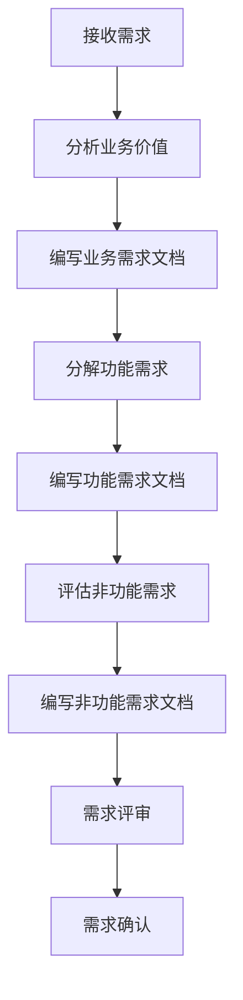
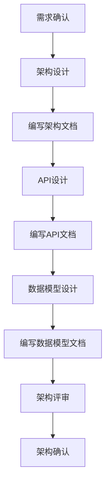
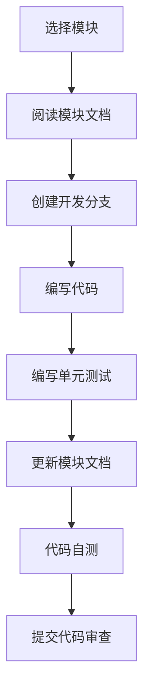
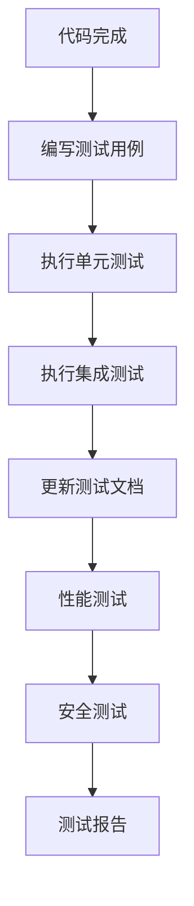
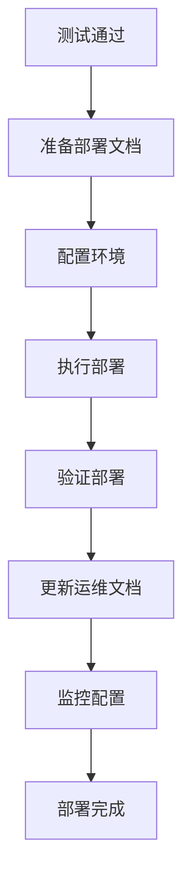
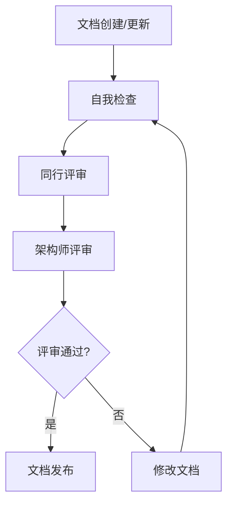

# ⚠️ 每日强制提醒 ⚠️
**在进行任何开发工作前，必须：**
1. **阅读并遵循本MASTER.md的所有流程**
2. **检查现有文档，禁止创建重复文档**
3. **按照既定工作流程执行，不得跳过步骤**
4. **文档驱动开发 = 先文档后代码，严格执行**

---

<!--
文档说明：
- 内容：文档驱动开发的总纲，定义完整的开发流程和文档规范
- 使用方法：所有开发人员必读，项目管理参考，文档驱动开发的核心指南
- 更新方法：流程变更时由项目负责人更新
- 引用关系：被所有开发相关文档引用，是项目的核心流程文档
- 更新频率：开发流程优化时更新
-->

# 🎯 文档驱动开发总纲 (MASTER)

> **📚 Documentation-Driven Development (DDD) 核心指南**  
> **所有技术决策和开发活动的唯一入口和检查点**

## 🌟 文档驱动开发理念

### 核心原则
1. **文档先行**: 编码前先写文档，确保思路清晰
2. **文档完整**: 文档覆盖设计、实现、测试、部署全流程
3. **文档同步**: 代码变更必须同步更新文档
4. **文档可用**: 文档必须准确、最新、易读
5. **文档驱动**: 文档是决策依据，不是事后补充

### 价值主张
- **提高开发效率**: 减少沟通成本，避免重复工作
- **保证代码质量**: 设计文档驱动更好的架构
- **降低维护成本**: 完整文档简化后期维护
- **促进团队协作**: 统一的文档标准提升协作效率
- **支持知识传承**: 文档是团队知识资产

## 🚨 强制检查点

### 开发生命周期检查点
你必须在以下时刻参考本文档和相关文档：

#### 1. 📋 需求分析阶段
- [ ] 阅读 [业务需求文档](requirements/business.md)
- [ ] 阅读 [功能需求文档](requirements/functional.md)
- [ ] 阅读 [非功能需求文档](requirements/non-functional.md)
- [ ] 确认需求理解无误，有疑问及时沟通

#### 2. 🏗️ 架构设计阶段
- [ ] 阅读 [系统架构总览](architecture/overview.md)
- [ ] 阅读 [API设计规范](architecture/api-standards.md)
- [ ] 阅读 [数据模型规范](architecture/data-models.md)
- [ ] 如涉及安全，阅读 [安全架构](architecture/security.md)
- [ ] 编写模块设计文档

#### 3. 💻 代码开发阶段
- [ ] 遵循 [开发规范](development/standards.md)
- [ ] 参考 [模块文档模板](templates/module-template.md)
- [ ] 编写符合 [API规范](architecture/api-standards.md) 的接口
- [ ] 同步更新模块文档

#### 4. 🧪 测试阶段
- [ ] 遵循 [测试规范](development/testing.md)
- [ ] 更新测试文档
- [ ] 确保测试覆盖率达标

#### 5. 🚀 部署阶段
- [ ] 阅读 [部署指南](operations/deployment.md)
- [ ] 配置 [环境变量](operations/environment.md)
- [ ] 更新部署文档

#### 6. 📊 运维阶段
- [ ] 监控关键指标
- [ ] 更新 [状态文档](status/status.md)
- [ ] 记录 [问题和解决方案](status/issues-tracking.md)

## � 文档创建强制检查流程

### 创建任何文档前必须执行的检查

#### ⚠️ 防止重复文档的强制检查
**在创建任何新文档之前，必须严格执行以下检查**：

1. **📂 检查目标目录**
   ```bash
   # 检查目标目录下是否已有类似文档
   ls docs/目标目录/
   ```

2. **🔍 搜索相同功能的文档**
   ```bash
   # 在整个docs目录中搜索相关关键词
   grep -r "关键词" docs/
   ```

3. **📋 检查README文档**
   - 检查目标目录的README.md是否已存在
   - 检查父目录的README.md是否已覆盖该功能

4. **🔄 检查现有文档结构**
   ```bash
   # 列出相关目录结构
   tree docs/相关目录/
   ```

#### ✅ 文档创建决策流程
1. **如果找到相同功能文档** → 更新现有文档，不创建新文档
2. **如果找到类似功能文档** → 评估是否可以合并，优先合并
3. **如果确实需要新文档** → 确保文件名清晰，避免未来冲突
4. **创建后立即更新** → 相关的README.md和导航文档

#### ❌ 绝对禁止的行为
- **禁止不检查就创建文档**
- **禁止创建功能重复的文档**  
- **禁止创建名称相似的文档**
- **禁止事后发现重复再删除**

## �📋 文档驱动开发工作流程

### Phase 1: 文档准备 🔍

#### 1.1 需求分析文档化


**输出文档**:
- `requirements/business.md` - 业务需求和价值说明
- `requirements/functional.md` - 详细功能需求
- `requirements/non-functional.md` - 性能、安全等需求

#### 1.2 架构设计文档化


**输出文档**:
- `architecture/overview.md` - 系统架构总览
- `architecture/api-standards.md` - API设计规范
- `architecture/data-models.md` - 数据模型设计
- `modules/{module}/overview.md` - 模块设计文档

### Phase 2: 开发实现 💻

#### 2.1 模块开发工作流


#### 2.2 代码开发规范
**开发前检查**:
- [ ] 模块设计文档是否完整？
- [ ] API接口是否已定义？
- [ ] 数据模型是否已确认？
- [ ] 依赖关系是否清晰？

**开发中要求**:
- [ ] 遵循代码规范
- [ ] 添加充分的注释
- [ ] 编写单元测试
- [ ] 同步更新文档

**开发后检查**:
- [ ] 代码是否符合规范？
- [ ] 测试是否通过？
- [ ] 文档是否已更新？
- [ ] API文档是否准确？

### Phase 3: 测试验证 🧪

#### 3.1 测试文档化流程


**测试文档要求**:
- [ ] 测试用例完整覆盖功能点
- [ ] 性能测试结果记录
- [ ] 安全测试结果记录
- [ ] 问题和修复记录

### Phase 4: 部署上线 🚀

#### 4.1 部署文档化流程


**部署文档要求**:
- [ ] 部署步骤文档化
- [ ] 环境配置记录
- [ ] 回滚方案准备
- [ ] 监控指标定义

## 📊 文档质量管理

### 文档质量标准
1. **完整性**: 覆盖设计、实现、测试、部署
2. **准确性**: 与实际代码实现保持一致
3. **可读性**: 结构清晰，语言简洁
4. **可维护性**: 易于更新和扩展
5. **可追溯性**: 变更历史清晰

### 文档评审流程


### 文档维护责任
- **需求文档**: 产品经理负责
- **架构文档**: 架构师负责
- **模块文档**: 模块负责人负责
- **API文档**: 接口开发者负责
- **运维文档**: 运维团队负责

## 🛠️ 文档工具链

### 推荐工具栈
1. **编写工具**: VS Code + Markdown All in One
2. **版本管理**: Git + GitHub
3. **协作平台**: GitHub Issues + Pull Requests
4. **图表工具**: Mermaid + PlantUML
5. **API文档**: Swagger/OpenAPI
6. **部署文档**: GitBook 或 MkDocs

### 工具配置
参考 [开发工具指南](development/tools.md) 配置文档编写环境。

## 📈 文档驱动的项目管理

### Sprint规划中的文档
1. **Sprint开始**: 确认所需文档完整性
2. **Sprint进行**: 同步更新开发文档
3. **Sprint结束**: 完善所有相关文档
4. **Sprint回顾**: 评估文档质量和效果

### 文档与代码同步策略
- **原则**: 文档变更和代码变更在同一PR中
- **检查**: PR必须包含相关文档更新
- **验证**: CI/CD检查文档链接有效性

## 🎯 团队协作规范

### 沟通原则
1. **文档优先**: 技术讨论先查阅相关文档
2. **问题记录**: 技术问题和解决方案文档化
3. **知识共享**: 重要技术决策文档化
4. **评审文化**: 定期文档评审和改进

### 角色职责
| 角色 | 文档职责 |
|------|----------|
| 产品经理 | 业务需求、功能需求文档 |
| 架构师 | 架构设计、技术标准文档 |
| 开发工程师 | 模块设计、API、代码文档 |
| 测试工程师 | 测试策略、测试结果文档 |
| 运维工程师 | 部署、运维、监控文档 |
| 项目经理 | 项目状态、里程碑文档 |

## 📋 常用检查清单

### 新功能开发检查清单
```markdown
开发前:
- [ ] 阅读相关需求文档
- [ ] 理解架构设计约束
- [ ] 确认API设计规范
- [ ] 创建/更新模块文档

开发中:
- [ ] 遵循代码规范
- [ ] 编写充分测试
- [ ] 更新API文档
- [ ] 记录重要决策

开发后:
- [ ] 代码审查通过
- [ ] 测试覆盖率达标
- [ ] 文档更新完成
- [ ] 部署文档准备
```

### 文档质量检查清单
```markdown
内容质量:
- [ ] 文档头部信息完整
- [ ] 目标读者明确
- [ ] 内容逻辑清晰
- [ ] 示例代码可执行

格式质量:
- [ ] 遵循文档规范
- [ ] 标题层级正确
- [ ] 链接有效可访问
- [ ] 图表清晰易懂

技术质量:
- [ ] 技术信息准确
- [ ] 与代码实现一致
- [ ] 版本信息正确
- [ ] 依赖关系清晰
```

## 🔄 持续改进机制

### 文档改进流程
1. **收集反馈**: 团队成员使用文档时的反馈
2. **识别问题**: 定期分析文档使用痛点
3. **制定改进**: 优化文档结构和内容
4. **实施改进**: 更新文档和流程
5. **效果评估**: 评估改进效果

### 文档指标跟踪
- **文档完整度**: 各模块文档完成情况
- **文档更新频率**: 文档与代码同步程度
- **文档使用率**: 团队成员文档使用情况
- **问题解决效率**: 通过文档解决问题的效率

## 🔗 核心文档导航

### 📋 需求和规划
- [业务需求](requirements/business.md) - 项目业务目标和价值
- [功能需求](requirements/functional.md) - 详细功能规格说明
- [非功能需求](requirements/non-functional.md) - 性能、安全、合规要求

### 🏗️ 架构和设计  
- [系统架构总览](architecture/overview.md) - 整体技术架构
- [API设计规范](architecture/api-standards.md) - 接口设计标准
- [数据模型规范](architecture/data-models.md) - 数据设计标准
- [安全架构](architecture/security.md) - 安全设计指南

### 📦 模块文档
- [模块总览](modules/README.md) - 所有模块的导航
- [用户认证模块](modules/user-auth/overview.md)
- [购物车模块](modules/shopping-cart/overview.md)
- [订单管理模块](modules/order-management/overview.md)
- [更多模块...](modules/)

### 💻 开发指南
- [开发规范](development/standards.md) - 代码和开发标准
- [测试指南](development/testing.md) - 测试策略和规范
- [工作流程](development/workflow.md) - 开发工作流程
- [开发工具](development/tools.md) - 工具配置指南
- [文档规范](development/documentation-standards.md) - 文档写作标准

### 🚀 运维部署
- [部署指南](operations/deployment.md) - 系统部署流程
- [环境配置](operations/environment.md) - 环境变量管理
- [运维手册](operations/README.md) - 运维操作指南

### 📊 项目状态
- [项目状态总览](status/status.md) - 项目整体进度
- [当前冲刺](status/current-sprint.md) - 当前Sprint状态
- [问题跟踪](status/issues-tracking.md) - 问题管理和解决
- [里程碑进度](status/milestones.md) - 项目里程碑跟踪

### 📚 模板和工具
- [文档模板](templates/) - 各类文档的标准模板
- [代码示例](templates/) - 常用代码示例库

---

## 🎖️ 文档驱动开发的成功标志

当我们的项目达到以下状态时，就实现了真正的文档驱动开发：

✅ **新团队成员可以通过文档快速上手**  
✅ **技术决策有完整的文档依据**  
✅ **代码变更必然伴随文档更新**  
✅ **问题解决方案可以在文档中找到**  
✅ **项目知识不依赖特定人员**  

---

📝 **记住**: 文档不是开发的负担，而是开发的利器。好的文档是项目成功的基石！
