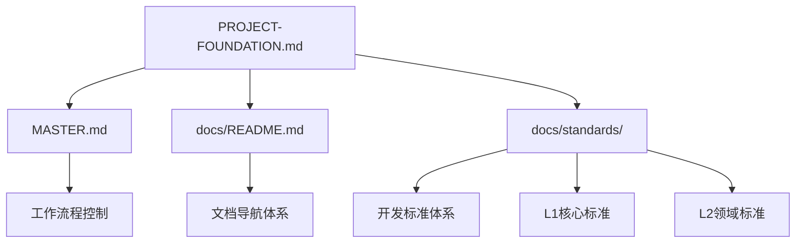

<!--version info: v1.0.0, created: 2025-09-24, level: FOUNDATION, dependencies: ADR-003-->

# 项目基础设定 (PROJECT FOUNDATION)

> **文档性质**: 项目宪法级基础设定  
> **权威级别**: 最高权威 (FOUNDATION级)  
> **变更控制**: 任何修改需经ADR决策流程  
> **关联决策**: [ADR-003 文档架构重构决策](docs/adr/ADR-003-document-architecture-restructure.md)  
> **维护责任**: 系统架构师  
> **更新频率**: 仅在重大架构调整时变更  

# 🎯 系统设计最高指导原则

## 🔄 软件开发流程与权威分工体系

### **开发流程正确顺序与职责边界**

#### **阶段1: 需求分析** (业务领域权威)
- **核心职责**: 定义系统的业务价值和功能范围 (解决WHAT问题)
- **权威输出**: 业务需求、功能需求、非功能需求、验收标准
- **严格边界**: 🚫 不涉及模块名称、技术方案、架构设计、实现细节
- **责任主体**: 产品经理、业务分析师、用户代表

#### **阶段2: 架构设计** ⭐️ **技术设计最高权威**
- **核心职责**: 定义系统的技术组织和构建方案 (解决HOW问题)
- **权威输出**: 30业务模块定义、技术选型原则、分层架构、集成策略
- **技术边界**: ✅ 模块命名权威、功能边界权威、技术架构唯一权威来源
- **责任主体**: 系统架构师、技术负责人

#### **阶段3: 详细设计** (实现方案权威)
- **核心职责**: 定义每个架构组件的具体实现方案 (解决DETAILS问题)
- **权威输出**: API规范、数据模型、算法设计、接口定义、配置方案
- **设计边界**: ✅ 基于架构定义进行具体实现设计，不得违反架构约束
- **责任主体**: 高级开发工程师、模块负责人

#### **阶段4: 编码实现** (功能交付)
- **核心职责**: 按照详细设计实现功能代码
- **实施依据**: 严格遵循架构定义和详细设计规范
- **责任主体**: 开发工程师

#### **阶段5: 测试验证** (质量保证)
- **核心职责**: 验证实现符合需求和设计要求
- **验证范围**: 功能正确性、架构合规性、质量标准符合性
- **责任主体**: 测试工程师、开发工程师

## 📂 文档体系权威分工与内容边界

### **需求分析层** `docs/requirements/` (业务需求权威)
```
权威职责: 业务需求的唯一权威定义
内容组成:
├── functional.md     - 功能需求、用户故事、业务场景
├── business.md       - 业务流程、商业逻辑、业务规则
└── non-functional.md - 性能、安全、可用性等技术要求

内容边界:
✅ 权威定义: "系统需要支持用户登录"、"订单应包含商品信息"
🚫 严格禁止: "用户认证模块"、"订单管理模块"、技术实现方案

依赖关系: 仅依赖PROJECT-FOUNDATION.md，被架构设计层引用
权威级别: 业务需求最高权威，技术实现必须满足业务需求
```

### **架构设计层** `docs/architecture/` ⭐️ **技术架构最高权威**
```
权威职责: 技术架构和模块定义的最高权威
内容组成:
├── business-architecture.md     - 6业务域、30业务模块权威定义
├── application-architecture.md  - 5层技术架构、模块组织方案
├── data-architecture.md         - 数据架构、存储策略
├── infrastructure-architecture.md - 基础设施、部署架构
└── overview.md                  - 技术选型原则、架构决策框架

内容边界:
✅ 权威定义: 模块名称、功能边界、技术选型、架构分层
✅ 技术决策: 框架选择、集成方式、演进策略、选型理由
🚫 实现细节: 具体API设计、详细数据模型、配置代码

依赖关系: 引用需求层，被详细设计层和标准层引用
权威级别: 技术实现的最高权威，覆盖所有下级技术文档
```

### **详细设计层** `docs/design/` (实现规范权威)
```
权威职责: 具体实现方案的权威定义
内容组成:
├── modules/     - 各业务模块详细设计规范(30个模块)
├── system/      - 系统级技术组件详细设计
├── api/         - API接口详细规范和实施记录
└── database/    - 数据库详细设计和模型定义

内容边界:
✅ 权威定义: API设计、数据模型、算法实现、接口规范
✅ 实现方案: 基于架构的具体技术实现和配置方案
🚫 架构决策: 不能修改架构层定义的模块边界和技术选型

依赖关系: 严格基于架构设计层定义进行细化，引用标准层规范
权威级别: 实现层面权威，受架构层约束，必须符合标准层要求
```

### **开发标准层** `docs/standards/` (质量保证横向权威)
```
权威职责: 开发质量和一致性标准的权威定义
内容组成:
├── technology-stack-standards.md - 技术栈版本和配置标准
├── naming-conventions-standards.md - 命名规范标准
├── code-standards.md - 代码质量和风格标准
├── api-standards.md - API设计和文档标准
├── database-standards.md - 数据库设计和操作标准
├── testing-standards.md - 测试策略和执行标准
└── document-management-standards.md - 文档管理标准

内容边界:
✅ 权威定义: 编码规范、质量标准、流程规范、技术约束
✅ 约束规则: 对架构实现的质量约束和一致性要求
🚫 架构决策: 不能定义模块边界、技术架构选择

依赖关系: 横向约束所有层级，为架构和设计层提供质量保证
权威级别: 质量保证权威，与其他层级形成交叉约束关系
```

## 🔗 文档权威等级与依赖关系

### **权威等级金字塔**
```
                    PROJECT-FOUNDATION.md
                    (项目宪法级最高权威)
                           ▲
                  ┌────────┼────────┐
                  │        │        │
            需求分析层   架构设计层   标准层
            (业务权威)   (技术权威)   (质量权威)
                  │        │        │
                  └────────┼────────┘
                           ▼
                     详细设计层
                    (实现规范权威)
                           ▼
                      测试验证层
                     (质量验证权威)
```

### **依赖关系约束矩阵**
| 文档层级 | 可引用层级 | 禁止引用层级 | 权威关系 |
|---------|-----------|------------|----------|
| **需求分析层** | PROJECT-FOUNDATION.md | 架构、设计、标准层 | 业务需求最高权威 |
| **架构设计层** | 需求层、PROJECT-FOUNDATION.md | 详细设计层 | 技术架构最高权威 |
| **详细设计层** | 需求层、架构层、标准层 | 无 | 受架构约束的实现权威 |
| **标准层** | PROJECT-FOUNDATION.md | 需求、架构、设计层 | 质量标准横向约束权威 |

## ⚖️ 权威冲突解决机制

1. **PROJECT-FOUNDATION.md** > 所有其他文档 (宪法级绝对权威)
2. **需求分析** vs **架构设计**: 需求定义WHAT，架构定义HOW，职责互补无冲突
3. **架构设计** > **详细设计**: 架构约束实现，实现不得违反架构边界
4. **标准层** ⊥ **所有层**: 横向质量约束，与其他层级形成交叉制约关系
5. **冲突解决流程**: 通过ADR决策记录机制解决重大权威冲突

---

## 🎯 基础设定说明

### 文档定位
本文档定义项目的基础架构设定，包括目录结构、文档依赖关系、基本规则等不可轻易调整的核心要素。所有其他文档和标准都必须遵循本文档的定义。

### 权威性声明
- **最高优先级**: 本文档具有项目最高权威性，覆盖其他所有标准文档
- **基础宪法**: 定义项目的基本架构和不可变规则
- **变更控制**: 任何修改必须通过ADR决策记录流程
- **全局影响**: 本文档的变更将影响整个项目的架构和开发流程

## 🏗️ 项目目录结构权威定义

### 根目录强制结构 (不可变更)
```tree
ecommerce_platform/
├── 📂 app/                    # 应用程序源码
├── 📂 docs/                   # 技术文档体系  
├── 📂 tests/                  # 测试代码体系
├── 📂 scripts/                # DevOps自动化脚本
├── 📂 logs/                   # 运行时日志文件
├── 📂 alembic/                # 数据库版本迁移
├── 📄 PROJECT-FOUNDATION.md   # 本文档 (项目基础设定)
├── 📄 MASTER.md              # AI开发控制文档
├── 📄 README.md              # 项目入口和概览文档
├── 📄 requirements.txt        # Python生产环境依赖
├── 📄 requirements_dev.txt    # Python开发环境依赖
├── 📄 pyproject.toml         # 项目配置和构建设置  
├── 📄 docker-compose.yml     # 容器编排配置
├── 📄 alembic.ini            # 数据库迁移工具配置
└── 📄 start.ps1              # 项目启动脚本
```

### 目录职责权威分配

| 目录路径 | 核心职责 | 允许内容 | 🚫 严格禁止 | 管理标准 |
|---------|---------|---------|-------------|----------|
| `app/` | 应用程序源代码 | Python模块、业务逻辑、配置文件 | 测试代码、文档文件、日志、临时文件 | code-standards.md |
| `docs/` | 技术文档和规范 | Markdown文档、架构图、设计文档 | 源代码、可执行文件、日志、临时文件 | document-management-standards.md |
| `tests/` | 测试代码和测试数据 | 测试脚本、Mock数据、测试配置 | 生产代码、业务逻辑、用户文档 | testing-standards.md |
| `scripts/` | 自动化脚本和工具 | 部署脚本、构建工具、检查脚本 | 业务逻辑、测试代码、用户文档 | scripts-standards.md |
| `logs/` | 应用运行时日志 | 日志文件、错误报告、监控数据 | 源代码、配置文件、用户数据 | logging-standards.md |
| `alembic/` | 数据库迁移脚本 | 迁移脚本、版本文件、环境配置 | 业务逻辑、测试数据、用户文档 | database-standards.md |

### 根目录文件权威定义

| 文件名 | 用途说明 | 内容要求 | 🚫 严格禁止 |
|--------|---------|---------|------------|
| `PROJECT-FOUNDATION.md` | 项目基础设定 (本文档) | 项目架构、基本规则、权威定义 | 删除、重命名、未授权修改 |
| `MASTER.md` | AI开发控制和流程管理 | 工作流程、检查点、AI规则 | 删除、重命名、未授权修改 |
| `README.md` | 项目入口和概览介绍 | 项目介绍、快速开始、架构概述 | 包含详细技术实施细节 |
| `requirements.txt` | 生产环境Python依赖 | 固定版本依赖列表 | 包含开发工具依赖 |
| `requirements_dev.txt` | 开发环境额外依赖 | 测试、构建、调试工具依赖 | 包含生产环境依赖 |
| `pyproject.toml` | 项目配置和元数据 | 构建配置、工具配置、项目元信息 | 包含敏感信息或密钥 |
| `docker-compose.yml` | 容器化部署配置 | 服务定义、网络配置、卷挂载 | 包含生产环境密钥 |
| `alembic.ini` | 数据库迁移配置 | 迁移路径、日志配置、连接模板 | 包含真实数据库连接信息 |
| `start.ps1` | 项目启动脚本 | 环境启动、服务启动命令 | 包含敏感配置信息 |

## 📊 应用程序结构标准

### app/ 目录标准结构 (垂直切片架构)
```tree
app/
├── main.py                    # FastAPI应用入口点 (唯一入口)
├── 📂 core/                   # 核心基础设施组件
│   ├── database.py            # 数据库连接和会话管理
│   ├── redis_client.py        # Redis缓存客户端
│   ├── auth.py               # 认证中间件和JWT处理
│   ├── security.py           # 安全相关工具和验证
│   └── __init__.py           # 核心组件导出
├── 📂 modules/               # 业务功能模块 (垂直切片)
│   ├── user_auth/            # 用户认证模块
│   ├── product_catalog/      # 商品管理模块
│   ├── shopping_cart/        # 购物车模块
│   ├── order_management/     # 订单管理模块
│   ├── payment_service/      # 支付服务模块
│   ├── inventory_management/ # 库存管理模块
│   ├── member_system/        # 会员系统模块
│   ├── logistics_management/ # 物流管理模块
│   ├── notification_service/ # 通知服务模块
│   ├── quality_control/      # 质量控制模块
│   ├── recommendation_system/ # 推荐系统模块
│   ├── risk_control_system/  # 风控系统模块
│   ├── social_features/      # 社交功能模块
│   ├── supplier_management/  # 供应商管理模块
│   ├── marketing_campaigns/  # 营销活动模块
│   ├── customer_service_system/ # 客服系统模块
│   ├── data_analytics_platform/ # 数据分析平台模块
│   ├── distributor_management/  # 经销商管理模块
│   └── batch_traceability/   # 批次溯源模块
├── 📂 shared/                # 跨模块共享组件 (最小化原则)
│   ├── base_models.py        # ORM基础类和通用字段
│   ├── api_schemas.py        # 通用API响应模式
│   ├── exceptions.py         # 全局异常类定义
│   ├── constants.py          # 全局常量定义
│   └── __init__.py          # 共享组件导出
└── 📂 adapters/              # 外部系统适配器
    ├── payment/              # 支付服务适配器
    ├── blockchain/           # 区块链服务适配器 (待开发)
    ├── ai/                   # AI服务适配器 (待开发)  
    └── __init__.py          # 适配器包导出
```

### 业务模块标准结构 (强制要求)
每个业务模块必须遵循以下垂直切片结构：
```tree
modules/{module_name}/
├── __init__.py              # 模块导出接口
├── router.py               # API路由定义 (FastAPI路由)
├── service.py              # 业务逻辑层 (核心业务实现)
├── models.py               # 数据模型层 (SQLAlchemy模型)
├── schemas.py              # API模式层 (Pydantic模型)
├── dependencies.py         # 依赖注入 (模块特定依赖)
├── exceptions.py           # 模块异常 (可选，复杂模块使用)
└── README.md              # 模块说明文档
```

## 📋 文档体系架构标准

### docs/ 目录四层文档体系
```tree
docs/
├── 📚 requirements/         # 需求层：纯业务需求
│   ├── README.md            # 需求层导航
│   ├── functional.md        # 功能需求规范
│   ├── business.md          # 业务需求规范
│   └── non-functional.md    # 非功能需求规范
├── 🏗️ architecture/         # 架构层：系统整体设计原则
│   ├── README.md            # 架构层导航
│   ├── overview.md          # 架构总览和设计原则
│   ├── application-architecture.md  # 应用架构设计
│   ├── business-architecture.md     # 业务架构设计
│   ├── data-architecture.md         # 数据架构设计
│   ├── infrastructure-architecture.md # 基础设施架构
│   ├── migration-roadmap.md         # 微服务演进路线图
│   ├── integration.md       # 第三方集成方案
│   ├── performance-architecture.md  # 性能架构设计
│   ├── security-architecture.md     # 安全架构设计
│   └── _archive/            # 架构文档归档
├── 🎨 design/               # 设计层：具体详细设计
│   ├── README.md            # 设计层导航
│   ├── modules/             # 业务模块详细设计
│   ├── system/              # 系统级设计
│   └── components/          # 技术组件详细设计
├── 📏 standards/            # 标准层：L0-L1-L2开发标准体系
│   ├── README.md            # 标准文档导航 (功能扩展版)
│   ├── naming-conventions-standards.md # L1核心：命名规范权威标准
│   ├── workflow-standards.md           # L1核心：工作流程标准
│   ├── api-standards.md            # L2领域：API设计规范
│   ├── code-standards.md           # L2领域：代码质量规范
│   ├── database-standards.md       # L2领域：数据库设计规范
│   ├── deployment-standards.md     # L2领域：容器化部署规范
│   ├── document-management-standards.md   # L2领域：文档管理规范
│   ├── performance-standards.md    # L2领域：性能标准规范
│   ├── scripts-standards.md        # L2领域：DevOps脚本规范
│   ├── technology-stack-standards.md # L2领域：技术栈标准规范
│   ├── testing-standards.md        # L2领域：测试规范
│   ├── logging-standards.md        # L2领域：日志管理规范
│   └── openapi.yaml                # API契约定义
├── 🛠️ tools/                # 开发工具指南
├── 🚀 operations/           # 运维部署层
├── 📊 planning/             # 项目管理层
├── 🗂️ adr/                  # 架构决策记录
├── 📊 status/               # 状态管理层
├── 📝 templates/            # 文档模板库
├── 📊 analysis/             # 分析报告归档
└── 🗂️ _archive/             # 废弃文档备份
```

## 🔗 文档依赖关系和技术规则

### 文档层次架构


### 文档引用层级规则

**向上引用 (允许)**：
- ✅ 任何文档 → PROJECT-FOUNDATION.md (基础设定)
- ✅ 任何文档 → MASTER.md (工作流程)
- ✅ L2标准 → L1标准 (核心规范)
- ✅ 实施文档 → 标准文档 (规范依赖)

**向下引用 (谨慎)**：
- ⚠️ 标准文档 → 具体实施 (需要抽象化，仅作示例)
- ⚠️ 架构文档 → 模块文档 (仅作参考，不形成依赖)

**平级引用 (正常)**：
- ✅ 同层级文档间的协作引用
- ✅ 模块间的接口文档引用

**禁止引用**：
- ❌ 循环依赖引用
- ❌ 跨层级的直接依赖 (需通过中间层)

### 引用路径标准格式
```markdown
<!-- 标准引用格式 -->
- [项目基础设定](PROJECT-FOUNDATION.md) - 项目架构权威定义
- [MASTER文档](../MASTER.md) - AI工作流程控制
- [文档导航](docs/README.md) - 统一文档导航中心
- [命名规范](docs/standards/naming-conventions-standards.md) - L1核心标准

<!-- 禁止的引用格式 -->
❌ [示例](example.md) - 缺少完整路径
❌ [示例](/absolute/path/example.md) - 绝对路径
❌ 点击这里查看示例 - 无具体链接
```

## 🚫 项目基本规则和禁止事项

### 根目录层面严格禁止
- ❌ 创建未在本文档定义的目录或文件
- ❌ 修改根目录强制文件的文件名或位置
- ❌ 在根目录放置临时文件、日志文件、缓存文件
- ❌ 创建语言特定的配置目录 (如: .vscode/, .idea/)
- ❌ 放置个人配置文件或开发环境特定文件

### 跨目录污染严格禁止
- ❌ 在 `app/` 目录中放置测试相关文件  
- ❌ 在 `tests/` 目录中放置生产业务代码
- ❌ 在 `docs/` 目录中放置可执行文件或源码
- ❌ 在 `scripts/` 目录中放置业务逻辑代码
- ❌ 在 `logs/` 目录中放置配置文件或源码
- ❌ 在 `alembic/` 目录中放置非迁移相关文件

### 模块边界严格禁止  
- ❌ 业务模块间直接相互导入 (必须通过shared层)
- ❌ 跨模块共享API schemas (每个模块独立定义)
- ❌ 在 `shared/` 中放置业务逻辑代码
- ❌ 适配器直接访问业务模块内部实现

### 文档管理严格禁止
- ❌ 绕过 docs/README.md 直接查找标准文档
- ❌ 修改标准文档不更新相关引用
- ❌ 创建重复功能的导航文档
- ❌ 不经ADR流程修改本基础设定文档

## 📋 业务模块命名映射标准

### 权威命名对照表
| 🏷️ 业务概念名 | 🔧 技术实现名 | 📁 目录路径 | 🌐 API路径前缀 | 🗄️ 数据库表前缀 |
|---------------|---------------|------------|---------------|----------------|
| user-auth | user_auth | app/modules/user_auth/ | /auth/* | user_, auth_ |
| shopping-cart | shopping_cart | app/modules/shopping_cart/ | /cart/* | cart_, shopping_ |  
| product-catalog | product_catalog | app/modules/product_catalog/ | /products/* | product_, catalog_ |
| order-management | order_management | app/modules/order_management/ | /orders/* | order_, payment_ |
| payment-service | payment_service | app/modules/payment_service/ | /payments/* | payment_, transaction_ |
| inventory-management | inventory_management | app/modules/inventory_management/ | /inventory/* | inventory_, stock_ |
| member-system | member_system | app/modules/member_system/ | /members/* | member_, membership_ |
| logistics-management | logistics_management | app/modules/logistics_management/ | /logistics/* | logistics_, shipping_ |
| notification-service | notification_service | app/modules/notification_service/ | /notifications/* | notification_, message_ |
| quality-control | quality_control | app/modules/quality_control/ | /quality/* | quality_, inspection_ |
| recommendation-system | recommendation_system | app/modules/recommendation_system/ | /recommendations/* | recommendation_, suggest_ |
| risk-control-system | risk_control_system | app/modules/risk_control_system/ | /risk/* | risk_, control_ |
| social-features | social_features | app/modules/social_features/ | /social/* | social_, community_ |
| supplier-management | supplier_management | app/modules/supplier_management/ | /suppliers/* | supplier_, vendor_ |
| marketing-campaigns | marketing_campaigns | app/modules/marketing_campaigns/ | /campaigns/* | campaign_, promotion_ |
| customer-service-system | customer_service_system | app/modules/customer_service_system/ | /support/* | support_, ticket_ |
| data-analytics-platform | data_analytics_platform | app/modules/data_analytics_platform/ | /analytics/* | analytics_, metric_ |
| distributor-management | distributor_management | app/modules/distributor_management/ | /distributors/* | distributor_, channel_ |
| batch-traceability | batch_traceability | app/modules/batch_traceability/ | /traceability/* | batch_, trace_ |

## ✅ 验证检查清单

### 项目结构验证
- [ ] 根目录只包含本文档定义的目录和文件
- [ ] 所有强制目录都已创建且包含README.md
- [ ] 没有创建标准外的自定义目录  
- [ ] 配置文件使用标准命名和格式
- [ ] 无临时文件、缓存文件、个人配置文件

### 目录职责验证  
- [ ] `app/` 只包含应用程序源码，无测试和文档
- [ ] `docs/` 只包含文档，无源码和可执行文件
- [ ] `tests/` 只包含测试代码，无生产业务逻辑
- [ ] `scripts/` 只包含自动化脚本，无业务逻辑
- [ ] `logs/` 只包含日志文件，无源码和配置  
- [ ] `alembic/` 只包含迁移脚本，无业务代码

### 模块结构验证
- [ ] 所有业务模块遵循垂直切片标准结构
- [ ] 模块命名符合映射表定义
- [ ] 模块间无直接相互导入
- [ ] API schemas 在各模块内独立定义
- [ ] 共享组件最小化，无业务逻辑

### 文档依赖验证
- [ ] 所有文档引用路径使用标准格式
- [ ] 无循环依赖关系
- [ ] 引用层级符合规则要求
- [ ] 文档变更时同步更新相关引用

---

## 🔒 变更控制和维护说明

### 变更控制级别
- **CRITICAL**: 目录结构、文件命名、基本规则 - 需经ADR流程
- **MAJOR**: 业务模块映射、依赖关系规则 - 需架构评审  
- **MINOR**: 验证清单、说明文档 - 可直接修改

### 维护责任
- **主要维护者**: 系统架构师
- **变更审批者**: 技术负责人 + 产品负责人
- **同步执行者**: 全体开发人员

### 自动化验证工具
- **结构验证**: `scripts/validate_project_structure.ps1`
- **依赖检查**: `scripts/validate_document_dependencies.ps1` 
- **引用验证**: `scripts/validate_document_references.ps1`

---

**📋 检查点标记**: [CHECK:ARCH-001] [CHECK:DOC-006]  
**🔗 关联决策**: [ADR-003](docs/adr/ADR-003-document-architecture-restructure.md)  
**📅 创建时间**: 2025-09-24  
**👤 维护责任**: 系统架构师  
**🔄 下次审查**: 2025-12-24