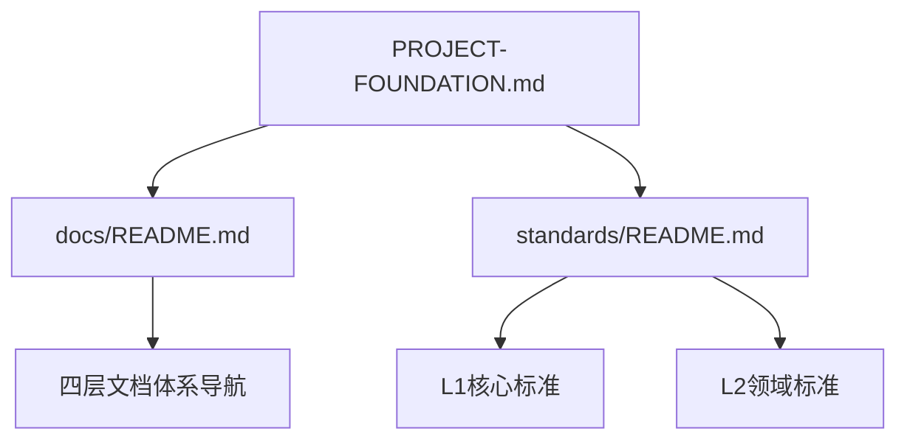

<!--version info: v1.1.0, created: 2025-09-24, level: NAVIGATION, dependencies: PROJECT-FOUNDATION.md-->

# 技术文档导航中心 

> **文档性质**: 统一技术文档导航系统  
> **权威基础**: [项目基础设定 (PROJECT-FOUNDATION.md)](../PROJECT-FOUNDATION.md)  
> **工作流程**: [AI开发控制 (MASTER.md)](../MASTER.md)  
> **更新时间**: 2025-09-24  
> **关联决策**: [ADR-003 文档架构重构决策](adr/ADR-003-document-architecture-restructure.md)  

**🎯 导航定位**: 电商平台技术文档的统一导航中心，基于PROJECT-FOUNDATION.md定义的四层文档体系，为开发团队提供快速的文档查找和访问功能。

---

## 🚀 核心快速入口

### 🔑 项目基础 (必读)
- **[📖 PROJECT-FOUNDATION.md](../PROJECT-FOUNDATION.md)** - 项目基础设定 (最高权威)
- **[🔧 MASTER.md](../MASTER.md)** - AI开发流程控制
- **[🏠 项目概览 README.md](../README.md)** - 项目入口和快速开始

### ⭐ 标准规范体系 (开发必备)
- **[📋 标准文档导航 (standards/README.md)](standards/README.md)** - L0-L1-L2标准体系导航
- **[🏗️ 项目基础设定](../PROJECT-FOUNDATION.md)** - FOUNDATION级：项目架构权威定义
- **[📝 命名规范标准](standards/naming-conventions-standards.md)** - L1核心：统一命名规则
- **[🔌 API设计规范](standards/api-standards.md)** - L2领域：API接口标准
- **[💻 代码质量规范](standards/code-standards.md)** - L2领域：代码开发标准

### 🛠️ 开发工具和环境
- **[🔧 开发工具指南 (tools/README.md)](tools/README.md)** - 工具使用导航
- **[📜 开发脚本手册](tools/scripts-usage-manual.md)** - DevOps脚本详细使用
- **[🚀 环境配置指南](operations/development-setup.md)** - 开发环境快速搭建

---

## 📁 技术文档四层体系架构 

> **基础架构定义**: 基于 [PROJECT-FOUNDATION.md](../PROJECT-FOUNDATION.md) 四层文档体系

### 📊 文档体系结构图
```tree
docs/
├── 📚 requirements/         # 需求层：纯业务需求
│   ├── README.md            # 需求层导航
│   ├── functional.md        # 功能需求规范  
│   ├── business.md          # 业务需求规范
│   └── non-functional.md    # 非功能需求规范
├── 🏗️ architecture/         # 架构层：系统整体设计原则
│   ├── README.md            # 架构层导航
│   ├── overview.md          # 架构总览和设计原则
│   ├── application-architecture.md    # 应用架构设计
│   ├── business-architecture.md       # 业务架构设计
│   ├── data-architecture.md           # 数据架构设计
│   ├── infrastructure-architecture.md # 基础设施架构
│   ├── migration-roadmap.md           # 微服务演进路线图
│   ├── integration.md                 # 第三方集成方案
│   ├── performance-architecture.md    # 性能架构设计
│   ├── security-architecture.md       # 安全架构设计
│   └── _archive/                      # 架构文档归档
├── 🎨 design/               # 设计层：具体详细设计
│   ├── README.md            # 设计层导航
│   ├── modules/             # 业务模块详细设计
│   │   ├── README.md        # 业务模块索引
│   │   ├── user-auth/       # 用户认证模块
│   │   ├── product-catalog/ # 商品目录模块
│   │   ├── shopping-cart/   # 购物车模块
│   │   ├── order-management/ # 订单管理模块
│   │   ├── payment-service/ # 支付服务模块
│   │   ├── inventory-management/ # 库存管理模块
│   │   ├── member-system/   # 会员系统模块
│   │   ├── logistics-management/ # 物流管理模块
│   │   ├── notification-service/ # 通知服务模块
│   │   ├── quality-control/ # 质量控制模块
│   │   ├── batch-traceability/ # 批次溯源模块
│   │   ├── customer-service-system/ # 客服系统模块
│   │   ├── data-analytics-platform/ # 数据分析平台模块
│   │   ├── distributor-management/ # 经销商管理模块
│   │   ├── marketing-campaigns/ # 营销活动模块
│   │   ├── recommendation-system/ # 推荐系统模块
│   │   ├── risk-control-system/ # 风控系统模块
│   │   ├── social-features/ # 社交功能模块
│   │   └── supplier-management/ # 供应商管理模块
│   ├── system/              # 系统级设计
│   └── components/          # 技术组件详细设计
│       ├── README.md        # 技术组件索引
│       ├── application-core/ # 应用核心组件
│       ├── database-core/   # 数据库核心组件
│       ├── database-utils/  # 数据库工具组件
│       ├── redis-cache/     # Redis缓存组件
│       └── base-models/     # 基础模型组件
├── 📏 standards/            # 标准层：L0-L1-L2开发标准体系 ⭐ 入口: [README.md](standards/README.md)
│   ├── README.md                       # 标准文档导航 (功能扩展版)
│   ├── naming-conventions-standards.md # L1核心：命名规范权威标准
│   ├── workflow-standards.md           # L1核心：工作流程标准  
│   ├── api-standards.md                # L2领域：API设计规范
│   ├── code-standards.md               # L2领域：代码质量规范
│   ├── database-standards.md           # L2领域：数据库设计规范
│   ├── deployment-standards.md         # L2领域：容器化部署规范
│   ├── document-management-standards.md # L2领域：文档管理规范
│   ├── performance-standards.md        # L2领域：性能标准规范
│   ├── scripts-standards.md            # L2领域：DevOps脚本规范
│   ├── technology-stack-standards.md   # L2领域：技术栈标准规范
│   ├── testing-standards.md            # L2领域：测试规范
│   ├── logging-standards.md            # L2领域：日志管理规范
│   └── openapi.yaml                    # API契约定义
├── 🔧 tools/                # 开发工具指南
│   ├── README.md            # 工具使用导航
│   ├── scripts-usage-manual.md # 开发脚本使用手册
│   ├── testing-tools.md     # 测试工具配置指南
│   ├── test-management.md   # 测试文件管理策略
│   ├── troubleshooting.md   # 工具故障排除手册
│   ├── analyze_simple_markers.md # 代码块分析工具文档
│   └── checkpoint-cards.md  # 检查点卡片系统
├── 🚀 operations/           # 运维部署层
│   ├── README.md            # 运维指南导航
│   ├── deployment.md        # 部署指南
│   ├── development-setup.md # 开发环境配置
│   ├── testing-environment.md # 测试环境配置
│   ├── production-config.md # 生产环境配置
│   ├── environment-variables.md # 环境变量管理
│   ├── maintenance-guide.md # 维护指南
│   ├── monitoring.md        # 监控告警配置
│   ├── troubleshooting.md   # 故障排除指南
│   └── runbook.md           # 运维操作手册
├── 📊 planning/             # 项目管理层
│   ├── README.md            # 项目管理导航
│   └── DEVELOPMENT_PLAN.md  # 开发计划文档
├── 🗂️ adr/                  # 架构决策记录
│   ├── README.md            # ADR索引
│   ├── ADR-0001-调整功能需求和架构设计.md
│   ├── ADR-002-standards-architecture-refactoring.md
│   └── ADR-003-document-architecture-restructure.md
├── 📊 status/               # 状态管理层
│   ├── README.md            # 状态管理导航
│   ├── current-work-status.md # 当前工作状态
│   ├── issues-tracking.md   # 问题跟踪记录
│   ├── work-history-archive.md # 工作历史档案
│   ├── module-status.md     # 模块状态管理
│   └── checkpoint-log.md    # 检查点执行日志
├── 📝 templates/            # 文档模板库
│   ├── README.md            # 模板导航
│   ├── module-template.md   # 模块文档标准模板
│   ├── l2-standard-template.md # L2标准文档模板
│   ├── module-design-template.md # 模块设计文档模板
│   ├── module-implementation-template.md # 模块实现文档模板
│   ├── module-readme-template.md # 模块README模板
│   └── module-requirements-template.md # 模块需求文档模板
├── 📊 analysis/             # 分析报告归档
│   ├── README.md            # 分析报告导航
│   ├── comprehensive_audit_report.md # 综合审计报告
│   ├── comprehensive_code_evaluation_report.md # 代码评估报告
│   ├── detailed_code_status_analysis.md # 代码状态详细分析
│   ├── e2e_verification_report_*.md # E2E验证报告系列
│   ├── module-function-correspondence-matrix.md # 模块功能对应矩阵
│   ├── naming-audit-report.md # 命名审计报告
│   └── 测试文档一致性分析报告.md # 测试文档一致性报告
└── 🗂️ _archive/             # 废弃文档备份
    ├── README.md            # 归档文档说明
    └── [已废弃文档]          # 废弃文档备份
```

### 💡 四层体系特征说明

#### 📚 需求层 (requirements/) 
**职责**: 纯业务需求定义，技术无关  
**特征**: 做什么(What)，用户故事，业务规则  
**快速入口**: [需求层导航 (requirements/README.md)](requirements/README.md)

#### 🏗️ 架构层 (architecture/)
**职责**: 系统整体架构思路和设计原则  
**特征**: 为什么这样做(Why)，架构思维，演进策略  
**快速入口**: [架构层导航 (architecture/README.md)](architecture/README.md)

#### 🎨 设计层 (design/)
**职责**: 具体的详细设计文档  
**特征**: 怎么做(How)，技术实现，详细方案  
**边界管理**: 严格保持模块/组件边界独立，支持微服务演进  
**快速入口**: [设计层导航 (design/README.md)](design/README.md)

#### 📏 标准层 (standards/)
**职责**: 开发规范和执行标准  
**特征**: 按什么标准做(Standard)，约束性规范  
**约束力**: 具有强制约束力，跨服务统一标准  
**快速入口**: [标准层导航 (standards/README.md)](standards/README.md) ⭐

---

## 🎯 角色导航指南

### 👨‍💻 开发工程师 (每日必访)
```bash
# 开发标准 (每日参考)
📋 standards/README.md           # 标准体系总览
🏗️ PROJECT-FOUNDATION.md        # 项目架构基础 
📝 standards/naming-conventions-standards.md  # 命名规范
💻 standards/code-standards.md   # 代码质量

# 具体开发 (按模块访问)
🎨 design/modules/{module_name}/ # 具体模块设计
🔧 tools/scripts-usage-manual.md # 开发工具使用
🚀 operations/development-setup.md # 环境配置
```

### 🏗️ 系统架构师 (架构决策)
```bash  
# 架构决策
🗂️ adr/README.md                # ADR决策记录
🏗️ architecture/README.md       # 架构设计总览
📖 PROJECT-FOUNDATION.md        # 基础架构定义
📊 planning/DEVELOPMENT_PLAN.md # 项目演进规划

# 架构标准
📏 standards/README.md          # 标准体系管理
🗄️ standards/database-standards.md # 数据库架构标准
🚀 standards/deployment-standards.md # 部署架构标准
```

### 🧪 测试工程师 (质量保证)
```bash
# 测试规范和工具
📏 standards/testing-standards.md # 测试规范标准
🔧 tools/testing-tools.md        # 测试工具配置
📊 analysis/README.md            # 测试分析报告

# 测试环境
🚀 operations/testing-environment.md # 测试环境配置
📝 templates/README.md           # 测试模板库
```

### 👨‍💼 项目管理者 (进度跟踪)
```bash  
# 项目状态
📊 status/current-work-status.md # 当前工作状态
📊 planning/DEVELOPMENT_PLAN.md  # 开发计划
📊 status/issues-tracking.md     # 问题跟踪

# 项目分析
📊 analysis/README.md           # 分析报告总览
📊 status/module-status.md      # 模块状态管理
```

### 🚀 DevOps工程师 (运维部署)
```bash
# 运维和部署
🚀 operations/README.md          # 运维指南总览
📏 standards/deployment-standards.md # 部署标准
🔧 tools/scripts-usage-manual.md # 脚本使用手册

# 环境管理
🚀 operations/production-config.md # 生产环境
🚀 operations/monitoring.md        # 监控配置
```

---

## 🔍 文档搜索和引用

### 🏷️ 标签导航
- **#foundation** - 基础设定和架构文档
- **#standards** - 开发规范和标准文档  
- **#modules** - 业务模块相关文档
- **#tools** - 开发工具和脚本文档
- **#environment** - 环境配置和运维文档
- **#planning** - 项目管理和状态文档

### 📖 引用标准格式
```markdown
<!-- 标准引用格式 -->
- [项目基础设定](../PROJECT-FOUNDATION.md) - 项目架构权威定义
- [MASTER文档](../MASTER.md) - AI工作流程控制
- [文档导航](docs/README.md) - 统一文档导航中心
- [命名规范](docs/standards/naming-conventions-standards.md) - L1核心标准
```

### 🔗 依赖关系图


---

## 🚨 重要提醒

### ⚠️ 变更控制
- **CRITICAL**: 本文档的架构修改需遵循 [ADR-003](adr/ADR-003-document-architecture-restructure.md) 决策流程
- **基础依赖**: 任何架构变更必须先更新 [PROJECT-FOUNDATION.md](../PROJECT-FOUNDATION.md)
- **标准同步**: 标准文档变更需同步更新 [standards/README.md](standards/README.md)

### 📋 文档维护
- **维护责任**: 系统架构师负责架构层导航，模块负责人维护具体模块导航
- **更新频率**: 架构导航随项目演进季度更新，具体导航实时同步
- **质量检查**: 定期执行 `scripts/check_docs.ps1` 验证链接和依赖关系

---

**📋 检查点标记**: [CHECK:DOC-003] [CHECK:DOC-005]  
**🔗 关联决策**: [ADR-003](adr/ADR-003-document-architecture-restructure.md)  
**📅 更新时间**: 2025-09-24  
**👤 维护责任**: 系统架构师  
**🔄 下次审查**: 2025-12-24