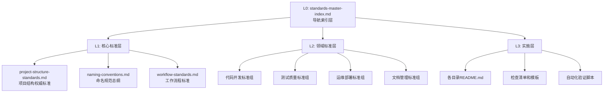

# ADR-002: 标准文档架构重构决策

## 状态
**已接受** - 2025-09-23

## 上下文与问题陈述

### 问题背景
在项目发展过程中，标准文档体系出现了以下关键问题：

1. **标准文档重复内容严重**
   - `naming-conventions.md` 与 `database-standards.md` 存在命名规范重复
   - `api-standards.md` 与 `naming-conventions.md` 存在API命名重复  
   - `code-standards.md` 与 `document-standards.md` 存在组织规范重复
   - 开发者不清楚以哪个文档为准，影响开发效率

2. **目录结构标准化覆盖不全**
   - `app/`、`docs/` 有完整标准（code-standards.md、document-standards.md）
   - `scripts/`、`tests/`、`logs/`、`alembic/` 缺乏标准化规范
   - 25+个脚本文件无组织规范，存在混乱风险
   - 测试目录结构部分标准化，但不够完整

3. **标准文档权威性模糊**
   - 缺乏清晰的标准层次体系
   - 文档间引用关系不明确
   - AI助手查找标准困难，路径不清晰
   - 无统一的标准检索入口

4. **维护成本高且容易出错**
   - 更新一个规范需要修改多个文档
   - 容易产生循环依赖关系
   - 缺乏自动化验证机制
   - 版本控制和变更追踪不完善

### 业务影响
- **开发效率下降**: 开发者需要查阅多个文档确认标准
- **质量风险增加**: 不一致的标准导致代码质量参差不齐  
- **维护成本上升**: 标准更新需要同步多个文档
- **AI辅助效果差**: AI助手难以快速定位准确标准

## 决策驱动因素

### 核心需求
1. **全覆盖**: 标准体系覆盖开发维护全生命周期
2. **无重复**: 每个规范只在一个文档中定义
3. **易理解**: 清晰的层次结构和导航体系
4. **易检索**: AI和人类友好的快速查找机制
5. **易维护**: 最小化依赖关系，支持版本控制

### 约束条件
- 必须符合企业级DevOps最佳实践
- 保持与现有架构文档体系的兼容性
- 支持未来微服务演进的标准需求
- 遵循MASTER.md的强制检查点机制

## 决策方案

### 采用"金字塔导航式标准架构体系"

#### 架构设计

#### 层次职责定义

**L0层：导航索引层**
- 职责：提供统一入口和AI友好的快速检索
- 文档：`standards-master-index.md`
- 特点：关键词映射、快速定位、使用指南

**L1层：核心标准层**
- 职责：定义全项目通用规则，其他标准必须遵循
- 文档：3个核心标准（项目结构、命名规范、工作流程）
- 特点：无上级依赖、权威定义、稳定性高

**L2层：领域标准层**  
- 职责：在L1基础上定义特定领域规则
- 文档：8个领域标准（API、代码、数据库、测试、脚本、部署、文档等）
- 特点：依赖L1标准、专业性强、覆盖全面

**L3层：实施层**
- 职责：具体实施指南和操作细节
- 文档：各目录README、模板、脚本等
- 特点：实用性强、可操作、易更新

### 关键设计原则

1. **单一权威源原则**: 每个规范只在一个文档中定义
2. **明确依赖关系**: L1→L2→L3单向依赖，禁止循环
3. **AI友好设计**: 单一入口点，关键词快速检索
4. **版本控制机制**: 每个标准文档包含版本信息和变更追踪
5. **自动化验证**: 建立标准文档一致性检查机制

## 替代方案评估

### 方案1：权威层级体系
- **优点**: 明确权威等级
- **缺点**: 过于复杂，AI查找路径不清晰
- **结论**: 不采用

### 方案2：目录结构标准补充
- **优点**: 针对性解决目录标准缺失
- **缺点**: 只解决部分问题，不够系统
- **结论**: 不采用

### 方案3：重构引用体系  
- **优点**: 解决重复问题
- **缺点**: 维护成本高，容易产生循环引用
- **结论**: 不采用

### 方案4：金字塔导航式（采用方案）
- **优点**: 全面解决所有问题，AI友好，易维护
- **缺点**: 初期重构工作量大
- **结论**: 采用

## 实施计划

### Phase 0: ADR文档补充 (本文档)
- 创建架构决策记录，确保决策可追踪

### Phase 1: 核心基础建设 (1-2天)  
- 创建导航主索引 (`standards-master-index.md`)
- 创建项目结构权威标准 (`project-structure-standards.md`)  
- 重构命名规范文档，建立依赖关系
- **回归检查**: 验证L0-L1层建设正确性

### Phase 2: 领域标准重构 (2-3天)
- 重构现有L2标准文档，去除重复内容
- 创建缺失的标准文档（scripts-standards.md等）
- 建立明确的L1依赖关系
- **回归检查**: 验证L2层标准去重和依赖正确性

### Phase 3: 验证和完善 (1-2天)
- 建立自动化验证机制  
- 更新相关README文档
- 建立标准文档维护机制
- **最终回归检查**: 全面验证标准体系完整性

## 影响评估

### 积极影响
- **开发效率提升**: 单一入口，快速定位标准规范
- **质量保证增强**: 消除重复和冲突，标准一致性  
- **维护成本降低**: 单一权威源，版本控制机制
- **AI辅助优化**: 友好的检索和导航体系
- **扩展性增强**: 支持未来标准扩展和微服务演进

### 风险和缓解措施
- **重构工作量大**: 分阶段实施，每阶段回归检查
- **学习成本**: 提供详细使用指南和培训
- **兼容性风险**: 保持与现有架构文档兼容
- **维护复杂性**: 建立自动化验证和维护机制

### 影响范围
- **直接影响**: 所有开发人员、AI助手、文档维护流程
- **间接影响**: 代码质量、项目交付效率、新人培训  
- **长期影响**: 支持企业级标准化管理和演进

## 合规性检查

### MASTER.md要求符合性
- ✅ 包含强制检查点机制 [CHECK:ARCH-001]
- ✅ 遵循文档驱动开发原则
- ✅ 符合架构规范和标准统一要求
- ✅ 建立完整的验证和回归机制

### 企业级DevOps最佳实践
- ✅ 版本控制和变更追踪
- ✅ 自动化验证和质量保证  
- ✅ 清晰的职责分工和依赖关系
- ✅ 可扩展和可维护的架构设计

## 决策批准

**决策者**: 系统架构师  
**决策日期**: 2025-09-23  
**生效日期**: 2025-09-23  
**审查周期**: 季度审查  

## 后续行动

1. **立即执行**: 按照实施计划开始Phase 1
2. **团队通知**: 向开发团队通告新的标准体系
3. **培训准备**: 准备标准体系使用培训材料  
4. **监控反馈**: 收集使用反馈，持续改进

---

**检查点标记**: [CHECK:ARCH-001] 系统架构设计验证  
**关联文档**: MASTER.md, current-work-status.md  
**更新频率**: 重大架构变更时  