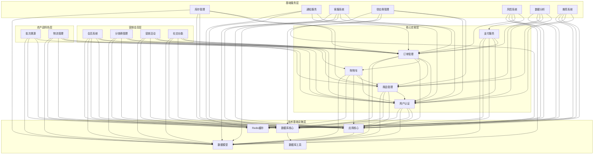
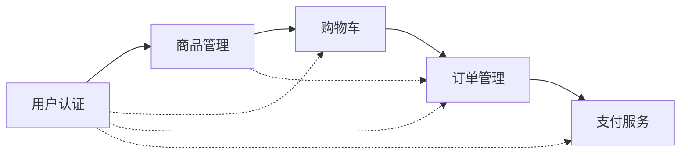

<!--
文档说明：
- 内容：模块间依赖关系的详细分析，包括技术依赖和业务依赖
- 使用方法：架构设计时的依赖分析，微服务拆分的参考依据
- 更新方法：模块依赖关系变更时更新
- 引用关系：被module-architecture.md引用，引用modules/各模块文档
- 更新频率：架构调整或新增依赖时
-->

# 依赖关系架构

📝 **状态**: ✅ 已发布  
📅 **创建日期**: 2025-09-13  
👤 **负责人**: 系统架构师  
🔄 **最后更新**: 2025-09-13  
📋 **版本**: v1.0.0  

## 依赖关系总览

### 全局依赖关系图



## 技术依赖分析

### 技术基础设施依赖

| 依赖模块 | 被依赖模块 | 依赖类型 | 依赖说明 |
|---------|-----------|---------|---------|
| **应用核心** | 所有业务模块 | 框架依赖 | 提供FastAPI框架、路由、中间件基础 |
| **数据库核心** | 需要持久化的模块 | 数据访问 | 提供数据库连接、会话管理、事务控制 |
| **数据模型** | 所有业务模块 | 数据结构 | 提供ORM模型、数据验证、类型定义 |
| **Redis缓存** | 需要缓存的模块 | 缓存服务 | 提供缓存、会话存储、分布式锁 |
| **数据库工具** | 数据库核心 | 工具函数 | 提供查询构建、批量操作、优化工具 |

### 技术依赖详情

#### 应用核心依赖 (18个模块依赖)
```python
# 依赖应用核心的模块
business_modules = [
    "user-auth", "product-catalog", "shopping-cart", 
    "order-management", "payment-service",
    "batch-traceability", "logistics-management",
    "member-system", "distributor-management", 
    "marketing-campaigns", "social-features",
    "inventory-management", "notification-service", 
    "customer-service-system", "supplier-management",
    "risk-control-system", "data-analytics-platform", 
    "recommendation-system"
]
```

#### 数据库核心依赖 (15个模块依赖)
```python
# 需要数据持久化的模块
persistent_modules = [
    "user-auth", "product-catalog", "order-management", 
    "payment-service", "batch-traceability", "logistics-management",
    "member-system", "distributor-management", "social-features",
    "inventory-management", "customer-service-system", 
    "supplier-management", "risk-control-system", 
    "data-analytics-platform", "recommendation-system"
]
```

#### Redis缓存依赖 (6个模块依赖)
```python
# 需要缓存服务的模块
cache_modules = [
    "user-auth",      # 用户会话、权限缓存
    "shopping-cart",  # 购物车临时存储
    "member-system",  # 积分缓存、等级缓存
    "marketing-campaigns",  # 活动数据缓存
    "notification-service", # 消息队列缓存
    "recommendation-system" # 推荐结果缓存
]
```

## 业务依赖分析

### 核心交易模块依赖链



**依赖说明**：
- **用户认证** → **商品管理**：商品操作需要用户身份验证
- **商品管理** → **购物车**：购物车需要商品信息和库存状态
- **购物车** → **订单管理**：订单创建基于购物车内容
- **订单管理** → **支付服务**：支付处理基于订单信息

### 农产品特色模块依赖

| 模块 | 依赖的核心模块 | 依赖原因 |
|------|---------------|----------|
| **批次溯源** | 商品管理 | 需要商品信息进行溯源绑定 |
| **物流管理** | 订单管理、用户认证 | 基于订单进行配送，需要用户信息 |

### 营销会员模块依赖

| 模块 | 依赖的核心模块 | 依赖原因 |
|------|---------------|----------|
| **会员系统** | 用户认证、订单管理 | 基于用户行为和交易记录计算积分等级 |
| **分销商管理** | 用户认证、订单管理 | 分销商身份验证和佣金计算 |
| **营销活动** | 购物车、订单管理 | 优惠券应用和促销活动效果统计 |
| **社交功能** | 用户认证、商品管理 | 用户社交行为和商品分享 |

### 基础服务模块依赖

| 模块 | 依赖的模块 | 依赖类型 | 依赖说明 |
|------|-----------|---------|---------|
| **库存管理** | 商品管理、订单管理 | 数据依赖 | 监控商品库存，响应订单库存变化 |
| **通知服务** | 用户认证、订单管理 | 事件依赖 | 基于用户信息和订单状态发送通知 |
| **客服系统** | 用户认证、订单管理 | 服务依赖 | 为用户提供订单相关客服支持 |
| **供应商管理** | 商品管理、用户认证 | 业务依赖 | 管理商品供应商和供应商用户 |
| **风控系统** | 支付服务、订单管理 | 安全依赖 | 对支付和订单进行风险控制 |
| **数据分析** | 用户认证、商品管理、订单管理 | 数据依赖 | 分析用户行为、商品销量、订单数据 |
| **推荐系统** | 用户认证、商品管理 | 算法依赖 | 基于用户行为和商品特征进行推荐 |

## 依赖强度分析

### 强依赖关系
> 无法独立运行，必须依赖其他模块

| 依赖模块 | 被依赖模块 | 强度 | 说明 |
|---------|-----------|------|------|
| 购物车 | 用户认证 + 商品管理 | ⭐⭐⭐ | 购物车操作必须有用户身份和商品信息 |
| 订单管理 | 用户认证 + 商品管理 + 购物车 | ⭐⭐⭐ | 订单创建需要完整的用户和商品上下文 |
| 支付服务 | 订单管理 + 用户认证 | ⭐⭐⭐ | 支付处理必须基于有效订单和用户 |
| 分销商管理 | 用户认证 + 订单管理 | ⭐⭐⭐ | 分销佣金计算依赖用户关系和订单数据 |

### 中等依赖关系
> 可以独立运行，但功能受限

| 依赖模块 | 被依赖模块 | 强度 | 说明 |
|---------|-----------|------|------|
| 会员系统 | 用户认证 + 订单管理 | ⭐⭐ | 可以独立管理会员信息，但积分计算需要交易数据 |
| 营销活动 | 购物车 + 订单管理 | ⭐⭐ | 可以独立配置活动，但优惠应用需要交易上下文 |
| 批次溯源 | 商品管理 | ⭐⭐ | 可以独立管理溯源信息，但需要商品关联 |
| 物流管理 | 订单管理 | ⭐⭐ | 可以独立管理物流信息，但配送需要订单驱动 |

### 弱依赖关系
> 可以完全独立运行

| 依赖模块 | 被依赖模块 | 强度 | 说明 |
|---------|-----------|------|------|
| 通知服务 | 其他模块 | ⭐ | 可以独立提供通知功能，其他模块可选择使用 |
| 数据分析 | 业务模块 | ⭐ | 可以独立运行，业务模块提供数据源 |
| 推荐系统 | 用户认证 + 商品管理 | ⭐ | 可以提供通用推荐，个性化需要用户数据 |

## 循环依赖检测

### 当前系统无循环依赖
✅ **检测结果**: 当前模块设计严格按照分层架构，无循环依赖

### 潜在风险点
⚠️ **风险识别**：
1. **用户认证 ↔ 通知服务**：通知服务需要用户信息，用户模块可能需要通知功能
2. **商品管理 ↔ 库存管理**：商品需要库存信息，库存需要商品信息
3. **订单管理 ↔ 库存管理**：订单影响库存，库存影响订单创建

### 解决策略
🛡️ **防护措施**：
1. **事件驱动**：使用事件总线避免直接依赖
2. **接口抽象**：通过抽象接口解除具体实现依赖
3. **依赖注入**：运行时注入依赖，编译时保持无依赖

## 微服务拆分建议

### 服务聚合策略

#### 核心服务组 (高内聚)
```yaml
user-service:
  modules: [user-auth, member-system]
  reason: 用户相关功能高度内聚

product-service:
  modules: [product-catalog, batch-traceability, inventory-management]
  reason: 商品和库存管理紧密相关

order-service:
  modules: [shopping-cart, order-management, payment-service]
  reason: 交易流程强依赖，适合聚合
```

#### 独立服务组 (松耦合)
```yaml
marketing-service:
  modules: [marketing-campaigns, distributor-management]
  reason: 营销功能相对独立

logistics-service:
  modules: [logistics-management]
  reason: 物流功能独立性强

platform-service:
  modules: [notification-service, customer-service-system]
  reason: 平台支撑服务
```

### 拆分优先级

| 优先级 | 服务组 | 拆分理由 | 技术复杂度 |
|-------|-------|---------|-----------|
| **P1** | logistics-service | 业务独立性强，外部依赖少 | 低 |
| **P2** | marketing-service | 营销功能相对独立 | 中 |
| **P3** | platform-service | 支撑服务，可独立部署 | 中 |
| **P4** | user-service | 核心服务，需要数据一致性 | 高 |
| **P5** | product-service | 核心服务，依赖关系复杂 | 高 |
| **P6** | order-service | 核心服务，事务要求高 | 高 |

## 依赖管理规范

### 依赖声明规范
```python
# 模块依赖声明示例
class ModuleDependencies:
    """模块依赖声明"""
    required_modules: List[str]  # 强依赖，必须存在
    optional_modules: List[str]  # 弱依赖，可选
    provided_interfaces: List[str]  # 对外提供的接口
    consumed_interfaces: List[str]  # 消费的外部接口
```

### 依赖注入模式
```python
# 依赖注入配置
@injectable
class OrderService:
    def __init__(
        self,
        user_service: UserServiceInterface,
        product_service: ProductServiceInterface,
        payment_service: PaymentServiceInterface
    ):
        self.user_service = user_service
        self.product_service = product_service 
        self.payment_service = payment_service
```

### 接口契约定义
```python
# 接口契约标准
class ServiceInterface(ABC):
    """服务接口契约"""
    
    @abstractmethod
    async def health_check(self) -> HealthStatus:
        """健康检查接口"""
        pass
        
    @abstractmethod
    def get_version(self) -> str:
        """版本信息接口"""
        pass
```

## 监控和治理

### 依赖关系监控
```yaml
dependency_monitor:
  metrics:
    - dependency_count: 模块依赖数量
    - circular_dependency: 循环依赖检测
    - dependency_depth: 依赖深度分析
    - interface_coupling: 接口耦合度

  alerts:
    - circular_dependency_detected
    - dependency_depth_exceeded
    - interface_breaking_change
```

### 依赖变更管理
```yaml
change_management:
  approval_required:
    - 新增强依赖关系
    - 删除现有依赖关系  
    - 接口契约变更
    - 模块拆分或合并
    
  change_process:
    1. 依赖影响分析
    2. 架构委员会评审
    3. 兼容性测试
    4. 分阶段发布
```

## 相关文档

- [模块架构设计](./module-architecture.md) - 整体架构设计
- [模块详细目录](./module-catalog.md) - 模块功能说明
- [接口设计规范](../standards/openapi.yaml) - API契约标准
- [微服务架构指南](../guides/microservices-guide.md) - 微服务拆分指南

## 更新日志

### v1.0.0 (2025-09-13)
- ✅ 初始版本，完整的依赖关系分析
- ✅ 技术依赖和业务依赖分类梳理
- ✅ 循环依赖检测和风险识别
- ✅ 微服务拆分建议和管理规范
