<!--
文档说明：
- 内容：统一的表-模块分配架构设计，定义所有数据表的模块归属和核心结构
- 使用方法：架构级别的表分配指导，各模块设计必须遵循此分配
- 更新方法：架构变更时更新，需要架构师确认
- 引用关系：被各模块overview.md引用，指导模块间数据关系设计
- 更新频率：架构调整或表分配变更时
-->

# 表-模块分配架构设计 (Table-Module Mapping Architecture)

📝 **状态**: ✅ 已发布  
📅 **创建日期**: 2025-09-14  
👤 **负责人**: 系统架构师  
🔄 **最后更新**: 2025-09-14  
📋 **版本**: v1.0.0  

## 架构设计原则

### 🎯 **表分配设计原则**

1. **业务内聚性** - 同一业务领域的表归属同一模块
2. **单一职责** - 每个模块只负责自己领域内的数据管理
3. **依赖最小化** - 模块间通过外键关联，避免数据重复
4. **扩展性** - 预留模块内表的扩展空间
5. **Product-SKU分离** - 商品基础信息与规格定价信息分离管理

### 🏗️ **架构约束**

- **核心结构定义** - 架构级定义表名、主要字段、关系约束
- **模块实现细节** - 模块级定义完整字段、索引、业务约束  
- **跨模块关联** - 通过标准外键关系，禁止跨模块直接操作数据
- **命名一致性** - 严格遵循 [命名规范](../standards/naming-conventions-standards.md)

## 📊 **完整表-模块分配表**

| 模块名称 | 表名称 | 主要职责 | 核心字段 | 关联关系 |
|----------|--------|----------|----------|----------|
| **用户认证模块** | | | | |
| `user-auth` | `users` | 用户基础信息 | `id, username, email, password_hash, phone, status` | - |
| `user-auth` | `roles` | 角色权限管理 | `id, role_name, permissions` | - |
| `user-auth` | `user_roles` | 用户角色关联 | `user_id, role_id, assigned_at` | `users.id, roles.id` |
| **商品管理模块** | | | | |
| `product-catalog` | `categories` | 商品分类层次 | `id, name, parent_id, level, path, sort_order` | `categories.id(self)` |
| `product-catalog` | `brands` | 商品品牌 | `id, name, slug, logo_url, description` | - |
| `product-catalog` | `products` | 商品基础信息 | `id, name, description, brand_id, category_id, status` | `brands.id, categories.id` |
| `product-catalog` | `skus` | 商品规格定价 | `id, product_id, sku_code, name, price, cost_price, weight, volume` | `products.id` |
| `product-catalog` | `product_attributes` | 商品属性扩展 | `id, product_id, attribute_name, attribute_value, attribute_type` | `products.id` |
| `product-catalog` | `sku_attributes` | SKU属性扩展 | `id, sku_id, attribute_name, attribute_value` | `skus.id` |
| `product-catalog` | `product_images` | 商品图片 | `id, product_id, image_url, alt_text, sort_order` | `products.id` |
| **库存管理模块** | | | | |
| `inventory-management` | `inventory` | SKU库存数量 | `id, sku_id, available_quantity, reserved_quantity, total_quantity, warning_threshold` | `skus.id` |
| `inventory-management` | `inventory_transactions` | 库存变动记录 | `id, sku_id, transaction_type, quantity_change, reference_id, reference_type` | `skus.id` |
| `inventory-management` | `cart_reservations` | 购物车预占 | `id, user_id, sku_id, reserved_quantity, expires_at` | `users.id, skus.id` |
| **购物车模块** | | | | |
| `shopping-cart` | `shopping_carts` | 购物车主表 | `id, user_id, guest_id, status, expires_at` | `users.id` |
| `shopping-cart` | `cart_items` | 购物车商品项 | `id, cart_id, product_id, sku_id, quantity, unit_price, total_price` | `shopping_carts.id, products.id, skus.id` |
| **订单管理模块** | | | | |
| `order-management` | `orders` | 订单主表 | `id, order_number, user_id, status, subtotal, shipping_fee, total_amount, shipping_address` | `users.id` |
| `order-management` | `order_items` | 订单商品项快照 | `id, order_id, product_id, sku_id, product_name, sku_code, sku_name, quantity, unit_price, total_price` | `orders.id, products.id, skus.id` |
| `order-management` | `order_status_history` | 订单状态历史 | `id, order_id, old_status, new_status, remark, created_at` | `orders.id` |
| **支付服务模块** | | | | |
| `payment-service` | `payments` | 支付记录 | `id, order_id, payment_method, amount, status, transaction_id, gateway_response, paid_at` | `orders.id` |
| `payment-service` | `refunds` | 退款记录 | `id, payment_id, order_id, refund_amount, reason, status, gateway_refund_id, processed_at` | `payments.id, orders.id` |
| **会员系统模块** | | | | |
| `member-system` | `member_levels` | 会员等级 | `id, level_name, min_points, discount_rate, benefits` | - |
| `member-system` | `member_points` | 会员积分 | `id, user_id, current_points, total_earned, total_used, level_id` | `users.id, member_levels.id` |
| `member-system` | `point_transactions` | 积分变动记录 | `id, user_id, transaction_type, points_change, reference_id, reference_type, description` | `users.id` |
| **批次溯源模块** | | | | |
| `batch-traceability` | `batches` | 生产批次 | `id, batch_code, product_id, production_date, expiry_date, supplier_id, quality_grade, status` | `products.id, suppliers.id` |
| `batch-traceability` | `trace_records` | 溯源记录 | `id, batch_id, stage_type, stage_name, operator, location, timestamp, details` | `batches.id` |
| `batch-traceability` | `certificates` | 质量认证 | `id, batch_id, cert_type, cert_number, issuer, issue_date, expire_date, file_url` | `batches.id` |
| **供应商管理模块** | | | | |
| `supplier-management` | `suppliers` | 供应商信息 | `id, company_name, contact_person, phone, email, address, status, qualification_level` | - |
| `supplier-management` | `supplier_products` | 供应商商品关联 | `id, supplier_id, product_id, supply_price, supply_capacity, status` | `suppliers.id, products.id` |
| **物流管理模块** | | | | |
| `logistics-management` | `logistics_providers` | 物流供应商 | `id, provider_name, provider_code, contact_info, service_areas` | - |
| `logistics-management` | `shipments` | 物流配送 | `id, order_id, provider_id, tracking_number, status, shipped_at, delivered_at` | `orders.id, logistics_providers.id` |
| `logistics-management` | `delivery_routes` | 配送路线 | `id, shipment_id, route_stage, location, timestamp, temperature, humidity` | `shipments.id` |

## 🔗 **跨模块关联关系图**



## 📋 **核心设计约束**

### **Product-SKU分离架构**
```sql
-- ✅ 正确：商品基础信息
products: id, name, description, brand_id, category_id, status

-- ✅ 正确：SKU规格定价信息  
skus: id, product_id, sku_code, name, price, cost_price, weight, volume

-- ✅ 正确：库存关联SKU
inventory: id, sku_id, available_quantity, reserved_quantity, total_quantity

-- ✅ 正确：订单项双重关联
order_items: id, order_id, product_id, sku_id, product_name, sku_code, sku_name, quantity, unit_price
```

### **外键约束规范**
- **核心业务数据**: 使用 `RESTRICT` 或 `SET NULL` 保护数据
- **从属关系数据**: 使用 `CASCADE` 维护一致性
- **跨模块关联**: 通过标准外键，禁止直接跨模块操作

### **主键设计标准**  
- **统一主键**: 所有表使用 `id INTEGER AUTO_INCREMENT PRIMARY KEY`
- **唯一约束**: 业务唯一字段使用 `UNIQUE` 约束 (如 sku_code, order_number)
- **复合索引**: 基于查询模式设计合理的复合索引

## 📚 **模块实现指南**

### **各模块职责边界**

1. **商品管理模块**: 拥有Product、SKU、Category、Brand等商品信息数据
2. **库存管理模块**: 引用SKU，管理库存数量和变动记录  
3. **订单管理模块**: 引用Product+SKU，保存交易快照数据
4. **购物车模块**: 引用Product+SKU，管理购物车状态
5. **支付服务模块**: 引用Order，管理支付和退款流程

### **跨模块调用规范**

```python
# ✅ 正确：通过服务接口调用
product_service = ProductService()
sku_info = await product_service.get_sku_by_id(sku_id)

# ✅ 正确：通过外键关联查询
inventory = await db.query(Inventory).filter(Inventory.sku_id == sku_id).first()

# ❌ 错误：直接跨模块操作数据表
# 库存模块不应该直接操作products表
```

## 🔄 **版本历史**

| 版本 | 日期 | 变更说明 | 影响范围 |
|------|------|----------|----------|
| v1.0.0 | 2025-09-14 | 初版：统一表-模块分配架构设计 | 全系统架构基础 |

---

## 📖 **相关文档**

- [数据模型架构设计](data-models.md) - 架构设计原则
- [模块架构设计](module-architecture.md) - 模块划分和依赖关系
- [数据库设计规范](../standards/database-standards.md) - 技术实施标准
- [命名规范](../standards/naming-conventions-standards.md) - 命名约定标准

**注**: 各模块在实现具体表结构时，必须严格遵循本文档定义的表分配和关系约束。
