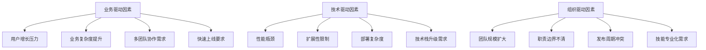

<!--
文档说明：
- 内容：架构演进路线图，包括从模块化单体到微服务的演进策略和实施计划
- 使用方法：架构演进决策和实施计划的权威指导文档
- 更新方法：架构演进策略调整或里程碑完成时更新
- 引用关系：被overview.md引用，指导整体架构演进
- 更新频率：架构演进里程碑调整时
-->

# 架构演进路线图

📝 **状态**: ✅ 已发布  
📅 **创建日期**: 2025-09-22  
👤 **负责人**: 技术架构师  
🔄 **最后更新**: 2025-09-22  
📋 **版本**: v1.0.0  

## 演进概览

### 架构演进目标

```
当前状态 (模块化单体) ──► 目标状态 (微服务生态)
                     ├── 技术目标：高可扩展性、高可用性、高性能
                     ├── 业务目标：快速迭代、独立部署、团队自治
                     └── 运维目标：容器化、自动化、可观测性
```

### 演进驱动因素



## 三阶段演进策略

### 第一阶段：模块化重构 (3-6个月)

#### 目标与原则
- **目标**: 完善模块化单体，为微服务拆分打基础
- **原则**: 
  - 业务边界清晰化
  - 依赖关系解耦
  - 接口标准化
  - 数据一致性保障

#### 技术实施路径

```python
# 模块间通信标准化
from typing import Protocol, TypeVar, Generic
from app.shared.base_models import BaseModel
from app.shared.api_schemas import APIResponse

T = TypeVar('T')

class ModuleInterface(Protocol):
    """模块接口协议"""
    def process_request(self, request: BaseModel) -> APIResponse[T]:
        """统一的模块请求处理接口"""
        ...
    
    def get_health_status(self) -> dict:
        """健康检查接口"""
        ...

# 事件驱动架构引入
class DomainEvent(BaseModel):
    """领域事件基类"""
    event_id: str
    event_type: str
    aggregate_id: str
    version: int
    timestamp: datetime
    payload: dict

class EventBus:
    """事件总线"""
    def __init__(self):
        self._handlers = {}
    
    def subscribe(self, event_type: str, handler: Callable):
        """订阅事件"""
        if event_type not in self._handlers:
            self._handlers[event_type] = []
        self._handlers[event_type].append(handler)
    
    def publish(self, event: DomainEvent):
        """发布事件"""
        handlers = self._handlers.get(event.event_type, [])
        for handler in handlers:
            handler(event)
```

#### 具体实施计划

| 周次 | 任务内容 | 预期产出 | 负责团队 |
|------|----------|----------|----------|
| W1-W2 | 模块边界梳理 | 30个模块的DDD领域模型 | 架构团队 |
| W3-W4 | 接口标准化改造 | 统一的模块接口规范 | 后端团队 |
| W5-W8 | 数据访问层重构 | Repository模式实现 | 数据团队 |
| W9-W12 | 事件驱动机制引入 | 事件总线与领域事件 | 架构团队 |
| W13-W16 | 模块独立性验证 | 模块间依赖关系图 | 测试团队 |
| W17-W20 | 性能优化与监控 | 完整的监控体系 | 运维团队 |
| W21-W24 | 压力测试与调优 | 性能基准报告 | 性能团队 |

### 第二阶段：服务拆分 (6-12个月)

#### 拆分策略与顺序

```
拆分优先级矩阵：
              ┌────────────────┬────────────────┐
              │   业务独立性   │   技术复杂度   │
┌─────────────┼────────────────┼────────────────┤
│ 高业务价值  │  P0 (立即拆分)  │  P1 (优先拆分)  │
├─────────────┼────────────────┼────────────────┤
│ 中业务价值  │  P2 (计划拆分)  │  P3 (谨慎拆分)  │
└─────────────┴────────────────┴────────────────┘
```

#### 微服务拆分规划

**P0级别服务 (立即拆分)**
```yaml
user_service:
  modules: [user_auth, member_system]
  reason: "用户体系是平台基础，独立性强"
  timeline: "第1-2个月"
  team: "用户团队"
  
payment_service:
  modules: [payment_service, risk_control_system]
  reason: "支付安全要求高，需要独立部署"
  timeline: "第2-3个月"
  team: "支付团队"
  
product_service:
  modules: [product_catalog, inventory_management]
  reason: "商品管理是核心业务，变更频繁"
  timeline: "第3-4个月"
  team: "商品团队"
```

**P1级别服务 (优先拆分)**
```yaml
order_service:
  modules: [order_management, shopping_cart]
  reason: "订单流程复杂，需要独立优化"
  timeline: "第4-5个月"
  team: "订单团队"
  
marketing_service:
  modules: [marketing_campaigns, recommendation_system]
  reason: "营销活动变化快，需要快速迭代"
  timeline: "第5-6个月"  
  team: "营销团队"
  
logistics_service:
  modules: [logistics_management, batch_traceability]
  reason: "物流业务复杂，有独立的业务逻辑"
  timeline: "第6-7个月"
  team: "物流团队"
```

#### 数据拆分策略

```python
# 数据迁移配置
class DataMigrationConfig:
    """数据迁移配置"""
    
    # 用户服务数据迁移
    user_service_migration = {
        "source_tables": ["users", "user_profiles", "user_addresses", "member_levels"],
        "target_database": "user_service_db",
        "migration_strategy": "dual_write",  # 双写策略
        "rollback_plan": "switch_back_to_monolith",
        "data_sync_tool": "canal",  # 使用Canal进行数据同步
        "consistency_check": True
    }
    
    # 商品服务数据迁移
    product_service_migration = {
        "source_tables": ["products", "categories", "inventory", "product_images"],
        "target_database": "product_service_db", 
        "migration_strategy": "event_sourcing",  # 事件溯源
        "shared_data": ["categories"],  # 共享数据通过API访问
        "data_sync_tool": "debezium",
        "consistency_check": True
    }

# 分布式事务处理
class SagaOrchestrator:
    """Saga分布式事务编排器"""
    
    def create_order_saga(self, order_request):
        """创建订单的分布式事务"""
        steps = [
            ("inventory_service", "reserve_stock", order_request.items),
            ("user_service", "validate_user", order_request.user_id),
            ("payment_service", "pre_auth", order_request.payment_info),
            ("order_service", "create_order", order_request),
            ("payment_service", "capture_payment", order_request.payment_info)
        ]
        
        compensations = [
            ("inventory_service", "release_stock"),
            ("payment_service", "refund_payment"),
            ("order_service", "cancel_order")
        ]
        
        return self.execute_saga(steps, compensations)
```

### 第三阶段：微服务治理 (持续优化)

#### 服务治理体系

```yaml
# 服务治理配置
service_governance:
  # 服务发现
  service_discovery:
    type: "consul"
    health_check_interval: "10s"
    deregister_critical_after: "30s"
    
  # 配置管理
  config_management:
    type: "apollo"
    namespace_strategy: "per_service"
    hot_reload: true
    
  # API网关
  api_gateway:
    type: "kong"
    features: ["rate_limiting", "authentication", "logging", "monitoring"]
    plugins:
      - "rate-limiting": 
          minute: 1000
          hour: 10000
      - "jwt": 
          secret_is_base64: false
      - "prometheus":
          per_consumer: true
          
  # 链路追踪
  distributed_tracing:
    type: "jaeger"
    sampling_rate: 0.1  # 10%采样率
    max_traces: 1000000
    
  # 熔断器
  circuit_breaker:
    type: "hystrix"
    default_config:
      timeout: 1000
      error_threshold: 50
      request_volume_threshold: 20
      sleep_window: 5000
```

## 业务连续性保障

### 灰度发布策略

```yaml
# 灰度发布配置
canary_deployment:
  strategy: "blue_green"  # 蓝绿部署
  phases:
    - name: "internal_testing"
      traffic_percentage: 0
      target_users: ["internal_employees"]
      duration: "1day"
      
    - name: "beta_users"  
      traffic_percentage: 5
      target_users: ["beta_users"]
      duration: "3days"
      success_criteria:
        error_rate: "<0.1%"
        response_time: "<200ms"
        
    - name: "gradual_rollout"
      traffic_percentage: [10, 25, 50, 100]
      duration_per_stage: "2days"
      auto_rollback:
        error_threshold: "1%"
        response_time_threshold: "500ms"
```

### 回滚策略

```python
# 自动回滚机制
class AutoRollbackManager:
    """自动回滚管理器"""
    
    def __init__(self):
        self.metrics_monitor = MetricsMonitor()
        self.deployment_manager = DeploymentManager()
        
    def check_rollback_conditions(self, service_name: str) -> bool:
        """检查是否需要回滚"""
        current_metrics = self.metrics_monitor.get_current_metrics(service_name)
        
        rollback_conditions = [
            current_metrics.error_rate > 0.05,  # 错误率>5%
            current_metrics.response_time_p99 > 1000,  # P99响应时间>1s
            current_metrics.cpu_usage > 0.9,  # CPU使用率>90%
            current_metrics.memory_usage > 0.95  # 内存使用率>95%
        ]
        
        return any(rollback_conditions)
    
    def execute_rollback(self, service_name: str):
        """执行回滚"""
        try:
            # 1. 停止新版本流量
            self.deployment_manager.stop_canary_traffic(service_name)
            
            # 2. 切换到稳定版本
            self.deployment_manager.switch_to_stable_version(service_name)
            
            # 3. 发送告警
            self.send_rollback_alert(service_name)
            
            # 4. 记录回滚事件
            self.log_rollback_event(service_name)
            
        except Exception as e:
            self.send_critical_alert(f"回滚失败: {service_name}, 错误: {e}")
```

## 数据一致性策略

### 分布式数据一致性

```python
# 分布式数据一致性解决方案
class DistributedConsistencyManager:
    """分布式一致性管理器"""
    
    def __init__(self):
        self.saga_orchestrator = SagaOrchestrator()
        self.event_store = EventStore()
        self.outbox_publisher = OutboxPublisher()
    
    def handle_order_creation(self, order_data):
        """处理订单创建的分布式事务"""
        # 使用Outbox模式确保事务一致性
        with self.start_transaction() as tx:
            # 1. 在本地数据库创建订单
            order = self.create_order_locally(order_data, tx)
            
            # 2. 在同一事务中写入Outbox事件
            events = [
                DomainEvent(
                    event_type="order_created",
                    aggregate_id=order.id,
                    payload=order.to_dict()
                ),
                DomainEvent(
                    event_type="inventory_reserve_requested", 
                    aggregate_id=order.id,
                    payload={"items": order.items}
                )
            ]
            
            for event in events:
                self.outbox_publisher.add_event(event, tx)
        
        # 3. 异步发布事件到消息队列
        self.outbox_publisher.publish_pending_events()

# 最终一致性监控
class ConsistencyMonitor:
    """一致性监控器"""
    
    def check_data_consistency(self):
        """检查数据一致性"""
        inconsistencies = []
        
        # 检查用户数据一致性
        user_inconsistencies = self.check_user_data_consistency()
        if user_inconsistencies:
            inconsistencies.extend(user_inconsistencies)
            
        # 检查库存数据一致性  
        inventory_inconsistencies = self.check_inventory_consistency()
        if inventory_inconsistencies:
            inconsistencies.extend(inventory_inconsistencies)
            
        return inconsistencies
    
    def auto_repair_inconsistencies(self, inconsistencies):
        """自动修复数据不一致"""
        for inconsistency in inconsistencies:
            try:
                if inconsistency.type == "user_profile_mismatch":
                    self.repair_user_profile(inconsistency)
                elif inconsistency.type == "inventory_mismatch":
                    self.repair_inventory_data(inconsistency)
                    
            except Exception as e:
                self.log_repair_failure(inconsistency, e)
```

## 性能基准与监控

### 性能目标设定

```yaml
# 性能基准目标
performance_targets:
  # 响应时间目标 (毫秒)
  response_time:
    p95: 200   # 95%请求在200ms内响应
    p99: 500   # 99%请求在500ms内响应
    p999: 1000 # 99.9%请求在1秒内响应
    
  # 吞吐量目标 (QPS)
  throughput:
    user_service: 10000    # 用户服务10K QPS
    product_service: 15000 # 商品服务15K QPS  
    order_service: 5000    # 订单服务5K QPS
    payment_service: 2000  # 支付服务2K QPS
    
  # 可用性目标
  availability:
    target: "99.9%"        # 年可用时间99.9%
    max_downtime: "8.76h"  # 年最大停机8.76小时
    mtbf: "720h"          # 平均故障间隔30天
    mttr: "15min"         # 平均恢复时间15分钟
    
  # 资源使用率目标
  resource_utilization:
    cpu: "70%"            # CPU使用率不超过70%
    memory: "80%"         # 内存使用率不超过80%
    disk: "85%"           # 磁盘使用率不超过85%
    network: "60%"        # 网络带宽使用率不超过60%
```

### 监控指标体系

```python
# 业务监控指标
class BusinessMetrics:
    """业务监控指标"""
    
    # 核心业务指标
    CORE_BUSINESS_METRICS = {
        "gmv": "交易总额",
        "order_count": "订单数量", 
        "conversion_rate": "转化率",
        "user_retention": "用户留存率",
        "cart_abandon_rate": "购物车放弃率"
    }
    
    # 实时业务监控
    def collect_real_time_metrics(self):
        """收集实时业务指标"""
        return {
            "current_online_users": self.get_online_user_count(),
            "real_time_orders": self.get_real_time_order_count(),
            "payment_success_rate": self.get_payment_success_rate(),
            "inventory_alerts": self.get_low_inventory_alerts(),
            "system_alerts": self.get_system_alerts()
        }

# 技术监控指标  
class TechnicalMetrics:
    """技术监控指标"""
    
    # 红线指标 (RED Metrics)
    def collect_red_metrics(self, service_name: str):
        """收集RED指标: Rate, Errors, Duration"""
        return {
            "request_rate": self.get_request_rate(service_name),
            "error_rate": self.get_error_rate(service_name), 
            "response_duration": self.get_response_duration(service_name)
        }
    
    # 使用率指标 (USE Metrics)
    def collect_use_metrics(self, service_name: str):
        """收集USE指标: Utilization, Saturation, Errors"""
        return {
            "cpu_utilization": self.get_cpu_usage(service_name),
            "memory_utilization": self.get_memory_usage(service_name),
            "disk_saturation": self.get_disk_saturation(service_name),
            "network_errors": self.get_network_errors(service_name)
        }
```

## 团队组织演进

### 组织架构调整

```
传统团队结构 ──► 微服务团队结构

单一后端团队 (15人)     ──►   用户团队 (3人)
                           ├── 商品团队 (4人)  
                           ├── 订单团队 (3人)
                           ├── 支付团队 (2人)
                           ├── 营销团队 (2人)
                           └── 平台团队 (1人)

职责重新分配：
├── 全栈开发 (前端+后端+数据库)
├── 独立部署权限
├── 业务目标对齐  
└── 端到端质量责任
```

### 技能转型计划

```yaml
# 团队技能转型规划
skill_transformation:
  # 技术技能要求
  technical_skills:
    required:
      - "微服务架构设计"
      - "容器化技术 (Docker/K8s)"
      - "API设计与文档"
      - "分布式系统理论"
      - "监控与运维"
    
    optional:
      - "前端框架 (Vue.js/React)"
      - "DevOps工具链"
      - "云原生技术"
      - "数据库优化"
      
  # 培训计划
  training_plan:
    - phase: "基础理论"
      duration: "2weeks"
      content: ["微服务理论", "DDD建模", "API设计"]
      
    - phase: "实践项目"
      duration: "4weeks" 
      content: ["服务拆分实战", "CI/CD搭建", "监控配置"]
      
    - phase: "生产实施"
      duration: "8weeks"
      content: ["生产发布", "故障处理", "性能调优"]
```

## 风险控制与应急预案

### 关键风险识别

| 风险类型 | 风险描述 | 影响程度 | 发生概率 | 应对策略 |
|----------|----------|----------|----------|----------|
| 技术风险 | 服务拆分导致性能下降 | 高 | 中 | 性能基准测试+回滚机制 |
| 业务风险 | 数据一致性问题 | 高 | 中 | 分布式事务+补偿机制 |
| 团队风险 | 人员技能不足 | 中 | 高 | 培训计划+外部支持 |
| 运维风险 | 复杂度增加导致故障 | 中 | 中 | 自动化运维+监控告警 |

### 应急预案

```yaml
# 应急响应预案
emergency_response:
  # 故障等级定义
  severity_levels:
    P0: "核心服务完全不可用"
    P1: "核心功能部分不可用"  
    P2: "非核心功能不可用"
    P3: "性能问题或告警"
    
  # 响应时间要求
  response_times:
    P0: "5分钟内响应，15分钟内恢复"
    P1: "15分钟内响应，1小时内恢复"
    P2: "1小时内响应，4小时内恢复"
    P3: "4小时内响应，24小时内解决"
    
  # 应急联系人
  on_call_contacts:
    primary: "架构师、运维负责人"
    secondary: "技术总监、产品负责人"
    escalation: "CTO"
```

## 成功标准与验收

### 阶段性验收标准

```yaml
# 第一阶段验收标准
phase1_acceptance:
  technical_criteria:
    - "模块间依赖关系清晰，循环依赖为0"
    - "模块接口标准化完成率100%"
    - "事件驱动机制覆盖率80%"
    - "性能基准测试通过"
    
  business_criteria:  
    - "业务功能完整性100%"
    - "用户体验无明显下降"
    - "系统稳定性99.9%"
    
# 第二阶段验收标准  
phase2_acceptance:
  technical_criteria:
    - "P0级服务拆分完成率100%"
    - "数据迁移成功率99.99%"
    - "分布式事务一致性100%"
    - "服务独立部署成功率100%"
    
  business_criteria:
    - "业务连续性保障100%" 
    - "发布频率提升50%"
    - "故障恢复时间减少60%"
    
# 第三阶段验收标准
phase3_acceptance:
  technical_criteria:
    - "服务治理体系完整性100%"
    - "监控覆盖率100%"
    - "自动化程度90%"
    - "性能目标达成率95%"
    
  business_criteria:
    - "团队生产力提升30%"
    - "系统可用性99.95%"
    - "创新速度提升40%"
```

## 相关文档

- [技术架构总览](overview.md) - 整体技术架构设计
- [业务架构设计](business-architecture.md) - 业务领域架构
- [应用架构设计](application-architecture.md) - 应用层架构实现
- [基础设施架构](infrastructure-architecture.md) - 基础设施架构设计
