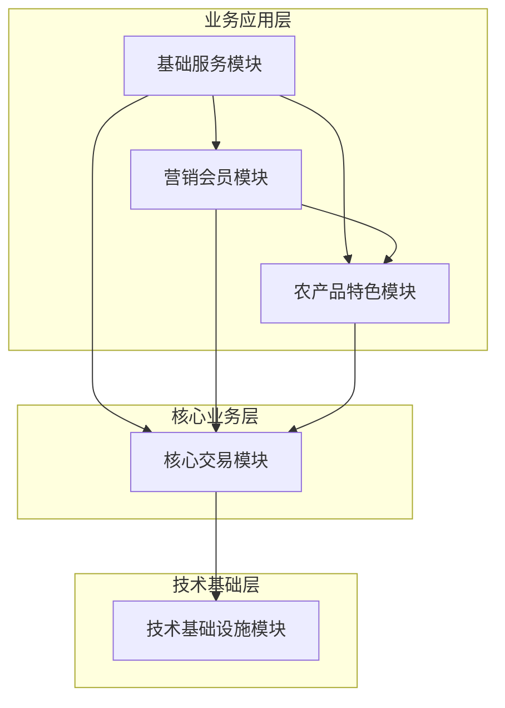

<!--
文档说明：
- 内容：模块架构设计，包括模块分类、优先级和依赖关系的架构分析
- 使用方法：系统架构设计和模块规划时的标准参考，架构决策文档
- 更新方法：模块架构变更时更新，需要架构师确认
- 引用关系：被overview.md引用，引用modules/各模块概览文档
- 更新频率：架构调整或模块增减时
-->

# 模块架构设计

📝 **状态**: ✅ 已发布  
📅 **创建日期**: 2025-09-13  
👤 **负责人**: 系统架构师  
🔄 **最后更新**: 2025-09-13  
📋 **版本**: v1.0.0  

## 模块分类体系

### 按业务域和模块类型分类

| 业务域 | 核心交易模块 | 农产品特色模块 | 营销会员模块 | 基础服务模块 | 技术基础设施模块 |
|-------|-------------|---------------|-------------|-------------|-----------------|
| **用户管理** | [用户认证](../modules/user-auth/) | - | [会员系统](../modules/member-system/) | - | - |
| **商品管理** | [商品管理](../modules/product-catalog/) | [批次溯源](../modules/batch-traceability/) | - | [供应商管理](../modules/supplier-management/) | - |
| **交易流程** | [购物车](../modules/shopping-cart/) [订单管理](../modules/order-management/) [支付服务](../modules/payment-service/) | [物流管理](../modules/logistics-management/) | [营销活动](../modules/marketing-campaigns/) | [库存管理](../modules/inventory-management/) | - |
| **营销推广** | - | - | [分销商管理](../modules/distributor-management/) [社交功能](../modules/social-features/) | [通知服务](../modules/notification-service/) | [推荐系统](../modules/recommendation-system/) |
| **运营支撑** | - | - | - | [客服系统](../modules/customer-service-system/) [风控系统](../modules/risk-control-system/) [数据分析](../modules/data-analytics-platform/) | - |
| **技术基础** | - | - | - | - | [应用核心](../modules/application-core/) [数据库核心](../modules/database-core/) [数据模型](../modules/data-models/) [Redis缓存](../modules/redis-cache/) [数据库工具](../modules/database-utils/) |

### 模块优先级分级 (2025-09-16 调整)

| 优先级 | 模块类型 | 模块数量 | 完成状态 | 开发阶段 |
|-------|---------|---------|---------|---------|
| **P0 (核心)** | 核心交易模块 | 5个 | ✅ 5/5 已完成 | Mini-MVP (已完成) |
| **P1 (商业化)** | 会员营销模块 | 2个 | 📝 待开发 | 第二期 (商业化基础) |
| **P1 (特色)** | 农产品特色模块 | 2个 | 🔄 开发中 | 第三期 (差异化功能) |
| **P2 (营销)** | 高级营销模块 | 2个 | � 待开发 | 第三期 (差异化功能) |
| **P2 (支撑)** | 基础服务模块 | 6个 | � 部分开发 | 第四期 (服务完善) |
| **P3 (基础)** | 技术基础设施模块 | 6个 | ✅ 6/6 已完成 | 基础设施 (已完成) |

**调整说明**:
- 🚀 **会员系统+优惠券** 提前到第二期 (商业变现核心)
- 📝 **物流管理** 简化需求，去除冷链功能  
- 🎯 **支付** 确认使用现有适配器架构，微信支付为主

### 模块依赖关系矩阵

| 被依赖模块 ↓ / 依赖模块 → | 技术基础设施 | 核心交易 | 农产品特色 | 营销会员 | 基础服务 |
|-------------------------|-------------|---------|-----------|---------|---------|
| **技术基础设施模块** | - | ✅ | ✅ | ✅ | ✅ |
| **核心交易模块** | - | ✅ | ✅ | ✅ | ✅ |
| **农产品特色模块** | - | ✅ | - | ✅ | ✅ |
| **营销会员模块** | - | ✅ | ✅ | ✅ | ✅ |
| **基础服务模块** | - | ✅ | ✅ | ✅ | ✅ |

说明：✅ 表示存在依赖关系

## 分层架构设计

### 五层架构模型

### 架构层级说明

| 层级 | 模块数量 | 依赖方向 | 职责定位 |
|------|---------|---------|---------|
| **技术基础设施层** | 5个 | 无上层依赖 | 为所有业务模块提供技术支撑和数据访问 |
| **核心交易层** | 5个 | 依赖技术基础设施 | 电商平台核心业务功能，所有业务的基础 |
| **农产品特色层** | 2个 | 依赖核心交易层 | 农产品电商的差异化特色功能 |
| **营销会员层** | 4个 | 依赖核心交易层 | 营销推广和会员体系功能 |
| **基础服务层** | 7个 | 依赖所有业务层 | 为业务提供运营支撑和辅助服务 |

## 模块演进路线图

### 第一阶段：核心交易 (Mini-MVP)
**目标**：建立基础电商交易能力
- ✅ 用户认证模块 - 用户注册登录和权限管理
- ✅ 商品管理模块 - 商品信息和分类管理
- ✅ 购物车模块 - 购物车操作和价格计算
- ✅ 订单管理模块 - 订单处理和状态管理
- ✅ 支付服务模块 - 支付渠道和交易处理

### 第二阶段：特色功能 (差异化)
**目标**：构建农产品电商特色
- 🔄 批次溯源模块 - 农产品溯源和质量管理
- 🔄 物流管理模块 - 冷链配送和物流跟踪

### 第三阶段：营销体系 (增长)
**目标**：建设营销和会员体系
- 🔄 会员系统模块 - 会员等级和积分体系
- 🔄 分销商管理模块 - 多级分销和佣金管理
- 🔄 营销活动模块 - 优惠券和促销活动
- 🔄 社交功能模块 - 社交分享和拼团功能

### 第四阶段：服务完善 (平台化)
**目标**：完善平台运营能力
- 📝 库存管理模块 - 库存优化和预警机制
- 📝 通知服务模块 - 多渠道消息通知
- 📝 客服系统模块 - 智能客服和工单系统
- 📝 供应商管理模块 - 供应商协作平台
- 📝 风控系统模块 - 交易安全和风险控制
- 📝 数据分析模块 - 商业智能和数据洞察
- 📝 推荐系统模块 - 个性化推荐算法

## 微服务边界设计

### 当前模块化实现 → 未来微服务边界

**核心服务组**：
- `user-service` ← 用户认证模块
- `product-service` ← 商品管理模块  
- `cart-service` ← 购物车模块
- `order-service` ← 订单管理模块
- `payment-service` ← 支付服务模块

**特色服务组**：
- `traceability-service` ← 批次溯源模块
- `logistics-service` ← 物流管理模块

**营销服务组**：
- `member-service` ← 会员系统模块
- `distributor-service` ← 分销商管理模块  
- `campaign-service` ← 营销活动模块
- `social-service` ← 社交功能模块

**支撑服务组**：
- `inventory-service` ← 库存管理模块
- `notification-service` ← 通知服务模块
- `customer-service` ← 客服系统模块
- `supplier-service` ← 供应商管理模块
- `risk-service` ← 风控系统模块
- `analytics-service` ← 数据分析模块
- `recommendation-service` ← 推荐系统模块

**基础设施服务组**：
- `api-gateway` ← 应用核心模块
- `data-service` ← 数据库核心+数据模型模块
- `cache-service` ← Redis缓存模块
- `toolkit-service` ← 数据库工具模块

## 模块集成策略

### 数据集成方式
- **共享数据库**: 技术基础设施模块提供统一数据访问
- **事件驱动**: 模块间通过事件进行松耦合通信
- **API调用**: 模块间通过标准化API进行数据交换
- **缓存共享**: 通过Redis实现模块间数据缓存共享

### 接口标准化
- **统一API契约**: 遵循 `standards/openapi.yaml` 全局契约
- **数据格式标准**: 统一的请求响应格式和错误处理
- **认证授权**: 统一的JWT认证和权限控制机制
- **监控埋点**: 统一的性能监控和日志记录标准

### 部署策略
- **开发阶段**: 单体应用部署，模块化代码组织
- **测试阶段**: 模块独立测试，集成测试验证
- **生产阶段**: 根据业务规模选择单体或微服务部署
- **扩展阶段**: 按需拆分为微服务，独立扩展

## 架构治理原则

### 模块设计原则
1. **单一职责**: 每个模块专注于特定业务领域
2. **松耦合**: 模块间通过标准接口交互，减少直接依赖
3. **高内聚**: 模块内部功能高度相关，对外提供完整能力
4. **可替换**: 模块可以独立升级替换，不影响其他模块

### 依赖管理原则
1. **分层依赖**: 严格按照架构分层进行依赖，禁止跨层或逆向依赖
2. **接口依赖**: 依赖抽象接口而不是具体实现
3. **版本兼容**: 接口变更必须保持向后兼容性
4. **循环检测**: 定期检测和消除模块间的循环依赖

### 演进策略
1. **渐进演进**: 从单体逐步演进为微服务，避免大爆炸式重构
2. **业务驱动**: 根据业务发展需要决定模块拆分时机
3. **技术成熟**: 确保技术栈和团队能力支撑微服务架构
4. **监控完善**: 建立完善的监控和治理体系再进行拆分