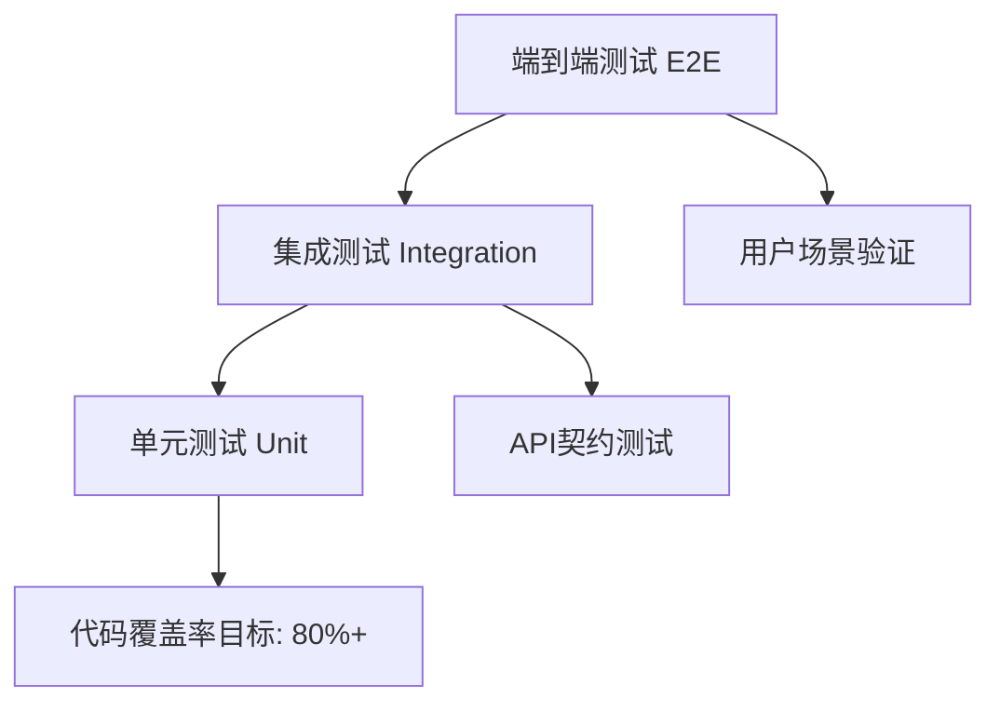

# 测试策略规范

## 🎯 测试原则

### 核心理念
1. **测试驱动开发**: 先写测试，后写实现
2. **测试金字塔**: 单元测试为基础，集成测试为补充，端到端测试为验证
3. **左移策略**: 越早发现问题，修复成本越低
4. **自动化优先**: 手动测试仅用于探索性测试
5. **持续反馈**: 测试结果快速反馈给开发团队

### 测试分层


## 📊 测试分类与配置

### 测试层级配置
```yaml
# 配置文件: config/testing/strategy.yaml
testing_strategy:
  # 单元测试配置
  unit_tests:
    coverage_target: 85
    fast_execution: true  # < 10秒
    isolation: true
    frameworks: ["pytest", "unittest.mock"]
    naming_pattern: "test_*.py"
    location: "tests/unit/"
    
  # 集成测试配置  
  integration_tests:
    coverage_target: 70
    execution_time: "moderate"  # < 60秒
    database_required: true
    frameworks: ["pytest", "testcontainers"]
    naming_pattern: "test_integration_*.py"
    location: "tests/integration/"
    
  # 端到端测试配置
  e2e_tests:
    coverage_target: 50
    execution_time: "slow"  # < 300秒
    full_environment: true
    frameworks: ["pytest", "selenium", "requests"]
    naming_pattern: "test_e2e_*.py"
    location: "tests/e2e/"
    
  # 性能测试配置
  performance_tests:
    load_testing: true
    stress_testing: true
    frameworks: ["locust", "pytest-benchmark"]
    location: "tests/performance/"
```

### 测试环境配置
```yaml
# 配置文件: config/testing/environments.yaml
test_environments:
  # 单元测试环境
  unit:
    database: "sqlite:///:memory:"
    redis: "fakeredis"
    external_apis: "mocked"
    file_storage: "temporary"
    
  # 集成测试环境
  integration:
    database: "mysql://test_db"
    redis: "redis://localhost:6379/1"
    external_apis: "stubbed"
    file_storage: "local_temp"
    
  # 端到端测试环境
  e2e:
    database: "mysql://e2e_test_db"
    redis: "redis://localhost:6379/2"
    external_apis: "sandbox"
    file_storage: "minio_test"
    frontend_url: "http://localhost:3000"
    
  # 性能测试环境
  performance:
    database: "mysql://perf_test_db"
    redis: "redis://localhost:6379/3"
    external_apis: "production_like"
    monitoring: "enabled"
```

## 🏗️ 单元测试规范

### 测试结构配置
```yaml
# 配置文件: config/testing/unit_tests.yaml
unit_test_config:
  # 文件组织
  structure:
    pattern: "tests/unit/{module}/{test_file}.py"
    mirror_source: true  # 测试文件结构镜像源码结构
    
  # 命名规范
  naming:
    test_methods: "test_{action}_{condition}_{expected_result}"
    test_classes: "Test{ClassName}"
    fixtures: "{object_name}_fixture"
    
  # 测试数据
  test_data:
    location: "tests/fixtures/"
    formats: ["json", "yaml", "csv"]
    factories: "tests/factories/"
    
  # 模拟对象
  mocking:
    external_apis: true
    database: true
    file_system: true
    time_functions: true
```

### 单元测试示例
```python
# tests/unit/services/test_user_service.py
import pytest
from unittest.mock import Mock, patch
from app.services.user_service import UserService
from app.models.user import User
from tests.factories.user_factory import UserFactory

class TestUserService:
    """用户服务单元测试"""
    
    @pytest.fixture
    def mock_user_repo(self):
        """模拟用户仓储"""
        return Mock()
    
    @pytest.fixture
    def user_service(self, mock_user_repo):
        """用户服务实例"""
        return UserService(user_repo=mock_user_repo)
    
    def test_create_user_with_valid_data_should_return_user(self, user_service, mock_user_repo):
        """测试：使用有效数据创建用户应该返回用户对象"""
        # Arrange
        user_data = UserFactory.build_dict()
        expected_user = UserFactory.build()
        mock_user_repo.create.return_value = expected_user
        
        # Act
        result = user_service.create_user(user_data)
        
        # Assert
        assert result == expected_user
        mock_user_repo.create.assert_called_once_with(user_data)
    
    def test_create_user_with_duplicate_email_should_raise_error(self, user_service, mock_user_repo):
        """测试：使用重复邮箱创建用户应该抛出错误"""
        # Arrange
        user_data = UserFactory.build_dict()
        mock_user_repo.get_by_email.return_value = UserFactory.build()
        
        # Act & Assert
        with pytest.raises(UserAlreadyExistsError):
            user_service.create_user(user_data)
```

## 🔗 集成测试规范

### 数据库测试配置
```yaml
# 配置文件: config/testing/integration_tests.yaml
integration_test_config:
  # 数据库测试
  database:
    strategy: "transaction_rollback"  # 每个测试后回滚
    isolation_level: "READ_COMMITTED"
    test_data_loading: "factories"  # 使用工厂模式
    
  # API测试
  api_testing:
    client: "TestClient"  # FastAPI测试客户端
    authentication: "mocked_jwt"
    request_validation: true
    response_validation: true
    
  # 外部服务
  external_services:
    strategy: "containerized"  # 使用容器化服务
    services: ["redis", "mysql"]
    startup_timeout: 30
```

### 集成测试示例
```python
# tests/integration/test_cart_integration.py
import pytest
from fastapi.testclient import TestClient
from app.main import app
from app.core.database import get_db
from tests.helpers.database import create_test_database, cleanup_test_database

@pytest.fixture(scope="module")
def test_client():
    """创建测试客户端"""
    return TestClient(app)

@pytest.fixture(scope="function")
def authenticated_client(test_client, test_user):
    """已认证的测试客户端"""
    # 登录获取token
    login_data = {"email": test_user.email, "password": "testpass123"}
    response = test_client.post("/api/auth/login", json=login_data)
    token = response.json()["access_token"]
    
    # 设置认证头
    test_client.headers.update({"Authorization": f"Bearer {token}"})
    return test_client

class TestShoppingCartIntegration:
    """购物车集成测试"""
    
    def test_cart_workflow_complete_scenario(self, authenticated_client, test_products):
        """测试：完整的购物车工作流程"""
        # 1. 添加商品到购物车
        cart_item = {
            "product_id": test_products[0].id,
            "quantity": 2
        }
        response = authenticated_client.post("/api/cart/items", json=cart_item)
        assert response.status_code == 201
        
        # 2. 获取购物车内容
        response = authenticated_client.get("/api/cart")
        assert response.status_code == 200
        cart_data = response.json()["data"]
        assert len(cart_data["items"]) == 1
        assert cart_data["items"][0]["quantity"] == 2
        
        # 3. 更新商品数量
        update_data = {"quantity": 3}
        response = authenticated_client.patch(
            f"/api/cart/items/{test_products[0].id}", 
            json=update_data
        )
        assert response.status_code == 200
        
        # 4. 删除商品
        response = authenticated_client.delete(f"/api/cart/items/{test_products[0].id}")
        assert response.status_code == 204
        
        # 5. 验证购物车为空
        response = authenticated_client.get("/api/cart")
        cart_data = response.json()["data"]
        assert len(cart_data["items"]) == 0
```

## 🌐 端到端测试规范

### E2E测试配置
```yaml
# 配置文件: config/testing/e2e_tests.yaml
e2e_test_config:
  # 浏览器配置
  browser:
    default: "chrome"
    headless: true
    options: ["--no-sandbox", "--disable-dev-shm-usage"]
    
  # 环境配置
  environment:
    base_url: "http://localhost:3000"
    api_url: "http://localhost:8000"
    admin_url: "http://localhost:3001"
    
  # 测试数据
  test_data:
    users: "tests/fixtures/e2e_users.json"
    products: "tests/fixtures/e2e_products.json"
    scenarios: "tests/scenarios/"
    
  # 报告配置
  reporting:
    screenshots: true
    video_recording: false
    test_results: "tests/reports/e2e/"
```

### 端到端测试示例
```python
# tests/e2e/test_user_journey.py
import pytest
from selenium import webdriver
from selenium.webdriver.common.by import By
from selenium.webdriver.support.ui import WebDriverWait
from selenium.webdriver.support import expected_conditions as EC

class TestUserPurchaseJourney:
    """用户购买流程端到端测试"""
    
    @pytest.fixture
    def browser(self):
        """浏览器实例"""
        options = webdriver.ChromeOptions()
        options.add_argument("--headless")
        driver = webdriver.Chrome(options=options)
        yield driver
        driver.quit()
    
    def test_complete_purchase_flow(self, browser, e2e_test_data):
        """测试：完整的购买流程"""
        # 1. 访问首页
        browser.get("http://localhost:3000")
        assert "电商平台" in browser.title
        
        # 2. 用户注册
        self._register_user(browser, e2e_test_data["new_user"])
        
        # 3. 浏览商品
        self._browse_products(browser)
        
        # 4. 添加到购物车
        self._add_to_cart(browser, e2e_test_data["products"][0])
        
        # 5. 结算下单
        self._checkout_order(browser)
        
        # 6. 订单确认
        self._verify_order_confirmation(browser)
    
    def _register_user(self, browser, user_data):
        """用户注册流程"""
        browser.find_element(By.LINK_TEXT, "注册").click()
        
        # 填写注册表单
        browser.find_element(By.NAME, "email").send_keys(user_data["email"])
        browser.find_element(By.NAME, "password").send_keys(user_data["password"])
        browser.find_element(By.NAME, "confirm_password").send_keys(user_data["password"])
        
        # 提交注册
        browser.find_element(By.CSS_SELECTOR, "button[type='submit']").click()
        
        # 等待注册成功
        WebDriverWait(browser, 10).until(
            EC.presence_of_element_located((By.CLASS_NAME, "success-message"))
        )
```

## ⚡ 性能测试规范

### 性能测试配置
```yaml
# 配置文件: config/testing/performance_tests.yaml
performance_test_config:
  # 负载测试
  load_testing:
    tool: "locust"
    concurrent_users: [10, 50, 100, 200]
    duration: "5m"
    ramp_up: "30s"
    
  # 压力测试
  stress_testing:
    max_users: 1000
    duration: "10m"
    break_point_detection: true
    
  # 性能指标
  metrics:
    response_time:
      p50: "< 200ms"
      p95: "< 500ms"
      p99: "< 1000ms"
    throughput:
      min_rps: 100
      target_rps: 500
    error_rate:
      max_error_rate: "1%"
    
  # 监控配置
  monitoring:
    cpu_usage: "< 80%"
    memory_usage: "< 85%"
    database_connections: "< 80% of pool"
```

### 性能测试示例
```python
# tests/performance/test_api_performance.py
from locust import HttpUser, task, between
import json

class APIPerformanceTest(HttpUser):
    """API性能测试"""
    
    wait_time = between(1, 3)
    
    def on_start(self):
        """测试开始时的初始化"""
        # 用户登录获取token
        response = self.client.post("/api/auth/login", json={
            "email": "test@example.com",
            "password": "testpass123"
        })
        self.token = response.json()["access_token"]
        self.headers = {"Authorization": f"Bearer {self.token}"}
    
    @task(3)
    def get_products(self):
        """获取商品列表 - 高频操作"""
        self.client.get("/api/products", headers=self.headers)
    
    @task(2)
    def get_product_detail(self):
        """获取商品详情 - 中频操作"""
        self.client.get("/api/products/1", headers=self.headers)
    
    @task(1)
    def add_to_cart(self):
        """添加到购物车 - 低频操作"""
        self.client.post("/api/cart/items", 
                        json={"product_id": 1, "quantity": 1},
                        headers=self.headers)
```

## 🔧 测试工具与配置

### 测试工具配置
```yaml
# 配置文件: config/testing/tools.yaml
testing_tools:
  # 测试框架
  frameworks:
    pytest:
      version: "^7.0.0"
      plugins: ["pytest-cov", "pytest-mock", "pytest-asyncio"]
      config_file: "pytest.ini"
      
  # 代码覆盖率
  coverage:
    tool: "coverage.py"
    report_formats: ["html", "xml", "json"]
    exclude_patterns: ["tests/*", "migrations/*"]
    
  # 测试数据
  test_data:
    factory_boy:
      version: "^3.2.0"
      config: "tests/factories/"
    faker:
      version: "^15.0.0"
      locale: "zh_CN"
      
  # Mock工具
  mocking:
    unittest_mock: true
    pytest_mock: true
    responses: true  # HTTP请求模拟
    
  # 性能测试
  performance:
    locust:
      version: "^2.0.0"
      config_file: "locust.conf"
    pytest_benchmark:
      version: "^4.0.0"
```

### pytest配置文件
```ini
# pytest.ini
[tool:pytest]
testpaths = tests
python_files = test_*.py
python_classes = Test*
python_functions = test_*
addopts = 
    --strict-markers
    --strict-config
    --cov=app
    --cov-report=html:htmlcov
    --cov-report=xml:coverage.xml
    --cov-report=term-missing
    --cov-fail-under=80
    -ra

markers =
    unit: 单元测试标记
    integration: 集成测试标记
    e2e: 端到端测试标记
    performance: 性能测试标记
    slow: 慢速测试标记
```

## 🚀 CI/CD集成

### GitHub Actions配置
```yaml
# .github/workflows/tests.yml
name: Test Suite

on: [push, pull_request]

jobs:
  unit-tests:
    runs-on: ubuntu-latest
    steps:
      - uses: actions/checkout@v3
      - name: 运行单元测试
        run: |
          pytest tests/unit/ -m "not slow"
          
  integration-tests:
    runs-on: ubuntu-latest
    services:
      mysql:
        image: mysql:8.0
        env:
          MYSQL_ROOT_PASSWORD: testpass
        options: >-
          --health-cmd="mysqladmin ping"
          --health-interval=10s
          --health-timeout=5s
          --health-retries=3
    steps:
      - uses: actions/checkout@v3
      - name: 运行集成测试
        run: pytest tests/integration/
        
  e2e-tests:
    runs-on: ubuntu-latest
    steps:
      - uses: actions/checkout@v3
      - name: 运行端到端测试
        run: pytest tests/e2e/
```

### 测试报告配置
```yaml
# 配置文件: config/testing/reporting.yaml
test_reporting:
  # 覆盖率报告
  coverage:
    html_report: true
    xml_report: true
    console_report: true
    fail_under: 80
    
  # 测试结果报告
  test_results:
    junit_xml: true
    html_report: true
    json_report: true
    
  # 通知配置
  notifications:
    slack:
      webhook_url: "${SLACK_WEBHOOK_URL}"
      on_failure: true
      on_success: false
    email:
      recipients: ["dev-team@company.com"]
      on_failure: true
```

## 📈 测试数据管理

### 测试工厂配置
```python
# tests/factories/user_factory.py
import factory
from app.models.user import User
from faker import Faker

fake = Faker('zh_CN')

class UserFactory(factory.Factory):
    """用户数据工厂"""
    
    class Meta:
        model = User
    
    email = factory.LazyAttribute(lambda obj: fake.email())
    username = factory.LazyAttribute(lambda obj: fake.user_name())
    full_name = factory.LazyAttribute(lambda obj: fake.name())
    phone = factory.LazyAttribute(lambda obj: fake.phone_number())
    is_active = True
    is_verified = True
    
    @factory.post_generation
    def password(self, create, extracted, **kwargs):
        if not create:
            return
        
        password = extracted or 'testpass123'
        self.set_password(password)
```

### 固定测试数据
```json
// tests/fixtures/test_products.json
{
  "products": [
    {
      "id": 1,
      "name": "iPhone 14 Pro",
      "price": 7999.00,
      "category_id": 1,
      "stock": 100,
      "status": "active"
    },
    {
      "id": 2,
      "name": "MacBook Pro",
      "price": 12999.00,
      "category_id": 2,
      "stock": 50,
      "status": "active"
    }
  ],
  "categories": [
    {
      "id": 1,
      "name": "手机",
      "parent_id": null
    },
    {
      "id": 2,
      "name": "笔记本电脑",
      "parent_id": null
    }
  ]
}
```

## 🎯 最佳实践总结

1. **配置驱动**: 所有测试策略通过配置文件管理
2. **分层测试**: 单元、集成、端到端三层测试体系
3. **自动化优先**: CI/CD流水线自动运行测试
4. **快速反馈**: 单元测试快速执行，提供即时反馈
5. **数据隔离**: 每个测试独立的测试数据
6. **真实环境**: 集成测试使用真实的数据库和服务
7. **性能监控**: 持续监控API性能表现
8. **报告完善**: 详细的测试覆盖率和结果报告
