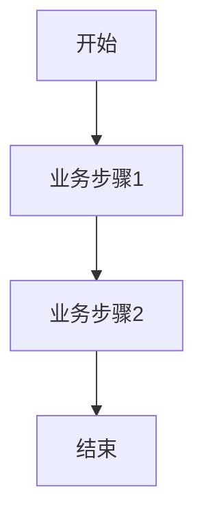

<!--
文档说明：
- 内容：模块业务需求文档模板
- 作用：记录业务需求、功能规格、验收标准
- 使用方法：详细记录业务需求，不包含技术实现
-->

# marketing-campaigns模块 - 业务需求文档

📅 **创建日期**: 2025-09-16  
👤 **需求方**: 电商平台业务团队  
✅ **评审状态**: 已确认 (优惠券系统提前到第二期)  
🔄 **最后更新**: 2025-09-16  

## 业务背景

### 业务目标
构建灵活的营销活动体系，通过优惠券、促销活动等工具提升用户转化率和客单价，实现平台销售增长。

### 业务场景
1. **新用户拉新**: 新用户注册送优惠券，引导首次购买
2. **老用户促活**: 通过限时优惠、会员专享等活动提升复购
3. **节日营销**: 结合节假日推出专题活动，刺激消费
4. **清库促销**: 通过满减、买赠等活动清理库存
5. **会员营销**: 结合会员体系推出专属优惠和权益

### 成功指标
- **优惠券使用率**: ≥40% (发放优惠券的使用比例)
- **活动转化率**: ≥15% (参与活动用户的购买转化率)
- **客单价提升**: ≥20% (活动期间相比平时的客单价增长)
- **新用户转化**: ≥25% (新用户优惠券带来的首购转化率)

## 功能需求

### 核心功能列表  
| 功能ID | 功能名称 | 优先级 | 业务价值 | 验收标准 |
|--------|----------|--------|----------|----------|
| MC-F001 | 优惠券系统 | 高 | 用户激励，提升转化率 | 支持多种优惠券类型和规则 |
| MC-F002 | 满减活动 | 中 | 提升客单价和销售额 | 支持满额减价和满件减价 |
| MC-F003 | 限时抢购 | 中 | 营造紧迫感，快速去库存 | 支持秒杀和限时折扣 |
| MC-F004 | 会员专享活动 | 中 | 会员权益体现，提升忠诚度 | 会员专属价格和活动 |
| MC-F005 | 新用户专区 | 高 | 新用户引导和转化 | 新手礼包和首购优惠 |
| MC-F006 | 活动数据分析 | 低 | 优化营销策略和ROI | 活动效果统计和分析 |

### 详细功能描述

#### MC-F001: 优惠券系统
- **业务描述**: 提供灵活的优惠券创建、发放、使用和管理功能
- **用户故事**: 作为用户，我希望能获得和使用各种优惠券，以便享受更优惠的价格
- **前置条件**: 用户已注册为平台会员
- **业务规则**: 
  - 优惠券类型: 满减券、折扣券、免运费券、商品券
  - 发放方式: 注册送、活动送、会员送、购买送
  - 使用限制: 使用门槛、有效期、使用次数、适用商品范围
  - 叠加规则: 不同类型优惠券的叠加使用规则
- **异常处理**: 优惠券过期、已使用、不满足条件时的提示和处理

#### MC-F002: 满减活动
- **业务描述**: 设置满额减价和满件减价的促销活动
- **用户故事**: 作为用户，我希望购买达到一定金额或数量时能自动享受优惠，鼓励我增加购买
- **前置条件**: 活动已设置并在有效期内
- **业务规则**: 
  - 满额减: 满X元减Y元，支持阶梯满减
  - 满件减: 满X件减Y元或减Y%
  - 活动范围: 全场、指定分类、指定商品
  - 与优惠券的叠加使用规则
- **异常处理**: 退货时满减优惠的处理逻辑

#### MC-F003: 限时抢购  
- **业务描述**: 创建有时间限制的抢购活动，营造紧迫感
- **用户故事**: 作为用户，我希望能参与限时抢购获得超值商品，享受稀缺性带来的价值感
- **前置条件**: 活动已配置并到达开始时间
- **业务规则**: 
  - 活动时间: 精确到分钟的开始和结束时间
  - 库存限制: 抢购商品数量限制和个人限购
  - 价格机制: 秒杀价、限时折扣价
  - 抢购规则: 排队机制、支付时限
- **异常处理**: 活动结束、库存售罄、支付超时的处理

#### MC-F004: 会员专享活动
- **业务描述**: 为不同等级会员提供专属的营销活动和优惠
- **用户故事**: 作为VIP会员，我希望能享受专属的优惠活动，体现我的会员价值
- **前置条件**: 用户为指定等级的会员
- **业务规则**: 
  - 会员等级限制: 不同活动面向不同等级会员
  - 专享优惠: 会员专属价格、额外折扣、专属商品
  - 早鸟权益: 会员优先参与新活动
- **异常处理**: 会员等级变化时活动权益的处理

#### MC-F005: 新用户专区
- **业务描述**: 为新注册用户提供专属的优惠和引导
- **用户故事**: 作为新用户，我希望能获得新手福利，降低首次购买的门槛
- **前置条件**: 用户为新注册用户（注册7天内）
- **业务规则**: 
  - 新手礼包: 注册即送优惠券包
  - 首购优惠: 首次购买享受特殊折扣
  - 引导商品: 推荐适合新用户的入门商品
  - 有效期限: 新手权益的时效限制
- **异常处理**: 用户身份验证失败时的权益收回机制
|--------|----------|--------|----------|----------|
| {MODULE}-F001 | {功能名称} | 高 | {业务价值} | {验收标准} |
| {MODULE}-F002 | {功能名称} | 中 | {业务价值} | {验收标准} |

### 详细功能描述

#### {MODULE}-F001: {功能名称}
- **业务描述**: {详细的业务描述}
- **用户故事**: 作为{角色}，我希望{功能}，以便{价值}
- **前置条件**: {前置条件}
- **业务规则**: 
  - 规则1: {具体规则}
  - 规则2: {具体规则}
- **异常处理**: {异常情况和处理方式}

## 非功能需求

### 性能要求
- **响应时间**: {具体要求}
- **并发用户**: {具体数量}
- **数据量**: {预期数据量}

### 可用性要求
- **系统可用性**: {可用性指标}
- **故障恢复**: {恢复时间要求}

### 安全要求
- **数据安全**: {安全要求}
- **访问控制**: {权限要求}

### 扩展性要求
- **用户增长**: {用户增长预期}
- **功能扩展**: {扩展方向}

## 业务约束

### 合规要求
- {合规要求1}
- {合规要求2}

### 时间约束
- **交付时间**: {具体时间}
- **里程碑**: {关键时间节点}

### 资源约束
- **人力资源**: {资源限制}
- **技术约束**: {技术限制}

## 用户角色和权限

### 用户角色定义
| 角色名称 | 角色描述 | 权限范围 |
|----------|----------|----------|
| {角色1} | {角色描述} | {权限列表} |
| {角色2} | {角色描述} | {权限列表} |

### 权限矩阵
| 功能 | {角色1} | {角色2} | {角色3} |
|------|---------|---------|---------|
| {功能1} | ✅ | ❌ | 🔍 |
| {功能2} | ✅ | ✅ | ❌ |

## 业务流程

### 主要业务流程

### 异常流程
- **异常1**: {异常描述和处理流程}
- **异常2**: {异常描述和处理流程}

## 数据需求

### 核心业务实体
| 实体名称 | 业务含义 | 核心属性 |
|----------|----------|----------|
| {实体1} | {业务含义} | {属性列表} |
| {实体2} | {业务含义} | {属性列表} |

### 数据规则
- **唯一性**: {唯一性要求}
- **完整性**: {完整性要求}
- **一致性**: {一致性要求}

## 验收标准

### 功能验收
- [ ] {验收项1}
- [ ] {验收项2}
- [ ] {验收项3}

### 性能验收
- [ ] {性能指标1}
- [ ] {性能指标2}

### 安全验收
- [ ] {安全要求1}
- [ ] {安全要求2}

## 风险和依赖

### 业务风险
- **风险1**: {风险描述和缓解措施}
- **风险2**: {风险描述和缓解措施}

### 外部依赖
- **依赖1**: {依赖描述和影响}
- **依赖2**: {依赖描述和影响}

## 变更记录

| 日期 | 版本 | 变更内容 | 变更人 |
|------|------|----------|--------|
| 2025-09-16 | v1.0 | 初始版本 | {姓名} |
