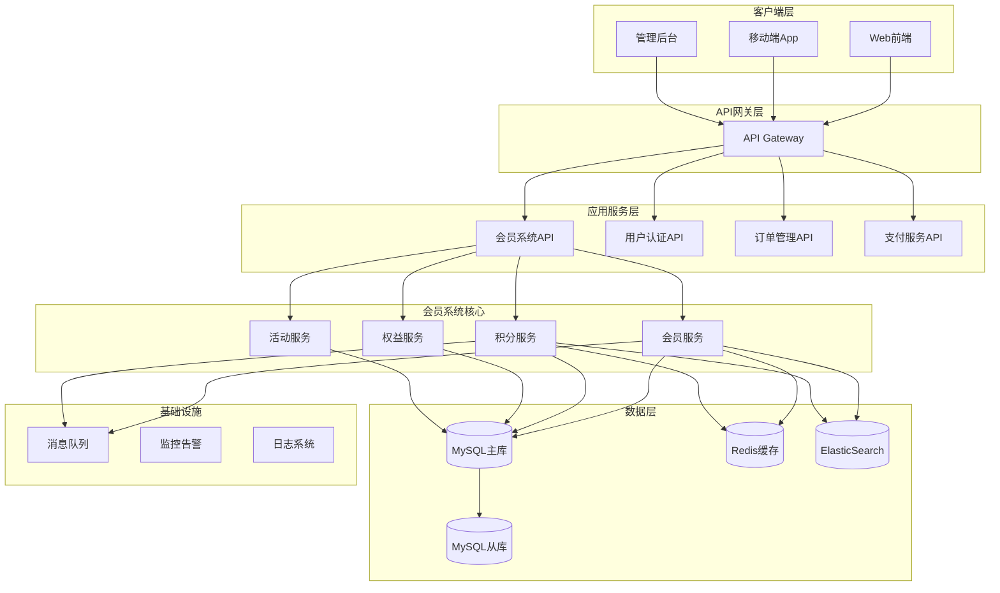
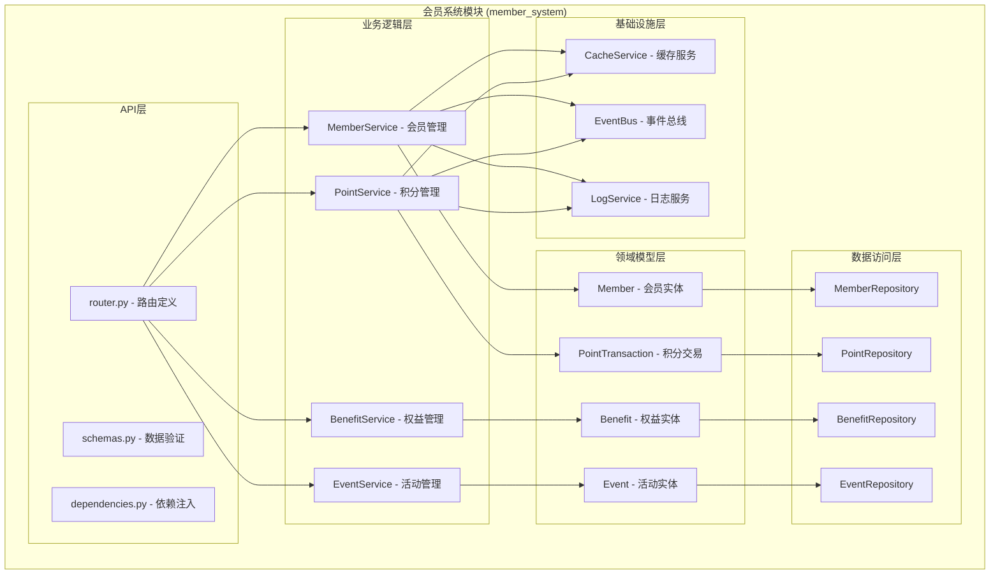
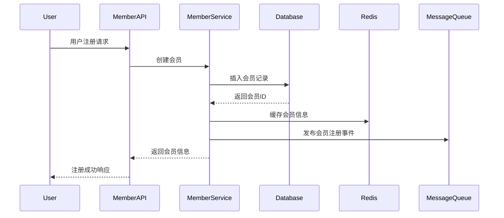
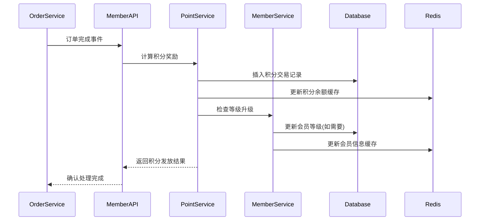
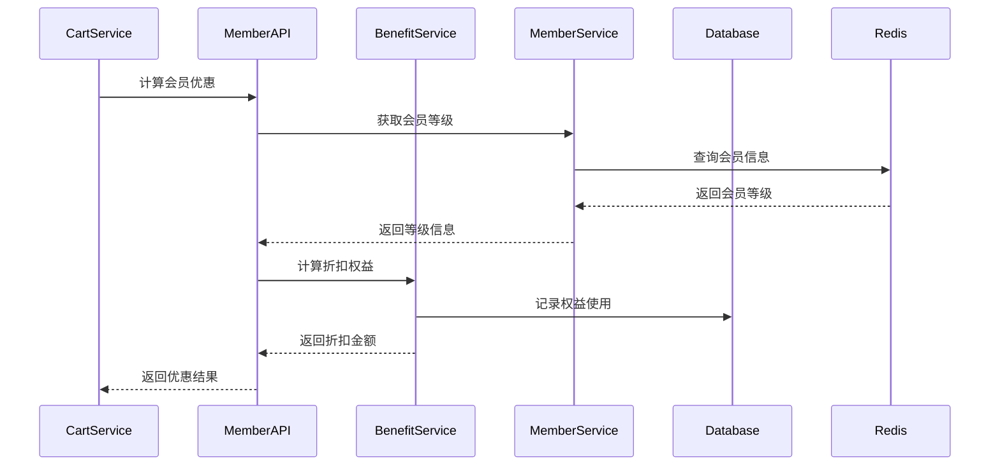
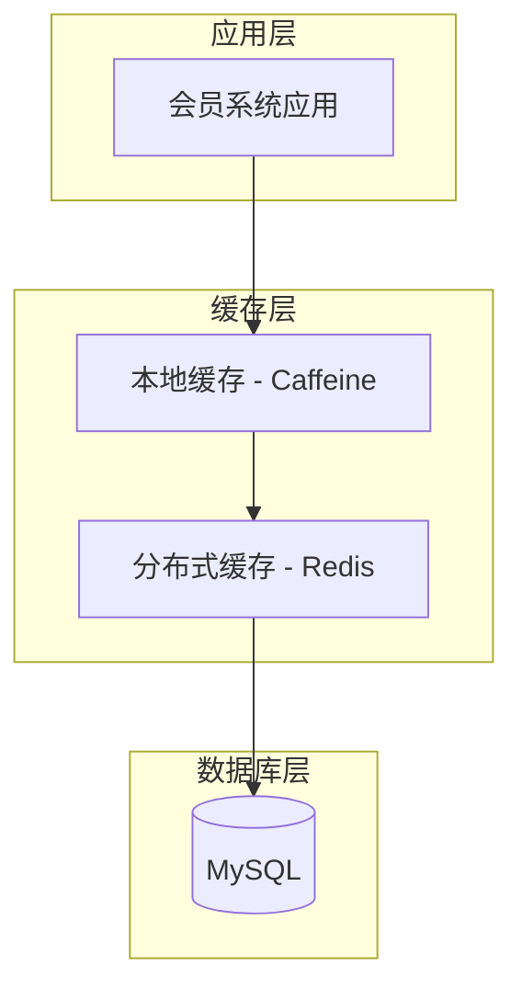
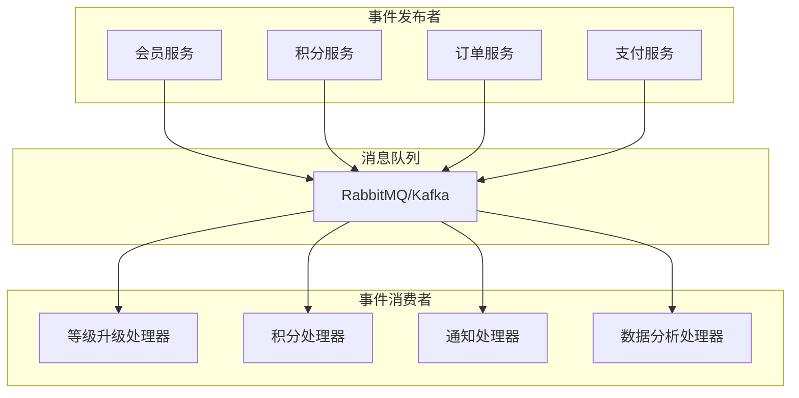

# 会员系统模块 - 架构设计文档

📅 **创建日期**: 2024-09-17  
👤 **架构师**: 技术架构师  
✅ **评审状态**: 设计中  
🔄 **最后更新**: 2024-09-17  

## 架构概述

### 设计目标
- **高性能**: 支持10万+并发用户，积分和等级计算响应时间<200ms
- **高可用**: 99.5%系统可用性，支持故障自动恢复
- **可扩展**: 模块化设计，支持新增权益类型和业务规则
- **数据一致性**: 保证积分、等级、权益数据的强一致性
- **安全性**: 完善的权限控制和数据加密机制

### 设计原则
- **领域驱动设计(DDD)**: 按业务领域划分模块边界
- **CQRS模式**: 读写分离，优化查询性能
- **事件驱动**: 异步处理非关键业务逻辑
- **微服务友好**: 低耦合设计，支持独立部署
- **缓存优先**: 多层缓存策略，提升响应性能

## 系统架构图

### 整体架构视图


### 模块内部架构


## 核心组件设计

### 1. 会员服务 (MemberService)
**职责**: 管理会员基础信息、等级升降、个人资料

**核心方法**:
```python
class MemberService:
    async def get_member_profile(self, user_id: int) -> MemberProfile
    async def update_member_info(self, member_id: int, data: dict) -> bool
    async def upgrade_member_level(self, member_id: int, new_level: int) -> bool
    async def calculate_member_level(self, total_spent: Decimal) -> int
    async def get_level_progress(self, member_id: int) -> LevelProgress
```

**依赖关系**:
- MemberRepository: 数据持久化
- CacheService: 缓存会员信息
- EventBus: 发布等级变更事件

### 2. 积分服务 (PointService)
**职责**: 处理积分获得、使用、过期、冻结等业务逻辑

**核心方法**:
```python
class PointService:
    async def earn_points(self, member_id: int, event: PointEvent) -> PointTransaction
    async def use_points(self, member_id: int, points: int, context: dict) -> PointTransaction
    async def freeze_points(self, member_id: int, points: int, reason: str) -> bool
    async def expire_points(self, member_id: int) -> List[PointTransaction]
    async def get_point_balance(self, member_id: int) -> PointBalance
    async def get_point_history(self, member_id: int, filters: dict) -> List[PointTransaction]
```

**业务规则**:
- 积分获得: 支持购物、评价、签到、生日等多种获得方式
- 积分使用: FIFO原则，优先使用即将过期的积分
- 积分冻结: 退货退款时冻结相应积分7天
- 积分过期: 2年有效期，定时任务处理过期

### 3. 权益服务 (BenefitService)  
**职责**: 管理会员权益配置、使用、统计

**核心方法**:
```python
class BenefitService:
    async def get_available_benefits(self, member_id: int) -> List[Benefit]
    async def use_benefit(self, member_id: int, benefit_id: int, context: dict) -> BenefitUsage
    async def calculate_discount(self, member_id: int, order_amount: Decimal) -> Decimal
    async def check_benefit_eligibility(self, member_id: int, benefit_id: int) -> bool
    async def get_benefit_usage_stats(self, member_id: int) -> BenefitStats
```

**权益类型设计**:
```python
class BenefitType(Enum):
    DISCOUNT = "discount"              # 折扣权益
    FREE_SHIPPING = "free_shipping"    # 免邮权益
    POINTS_MULTIPLIER = "points_multiplier"  # 积分倍率
    BIRTHDAY_GIFT = "birthday_gift"    # 生日礼品
    PRIORITY_SERVICE = "priority_service"    # 优先客服
    EXCLUSIVE_EVENT = "exclusive_event"      # 专属活动
```

### 4. 活动服务 (EventService)
**职责**: 管理会员专属活动、参与记录、奖励发放

**核心方法**:
```python
class EventService:
    async def get_available_events(self, member_id: int) -> List[MemberEvent]
    async def join_event(self, member_id: int, event_id: int, data: dict) -> Participation
    async def complete_event(self, participation_id: int) -> bool
    async def distribute_rewards(self, event_id: int) -> List[Reward]
    async def get_participation_history(self, member_id: int) -> List[Participation]
```

## 数据流设计

### 1. 会员注册流程


### 2. 积分获得流程


### 3. 权益使用流程  


## 缓存策略设计

### Redis缓存架构


### 缓存Key设计规范
```
# 会员基础信息
member:info:{member_id}     # TTL: 1小时
member:level:{level_id}     # TTL: 24小时  
member:benefits:{level_id}  # TTL: 30分钟

# 积分相关
member:points:{member_id}   # TTL: 5分钟
member:points:expiring:{member_id}  # TTL: 1小时

# 权益相关  
member:discount:{member_id} # TTL: 10分钟
member:benefits:used:{member_id}:{date}  # TTL: 24小时

# 活动相关
member:events:active        # TTL: 30分钟
member:event:{event_id}     # TTL: 1小时
```

### 缓存更新策略
1. **Cache-Aside模式**: 应用层主动管理缓存
2. **Write-Through**: 写入数据库同时更新缓存
3. **Write-Behind**: 异步批量更新数据库
4. **TTL过期**: 设置合理的过期时间
5. **事件驱动**: 数据变更时主动失效缓存

## 消息队列设计

### 事件驱动架构


### 核心事件定义
```python
class MemberEvent(BaseEvent):
    """会员相关事件基类"""
    member_id: int
    event_time: datetime

class MemberRegisteredEvent(MemberEvent):
    """会员注册事件"""
    user_id: int
    initial_level: int

class LevelUpgradedEvent(MemberEvent):
    """等级升级事件"""
    old_level: int
    new_level: int
    upgrade_reason: str

class PointsEarnedEvent(MemberEvent):
    """积分获得事件"""
    points: int
    event_type: str
    related_order: Optional[str]

class BenefitUsedEvent(MemberEvent):
    """权益使用事件"""
    benefit_id: int
    discount_amount: Decimal
    order_id: str
```

## 性能优化策略

### 1. 数据库优化
```sql
-- 分表策略: 积分交易按月分表
CREATE TABLE point_transactions_202409 LIKE point_transactions;
CREATE TABLE point_transactions_202410 LIKE point_transactions;

-- 读写分离: 查询使用从库
SELECT * FROM members WHERE user_id = ? -- 从库
UPDATE members SET total_spent = ? WHERE id = ? -- 主库

-- 索引优化: 覆盖索引减少回表
CREATE INDEX idx_member_level_spent ON members(level_id, total_spent, available_points);
```

### 2. 应用层优化
```python
# 批量操作减少数据库访问
async def batch_earn_points(self, point_events: List[PointEvent]) -> List[PointTransaction]:
    # 批量插入积分记录
    transactions = await self.point_repo.bulk_create(point_events)
    # 批量更新会员积分余额
    await self.member_repo.bulk_update_points(member_point_map)
    return transactions

# 异步处理非关键业务
@async_task
async def process_level_upgrade_notification(member_id: int, new_level: int):
    # 发送升级通知邮件/短信
    await notification_service.send_level_upgrade_notice(member_id, new_level)

# 缓存预热
async def warm_up_member_cache(member_ids: List[int]):
    members = await self.member_repo.batch_get(member_ids)
    await self.cache.batch_set({f"member:info:{m.id}": m for m in members})
```

### 3. 缓存优化
```python
class MemberCacheService:
    def __init__(self):
        self.local_cache = TTLCache(maxsize=10000, ttl=300)  # 本地缓存5分钟
        self.redis = Redis()  # 分布式缓存
    
    async def get_member_info(self, member_id: int) -> Optional[Member]:
        # L1: 本地缓存
        if member_id in self.local_cache:
            return self.local_cache[member_id]
        
        # L2: Redis缓存  
        cached_data = await self.redis.get(f"member:info:{member_id}")
        if cached_data:
            member = Member.parse_obj(json.loads(cached_data))
            self.local_cache[member_id] = member
            return member
        
        # L3: 数据库
        member = await self.member_repo.get_by_id(member_id)
        if member:
            await self.set_member_cache(member)
        return member
```

## 安全架构设计

### 1. 数据加密
```python
class MemberSecurityService:
    def __init__(self, encryption_key: str):
        self.cipher = Fernet(encryption_key)
    
    def encrypt_sensitive_data(self, data: str) -> str:
        """加密敏感信息(如生日、手机号等)"""
        return self.cipher.encrypt(data.encode()).decode()
    
    def decrypt_sensitive_data(self, encrypted_data: str) -> str:
        """解密敏感信息"""
        return self.cipher.decrypt(encrypted_data.encode()).decode()
```

### 2. 权限控制
```python
class MemberPermissionService:
    def check_member_access_permission(self, user_id: int, target_member_id: int) -> bool:
        """检查用户是否有权限访问指定会员信息"""
        # 用户只能访问自己的信息
        if user_id == target_member_id:
            return True
        
        # 管理员可以访问所有信息  
        if self.is_admin(user_id):
            return True
        
        return False
    
    def check_admin_permission(self, user_id: int, action: str) -> bool:
        """检查管理员操作权限"""
        user_roles = self.get_user_roles(user_id)
        required_permissions = self.get_required_permissions(action)
        return any(perm in user_roles for perm in required_permissions)
```

### 3. 审计日志
```python
class AuditLogger:
    async def log_member_operation(self, operation: str, operator_id: int, 
                                 target_member_id: int, details: dict):
        """记录会员相关操作的审计日志"""
        audit_record = {
            "operation": operation,
            "operator_id": operator_id,
            "target_member_id": target_member_id,
            "details": details,
            "timestamp": datetime.utcnow(),
            "ip_address": request.client.host,
            "user_agent": request.headers.get("User-Agent")
        }
        await self.audit_repo.create(audit_record)
```

## 监控与告警

### 1. 关键指标监控
```python
# 业务指标
member_registration_rate = Counter("member_registration_total", "会员注册总数")
level_upgrade_rate = Counter("member_level_upgrade_total", "等级升级总数")
points_earned_total = Counter("points_earned_total", "积分发放总数")
points_used_total = Counter("points_used_total", "积分使用总数")

# 技术指标
api_response_time = Histogram("member_api_response_seconds", "API响应时间")
cache_hit_rate = Gauge("member_cache_hit_ratio", "缓存命中率")
database_connection_pool = Gauge("member_db_connections", "数据库连接数")
```

### 2. 告警规则配置
```yaml
# Prometheus告警规则
groups:
  - name: member_system_alerts
    rules:
      - alert: MemberAPIHighLatency
        expr: histogram_quantile(0.95, member_api_response_seconds) > 0.5
        for: 2m
        labels:
          severity: warning
        annotations:
          summary: "会员系统API响应延迟过高"
          
      - alert: MemberCacheLowHitRate  
        expr: member_cache_hit_ratio < 0.8
        for: 5m
        labels:
          severity: warning
        annotations:
          summary: "会员系统缓存命中率过低"
          
      - alert: MemberPointsCalculationError
        expr: increase(points_calculation_errors_total[5m]) > 10
        for: 1m
        labels:
          severity: critical
        annotations:
          summary: "积分计算出现大量错误"
```

## 容灾与备份

### 1. 数据备份策略
```bash
#!/bin/bash
# 会员系统数据备份脚本

# MySQL全量备份(每日)
mysqldump --single-transaction --routines --triggers \
  --databases member_system > /backup/member_system_full_$(date +%Y%m%d).sql

# MySQL增量备份(每小时)  
mysqldump --single-transaction --where="updated_at >= DATE_SUB(NOW(), INTERVAL 1 HOUR)" \
  member_system.members member_system.point_transactions > /backup/member_system_inc_$(date +%Y%m%d_%H).sql

# Redis备份(每6小时)
redis-cli --rdb /backup/member_cache_$(date +%Y%m%d_%H).rdb
```

### 2. 故障恢复方案
```python
class MemberSystemRecoveryService:
    async def health_check(self) -> Dict[str, bool]:
        """系统健康检查"""
        checks = {
            "database": await self.check_database_health(),
            "cache": await self.check_cache_health(),
            "message_queue": await self.check_mq_health()
        }
        return checks
    
    async def failover_to_readonly_mode(self):
        """切换到只读模式"""
        # 禁用写操作
        await self.config_service.set("member_system.readonly", True)
        # 切换到从数据库
        await self.db_service.switch_to_slave()
        # 发送告警通知
        await self.alert_service.send_alert("会员系统已切换到只读模式")
```

## 扩展性设计

### 1. 插件化权益系统
```python
class BenefitPlugin(ABC):
    """权益插件基类"""
    
    @abstractmethod
    async def calculate_benefit(self, member: Member, context: dict) -> BenefitResult:
        """计算权益价值"""
        pass
    
    @abstractmethod
    def is_applicable(self, member: Member, context: dict) -> bool:
        """检查权益是否适用"""
        pass

class DiscountBenefitPlugin(BenefitPlugin):
    """折扣权益插件"""
    
    async def calculate_benefit(self, member: Member, context: dict) -> BenefitResult:
        order_amount = context.get("order_amount", 0)
        discount_rate = member.level.discount_rate
        discount_amount = order_amount * (1 - discount_rate)
        return BenefitResult(discount_amount=discount_amount)
```

### 2. 规则引擎支持
```python
class MemberRuleEngine:
    """会员业务规则引擎"""
    
    def __init__(self):
        self.rules = {}
    
    def register_rule(self, rule_name: str, rule_func: Callable):
        """注册业务规则"""
        self.rules[rule_name] = rule_func
    
    async def execute_rule(self, rule_name: str, context: dict):
        """执行业务规则"""
        if rule_name in self.rules:
            return await self.rules[rule_name](context)
        raise ValueError(f"规则 {rule_name} 不存在")

# 使用示例
rule_engine = MemberRuleEngine()

@rule_engine.register_rule("level_upgrade")
async def level_upgrade_rule(context: dict):
    member = context["member"]
    total_spent = context["total_spent"]
    # 根据消费金额计算应该的等级
    new_level = calculate_target_level(total_spent)
    if new_level > member.level_id:
        await upgrade_member_level(member.id, new_level)
```

## 技术选型说明

### 开发框架
- **FastAPI**: 现代、高性能的Python Web框架
- **SQLAlchemy**: ORM框架，支持异步操作
- **Pydantic**: 数据验证和序列化
- **Alembic**: 数据库迁移工具

### 存储选型
- **MySQL 8.0**: 主数据库，支持JSON字段和分区
- **Redis 6.0**: 缓存和会话存储
- **ElasticSearch**: 日志存储和全文搜索

### 基础设施  
- **Docker**: 容器化部署
- **Kubernetes**: 容器编排
- **Prometheus + Grafana**: 监控和告警
- **ELK Stack**: 日志收集和分析

这个架构设计确保了会员系统的高性能、高可用和可扩展性，能够满足大型电商平台的业务需求。
