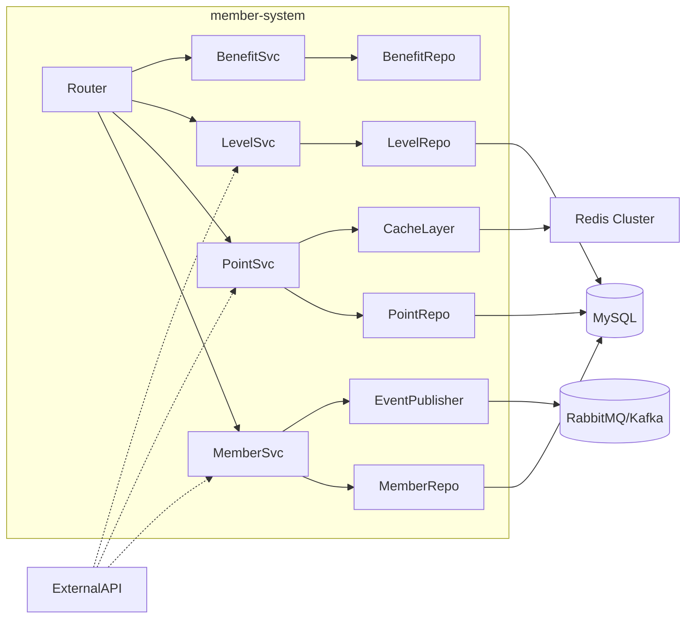
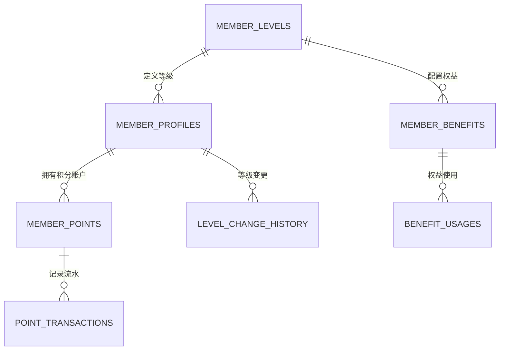
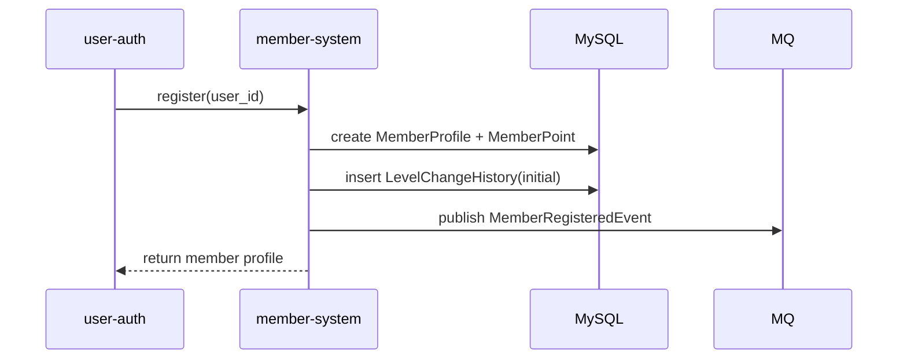
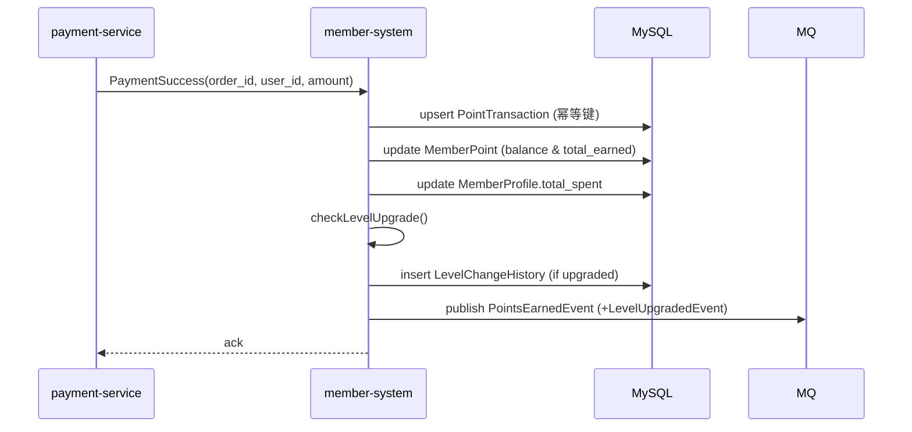
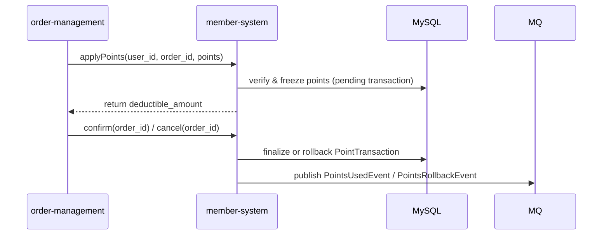
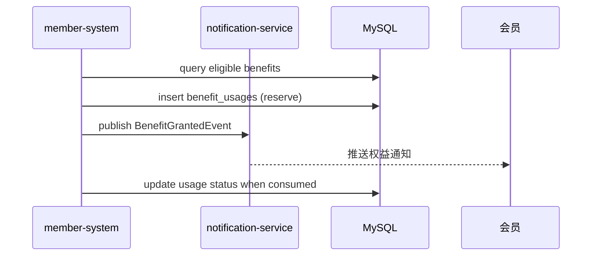

# 会员系统模块 - 技术设计文档（design.md）

📝 **状态**: ✅ 设计完成  
📅 **创建日期**: 2025-09-18  
👤 **负责人**: 架构师 & 技术负责人  
🔄 **最后更新**: 2025-10-22  
📋 **版本**: v2.0.0  

---

## 1. 引言

### 1.1 业务域定位
- **业务域**：用户域（User Domain），参见 `docs/architecture/business-architecture.md` 第49行，会员系统负责会员等级与积分管理。
- **模块职责**：提供会员档案、等级、积分、权益能力，为营销、订单等模块提供用户价值体系支撑。
- **不属于本模块的职责**：用户认证（user-auth）、订单生命周期（order-management）、优惠券与营销活动（marketing-campaigns）、支付（payment-service）。

### 1.2 模块边界定义

**包含功能**（引用业务架构定义）
- ✅ 会员档案及等级管理（REQ-MEMBER-001、002）
- ✅ 积分账户、流水与抵扣（REQ-MEMBER-003、005）
- ✅ 等级权益配置与发放（REQ-MEMBER-004）
- ✅ 会员事件通知、运营指标输出（REQ-MEMBER-008、009）

**排除功能**
- ❌ 用户注册/登录 → `user-auth`
- ❌ 订单创建与结算 → `order-management`
- ❌ 支付与退款 → `payment-service`
- ❌ 优惠券、营销活动 → `marketing-campaigns`
- ❌ 推送/短信通知发送 → `notification-service`

**依赖关系检查表**
- 依赖模块：
	- `user-auth`：获取用户身份、校验证权
	- `order-management`：提供消费金额、订单状态
	- `payment-service`：支付成功事件触发积分
	- `notification-service`：消费会员事件推送
	- `data-analytics-platform`：订阅会员指标
- 被依赖模块：`marketing-campaigns`、`recommendation-system`、`order-management`

**模块边界自检**
- [x] 数据模型仅包含会员、积分、权益相关字段
- [x] 业务逻辑无跨模块实现，跨模块通过事件与接口交互
- [x] API 仅暴露会员相关能力，未泄露其他模块职责
- [x] 依赖方向遵循单向依赖，无循环依赖

### 1.3 需求追踪

| 设计章节 | 覆盖需求 | 备注 |
|-----------|-----------|------|
| §2 架构概览 | REQ-MEMBER-001~010，NFR-001~011 | 描述整体架构及依赖 |
| §3 数据模型 | REQ-MEMBER-001~004，008 | 引用 `database-design.md` 详细结构 |
| §4 业务流程 | REQ-MEMBER-001~007，009，010 | 使用序列图描述核心流程 |
| §5 接口设计 | REQ-MEMBER-005，007，009，010 | 对应 `api-spec.md` 中端点 |
| §6 安全考虑 | NFR-007~009 | 权限、审计、数据保护 |
| §7 性能与扩展 | NFR-001~006，010~011 | 缓存、幂等、水平扩展 |
| §8 变更影响 | R1~R4 | 对外依赖与迁移策略 |

### 1.4 设计约束
- 技术栈：FastAPI 0.104.1、Pydantic 2.5.0、SQLAlchemy 2.0.23、MySQL 8.0、Redis 7.0。
- 架构形态：模块化单体，Router → Service → Repository → Model 四层结构。
- 命名规范：遵循 `docs/standards/naming-conventions-standards.md`（member_system、/member-system/、member_ 前缀）。
- 接口规范：遵循 `docs/standards/api-standards.md`（RESTful、JWT、错误码统一）。
- 数据规范：遵循 `docs/standards/database-standards.md`（INTEGER 主键、复数表名、索引策略）。

---

## 2. 设计概览

### 2.1 分层架构
```mermaid
graph TD
		Client[客户端 / 内部模块] --> API[Router 层]
		API --> Service[Service 层]
		Service --> Repo[Repository 层]
		Repo --> Model[Model 层]
		Service --> Cache[缓存层 (Redis)]
		Service --> MQ[消息队列]
		Service --> Ext[外部模块 API]
```

- **Router 层**：位于 `app/modules/member_system/router.py`，负责请求路由、依赖注入、响应模型。
- **Service 层**：`service.py` 中的 `MemberService`、`PointService`、`LevelService`、`BenefitService`。实现业务规则、幂等控制、事件发布。
- **Repository 层**：封装数据库访问，提供面向领域的查询方法。
- **Model 层**：`models.py` SQLAlchemy ORM 实体，与数据库设计对齐。
- **Shared 组件**：重用 `app/shared/database.py`、`app/core/auth.py` 等核心能力。

### 2.2 核心组件视图


### 2.3 外部交互
- **消费外部事件**：来自 `payment-service` 的支付成功事件（积分发放）、`order-management` 的订单取消事件（积分回滚）。
- **发布事件**：`MemberRegisteredEvent`、`PointsEarnedEvent`、`LevelUpgradedEvent` 推送到 MQ，被 `notification-service`、`marketing-campaigns`、`data-analytics-platform` 订阅。
- **同步接口**：提供 RESTful API 给其他模块查询/写入（详见 §5）。

### 2.4 配置化能力
- 等级与权益规则存储在 `member_levels.benefits` 与 `member_benefits.payload` JSON 字段，可通过运营后台配置。
- 积分策略（倍率、过期时间、各业务来源权重）存储在 `app/modules/member_system/config.py` 或数据库配置表，并通过缓存推送。

---

## 3. 数据模型

> 详细 DDL 见 `database-design.md`，此处聚焦领域视角与实体关系。

### 3.1 领域实体关系


### 3.2 ORM 模型

| 模型 | 表名 | 关键字段 | 说明 |
|------|------|----------|------|
| `MemberLevel` | `member_levels` | `level_name`, `min_points`, `discount_rate`, `benefits` | 等级定义，JSON 权益配置 |
| `MemberProfile` | `member_profiles` | `member_code`, `user_id`, `level_id`, `total_spent`, `status` | 会员档案，记录消费、状态 |
| `MemberPoint` | `member_points` | `current_points`, `total_earned`, `total_used`, `level_id` | 积分账户，保证非负与一致性 |
| `PointTransaction` | `point_transactions` | `transaction_type`, `points_change`, `reference_id`, `status` | 积分变动流水，含幂等键 |
| `LevelChangeHistory` | `level_change_history` | `old_level`, `new_level`, `change_reason` | 固化等级变更历史，用于审计 |
| `MemberBenefit` | `member_benefits` | `benefit_type`, `payload`, `quota`, `valid_period` | 权益配置，支持灵活扩展 |
| `BenefitUsage` | `benefit_usages` | `benefit_id`, `usage_time`, `context` | 权益实际使用记录，支撑风控 |

所有模型执行以下规范：
- 主键使用 `Integer` + 自增（兼容 SQLite 测试环境与 MySQL 生产）。
- 定义 `__tablename__` 与 `__table_args__`，包含唯一索引、检查约束。
- 统一继承项目 `Base`，并在 `models.py` 中集中声明。

### 3.3 Pydantic Schema
- `MemberProfileSchema`、`MemberPointBalanceSchema`、`PointTransactionSchema`、`MemberLevelSchema` 等，采用 Pydantic v2 TypedDict + BaseModel 模式，支持 JSON 序列化。
- Request/Response 模型在 `schemas.py` 中定义，具备校验、示例、字段描述，符合 `api-standards.md`。

### 3.4 缓存与索引
- 热点数据：`member:profile:{user_id}`、`member:points:{user_id}`、`member:benefits:{level_id}`。
- 索引策略：参考 `database-design.md` 中的唯一索引、联合索引与检查约束，覆盖高频查询场景（积分流水、等级变更）。

---

## 4. 业务流程

### 4.1 会员注册初始化（REQ-MEMBER-001）


### 4.2 支付触发积分发放（REQ-MEMBER-003/005/009）


### 4.3 积分抵扣与回滚（REQ-MEMBER-005）


### 4.4 权益发放与使用（REQ-MEMBER-004/007）


### 4.5 运营看板数据生成（REQ-MEMBER-008）
- 数据通过定时任务写入汇总表或推送到 `data-analytics-platform`：
	1. 每日 02:00 运行批处理，聚合会员等级、积分使用、权益使用数据。
	2. 结果写入 `member_metrics_daily`（可在后续实现），同时推送 MQ 供分析平台消费。

---

## 5. 接口设计

> 详见 `api-spec.md`，此处概述关键端点与设计要点。

### 5.1 RESTful 端点

| 端点 | 方法 | 描述 | 需求映射 | 备注 |
|------|------|------|----------|------|
| `/api/v1/member-system/profile` | GET | 查询当前会员档案 | REQ-MEMBER-001 | JWT 校验，返回等级与积分概览 |
| `/api/v1/member-system/profile` | PUT | 更新会员偏好 | REQ-MEMBER-001 | 仅允许更新偏好、生日等可配置字段 |
| `/api/v1/member-system/points/balance` | GET | 查询积分余额 | REQ-MEMBER-003 | 返回积分余额、冻结、即将过期信息 |
| `/api/v1/member-system/points/earn` | POST | 积分发放（系统调用） | REQ-MEMBER-003/009 | `system` 角色调用，幂等键控制 |
| `/api/v1/member-system/points/use` | POST | 积分使用/抵扣 | REQ-MEMBER-005 | 订单模块调用，返回抵扣金额 |
| `/api/v1/member-system/levels` | GET | 获取等级定义 | REQ-MEMBER-002 | 支持公共访问，缓存 24h |
| `/api/v1/member-system/admin/recalculate/{member_id}` | POST | 重算积分/等级 | REQ-MEMBER-002/003 | admin 使用，记录审计日志 |
| `/api/v1/member-system/stats/summary` | GET | 会员指标汇总 | REQ-MEMBER-008 | admin/operator 权限 |
| `/api/v1/member-system/health` | GET | 健康检查 | NFR-005 | 用于探针，无敏感数据 |

### 5.2 内部事件契约
- `MemberRegisteredEvent`：`member_id`, `user_id`, `level_id`, `register_time`。
- `PointsEarnedEvent`：`member_id`, `order_id`, `points`, `current_balance`, `source`。
- `PointsUsedEvent`/`PointsRollbackEvent`：用于支付失败、取消时补偿。
- `LevelUpgradedEvent`：`member_id`, `old_level`, `new_level`, `trigger`。
- `BenefitGrantedEvent`：`member_id`, `benefit_type`, `payload`。

事件通过 MQ 发布，遵循“至少一次”语义，消费者需幂等。

### 5.3 依赖接口
- 调用 `user-auth` 以验证 token 与获取用户基础信息。
- 调用 `order-management` 获取订单金额、确认退款。
- 调用 `payment-service` 的对账接口进行积分核对。
- 调用 `notification-service` 的内部 API 发送模板消息（可选，推荐通过事件触发）。

---

## 6. 安全考虑

### 6.1 身份认证与授权
- 所有接口使用 JWT Bearer Token，结合 FastAPI `Depends` 注入。
- 基于角色（member/operator/admin/system）控制访问范围，权限定义参考 `requirements.md` §6。
- Admin/Operator 敏感操作（等级调整、积分修复）需要双重校验：
	- API 请求需传入工号/原因
	- Service 层写入 `audit_logs`（可复用平台能力）

### 6.2 数据保护
- 积分、等级变更均写入审计日志，可追溯。
- 敏感信息（联系方式、地址）避免在日志打印，使用遮罩。
- 与 `notification-service` 交互时仅传输必要字段。

### 6.3 风控与一致性
- 幂等：
	- 积分获取/使用通过 `reference_id`+`transaction_type` 构建唯一约束。
	- Service 层提供缓存/数据库双校验，避免重复处理。
- 分布式锁：对高并发操作（积分抵扣）采用 Redis 基于 `SET NX` 的短期锁，默认 TTL 5s。
- 失败重试：
	- 事件发布失败重试 3 次，落库补偿表。
	- 外部依赖超时回退到补偿队列。

### 6.4 合规性
- 会员数据删除需同步清理个人信息（遵循《个人信息保护法》），保留必要的交易流水记录以满足审计。
- 操作日志保留至少 2 年，满足运营与审计需求。

---

## 7. 性能与扩展

### 7.1 缓存策略
- **L1 本地缓存**：使用 `functools.lru_cache`/Caffeine（如引入）缓存等级配置。
- **L2 Redis 缓存**：
	- `member:profile:{user_id}` TTL=30min
	- `member:points:{user_id}` TTL=5min（写操作后主动失效）
	- 使用 `SETEX` + JSON 编码存储，命中率目标 80%以上。

### 7.2 数据库优化
- 分库策略预留：未来会员数据量大时可按 `member_id` 取模拆分。
- 读写分离：查询类 API 可走从库，写操作强制主库。
- 定期归档：`point_transactions` 超过 24 个月的数据迁移到归档表。

### 7.3 并发控制
- 写操作通过数据库事务 + 行级锁保证一致性。
- 高并发消费积分时使用 Redis Lua 脚本实现原子扣减，失败回滚。
- 定时任务与在线操作通过任务队列调度，避免大批量操作阻塞 API。

### 7.4 可扩展性
- 适配器模式封装外部模块交互，便于未来拆分微服务。
- 权益逻辑通过策略模式实现，新增权益类型无需修改核心流程。
- 预留 Feature Flag 控制新功能灰度发布。

---

## 8. 变更影响与迁移

### 8.1 对其他模块的影响
- `order-management`：需要适配积分抵扣数据结构，确保订单状态与积分状态同步。
- `payment-service`：需确保支付成功事件包含 `user_id`、`order_id`、`pay_amount`。
- `marketing-campaigns`：可订阅等级/积分事件，开展精准活动。
- `notification-service`：新增模板消息类型（等级升级、积分将过期）。

### 8.2 数据迁移计划
- 从旧表结构迁移：使用 Alembic 生成迁移脚本，先创建新表，再编写一次性迁移脚本迁移数据。
- 数据一致性校验：迁移后运行脚本比对 `member_points` 与 `point_transactions` 汇总值。
- 回滚策略：迁移前备份相关表，出现问题可快速回滚至旧版本。

### 8.3 风险与缓解
- **R1** 幂等逻辑缺失导致重复记账 → 在数据库层强制唯一约束并建立补偿机制。
- **R2** 缓存不一致 → 写操作完成后删除缓存，不直接更新，确保下次读取命中数据库。
- **R3** 运营配置失误 → 提供配置校验脚本与灰度开关。
- **R4** 下游事件消费失败 → 事件持久化并提供手动补发工具。

---

## 附录

- **相关文档**：
	- `requirements.md`（需求追踪与验收标准）
	- `api-spec.md`（接口契约）
	- `database-design.md`（数据结构细节）
	- `implementation.md`（实现与部署细节）
- **工具建议**：设计落地前运行 `tools/validate_standards.ps1 -Action full -DocPath docs/design/modules/member-system/design.md`，确保符合 A8 检查。

---

📄 **规范遵循**：`docs/standards/document-management-standards.md` A8 要求  
🔄 **文档更新**：2025-10-22 - 重构为 A8 标准结构，补全需求追踪与流程设计
