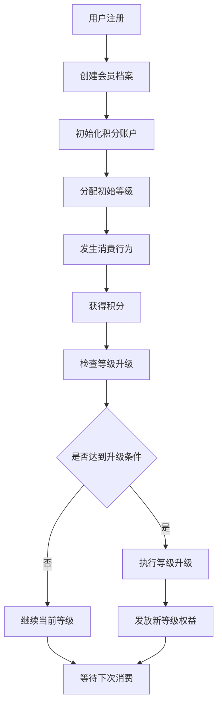
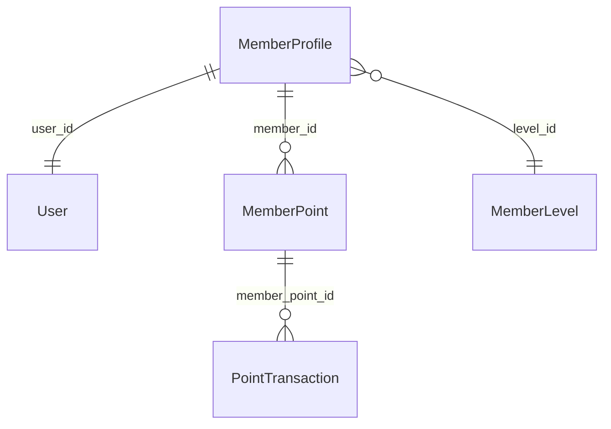

# 会员系统模块 - 模块概述

📝 **状态**: ✅ 已发布  
📅 **创建日期**: 2025-09-18  
👤 **负责人**: 产品经理 & 技术负责人  
🔄 **最后更新**: 2025-09-18  
📋 **版本**: v1.0.0  

## 模块概述

### 主要职责
会员系统模块是电商平台的核心商业化模块，主要职责包括：
- **会员生命周期管理** - 从注册到注销的完整会员生命周期
- **积分经济体系** - 积分获得、消费、过期的完整闭环管理
- **等级权益体系** - 基于消费行为的会员等级自动管理
- **个性化服务** - 基于会员画像的个性化权益和服务
- **商业价值转化** - 通过会员体系提升用户粘性和客单价

### 业务价值
- **核心价值**: 构建用户忠诚度体系，提升用户生命周期价值(LTV)
- **用户收益**: 通过积分和等级权益获得实际优惠和专属服务
- **系统收益**: 提升用户留存率、复购率和客单价，增强商业竞争力
- **数据价值**: 沉淀用户行为数据，为精准营销提供数据支撑

### 模块边界
- **包含功能**: 会员注册/信息管理、积分获得/使用/管理、等级自动晋升、权益发放与使用
- **排除功能**: 用户身份认证(属于user-auth)、订单处理(属于order-management)、支付处理(属于payment-service)
- **依赖模块**: user-auth(用户认证)、order-management(订单数据)、notification-service(通知服务)
- **被依赖**: marketing-campaigns(营销活动)、recommendation-system(推荐系统)

## 技术架构

### 架构图
```
┌─────────────────────────────────────────────────────────────┐
│                    会员系统模块架构                          │
├─────────────────────────────────────────────────────────────┤
│  API Layer (router.py)                                     │
│  ├── 会员管理API   ├── 积分管理API   ├── 等级管理API        │
├─────────────────────────────────────────────────────────────┤
│  Business Layer (service.py)                               │
│  ├── MemberService ├── PointService ├── LevelService       │
├─────────────────────────────────────────────────────────────┤
│  Data Layer (models.py)                                    │
│  ├── MemberLevel   ├── MemberProfile ├── MemberPoint       │
│  └── PointTransaction                                      │
├─────────────────────────────────────────────────────────────┤
│  External Dependencies                                      │
│  ├── Redis Cache   ├── Database    ├── Message Queue       │
└─────────────────────────────────────────────────────────────┘
```

### 核心组件
```
member_system/
├── router.py           # API路由定义
├── service.py          # 业务逻辑处理
├── models.py           # 数据模型定义
├── schemas.py          # 请求/响应模型
├── dependencies.py     # 模块依赖注入
└── utils.py            # 工具函数
```

### 模块化单体架构
- **架构模式**: 模块化单体架构 (Modular Monolith)
- **垂直切片**: 每个模块包含完整的业务功能
- **依赖原则**: 依赖注入和接口抽象

### 核心基础设施
```
app/core/               # 核心基础设施
├── database.py         # 数据库连接管理
├── redis_client.py     # Redis缓存客户端  
├── auth.py             # 认证中间件
└── __init__.py         # 核心组件导出
```

### 适配器集成
```
app/adapters/           # 第三方服务适配器
├── notification/       # 通知服务适配器
│   ├── email_adapter.py
│   └── sms_adapter.py
```

### 技术栈
- **编程语言**: Python 3.11+
- **Web框架**: FastAPI
- **数据库**: MySQL 8.0
- **缓存**: Redis
- **其他依赖**: SQLAlchemy, Pydantic, Alembic

### 设计模式
- **使用的设计模式**: Repository、Service、Factory
- **架构模式**: Clean Architecture、模块化单体
- **代码组织**: 四层架构(Router-Service-Repository-Model)

## 核心功能

### 功能列表
| 功能名称 | 优先级 | 状态 | 描述 |
|---------|--------|------|------|
| 会员档案管理 | 高 | ✅ 已完成 | 会员信息的创建、更新、查询 |
| 积分获得机制 | 高 | ✅ 已完成 | 多场景积分获得和记录 |
| 积分使用功能 | 高 | ✅ 已完成 | 积分抵扣和余额管理 |
| 等级自动晋升 | 高 | ✅ 已完成 | 基于消费的自动等级计算 |
| 权益发放 | 中 | 🔄 开发中 | 等级权益的自动发放 |
| 积分过期处理 | 中 | ⏳ 待开始 | 批量积分过期处理 |

### 核心业务流程


### 业务规则
1. **积分获得规则**: 每消费1元获得1积分，VIP会员享受1.5倍积分
2. **等级晋升规则**: 基于累计消费金额，达到门槛自动晋升
3. **积分过期规则**: 积分有效期2年，按FIFO顺序过期
4. **权益使用规则**: 等级权益当月生效，降级时权益延续至月底

## 数据模型

### 核心实体
```python
# 会员档案模型
class MemberProfile(Base):
    __tablename__ = "member_profiles"
    
    id = Column(Integer, primary_key=True)
    user_id = Column(Integer, ForeignKey("users.id"), unique=True)
    level_id = Column(Integer, ForeignKey("member_levels.id"))
    total_spent = Column(Decimal(10, 2), default=0)
    created_at = Column(DateTime, default=datetime.utcnow)
    updated_at = Column(DateTime, default=datetime.utcnow, onupdate=datetime.utcnow)

# 积分账户模型
class MemberPoint(Base):
    __tablename__ = "member_points"
    
    id = Column(Integer, primary_key=True)
    member_id = Column(Integer, ForeignKey("member_profiles.id"))
    current_points = Column(Integer, default=0)
    total_earned = Column(Integer, default=0)
    total_used = Column(Integer, default=0)
```

### 数据关系图


### 数据约束
- **唯一性约束**: 一个用户只能有一个会员档案
- **外键约束**: 会员档案关联用户和等级信息
- **业务约束**: 积分余额不能为负数，消费金额递增

## API接口

### 接口列表
| 接口 | 方法 | 路径 | 描述 | 状态 |
|------|------|------|------|------|
| 获取会员信息 | GET | /api/v1/member-system/profile | 获取当前用户会员信息 | ✅ |
| 更新会员信息 | PUT | /api/v1/member-system/profile | 更新会员个人信息 | ✅ |
| 获取积分余额 | GET | /api/v1/member-system/points | 获取积分账户信息 | ✅ |
| 积分使用 | POST | /api/v1/member-system/points/use | 使用积分抵扣 | ✅ |
| 积分历史 | GET | /api/v1/member-system/points/transactions | 获取积分变动历史 | ✅ |
| 获取等级列表 | GET | /api/v1/member-system/levels | 获取所有会员等级 | ✅ |

### 错误码
| 错误码 | 状态码 | 描述 | 解决方案 |
|--------|--------|------|----------|
| MEMBER_001 | 400 | 积分余额不足 | 检查可用积分余额 |
| MEMBER_002 | 404 | 会员信息不存在 | 确认用户已注册会员 |
| MEMBER_003 | 409 | 重复的积分操作 | 检查交易ID唯一性 |

## 测试策略

### 测试覆盖率目标
- **单元测试**: ≥ 85%
- **集成测试**: ≥ 70%
- **端到端测试**: 核心业务流程100%

### 性能测试
- **响应时间**: API响应时间 < 200ms
- **并发处理**: 支持1000并发请求
- **数据量**: 支持1000万会员记录

## 部署和运维

### 环境要求
- **开发环境**: Python 3.11+, MySQL 8.0, Redis 7.0
- **测试环境**: 与生产环境一致的容器化部署
- **生产环境**: Kubernetes集群，高可用配置

### 监控指标
- **业务指标**: 会员数量、积分发放量、等级分布
- **技术指标**: API响应时间、错误率、数据库连接数
- **资源指标**: CPU使用率、内存使用率、存储空间

## 安全考虑

### 认证授权
- **身份认证**: JWT Token验证
- **权限控制**: 基于用户角色的访问控制
- **API安全**: Rate Limiting、请求验证

### 数据安全
- **数据加密**: 敏感信息加密存储
- **传输安全**: HTTPS加密传输
- **输入验证**: 严格的参数验证和过滤

## 性能优化

### 缓存策略
- **会员信息缓存**: Redis缓存热点会员数据，TTL 1小时
- **积分余额缓存**: 实时更新积分余额缓存
- **等级信息缓存**: 静态等级配置长期缓存

### 数据库优化
- **索引优化**: user_id、member_id等关键字段建立索引
- **查询优化**: 分页查询、批量处理优化
- **连接池**: 合理配置数据库连接池大小

## 问题和风险

### 技术风险
- **数据一致性风险**: 积分操作的并发控制和事务管理
- **性能风险**: 大量积分计算可能影响系统性能
- **缓存风险**: 缓存与数据库数据不一致问题

### 技术债务
- **积分计算优化**: 当前同步计算，需要异步化处理
- **等级规则灵活性**: 硬编码的等级规则需要配置化

## 开发计划

### 里程碑
- **M1**: 基础功能开发 (2025-09-30)
- **M2**: 完整功能实现 (2025-10-15)
- **M3**: 性能优化 (2025-10-30)

### 任务分解
- [x] 数据模型设计 (负责人: 架构师)
- [x] API接口实现 (负责人: 后端工程师)
- [ ] 缓存层优化 (负责人: 后端工程师, 预计: 2025-10-25)
- [ ] 性能测试 (负责人: 测试工程师, 预计: 2025-10-28)

## 相关文档

### 架构文档
- [系统架构总览](../../architecture/overview.md)
- [API设计规范](../../../standards/api-standards.md)
- [数据模型规范](../../../standards/database-standards.md)

### 开发文档
- [开发规范](../../../standards/development-standards.md)
- [测试指南](../../../standards/testing-standards.md)
- [部署指南](../../../standards/deployment-standards.md)

### 需求文档
- [业务需求](./requirements.md)
- [技术设计](./design.md)

### 其他模块
- [用户认证模块](../user-auth/overview.md)
- [订单管理模块](../order-management/overview.md)
- [通知服务模块](../notification-service/overview.md)

---
📄 **规范遵循**: 严格按照 [module-template.md](../../templates/module-template.md) 标准制作  
🔄 **文档更新**: 2025-10-22 - 更新为符合标准的完整模块概述文档
