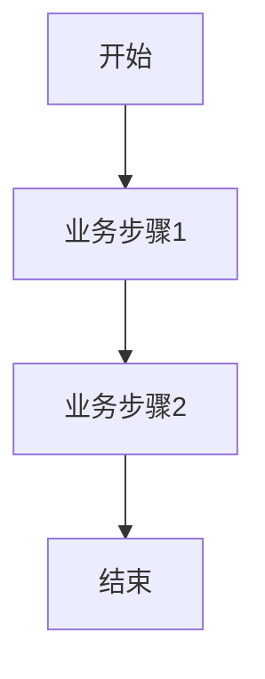

<!--
文档说明：
- 内容：模块业务需求文档模板
- 作用：记录业务需求、功能规格、验收标准
- 使用方法：详细记录业务需求，不包含技术实现
-->

# member-system模块 - 业务需求文档

📅 **创建日期**: 2025-09-16  
👤 **需求方**: 电商平台业务团队  
✅ **评审状态**: 已确认 (提前到第二期开发)  
🔄 **最后更新**: 2025-09-16  

## 业务背景

### 业务目标
构建完善的会员体系，通过等级权益和积分系统提升用户粘性和复购率，实现平台商业化变现的核心基础。

### 业务场景
1. **会员注册**: 用户注册后自动成为普通会员，享受基础权益
2. **等级晋升**: 根据消费金额和活跃度自动升级会员等级
3. **积分获取**: 用户通过购买、评价、分享等行为获得积分
4. **权益享受**: 不同等级会员享受专属价格、优先发货等权益
5. **积分消费**: 积分可用于抵扣、兑换商品或特权服务

### 成功指标
- **会员转化率**: ≥80% (注册用户成为活跃会员比例)
- **会员复购率**: ≥60% (会员3个月内再次购买比例)
- **会员贡献度**: ≥70% (会员用户贡献的总销售额占比)
- **积分活跃度**: ≥50% (会员使用积分的比例)

## 功能需求

### 核心功能列表
| 功能ID | 功能名称 | 优先级 | 业务价值 | 验收标准 |
|--------|----------|--------|----------|----------|
| MS-F001 | 会员等级体系 | 高 | 用户分层运营，提升忠诚度 | 支持5级会员体系，自动升降级 |
| MS-F002 | 积分系统 | 高 | 激励用户行为，增加粘性 | 积分获取、消费、过期管理 |
| MS-F003 | 会员权益管理 | 高 | 差异化服务，提升价值感 | 专享价格、优先服务等权益 |
| MS-F004 | 积分商城 | 中 | 积分变现，增加用户活跃 | 积分兑换商品和服务 |
| MS-F005 | 会员营销 | 中 | 精准营销，提升转化 | 个性化推荐、定向活动 |
| MS-F006 | 会员数据分析 | 低 | 运营决策支持 | 会员行为分析报表 |

### 详细功能描述

#### MS-F001: 会员等级体系
- **业务描述**: 建立5级会员体系，根据消费金额和活跃度自动升降级
- **用户故事**: 作为用户，我希望通过消费获得更高等级的会员权益，以便享受更好的服务
- **前置条件**: 用户已注册并完成实名认证
- **业务规则**: 
  - 新用户: 注册即获得，无特殊权益
  - 银卡会员: 累计消费≥500元或积分≥1000分
  - 金卡会员: 累计消费≥2000元或积分≥5000分  
  - 钻石会员: 累计消费≥5000元或积分≥15000分
  - 黑卡会员: 累计消费≥20000元或邀请推荐
- **异常处理**: 等级降级有6个月保护期，数据异常时人工审核

#### MS-F002: 积分系统
- **业务描述**: 用户通过各种行为获得积分，可用于抵扣和兑换
- **用户故事**: 作为用户，我希望我的消费和互动能获得积分奖励，并能用积分享受优惠
- **前置条件**: 用户为注册会员
- **业务规则**: 
  - 购买获取: 每消费1元获得1积分
  - 行为获取: 每日签到+5分，商品评价+10分，分享+5分
  - 积分消费: 100积分=1元，可抵扣订单金额的30%
  - 积分过期: 2年未使用的积分自动过期
- **异常处理**: 订单退款时扣除对应积分，不足时记为负数

#### MS-F003: 会员权益管理
- **业务描述**: 不同等级会员享受差异化的专属权益和服务
- **用户故事**: 作为VIP会员，我希望能享受专属优惠和优先服务，体现我的会员价值
- **前置条件**: 用户达到相应会员等级
- **业务规则**: 
  - 专享价格: 银卡95折，金卡9折，钻石88折，黑卡85折
  - 优先服务: 金卡以上优先发货，钻石以上专属客服
  - 免运费权益: 钻石以上会员全场免运费
  - 生日特权: 生日月享受额外积分和专属折扣
- **异常处理**: 权益变更时给予用户合理的过渡期和通知

#### MS-F004: 积分商城
- **业务描述**: 提供积分兑换商品和服务的平台
- **用户故事**: 作为用户，我希望能用积分兑换实用的商品或服务，让积分有实际价值
- **前置条件**: 用户有足够的可用积分
- **业务规则**: 
  - 兑换商品: 小额商品、优惠券、会员权益
  - 兑换规则: 不同商品设置不同积分兑换比例
  - 库存管理: 兑换商品需要库存控制
  - 限制规则: 每人每月兑换次数和数量限制
- **异常处理**: 库存不足时自动下架，兑换失败积分原路返还

## 非功能需求

### 性能要求
- **响应时间**: {具体要求}
- **并发用户**: {具体数量}
- **数据量**: {预期数据量}

### 可用性要求
- **系统可用性**: {可用性指标}
- **故障恢复**: {恢复时间要求}

### 安全要求
- **数据安全**: {安全要求}
- **访问控制**: {权限要求}

### 扩展性要求
- **用户增长**: {用户增长预期}
- **功能扩展**: {扩展方向}

## 业务约束

### 合规要求
- {合规要求1}
- {合规要求2}

### 时间约束
- **交付时间**: {具体时间}
- **里程碑**: {关键时间节点}

### 资源约束
- **人力资源**: {资源限制}
- **技术约束**: {技术限制}

## 用户角色和权限

### 用户角色定义
| 角色名称 | 角色描述 | 权限范围 |
|----------|----------|----------|
| {角色1} | {角色描述} | {权限列表} |
| {角色2} | {角色描述} | {权限列表} |

### 权限矩阵
| 功能 | {角色1} | {角色2} | {角色3} |
|------|---------|---------|---------|
| {功能1} | ✅ | ❌ | 🔍 |
| {功能2} | ✅ | ✅ | ❌ |

## 业务流程

### 主要业务流程

### 异常流程
- **异常1**: {异常描述和处理流程}
- **异常2**: {异常描述和处理流程}

## 数据需求

### 核心业务实体
| 实体名称 | 业务含义 | 核心属性 |
|----------|----------|----------|
| {实体1} | {业务含义} | {属性列表} |
| {实体2} | {业务含义} | {属性列表} |

### 数据规则
- **唯一性**: {唯一性要求}
- **完整性**: {完整性要求}
- **一致性**: {一致性要求}

## 验收标准

### 功能验收
- [ ] {验收项1}
- [ ] {验收项2}
- [ ] {验收项3}

### 性能验收
- [ ] {性能指标1}
- [ ] {性能指标2}

### 安全验收
- [ ] {安全要求1}
- [ ] {安全要求2}

## 风险和依赖

### 业务风险
- **风险1**: {风险描述和缓解措施}
- **风险2**: {风险描述和缓解措施}

### 外部依赖
- **依赖1**: {依赖描述和影响}
- **依赖2**: {依赖描述和影响}

## 变更记录

| 日期 | 版本 | 变更内容 | 变更人 |
|------|------|----------|--------|
| 2025-09-16 | v1.0 | 初始版本 | {姓名} |
