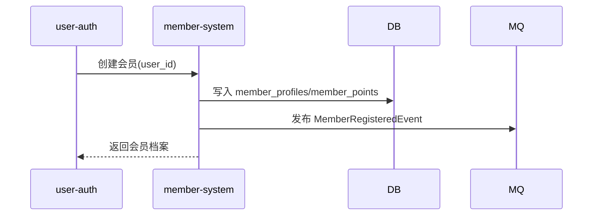
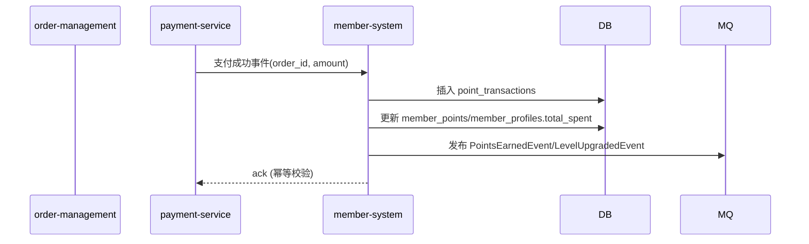
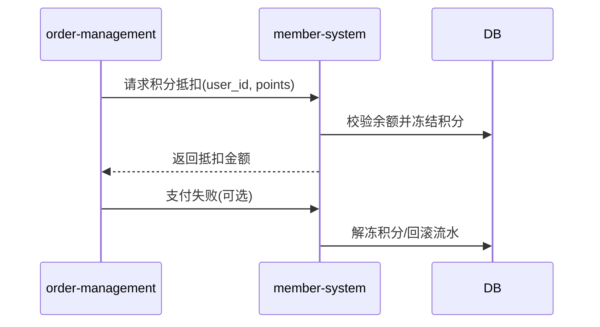
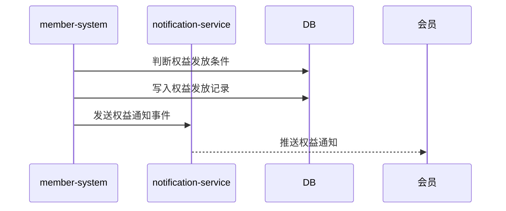

<!--
文档说明：
- 内容：member-system 模块业务需求定义
- 作用：为设计与实现提供完整需求约束
- 版本：v1.1.0（结构化更新）
-->

# member-system 模块 - 业务需求文档

📅 **创建日期**: 2025-09-16  
👤 **需求负责人**: 电商平台业务团队  
✅ **评审状态**: 已确认 (第二期优先交付)  
🔄 **最后更新**: 2025-10-22  

---

## 1. 业务背景

### 1.1 业务目标
- 构建完整的会员等级、积分与权益体系，提升用户生命周期价值 (LTV)。
- 通过差异化权益与精细化运营手段，提升复购率与客单价。
- 打造统一的会员数据资产，为营销、推荐等模块提供稳定能力。

### 1.2 业务场景
1. **会员注册入会**：用户注册后自动成为普通会员，初始化档案与账户。
2. **等级自动晋升/降级**：基于消费金额与积分累积，自动调整会员等级。
3. **积分生命周期管理**：积分获取、使用、冻结、过期的全流程管理。
4. **等级权益发放**：为不同等级会员提供折扣、免邮等专属权益。
5. **积分兑付**：通过积分抵扣订单、兑换商品或权益，实现积分价值闭环。
6. **运营分析与干预**：通过数据看板识别高价值/流失风险会员，触发运营活动。

### 1.3 成功指标
- **S1** 会员覆盖率 ≥ 85%（注册用户成为会员的比例）。
- **S2** 会员复购率 ≥ 65%（会员用户90天内二次消费比例）。
- **S3** 会员贡献度 ≥ 75%（会员产生的GMV占比）。
- **S4** 积分使用率 ≥ 55%（已发放积分的使用占比）。
- **S5** 会员相关接口 P99 响应时间 < 300ms。

---

## 2. 利益相关者

| 角色 | 关切点 | 职责 |
|------|--------|------|
| 产品经理 | 功能闭环、可运营性 | 定义功能边界、确认业务规则 |
| 运营团队 | 活动配置、数据分析 | 配置等级权益、执行运营活动 |
| 技术负责人 | 技术可行性、扩展性 | 评估技术方案、规划迭代节奏 |
| 数据分析师 | 数据准确性、可分析性 | 监控指标、沉淀分析模型 |
| 客服团队 | 会员问题处理 | 处理会员权益争议、权限问题 |

---

## 3. 功能需求

### 3.1 需求列表（REQ-MEMBER-***）

| 需求编号 | 标题 | 优先级 | 业务价值 | 验收标准 |
|-----------|------|--------|----------|-----------|
| REQ-MEMBER-001 | 会员档案初始化 | P0 | 支撑所有下游能力 | 新注册用户自动创建会员档案，并生成唯一会员编号 |
| REQ-MEMBER-002 | 等级体系管理 | P0 | 用户分层运营核心 | 支持至少5个等级，自动晋升/降级，支持手动调整并记录原因 |
| REQ-MEMBER-003 | 积分账户管理 | P0 | 激励用户行为 | 支持积分获取、使用、冻结、解冻、过期，保证余额准确 |
| REQ-MEMBER-004 | 权益配置与发放 | P1 | 差异化服务 | 可为等级配置权益，权益发放与使用可追踪 |
| REQ-MEMBER-005 | 积分抵扣订单 | P0 | 增强转化率 | 下单时可选择积分抵扣，抵扣比例可配置，抵扣成功需记录流水 |
| REQ-MEMBER-006 | 积分兑换商城 | P2 | 提升积分活跃度 | 支持积分兑换商品/优惠券，库存与兑换次数可配置 |
| REQ-MEMBER-007 | 会员运营任务 | P1 | 精细化运营 | 支持签到、分享等运营任务配置与积分奖励 |
| REQ-MEMBER-008 | 运营看板与报表 | P1 | 数据驱动运营 | 输出会员等级、活跃、积分发放/使用、权益使用等指标 |
| REQ-MEMBER-009 | 会员事件通知 | P1 | 提升体验 | 等级晋升、积分变动需触发通知事件供 notification-service 消费 |
| REQ-MEMBER-010 | 外部模块接口 | P0 | 模块协同 | order-management、marketing-campaigns 等模块可查询会员等级/积分 |

### 3.2 需求详述

#### REQ-MEMBER-001 会员档案初始化
- **用户故事**：作为新注册用户，我希望自动成为会员，便于享受权益。
- **规则**：
  - 注册流程完成后由 member-system 创建 `member_profiles` 与 `member_points` 记录。
  - `member_code` 格式为 `MYYYYMMDDNNNNN`。
  - 默认等级为普通会员（level_id=1），积分为0。
- **验收**：注册用户在1秒内可查询到会员档案。

#### REQ-MEMBER-002 等级体系管理
- **规则**：
  - 等级至少包含：普通、银牌、金牌、钻石、黑金5档。
  - 自动晋升：累计消费或积分满足条件立即升级；降级遵循6个月保护期。
  - 支持后台运营手动调整等级，并记录操作人、原因。
- **验收**：消费/积分达到阈值后5分钟内完成等级更新；等级变更写入历史表。

#### REQ-MEMBER-003 积分账户管理
- **规则**：
  - 获取行为包括：订单完成、评价、签到、运营任务、补偿等。
  - 使用行为包括：订单抵扣、兑换、人工扣减等。
  - 积分过期：按 FIFO 方式处理，过期提前7天通知。
  - 幂等性：同一来源事件不可重复记账。
- **验收**：积分余额与流水一致，误差为0；异常回滚不丢数据。

#### REQ-MEMBER-004 权益配置与发放
- **规则**：
  - 支持折扣、免邮、积分倍率、生日礼包、专属客服等权益类型。
  - 权益配置以 JSON 形式存储，可灵活扩展。
  - 权益生效需校验等级、有效期、使用限制。
- **验收**：权益发放/使用成功率 ≥ 99%，可通过 API 查询权益状态。

#### REQ-MEMBER-005 积分抵扣订单
- **规则**：
  - 积分与金额比例默认 100:1，可配置区间（50:1~200:1）。
  - 单次订单抵扣上限不超过订单金额的30%。
  - 订单支付失败需回滚积分。
- **验收**：抵扣操作全链路幂等，产生的流水与订单保持一致。

#### REQ-MEMBER-006 积分兑换商城（次要迭代）
- **规则**：
  - 支持积分兑换虚拟/实物商品、优惠券等。
  - 每种商品可配置库存、每人每日/每月兑换上限。
  - 兑换成功需写入流水并触发通知。
- **验收**：兑换失败需回滚积分并记录原因。

#### REQ-MEMBER-007 会员运营任务
- **规则**：
  - 支持运营配置签到、分享、邀请等任务。
  - 任务奖励以积分或权益形式发放，需具备幂等性。
  - 任务执行日志需可追溯。
- **验收**：任务配置变更后15分钟内生效。

#### REQ-MEMBER-008 运营看板与报表
- **规则**：
  - 统计指标：会员人数、等级分布、积分发放/使用量、权益使用率、活跃趋势。
  - 支持按日/周/月维度导出。
- **验收**：数据延迟不超过 T+1，统计误差 <0.5%。

#### REQ-MEMBER-009 会员事件通知
- **规则**：
  - 等级晋升、降级、积分获得/使用、积分将过期等事件需发布消息。
  - 事件中需包含冗余信息（member_id、level、points、原因等）。
- **验收**：消息投递成功率 ≥ 99.9%，失败需重试补偿。

#### REQ-MEMBER-010 外部模块接口
- **规则**：
  - order-management：查询会员折扣、积分余额、抵扣、等级变更回调。
  - marketing-campaigns：获取会员等级与历史行为，用于活动筛选。
  - payment-service：订单支付成功后触发积分发放事件。
- **验收**：接口 QPS 需求 500，认证鉴权符合 `api-standards.md`。

---

## 4. 非功能需求

### 4.1 性能指标
- **NFR-001** 读操作 P95 响应时间 < 200ms，P99 < 300ms。
- **NFR-002** 写操作 P95 响应时间 < 400ms，P99 < 800ms。
- **NFR-003** 峰值并发 1000 QPS 时系统无明显性能下降。
- **NFR-004** 定时任务（积分过期、等级批处理）在10分钟内完成日常批量。

### 4.2 可用性
- **NFR-005** 年度可用性 ≥ 99.5%。
- **NFR-006** 核心数据（积分、等级）故障恢复时间 RTO ≤ 15 分钟，恢复点 RPO = 0。

### 4.3 安全性
- **NFR-007** 所有接口需基于 JWT + RBAC 控制，操作需审计。
- **NFR-008** 积分、等级调整需双重校验并记录操作日志。
- **NFR-009** 敏感字段（手机号、地址）在日志与报表中脱敏展示。

### 4.4 扩展性
- **NFR-010** 等级/权益规则需配置化管理，不依赖代码部署。
- **NFR-011** 支持水平扩展，通过 Redis/MQ 实现无状态扩展能力。

---

## 5. 业务约束

### 5.1 合规要求
- 遵循《个人信息保护法》，会员数据需最小化存储并支持账户注销。
- 营销短信/推送需遵循《广告法》，需记录用户同意状态。

### 5.2 时间约束
- **M1**：2025-11 完成等级体系、积分核心上线（REQ-MEMBER-001~005、009、010）。
- **M2**：2026-Q1 完成积分商城与运营任务（REQ-MEMBER-006~008）。

### 5.3 资源约束
- 依赖 user-auth、order-management、payment-service、notification-service 按计划提供对接能力。
- 数据分析能力需与 data-analytics-platform 模块协同实现。

---

## 6. 用户角色与权限

| 角色 | 描述 | 权限范围 |
|------|------|----------|
| `member` | 普通会员用户 | 查询自身档案、积分、权益，发起积分使用 |
| `vip_member` | 高等级会员 | 同 member，享受额外权益（无需额外权限控制，靠业务逻辑） |
| `operator` | 会员运营人员 | 配置等级、权益、运营任务，查看报表 |
| `admin` | 技术/平台管理员 | 全量读写权限，进行数据修复与审计 |
| `system` | 内部系统调用方 | order-management、payment-service、marketing-campaigns 等 |

### 6.1 权限矩阵

| 功能/接口 | member | operator | admin | system |
|------------|--------|----------|-------|--------|
| 查询个人档案 | ✅ | 🔒 | ✅ | 🔒 |
| 积分获取/使用 | ✅ | 🔒 | ✅ | ✅ (受限) |
| 等级配置 | ❌ | ✅ | ✅ | ❌ |
| 权益配置 | ❌ | ✅ | ✅ | ❌ |
| 报表导出 | ❌ | ✅ | ✅ | ❌ |
| 数据修复 | ❌ | 🔒 | ✅ | ❌ |
| 事件接口 | 🔒 | 🔒 | 🔒 | ✅ |

说明：🔒 表示不具备权限，仅业务逻辑触发；operator 的敏感操作需记录审计日志。

---

## 7. 业务流程

### 7.1 会员注册与初始化

```mermaid
sequenceDiagram
    participant UA as user-auth
    participant MS as member-system
    participant DB as DB
    participant MQ as MQ
    UA->>MS: 创建会员(user_id)
    MS->>DB: 写入 member_profiles/member_points
    MS->>MQ: 发布 MemberRegisteredEvent
    MS-->>UA: 返回会员档案
```

### 7.2 订单支付触发积分

```mermaid
sequenceDiagram
    participant OM as order-management
    participant PAY as payment-service
    participant MS as member-system
    participant DB as DB
    participant MQ as MQ
    PAY->>MS: 支付成功事件(order_id, amount)
    MS->>DB: 插入 point_transactions
    MS->>DB: 更新 member_points/member_profiles.total_spent
    MS->>MQ: 发布 PointsEarnedEvent/LevelUpgradedEvent
    MS-->>PAY: ack (幂等校验)
```

### 7.3 积分抵扣流程

```mermaid
sequenceDiagram
    participant OM as order-management
    participant MS as member-system
    participant DB as DB
    OM->>MS: 请求积分抵扣(user_id, points)
    MS->>DB: 校验余额并冻结积分
    MS-->>OM: 返回抵扣金额
    OM->>MS: 支付失败(可选)
    MS->>DB: 解冻积分/回滚流水
```

### 7.4 权益发放流程

```mermaid
sequenceDiagram
    participant MS as member-system
    participant NS as notification-service
    participant DB as DB
    MS->>DB: 判断权益发放条件
    MS->>DB: 写入权益发放记录
    MS->>NS: 发送权益通知事件
    NS-->>会员: 推送权益通知
```

---

## 8. 数据需求

| 实体 | 描述 | 核心字段 | 约束 |
|------|------|----------|------|
| `member_levels` | 等级定义 | `level_name`, `min_points`, `discount_rate`, `benefits` | `level_name` 唯一；`discount_rate` 范围 (0,1] |
| `member_profiles` | 会员档案 | `member_code`, `user_id`, `level_id`, `total_spent`, `status` | `member_code` 唯一；`user_id` 唯一；`status` 枚举 |
| `member_points` | 积分账户 | `user_id`, `current_points`, `total_earned`, `total_used` | `current_points` ≥ 0；`total_earned` ≥ `total_used` |
| `point_transactions` | 积分流水 | `user_id`, `transaction_type`, `points_change`, `reference_id` | 与 `member_points` 保持一致；幂等键 (user_id+reference_id+type) |
| `level_change_history` | 等级变更历史 | `user_id`, `old_level`, `new_level`, `change_reason` | 记录完整；支持运营查询 |
| `member_benefits` | 权益配置 | `level_id`, `benefit_type`, `payload`, `quota` | `level_id`+`benefit_type` 唯一 |
| `benefit_usages` | 权益使用记录 | `member_id`, `benefit_id`, `usage_time`, `context` | 用于风控审计 |

---

## 9. 风险与依赖

### 9.1 风险
- **R1** 等级/积分规则复杂，逻辑缺陷导致错发积分 → 通过自动化测试与审计日志降低风险。
- **R2** 高并发下积分幂等性处理不当 → 采用幂等键+数据库约束+分布式锁。
- **R3** 外部模块回调延迟 → 设置重试与补偿机制，定期对账。
- **R4** 运营配置错误 → 提供预发布校验与灰度发布能力。

### 9.2 外部依赖
- `user-auth`: 提供用户基础信息、身份验证。
- `order-management`: 提供订单金额、状态，消费成功触发积分。
- `payment-service`: 支付完成事件输入，保证数据一致性。
- `notification-service`: 消费会员事件，完成通知发送。
- `data-analytics-platform`: 获取会员指标供运营分析。

---

## 10. 验收标准

### 10.1 功能验收
- [ ] 会员注册后自动创建档案与积分账户（REQ-MEMBER-001）。
- [ ] 依据消费金额/积分自动升级等级并记录历史（REQ-MEMBER-002）。
- [ ] 支持积分获取/使用/过期全流程，数据一致（REQ-MEMBER-003）。
- [ ] 等级权益配置生效并可追踪使用（REQ-MEMBER-004）。
- [ ] 订单积分抵扣可用，抵扣上限与比例可配置（REQ-MEMBER-005）。
- [ ] 与 order-management、notification-service、payment-service 完成对接（REQ-MEMBER-009/010）。

### 10.2 性能验收
- [ ] 峰值 1000 QPS 下接口响应时间符合 NFR-001/002。
- [ ] 批处理任务在 SLA 内完成（NFR-004）。

### 10.3 安全验收
- [ ] 敏感操作全量审计，权限控制符合 NFR-007/008。
- [ ] 日志脱敏与数据加密符合合规要求。

---

## 11. 变更记录

| 日期 | 版本 | 变更内容 | 变更人 |
|------|------|----------|--------|
| 2025-09-16 | v1.0.0 | 初始需求草案 | 业务团队 |
| 2025-10-22 | v1.1.0 | 按标准补全需求结构、编号与非功能指标 | GitHub Copilot |

---

📄 **规范遵循**：`docs/standards/document-management-standards.md` A7 要求  
📑 **相关文档**：`design.md`、`api-spec.md`、`database-design.md`
