<!--
文档说明：
- 内容：模块技术设计文档模板
- 作用：记录技术设计决策、架构选择、实现方案
- 使用方法：基于需求文档进行技术设计，记录设计理由
-->

# 订单管理模块 - 技术设计文档

📅 **创建日期**: 2025-09-16  
👤 **设计者**: 架构团队  
✅ **评审状态**: ✅ 已确认  
🔄 **最后更新**: 2025-10-14  
📦 **业务域**: 交易域 (Transaction Domain)  
📋 **需求文档**: [requirements.md](./requirements.md)  
🔗 **模块概述**: [overview.md](./overview.md)  

---

## 依赖标准

- [L1: application-architecture.md](../../architecture/application-architecture.md) — 指导模块化单体架构与层级划分。
- [L1: business-architecture.md](../../architecture/business-architecture.md) — 明确交易域定位与上下游依赖。
- **L3:** [document-management-standards.md](../../standards/document-management-standards.md) — 定义 A8 设计文档的章节结构与质量门槛。
- **L3:** [api-standards.md](../../standards/api-standards.md) — 约束 RESTful 设计、错误码与鉴权策略。
- **L3:** [database-standards.md](../../standards/database-standards.md) — 规范表结构、主键类型、外键与审计字段。
- **L3:** [naming-conventions-standards.md](../../standards/naming-conventions-standards.md) — 统一模块、表、接口与代码命名。

> 引用标准映射：L1/application-architecture.md、L1/business-architecture.md、L3/document-management-standards.md、L3/api-standards.md、L3/database-standards.md、L3/naming-conventions-standards.md。

## 具体标准

| 标准 | 执行方式 | 对应章节 |
|------|----------|----------|
| Document Management (A8) | 文档按 8 大章节组织，并提供决策与图示 | 第1章~第8章 |
| API Standards | API 设计遵循统一响应体与错误码 OM_* | 第3章、附录A |
| Database Standards | 数据模型符合字段类型、索引、约束要求 | 第4章、附录B |
| Naming Conventions | Python、SQL、API 路径命名统一 | 第2章、附录C |
| Security Standards | 鉴权、权限控制、审计要求落实 | 第5章 |

---

## 第1章：引言

### 1.1 设计目标

本设计文档基于 [requirements.md](./requirements.md) 中定义的业务需求（REQ-OM-001 ~ REQ-OM-010），提供订单管理模块的完整技术设计方案，主要目标包括：

1. **订单全生命周期管理**: 实现从订单创建到订单完成的完整流程管理
2. **商品快照机制**: 通过商品快照保证历史订单数据的稳定性和可追溯性
3. **订单状态机管理**: 严格控制订单状态流转，防止非法状态变更
4. **高性能和高可用**: 满足订单查询P95 < 500ms，创建P95 < 1s的性能要求
5. **模块解耦设计**: 通过接口和依赖注入实现与其他模块的松耦合

### 1.2 业务域定位

**业务域**: 交易域 (Transaction Domain)  
**业务架构引用**: [L1: business-architecture.md - 交易域](../../architecture/business-architecture.md#3-交易域-transaction-domain)

订单管理模块位于电商平台交易域的核心位置，负责订单全生命周期管理。作为交易闭环的关键环节，连接用户购买意愿和商品交付。

### 1.3 模块边界

**详细边界定义**: 参见 [ORDER_MANAGEMENT_BOUNDARY_ANALYSIS.yaml](../../../ORDER_MANAGEMENT_BOUNDARY_ANALYSIS.yaml)

**包含功能**:
- ✅ 订单创建和商品快照（REQ-OM-001, REQ-OM-006）
- ✅ 订单状态机管理（REQ-OM-002）
- ✅ 订单查询和搜索（REQ-OM-003, REQ-OM-007, REQ-OM-008）
- ✅ 订单修改和取消（REQ-OM-004, REQ-OM-005）
- ✅ 状态历史审计（REQ-OM-009）
- ✅ 权限控制（REQ-OM-010）

**排除功能**:
- ❌ 支付处理 → payment_service 模块
- ❌ 库存扣减 → inventory_management 模块
- ❌ 物流配送 → logistics_management 模块
- ❌ 订单评价 → 独立评价模块
- ❌ 优惠券使用 → marketing_campaigns 模块
- ❌ 积分计算 → member_system 模块

### 1.4 功能范围

**核心需求引用**:
- REQ-OM-001: 订单创建
- REQ-OM-002: 订单状态管理
- REQ-OM-003: 订单查询
- REQ-OM-004: 订单修改
- REQ-OM-005: 订单取消
- REQ-OM-006: 商品快照
- REQ-OM-007: 订单列表分页
- REQ-OM-008: 订单搜索
- REQ-OM-009: 状态历史记录
- REQ-OM-010: 权限控制

### 1.5 依赖关系

**依赖架构引用**: [overview.md - 模块边界 - 依赖模块](./overview.md#模块边界)

**依赖的模块**:
- **user_auth**: 用户身份认证和权限验证（JWT Token、用户ID获取）
- **product_catalog**: 查询商品信息创建快照（商品名称、价格、属性、图片）
- **shopping_cart**: 读取购物车商品列表生成订单，清空购物车
- **inventory_management**: 订单创建时预占库存，订单取消时释放库存
- **payment_service**: 订单创建后触发支付，支付成功后更新订单状态

**被依赖的模块**:
- **payment_service**: 支付时查询订单信息，支付成功后更新订单状态
- **logistics_management**: 发货时查询订单收货信息，发货后更新订单状态
- **member_system**: 订单完成后计算会员积分，查询订单金额
- **data_analytics_platform**: 统计分析订单数据，生成业务报表

### 1.6 架构约束

**架构标准引用**: [L1: application-architecture.md](../../architecture/application-architecture.md)

1. **模块化单体架构**: 遵循 Router → Service → Repository → Model 四层架构，保持单向依赖
2. **命名规范**: 严格遵循 [naming-conventions-standards.md](../../standards/naming-conventions-standards.md)
   - 模块名: `order_management` (Python)
   - API路径: `/order-management` (kebab-case)
   - 表前缀: `order_` (snake_case)
3. **数据库设计**: 严格遵循 [database-standards.md](../../standards/database-standards.md)
   - 主键类型: INTEGER AUTO_INCREMENT
   - 外键约束: 必须定义外键约束
   - 软删除: 不使用（订单状态用"cancelled"表示）
4. **API设计**: 严格遵循 [api-standards.md](../../standards/api-standards.md)
   - RESTful原则
   - JWT认证
   - 统一响应格式
5. **Pydantic版本**: 必须使用Pydantic 2.5.0语法

### 1.7 设计原则

**SOLID原则应用**:

1. **单一职责原则 (SRP)**
   - Order模型只负责订单数据管理
   - OrderService只负责订单业务逻辑
   - OrderRouter只负责API路由定义

2. **开放封闭原则 (OCP)**
   - 订单状态机支持扩展新状态（如预售、拼团）
   - 订单类型可扩展（普通订单、拼团订单、预售订单）

3. **依赖倒置原则 (DIP)**
   - Service层依赖抽象接口而非具体实现
   - 跨模块依赖通过API接口而非直接数据库访问

4. **接口隔离原则 (ISP)**
   - 订单查询接口和订单修改接口分离
   - 用户端API和管理端API分离

5. **里氏替换原则 (LSP)**
   - 所有订单类型都遵循统一的Order接口规范

### 1.8 关键设计决策

| 决策ID | 决策点 | 选择方案 | 理由 | 替代方案 | 影响 |
|--------|--------|----------|------|----------|------|
| **DD-OM-001** | 商品快照存储 | OrderItem 保留到 product/sku 的外键，同时持久化快照字段 | 兼顾数据库完整性与业务回溯，遵循数据库标准 | 移除外键，仅保留快照（难以校验数据约束） | 提高一致性并简化跨模块排错 |
| **DD-OM-002** | 订单状态管理 | 使用OrderStatus枚举+OrderStatusHistory审计表 | 状态流转可追溯，支持回溯分析和纠纷处理 | 单一状态字段（无法追溯历史） | 增加审计能力，提高数据可信度 |
| **DD-OM-003** | 订单号生成 | `OM` + 时间戳(YYYYMMDDHHmmss) + 4位随机数 | 保证唯一性，便于排序和查询 | UUID（不便于人工识别） | 提高订单号可读性 |
| **DD-OM-004** | 与支付模块协作 | 支付成功后通过回调接口更新订单状态 | 支付和订单职责分离，松耦合 | 订单模块直接处理支付（边界不清） | 提高模块独立性 |
| **DD-OM-005** | 库存预占策略 | 订单创建时调用inventory_management预占库存 | 防止超卖，保证库存一致性 | 支付后再扣库存（可能库存不足） | 提高交易可靠性 |
| **DD-OM-006** | 订单修改限制 | 仅待支付状态可修改地址和取消订单 | 防止订单混乱，符合业务流程 | 所有状态均可修改（业务风险高） | 降低业务风险 |
| **DD-OM-007** | 主键设计 | 使用INTEGER主键，不使用BIGINT | 兼容SQLite/PostgreSQL/MySQL，满足1000万订单需求 | BIGINT（过度设计） | 提高兼容性 |
| **DD-OM-008** | 缓存策略 | Redis 缓存（订单详情5分钟、列表2分钟）—计划中 | 作为性能优化方向，待容量评估后实施 | 暂不引入缓存 | 当前版本列为技术债务 |

---

## 第2章：设计概览

### 2.1 整体架构图

```mermaid
graph TB
    subgraph "客户端层"
        A[Web前端]
        B[移动端App]
        C[管理后台]
    end

    subgraph "网关层"
        D[API Gateway]
    end

    subgraph "订单管理模块"
        E[OrderRouter<br/>表现层]
        F[OrderService<br/>应用层]
        R[OrderRepository<br/>数据访问层]
        G[Order / OrderItem / OrderStatusHistory<br/>领域模型]
    end

    subgraph "依赖模块"
        H[user_auth<br/>用户认证]
        I[product_catalog<br/>商品目录]
        J[shopping_cart<br/>购物车]
        K[inventory_management<br/>库存管理]
        L[payment_service<br/>支付服务]
    end

    subgraph "基础设施层"
        M[(MySQL 8.0<br/>主数据库)]
        N[(Redis<br/>缓存)]
        O[消息队列<br/>RabbitMQ]
    end

    A --> D
    B --> D
    C --> D
    D --> E
    E --> F
    F --> R
    R --> G
    G --> M
    R --> M
    F --> N
    F --> O

    E --> H
    F --> I
    F --> J
    F --> K
    F --> L

    style E fill:#e1f5ff
    style F fill:#fff4e1
    style R fill:#f5e1ff
    style G fill:#f0f0f0
```mermaid
graph LR
    A[app/modules/order_management/] --> B[router.py<br/>表现层]
    A --> C[service.py<br/>应用层]
    A --> D[repository.py<br/>数据访问层]
    A --> E[models.py<br/>领域模型]
    A --> F[schemas.py<br/>Pydantic模型]
    A --> G[dependencies.py<br/>依赖注入]
    A --> H[category_service.py<br/>共享逻辑]
    A --> I[README.md<br/>模块说明]

    B --> G
    C --> D
    D --> E

    style A fill:#e1f5ff
    style B fill:#fff4e1
    style C fill:#fff4e1
    style D fill:#f5e1ff
    style E fill:#f0f0f0
```
    style B fill:#fff4e1
    style C fill:#fff4e1
    style D fill:#f0f0f0
```

### 2.3 组件职责
    A --> C[service.py<br/>应用层]
    A --> D[repository.py<br/>数据访问层]
    A --> E[models.py<br/>领域模型]
    A --> F[schemas.py<br/>Pydantic模型]
    A --> G[dependencies.py<br/>依赖注入]
    A --> H[category_service.py<br/>辅助服务]
- JWT Token认证和权限验证
- HTTP响应格式化

**实现文件**: `app/modules/order_management/router.py`

**主要端点** (完整路径格式):
- `POST /api/v1/order-management/orders` - 创建订单
- `GET /api/v1/order-management/orders/{order_id}` - 获取订单详情
- `GET /api/v1/order-management/orders` - 订单列表查询
- `PUT /api/v1/order-management/orders/{order_id}` - 修改订单
- `POST /api/v1/order-management/orders/{order_id}/cancel` - 取消订单
- `GET /api/v1/order-management/orders/{order_id}/history` - 订单状态历史
- `POST /api/v1/order-management/orders/search` - 订单搜索

> **路径说明**: 
> - 完整API路径格式: `/api/v1/{模块名}/{资源名}`
> - 在代码实现中，router.py 定义的路径为 `/order-management/orders`
> - 全局版本前缀 `/api/v1` 由 main.py 在路由注册时统一添加
> - 这种设计遵循FastAPI的最佳实践，便于版本管理和路由组织

**依赖注入**:
```python
from app.core.dependencies import get_current_user, get_db
from app.modules.order_management.service import OrderService
```

#### 2.3.2 Repository层 (OrderRepository)

**职责**:
- 数据库操作封装（CRUD操作）
- 复杂查询构建和优化
- 数据访问抽象，隔离ORM具体实现
- **不负责事务管理**（保持方法无状态）

**实现文件**: `app/modules/order_management/repository.py`

**核心方法**:
```python
class OrderRepository:
    def create(self, order: Order) -> Order
        """创建订单（不提交事务）"""
        
    def get_by_id(self, order_id: int) -> Optional[Order]
        """根据ID查询订单"""
        
    def get_by_order_number(self, order_number: str) -> Optional[Order]
        """根据订单号查询"""
        
    def list_by_user(self, user_id: int, status: Optional[str], skip: int, limit: int) -> tuple[List[Order], int]
        """查询用户订单列表（带分页）"""
        
    def update(self, order: Order, data: dict) -> Order
        """更新订单（不提交事务）"""
        
    def get_user_by_id(self, user_id: int) -> Optional[User]
        """查询用户信息（跨模块数据访问）"""
        
    def get_product_by_id(self, product_id: int) -> Optional[Product]
        """查询商品信息（跨模块数据访问）"""
```

**设计原则**:
- ✅ **无状态设计**: Repository方法不持有状态，可在不同事务上下文中复用
- ✅ **不控制事务**: 只执行 `db.add()`, `db.flush()`, `db.refresh()`，不执行 `db.commit()`
- ✅ **数据访问抽象**: 为Service层提供清晰的数据访问接口，隔离ORM细节
- ✅ **易于测试**: Repository可以轻松Mock，便于Service层单元测试

**为什么Repository不负责事务？**
- 业务原子性由Service层决定（如：创建订单+扣库存必须在同一事务）
- Repository方法需要在不同事务上下文中复用
- 测试隔离性要求Service可控制事务提交时机

> **参考**: 详见 [docs/architecture/overview.md - Repository模式推广计划](../../architecture/overview.md)

#### 2.3.3 Service层 (OrderService)

**职责**:
- 订单业务逻辑实现
- 订单状态机管理
- 商品快照创建和存储
- 跨模块协作（调用其他模块服务）
- **事务边界管理（负责 commit/rollback）** ⚠️
- 缓存策略（Redis缓存）
- 异常处理和业务规则验证

**实现文件**: `app/modules/order_management/service.py`

**核心业务方法**:
```python
class OrderService:
    async def create_order(self, user_id: int, data: OrderCreateRequest) -> Order
    async def get_order_detail(self, order_id: int, user_id: int) -> OrderDetailResponse
    async def list_orders(self, user_id: int, filters: OrderListFilters) -> List[Order]
    async def update_order(self, order_id: int, user_id: int, data: OrderUpdateRequest) -> Order
    async def cancel_order(self, order_id: int, user_id: int, reason: str) -> Order
    async def update_order_status(self, order_id: int, new_status: OrderStatus, operator_id: int) -> Order
    async def get_order_history(self, order_id: int) -> List[OrderStatusHistory]
```

**事务管理策略** (Service层负责):

Service层是事务边界的唯一管理者，负责：
- ✅ **事务提交**: 所有业务操作成功后执行 `db.commit()`
- ✅ **事务回滚**: 捕获异常时执行 `db.rollback()`
- ✅ **事务编排**: 协调多个Repository调用形成完整的业务原子操作

**典型事务场景**:

1. **订单创建事务** (跨表、跨模块)：
   ```python
   try:
       # 1. 创建订单主表 (Repository.create)
       # 2. 创建订单明细 (Repository.create)  
       # 3. 扣减库存 (调用InventoryService)
       # 4. 记录状态历史 (Repository.create)
       db.commit()  # Service层统一提交
   except Exception:
       db.rollback()  # Service层统一回滚
       raise
   ```

2. **订单取消事务** (状态更新+库存释放)：
   ```python
   try:
       # 1. 更新订单状态 (Repository.update)
       # 2. 释放库存 (调用InventoryService)
       # 3. 记录状态变更 (Repository.create)
       db.commit()  # Service层统一提交
   except Exception:
       db.rollback()  # Service层统一回滚
       raise
   ```

**为什么Service层管理事务？**
- 🎯 **业务原子性**: 业务逻辑决定哪些操作必须在同一事务中
- 🎯 **跨模块协调**: 订单+库存+购物车等跨模块操作需要统一事务边界
- 🎯 **异常处理**: 业务异常和技术异常的统一处理和回滚策略
- 🎯 **测试可控**: 测试可以控制事务的提交时机，验证完整业务流程

**缓存策略** *(待实施)*:
- 规划中的缓存键: `order:detail:{order_id}`、`order:list:user:{user_id}:page:{page}`
- TTL 建议: 详情 5 分钟、列表 2 分钟
- 失效策略: 订单状态变更或取消时清除相关键
- 当前状态: 代码尚未接入 Redis，记录为性能优化技术债务

#### 2.3.4 Model层 (Order/OrderItem/OrderStatusHistory)

**职责**:
- SQLAlchemy ORM映射
- 数据库表结构定义
- 数据验证和约束
- 关联关系定义

**实现文件**: `app/modules/order_management/models.py`

**核心模型**:

1. **Order（订单主表）**
    - 主键: `id` (INTEGER, AUTO_INCREMENT)
    - 订单编号: `order_number` (VARCHAR(32), UNIQUE)
    - 用户 ID: `user_id` (INTEGER, 外键 -> users.id)
    - 订单状态: `status` (VARCHAR(20)，遵循 OrderStatus 枚举)
    - 金额字段: `subtotal`, `shipping_fee`, `discount_amount`, `total_amount` (DECIMAL(10,2))
    - 收货信息: `shipping_address` (TEXT), `receiver_name`, `receiver_phone`, `shipping_method`
    - 备注: `notes` (TEXT)
    - 时间戳: `created_at`, `updated_at`

2. **OrderItem（订单商品表 - 商品快照）**
    - 主键: `id` (INTEGER)
    - 关联字段: `order_id` (外键 -> orders.id)、`product_id`、`sku_id`
    - 商品快照: `sku_code`, `product_name`, `sku_name`
    - 属性/图片快照: `product_attributes` (JSON), `product_image_url`
    - 数量金额: `quantity`, `unit_price`, `total_price`
    - 时间戳: `created_at`

3. **OrderStatusHistory（订单状态历史表）**
    - 主键: `id` (INTEGER)
    - 订单ID: `order_id` (外键 -> orders.id)
    - 状态轨迹: `old_status`, `new_status`
    - 操作审计: `operator_id`, `remark`
    - 时间戳: `created_at`

#### 2.3.5 Schema层 (Pydantic模型)

**职责**:
- 请求参数验证（使用Pydantic 2.5.0）
- 响应数据序列化
- 数据类型定义

**实现文件**: `app/modules/order_management/schemas.py`

**核心Schema**:
- `OrderCreateRequest`: 创建订单请求
- `OrderUpdateRequest`: 修改订单请求
- `OrderDetailResponse`: 订单详情响应（包含订单项、状态历史）
- `OrderResponse`: 列表与详情通用的订单响应
- `OrderItemResponse`: 订单商品响应
- `OrderStatusHistoryResponse`: 状态历史响应

### 2.4 与core组件的依赖关系

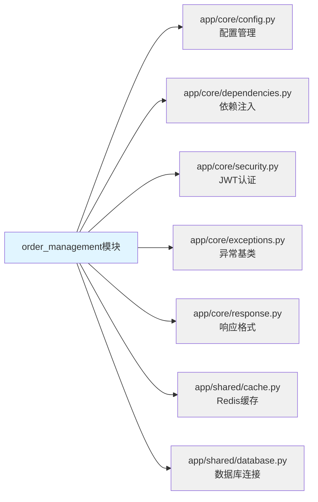

**依赖说明**:
1. **config.py**: 读取环境变量（数据库连接、Redis配置、JWT密钥）
2. **dependencies.py**: 使用`get_current_user`获取当前用户、`get_db`获取数据库会话
3. **security.py**: 使用JWT Token验证用户身份
4. **exceptions.py**: 继承`AppException`定义订单异常（OrderNotFoundException, OrderStatusException）
5. **response.py**: 使用`success_response`和`error_response`格式化响应
6. **cache.py**: 使用Redis缓存服务
7. **database.py**: 使用`Base`定义ORM模型，使用`get_db`获取会话

### 2.5 技术栈

| 分层 | 技术栈 | 版本 | 用途 |
|------|--------|------|------|
| **Web框架** | FastAPI | 0.104.1 | API路由和请求处理 |
| **ORM** | SQLAlchemy | 2.0.23 | 数据库ORM映射 |
| **数据验证** | Pydantic | 2.5.0 | 请求参数验证和响应序列化 |
| **数据库** | MySQL | 8.0 | 主数据库 |
| **缓存** | Redis | 7.0 | 订单详情和列表缓存 |
| **消息队列** | RabbitMQ | 3.12 | 异步任务（发送订单邮件通知） |
| **认证** | JWT | - | 用户身份认证 |
| **数据库迁移** | Alembic | 1.12.1 | 数据库版本管理 |

### 2.6 设计模式

| 设计模式 | 应用场景 | 实现示例 |
|---------|---------|---------|
| **依赖注入** | Router层注入Service层 | `OrderRouter`依赖`OrderService` |
| **工厂模式** | 订单号生成 | `OrderNumberGenerator.generate()` |
| **状态模式** | 订单状态机管理 | `OrderStateMachine.transition()` |
| **策略模式** | 订单取消策略 | 不同状态的取消逻辑不同 |
| **观察者模式** | 订单状态变更通知 | 状态变更后发送消息队列通知 |
| **仓储模式** | 数据访问层封装 | `OrderRepository`封装CRUD操作 |
| **单例模式** | Redis连接池 | `RedisClient.get_instance()` |

---

## 第3章：数据模型设计

### 3.1 实体关系图 (ER图)

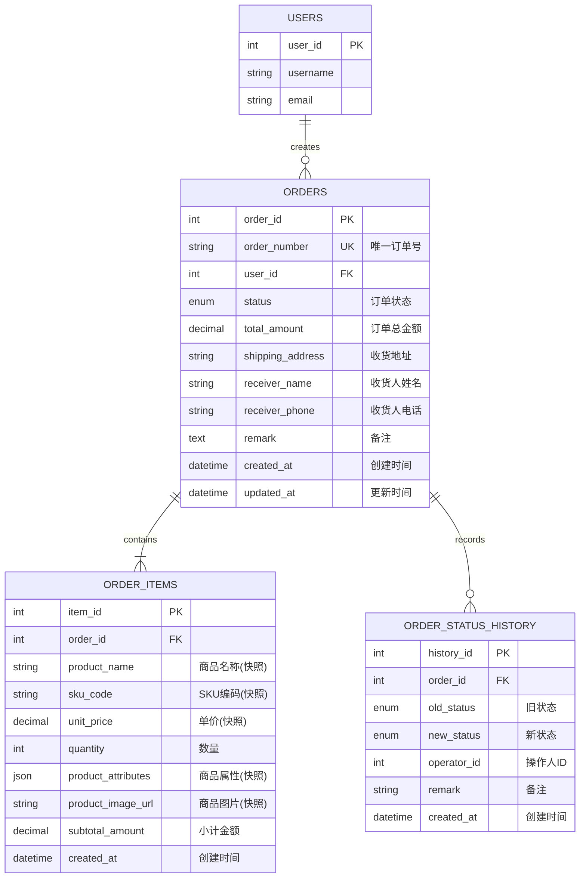

### 3.1.1 外键级联策略设计

**遵循标准**: [database-standards.md - 外键约束设计原则](../../standards/database-standards.md#外键约束设计原则)

订单模块的外键级联策略遵循"保护核心数据、维护主从一致性"原则：

| 外键字段 | 所在表 | 引用表 | ON DELETE 策略 | ON UPDATE 策略 | 设计理由 |
|---------|--------|--------|---------------|---------------|---------|
| `user_id` | orders | users | **RESTRICT** | CASCADE | 防止误删有订单的用户，保护订单历史数据 |
| `order_id` | order_items | orders | **CASCADE** | CASCADE | 订单删除时自动删除订单项，维护主从数据一致性 |
| `order_id` | order_status_history | orders | **CASCADE** | CASCADE | 订单删除时自动删除状态历史，避免孤儿数据 |
| `product_id` | order_items | products | **RESTRICT** | CASCADE | 保留外键引用但禁止删除，确保历史数据可追溯 |
| `sku_id` | order_items | product_skus | **RESTRICT** | CASCADE | 保留外键引用但禁止删除，确保历史数据可追溯 |
| `operator_id` | order_status_history | users | **SET NULL** | CASCADE | 操作人删除时保留历史记录，但清除操作人信息 |

**级联策略说明**:

1. **RESTRICT（限制删除）**
   - 用于保护核心业务数据
   - orders.user_id: 防止误删有订单的用户
   - order_items.product_id/sku_id: 保持商品快照的可追溯性
   
2. **CASCADE（级联删除）**
   - 用于维护主从表数据一致性
   - order_items.order_id: 订单删除时自动删除订单项
   - order_status_history.order_id: 订单删除时自动删除状态历史
   
3. **SET NULL（置空）**
   - 用于审计字段，允许删除但保留历史记录
   - order_status_history.operator_id: 操作人删除时保留历史，但清除关联

**设计决策** (DD-OM-009):
- 订单模块采用混合级联策略，平衡数据完整性和历史可追溯性
- 核心业务关联使用RESTRICT保护数据
- 主从关系使用CASCADE维护一致性
- 审计字段使用SET NULL保留历史

### 3.2 数据库表结构 (MySQL 8.0)

**数据库设计标准**: 严格遵循 [database-standards.md](../../standards/database-standards.md)

#### 3.2.1 订单主表 (orders)

```sql
-- ==================================
-- 订单主表 (orders)
-- 表说明: 存储订单主要信息，包含订单基本信息和收货信息
-- 引用标准: database-standards.md
-- ==================================
CREATE TABLE `orders` (
    `order_id` INT NOT NULL AUTO_INCREMENT COMMENT '订单ID（主键）',
    `order_number` VARCHAR(50) NOT NULL COMMENT '订单编号（格式：OM+时间戳+随机数）',
    `user_id` INT NOT NULL COMMENT '用户ID（外键）',
    `status` ENUM(
        'pending_payment',    -- 待支付
        'paid',               -- 已支付
        'processing',         -- 处理中
        'shipped',            -- 已发货
        'completed',          -- 已完成
        'cancelled',          -- 已取消
        'refunding',          -- 退款中
        'refunded'            -- 已退款
    ) NOT NULL DEFAULT 'pending_payment' COMMENT '订单状态',
    `total_amount` DECIMAL(10, 2) NOT NULL COMMENT '订单总金额',
    
    -- 收货信息
    `shipping_address` VARCHAR(500) NOT NULL COMMENT '收货地址',
    `receiver_name` VARCHAR(100) NOT NULL COMMENT '收货人姓名',
    `receiver_phone` VARCHAR(20) NOT NULL COMMENT '收货人电话',
    
    -- 备注信息
    `remark` TEXT NULL COMMENT '订单备注',
    
    -- 时间戳
    `created_at` DATETIME NOT NULL DEFAULT CURRENT_TIMESTAMP COMMENT '创建时间',
    `updated_at` DATETIME NOT NULL DEFAULT CURRENT_TIMESTAMP ON UPDATE CURRENT_TIMESTAMP COMMENT '更新时间',
    
    PRIMARY KEY (`order_id`),
    UNIQUE KEY `uk_order_number` (`order_number`),
    KEY `idx_user_id` (`user_id`),
    KEY `idx_status` (`status`),
    KEY `idx_created_at` (`created_at`),
    
    -- 外键约束
    CONSTRAINT `fk_orders_user_id` 
        FOREIGN KEY (`user_id`) 
        REFERENCES `users`(`user_id`) 
        ON DELETE RESTRICT 
        ON UPDATE CASCADE,
    
    -- 业务约束
    CONSTRAINT `chk_total_amount` CHECK (`total_amount` > 0)
    
) ENGINE=InnoDB DEFAULT CHARSET=utf8mb4 COLLATE=utf8mb4_unicode_ci COMMENT='订单主表';
```

**字段说明**:

| 字段名 | 类型 | 约束 | 说明 | 业务规则 |
|--------|------|------|------|----------|
| `order_id` | INT | PK, AUTO_INCREMENT | 订单ID | 系统自动生成 |
| `order_number` | VARCHAR(50) | UNIQUE, NOT NULL | 订单编号 | 格式：OM+YYYYMMDDHHmmss+4位随机数，例如：OM20251014123456ABCD |
| `user_id` | INT | FK, NOT NULL, INDEX | 用户ID | 关联users表，限制删除（RESTRICT） |
| `status` | ENUM | NOT NULL, INDEX | 订单状态 | 默认pending_payment，状态流转见状态机设计 |
| `total_amount` | DECIMAL(10,2) | NOT NULL, CHECK > 0 | 订单总金额 | 必须大于0，精确到分 |
| `shipping_address` | VARCHAR(500) | NOT NULL | 收货地址 | 完整地址（省市区+详细地址） |
| `receiver_name` | VARCHAR(100) | NOT NULL | 收货人姓名 | 真实姓名 |
| `receiver_phone` | VARCHAR(20) | NOT NULL | 收货人电话 | 手机号或固话 |
| `remark` | TEXT | NULL | 订单备注 | 用户备注信息 |
| `created_at` | DATETIME | NOT NULL, INDEX | 创建时间 | 订单创建时间，用于排序 |
| `updated_at` | DATETIME | NOT NULL | 更新时间 | 任何字段更新时自动更新 |

#### 3.2.2 订单商品表 (order_items) - 商品快照

```sql
-- ==================================
-- 订单商品表 (order_items)
-- 表说明: 存储订单商品信息（商品快照，不依赖product_catalog表）
-- 设计决策: DD-OM-001 - 商品快照机制
-- ==================================
CREATE TABLE `order_items` (
    `item_id` INT NOT NULL AUTO_INCREMENT COMMENT '订单商品ID（主键）',
    `order_id` INT NOT NULL COMMENT '订单ID（外键）',
    
    -- 商品快照字段（不使用product_id外键）
    `product_name` VARCHAR(200) NOT NULL COMMENT '商品名称（快照）',
    `sku_code` VARCHAR(100) NOT NULL COMMENT 'SKU编码（快照）',
    `unit_price` DECIMAL(10, 2) NOT NULL COMMENT '单价（快照）',
    `quantity` INT NOT NULL COMMENT '购买数量',
    `product_attributes` JSON NULL COMMENT '商品属性JSON（快照，如颜色、尺寸）',
    `product_image_url` VARCHAR(500) NULL COMMENT '商品图片URL（快照）',
    `subtotal_amount` DECIMAL(10, 2) NOT NULL COMMENT '小计金额（unit_price * quantity）',
    
    -- 时间戳
    `created_at` DATETIME NOT NULL DEFAULT CURRENT_TIMESTAMP COMMENT '创建时间',
    
    PRIMARY KEY (`item_id`),
    KEY `idx_order_id` (`order_id`),
    KEY `idx_sku_code` (`sku_code`),
    
    -- 外键约束
    CONSTRAINT `fk_order_items_order_id` 
        FOREIGN KEY (`order_id`) 
        REFERENCES `orders`(`order_id`) 
        ON DELETE CASCADE 
        ON UPDATE CASCADE,
    
    -- 业务约束
    CONSTRAINT `chk_unit_price` CHECK (`unit_price` > 0),
    CONSTRAINT `chk_quantity` CHECK (`quantity` > 0),
    CONSTRAINT `chk_subtotal_amount` CHECK (`subtotal_amount` > 0)
    
) ENGINE=InnoDB DEFAULT CHARSET=utf8mb4 COLLATE=utf8mb4_unicode_ci COMMENT='订单商品表（商品快照）';
```

**字段说明**:

| 字段名 | 类型 | 约束 | 说明 | 业务规则 |
|--------|------|------|------|----------|
| `item_id` | INT | PK, AUTO_INCREMENT | 订单商品ID | 系统自动生成 |
| `order_id` | INT | FK, NOT NULL, INDEX | 订单ID | 关联orders表，级联删除（CASCADE） |
| `product_name` | VARCHAR(200) | NOT NULL | 商品名称（快照） | 下单时商品名称，不受后续商品名称变更影响 |
| `sku_code` | VARCHAR(100) | NOT NULL, INDEX | SKU编码（快照） | 商品唯一编码，用于订单统计分析 |
| `unit_price` | DECIMAL(10,2) | NOT NULL, CHECK > 0 | 单价（快照） | 下单时单价，不受后续价格变更影响 |
| `quantity` | INT | NOT NULL, CHECK > 0 | 购买数量 | 必须大于0 |
| `product_attributes` | JSON | NULL | 商品属性（快照） | 如`{"color": "红色", "size": "L"}`，使用JSON格式存储 |
| `product_image_url` | VARCHAR(500) | NULL | 商品图片（快照） | 下单时商品主图URL |
| `subtotal_amount` | DECIMAL(10,2) | NOT NULL, CHECK > 0 | 小计金额 | 计算公式：unit_price × quantity |
| `created_at` | DATETIME | NOT NULL | 创建时间 | 订单商品创建时间 |

**商品快照设计说明**:
- 不使用`product_id`外键依赖`products`表
- 所有商品信息在订单创建时完整保存
- 历史订单不受商品信息变更（价格、名称、图片等）影响
- 支持商品删除后仍可查询历史订单

#### 3.2.3 订单状态历史表 (order_status_history)

```sql
-- ==================================
-- 订单状态历史表 (order_status_history)
-- 表说明: 记录订单状态流转历史，用于审计和追溯
-- 设计决策: DD-OM-002 - 状态审计机制
-- ==================================
CREATE TABLE `order_status_history` (
    `history_id` INT NOT NULL AUTO_INCREMENT COMMENT '历史记录ID（主键）',
    `order_id` INT NOT NULL COMMENT '订单ID（外键）',
    `old_status` ENUM(
        'pending_payment',
        'paid',
        'processing',
        'shipped',
        'completed',
        'cancelled',
        'refunding',
        'refunded'
    ) NULL COMMENT '旧状态（NULL表示订单创建）',
    `new_status` ENUM(
        'pending_payment',
        'paid',
        'processing',
        'shipped',
        'completed',
        'cancelled',
        'refunding',
        'refunded'
    ) NOT NULL COMMENT '新状态',
    `operator_id` INT NOT NULL COMMENT '操作人ID（用户ID或管理员ID）',
    `remark` VARCHAR(500) NULL COMMENT '状态变更备注',
    `created_at` DATETIME NOT NULL DEFAULT CURRENT_TIMESTAMP COMMENT '状态变更时间',
    
    PRIMARY KEY (`history_id`),
    KEY `idx_order_id` (`order_id`),
    KEY `idx_new_status` (`new_status`),
    KEY `idx_created_at` (`created_at`),
    
    -- 外键约束
    CONSTRAINT `fk_order_status_history_order_id` 
        FOREIGN KEY (`order_id`) 
        REFERENCES `orders`(`order_id`) 
        ON DELETE CASCADE 
        ON UPDATE CASCADE
    
) ENGINE=InnoDB DEFAULT CHARSET=utf8mb4 COLLATE=utf8mb4_unicode_ci COMMENT='订单状态历史表';
```

**字段说明**:

| 字段名 | 类型 | 约束 | 说明 | 业务规则 |
|--------|------|------|------|----------|
| `history_id` | INT | PK, AUTO_INCREMENT | 历史记录ID | 系统自动生成 |
| `order_id` | INT | FK, NOT NULL, INDEX | 订单ID | 关联orders表，级联删除 |
| `old_status` | ENUM | NULL | 旧状态 | NULL表示订单创建（无旧状态） |
| `new_status` | ENUM | NOT NULL, INDEX | 新状态 | 订单变更后的状态 |
| `operator_id` | INT | NOT NULL | 操作人ID | 用户自己操作或管理员操作 |
| `remark` | VARCHAR(500) | NULL | 状态变更备注 | 如"用户主动取消"、"支付超时自动取消" |
| `created_at` | DATETIME | NOT NULL, INDEX | 状态变更时间 | 用于追溯和时间轴展示 |

### 3.3 索引设计

| 表名 | 索引名 | 索引字段 | 索引类型 | 用途 | 查询场景 |
|------|--------|----------|----------|------|----------|
| `orders` | `uk_order_number` | `order_number` | UNIQUE | 订单号唯一性 | 根据订单号查询订单 |
| `orders` | `idx_user_id` | `user_id` | BTREE | 用户订单查询 | 查询某用户的所有订单 |
| `orders` | `idx_status` | `status` | BTREE | 订单状态筛选 | 查询待支付/已完成订单列表 |
| `orders` | `idx_created_at` | `created_at` | BTREE | 订单时间排序 | 按时间倒序展示订单列表 |
| `order_items` | `idx_order_id` | `order_id` | BTREE | 订单商品查询 | 查询某订单的所有商品 |
| `order_items` | `idx_sku_code` | `sku_code` | BTREE | SKU销售统计 | 统计某SKU的销售数量 |
| `order_status_history` | `idx_order_id` | `order_id` | BTREE | 订单历史查询 | 查询某订单的状态变更历史 |
| `order_status_history` | `idx_new_status` | `new_status` | BTREE | 状态统计 | 统计订单状态分布 |
| `order_status_history` | `idx_created_at` | `created_at` | BTREE | 时间统计 | 统计某时间段的状态变更 |

### 3.4 数据关系

**一对多关系**:
1. **users → orders**: 一个用户可以创建多个订单
   - 外键: `orders.user_id` → `users.user_id`
   - 删除策略: RESTRICT（用户删除时不允许有未完成订单）

2. **orders → order_items**: 一个订单包含多个订单商品
   - 外键: `order_items.order_id` → `orders.order_id`
   - 删除策略: CASCADE（订单删除时级联删除订单商品）

3. **orders → order_status_history**: 一个订单有多条状态历史记录
   - 外键: `order_status_history.order_id` → `orders.order_id`
   - 删除策略: CASCADE（订单删除时级联删除状态历史）

**无外键关系**:
- **order_items ⇢ products**: OrderItem不使用外键依赖products表（商品快照机制）

### 3.5 数据约束和验证规则

| 约束类型 | 约束规则 | 验证说明 | 错误处理 |
|---------|---------|---------|----------|
| **金额约束** | `total_amount > 0` | 订单总金额必须大于0 | 抛出`InvalidOrderAmountException` |
| **单价约束** | `unit_price > 0` | 商品单价必须大于0 | 抛出`InvalidPriceException` |
| **数量约束** | `quantity > 0` | 购买数量必须大于0 | 抛出`InvalidQuantityException` |
| **小计约束** | `subtotal_amount > 0` | 小计金额必须大于0 | 抛出`InvalidAmountException` |
| **金额一致性** | `SUM(order_items.subtotal_amount) = orders.total_amount` | 订单总金额必须等于所有商品小计之和 | 在Service层验证 |
| **状态约束** | 状态流转必须符合状态机规则 | 见第4章状态机设计 | 抛出`InvalidStatusTransitionException` |
| **唯一性约束** | `order_number`全局唯一 | 订单号不能重复 | 数据库UNIQUE约束 |

---

## 第4章：业务流程设计

### 4.1 订单创建流程（时序图）

**业务需求引用**: REQ-OM-001（订单创建）, REQ-OM-006（商品快照）

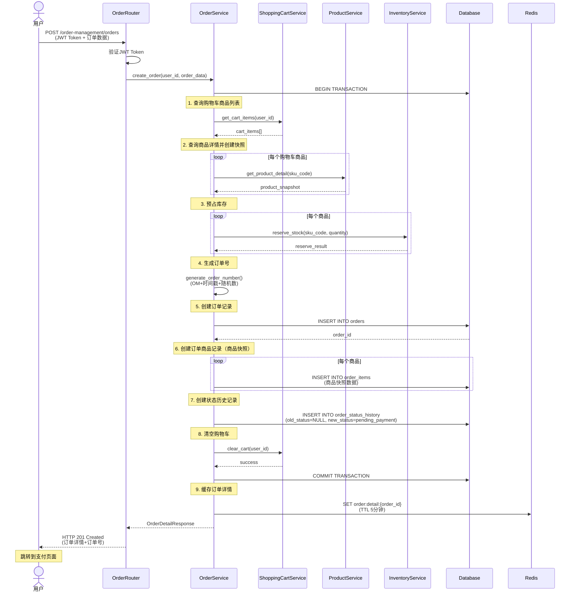

**异常处理流程**:
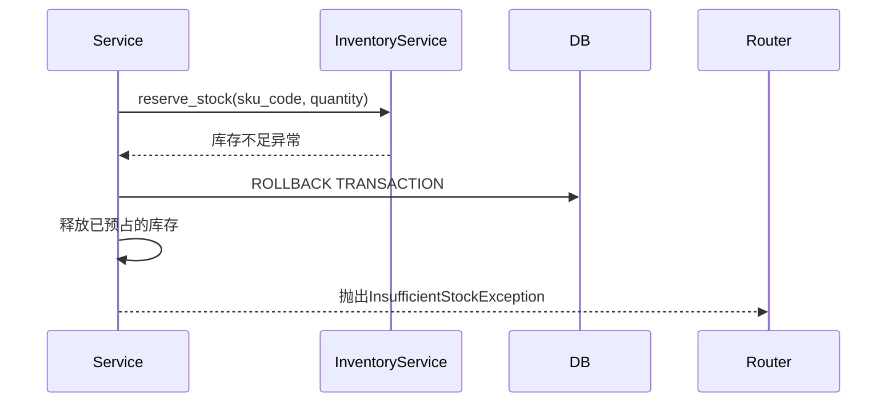

### 4.2 订单状态机设计

**业务需求引用**: REQ-OM-002（订单状态管理）, BR-OM-002（订单状态流转规则）

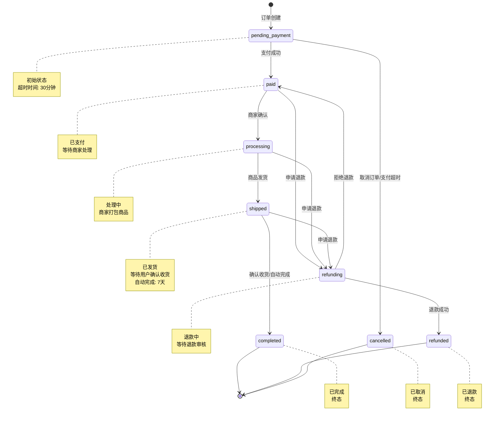

**状态流转规则表**:

| 当前状态 | 允许的目标状态 | 触发条件 | 操作人 | 业务规则 |
|---------|---------------|---------|-------|---------|
| `pending_payment` | `paid` | 支付成功 | 支付系统 | 支付回调更新订单状态 |
| `pending_payment` | `cancelled` | 用户取消/支付超时 | 用户/系统 | 释放库存，记录取消原因 |
| `paid` | `processing` | 商家确认订单 | 管理员 | 开始打包商品 |
| `paid` | `refunding` | 用户申请退款 | 用户 | 创建退款申请单 |
| `processing` | `shipped` | 商家发货 | 管理员 | 填写物流信息，通知物流模块 |
| `processing` | `refunding` | 用户申请退款 | 用户 | 创建退款申请单 |
| `shipped` | `completed` | 用户确认收货/7天自动确认 | 用户/系统 | 完成订单，计算积分 |
| `shipped` | `refunding` | 用户申请退款 | 用户 | 创建退款申请单 |
| `refunding` | `refunded` | 退款成功 | 支付系统 | 支付系统退款成功后回调 |
| `refunding` | `paid` | 拒绝退款 | 管理员 | 管理员拒绝退款申请 |
| `completed` | - | 无 | - | 终态 |
| `cancelled` | - | 无 | - | 终态 |
| `refunded` | - | 无 | - | 终态 |

### 4.3 订单查询流程

**业务需求引用**: REQ-OM-003（订单查询），REQ-OM-007（订单列表）

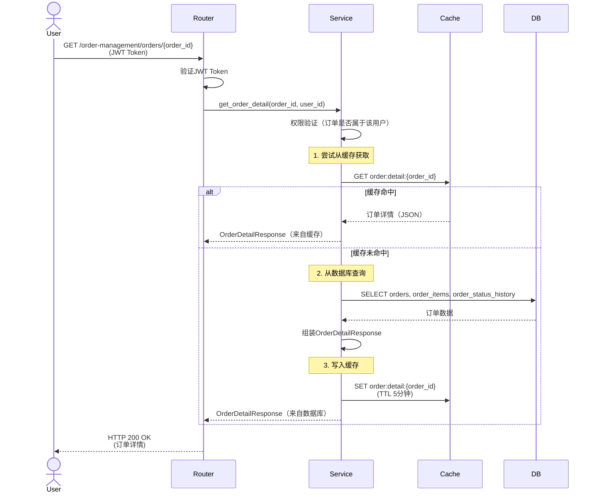

### 4.4 订单修改流程

**业务需求引用**: REQ-OM-004（订单修改），BR-OM-003（订单修改限制）

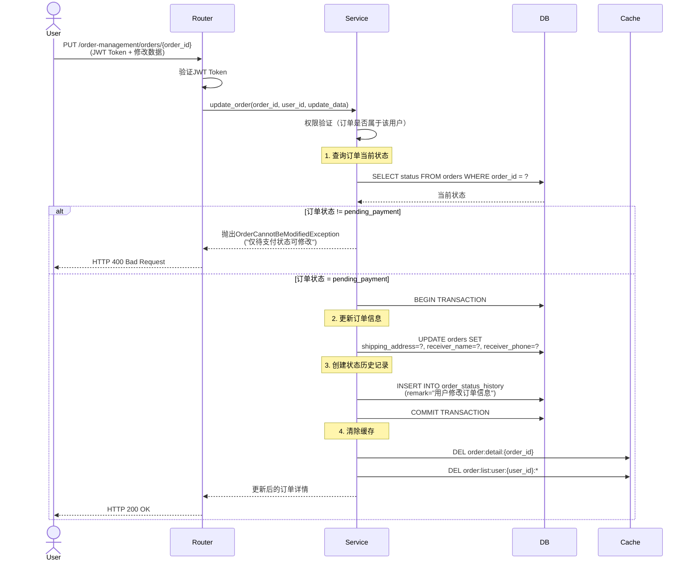

### 4.5 订单取消流程

**业务需求引用**: REQ-OM-005（订单取消），BR-OM-004（订单取消限制）

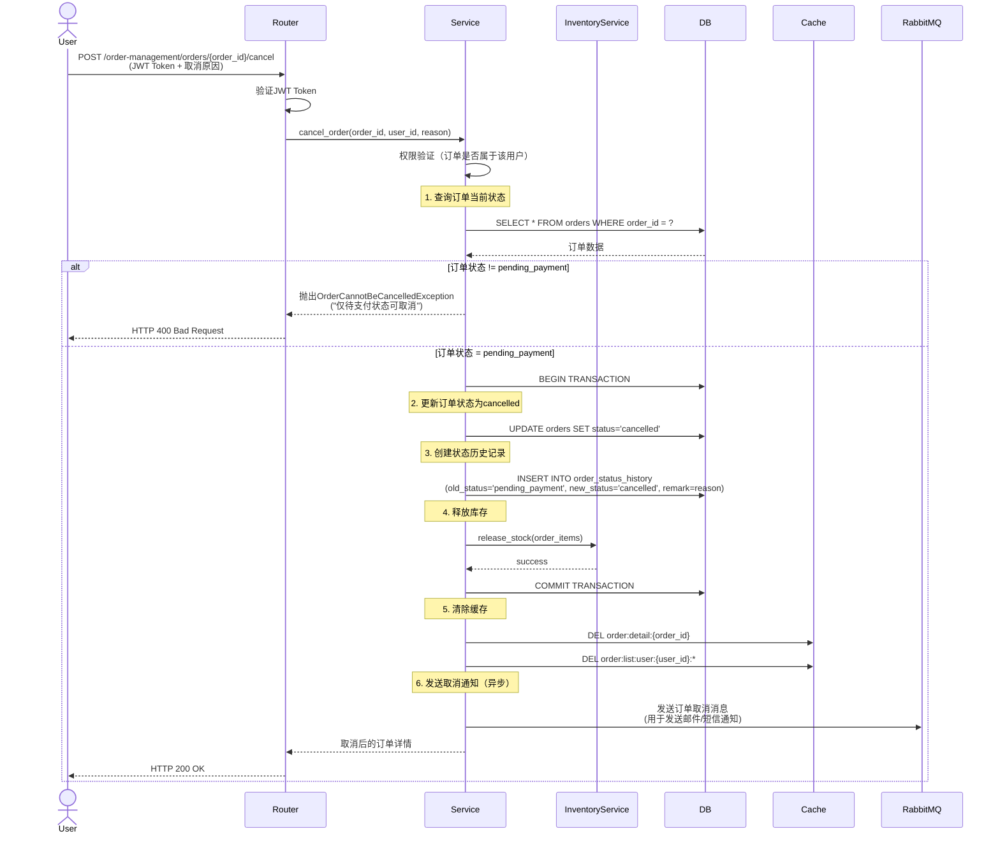

### 4.6 订单状态更新流程（支付回调）

**业务需求引用**: REQ-OM-002（订单状态管理）

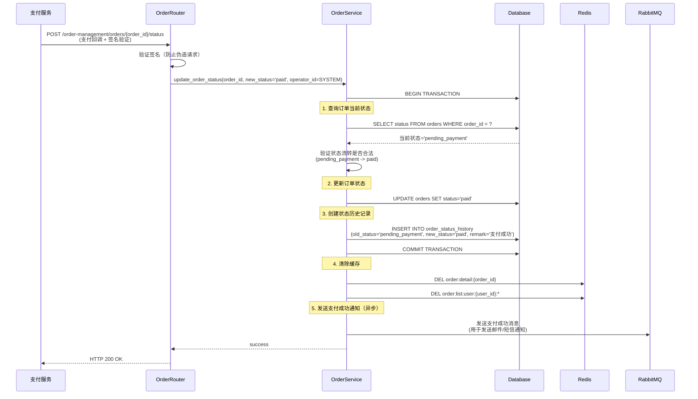

### 4.7 业务规则实现

**业务规则引用**: 详见 [requirements.md - 业务规则](./requirements.md#业务规则)

| 规则编号 | 规则名称 | 实现方式 | 验证时机 | 异常处理 |
|---------|---------|---------|---------|---------|
| **BR-OM-001** | 订单金额一致性 | `assert sum(order_items.subtotal_amount) == order.total_amount` | 订单创建时 | 抛出`OrderAmountMismatchException` |
| **BR-OM-002** | 订单状态流转规则 | 状态机验证 `OrderStateMachine.can_transition(old_status, new_status)` | 状态更新前 | 抛出`InvalidStatusTransitionException` |
| **BR-OM-003** | 订单修改限制 | `if order.status != 'pending_payment': raise Exception` | 订单修改前 | 抛出`OrderCannotBeModifiedException` |
| **BR-OM-004** | 订单取消限制 | `if order.status not in ['pending_payment']: raise Exception` | 订单取消前 | 抛出`OrderCannotBeCancelledException` |
| **BR-OM-005** | 支付超时自动取消 | 定时任务扫描30分钟未支付订单，自动调用`cancel_order()` | 定时任务（每5分钟） | 记录日志并发送通知 |

### 4.8 异常流程处理

**异常场景1：库存不足**
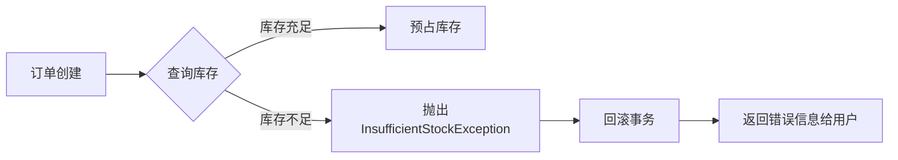

**异常场景2：支付超时**
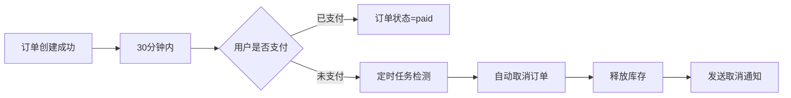

**异常场景3：并发订单创建**
- **问题**: 多个用户同时下单同一商品，导致库存扣减异常
- **解决方案**: 库存服务使用分布式锁（Redis SETNX）或数据库乐观锁（version字段）
- **降级策略**: 库存不足时引导用户选择其他商品或加入候补名单

---

## 第5章：接口设计

### 5.1 API端点清单

**API设计标准**: 严格遵循 [api-standards.md](../../standards/api-standards.md)

| 序号 | HTTP方法 | API路径 | 功能说明 | 认证 | 权限 | 对应需求 |
|------|---------|---------|---------|------|------|----------|
| 1 | POST | `/order-management/orders` | 创建新订单并预占库存 | ✅ JWT | 用户 | REQ-OM-001 |
| 2 | GET | `/order-management/orders` | 按条件分页查询订单列表 | ✅ JWT | 用户/管理员 | REQ-OM-003 / REQ-OM-007 |
| 3 | GET | `/order-management/orders/{order_id}` | 获取订单详情 | ✅ JWT | 用户/管理员 | REQ-OM-003 |
| 4 | PATCH | `/order-management/orders/{order_id}/status` | 更新订单状态（遵循状态机） | ✅ JWT | 管理员/超级管理员 | REQ-OM-002 |
| 5 | POST | `/order-management/orders/{order_id}/cancel` | 取消待支付订单并释放库存 | ✅ JWT | 用户/管理员 | REQ-OM-005 |
| 6 | GET | `/order-management/orders/{order_id}/items` | 查看订单商品快照列表 | ✅ JWT | 用户/管理员 | REQ-OM-006 |
| 7 | GET | `/order-management/orders/{order_id}/history` | 查询订单状态流转历史 | ✅ JWT | 用户/管理员 | REQ-OM-009 |
| 8 | GET | `/order-management/statistics` | 获取订单数量与金额统计 | ✅ JWT | 管理员/超级管理员 | REQ-OM-003 |

### 5.2 API详细规范

**详细API文档**: 参见 [api-spec.md](./api-spec.md)

#### 5.2.1 创建订单

**端点**: `POST /order-management/orders`

**请求头**:
```http
Authorization: Bearer <JWT_TOKEN>
Content-Type: application/json
```

**请求体（Pydantic Schema）**:
```python
class OrderCreateRequest(BaseModel):
    shipping_address: str = Field(..., min_length=10, max_length=500, description="收货地址")
    receiver_name: str = Field(..., min_length=2, max_length=100, description="收货人姓名")
    receiver_phone: str = Field(..., pattern=r"^1[3-9]\d{9}$", description="收货人电话")
    remark: Optional[str] = Field(None, max_length=500, description="订单备注")
    # 订单商品从购物车自动读取，不需要传递
```

**成功响应（HTTP 201 Created）**:
```json
{
    "code": 201,
    "message": "订单创建成功",
    "data": {
        "order_id": 1001,
        "order_number": "OM20251014123456ABCD",
        "user_id": 123,
        "status": "pending_payment",
        "total_amount": 299.80,
        "shipping_address": "北京市朝阳区xx街道xx小区xx号楼xx单元xxx室",
        "receiver_name": "张三",
        "receiver_phone": "13800138000",
        "remark": "请尽快发货",
        "items": [
            {
                "item_id": 5001,
                "product_name": "苹果iPhone 15 Pro",
                "sku_code": "SKU-IPHONE15PRO-256GB-BLACK",
                "unit_price": 7999.00,
                "quantity": 1,
                "product_attributes": {"color": "深空黑", "storage": "256GB"},
                "product_image_url": "https://cdn.example.com/iphone15.jpg",
                "subtotal_amount": 7999.00
            }
        ],
        "created_at": "2025-10-14T12:34:56Z",
        "updated_at": "2025-10-14T12:34:56Z"
    }
}
```

**错误响应**:
```json
{
    "code": 400,
    "message": "库存不足",
    "error": {
        "error_code": "OM_INSUFFICIENT_STOCK",
        "details": {
            "sku_code": "SKU-IPHONE15PRO-256GB-BLACK",
            "available_stock": 0,
            "required_quantity": 1
        }
    }
}
```

#### 5.2.2 获取订单详情

**端点**: `GET /order-management/orders/{order_id}`

**路径参数**:
- `order_id`: 订单ID（整数）

**成功响应（HTTP 200 OK）**:
```json
{
    "code": 200,
    "message": "查询成功",
    "data": {
        "order_id": 1001,
        "order_number": "OM20251014123456ABCD",
        "user_id": 123,
        "status": "paid",
        "total_amount": 299.80,
        "shipping_address": "北京市朝阳区xx街道...",
        "receiver_name": "张三",
        "receiver_phone": "13800138000",
        "remark": "请尽快发货",
        "items": [...],
        "status_history": [
            {
                "history_id": 1,
                "old_status": null,
                "new_status": "pending_payment",
                "operator_id": 123,
                "remark": "订单创建",
                "created_at": "2025-10-14T12:34:56Z"
            },
            {
                "history_id": 2,
                "old_status": "pending_payment",
                "new_status": "paid",
                "operator_id": 0,
                "remark": "支付成功",
                "created_at": "2025-10-14T12:40:12Z"
            }
        ],
        "created_at": "2025-10-14T12:34:56Z",
        "updated_at": "2025-10-14T12:40:12Z"
    }
}
```

#### 5.2.3 订单列表查询

**端点**: `GET /order-management/orders`

**查询参数**:
```python
class OrderListFilters(BaseModel):
    status: Optional[str] = Field(None, description="订单状态筛选")
    page: int = Field(1, ge=1, description="页码")
    page_size: int = Field(20, ge=1, le=100, description="每页条数")
    sort_by: str = Field("created_at", description="排序字段")
    sort_order: str = Field("desc", regex="^(asc|desc)$", description="排序方向")
```

**示例请求**:
```http
GET /order-management/orders?status=paid&page=1&page_size=20&sort_by=created_at&sort_order=desc
```

**成功响应（HTTP 200 OK）**:
```json
{
    "code": 200,
    "message": "查询成功",
    "data": {
        "total": 150,
        "page": 1,
        "page_size": 20,
        "orders": [
            {
                "order_id": 1001,
                "order_number": "OM20251014123456ABCD",
                "status": "paid",
                "total_amount": 299.80,
                "created_at": "2025-10-14T12:34:56Z"
            }
            // ... 更多订单
        ]
    }
}
```

### 5.3 认证和授权设计

**认证标准**: 严格遵循 [api-standards.md - 认证规范](../../standards/api-standards.md#认证规范)

#### 5.3.1 JWT认证机制

**JWT Token结构**:
```json
{
    "user_id": 123,
    "username": "zhangsan",
    "role": "user",
    "exp": 1697270400,
    "iat": 1697184000
}
```

**认证流程**:
```python
# app/modules/order_management/router.py
from app.core.dependencies import get_current_user

@router.get("/orders/{order_id}")
async def get_order_detail(
    order_id: int,
    current_user: dict = Depends(get_current_user),  # JWT认证
    db: Session = Depends(get_db)
):
    # current_user包含JWT Token解析后的用户信息
    user_id = current_user["user_id"]
    return await order_service.get_order_detail(order_id, user_id)
```

#### 5.3.2 权限控制（RBAC）

**角色权限矩阵**:

| API端点 | 普通用户 | 管理员 | 系统服务 | 权限验证逻辑 |
|---------|---------|-------|---------|-------------|
| `POST /api/v1/order-management/orders` | ✅ | ✅ | ❌ | 仅限已认证用户 |
| `GET /api/v1/order-management/orders/{order_id}` | ✅（仅自己的订单） | ✅（所有订单） | ❌ | 验证订单归属 |
| `GET /api/v1/order-management/orders` | ✅（仅自己的订单） | ✅（所有订单） | ❌ | 根据角色过滤数据 |
| `PUT /api/v1/order-management/orders/{order_id}` | ✅（仅自己的订单） | ✅ | ❌ | 验证订单归属+状态 |
| `POST /api/v1/order-management/orders/{order_id}/cancel` | ✅（仅自己的订单） | ✅ | ❌ | 验证订单归属+状态 |
| `GET /api/v1/order-management/orders/{order_id}/history` | ✅（仅自己的订单） | ✅（所有订单） | ❌ | 验证订单归属 |
| `POST /api/v1/order-management/orders/search` | ✅（仅自己的订单） | ✅（所有订单） | ❌ | 根据角色过滤数据 |
| `POST /api/v1/order-management/orders/{order_id}/status` | ❌ | ✅ | ✅ | 仅系统/管理员 |

**权限验证实现**:
```python
# app/modules/order_management/service.py
async def get_order_detail(self, order_id: int, user_id: int, role: str = "user"):
    order = await self.repository.get_order_by_id(order_id)
    if not order:
        raise OrderNotFoundException()
    
    # 权限验证：普通用户只能查询自己的订单
    if role == "user" and order.user_id != user_id:
        raise PermissionDeniedException("无权访问该订单")
    
    return order
```

### 5.4 错误码设计

**错误码规范**: 遵循 `OM_<CATEGORY>_<ERROR>` 格式

| 错误码 | HTTP状态码 | 错误信息 | 触发场景 | 解决方案 |
|-------|-----------|---------|---------|---------|
| `OM_NOT_FOUND` | 404 | 订单不存在 | 查询不存在的订单ID | 检查订单ID是否正确 |
| `OM_INSUFFICIENT_STOCK` | 400 | 库存不足 | 订单创建时库存不足 | 减少购买数量或选择其他商品 |
| `OM_INVALID_STATUS_TRANSITION` | 400 | 非法的状态流转 | 订单状态流转不符合规则 | 检查订单当前状态 |
| `OM_CANNOT_MODIFY` | 400 | 订单无法修改 | 修改非待支付状态订单 | 仅待支付状态可修改 |
| `OM_CANNOT_CANCEL` | 400 | 订单无法取消 | 取消非待支付状态订单 | 仅待支付状态可取消 |
| `OM_AMOUNT_MISMATCH` | 400 | 订单金额不一致 | 订单总金额与商品小计不符 | 重新计算订单金额 |
| `OM_PERMISSION_DENIED` | 403 | 无权访问该订单 | 访问非自己的订单 | 检查订单归属 |
| `OM_CART_EMPTY` | 400 | 购物车为空 | 购物车无商品时创建订单 | 先添加商品到购物车 |
| `OM_INTERNAL_ERROR` | 500 | 服务器内部错误 | 未预期的系统错误 | 联系技术支持 |

### 5.5 接口响应格式

**统一响应格式**: 严格遵循 [api-standards.md - 响应格式](../../standards/api-standards.md#响应格式)

**成功响应**:
```json
{
    "code": 200,
    "message": "操作成功",
    "data": {
        // 业务数据
    }
}
```

**错误响应**:
```json
{
    "code": 400,
    "message": "错误描述",
    "error": {
        "error_code": "OM_ERROR_CODE",
        "details": {
            // 错误详情
        }
    }
}
```

---

## 第6章：安全考虑与风险控制

### 6.1 认证和授权安全

#### 6.1.1 JWT Token安全

**安全措施**:
1. **Token加密**: 使用HS256算法签名，密钥存储在环境变量
2. **Token过期**: 设置合理的过期时间（默认24小时）
3. **Token刷新**: 支持Refresh Token机制（有效期7天）
4. **Token撤销**: 退出登录时将Token加入黑名单（Redis存储）

**实现示例**:
```python
# app/core/security.py
from jose import jwt
from datetime import datetime, timedelta

SECRET_KEY = os.getenv("JWT_SECRET_KEY")
ALGORITHM = "HS256"
ACCESS_TOKEN_EXPIRE_MINUTES = 1440  # 24小时

def create_access_token(data: dict):
    to_encode = data.copy()
    expire = datetime.utcnow() + timedelta(minutes=ACCESS_TOKEN_EXPIRE_MINUTES)
    to_encode.update({"exp": expire})
    return jwt.encode(to_encode, SECRET_KEY, algorithm=ALGORITHM)
```

#### 6.1.2 订单归属验证

**防护场景**: 防止用户A查询或修改用户B的订单

**验证逻辑**:
```python
# app/modules/order_management/service.py
async def get_order_detail(self, order_id: int, user_id: int):
    order = await self.repository.get_order_by_id(order_id)
    
    # 订单归属验证
    if order.user_id != user_id:
        raise PermissionDeniedException("无权访问该订单")
    
    return order
```

### 6.2 数据安全

#### 6.2.1 敏感数据保护

**敏感字段识别**:
- `receiver_phone`: 收货人电话（脱敏展示）
- `shipping_address`: 收货地址（部分脱敏）

**脱敏策略**:
```python
def mask_phone(phone: str) -> str:
    """电话号码脱敏：138****8000"""
    return phone[:3] + "****" + phone[-4:]

def mask_address(address: str) -> str:
    """地址脱敏：保留前30字符"""
    if len(address) > 30:
        return address[:30] + "***"
    return address
```

**日志脱敏**: 日志中不记录完整的电话号码和地址

#### 6.2.2 数据库安全

1. **SQL注入防护**: 使用SQLAlchemy ORM参数化查询
2. **数据库权限**: 应用账号仅有必要的增删改查权限，无DROP权限
3. **数据备份**: 每日全量备份+实时binlog备份
4. **数据加密**: 敏感字段使用AES-256加密存储（未来扩展）

### 6.3 业务风险控制

#### 6.3.1 恶意下单防护

**风险场景**: 恶意用户频繁下单不支付，占用库存

**防护措施**:
1. **下单频率限制**: 同一用户5分钟内最多下单3次（Redis计数器）
2. **支付超时**: 30分钟未支付自动取消订单释放库存
3. **黑名单机制**: 恶意下单用户加入黑名单，限制下单功能

**实现示例**:
```python
# app/modules/order_management/service.py
async def check_order_rate_limit(self, user_id: int):
    key = f"order:rate_limit:user:{user_id}"
    count = await redis.incr(key)
    
    if count == 1:
        await redis.expire(key, 300)  # 5分钟过期
    
    if count > 3:
        raise RateLimitExceededException("下单过于频繁，请稍后再试")
```

#### 6.3.2 超卖防护

**风险场景**: 高并发下单导致库存超卖

**防护措施**:
1. **库存预占**: 订单创建时先预占库存，支付成功后扣减
2. **分布式锁**: 库存扣减使用Redis分布式锁（SETNX）
3. **乐观锁**: 数据库库存表使用version字段乐观锁
4. **库存监控**: 实时监控库存异常（负数库存告警）

#### 6.3.3 金额篡改防护

**风险场景**: 客户端篡改订单金额

**防护措施**:
1. **服务端计算**: 订单总金额由服务端根据商品快照重新计算，忽略客户端传递的金额
2. **金额一致性验证**: 验证`total_amount == sum(order_items.subtotal_amount)`
3. **价格快照**: 商品价格从product_catalog查询后立即保存到order_items，不依赖客户端

**实现示例**:
```python
# app/modules/order_management/service.py
async def create_order(self, user_id: int, data: OrderCreateRequest):
    # 从购物车获取商品列表
    cart_items = await cart_service.get_cart_items(user_id)
    
    # 从商品目录查询最新价格（防止客户端篡改）
    order_items = []
    total_amount = Decimal("0.00")
    
    for cart_item in cart_items:
        product = await product_service.get_product(cart_item.sku_code)
        subtotal = product.price * cart_item.quantity
        total_amount += subtotal
        
        order_items.append({
            "product_name": product.name,
            "unit_price": product.price,  # 使用服务端价格
            "quantity": cart_item.quantity,
            "subtotal_amount": subtotal
        })
    
    # 创建订单（使用服务端计算的total_amount）
    order = Order(
        order_number=self.generate_order_number(),
        user_id=user_id,
        total_amount=total_amount,  # 服务端计算，忽略客户端传递的值
        ...
    )
```

### 6.4 安全审计

#### 6.4.1 操作日志

**审计字段**: `order_status_history`表记录所有状态变更

**审计内容**:
- 操作时间: `created_at`
- 操作人: `operator_id`
- 操作内容: `old_status` → `new_status`
- 操作备注: `remark`

**日志保留**: 至少保留3年

#### 6.4.2 异常监控

**监控指标**:
1. **订单创建失败率**: 超过5%触发告警
2. **库存不足错误**: 单个SKU频繁库存不足
3. **支付超时率**: 超过30%触发告警
4. **订单取消率**: 超过20%触发告警

**告警渠道**: 企业微信/钉钉/邮件

### 6.5 接口安全

#### 6.5.1 防重放攻击

**场景**: 支付回调接口防止重复调用

**防护措施**:
1. **签名验证**: 验证支付系统签名
2. **幂等性设计**: 同一订单多次支付回调仅处理一次
3. **时间戳验证**: 请求时间戳超过5分钟拒绝

**实现示例**:
```python
async def update_order_status(self, order_id: int, new_status: str, signature: str, timestamp: int):
    # 1. 时间戳验证
    if abs(time.time() - timestamp) > 300:
        raise SignatureExpiredException()
    
    # 2. 签名验证
    expected_signature = self.calculate_signature(order_id, new_status, timestamp)
    if signature != expected_signature:
        raise InvalidSignatureException()
    
    # 3. 幂等性验证
    order = await self.repository.get_order_by_id(order_id)
    if order.status == new_status:
        return order  # 已处理过，直接返回
    
    # 4. 更新订单状态
    return await self._update_order_status(order, new_status)
```

#### 6.5.2 API限流

**限流策略**:
- 创建订单: 5次/分钟/用户
- 查询订单详情: 30次/分钟/用户
- 订单列表查询: 20次/分钟/用户

**实现**: 使用Redis + Token Bucket算法

---

## 第7章：扩展性与性能考量

### 7.1 性能目标

**非功能需求引用**: 详见 [requirements.md - 非功能需求](./requirements.md#非功能需求)

| 性能指标 | 目标值 | 峰值压力 | 验收标准 |
|---------|-------|---------|---------|
| **订单创建响应时间** | P95 < 1s | 1000 TPS | 95%请求在1秒内完成 |
| **订单查询响应时间** | P95 < 500ms | 5000 QPS | 95%请求在500ms内完成 |
| **订单列表查询** | P95 < 800ms | 3000 QPS | 95%请求在800ms内完成 |
| **并发订单创建** | 支持1000 TPS | 高峰期 | 库存不超卖，数据一致性 |
| **系统可用性** | 99.9% | 7×24小时 | 年度停机时间<8.76小时 |

### 7.2 缓存策略

**订单详情缓存**:
- Key: `order:detail:{order_id}`
- TTL: 5分钟
- 失效时机: 订单状态变更时

**订单列表缓存**:
- Key: `order:list:user:{user_id}:page:{page}`
- TTL: 2分钟
- 失效时机: 订单状态变更时

### 7.3 数据库优化

**索引优化**:
```sql
CREATE INDEX idx_user_id_created_at ON orders(user_id, created_at DESC);
CREATE INDEX idx_status_created_at ON orders(status, created_at DESC);
```

**连接池配置**:
- pool_size: 20
- max_overflow: 10
- pool_timeout: 30s

### 7.4 可扩展性设计

**水平扩展**: 无状态设计，支持多实例部署

**订单类型扩展**: 支持普通订单、拼团订单、预售订单（通过order_type字段）

---

## 第8章：变更影响分析

### 8.1 数据库变更

**新增表**: orders, order_items, order_status_history

**影响**: 无影响，独立的新表

**迁移脚本**: `alembic upgrade head`

### 8.2 API变更

**新增API**: 8个RESTful端点

**影响**: 无影响，新增API不影响现有接口

### 8.3 模块依赖

**依赖模块**: user_auth, product_catalog, shopping_cart, inventory_management, payment_service

**被依赖模块**: payment_service, logistics_management, member_system, data_analytics_platform

### 8.4 风险评估

| 风险类别 | 风险等级 | 缓解措施 |
|---------|---------|---------|
| 库存超卖 | 🔴 高 | 库存预占+分布式锁 |
| 性能风险 | 🟡 中 | 缓存+异步处理 |
| 数据一致性 | 🟡 中 | 数据库事务 |

---

## 附录

### A. 参考文档

- [业务架构设计](../../architecture/business-architecture.md)
- [命名规范标准](../../standards/naming-conventions-standards.md)
- [API设计标准](../../standards/api-standards.md)
- [数据库设计标准](../../standards/database-standards.md)
- [订单管理模块概述](./overview.md)
- [订单管理模块需求](./requirements.md)

### B. 术语表

| 术语 | 英文 | 定义 |
|------|------|------|
| 订单 | Order | 用户购买商品的交易记录 |
| 商品快照 | Product Snapshot | 订单创建时保存的商品信息 |
| 订单状态机 | Order State Machine | 订单状态流转规则 |

### C. 变更记录

| 日期 | 版本 | 变更内容 | 变更人 | 评审状态 |
|------|------|----------|--------|---------|
| 2025-09-16 | v0.1 | 初始模板 | 架构团队 | 草稿 |
| 2025-10-14 | v1.0 | 完成详细设计文档（8章节） | 架构团队 | ✅ 已确认 |

---

**文档结束**
