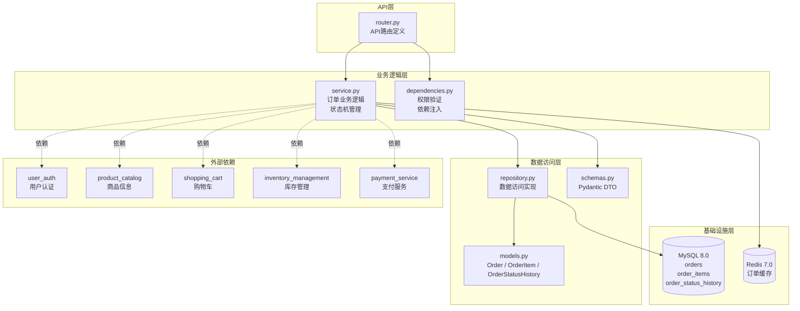
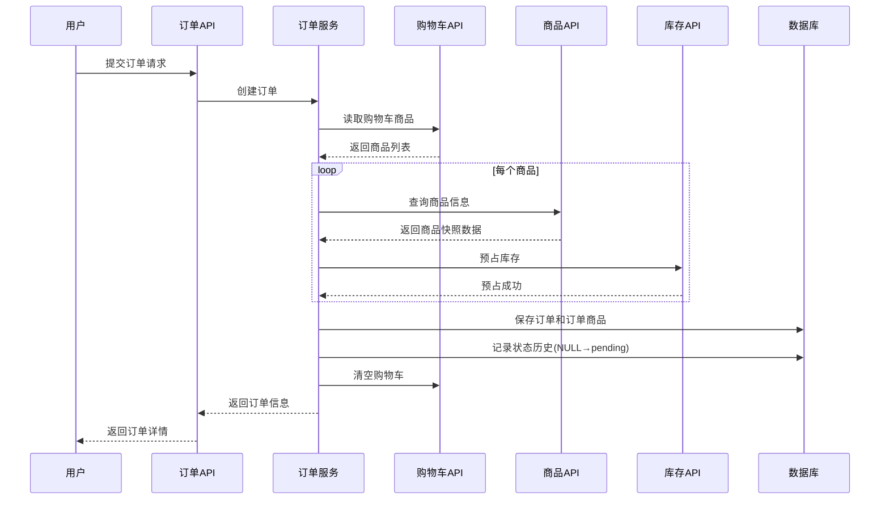
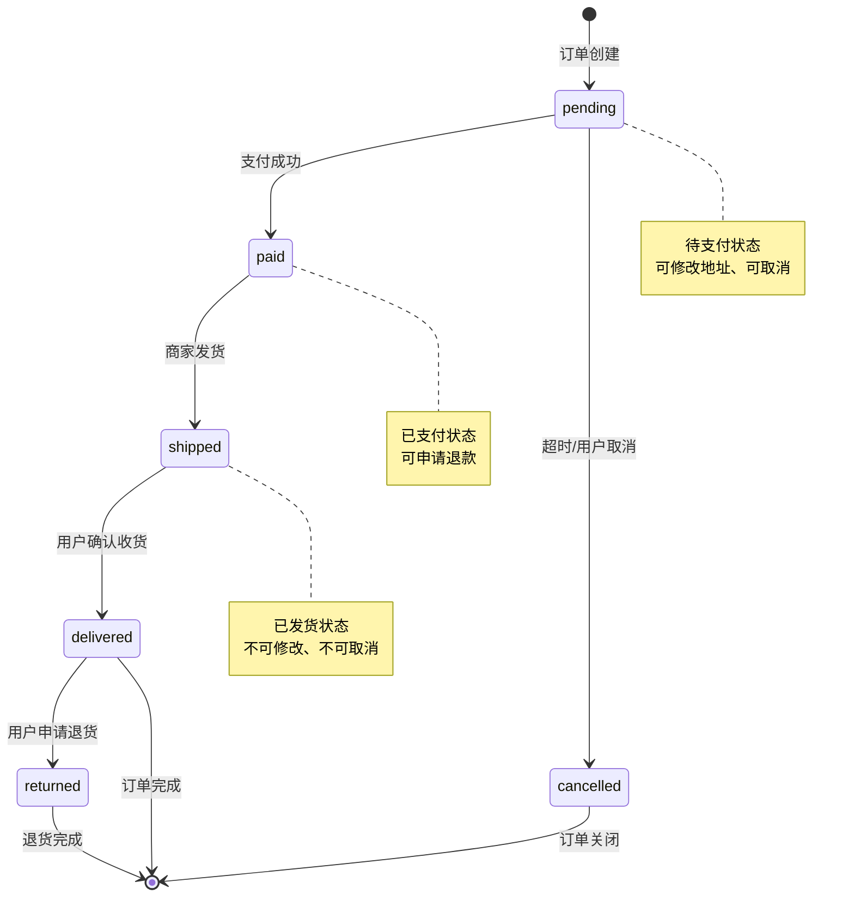
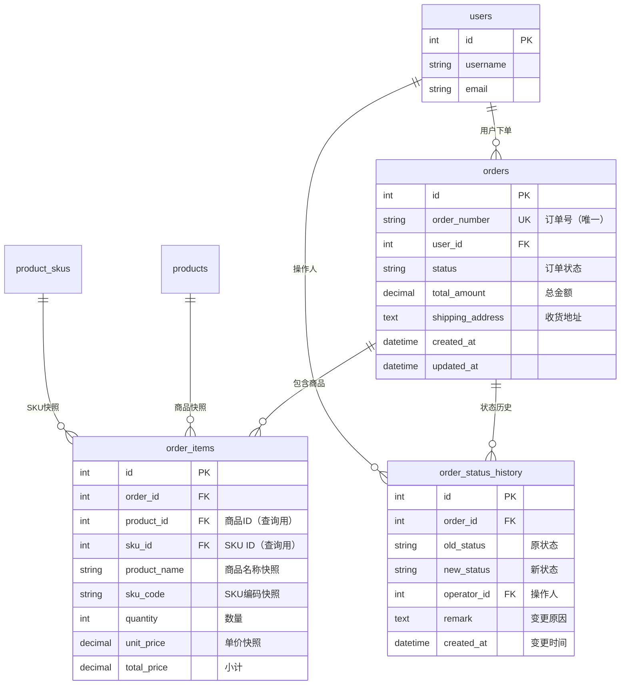

<!--
文档说明：
- 内容：模块文档标准模板，用于创建新的模块文档  
- 使用方法：复制此模板，替换模板变量，填入具体内容
- 更新方法：模板规范变更时由架构师更新
- 引用关系：被所有模块文档使用
- 更新频率：模板标准变化时

⚠️ 强制文档要求：
每个模块必须包含以下7个文档（无可选项）：
1. README.md - 模块导航（简洁版入口）
2. overview.md - 模块概述（本模板，详细版）
3. requirements.md - 业务需求文档（强制）
4. design.md - 设计决策文档（强制）
5. api-spec.md - API规范文档（强制）
6. api-implementation.md - API实施记录（强制）
7. implementation.md - 实现细节文档（强制）
-->

# 订单管理模块 (Order Management Module)

📝 **状态**: ✅ 已发布  
📅 **创建日期**: 2025-09-16  
👤 **负责人**: 架构团队  
🔄 **最后更新**: 2025-10-14  
📋 **版本**: v1.0.0  
📦 **业务域**: 交易域 (Transaction Domain)  

## 模块概述

订单管理模块是电商平台交易域的核心模块，负责订单全生命周期管理。从用户下单开始，通过订单创建、状态流转、商品快照保存，到最终订单完成或取消，提供完整的订单业务能力。模块采用状态机模式管理订单状态，通过商品快照机制实现与商品模块的解耦，确保历史订单数据的稳定性和可追溯性。

### 主要职责
订单管理模块的核心职责包括：

- **订单生命周期管理**: 管理订单从创建到完成的全流程，包括订单创建、状态流转、订单修改、订单取消等核心功能
- **商品快照保存**: 在订单创建时保存商品的完整快照信息（名称、价格、属性、图片），确保历史订单不受商品信息变更影响
- **订单状态机管理**: 实现订单状态机（待支付→已支付→已发货→已送达），严格控制状态流转规则，记录状态变更历史
- **订单查询和搜索**: 提供订单列表查询、详情查询、多条件搜索和分页功能，支持用户和管理员不同的查询权限
- **订单数据审计**: 记录订单状态变更历史，提供完整的审计轨迹，支持订单状态回溯和问题追溯
- **跨模块协作**: 与支付、库存、物流等模块协作，通过标准接口实现订单业务的完整闭环

### 业务价值

**核心价值**:
- **交易闭环核心**: 订单模块是电商交易闭环的核心环节，连接用户购买意愿和商品交付
- **数据可追溯性**: 通过商品快照和状态历史，确保订单数据的完整性和可追溯性，支持售后处理和纠纷解决
- **业务流程标准化**: 通过状态机模式标准化订单处理流程，降低业务复杂度，提高处理效率

**用户收益**:
- **订单透明**: 用户可以随时查询订单状态，了解订单处理进度
- **操作便捷**: 支持订单修改（地址）和取消操作，提升用户体验
- **数据稳定**: 历史订单信息不受商品变更影响，保证订单数据的一致性

**系统收益**:
- **模块解耦**: 通过商品快照机制与商品模块解耦，降低模块间耦合度
- **性能优化**: 订单数据独立存储，支持独立扩展和优化
- **审计支持**: 完整的状态历史记录，支持业务审计和问题排查

### 模块边界

**包含功能**:
- ✅ **订单创建**: 从购物车生成订单，创建订单商品快照，分配订单号
- ✅ **订单状态管理**: 订单状态机管理（pending→paid→shipped→delivered），状态流转验证
- ✅ **订单查询**: 订单列表（分页）、订单详情、订单搜索（按状态/时间/用户筛选）
- ✅ **订单修改**: 订单地址修改（限待支付状态）、订单取消（限待支付状态）
- ✅ **商品快照**: 保存订单商品的完整信息（名称、价格、SKU、图片），历史不可变
- ✅ **状态审计**: 记录订单状态变更历史，包括变更时间、操作人、变更原因

**排除功能**:
- ❌ **支付处理** → 由 `payment-service` 模块负责：支付方式选择、支付流程、支付回调、退款处理
- ❌ **库存扣减** → 由 `inventory-management` 模块负责：库存预占、库存扣减、库存释放
- ❌ **物流配送** → 由 `logistics-management` 模块负责：发货管理、物流追踪、配送路径优化
- ❌ **订单评价** → 由独立评价模块负责：商品评价、订单评分、评价审核
- ❌ **优惠券使用** → 由 `marketing-campaigns` 模块负责：优惠券验证、折扣计算、营销规则
- ❌ **积分计算** → 由 `member-system` 模块负责：订单积分计算、会员等级判断

**依赖模块**:
- **user_auth**: 用户身份认证和权限验证，获取当前用户信息
- **product_catalog**: 查询商品信息创建订单快照（商品名称、价格、属性、图片）
- **shopping_cart**: 读取购物车商品列表生成订单，订单创建后清空购物车
- **inventory_management**: 订单创建时预占库存，订单取消时释放库存
- **payment_service**: 订单创建后触发支付，支付成功后更新订单状态

**被依赖模块**:
- **payment_service**: 支付时查询订单信息（金额、状态），支付成功后更新订单状态
- **logistics_management**: 发货时查询订单收货信息，发货后更新订单状态为已发货
- **member_system**: 订单完成后计算会员积分，查询订单金额
- **data_analytics_platform**: 统计分析订单数据，生成业务报表

## 技术架构

### 架构图


### 核心组件
```
app/modules/order_management/
├── __init__.py          # 模块初始化和路由注册
├── router.py            # FastAPI路由定义（统一响应结构）
├── service.py           # 业务逻辑实现（状态机、事务编排）
├── repository.py        # 数据访问封装（OrderRepository）
├── models.py            # SQLAlchemy ORM模型（Order / Item / StatusHistory）
├── schemas.py           # Pydantic数据传输对象（请求/响应）
├── dependencies.py      # 依赖注入与权限控制（get_order_service等）
├── category_service.py  # 辅助服务（商品分类快照扩展，规划保留）
└── README.md            # 模块说明文档
```

### 模块化单体架构
- **架构模式**: 模块化单体架构 (Modular Monolith)
  - 遵循 Router → Service → Repository → Model 四层架构模式
  - 每层职责清晰，单向依赖
  - 支持未来向微服务演进
  
- **垂直切片**: 每个模块包含完整的业务功能
  - 订单模块包含完整的CRUD功能
  - 独立的数据模型和业务逻辑
  - 模块间通过标准接口协作
  
- **依赖原则**: 依赖注入和接口抽象
  - 使用FastAPI Depends实现依赖注入
  - 跨模块依赖通过接口调用
  - 避免直接访问其他模块数据库表

### 核心基础设施
```
app/core/               # 核心基础设施（共享组件）
├── database.py         # 数据库连接管理（SQLAlchemy Session）
├── redis_client.py     # Redis缓存客户端（订单缓存）  
├── auth.py             # JWT认证中间件（用户身份验证）
├── security.py         # 安全工具（权限验证）
└── __init__.py         # 核心组件导出

app/shared/             # 共享工具（跨模块复用）
├── exceptions.py       # 统一异常定义
├── response.py         # 统一响应格式
└── utils.py            # 通用工具函数
```

**订单模块使用的核心组件**:
- `database.get_db()`: 获取数据库Session，用于数据访问
- `auth.get_current_user()`: 获取当前登录用户，用于权限验证
- `redis_client.get_redis()`: 获取Redis客户端，用于订单缓存
- `exceptions.BusinessException`: 业务异常基类，用于统一异常处理

### 技术栈
- **编程语言**: Python 3.11+
- **Web框架**: FastAPI 0.104.1（异步支持、自动文档生成）
- **ORM框架**: SQLAlchemy 2.0.23（ORM映射、查询构建）
- **数据验证**: Pydantic 2.5.0（请求验证、响应序列化）
- **数据库**: MySQL 8.0（订单数据持久化）
- **缓存**: Redis 7.0（订单热数据缓存）
- **认证**: JWT Token（用户身份认证）
- **测试框架**: pytest + pytest-asyncio（单元测试、集成测试）
- **其他依赖**: 
  - `httpx`: 异步HTTP客户端（跨模块API调用）
  - `asyncio`: 异步编程支持
  - `python-jose`: JWT Token处理

### 设计模式

**已应用的设计模式**:

1. **状态模式 (State Pattern)**
   - 用于订单状态机管理
   - 封装状态流转规则
   - 示例：`OrderStatus` 枚举 + 状态流转验证

2. **快照模式 (Snapshot Pattern)**
   - 用于商品信息快照保存
   - 保证历史数据不可变性
   - 示例：`OrderItem` 保存商品快照字段

3. **依赖注入模式 (Dependency Injection)**
   - FastAPI Depends实现
   - 解耦组件依赖关系
   - 示例：`get_db()`, `get_current_user()`

4. **仓储模式 (Repository Pattern)**
   - 封装数据访问逻辑
   - 抽象数据库操作
   - 示例：OrderService封装Order数据操作

5. **工厂模式 (Factory Pattern)**
   - 用于订单号生成
   - 统一对象创建逻辑
   - 示例：`generate_order_number()`

**架构模式**:
- **分层架构**: Router（API层）→ Service（业务层）→ Model（数据层）
- **DDD战术设计**: Order作为聚合根，OrderItem作为实体，OrderStatus作为值对象
- **CQRS思想**: 分离查询和命令操作（查询使用缓存，命令直接操作数据库）

**代码组织原则**:
- **单一职责**: 每个类/函数只负责一个功能
- **开放封闭**: 对扩展开放，对修改封闭（如状态机可扩展新状态）
- **依赖倒置**: 依赖抽象而非具体实现（如依赖User接口而非User表）

## 核心功能

### 功能列表
| 功能名称 | 优先级 | 状态 | 描述 | REQ编号 |
|---------|--------|------|------|---------|
| 订单创建 | P0 | ✅ 已完成 | 从购物车生成订单，保存商品快照 | REQ-OM-001 |
| 订单状态管理 | P0 | ✅ 已完成 | 订单状态机管理，状态流转验证 | REQ-OM-002 |
| 订单列表查询 | P0 | ✅ 已完成 | 分页查询用户订单列表，支持筛选 | REQ-OM-003, REQ-OM-007 |
| 订单详情查询 | P0 | ✅ 已完成 | 查询订单完整信息，包括商品明细 | REQ-OM-003 |
| 订单地址修改 | P1 | ✅ 已完成 | 待支付状态下修改收货地址 | REQ-OM-004 |
| 订单取消 | P1 | ✅ 已完成 | 待支付状态下取消订单，释放库存 | REQ-OM-005 |
| 商品快照保存 | P0 | ✅ 已完成 | 订单创建时保存商品完整信息 | REQ-OM-006 |
| 订单搜索 | P2 | ✅ 已完成 | 按订单号、状态、时间搜索 | REQ-OM-008 |
| 状态历史记录 | P1 | ✅ 已完成 | 记录订单状态变更审计轨迹 | REQ-OM-009 |
| 权限控制 | P0 | ✅ 已完成 | 用户只能操作自己的订单 | REQ-OM-010 |

### 核心业务流程

**订单创建流程**:


**订单状态流转流程**:


### 业务规则

**BR-OM-001: 订单号生成规则**
- 格式: `OM` + 时间戳(YYYYMMDDHHmmss) + 4位随机数
- 示例: `OM20251014153045A3B2`
- 保证唯一性: 时间戳精确到秒 + 随机数

**BR-OM-002: 商品快照完整性**
- 必须保存字段: `product_name`, `sku_name`, `sku_code`, `unit_price`
- 不使用外键: `OrderItem` 不依赖 `products` 表
- 历史不可变: 商品信息变更不影响历史订单

**BR-OM-003: 订单状态流转规则**
- 正常流程: `pending` → `paid` → `shipped` → `delivered`
- 取消流程: `pending` → `cancelled`（仅待支付状态可取消）
- 退货流程: `delivered` → `returned`（已送达状态可申请退货）
- 非法流转: 禁止跨状态跳转（如 `pending` → `shipped`）

**BR-OM-004: 订单修改限制**
- 待支付状态（`pending`）: 可修改收货地址、可取消订单
- 已支付状态（`paid`）: 仅可申请退款，不可修改
- 已发货状态（`shipped`/`delivered`）: 不可修改、不可取消

**BR-OM-005: 权限控制规则**
- 普通用户: 只能查询和操作自己的订单（通过 `user_id` 过滤）
- 管理员: 可查询和管理所有订单（跳过 `user_id` 过滤）
- 操作验证: 订单修改/取消前验证订单归属权

## 数据模型

### 核心实体

**Order（订单主表）**:
```python
class Order(Base):
    """订单主表 - 订单生命周期和状态管理"""
    __tablename__ = "orders"
    
    # 主键和业务标识
    id = Column(Integer, primary_key=True, autoincrement=True)
    order_number = Column(String(32), unique=True, nullable=False, index=True)
    
    # 用户关联
    user_id = Column(Integer, ForeignKey("users.id"), nullable=False, index=True)
    
    # 订单状态
    status = Column(String(20), nullable=False, default="pending")
    
    # 金额信息
    subtotal = Column(Numeric(10, 2), nullable=False, default=0.00)
    shipping_fee = Column(Numeric(10, 2), nullable=False, default=0.00)
    discount_amount = Column(Numeric(10, 2), nullable=False, default=0.00)
    total_amount = Column(Numeric(10, 2), nullable=False, default=0.00)
    
    # 收货信息
    shipping_address = Column(Text, nullable=True)
    shipping_method = Column(String(50), default="standard")
    
    # 备注和审计
    notes = Column(Text, nullable=True)
    created_at = Column(DateTime, default=func.now(), nullable=False)
    updated_at = Column(DateTime, default=func.now(), onupdate=func.now())
    
    # 关系映射
    order_items = relationship("OrderItem", back_populates="order")
    status_history = relationship("OrderStatusHistory", back_populates="order")
```

**OrderItem（订单商品明细表）**:
```python
class OrderItem(Base):
    """订单商品表 - 存储商品快照，防止历史数据变更"""
    __tablename__ = "order_items"
    
    # 主键和关联
    id = Column(Integer, primary_key=True, autoincrement=True)
    order_id = Column(Integer, ForeignKey("orders.id"), nullable=False, index=True)
    
    # 商品关联（用于查询，非强依赖）
    product_id = Column(Integer, ForeignKey("products.id"), nullable=False, index=True)
    sku_id = Column(Integer, ForeignKey("product_skus.id"), nullable=False, index=True)
    
    # 商品快照（历史不可变）
    sku_code = Column(String(100), nullable=False)
    product_name = Column(String(200), nullable=False)
    sku_name = Column(String(200), nullable=False)
    
    # 数量和价格
    quantity = Column(Integer, nullable=False)
    unit_price = Column(Numeric(10, 2), nullable=False)
    total_price = Column(Numeric(10, 2), nullable=False)
    
    # 审计
    created_at = Column(DateTime, default=func.now(), nullable=False)
    
    # 关系映射
    order = relationship("Order", back_populates="order_items")
```

**OrderStatusHistory（订单状态历史表）**:
```python
class OrderStatusHistory(Base):
    """订单状态历史表 - 记录状态变更审计轨迹"""
    __tablename__ = "order_status_history"
    
    # 主键和关联
    id = Column(Integer, primary_key=True, autoincrement=True)
    order_id = Column(Integer, ForeignKey("orders.id"), nullable=False, index=True)
    
    # 状态变更信息
    old_status = Column(String(20), nullable=True)  # NULL表示初始创建
    new_status = Column(String(20), nullable=False)
    remark = Column(Text, nullable=True)
    
    # 操作人
    operator_id = Column(Integer, ForeignKey("users.id"), nullable=True)
    
    # 审计
    created_at = Column(DateTime, default=func.now(), nullable=False)
    
    # 关系映射
    order = relationship("Order", back_populates="status_history")
```

### 数据关系图


### 数据约束

**唯一性约束**:
- `orders.order_number`: 订单号全局唯一
- 复合唯一约束: 无（允许同一用户创建多个订单）

**外键约束**:
- `orders.user_id` → `users.id`: 订单归属用户（CASCADE）
- `order_items.order_id` → `orders.id`: 订单商品关联（CASCADE DELETE）
- `order_items.product_id` → `products.id`: 商品引用（SET NULL，商品删除后保留快照）
- `order_items.sku_id` → `product_skus.id`: SKU引用（SET NULL，SKU删除后保留快照）
- `order_status_history.order_id` → `orders.id`: 状态历史关联（CASCADE DELETE）
- `order_status_history.operator_id` → `users.id`: 操作人关联（SET NULL）

**索引设计**:
- `orders.order_number`: 唯一索引（订单号查询）
- `orders.user_id`: 普通索引（用户订单查询）
- `orders.status`: 普通索引（状态筛选）
- `orders.created_at`: 普通索引（时间排序）
- `order_items.order_id`: 普通索引（订单商品查询）
- `order_status_history.order_id`: 普通索引（状态历史查询）

**业务约束**:
- 订单金额: `subtotal`, `shipping_fee`, `discount_amount`, `total_amount` ≥ 0
- 订单商品数量: `order_items.quantity` > 0
- 订单状态: 必须为枚举值之一（`pending`, `paid`, `shipped`, `delivered`, `cancelled`, `returned`）
- 状态历史完整性: 每次状态变更必须记录到 `order_status_history`

## API接口

### 接口列表
| 接口 | 方法 | 路径 | 描述 | 状态 | 权限 |
|------|------|------|------|------|------|
| 创建订单 | POST | `/api/v1/order-management/orders` | 从购物车创建订单 | ✅ | User |
| 订单列表 | GET | `/api/v1/order-management/orders` | 分页查询订单列表 | ✅ | User/Admin |
| 订单详情 | GET | `/api/v1/order-management/orders/{order_id}` | 查询订单详细信息 | ✅ | User/Admin |
| 更新订单 | PUT | `/api/v1/order-management/orders/{order_id}` | 更新订单地址 | ✅ | User |
| 取消订单 | DELETE | `/api/v1/order-management/orders/{order_id}` | 取消订单（软删除） | ✅ | User |
| 状态历史 | GET | `/api/v1/order-management/orders/{order_id}/history` | 查询订单状态历史 | ✅ | User/Admin |
| 更新状态 | PUT | `/api/v1/order-management/orders/{order_id}/status` | 更新订单状态（内部API） | ✅ | System |

### 接口详情示例

**创建订单 API**:
```yaml
POST /api/v1/order-management/orders
Content-Type: application/json
Authorization: Bearer {jwt_token}

Request Body:
{
  "shipping_address": "北京市朝阳区xxx路xxx号",
  "shipping_method": "standard",
  "notes": "请在工作日配送"
}

Response 201:
{
  "id": 12345,
  "order_number": "OM20251014153045A3B2",
  "user_id": 100,
  "status": "pending",
  "total_amount": "299.00",
  "shipping_address": "北京市朝阳区xxx路xxx号",
  "items": [
    {
      "product_name": "有机苹果",
      "sku_name": "5kg装",
      "quantity": 2,
      "unit_price": "49.90",
      "total_price": "99.80"
    }
  ],
  "created_at": "2025-10-14T15:30:45Z"
}
```

**订单列表 API**:
```yaml
GET /api/v1/order-management/orders?status=pending&page=1&size=20
Authorization: Bearer {jwt_token}

Response 200:
{
  "items": [
    {
      "id": 12345,
      "order_number": "OM20251014153045A3B2",
      "status": "pending",
      "total_amount": "299.00",
      "created_at": "2025-10-14T15:30:45Z"
    }
  ],
  "total": 5,
  "page": 1,
  "size": 20
}
```

### 错误码

| 错误码 | HTTP状态码 | 描述 | 解决方案 |
|--------|-----------|------|----------|
| OM_001 | 400 | 购物车为空 | 先添加商品到购物车 |
| OM_002 | 400 | 订单状态不允许该操作 | 检查订单当前状态 |
| OM_003 | 404 | 订单不存在 | 确认订单ID正确 |
| OM_004 | 403 | 无权限访问该订单 | 只能访问自己的订单 |
| OM_005 | 409 | 库存不足 | 减少商品数量或联系客服 |
| OM_006 | 400 | 订单金额异常 | 联系客服处理 |
| OM_007 | 400 | 收货地址缺失 | 提供完整收货地址 |
| OM_008 | 500 | 订单创建失败 | 稍后重试或联系客服 |

**错误响应格式**:
```json
{
  "error": {
    "code": "OM_002",
    "message": "订单状态不允许该操作",
    "details": {
      "current_status": "shipped",
      "allowed_operations": ["查询", "申请退货"]
    }
  }
}
```

## 相关文档

### 📋 模块文档（本模块）
- **[README.md](./README.md)**: 模块快速导航和入口
- **[requirements.md](./requirements.md)**: 业务需求文档（REQ-OM-001 ~ REQ-OM-010）
- **[design.md](./design.md)**: 技术设计文档（8章节完整设计）
- **[api-spec.md](./api-spec.md)**: API规范文档（OpenAPI规范）
- **[api-implementation.md](./api-implementation.md)**: API实施记录
- **[implementation.md](./implementation.md)**: 代码实现细节和技术决策

### 🏗️ 架构文档
- [业务架构设计](../../architecture/business-architecture.md) - 交易域定义和模块边界
- [应用架构设计](../../architecture/application-architecture.md) - 模块化单体架构
- [数据架构设计](../../architecture/data-architecture.md) - 数据模型和关系
- [系统架构概览](../../architecture/overview.md) - 整体架构说明

### 📐 标准规范
- [API设计标准](../../standards/api-standards.md) - RESTful API设计原则
- [数据库设计标准](../../standards/database-standards.md) - 数据库设计规范
- [命名规范标准](../../standards/naming-conventions-standards.md) - 命名映射和规则
- [代码开发规范](../../standards/code-standards.md) - Python代码规范
- [文档管理标准](../../standards/document-management-standards.md) - A3/A6/A8/A10标准

### 🔗 依赖模块
- [用户认证模块](../user-auth/overview.md) - 提供用户身份认证和权限验证
- [商品目录模块](../product-catalog/overview.md) - 提供商品信息用于创建快照
- [购物车模块](../shopping-cart/overview.md) - 提供购物车商品列表
- [库存管理模块](../inventory-management/overview.md) - 提供库存预占和释放
- [支付服务模块](../payment-service/overview.md) - 处理订单支付

### 🔄 被依赖模块
- [支付服务模块](../payment-service/overview.md) - 查询订单信息和更新状态
- [物流管理模块](../logistics-management/overview.md) - 查询收货信息和更新状态
- [会员系统模块](../member-system/overview.md) - 计算订单积分
- [数据分析平台](../data-analytics-platform/overview.md) - 订单数据统计分析

---

## 📝 文档维护说明

**符合标准**: A6标准（模块概述文档，6章节）
- ✅ 章节1: 模块概述（主要职责、业务价值、模块边界）
- ✅ 章节2: 技术架构（架构图、核心组件、技术栈、设计模式）
- ✅ 章节3: 核心功能（功能列表、业务流程、业务规则）
- ✅ 章节4: 数据模型（核心实体、数据关系图、数据约束）
- ✅ 章节5: API接口（接口列表、接口示例、错误码）
- ✅ 章节6: 相关文档（模块文档、架构文档、标准规范、依赖模块）

**更新原则**:
- 业务需求变更时更新"模块边界"和"核心功能"
- 技术架构调整时更新"技术架构"和"设计模式"
- 数据模型变更时更新"数据模型"和"数据约束"
- API变更时更新"API接口"并同步到api-spec.md
- 保持与其他6个文档的一致性

**最后更新**: 2025-10-14  
**版本**: v1.0.0  
**状态**: ✅ 已发布

