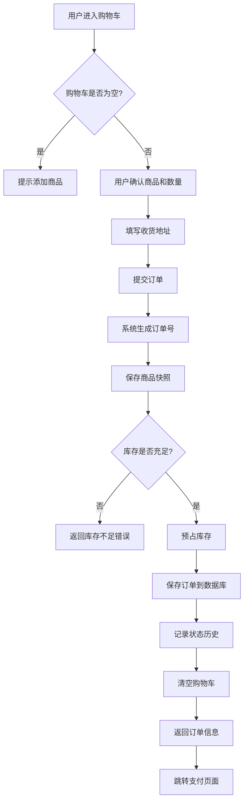
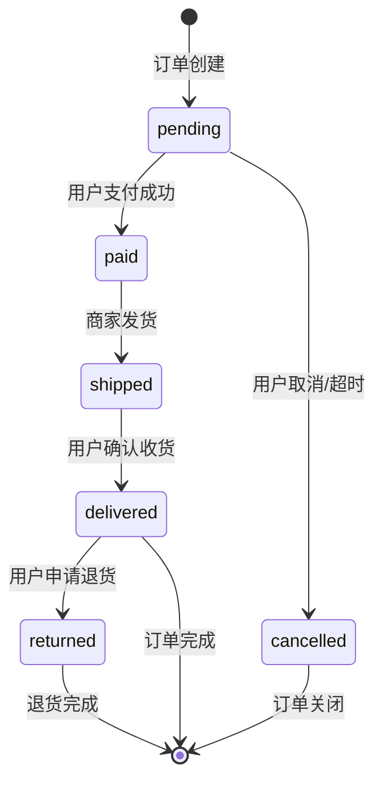

<!--
文档说明：
- 内容：模块业务需求文档模板
- 作用：记录业务需求、功能规格、验收标准
- 使用方法：详细记录业务需求，不包含技术实现
-->

# 订单管理模块 - 业务需求文档

📅 **创建日期**: 2025-09-16  
👤 **需求方**: 产品团队  
✅ **评审状态**: ✅ 已确认  
🔄 **最后更新**: 2025-10-14  
📦 **业务域**: 交易域 (Transaction Domain)  

## 业务背景

### 业务目标
订单管理模块是电商平台交易闭环的核心环节，旨在实现：

1. **用户购买体验优化**: 提供流畅的下单流程，从购物车到订单完成的无缝体验
2. **订单数据可追溯**: 通过商品快照和状态历史，确保订单数据完整性和可追溯性
3. **业务流程标准化**: 通过订单状态机管理，标准化订单处理流程，降低业务复杂度
4. **系统模块解耦**: 通过商品快照机制与商品模块解耦，提高系统可维护性
5. **运营效率提升**: 为运营人员提供完整的订单管理工具，提高订单处理效率

### 业务场景

**场景1：用户下单购买**
- 用户将心仪的农产品加入购物车
- 确认购物车商品和数量后，填写收货地址
- 提交订单，系统保存商品价格快照防止价格变动影响
- 跳转支付页面完成支付

**场景2：订单状态跟踪**
- 用户支付后，订单状态从"待支付"变为"已支付"
- 商家发货后，订单状态变为"已发货"，用户可查看物流信息
- 用户收货后，订单状态变为"已送达"，可以评价商品
- 整个过程状态变更历史完整记录，可随时回溯

**场景3：订单修改和取消**
- 用户下单后发现地址错误，在待支付状态下可以修改收货地址
- 用户临时改变主意，在待支付状态下可以取消订单，系统自动释放预占库存
- 已发货的订单不能取消，但可以申请退货

**场景4：历史订单查询**
- 用户查看历史订单，即使商品已下架或价格变动，历史订单信息保持不变
- 商品快照确保订单记录的准确性，支持售后纠纷处理

### 成功指标
- **订单创建成功率**: ≥ 99.5%（排除库存不足等正常失败）
- **订单查询响应时间**: P95 < 500ms
- **订单状态流转准确率**: 100%（无非法状态流转）
- **商品快照完整率**: 100%（所有订单商品必须保存完整快照）
- **订单数据一致性**: 99.99%（与支付、库存、物流数据一致）
- **用户下单体验**: 从购物车到订单创建完成 < 3秒

## 功能需求

### 核心功能列表
| 功能ID | 功能名称 | 优先级 | 业务价值 | 验收标准 |
|--------|----------|--------|----------|----------|
| REQ-OM-001 | 订单创建 | P0 | 完成交易闭环，实现用户购买 | 订单创建成功，商品快照完整，库存预占成功 |
| REQ-OM-002 | 订单状态管理 | P0 | 订单生命周期管理，状态流转可控 | 状态流转符合规则，状态历史完整记录 |
| REQ-OM-003 | 订单查询 | P0 | 用户查看订单信息，跟踪订单状态 | 查询准确，响应快速，权限正确 |
| REQ-OM-004 | 订单修改 | P1 | 用户纠正错误信息，提升用户体验 | 仅待支付状态可修改，修改后数据一致 |
| REQ-OM-005 | 订单取消 | P1 | 用户改变主意，释放系统资源 | 仅待支付状态可取消，库存正确释放 |
| REQ-OM-006 | 商品快照 | P0 | 历史订单数据稳定，不受商品变更影响 | 快照数据完整，历史订单查询准确 |
| REQ-OM-007 | 订单列表分页 | P1 | 支持大量订单查询，提升性能 | 分页准确，排序正确，性能良好 |
| REQ-OM-008 | 订单搜索 | P2 | 快速定位目标订单，提升运营效率 | 支持多条件搜索，结果准确 |
| REQ-OM-009 | 状态历史记录 | P1 | 订单状态可追溯，支持审计和纠纷处理 | 状态变更完整记录，包含操作人和时间 |
| REQ-OM-010 | 权限控制 | P0 | 保护用户数据隐私，防止越权访问 | 用户只能访问自己的订单，管理员权限正确 |

### 详细功能描述

#### REQ-OM-001: 订单创建
- **业务描述**: 用户从购物车提交订单，系统创建订单记录，保存商品价格快照，预占库存
- **用户故事**: 作为**用户**，我希望**从购物车一键下单**，以便**快速完成购买流程**
- **前置条件**: 
  - 用户已登录
  - 购物车中有商品
  - 商品库存充足
- **业务规则**: 
  - 规则1: 订单号格式为 `OM` + 时间戳(YYYYMMDDHHmmss) + 4位随机数
  - 规则2: 必须保存商品快照（名称、价格、SKU、图片），不依赖商品表外键
  - 规则3: 订单创建时必须预占库存，防止超卖
  - 规则4: 订单创建成功后清空购物车
  - 规则5: 订单初始状态为"pending"（待支付）
- **异常处理**: 
  - 购物车为空：返回错误提示"购物车为空，请先添加商品"
  - 库存不足：返回错误提示"商品xxx库存不足，请减少数量"
  - 商品已下架：返回错误提示"商品xxx已下架，无法下单"
  - 地址缺失：提示用户填写收货地址

#### REQ-OM-002: 订单状态管理
- **业务描述**: 订单状态按照状态机规则流转，记录每次状态变更历史
- **用户故事**: 作为**系统**，我希望**严格控制订单状态流转**，以便**保证订单处理流程正确**
- **前置条件**: 订单已创建
- **业务规则**: 
  - 规则1: 正常流程：pending → paid → shipped → delivered
  - 规则2: 取消流程：pending → cancelled（仅待支付状态可取消）
  - 规则3: 退货流程：delivered → returned（已送达状态可申请退货）
  - 规则4: 禁止跨状态跳转（如 pending → shipped）
  - 规则5: 每次状态变更必须记录到状态历史表
- **异常处理**: 
  - 非法状态流转：返回错误"当前状态不允许该操作"
  - 状态变更失败：记录错误日志，通知管理员

#### REQ-OM-003: 订单查询
- **业务描述**: 用户查询自己的订单列表和详情，管理员可查询所有订单
- **用户故事**: 作为**用户**，我希望**查看我的订单列表和详情**，以便**了解订单状态和物流信息**
- **前置条件**: 用户已登录
- **业务规则**: 
  - 规则1: 普通用户只能查询自己的订单（通过user_id过滤）
  - 规则2: 管理员可查询所有订单（跳过user_id过滤）
  - 规则3: 订单列表按创建时间倒序排列
  - 规则4: 订单详情包含订单基本信息和商品明细
- **异常处理**: 
  - 订单不存在：返回404错误"订单不存在"
  - 无权限访问：返回403错误"无权限访问该订单"

#### REQ-OM-004: 订单修改
- **业务描述**: 用户在待支付状态下可以修改收货地址
- **用户故事**: 作为**用户**，我希望**在支付前修改收货地址**，以便**纠正地址错误**
- **前置条件**: 
  - 用户已登录
  - 订单状态为"pending"（待支付）
- **业务规则**: 
  - 规则1: 仅待支付状态可修改收货地址
  - 规则2: 已支付、已发货状态不可修改
  - 规则3: 修改后记录修改历史
- **异常处理**: 
  - 订单状态不允许修改：返回错误"订单状态不允许修改"
  - 地址格式错误：返回错误"收货地址格式不正确"

#### REQ-OM-005: 订单取消
- **业务描述**: 用户在待支付状态下可以取消订单，系统释放预占库存
- **用户故事**: 作为**用户**，我希望**在支付前取消订单**，以便**改变购买决定**
- **前置条件**: 
  - 用户已登录
  - 订单状态为"pending"（待支付）
- **业务规则**: 
  - 规则1: 仅待支付状态可取消
  - 规则2: 取消订单后释放预占库存
  - 规则3: 订单状态变更为"cancelled"
  - 规则4: 记录取消原因到状态历史
- **异常处理**: 
  - 订单状态不允许取消：返回错误"订单状态不允许取消"
  - 库存释放失败：记录错误日志，通知管理员处理

#### REQ-OM-006: 商品快照
- **业务描述**: 订单创建时保存商品完整信息快照，历史订单不受商品信息变更影响
- **用户故事**: 作为**系统**，我希望**保存商品快照**，以便**历史订单数据稳定可靠**
- **前置条件**: 订单创建时
- **业务规则**: 
  - 规则1: 必须保存字段：product_name, sku_name, sku_code, unit_price
  - 规则2: OrderItem不使用强外键依赖Product表
  - 规则3: 商品信息变更不影响历史订单显示
- **异常处理**: 
  - 商品信息获取失败：返回错误"商品信息获取失败"

#### REQ-OM-007: 订单列表分页
- **业务描述**: 订单列表支持分页查询，支持按状态、时间筛选
- **用户故事**: 作为**用户**，我希望**分页查询订单列表**，以便**快速浏览大量订单**
- **前置条件**: 用户已登录
- **业务规则**: 
  - 规则1: 默认每页20条，支持10/20/50/100
  - 规则2: 按创建时间倒序排列
  - 规则3: 支持按状态筛选（全部/待支付/已支付/已发货/已送达）
  - 规则4: 支持按时间范围筛选
- **异常处理**: 
  - 分页参数错误：返回默认分页参数

#### REQ-OM-008: 订单搜索
- **业务描述**: 支持按订单号、商品名称、时间范围搜索订单
- **用户故事**: 作为**用户**，我希望**快速搜索订单**，以便**定位目标订单**
- **前置条件**: 用户已登录
- **业务规则**: 
  - 规则1: 支持按订单号精确搜索
  - 规则2: 支持按商品名称模糊搜索
  - 规则3: 支持按时间范围搜索
  - 规则4: 搜索结果按相关度排序
- **异常处理**: 
  - 搜索无结果：返回空列表

#### REQ-OM-009: 状态历史记录
- **业务描述**: 记录订单状态每次变更的完整审计信息
- **用户故事**: 作为**运营人员**，我希望**查看订单状态变更历史**，以便**追溯订单处理过程**
- **前置条件**: 订单已创建
- **业务规则**: 
  - 规则1: 记录字段：old_status, new_status, operator_id, remark, created_at
  - 规则2: 订单创建时记录 NULL → pending
  - 规则3: 每次状态变更必须记录
  - 规则4: 状态历史不可修改和删除
- **异常处理**: 
  - 状态历史记录失败：记录错误日志，不影响主流程

#### REQ-OM-010: 权限控制
- **业务描述**: 用户只能访问和操作自己的订单，管理员可管理所有订单
- **用户故事**: 作为**用户**，我希望**只能访问自己的订单**，以便**保护我的隐私**
- **前置条件**: 用户已登录
- **业务规则**: 
  - 规则1: 普通用户通过user_id过滤订单
  - 规则2: 管理员角色可查询所有订单
  - 规则3: 订单修改/取消前验证订单归属权
  - 规则4: 越权访问返回403错误
- **异常处理**: 
  - 越权访问：返回403错误"无权限访问该订单"

## 非功能需求

### 性能要求
- **API响应时间**: 
  - 订单创建: P95 < 1s（含库存预占和快照保存）
  - 订单查询: P95 < 500ms
  - 订单列表: P95 < 800ms（包含分页计算）
- **并发处理能力**: 
  - 订单查询: 支持200 QPS并发
  - 订单创建: 支持50 QPS并发（受库存系统限制）
- **数据量支持**: 
  - 订单表: 支持1000万条记录
  - 订单商品表: 支持5000万条记录
  - 状态历史表: 支持1亿条记录
- **数据库查询优化**: 
  - 所有外键字段建立索引
  - 订单号、用户ID、状态字段建立组合索引
  - 订单列表查询使用覆盖索引

### 可用性要求
- **系统可用性**: ≥ 99.9%（年停机时间 < 8.76小时）
- **故障恢复**: 
  - RTO（恢复时间目标）: < 5分钟
  - RPO（恢复点目标）: < 1分钟（数据丢失 < 1分钟）
- **降级策略**: 
  - 订单查询缓存降级：Redis故障时直接查数据库
  - 订单创建限流：高峰期限制订单创建频率
- **监控告警**: 
  - 订单创建成功率 < 99%触发告警
  - API响应时间 > 1s触发告警
  - 数据库连接池使用率 > 80%触发告警

### 安全要求
- **数据安全**: 
  - 敏感数据（收货地址、手机号）加密存储
  - 数据传输使用HTTPS加密
  - 定期数据备份（每日全量+每小时增量）
- **访问控制**: 
  - 所有API接口需JWT Token认证
  - 基于RBAC的权限控制（用户/管理员角色）
  - 订单操作前验证归属权
- **输入验证**: 
  - 所有API参数使用Pydantic严格验证
  - 防止SQL注入（使用参数化查询）
  - 防止XSS攻击（输出编码）
- **审计日志**: 
  - 记录所有订单状态变更操作
  - 记录敏感操作（订单取消、地址修改）
  - 日志保留180天

### 扩展性要求
- **用户增长**: 
  - 支持用户数从10万增长到100万
  - 支持日订单量从1000单增长到10000单
- **功能扩展**: 
  - 预留订单类型扩展（普通订单、拼团订单、预售订单）
  - 预留订单来源扩展（APP、小程序、PC网站）
  - 支持订单导出功能（Excel、PDF）
  - 支持订单打印功能（发货单、发票）
- **架构扩展**: 
  - 支持读写分离（订单查询走从库）
  - 支持分库分表（按用户ID或时间分片）
  - 支持微服务拆分（订单服务独立部署）

## 业务约束

### 合规要求
- **电商法合规**: 订单信息保存期限≥3年，满足电商法要求
- **消费者权益保护**: 支持7天无理由退货，订单状态变更通知用户
- **数据隐私保护**: 符合个人信息保护法，用户数据加密存储和传输
- **发票合规**: 订单金额信息准确，支持开具电子发票

### 时间约束
- **交付时间**: 2025-09-30（核心功能）
- **里程碑**: 
  - M1（2025-09-20）: 订单创建、查询功能
  - M2（2025-09-25）: 订单状态管理、修改取消
  - M3（2025-09-30）: 商品快照、状态历史、权限控制
  - M4（2025-10-10）: 性能优化、测试验收

### 资源约束
- **人力资源**: 2名后端开发，1名测试工程师
- **技术约束**: 
  - 必须兼容现有技术栈（FastAPI + SQLAlchemy + MySQL）
  - 必须使用Pydantic 2.0语法
  - 必须符合项目架构标准和命名规范

## 用户角色和权限

### 用户角色定义
| 角色名称 | 角色描述 | 权限范围 |
|----------|----------|----------|
| **普通用户** | 注册用户，购买商品 | 查询自己的订单、创建订单、修改和取消自己的订单 |
| **管理员** | 平台运营人员 | 查询所有订单、管理订单状态、查看状态历史、导出订单数据 |
| **系统** | 内部服务调用 | 更新订单状态（支付回调、发货通知） |

### 权限矩阵
| 功能 | 普通用户 | 管理员 | 系统 |
|------|---------|---------|------|
| 创建订单 | ✅ | ✅ | ❌ |
| 查询自己的订单 | ✅ | ✅ | ❌ |
| 查询所有订单 | ❌ | ✅ | ❌ |
| 修改订单地址 | ✅（自己的） | ✅ | ❌ |
| 取消订单 | ✅（自己的） | ✅ | ❌ |
| 查看状态历史 | ✅（自己的） | ✅ | ❌ |
| 更新订单状态 | ❌ | ✅ | ✅ |
| 导出订单数据 | ❌ | ✅ | ❌ |

## 业务流程

### 主要业务流程

**订单创建流程**:

**订单状态流转流程**:

### 异常流程
- **异常1：库存不足**: 
  - 订单创建时检测到库存不足
  - 返回错误信息"商品xxx库存不足"
  - 用户可以减少商品数量或选择其他商品
  
- **异常2：支付超时**: 
  - 订单创建后30分钟未支付
  - 系统自动取消订单，状态变更为cancelled
  - 释放预占库存，发送取消通知给用户
  
- **异常3：商品快照获取失败**: 
  - 商品信息接口调用失败
  - 重试3次，仍失败则返回错误
  - 不创建订单，释放已预占库存

- **异常4：越权访问**: 
  - 用户尝试访问他人订单
  - 返回403错误"无权限访问该订单"
  - 记录安全日志

## 数据需求

### 核心业务实体
| 实体名称 | 业务含义 | 核心属性 |
|----------|----------|----------|
| **Order**（订单） | 订单主表，记录订单基本信息 | order_number（订单号）, user_id（用户ID）, status（状态）, total_amount（总金额）, shipping_address（收货地址） |
| **OrderItem**（订单商品） | 订单商品明细，保存商品快照 | product_name（商品名称）, sku_code（SKU编码）, quantity（数量）, unit_price（单价快照）, total_price（小计） |
| **OrderStatusHistory**（状态历史） | 订单状态变更审计记录 | old_status（原状态）, new_status（新状态）, operator_id（操作人）, remark（备注）, created_at（变更时间） |

### 数据规则
- **唯一性**: 
  - 订单号全局唯一
  - 同一订单的状态历史按时间顺序记录
  
- **完整性**: 
  - 订单必须有关联的用户（user_id不能为空）
  - 订单必须有至少一个订单商品
  - 商品快照必须完整（product_name, sku_code, unit_price不能为空）
  - 状态变更必须记录到状态历史
  
- **一致性**: 
  - 订单总金额 = ∑(订单商品小计) + 运费 - 折扣
  - 订单状态与支付状态一致
  - 订单状态与库存状态一致（取消订单后库存释放）

## 验收标准

### 功能验收
- [x] **REQ-OM-001**: 订单创建功能正常，商品快照完整，库存预占成功
- [x] **REQ-OM-002**: 订单状态流转符合状态机规则，状态历史完整记录
- [x] **REQ-OM-003**: 订单查询功能正常，权限控制正确
- [x] **REQ-OM-004**: 订单修改功能正常，仅待支付状态可修改
- [x] **REQ-OM-005**: 订单取消功能正常，库存正确释放
- [x] **REQ-OM-006**: 商品快照保存完整，历史订单不受商品变更影响
- [x] **REQ-OM-007**: 订单列表分页正常，排序和筛选正确
- [x] **REQ-OM-008**: 订单搜索功能正常，支持多条件搜索
- [x] **REQ-OM-009**: 状态历史记录完整，包含操作人和时间
- [x] **REQ-OM-010**: 权限控制正常，用户只能访问自己的订单

### 性能验收
- [x] 订单创建API响应时间P95 < 1s
- [x] 订单查询API响应时间P95 < 500ms
- [x] 订单列表API响应时间P95 < 800ms
- [x] 支持200 QPS订单查询并发
- [x] 支持50 QPS订单创建并发
- [x] 数据库查询优化，所有外键字段有索引

### 安全验收
- [x] 所有API接口需JWT Token认证
- [x] 基于RBAC的权限控制正常
- [x] 订单操作前验证归属权
- [x] 敏感数据加密存储
- [x] 防止SQL注入和XSS攻击
- [x] 审计日志完整记录

### 集成验证
- [x] 与购物车模块集成正常（读取购物车、清空购物车）
- [x] 与商品模块集成正常（获取商品快照）
- [x] 与库存模块集成正常（库存预占、释放）
- [x] 与支付模块集成正常（支付回调更新状态）
- [x] 与会员模块集成正常（订单完成触发积分计算）

### 测试覆盖率
- [x] 单元测试覆盖率 ≥ 85%
- [x] 集成测试覆盖率 ≥ 70%
- [x] 核心业务流程E2E测试100%覆盖

## 风险和依赖

### 业务风险
- **风险1：库存不足导致订单创建失败率上升**
  - 描述：促销活动期间可能出现大量订单创建失败
  - 缓解措施：
    - 提前预估商品库存，补充热销商品
    - 订单创建失败时提示用户减少数量或选择其他商品
    - 支持订单创建重试机制
  
- **风险2：商品快照数据不完整**
  - 描述：商品信息接口调用失败导致快照不完整
  - 缓解措施：
    - 商品信息接口调用失败时重试3次
    - 记录快照获取失败日志，及时发现问题
    - 重要商品信息缓存到Redis，降低接口依赖

- **风险3：订单状态不一致**
  - 描述：支付成功但订单状态未更新
  - 缓解措施：
    - 支付回调使用事务保证数据一致性
    - 定时任务检测订单状态异常，自动修复
    - 订单状态变更记录完整日志

### 外部依赖
- **依赖1：用户认证模块（user_auth）**
  - 描述：订单创建和查询需要用户身份认证
  - 影响：用户认证模块故障导致订单功能不可用
  - 应对：
    - 用户认证模块SLA ≥ 99.9%
    - 订单模块支持降级（短期Token缓存）

- **依赖2：商品模块（product_catalog）**
  - 描述：订单创建时需要获取商品信息
  - 影响：商品模块故障导致订单创建失败
  - 应对：
    - 商品信息缓存到Redis（TTL 1小时）
    - 商品模块故障时使用缓存数据创建订单

- **依赖3：库存模块（inventory_management）**
  - 描述：订单创建时需要预占库存
  - 影响：库存模块故障导致订单创建失败
  - 应对：
    - 库存预占失败时提示用户稍后重试
    - 定时任务清理长时间未支付的预占库存

- **依赖4：支付模块（payment_service）**
  - 描述：支付成功后更新订单状态
  - 影响：支付模块回调失败导致订单状态不一致
  - 应对：
    - 支付回调失败重试机制（最多5次）
    - 定时任务检测支付成功但订单状态未更新的订单

## 变更记录

| 日期 | 版本 | 变更内容 | 变更人 |
|------|------|----------|--------|
| 2025-09-16 | v1.0 | 初始版本 | 产品团队 |
| 2025-10-14 | v1.1 | 完善需求细节，添加REQ-OM-001~010详细描述 | 架构团队 |

---

## 📝 文档维护说明

**符合标准**: A7标准（业务需求文档）
- ✅ 业务背景：业务目标、业务场景、成功指标
- ✅ 功能需求：10个核心需求（REQ-OM-001~010），每个需求包含详细描述
- ✅ 非功能需求：性能、可用性、安全、扩展性
- ✅ 业务约束：合规要求、时间约束、资源约束
- ✅ 用户角色和权限：3个角色，权限矩阵
- ✅ 业务流程：订单创建流程、状态流转流程、异常流程
- ✅ 数据需求：3个核心实体，数据规则
- ✅ 验收标准：功能验收、性能验收、安全验收、集成验证
- ✅ 风险和依赖：业务风险、外部依赖

**更新原则**:
- 需求变更时同步更新本文档和design.md
- 验收标准完成后标记 [x]
- 变更记录完整记录版本历史

**最后更新**: 2025-10-14  
**版本**: v1.1  
**状态**: ✅ 已确认
