<!--
文档说明：
- 内容：Payment Service 模块技术设计文档
- 作用：记录支付服务的技术设计决策、架构选择、实现方案
- 创建日期：2025-10-20
- 最后更新：2025-10-20
- 版本：v1.0.0
- 责任人：GitHub Copilot
- 评审状态：设计完成
-->

# Payment Service 模块 - 技术设计文档

- 状态: 设计完成  
- 创建日期: 2025-10-20  
- 设计者: GitHub Copilot  
- 最后更新: 2025-10-20  
- 版本: v1.0.0  

---

## 1. 引言

### 1.1 设计目标

本文档定义 Payment Service（支付服务）模块的技术设计方案，确保符合项目架构标准和业务需求。

**核心目标**：

1. **业务闭环完整性** - 支付和退款流程形成完整业务闭环
   - 支付请求创建→支付处理→状态更新→结果通知
   - 退款申请→退款审核→退款处理→结果确认

2. **高可用性** - 确保支付服务 99.9% 可用性
   - 量化目标：年度停机时间 < 8.76 小时
   - 支持故障快速恢复（RTO < 5分钟）
   - 支付数据零丢失（RPO = 0）

3. **安全可靠性** - 建立多层安全防护体系
   - 支付数据加密存储和传输
   - 第三方回调签名验证
   - 防重放攻击机制
   - 审计日志完整记录

4. **可扩展性** - 支持多种支付方式灵活扩展
   - 适配器模式隔离第三方依赖
   - 新增支付渠道无需修改核心逻辑
   - 支持7种支付方式（可扩展至更多）

5. **高性能** - 满足高并发支付需求
   - 量化目标：
     - 支付请求响应时间 < 1秒（P99）
     - 支持 1000 QPS 并发
     - 回调处理响应时间 < 200ms

### 1.2 设计范围

#### 模块边界定义

**包含功能**（必须引用 business-architecture.md 中的定义）：

- ✅ **支付订单创建** - 处理订单支付请求并生成支付凭证（PS-F001）
    - 支持微信、支付宝、银行卡、余额、积分、组合等多渠道
    - 验证订单与金额的一致性
    - 生成唯一支付单号并设置过期时间

- ✅ **支付状态管理** - 管理支付生命周期状态与事件同步（PS-F002）
    - 维护 pending/processing/completed/failed/refunded 等状态
    - 推送状态变更事件供订阅模块使用
    - 支持支付超时与手动取消

- ✅ **支付回调处理** - 验证第三方回调并保持幂等（PS-F003）
    - 回调签名验证与重放防护
    - 分布式锁+幂等表保证单次处理
    - 写入回调审计数据

- ✅ **退款管理** - 处理全额/部分退款申请（PS-F004）
    - 退款审核流程（自动+人工）
    - 退款金额、期限及重复申请校验
    - 记录退款流水并更新支付状态

- ✅ **支付安全保障** - 支付风险防控与资金安全（PS-F005）
    - 支付金额校验、重复支付检测
    - 大额支付二次验证、风控校验接入
    - 敏感数据加密与审计日志

- ✅ **支付适配器模式** - 统一第三方支付接口（PS-F001，PS-F005）
    - 微信、支付宝、银行卡等渠道适配
    - 统一签名、参数映射与错误归一
    - 支持渠道按需扩展与热插拔

- ✅ **支付数据统计** - 支持运营分析与报表（PS-F006）
    - 提供日/周/月统计指标
    - 支持支付方式分布与转化率分析
    - 为对账与风控提供数据支撑

- ✅ **对账结算** - 资金流水与结算管理（PS-F007）
    - 生成对账流水与差异记录
    - 支持财务导出与异常处理
    - 维护渠道结算周期配置

- ✅ **企业支付服务** - 支持 B2B 支付场景（PS-F001，扩展能力）
    - 对公转账与企业账户管理
    - 月结账期与授信控制
    - 发票与财务核对接口

- ✅ **移动支付优化** - 深度集成微信生态（PS-F001，PS-F005）
    - 微信小程序 / 公众号支付优化
    - 移动端支付体验与容错
    - 客户端唤起、回跳与场景支持

**排除功能**（明确由其他模块负责）：

- ❌ **订单创建和管理** → `order_management` 模块
  - 理由：订单状态和生命周期管理是订单模块的职责
  - 边界：支付模块只接收 order_id 和应付金额，不参与订单创建

- ❌ **库存扣减** → `inventory_management` 模块
  - 理由：库存管理和预占释放属于库存模块职责
  - 边界：支付成功后通过事件通知库存模块，不直接操作库存

- ❌ **优惠券核销** → `marketing_campaigns` 模块
  - 理由：营销优惠逻辑属于营销模块
  - 边界：支付模块接收折后金额，不参与优惠计算

- ❌ **会员积分变动** → `member_system` 模块
  - 理由：会员权益和积分规则属于会员模块
  - 边界：支付成功后通过事件通知会员模块，不直接操作积分

- ❌ **物流配送** → `logistics_management` 模块
  - 理由：配送流程属于物流模块职责
  - 边界：支付成功后通过事件触发发货流程

- ❌ **消息通知** → `notification_service` 模块
  - 理由：消息推送属于通知服务模块
  - 边界：支付模块记录支付结果，由通知模块负责消息发送

- ❌ **风险评估和反欺诈** → `risk_control_system` 模块（第三期）
  - 理由：风控规则和策略属于风控模块
  - 边界：支付模块调用风控接口进行风险检查，不实现风控逻辑

- ❌ **用户认证和授权** → `user_auth` 模块
  - 理由：用户身份验证属于用户认证模块
  - 边界：支付模块依赖 JWT token，不参与用户认证

**依赖关系**（必须符合 application-architecture.md）：

- **依赖模块**：
  - `user_auth`（用户身份验证）- 验证用户身份和支付权限
  - `order_management`（订单信息查询）- 验证订单状态和金额，更新订单支付状态
  - `risk_control_system`（风险控制，第三期）- 支付前风险评估

- **被依赖模块**：
  - `order_management`（订单支付场景）- 用户下单后发起支付
  - `member_system`（会员充值场景，第二期）- 会员余额充值
  - `distributor_management`（分销商提现场景，第三期）- 分销商佣金提现

### 1.3 设计原则

1. **单一职责原则** - 每个组件只负责一项职责
   - 支付创建、状态管理、回调处理分离
   - 适配器层只负责第三方接口封装

2. **开放封闭原则** - 对扩展开放，对修改封闭
   - 通过适配器模式支持新支付方式扩展
   - 无需修改核心业务逻辑

3. **依赖倒置原则** - 依赖抽象而非具体实现
   - 业务逻辑依赖支付接口抽象
   - 不依赖具体的支付渠道实现

4. **事件驱动原则** - 跨模块交互通过事件解耦
   - 支付成功发布事件，不直接调用其他模块
   - 保证模块间松耦合

### 1.4 关键设计决策

| 决策点 | 选择方案 | 理由 | 替代方案 | ADR编号 |
|--------|----------|------|----------|---------|
| **支付渠道集成** | 适配器模式 | 解耦支付逻辑，易于扩展新渠道；隔离第三方变更风险 | 直接集成SDK（耦合度高，难维护） | ADR-0050 |
| **状态管理** | 状态机模式 | 确保状态流转规范性；防止非法状态转换 | 简单枚举（缺乏流转控制） | ADR-0051 |
| **数据存储** | MySQL主库+Redis缓存 | 事务一致性保证；高性能查询；符合项目技术栈 | PostgreSQL（项目统一使用MySQL） | ADR-0052 |
| **安全策略** | JWT认证+回调签名验证 | 双重安全保障；符合RESTful标准 | Session认证（不适合分布式） | ADR-0053 |
| **跨模块通信** | 事件驱动（消息队列） | 松耦合；异步处理；可靠性高 | 同步API调用（强耦合，性能差） | ADR-0054 |
| **幂等性保证** | 唯一支付单号+数据库约束 | 防止重复支付；数据一致性 | 分布式锁（复杂度高，性能差） | ADR-0055 |

### 1.5 架构约束

1. **技术栈约束**
   - 必须使用 FastAPI 0.104.1 + SQLAlchemy 2.0.23 + Pydantic 2.5.0
   - 必须使用 MySQL 8.0 作为主数据库
   - 必须使用 Redis 7.0 作为缓存层
   - 禁止使用 Pydantic V1 语法

2. **模块边界约束**
   - 禁止跨模块直接数据访问
   - 禁止在数据模型中包含其他模块职责的字段
   - 禁止实现其他模块的业务逻辑
   - 必须通过事件驱动方式与其他模块交互

3. **安全约束**
   - 所有支付接口必须进行 JWT 认证
   - 敏感数据必须加密存储
   - 第三方回调必须验证签名
   - 必须记录完整审计日志

4. **性能约束**
   - 支付请求响应时间 < 1秒（P99）
   - 回调处理响应时间 < 200ms
   - 支持 1000 QPS 并发
   - 数据库查询必须有索引支持

### 1.6 术语定义

| 术语 | 定义 | 说明 |
|------|------|------|
| **支付单** | Payment | 用户发起的支付请求记录，包含支付金额、方式、状态等信息 |
| **退款单** | Refund | 用户申请的退款请求记录，关联原支付单 |
| **支付流水** | PaymentTransaction | 所有资金变动的明细记录，用于对账 |
| **支付适配器** | PaymentAdapter | 封装第三方支付接口的适配器类 |
| **支付回调** | PaymentCallback | 第三方支付平台的异步通知 |
| **幂等性** | Idempotency | 相同请求多次调用结果一致，防止重复支付 |

---

## 2. 设计概览

### 2.1 整体架构

本模块采用**模块化单体架构**的四层设计模式（Router → Service → Repository → Model），并在基础设施层引入渠道适配器，符合项目最新的分层架构标准。


```mermaid
graph TB
    subgraph "Payment Service Module"
        subgraph "API Layer - 表现层"
            A1[PaymentRouter]
            A2[RefundRouter]
            A3[CallbackRouter]
            A4[Pydantic Schemas]
        end
        
        subgraph "Service Layer - 业务逻辑层"
            B1[PaymentService]
            B2[RefundService]
            B3[CallbackHandler]
            B4[StateManager]
        end

        subgraph "Repository Layer - 仓储层"
            R1[PaymentRepository]
            R2[RefundRepository]
            R3[TransactionRepository]
        end
        
        subgraph "Adapter Layer - 适配器层"
            C1[WeChatPayAdapter]
            C2[AlipayAdapter]
            C3[BankCardAdapter]
            C4[AbstractPaymentAdapter]
        end
        
        subgraph "Data Layer - 数据层"
            D1[Payment Model]
            D2[Refund Model]
            D3[PaymentTransaction Model]
            D4[PaymentMethod Model]
        end
    end
    
    subgraph "External Systems"
        E1[微信支付]
        E2[支付宝]
        E3[银联支付]
    end
    
    subgraph "Core Infrastructure"
        F1[(MySQL Database)]
        F2[(Redis Cache)]
        F3[Message Queue]
        F4[JWT Auth]
    end
    
    subgraph "Dependent Modules"
        G1[Order Management]
        G2[User Auth]
        G3[Notification Service]
    end
    
    A1 --> B1
    A2 --> B2
    A3 --> B3
    B1 --> R1
    B2 --> R2
    B3 --> R3
    R1 --> D1
    R2 --> D2
    R3 --> D3
    R1 --> F1
    R2 --> F1
    R1 --> F2
    B1 --> C1
    B1 --> C2
    B1 --> C3
    C1 --> E1
    C2 --> E2
    C3 --> E3
    B1 --> F3
    A1 --> F4
    B1 -.依赖.-> G1
    B1 -.依赖.-> G2
    B1 -.发布事件.-> G3
```

### 2.2 模块内部结构

```
app/modules/payment_service/
├── __init__.py              # 模块初始化
├── router.py                # API路由层 - FastAPI路由定义
├── service.py               # 业务服务层 - 支付/退款/回调流程
├── repository.py            # 仓储层 - 支付、退款、交易数据访问抽象
├── models.py                # 领域模型层 - SQLAlchemy ORM 模型
├── schemas.py               # 数据传输对象 - Pydantic 验证模型
├── dependencies.py          # 依赖注入 - 认证授权与仓储装配
├── auth_helpers.py          # 安全与审计辅助
└── utils.py                 # 工具函数（如编号、金额校验）

app/adapters/payment/
├── __init__.py
├── base.py                  # 支付渠道适配器抽象
├── wechat_adapter.py        # 微信支付适配器
├── alipay_adapter.py        # 支付宝适配器
├── bankcard_adapter.py      # 银行卡支付适配器
└── config.py                # 渠道配置与凭证管理
```

### 2.3 层次职责划分

#### 2.3.1 API层（Router Layer）

**职责**：
- 接收和验证 HTTP 请求
- 数据格式转换（JSON ↔ Pydantic模型）
- 权限验证和认证
- 错误处理和响应格式化
- 统一响应封装：所有业务端点返回 `app.shared.response.ApiResponse`，通过 `success_response`/`error_response` 保持 envelope 一致性。

**关键文件**：
- `router.py`: FastAPI 路由定义
- `schemas.py`: Pydantic 数据模型
- `dependencies.py`: 依赖注入配置

**设计原则**：
- 不包含业务逻辑，只做请求分发
- 统一的错误处理机制
- 完整的 OpenAPI 文档支持

#### 2.3.2 业务逻辑层（Service Layer）

**职责**：
- 实现核心业务流程
- 执行业务规则验证
- 管理事务边界并调用仓储层
- 调用适配器层与外部服务
- 发布领域事件

**关键方法**：
- `create_payment()`: 创建支付请求
- `process_callback()`: 处理支付回调
- `cancel_payment()`: 取消支付
- `create_refund()`: 创建退款申请
- `process_refund()`: 处理退款

**设计原则**：
- 业务逻辑集中管理
- 依赖仓储与适配器抽象接口
- 事务边界由 Service 发起、Repository 执行

#### 2.3.3 仓储层（Repository Layer）

**职责**：
- 封装支付、退款、交易等数据访问逻辑
- 将 ORM 会话操作与业务逻辑解耦，提供聚合根级别的数据操作
- 实现幂等约束、查询优化、缓存协同
- 为后续引入读写分离或 CQRS 提供扩展点

**核心组件规划**：
- `PaymentRepository`：提供支付单 CRUD、状态更新、分页查询等方法
- `RefundRepository`：负责退款单创建、状态流转、关联校验
- `TransactionRepository`：记录支付/退款流水，支持对账与统计查询

**设计原则**：
- 仓储接口返回领域模型（SQLAlchemy ORM 对象）或领域值对象
- 使用依赖注入装配 `Session`，避免全局 session
- 给出事务边界：Service 控制事务开启/提交，仓储保持无状态
- 预留缓存钩子（如读取后写入 Redis）

**关键接口定义**：
```python
class PaymentRepositoryProtocol(Protocol):
    def get_by_payment_no(self, payment_no: str, *, for_update: bool = False) -> Payment | None:
        """按支付单号检索支付实体，可选加行级锁用于回调幂等。"""

    def ensure_callback_idempotent(self, payment: Payment) -> bool:
        """在同一事务内检查并标记 callback_received_at，返回是否首次处理。"""

    def mark_callback_processed(
        self,
        payment: Payment,
        *,
        callback_payload: str | dict,
        external_payment_id: str | None,
        external_transaction_id: str | None,
        paid_at: datetime,
    ) -> Payment:
        """更新支付状态、记录回调原文与第三方凭证，返回最新实体。"""

    def append_transaction(
        self,
        payment_id: int,
        transaction: PaymentTransactionCreate,
    ) -> PaymentTransaction:
        """写入支付流水记录，支撑对账与审计。"""

    def enqueue_event(self, event: PaymentDomainEvent, *, payment_id: int | None = None) -> PaymentEventOutbox:
        """写入 Outbox 表，供事件发布器异步发送 MQ 消息。"""

    def fetch_pending_outbox(self, *, limit: int = 100) -> list[PaymentEventOutbox]:
        """检索待发送且可用的 Outbox 事件列表。"""

    def mark_outbox_sending(self, event: PaymentEventOutbox) -> PaymentEventOutbox:
        """将事件标记为发送中，避免并发重复消费。"""

    def mark_outbox_sent(self, event: PaymentEventOutbox, *, delivered_at: datetime | None = None) -> PaymentEventOutbox:
        """记录事件已成功发送并更新时间戳。"""

    def mark_outbox_retry(
        self,
        event: PaymentEventOutbox,
        *,
        error: str,
        max_retries: int = 5,
    ) -> PaymentEventOutbox:
        """累加重试次数，超阈值后标记为 failed 并保留错误信息。"""
```

> DTO 约定：`PaymentTransactionCreate` 表示写入流水所需的最小字段集合（金额、类型、外部凭证等），`PaymentDomainEvent` 封装 `event_type`、`payload`、`headers` 等信息，供仓储层落地 Outbox 时统一序列化。

> ✅ **实施进展**：`app/modules/payment_service/repository.py` 已落地上述接口，并由 `PaymentService` 在事务内调用，确保事件与状态更新同事务提交。

#### 2.3.4 适配器层（Adapter Layer）

**职责**：
- 封装第三方支付接口
- 统一支付协议
- 处理第三方特定逻辑
- 异常转换

**设计模式**：适配器模式

**接口定义**：
```python
class AbstractPaymentAdapter(ABC):
    @abstractmethod
    async def create_payment(self, payment_data: dict) -> dict:
        """创建支付请求"""
        pass
    
    @abstractmethod
    async def query_payment(self, payment_no: str) -> dict:
        """查询支付状态"""
        pass
    
    @abstractmethod
    async def create_refund(self, refund_data: dict) -> dict:
        """创建退款请求"""
        pass
```

#### 2.3.4 数据层（Model Layer）

**职责**：
- 数据模型定义
- 数据库映射
- 数据持久化

**关键模型**：
- `Payment`: 支付单模型
- `Refund`: 退款单模型
- `PaymentTransaction`: 支付流水模型
- `PaymentMethod`: 支付方式配置模型

### 2.4 组件交互流程

#### 支付创建流程

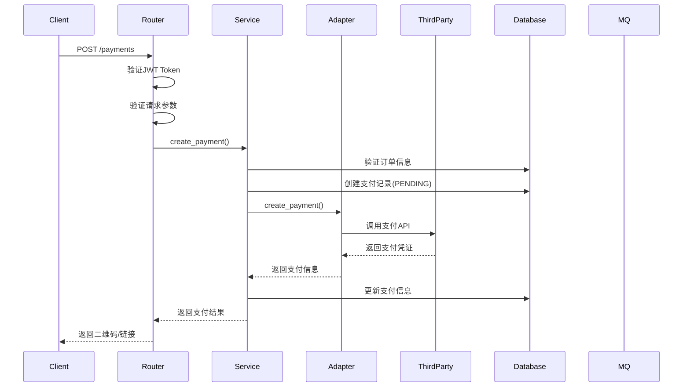
```mermaid
sequenceDiagram
    participant Client
    participant Router
    participant Service
    participant Adapter
    participant ThirdParty
    participant Database
    participant MQ
    
    Client->>Router: POST /payments
    Router->>Router: 验证JWT Token
    Router->>Router: 验证请求参数
    Router->>Service: create_payment()
    Service->>Database: 验证订单信息
    Service->>Database: 创建支付记录(PENDING)
    Service->>Adapter: create_payment()
    Adapter->>ThirdParty: 调用支付API
    ThirdParty-->>Adapter: 返回支付凭证
    Adapter-->>Service: 返回支付信息
    Service->>Database: 更新支付信息
    Service-->>Router: 返回支付结果
    Router-->>Client: 返回二维码/链接
```

#### 支付回调处理流程

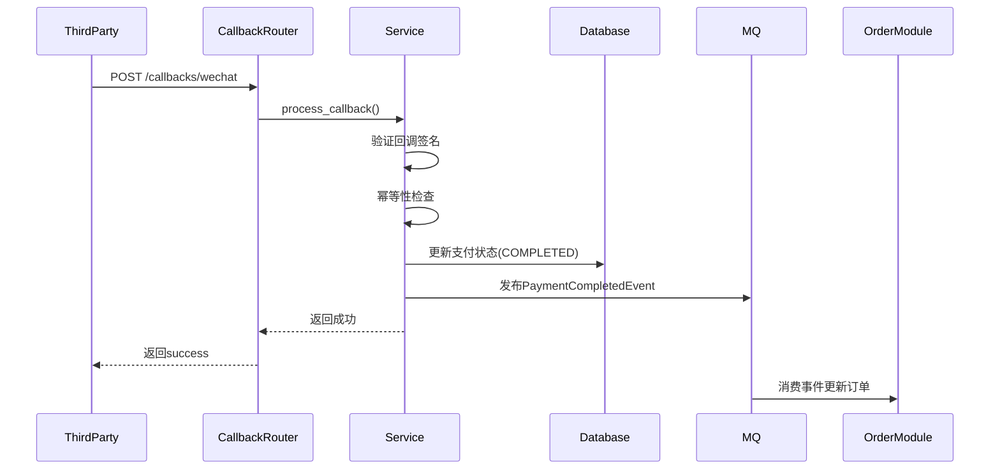
```mermaid
sequenceDiagram
    participant ThirdParty
    participant CallbackRouter
    participant Service
    participant Database
    participant MQ
    participant OrderModule
    
    ThirdParty->>CallbackRouter: POST /callbacks/wechat
    CallbackRouter->>Service: process_callback()
    Service->>Service: 验证回调签名
    Service->>Service: 幂等性检查
    Service->>Database: 更新支付状态(COMPLETED)
    Service->>MQ: 发布PaymentCompletedEvent
    Service-->>CallbackRouter: 返回成功
    CallbackRouter-->>ThirdParty: 返回success
    MQ->>OrderModule: 消费事件更新订单
```

### 2.5 与其他模块的集成

#### 依赖关系

| 被依赖模块 | 依赖原因 | 调用方式 | 数据流向 |
|-----------|---------|---------|---------|
| `user_auth` | 用户身份验证 | 同步API调用 | 获取用户信息 |
| `order_management` | 订单信息验证 | 同步API调用 | 获取订单金额 |

#### 提供服务

| 依赖方模块 | 使用场景 | 提供接口 | 数据流向 |
|-----------|---------|---------|---------|
| `order_management` | 订单支付 | POST /payments | 创建支付单 |
| `member_system` | 会员充值 | POST /payments | 创建充值支付 |

#### 事件发布

| 事件名称 | 触发时机 | 订阅方 | 事件数据 |
|---------|---------|--------|---------|
| `PaymentCreated` | 支付单创建 | - | payment_id, order_id, amount |
| `PaymentCompleted` | 支付成功 | order_management, member_system | payment_id, order_id, amount, paid_at |
| `PaymentFailed` | 支付失败 | order_management | payment_id, order_id, reason |
| `PaymentCancelled` | 支付取消 | order_management | payment_id, order_id |
| `RefundCompleted` | 退款完成 | order_management | refund_id, payment_id, amount |

### 2.6 技术栈

| 技术组件 | 版本 | 用途 |
|---------|------|------|
| FastAPI | 0.104.1 | Web框架 |
| SQLAlchemy | 2.0.23 | ORM框架 |
| Pydantic | 2.5.0 | 数据验证 |
| MySQL | 8.0 | 主数据库 |
| Redis | 7.0 | 缓存层 |
| Celery | 5.3.0 | 异步任务 |
| aiohttp | 3.9.0 | HTTP客户端 |

### 2.7 第三方服务集成

| 服务名 | 集成方式 | 用途 | 容错机制 |
|--------|----------|------|----------|
| 微信支付 | REST API | 主要支付渠道 | 自动重试 + 降级到支付宝 |
| 支付宝 | REST API | 备用支付渠道 | 自动重试 + 人工处理 |
| 银联支付 | REST API | 企业客户支付 | 自动重试 + 邮件告警 |

---

## 3. 数据模型

### 3.1 实体关系图（ER图）

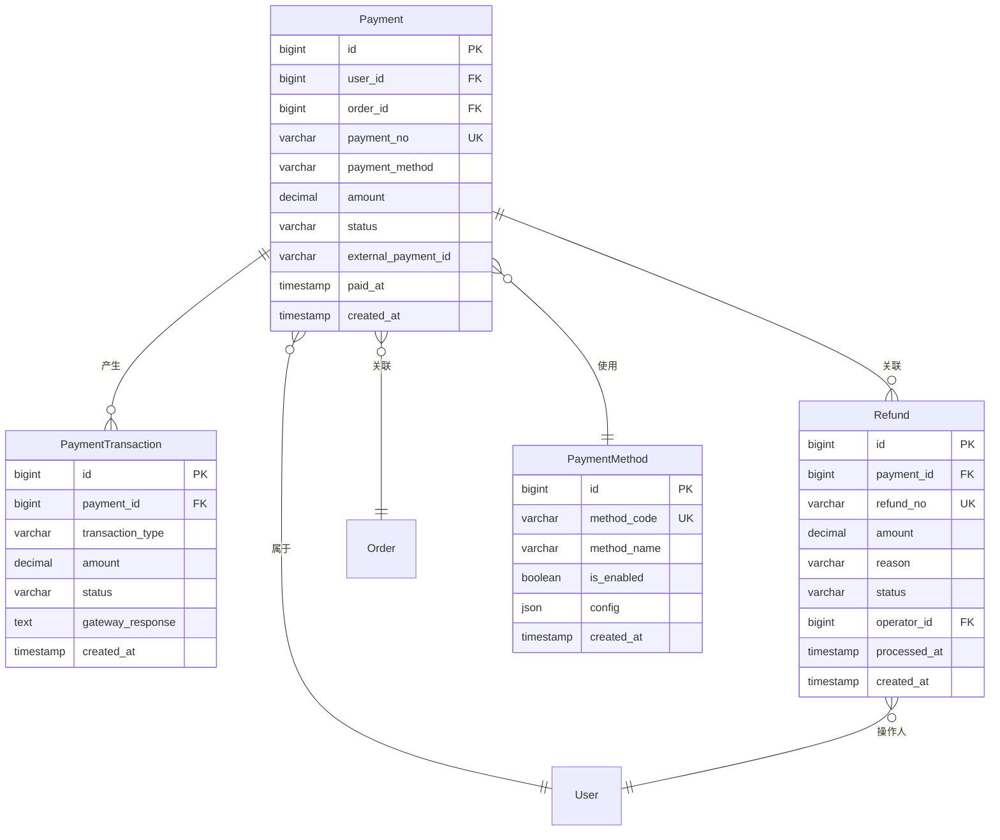
```mermaid
erDiagram
    Payment ||--o{ PaymentTransaction : "产生"
    Payment ||--o{ Refund : "关联"
    Payment }o--|| User : "属于"
    Payment }o--|| Order : "关联"
    Payment }o--|| PaymentMethod : "使用"
    Refund }o--|| User : "操作人"
    
    Payment {
        bigint id PK
        bigint user_id FK
        bigint order_id FK
        varchar payment_no UK
        varchar payment_method
        decimal amount
        varchar status
        varchar external_payment_id
        timestamp paid_at
        timestamp created_at
    }
    
    Refund {
        bigint id PK
        bigint payment_id FK
        varchar refund_no UK
        decimal amount
        varchar reason
        varchar status
        bigint operator_id FK
        timestamp processed_at
        timestamp created_at
    }
    
    PaymentTransaction {
        bigint id PK
        bigint payment_id FK
        varchar transaction_type
        decimal amount
        varchar status
        text gateway_response
        timestamp created_at
    }
    
    PaymentMethod {
        bigint id PK
        varchar method_code UK
        varchar method_name
        boolean is_enabled
        json config
        timestamp created_at
    }
```

### 3.2 核心数据模型

#### 3.2.1 支付单（Payment）

**SQLAlchemy模型定义**：
```python
from sqlalchemy import Column, BigInteger, String, Numeric, DateTime, Text, Index
from sqlalchemy.orm import relationship
from app.core.database import Base
from datetime import datetime
from decimal import Decimal

class Payment(Base):
    """支付单模型"""
    __tablename__ = "payment_payments"
    
    # 主键
    id = Column(BigInteger, primary_key=True, comment="主键ID")
    
    # 业务字段
    user_id = Column(BigInteger, nullable=False, index=True, comment="用户ID")
    order_id = Column(BigInteger, nullable=False, index=True, comment="订单ID")
    payment_no = Column(String(100), unique=True, nullable=False, comment="支付单号")
    payment_method = Column(String(50), nullable=False, comment="支付方式")
    amount = Column(Numeric(10, 2), nullable=False, comment="支付金额")
    currency = Column(String(3), default="CNY", comment="货币类型")
    status = Column(String(20), default="pending", index=True, comment="支付状态")
    
    # 第三方信息
    external_payment_id = Column(String(200), index=True, comment="第三方支付ID")
    external_transaction_id = Column(String(200), comment="第三方交易ID")
    pay_url = Column(String(1000), comment="支付链接")
    qr_code = Column(Text, comment="支付二维码")
    
    # 时间字段
    expires_at = Column(DateTime, comment="过期时间")
    paid_at = Column(DateTime, comment="支付完成时间")
    failed_at = Column(DateTime, comment="支付失败时间")
    callback_received_at = Column(DateTime, comment="回调接收时间")
    created_at = Column(DateTime, default=datetime.utcnow, comment="创建时间")
    updated_at = Column(DateTime, default=datetime.utcnow, onupdate=datetime.utcnow, comment="更新时间")
    
    # JSON字段
    callback_data = Column(Text, comment="回调数据")
    payment_data = Column(Text, comment="支付数据")
    description = Column(String(1000), comment="支付描述")
    
    # 关系
    transactions = relationship("PaymentTransaction", back_populates="payment", cascade="all, delete-orphan")
    refunds = relationship("Refund", back_populates="payment", cascade="all, delete-orphan")
    
    # 索引
    __table_args__ = (
        Index('idx_user_status_created', 'user_id', 'status', 'created_at'),
        Index('idx_order_payment', 'order_id', 'payment_method'),
        {'comment': '支付单表'}
    )
```

**字段说明**：

| 字段名 | 类型 | 约束 | 说明 | 业务规则 |
|--------|------|------|------|----------|
| `id` | BIGINT | PK | 主键ID | 自增 |
| `user_id` | BIGINT | NOT NULL, FK | 用户ID | 关联user_auth.users表 |
| `order_id` | BIGINT | NOT NULL, FK | 订单ID | 关联order_management.orders表 |
| `payment_no` | VARCHAR(100) | UNIQUE, NOT NULL | 支付单号 | PAY+时间戳+随机数，全局唯一 |
| `payment_method` | VARCHAR(50) | NOT NULL | 支付方式 | wechat/alipay/bankcard/balance/points/corporate/combined |
| `amount` | DECIMAL(10,2) | NOT NULL | 支付金额 | >0, <=100000 |
| `currency` | VARCHAR(3) | DEFAULT 'CNY' | 货币类型 | ISO 4217标准 |
| `status` | VARCHAR(20) | NOT NULL | 支付状态 | pending/processing/completed/failed/cancelled/refunding/refunded |
| `external_payment_id` | VARCHAR(200) | NULL | 第三方支付ID | 微信/支付宝返回的预支付ID |
| `pay_url` | VARCHAR(1000) | NULL | 支付链接 | H5支付链接 |
| `qr_code` | TEXT | NULL | 支付二维码 | Base64编码的二维码图片 |
| `expires_at` | TIMESTAMP | NULL | 过期时间 | 默认创建后30分钟 |
| `paid_at` | TIMESTAMP | NULL | 支付完成时间 | status=completed时记录 |

#### 3.2.2 退款单（Refund）

**SQLAlchemy模型定义**：
```python
class Refund(Base):
    """退款单模型"""
    __tablename__ = "payment_refunds"
    
    # 主键
    id = Column(BigInteger, primary_key=True, comment="主键ID")
    
    # 业务字段
    payment_id = Column(BigInteger, nullable=False, index=True, comment="支付单ID")
    refund_no = Column(String(100), unique=True, nullable=False, comment="退款单号")
    amount = Column(Numeric(10, 2), nullable=False, comment="退款金额")
    reason = Column(String(500), nullable=False, comment="退款原因")
    status = Column(String(20), default="pending", index=True, comment="退款状态")
    
    # 第三方信息
    external_refund_id = Column(String(200), index=True, comment="第三方退款ID")
    gateway_response = Column(Text, comment="网关响应")
    
    # 操作信息
    operator_id = Column(BigInteger, comment="操作人ID")
    operator_note = Column(Text, comment="操作备注")
    
    # 时间字段
    processed_at = Column(DateTime, comment="处理时间")
    created_at = Column(DateTime, default=datetime.utcnow, comment="创建时间")
    updated_at = Column(DateTime, default=datetime.utcnow, onupdate=datetime.utcnow, comment="更新时间")
    
    # 关系
    payment = relationship("Payment", back_populates="refunds")
    
    # 索引
    __table_args__ = (
        Index('idx_payment_status', 'payment_id', 'status'),
        {'comment': '退款单表'}
    )
```

**状态枚举**：
```python
from enum import Enum

class RefundStatus(str, Enum):
    """退款状态枚举"""
    PENDING = "pending"        # 待处理
    PROCESSING = "processing"  # 处理中
    COMPLETED = "completed"    # 已完成
    FAILED = "failed"          # 失败
    REJECTED = "rejected"      # 已拒绝
```

#### 3.2.3 支付流水（PaymentTransaction）

**SQLAlchemy模型定义**：
```python
class PaymentTransaction(Base):
    """支付交易流水模型"""
    __tablename__ = "payment_transactions"
    
    # 主键
    id = Column(BigInteger, primary_key=True, comment="主键ID")
    
    # 业务字段
    payment_id = Column(BigInteger, nullable=False, index=True, comment="支付单ID")
    transaction_no = Column(String(100), unique=True, nullable=False, comment="流水号")
    transaction_type = Column(String(50), nullable=False, comment="交易类型")
    amount = Column(Numeric(10, 2), nullable=False, comment="交易金额")
    balance_before = Column(Numeric(10, 2), comment="交易前余额")
    balance_after = Column(Numeric(10, 2), comment="交易后余额")
    status = Column(String(20), default="success", comment="交易状态")
    gateway_response = Column(Text, comment="网关响应")
    remark = Column(String(500), comment="备注")
    
    # 时间字段
    created_at = Column(DateTime, default=datetime.utcnow, index=True, comment="创建时间")
    
    # 关系
    payment = relationship("Payment", back_populates="transactions")
    
    # 索引
    __table_args__ = (
        Index('idx_payment_created', 'payment_id', 'created_at'),
        Index('idx_type_created', 'transaction_type', 'created_at'),
        {'comment': '支付交易流水表'}
    )
```

**交易类型枚举**：
```python
class TransactionType(str, Enum):
    """交易类型枚举"""
    PAYMENT = "payment"          # 支付
    REFUND = "refund"            # 退款
    CHARGE = "charge"            # 充值
    WITHDRAW = "withdraw"        # 提现
    TRANSFER_IN = "transfer_in"  # 转入
    TRANSFER_OUT = "transfer_out" # 转出
```

#### 3.2.4 支付方式配置（PaymentMethod）

**SQLAlchemy模型定义**：
```python
class PaymentMethod(Base):
    """支付方式配置模型"""
    __tablename__ = "payment_methods"
    
    # 主键
    id = Column(BigInteger, primary_key=True, comment="主键ID")
    
    # 业务字段
    method_code = Column(String(50), unique=True, nullable=False, comment="方式编码")
    method_name = Column(String(100), nullable=False, comment="方式名称")
    icon_url = Column(String(500), comment="图标URL")
    is_enabled = Column(Boolean, default=True, index=True, comment="是否启用")
    sort_order = Column(Integer, default=0, comment="排序")
    config = Column(Text, comment="配置信息JSON")
    
    # 时间字段
    created_at = Column(DateTime, default=datetime.utcnow, comment="创建时间")
    updated_at = Column(DateTime, default=datetime.utcnow, onupdate=datetime.utcnow, comment="更新时间")
    
    # 索引
    __table_args__ = (
        {'comment': '支付方式配置表'}
    )
```

#### 3.2.5 事件外发记录（PaymentEventOutbox）

**设计动机**：
- 确保回调成功后事件可靠存储，避免 MQ 短暂不可用导致状态丢失
- 提供审计追踪能力，支持失败重试与人工补偿

**SQLAlchemy模型定义**：
```python
class PaymentEventOutbox(Base):
    """支付模块事件外发表"""
    __tablename__ = "payment_event_outbox"

    id = Column(BigInteger, primary_key=True, comment="主键ID")
    payment_id = Column(BigInteger, nullable=False, index=True, comment="关联支付ID")
    event_type = Column(String(100), nullable=False, comment="事件类型")
    payload = Column(JSON, nullable=False, comment="事件负载")
    status = Column(String(20), default="pending", nullable=False, comment="发送状态")
    available_at = Column(DateTime, default=datetime.utcnow, index=True, comment="可发送时间")
    delivered_at = Column(DateTime, comment="实际发送时间")
    retry_count = Column(Integer, default=0, nullable=False, comment="重试次数")
    last_error = Column(Text, comment="最后一次错误信息")
    created_at = Column(DateTime, default=datetime.utcnow, comment="创建时间")
    updated_at = Column(DateTime, default=datetime.utcnow, onupdate=datetime.utcnow, comment="更新时间")

    __table_args__ = (
        Index('idx_status_available', 'status', 'available_at'),
        {'comment': '支付事件外发表'}
    )
```

### 3.3 数据库设计

#### 3.3.1 表结构SQL

**支付单表**：
```sql
CREATE TABLE payment_payments (
    id BIGINT AUTO_INCREMENT PRIMARY KEY COMMENT '主键ID',
    user_id BIGINT NOT NULL COMMENT '用户ID',
    order_id BIGINT NOT NULL COMMENT '订单ID',
    payment_no VARCHAR(100) NOT NULL UNIQUE COMMENT '支付单号',
    payment_method VARCHAR(50) NOT NULL COMMENT '支付方式',
    amount DECIMAL(10,2) NOT NULL COMMENT '支付金额',
    currency VARCHAR(3) DEFAULT 'CNY' COMMENT '货币类型',
    status VARCHAR(20) DEFAULT 'pending' COMMENT '支付状态',
    external_payment_id VARCHAR(200) COMMENT '第三方支付ID',
    external_transaction_id VARCHAR(200) COMMENT '第三方交易ID',
    pay_url VARCHAR(1000) COMMENT '支付链接',
    qr_code TEXT COMMENT '支付二维码',
    expires_at TIMESTAMP NULL COMMENT '过期时间',
    callback_received_at TIMESTAMP NULL COMMENT '回调接收时间',
    callback_data TEXT COMMENT '回调数据',
    payment_data TEXT COMMENT '支付数据',
    description VARCHAR(1000) COMMENT '支付描述',
    paid_at TIMESTAMP NULL COMMENT '支付完成时间',
    failed_at TIMESTAMP NULL COMMENT '支付失败时间',
    created_at TIMESTAMP DEFAULT CURRENT_TIMESTAMP COMMENT '创建时间',
    updated_at TIMESTAMP DEFAULT CURRENT_TIMESTAMP ON UPDATE CURRENT_TIMESTAMP COMMENT '更新时间',
    
    INDEX idx_user_id (user_id),
    INDEX idx_order_id (order_id),
    INDEX idx_status (status),
    INDEX idx_external_payment_id (external_payment_id),
    INDEX idx_user_status_created (user_id, status, created_at),
    INDEX idx_order_payment (order_id, payment_method),
    INDEX idx_created_at (created_at)
) ENGINE=InnoDB DEFAULT CHARSET=utf8mb4 COLLATE=utf8mb4_unicode_ci COMMENT='支付单表';
```

**退款单表**：
```sql
CREATE TABLE payment_refunds (
    id BIGINT AUTO_INCREMENT PRIMARY KEY COMMENT '主键ID',
    payment_id BIGINT NOT NULL COMMENT '支付单ID',
    refund_no VARCHAR(100) NOT NULL UNIQUE COMMENT '退款单号',
    amount DECIMAL(10,2) NOT NULL COMMENT '退款金额',
    reason VARCHAR(500) NOT NULL COMMENT '退款原因',
    status VARCHAR(20) DEFAULT 'pending' COMMENT '退款状态',
    external_refund_id VARCHAR(200) COMMENT '第三方退款ID',
    gateway_response TEXT COMMENT '网关响应',
    operator_id BIGINT COMMENT '操作人ID',
    operator_note TEXT COMMENT '操作备注',
    processed_at TIMESTAMP NULL COMMENT '处理时间',
    created_at TIMESTAMP DEFAULT CURRENT_TIMESTAMP COMMENT '创建时间',
    updated_at TIMESTAMP DEFAULT CURRENT_TIMESTAMP ON UPDATE CURRENT_TIMESTAMP COMMENT '更新时间',
    
    INDEX idx_payment_id (payment_id),
    INDEX idx_status (status),
    INDEX idx_external_refund_id (external_refund_id),
    INDEX idx_payment_status (payment_id, status),
    INDEX idx_created_at (created_at),
    
    FOREIGN KEY (payment_id) REFERENCES payment_payments(id) ON DELETE CASCADE
) ENGINE=InnoDB DEFAULT CHARSET=utf8mb4 COLLATE=utf8mb4_unicode_ci COMMENT='退款单表';
```

**支付流水表**：
```sql
CREATE TABLE payment_transactions (
    id BIGINT AUTO_INCREMENT PRIMARY KEY COMMENT '主键ID',
    payment_id BIGINT NOT NULL COMMENT '支付单ID',
    transaction_no VARCHAR(100) NOT NULL UNIQUE COMMENT '流水号',
    transaction_type VARCHAR(50) NOT NULL COMMENT '交易类型',
    amount DECIMAL(10,2) NOT NULL COMMENT '交易金额',
    balance_before DECIMAL(10,2) COMMENT '交易前余额',
    balance_after DECIMAL(10,2) COMMENT '交易后余额',
    status VARCHAR(20) DEFAULT 'success' COMMENT '交易状态',
    gateway_response TEXT COMMENT '网关响应',
    remark VARCHAR(500) COMMENT '备注',
    created_at TIMESTAMP DEFAULT CURRENT_TIMESTAMP COMMENT '创建时间',
    
    INDEX idx_payment_id (payment_id),
    INDEX idx_transaction_type (transaction_type),
    INDEX idx_created_at (created_at),
    INDEX idx_payment_created (payment_id, created_at),
    INDEX idx_type_created (transaction_type, created_at),
    
    FOREIGN KEY (payment_id) REFERENCES payment_payments(id) ON DELETE CASCADE
) ENGINE=InnoDB DEFAULT CHARSET=utf8mb4 COLLATE=utf8mb4_unicode_ci COMMENT='支付交易流水表';
```

**事件外发表**：
```sql
CREATE TABLE payment_event_outbox (
    id BIGINT AUTO_INCREMENT PRIMARY KEY COMMENT '主键ID',
    payment_id BIGINT NOT NULL COMMENT '关联支付ID',
    event_type VARCHAR(100) NOT NULL COMMENT '事件类型',
    payload JSON NOT NULL COMMENT '事件负载',
    status VARCHAR(20) NOT NULL DEFAULT 'pending' COMMENT '发送状态',
    available_at TIMESTAMP NOT NULL DEFAULT CURRENT_TIMESTAMP COMMENT '可发送时间',
    delivered_at TIMESTAMP NULL COMMENT '实际发送时间',
    retry_count INT NOT NULL DEFAULT 0 COMMENT '重试次数',
    last_error TEXT COMMENT '最后一次错误信息',
    created_at TIMESTAMP NOT NULL DEFAULT CURRENT_TIMESTAMP COMMENT '创建时间',
    updated_at TIMESTAMP NOT NULL DEFAULT CURRENT_TIMESTAMP ON UPDATE CURRENT_TIMESTAMP COMMENT '更新时间',

    INDEX idx_payment_id (payment_id),
    INDEX idx_status_available (status, available_at)
) ENGINE=InnoDB DEFAULT CHARSET=utf8mb4 COLLATE=utf8mb4_unicode_ci COMMENT='支付事件外发表';
```

#### 3.3.2 索引策略

| 表名 | 索引名 | 索引字段 | 索引类型 | 用途 | 预估选择性 |
|------|--------|----------|----------|------|-----------|
| payment_payments | idx_payment_no | payment_no | UNIQUE | 支付单号查询 | 100% |
| payment_payments | idx_user_status_created | user_id, status, created_at | BTREE | 用户支付列表查询 | 85% |
| payment_payments | idx_order_payment | order_id, payment_method | BTREE | 订单支付查询 | 90% |
| payment_payments | idx_external_payment_id | external_payment_id | BTREE | 第三方单号查询 | 95% |
| payment_refunds | idx_payment_status | payment_id, status | BTREE | 退款状态查询 | 80% |
| payment_transactions | idx_payment_created | payment_id, created_at | BTREE | 流水时间查询 | 75% |
| payment_event_outbox | idx_status_available | status, available_at | BTREE | 待发送事件扫描 | 70% |

#### 3.3.3 分表策略

**按时间分表**（针对交易流水表）：
```sql
-- 2025年1月流水表
CREATE TABLE payment_transactions_2025_01 LIKE payment_transactions;

-- 2025年2月流水表
CREATE TABLE payment_transactions_2025_02 LIKE payment_transactions;

-- 分表路由规则
def get_transaction_table(created_at: datetime) -> str:
    """根据创建时间获取分表名"""
    return f"payment_transactions_{created_at.year}_{created_at.month:02d}"
```

### 3.4 数据约束与验证

#### 3.4.1 业务规则约束

| 约束类型 | 约束规则 | 实现方式 | 错误处理 |
|---------|---------|---------|---------|
| 金额验证 | amount > 0 且 <= 100000 | Pydantic validator | 返回400错误 |
| 状态转换 | 只能按状态机转换 | Service层检查 | 返回409错误 |
| 退款金额 | refund_amount <= payment_amount | Service层检查 | 返回400错误 |
| 幂等性 | 相同payment_no不重复创建 | 数据库UNIQUE约束 | 返回已存在记录 |

#### 3.4.2 Pydantic验证模型

```python
from pydantic import BaseModel, Field, field_validator
from decimal import Decimal
from datetime import datetime
from typing import Optional

class PaymentCreate(BaseModel):
    """创建支付请求模型"""
    order_id: int = Field(..., gt=0, description="订单ID")
    payment_method: str = Field(..., description="支付方式")
    amount: Decimal = Field(..., gt=0, le=100000, decimal_places=2, description="支付金额")
    description: Optional[str] = Field(None, max_length=1000, description="支付描述")
    
    @field_validator('payment_method')
    def validate_payment_method(cls, v):
        allowed_methods = ['wechat', 'alipay', 'bankcard', 'balance', 'points', 'corporate', 'combined']
        if v not in allowed_methods:
            raise ValueError(f'支付方式必须是以下之一: {", ".join(allowed_methods)}')
        return v
    
    class Config:
        json_schema_extra = {
            "example": {
                "order_id": 12345,
                "payment_method": "wechat",
                "amount": "99.99",
                "description": "订单支付"
            }
        }
```

### 3.5 数据迁移与版本控制

**Alembic迁移脚本示例**：
```python
"""create payment tables

Revision ID: 001_create_payment_tables
Revises: 
Create Date: 2025-01-15 10:00:00

"""
from alembic import op
import sqlalchemy as sa

# revision identifiers
revision = '001_create_payment_tables'
down_revision = None
branch_labels = None
depends_on = None

def upgrade():
    # 创建支付单表
    op.create_table(
        'payment_payments',
        sa.Column('id', sa.BigInteger(), nullable=False),
        sa.Column('user_id', sa.BigInteger(), nullable=False),
        sa.Column('order_id', sa.BigInteger(), nullable=False),
        sa.Column('payment_no', sa.String(100), nullable=False),
        # ... 其他字段
        sa.PrimaryKeyConstraint('id'),
        sa.UniqueConstraint('payment_no'),
        mysql_engine='InnoDB',
        mysql_charset='utf8mb4'
    )
    
    # 创建索引
    op.create_index('idx_user_id', 'payment_payments', ['user_id'])
    op.create_index('idx_order_id', 'payment_payments', ['order_id'])
    # ... 其他索引

def downgrade():
    op.drop_table('payment_payments')
```

---

## 数据库设计（已合并至第3章）

该章节内容已重构并纳入第3章《数据模型》（3.2-3.5），包括表结构、索引策略、关系模型与迁移脚本，且统一为 MySQL 8.0 语法与约束。
---

## 5. 接口设计

### 5.1 RESTful API设计规范

**基础信息**：
- **基础路径**: `/api/v1/payment-service`
- **API版本**: v1（破坏性变更将发布 `/api/v2/payment-service`）
- **认证方式**: JWT Bearer Token
- **数据格式**: `application/json`
- **字符编码**: `UTF-8`

**通用响应格式**：

成功响应：
```json
{
    "success": true,
    "code": 200,
    "message": "success",
    "data": {
        // 业务数据
    },
    "metadata": {
        "request_id": "req_123",
        "timestamp": "2025-10-20T10:00:00Z"
    }
}
```

错误响应：
```json
{
    "success": false,
    "code": 400,
    "message": "请求参数错误",
    "error": {
        "error_code": "PAYMENT_001",
        "error_message": "支付金额不匹配",
        "details": {
            "order_amount": "100.00",
            "payment_amount": "99.99"
        }
    },
    "metadata": {
        "request_id": "req_123",
        "timestamp": "2025-10-20T10:00:00Z"
    }
}
```

### 5.2 API端点列表

#### 5.2.1 支付管理接口

| 序号 | 方法 | 路径 | 功能描述 | 权限要求 | 限流 |
|------|------|------|----------|----------|------|
| 1 | POST | `/api/v1/payment-service/payments` | 创建支付订单 | 登录用户 | 100次/分钟 |
| 2 | GET | `/api/v1/payment-service/payments/{id}` | 查询支付详情 | 所有者/管理员 | 200次/分钟 |
| 3 | GET | `/api/v1/payment-service/payments` | 支付列表查询 | 登录用户 | 100次/分钟 |
| 4 | PUT | `/api/v1/payment-service/payments/{id}/cancel` | 取消支付 | 所有者/管理员 | 50次/分钟 |
| 5 | POST | `/api/v1/payment-service/payments/{id}/query` | 查询支付状态 | 所有者/管理员 | 500次/分钟 |

#### 5.2.2 退款管理接口

| 序号 | 方法 | 路径 | 功能描述 | 权限要求 | 限流 |
|------|------|------|----------|----------|------|
| 6 | POST | `/api/v1/payment-service/refunds` | 申请退款 | 支付所有者 | 30次/分钟 |
| 7 | GET | `/api/v1/payment-service/refunds/{id}` | 查询退款详情 | 所有者/管理员 | 200次/分钟 |
| 8 | GET | `/api/v1/payment-service/refunds` | 退款列表查询 | 登录用户 | 100次/分钟 |
| 9 | PUT | `/api/v1/payment-service/refunds/{id}/approve` | 审批退款 | 管理员 | 50次/分钟 |
| 10 | PUT | `/api/v1/payment-service/refunds/{id}/reject` | 拒绝退款 | 管理员 | 50次/分钟 |

#### 5.2.3 回调接口

| 序号 | 方法 | 路径 | 功能描述 | 权限要求 | 限流 |
|------|------|------|----------|----------|------|
| 11 | POST | `/api/v1/payment-service/callbacks/wechat` | 微信支付回调 | 签名验证 | 无限制 |
| 12 | POST | `/api/v1/payment-service/callbacks/alipay` | 支付宝回调 | 签名验证 | 无限制 |
| 13 | POST | `/api/v1/payment-service/callbacks/bankcard` | 银行卡回调 | 签名验证 | 无限制 |

#### 5.2.4 查询统计接口

| 序号 | 方法 | 路径 | 功能描述 | 权限要求 | 限流 |
|------|------|------|----------|----------|------|
| 14 | GET | `/api/v1/payment-service/statistics/daily` | 日支付统计 | 管理员 | 10次/分钟 |
| 15 | GET | `/api/v1/payment-service/statistics/methods` | 支付方式分布 | 管理员 | 10次/分钟 |
| 16 | GET | `/api/v1/payment-service/transactions` | 交易流水查询 | 所有者/管理员 | 100次/分钟 |

### 5.3 详细接口规范

#### 5.3.1 创建支付订单

**接口定义**：
```
POST /api/v1/payment-service/payments
```

**请求头**：
```
Authorization: Bearer {jwt_token}
Content-Type: application/json
```

**请求体**：
```json
{
    "order_id": 12345,
    "payment_method": "wechat",
    "amount": "99.99",
    "description": "订单支付",
    "client_ip": "192.168.1.100",
    "notify_url": "https://example.com/notify",
    "return_url": "https://example.com/return"
}
```

**请求参数说明**：

| 参数名 | 类型 | 必填 | 说明 | 示例值 | 验证规则 |
|--------|------|------|------|--------|----------|
| order_id | integer | 是 | 订单ID | 12345 | >0 |
| payment_method | string | 是 | 支付方式 | wechat | 枚举值：wechat/alipay/bankcard/balance/points/corporate/combined |
| amount | string | 是 | 支付金额 | "99.99" | >0, <=100000, 2位小数 |
| description | string | 否 | 支付描述 | "订单支付" | <=1000字符 |
| client_ip | string | 否 | 客户端IP | "192.168.1.100" | IPv4格式 |
| notify_url | string | 否 | 异步通知URL | "https://..." | HTTPS URL |
| return_url | string | 否 | 同步返回URL | "https://..." | HTTPS URL |

**响应示例**：

成功响应（201 Created）：
```json
{
    "success": true,
    "code": 200,
    "message": "success",
    "data": {
        "payment_id": 67890,
        "payment_no": "PAY20250115123456789012",
    "order_id": 12345,
    "amount": "99.99",
    "currency": "CNY",
        "payment_method": "wechat",
        "status": "pending",
        "qr_code": "weixin://wxpay/bizpayurl?pr=abcdefg",
        "qr_code_image": "data:image/png;base64,iVBORw0KGgo...",
        "pay_url": "https://wx.tenpay.com/cgi-bin/mmpayweb-bin/...",
        "expires_at": "2025-01-15T13:00:00Z",
        "created_at": "2025-01-15T12:30:00Z"
    },
    "metadata": {
        "request_id": "req_20250115123000",
        "timestamp": "2025-01-15T12:30:01Z"
    }
}
```

**错误响应**：

参数错误（400 Bad Request）：
```json
{
    "success": false,
    "code": 400,
    "message": "请求参数错误",
    "error": {
        "error_code": "PAYMENT_001",
        "error_message": "支付金额必须大于0且小于等于100000",
        "details": {
            "amount": "支付金额不合法"
        }
    },
    "metadata": {
        "request_id": "req_20250115123000",
        "timestamp": "2025-01-15T12:30:01Z"
    }
}
```

订单不存在（404 Not Found）：
```json
{
    "success": false,
    "code": 404,
    "message": "订单不存在",
    "error": {
        "error_code": "PAYMENT_002",
        "error_message": "订单ID不存在或已删除",
        "details": {
            "order_id": 12345
        }
    },
    "metadata": {
        "request_id": "req_20250115123000",
        "timestamp": "2025-01-15T12:30:01Z"
    }
}
```

订单状态异常（409 Conflict）：
```json
{
    "success": false,
    "code": 409,
    "message": "订单状态异常",
    "error": {
        "error_code": "PAYMENT_003",
        "error_message": "订单已支付，无法再次创建支付",
        "details": {
            "order_id": 12345,
            "order_status": "paid"
        }
    },
    "metadata": {
        "request_id": "req_20250115123000",
        "timestamp": "2025-01-15T12:30:01Z"
    }
}
```

#### 5.3.2 查询支付详情

**接口定义**：
```
GET /api/v1/payment-service/payments/{id}
```

**路径参数**：
- `id` (integer): 支付单ID

**请求头**：
```
Authorization: Bearer {jwt_token}
```

**响应示例**：

成功响应（200 OK）：
```json
{
    "success": true,
    "code": 200,
    "message": "success",
    "data": {
        "id": 67890,
        "payment_no": "PAY20250115123456789012",
        "order_id": 12345,
        "user_id": 1001,
        "amount": "99.99",
        "currency": "CNY",
        "payment_method": "wechat",
        "status": "completed",
        "external_payment_id": "4200001234567890123456789012",
        "external_transaction_id": "1234567890",
        "paid_at": "2025-01-15T12:35:00Z",
        "created_at": "2025-01-15T12:30:00Z",
        "updated_at": "2025-01-15T12:35:00Z",
        "description": "订单支付",
        "refunds": [
            {
                "id": 101,
                "refund_no": "REF20250116100000000001",
                "amount": "50.00",
                "reason": "商品退货",
                "status": "completed",
                "created_at": "2025-01-16T10:00:00Z"
            }
        ]
    },
    "metadata": {
        "request_id": "req_20250115123500",
        "timestamp": "2025-01-15T12:35:00Z"
    }
}
```

#### 5.3.3 申请退款

**接口定义**：
```
POST /api/v1/payment-service/refunds
```

**请求头**：
```
Authorization: Bearer {jwt_token}
Content-Type: application/json
```

**请求体**：
```json
{
    "payment_id": 67890,
    "amount": "50.00",
    "reason": "商品质量问题，申请退款",
    "refund_account": "original"
}
```

**请求参数说明**：

| 参数名 | 类型 | 必填 | 说明 | 示例值 | 验证规则 |
|--------|------|------|------|--------|----------|
| payment_id | integer | 是 | 支付单ID | 67890 | 必须存在且状态为completed |
| amount | string | 是 | 退款金额 | "50.00" | >0, <=支付金额-已退金额 |
| reason | string | 是 | 退款原因 | "商品质量问题" | >=10字符, <=500字符 |
| refund_account | string | 否 | 退款账户 | "original" | 枚举值：original(原路退回)/balance(退到余额) |

**响应示例**：

成功响应（201 Created）：
```json
{
    "success": true,
    "code": 201,
    "message": "退款申请成功",
    "data": {
        "id": 101,
        "refund_no": "REF20250116100000000001",
        "payment_id": 67890,
        "amount": "50.00",
        "reason": "商品质量问题，申请退款",
        "status": "processing",
        "created_at": "2025-01-16T10:00:00Z",
        "estimated_arrival": "2025-01-18T10:00:00Z"
    },
    "metadata": {
        "request_id": "req_20250116100000",
        "timestamp": "2025-01-16T10:00:01Z"
    }
}
```

#### 5.3.4 微信支付回调

**接口定义**：
```
POST /api/v1/payment-service/callbacks/wechat
```

**请求头**：
```
Content-Type: application/json
Wechatpay-Signature: {signature}
Wechatpay-Timestamp: {timestamp}
Wechatpay-Nonce: {nonce}
Wechatpay-Serial: {serial}
```

**请求体**（加密）：
```json
{
    "id": "EV-2025011512345678901234567890",
    "create_time": "2025-01-15T12:35:00+08:00",
    "resource_type": "encrypt-resource",
    "event_type": "TRANSACTION.SUCCESS",
    "summary": "支付成功",
    "resource": {
        "algorithm": "AEAD_AES_256_GCM",
        "ciphertext": "...",
        "nonce": "...",
        "associated_data": "transaction"
    }
}
```

**解密后数据**：
```json
{
    "appid": "wx1234567890abcdef",
    "mchid": "1234567890",
    "out_trade_no": "PAY20250115123456789012",
    "transaction_id": "4200001234567890123456789012",
    "trade_type": "NATIVE",
    "trade_state": "SUCCESS",
    "trade_state_desc": "支付成功",
    "bank_type": "CMC",
    "success_time": "2025-01-15T12:35:00+08:00",
    "payer": {
        "openid": "oUpF8uMuAJO_M2pxb1Q9zNjWeS6o"
    },
    "amount": {
        "total": 9999,
        "payer_total": 9999,
        "currency": "CNY",
        "payer_currency": "CNY"
    }
}
```

**响应示例**：

成功响应（200 OK）：
```json
{
    "code": "SUCCESS",
    "message": "成功"
}
```

失败响应（400 Bad Request）：
```json
{
    "code": "FAIL",
    "message": "签名验证失败"
}
```

### 5.4 Pydantic Schema定义

#### 5.4.1 支付相关Schema

```python
from pydantic import BaseModel, Field, field_validator
from decimal import Decimal
from datetime import datetime
from typing import Optional, List
from enum import Enum

class PaymentMethodEnum(str, Enum):
    """支付方式枚举"""
    WECHAT = "wechat"
    ALIPAY = "alipay"
    BANKCARD = "bankcard"
    BALANCE = "balance"
    POINTS = "points"
    CORPORATE = "corporate"
    COMBINED = "combined"

class PaymentStatusEnum(str, Enum):
    """支付状态枚举"""
    PENDING = "pending"
    PROCESSING = "processing"
    COMPLETED = "completed"
    FAILED = "failed"
    CANCELLED = "cancelled"
    REFUNDING = "refunding"
    REFUNDED = "refunded"

class PaymentCreate(BaseModel):
    """创建支付请求Schema"""
    order_id: int = Field(..., gt=0, description="订单ID")
    payment_method: PaymentMethodEnum = Field(..., description="支付方式")
    amount: Decimal = Field(..., gt=0, le=100000, decimal_places=2, description="支付金额")
    description: Optional[str] = Field(None, max_length=1000, description="支付描述")
    client_ip: Optional[str] = Field(None, description="客户端IP")
    notify_url: Optional[str] = Field(None, description="异步通知URL")
    return_url: Optional[str] = Field(None, description="同步返回URL")
    
    @field_validator('amount')
    def validate_amount(cls, v):
        """验证金额格式"""
        if v.as_tuple().exponent < -2:
            raise ValueError('金额最多支持2位小数')
        return v
    
    class Config:
        json_schema_extra = {
            "example": {
                "order_id": 12345,
                "payment_method": "wechat",
                "amount": "99.99",
                "description": "订单支付"
            }
        }

class PaymentRead(BaseModel):
    """支付信息响应Schema"""
    id: int
    payment_no: str
    order_id: int
    user_id: int
    amount: Decimal
    currency: str
    payment_method: str
    status: PaymentStatusEnum
    qr_code: Optional[str] = None
    pay_url: Optional[str] = None
    paid_at: Optional[datetime] = None
    created_at: datetime
    updated_at: datetime
    
    class Config:
        from_attributes = True

class PaymentDetail(PaymentRead):
    """支付详情响应Schema（包含关联数据）"""
    description: Optional[str] = None
    external_payment_id: Optional[str] = None
    external_transaction_id: Optional[str] = None
    refunds: List['RefundRead'] = []
    
    class Config:
        from_attributes = True
```

#### 5.4.2 退款相关Schema

```python
class RefundCreate(BaseModel):
    """创建退款请求Schema"""
    payment_id: int = Field(..., gt=0, description="支付单ID")
    amount: Decimal = Field(..., gt=0, decimal_places=2, description="退款金额")
    reason: str = Field(..., min_length=10, max_length=500, description="退款原因")
    refund_account: Optional[str] = Field("original", description="退款账户")
    
    @field_validator('refund_account')
    def validate_refund_account(cls, v):
        """验证退款账户"""
        allowed = ['original', 'balance']
        if v not in allowed:
            raise ValueError(f'退款账户必须是以下之一: {", ".join(allowed)}')
        return v
    
    class Config:
        json_schema_extra = {
            "example": {
                "payment_id": 67890,
                "amount": "50.00",
                "reason": "商品质量问题，申请退款",
                "refund_account": "original"
            }
        }

class RefundRead(BaseModel):
    """退款信息响应Schema"""
    id: int
    refund_no: str
    payment_id: int
    amount: Decimal
    reason: str
    status: str
    processed_at: Optional[datetime] = None
    created_at: datetime
    
    class Config:
        from_attributes = True
```

### 5.5 错误码设计

#### 5.5.1 错误码分类

| 错误码前缀 | 分类 | 说明 |
|-----------|------|------|
| PAYMENT_0xx | 支付参数错误 | 001-099 |
| PAYMENT_1xx | 支付业务错误 | 100-199 |
| PAYMENT_2xx | 退款相关错误 | 200-299 |
| PAYMENT_3xx | 回调相关错误 | 300-399 |
| PAYMENT_4xx | 第三方错误 | 400-499 |
| PAYMENT_5xx | 系统错误 | 500-599 |

#### 5.5.2 详细错误码表

| 错误码 | 错误消息 | HTTP状态码 | 说明 | 解决方案 |
|--------|---------|-----------|------|----------|
| PAYMENT_001 | 支付金额格式错误 | 400 | 金额不合法 | 检查金额格式 |
| PAYMENT_002 | 订单不存在 | 404 | 订单ID无效 | 检查订单ID |
| PAYMENT_003 | 订单已支付 | 409 | 订单状态异常 | 查询订单状态 |
| PAYMENT_004 | 支付方式不支持 | 400 | 支付方式无效 | 使用支持的支付方式 |
| PAYMENT_005 | 支付金额不匹配 | 400 | 金额与订单不符 | 检查订单金额 |
| PAYMENT_101 | 支付单不存在 | 404 | 支付单ID无效 | 检查支付单ID |
| PAYMENT_102 | 支付已过期 | 410 | 超过支付时限 | 重新创建支付 |
| PAYMENT_103 | 支付状态异常 | 409 | 状态不允许操作 | 查询支付状态 |
| PAYMENT_201 | 退款金额超限 | 400 | 退款金额过大 | 检查可退金额 |
| PAYMENT_202 | 退款已存在 | 409 | 重复退款申请 | 查询退款状态 |
| PAYMENT_203 | 退款期限已过 | 410 | 超过退款期限 | 联系客服 |
| PAYMENT_301 | 回调签名错误 | 401 | 签名验证失败 | 检查签名算法 |
| PAYMENT_302 | 回调数据格式错误 | 400 | 数据解析失败 | 检查数据格式 |
| PAYMENT_401 | 第三方支付失败 | 502 | 第三方接口异常 | 稍后重试 |
| PAYMENT_402 | 第三方超时 | 504 | 请求超时 | 重试或查询状态 |
| PAYMENT_501 | 系统内部错误 | 500 | 服务器异常 | 联系技术支持 |

#### 5.5.3 错误响应工具类

```python
from fastapi import HTTPException
from typing import Optional, Dict

class PaymentException(HTTPException):
    """支付异常基类"""
    def __init__(
        self,
        error_code: str,
        error_message: str,
        status_code: int = 400,
        details: Optional[Dict] = None
    ):
        self.error_code = error_code
        self.error_message = error_message
        self.details = details or {}
        
        super().__init__(
            status_code=status_code,
            detail={
                "error_code": error_code,
                "error_message": error_message,
                "details": self.details
            }
        )

# 具体异常类
class PaymentAmountError(PaymentException):
    """支付金额错误"""
    def __init__(self, details: Optional[Dict] = None):
        super().__init__(
            error_code="PAYMENT_001",
            error_message="支付金额格式错误",
            status_code=400,
            details=details
        )

class OrderNotFoundError(PaymentException):
    """订单不存在"""
    def __init__(self, order_id: int):
        super().__init__(
            error_code="PAYMENT_002",
            error_message="订单不存在",
            status_code=404,
            details={"order_id": order_id}
        )

class OrderAlreadyPaidError(PaymentException):
    """订单已支付"""
    def __init__(self, order_id: int, order_status: str):
        super().__init__(
            error_code="PAYMENT_003",
            error_message="订单已支付，无法再次创建支付",
            status_code=409,
            details={"order_id": order_id, "order_status": order_status}
        )
```

### 5.6 认证与授权

#### 5.6.1 JWT Token结构

```json
{
    "header": {
        "alg": "HS256",
        "typ": "JWT"
    },
    "payload": {
        "user_id": 1001,
        "username": "zhang_san",
        "roles": ["user", "member"],
        "permissions": ["payment:create", "payment:query", "refund:create"],
        "exp": 1705334400,
        "iat": 1705330800
    },
    "signature": "..."
}
```

#### 5.6.2 权限验证依赖

```python
from fastapi import Depends, HTTPException, status
from fastapi.security import HTTPBearer, HTTPAuthorizationCredentials
from jose import JWTError, jwt
from typing import Optional

security = HTTPBearer()

async def get_current_user(
    credentials: HTTPAuthorizationCredentials = Depends(security)
) -> dict:
    """获取当前用户信息"""
    token = credentials.credentials
    try:
        payload = jwt.decode(token, settings.SECRET_KEY, algorithms=["HS256"])
        user_id: int = payload.get("user_id")
        if user_id is None:
            raise HTTPException(
                status_code=status.HTTP_401_UNAUTHORIZED,
                detail="无效的认证凭据"
            )
        return payload
    except JWTError:
        raise HTTPException(
            status_code=status.HTTP_401_UNAUTHORIZED,
            detail="无效的认证凭据"
        )

async def verify_payment_owner(
    payment_id: int,
    current_user: dict = Depends(get_current_user),
    db: AsyncSession = Depends(get_db)
) -> Payment:
    """验证支付单所有权"""
    payment = await db.get(Payment, payment_id)
    if not payment:
        raise PaymentNotFoundException(payment_id)
    
    # 检查是否是所有者或管理员
    if payment.user_id != current_user["user_id"] and "admin" not in current_user.get("roles", []):
        raise HTTPException(
            status_code=status.HTTP_403_FORBIDDEN,
            detail="无权访问此支付单"
        )
    
    return payment
```

---

## 附录D. API设计（历史草案，已迁移至第5章）

### API架构
- **基础路径**: `/payment-service/`
- **认证方式**: JWT Bearer Token  
- **数据格式**: JSON
- **错误处理**: 统一错误响应格式
- **版本控制**: URL路径版本控制

### 端点设计
| 方法 | 路径 | 功能 | 权限要求 | 响应格式 |
|------|------|------|----------|----------|
| POST | /payment-service/payments | 创建支付单 | 登录用户 | PaymentRead |
| GET | /payment-service/payments/{id} | 查询支付详情 | 所有者/管理员 | PaymentDetail |
| GET | /payment-service/payments | 支付列表查询 | 登录用户 | List[PaymentRead] |
| PUT | /payment-service/payments/{id}/cancel | 取消支付 | 所有者/管理员 | PaymentRead |
| POST | /payment-service/refunds | 申请退款 | 支付所有者 | RefundRead |
| GET | /payment-service/refunds | 退款列表 | 登录用户 | List[RefundRead] |
| PUT | /payment-service/refunds/{id}/approve | 审批退款 | 管理员 | RefundRead |
| POST | /payment-service/callbacks/{method} | 支付回调 | 无需认证 | 成功状态 |

### 错误处理设计
```json
{
    "error": {
        "code": "PAYMENT_ERROR_001", 
        "message": "支付金额不匹配",
        "details": {
            "order_amount": "100.00",
            "payment_amount": "99.99"
        }
    }
}
```

### 响应数据格式
```json
{
    "id": 123,
    "payment_no": "PAY202509161234567890",
    "order_id": 456,
    "amount": "100.00",
    "currency": "CNY", 
    "payment_method": "wechat",
    "status": "completed",
    "qr_code": "data:image/png;base64,iVBORw0KGgoAAAA...",
    "created_at": "2025-09-16T10:30:00Z"
}
```

---

## 4. 业务流程

### 4.1 支付创建流程

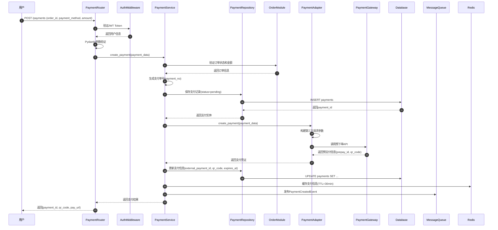
```mermaid
sequenceDiagram
    autonumber
    participant U as 用户
    participant API as PaymentRouter
    participant Auth as AuthMiddleware
    participant Service as PaymentService
    participant Repo as PaymentRepository
    participant Order as OrderModule
    participant Adapter as PaymentAdapter
    participant Gateway as PaymentGateway
    participant DB as Database
    participant MQ as MessageQueue
    participant Cache as Redis
    
    U->>API: POST /payments (order_id, payment_method, amount)
    API->>Auth: 验证JWT Token
    Auth-->>API: 返回用户信息
    API->>API: Pydantic参数验证
    API->>Service: create_payment(payment_data)
    
    Service->>Order: 验证订单状态和金额
    Order-->>Service: 返回订单信息
    
    Service->>Service: 生成支付单号(payment_no)
    Service->>Repo: 保存支付记录(status=pending)
    Repo->>DB: INSERT payments
    DB-->>Repo: 返回payment_id
    Repo-->>Service: 返回支付实体
    
    Service->>Adapter: create_payment(payment_data)
    Adapter->>Adapter: 构建第三方请求参数
    Adapter->>Gateway: 调用预下单API
    Gateway-->>Adapter: 返回预支付信息(prepay_id, qr_code)
    Adapter-->>Service: 返回支付凭证
    
    Service->>Repo: 更新支付信息(external_payment_id, qr_code, expires_at)
    Repo->>DB: UPDATE payments SET ...
    Service->>Cache: 缓存支付信息(TTL=30min)
    Service->>MQ: 发布PaymentCreatedEvent
    Service-->>API: 返回支付结果
    API-->>U: 返回{payment_id, qr_code, pay_url}
```

**流程说明**：

1. **请求验证**（步骤1-4）：
   - 用户提交支付请求
   - JWT Token验证身份
   - Pydantic验证参数格式

2. **订单验证**（步骤5-6）：
   - 验证订单存在性
   - 验证订单状态（必须是待支付）
   - 验证订单金额与请求金额一致

3. **支付单创建**（步骤7-9）：
    - 生成唯一支付单号：`PAY{timestamp}{random}`
    - 通过 `PaymentRepository` 持久化支付记录，初始状态为 pending
    - 仓储返回带主键的支付实体，记录关联订单和用户信息

4. **第三方预下单**（步骤10-14）：
   - 调用适配器层统一接口
   - 适配器转换为第三方格式
   - 请求第三方支付平台预下单
   - 获取预支付ID和支付凭证

5. **信息更新与返回**（步骤15-18）：
    - 仓储层更新支付记录的第三方信息
   - 缓存支付信息用于快速查询
   - 发布PaymentCreatedEvent事件
   - 返回支付凭证给用户

### 4.2 支付回调处理流程

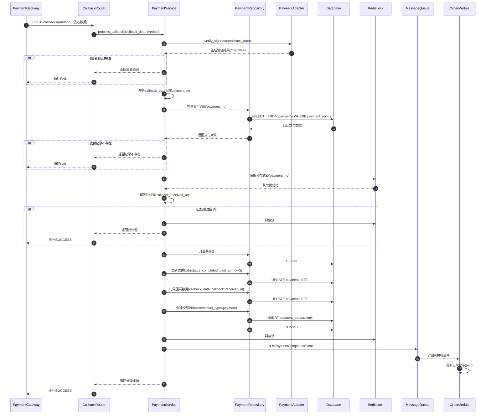
```mermaid
sequenceDiagram
    autonumber
    participant Gateway as PaymentGateway
    participant API as CallbackRouter
    participant Service as PaymentService
    participant Repo as PaymentRepository
    participant Adapter as PaymentAdapter
    participant DB as Database
    participant Lock as RedisLock
    participant MQ as MessageQueue
    participant Order as OrderModule
    
    Gateway->>API: POST /callbacks/{method} (签名数据)
    API->>Service: process_callback(callback_data, method)
    
    Service->>Adapter: verify_signature(callback_data)
    Adapter-->>Service: 签名验证结果(true/false)
    alt 签名验证失败
        Service-->>API: 返回签名错误
        API-->>Gateway: 返回FAIL
    end
    
    Service->>Service: 解析callback_data提取payment_no
    Service->>Repo: 查询支付记录(payment_no)
    Repo->>DB: SELECT * FROM payments WHERE payment_no = ?
    DB-->>Repo: 返回支付数据
    Repo-->>Service: 返回支付对象
    
    alt 支付记录不存在
        Service-->>API: 返回记录不存在
        API-->>Gateway: 返回FAIL
    end
    
    Service->>Lock: 获取分布式锁(payment_no)
    Lock-->>Service: 获取锁成功
    
    Service->>Service: 幂等性检查(callback_received_at)
    alt 已处理过回调
        Service->>Lock: 释放锁
        Service-->>API: 返回已处理
        API-->>Gateway: 返回SUCCESS
    end
    
    Service->>Repo: 开启事务()
    Repo->>DB: BEGIN
    Service->>Repo: 更新支付状态(status=completed, paid_at=now())
    Repo->>DB: UPDATE payments SET ...
    Service->>Repo: 记录回调数据(callback_data, callback_received_at)
    Repo->>DB: UPDATE payments SET ...
    Service->>Repo: 创建交易流水(transaction_type=payment)
    Repo->>DB: INSERT payment_transactions ...
    Repo->>DB: COMMIT
    
    Service->>Lock: 释放锁
    
    Service->>MQ: 发布PaymentCompletedEvent
    MQ->>Order: 订阅者接收事件
    Order->>Order: 更新订单状态(paid)
    
    Service-->>API: 返回处理成功
    API-->>Gateway: 返回SUCCESS
```

**关键要点**：

1. **安全验证**（步骤3-7）：
   - 验证回调签名防止伪造
   - 签名验证失败直接返回FAIL

2. **幂等性保证**（步骤12-17）：
    - 使用分布式锁防止并发
    - 仓储层检查 `callback_received_at` 是否已存在
    - 已处理的回调直接返回SUCCESS

3. **事务处理**（步骤18-22）：
    - 由仓储层统一管理事务边界，确保原子性
    - 更新支付状态与关键时间戳
    - 写入原始回调数据用于审计
    - 记录交易流水支持对账

4. **异步解耦**（步骤24-27）：
   - 通过消息队列发布事件
   - 订单模块异步更新状态
   - 避免同步调用导致超时

#### 4.2.1 仓储交互明细

| 阶段 | 仓储接口 | 核心入参 | 持久化表 | 说明 |
|------|----------|----------|----------|------|
| 查询支付记录 | `get_by_payment_no(payment_no, for_update=True)` | 支付单号 | `payment_payments` | 以行级锁读取支付实体，防止并发回调写冲突 |
| 幂等校验 | `ensure_callback_idempotent(payment)` | 支付实体 | `payment_payments` | 在事务中检查 `callback_received_at`，若为空则写入当前时间并返回 `True` |
| 状态更新 | `mark_callback_processed(...)` | 回调原文、第三方凭证、支付完成时间 | `payment_payments` | 写入 `status=completed`、`paid_at`、`callback_data` 等字段，确保状态原子变更 |
| 流水记录 | `append_transaction(payment_id, transaction)` | 流水号、金额、类型 | `payment_transactions` | 生成 `payment` 类型流水，用于账务对账 |
| 事件存储 | `enqueue_event(event)` | 事件类型、payload | `payment_event_outbox` | 将 `PaymentCompleted` 事件落入 Outbox，保证事件与状态更新同事务 |

> 执行顺序：Service 在开启事务后依次调用上述接口，只有全部成功才提交事务；若任一环节失败，事务回滚并释放锁，第三方仍收到 FAIL 响应。

#### 4.2.2 事件出站流程（Outbox → MQ）

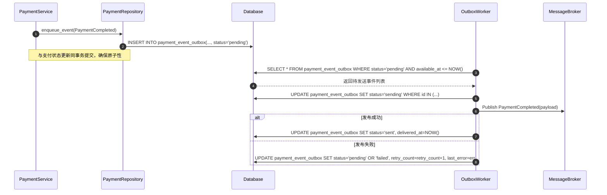
```mermaid
sequenceDiagram
    autonumber
    participant Service as PaymentService
    participant Repo as PaymentRepository
    participant DB as Database
    participant Outbox as OutboxWorker
    participant MQ as MessageBroker

    Service->>Repo: enqueue_event(PaymentCompleted)
    Repo->>DB: INSERT INTO payment_event_outbox(..., status='pending')
    Note over Service,Repo: 与支付状态更新同事务提交，确保原子性

    Outbox->>DB: SELECT * FROM payment_event_outbox WHERE status='pending' AND available_at <= NOW()
    DB-->>Outbox: 返回待发送事件列表
    Outbox->>DB: UPDATE payment_event_outbox SET status='sending' WHERE id IN (...)
    Outbox->>MQ: Publish PaymentCompleted(payload)
    alt 发布成功
        Outbox->>DB: UPDATE payment_event_outbox SET status='sent', delivered_at=NOW()
    else 发布失败
        Outbox->>DB: UPDATE payment_event_outbox SET status='pending' OR 'failed', retry_count=retry_count+1, last_error=err
    end
```

**执行策略**：
- OutboxWorker 由 Celery/定时任务每 1~5 秒扫描一次，单批处理量默认 100 条，可通过配置项调整。
- 超过 5 次失败的事件写入告警并暂停自动重试，转人工处理；人工补偿可通过将 `status` 置回 `pending`。
- 支持多租户/多通道扩展：如需区分渠道，可在 payload 内附带 `channel`，消费者按需路由。
- 代码实现位于 `app/modules/payment_service/tasks/outbox_worker.py`，使用 `fetch_pending_outbox`、`mark_outbox_sending`、`mark_outbox_sent`、`mark_outbox_retry` 对事件生命周期进行统一管理。

### 4.3 退款处理流程

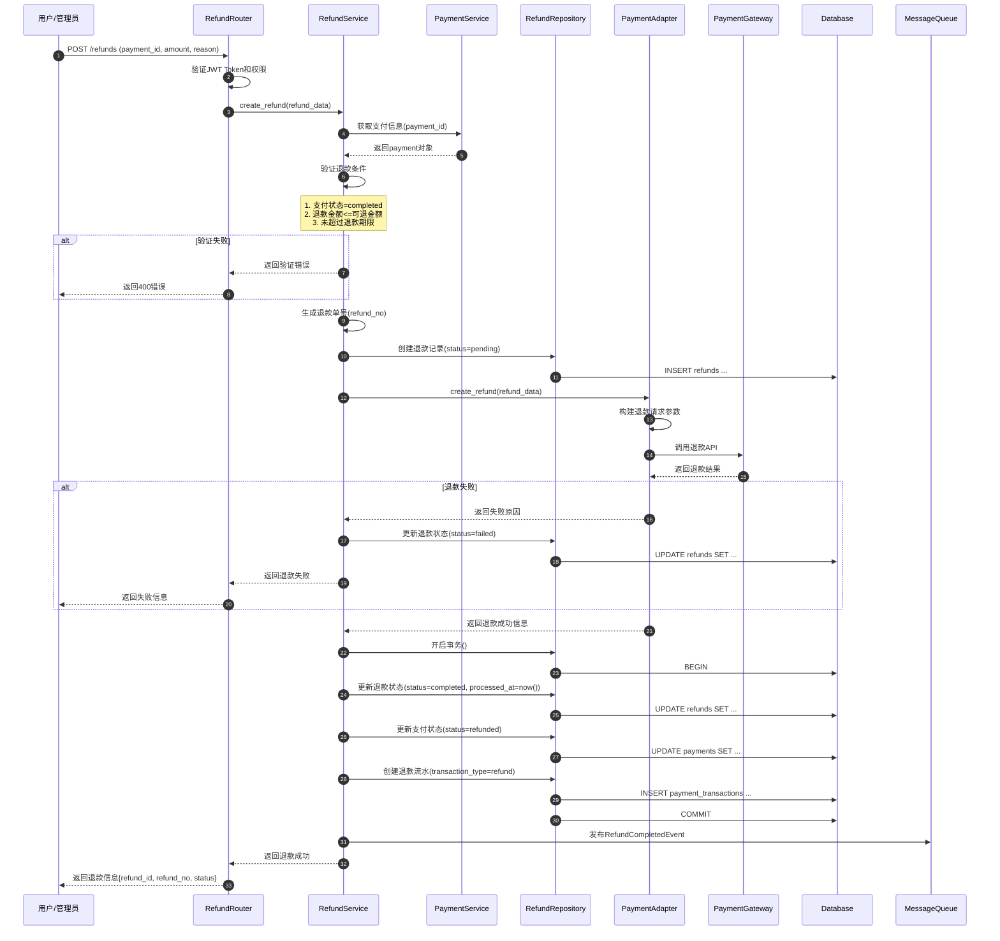
```mermaid
sequenceDiagram
    autonumber
    participant U as 用户/管理员
    participant API as RefundRouter
    participant Service as RefundService
    participant PaymentService as PaymentService
    participant Repo as RefundRepository
    participant Adapter as PaymentAdapter
    participant Gateway as PaymentGateway
    participant DB as Database
    participant MQ as MessageQueue
    
    U->>API: POST /refunds (payment_id, amount, reason)
    API->>API: 验证JWT Token和权限
    API->>Service: create_refund(refund_data)
    
    Service->>PaymentService: 获取支付信息(payment_id)
    PaymentService-->>Service: 返回payment对象
    
    Service->>Service: 验证退款条件
    Note over Service: 1. 支付状态=completed<br/>2. 退款金额<=可退金额<br/>3. 未超过退款期限
    
    alt 验证失败
        Service-->>API: 返回验证错误
        API-->>U: 返回400错误
    end
    
    Service->>Service: 生成退款单号(refund_no)
    Service->>Repo: 创建退款记录(status=pending)
    Repo->>DB: INSERT refunds ...
    
    Service->>Adapter: create_refund(refund_data)
    Adapter->>Adapter: 构建退款请求参数
    Adapter->>Gateway: 调用退款API
    Gateway-->>Adapter: 返回退款结果
    
    alt 退款失败
        Adapter-->>Service: 返回失败原因
    Service->>Repo: 更新退款状态(status=failed)
    Repo->>DB: UPDATE refunds SET ...
        Service-->>API: 返回退款失败
        API-->>U: 返回失败信息
    end
    
    Adapter-->>Service: 返回退款成功信息
    Service->>Repo: 开启事务()
    Repo->>DB: BEGIN
    Service->>Repo: 更新退款状态(status=completed, processed_at=now())
    Repo->>DB: UPDATE refunds SET ...
    Service->>Repo: 更新支付状态(status=refunded)
    Repo->>DB: UPDATE payments SET ...
    Service->>Repo: 创建退款流水(transaction_type=refund)
    Repo->>DB: INSERT payment_transactions ...
    Repo->>DB: COMMIT
    
    Service->>MQ: 发布RefundCompletedEvent
    Service-->>API: 返回退款成功
    API-->>U: 返回退款信息{refund_id, refund_no, status}
```

**退款验证规则**：

| 验证项 | 验证规则 | 错误代码 | 错误消息 |
|--------|---------|---------|---------|
| 支付状态 | payment.status == 'completed' | REFUND_001 | 支付未完成，无法退款 |
| 退款金额 | refund_amount <= payment.amount - refunded_amount | REFUND_002 | 退款金额超过可退金额 |
| 退款期限 | payment.paid_at >= now() - 180天 | REFUND_003 | 已超过退款期限 |
| 重复退款 | 检查是否存在processing状态的退款 | REFUND_004 | 存在处理中的退款申请 |

### 4.4 支付状态机

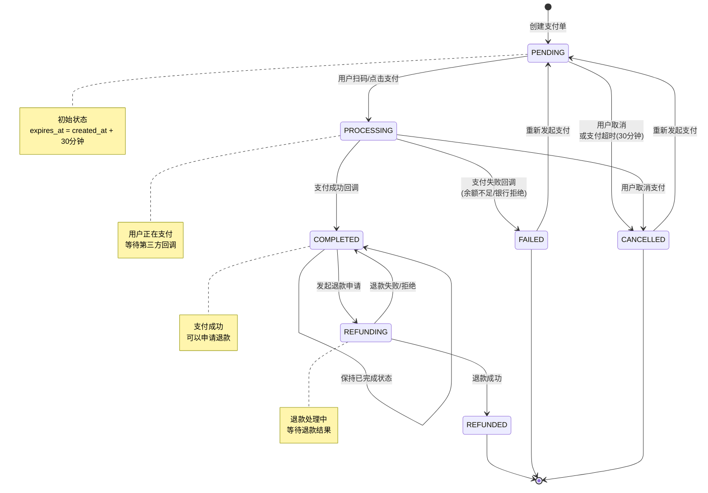
```mermaid
stateDiagram-v2
    [*] --> PENDING: 创建支付单
    
    PENDING --> PROCESSING: 用户扫码/点击支付
    PENDING --> CANCELLED: 用户取消<br/>或支付超时(30分钟)
    
    PROCESSING --> COMPLETED: 支付成功回调
    PROCESSING --> FAILED: 支付失败回调<br/>(余额不足/银行拒绝)
    PROCESSING --> CANCELLED: 用户取消支付
    
    COMPLETED --> REFUNDING: 发起退款申请
    COMPLETED --> COMPLETED: 保持已完成状态
    
    REFUNDING --> REFUNDED: 退款成功
    REFUNDING --> COMPLETED: 退款失败/拒绝
    
    FAILED --> PENDING: 重新发起支付
    CANCELLED --> PENDING: 重新发起支付
    
    REFUNDED --> [*]
    FAILED --> [*]
    CANCELLED --> [*]
    
    note right of PENDING
        初始状态
        expires_at = created_at + 30分钟
    end note
    
    note right of PROCESSING
        用户正在支付
        等待第三方回调
    end note
    
    note right of COMPLETED
        支付成功
        可以申请退款
    end note
    
    note right of REFUNDING
        退款处理中
        等待退款结果
    end note
```

**状态转换规则**：

```python
from enum import Enum
from typing import Dict, Set

class PaymentStatus(str, Enum):
    """支付状态枚举"""
    PENDING = "pending"          # 待支付
    PROCESSING = "processing"    # 支付中
    COMPLETED = "completed"      # 已完成
    FAILED = "failed"            # 失败
    CANCELLED = "cancelled"      # 已取消
    REFUNDING = "refunding"      # 退款中
    REFUNDED = "refunded"        # 已退款

# 状态转换映射表
STATUS_TRANSITIONS: Dict[PaymentStatus, Set[PaymentStatus]] = {
    PaymentStatus.PENDING: {
        PaymentStatus.PROCESSING,
        PaymentStatus.CANCELLED
    },
    PaymentStatus.PROCESSING: {
        PaymentStatus.COMPLETED,
        PaymentStatus.FAILED,
        PaymentStatus.CANCELLED
    },
    PaymentStatus.COMPLETED: {
        PaymentStatus.REFUNDING
    },
    PaymentStatus.REFUNDING: {
        PaymentStatus.REFUNDED,
        PaymentStatus.COMPLETED
    },
    PaymentStatus.FAILED: {
        PaymentStatus.PENDING
    },
    PaymentStatus.CANCELLED: {
        PaymentStatus.PENDING
    }
}

def can_transition_to(current_status: PaymentStatus, new_status: PaymentStatus) -> bool:
    """检查状态转换是否合法"""
    allowed_statuses = STATUS_TRANSITIONS.get(current_status, set())
    return new_status in allowed_statuses
```

### 4.5 支付超时处理流程

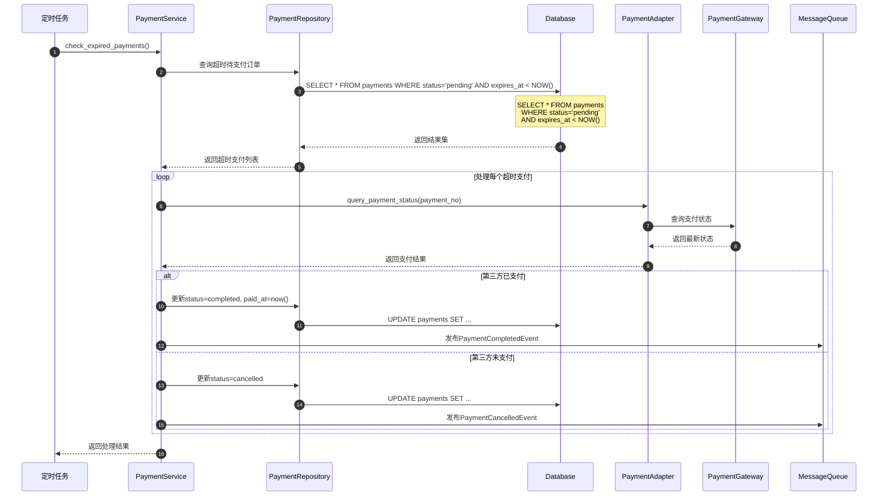
```mermaid
sequenceDiagram
    autonumber
    participant Scheduler as 定时任务
    participant Service as PaymentService
    participant Repo as PaymentRepository
    participant DB as Database
    participant Adapter as PaymentAdapter
    participant Gateway as PaymentGateway
    participant MQ as MessageQueue
    
    Scheduler->>Service: check_expired_payments()
    Service->>Repo: 查询超时待支付订单
    Repo->>DB: SELECT * FROM payments WHERE status='pending' AND expires_at < NOW()
    Note over DB: SELECT * FROM payments<br/>WHERE status='pending'<br/>AND expires_at < NOW()
    
    DB-->>Repo: 返回结果集
    Repo-->>Service: 返回超时支付列表
    
    loop 处理每个超时支付
    Service->>Adapter: query_payment_status(payment_no)
        Adapter->>Gateway: 查询支付状态
        Gateway-->>Adapter: 返回最新状态
        Adapter-->>Service: 返回支付结果
        
        alt 第三方已支付
            Service->>Repo: 更新status=completed, paid_at=now()
            Repo->>DB: UPDATE payments SET ...
            Service->>MQ: 发布PaymentCompletedEvent
        else 第三方未支付
            Service->>Repo: 更新status=cancelled
            Repo->>DB: UPDATE payments SET ...
            Service->>MQ: 发布PaymentCancelledEvent
        end
    end
    
    Service-->>Scheduler: 返回处理结果
```

**定时任务配置**：

```python
from celery import Celery
from celery.schedules import crontab

app = Celery('payment_service')

@app.task
def check_expired_payments():
    """检查超时支付订单 - 每5分钟执行一次"""
    # 查询超时订单并处理
    pass

app.conf.beat_schedule = {
    'check-expired-payments': {
        'task': 'payment_service.tasks.check_expired_payments',
        'schedule': crontab(minute='*/5'),  # 每5分钟
    },
}
```

### 4.6 组合支付流程

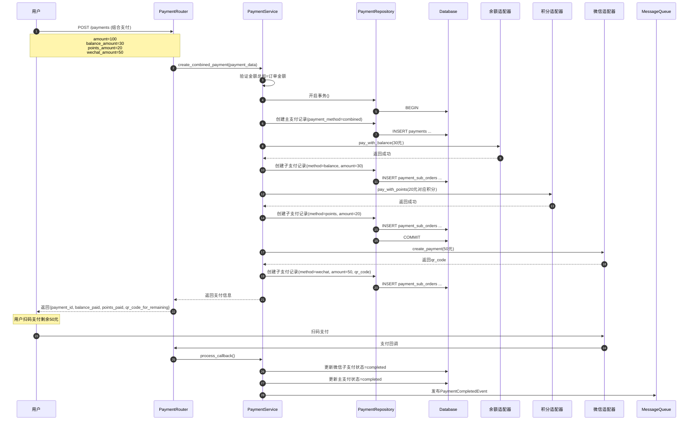
```mermaid
sequenceDiagram
    autonumber
    participant U as 用户
    participant API as PaymentRouter
    participant Service as PaymentService
    participant Repo as PaymentRepository
    participant DB as Database
    participant BalanceAdapter as 余额适配器
    participant PointsAdapter as 积分适配器
    participant WechatAdapter as 微信适配器
    participant MQ as MessageQueue
    
    U->>API: POST /payments (组合支付)
    Note over U,API: amount=100<br/>balance_amount=30<br/>points_amount=20<br/>wechat_amount=50
    
    API->>Service: create_combined_payment(payment_data)
    Service->>Service: 验证金额总和=订单金额
    
    Service->>Repo: 开启事务()
    Repo->>DB: BEGIN
    Service->>Repo: 创建主支付记录(payment_method=combined)
    Repo->>DB: INSERT payments ...
    
    Service->>BalanceAdapter: pay_with_balance(30元)
    BalanceAdapter-->>Service: 返回成功
    Service->>Repo: 创建子支付记录(method=balance, amount=30)
    Repo->>DB: INSERT payment_sub_orders ...
    
    Service->>PointsAdapter: pay_with_points(20元对应积分)
    PointsAdapter-->>Service: 返回成功
    Service->>Repo: 创建子支付记录(method=points, amount=20)
    Repo->>DB: INSERT payment_sub_orders ...
    
    Repo->>DB: COMMIT
    
    Service->>WechatAdapter: create_payment(50元)
    WechatAdapter-->>Service: 返回qr_code
    Service->>Repo: 创建子支付记录(method=wechat, amount=50, qr_code)
    Repo->>DB: INSERT payment_sub_orders ...
    
    Service-->>API: 返回支付信息
    API-->>U: 返回{payment_id, balance_paid, points_paid, qr_code_for_remaining}
    
    Note over U: 用户扫码支付剩余50元
    
    U->>WechatAdapter: 扫码支付
    WechatAdapter->>API: 支付回调
    API->>Service: process_callback()
    Service->>DB: 更新微信子支付状态=completed
    Service->>DB: 更新主支付状态=completed
    Service->>MQ: 发布PaymentCompletedEvent
```

**组合支付验证规则**：

```python
from decimal import Decimal
from pydantic import BaseModel, field_validator

class CombinedPaymentCreate(BaseModel):
    """组合支付请求模型"""
    order_id: int
    total_amount: Decimal
    balance_amount: Decimal = Decimal('0')
    points_amount: Decimal = Decimal('0')
    third_party_method: str  # wechat/alipay
    third_party_amount: Decimal
    
    @field_validator('total_amount')
    def validate_total(cls, v, values):
        """验证金额总和"""
        balance = values.get('balance_amount', Decimal('0'))
        points = values.get('points_amount', Decimal('0'))
        third_party = values.get('third_party_amount', Decimal('0'))
        
        if balance + points + third_party != v:
            raise ValueError('子支付金额之和必须等于总金额')
        return v
    
    @field_validator('balance_amount', 'points_amount', 'third_party_amount')
    def validate_positive(cls, v):
        """验证金额为正"""
        if v < 0:
            raise ValueError('支付金额不能为负数')
        return v
```

---

## 附录C. 业务逻辑设计（历史草案，已迁移至第4章）

### 支付创建流程
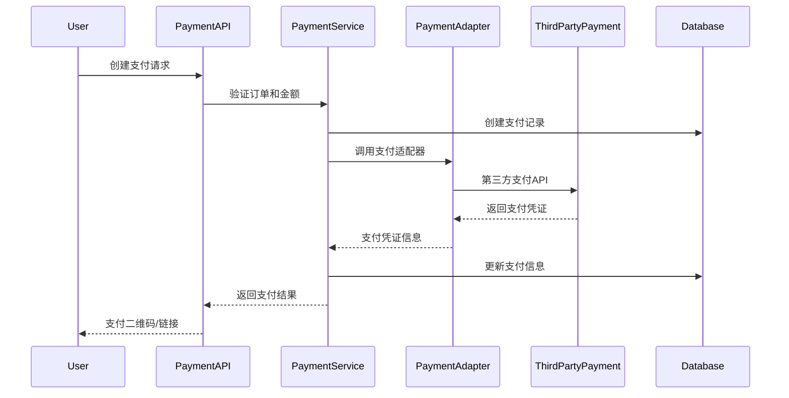
```mermaid
sequenceDiagram
    participant U as User
    participant API as PaymentAPI
    participant S as PaymentService  
    participant A as PaymentAdapter
    participant TP as ThirdPartyPayment
    participant DB as Database
    
    U->>API: 创建支付请求
    API->>S: 验证订单和金额
    S->>DB: 创建支付记录
    S->>A: 调用支付适配器
    A->>TP: 第三方支付API
    TP-->>A: 返回支付凭证
    A-->>S: 支付凭证信息
    S->>DB: 更新支付信息
    S-->>API: 返回支付结果
    API-->>U: 支付二维码/链接
```

### 支付回调处理流程
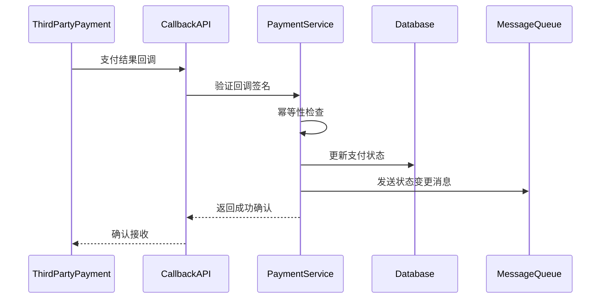
```mermaid
sequenceDiagram
    participant TP as ThirdPartyPayment
    participant CB as CallbackAPI
    participant S as PaymentService
    participant DB as Database
    participant MQ as MessageQueue
    
    TP->>CB: 支付结果回调
    CB->>S: 验证回调签名
    S->>S: 幂等性检查
    S->>DB: 更新支付状态
    S->>MQ: 发送状态变更消息
    S-->>CB: 返回成功确认
    CB-->>TP: 确认接收
```

### 支付状态机设计
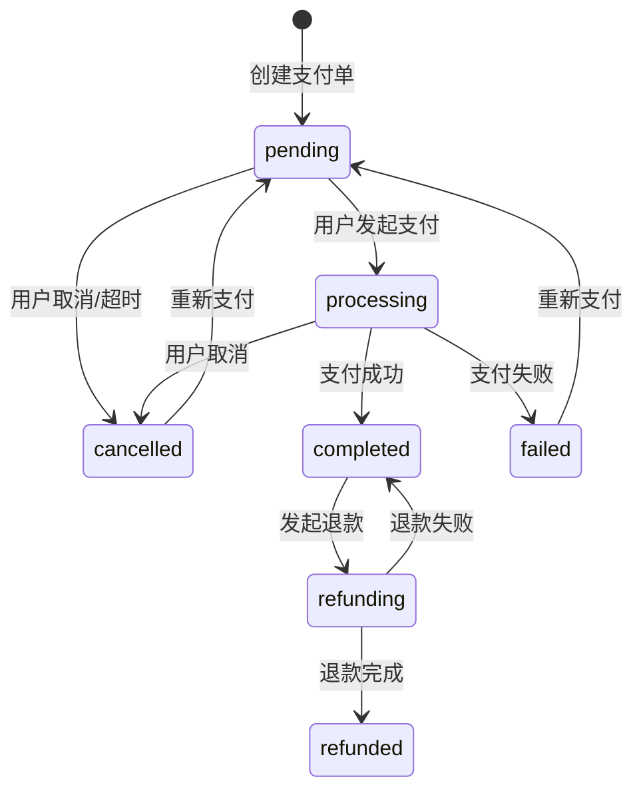
```mermaid
stateDiagram-v2
    [*] --> pending: 创建支付单
    pending --> processing: 用户发起支付
    pending --> cancelled: 用户取消/超时
    processing --> completed: 支付成功
    processing --> failed: 支付失败
    processing --> cancelled: 用户取消
    completed --> refunding: 发起退款
    refunding --> refunded: 退款完成
    refunding --> completed: 退款失败
    failed --> pending: 重新支付
    cancelled --> pending: 重新支付
```

## 6. 安全考虑

### 6.1 认证与授权策略
- **身份认证**: JWT Token验证，包含用户ID和权限信息
- **权限控制**: RBAC模型，支付操作需验证数据所有权
- **API签名**: 第三方回调使用数字签名验证来源合法性
- **数据隔离**: 用户只能查看自己的支付数据

### 6.2 数据安全措施  
```python
# 敏感数据加密存储
class PaymentSecurityMixin:
    def encrypt_sensitive_data(self, data):
        """加密敏感支付数据"""
        return AES.encrypt(data, settings.PAYMENT_ENCRYPT_KEY)
    
    def decrypt_sensitive_data(self, encrypted_data):
        """解密敏感支付数据"""  
        return AES.decrypt(encrypted_data, settings.PAYMENT_ENCRYPT_KEY)
```

### 6.3 风控策略设计
| 风控维度 | 检查规则 | 触发阈值 | 处理措施 |
|----------|----------|----------|----------|
| 金额异常 | 单笔支付金额 | >5万元 | 人工审核 |
| 频次异常 | 同用户支付频率 | 1分钟>10笔 | 暂时锁定 |
| 设备异常 | 异地登录支付 | 地理位置跨度>1000km | 短信验证 |
| 行为异常 | 支付失败率 | 24小时>50% | 风控标记 |

### 6.4 回调安全与幂等
- 回调签名校验：严格按照各支付渠道签名算法校验（时间戳+随机数+签名串），拒绝重放
- 幂等保障：回调处理加分布式锁（payment_no维度）+ 回调时间戳字段，用于二次进入快速返回
- 最小权限：回调接口仅开放必要路径，拒绝除白名单IP外的访问（可选）

### 6.5 机密管理与审计
- 机密管理：密钥、证书、API密钥统一保存在密钥管理服务或环境变量，避免硬编码
- 审计日志：记录关键操作（创建支付、回调处理、退款）并写入独立审计通道，保留≥180天
- 数据留痕：保留回调原文与签名校验结果，用于纠纷核查

## 7. 性能考量

### 7.1 缓存策略
```python
# Redis缓存设计
CACHE_KEYS = {
    'payment_detail': 'payment:{payment_id}',     # 支付详情缓存，TTL=1小时
    'user_payments': 'user_payments:{user_id}',   # 用户支付列表，TTL=30分钟  
    'payment_stats': 'payment_stats:{date}',      # 支付统计数据，TTL=24小时
}
```

### 7.2 数据库优化
- **读写分离**: 查询操作使用只读从库，写操作使用主库
- **分库分表**: 按时间维度分表，payment_2025_09, payment_2025_10
- **索引优化**: 基于查询模式建立复合索引
- **连接池**: 使用连接池避免频繁建立数据库连接

### 7.3 并发与异步处理
```python  
# 异步处理设计
@asyncio.coroutine
async def process_payment_callback(callback_data):
    """异步处理支付回调"""
    # 1. 快速响应第三方
    # 2. 异步处理业务逻辑
    # 3. 消息队列解耦
    pass
```

## 附录A. 集成设计（扩展）

### 模块依赖
- **用户认证模块**: 提供用户身份验证和权限检查
- **订单管理模块**: 获取订单信息，验证订单状态和金额
- **库存管理模块**: 支付成功后触发库存扣减
- **通知服务模块**: 发送支付成功/失败通知

### 第三方服务集成
| 服务名 | 集成方式 | 用途 | 容错机制 |
|--------|----------|------|----------|
| 微信支付 | REST API | 主要支付渠道 | 自动重试+降级到支付宝 |
| 支付宝 | REST API | 备用支付渠道 | 自动重试+人工处理 |
| 银联支付 | REST API | 企业客户支付 | 自动重试+邮件告警 |

### 事件设计
- **发布事件**: 
  - PaymentCreated: 支付单创建事件
  - PaymentCompleted: 支付成功事件  
  - PaymentFailed: 支付失败事件
  - RefundCompleted: 退款完成事件
- **订阅事件**: 
  - OrderStatusChanged: 订单状态变更事件
  - UserRegistered: 用户注册事件

## 8. 变更影响

### 8.1 兼容性影响
- API 兼容：新增字段一律向后兼容（可选字段），删除或变更字段需版本提升（/v1 -> /v2）
- 行为变更：支付状态机新增中间态需同步更新订阅方解释文档

### 8.2 数据库迁移
- 表新增/字段新增：通过 Alembic 生成迁移脚本，灰度发布（先写后读）
- 字段变更/索引调整：双写/回填策略，完成回填后切换读路径
- 回滚预案：保留旧索引与旧字段直至稳定窗口结束

### 8.3 跨模块影响
- 订单模块：依赖 PaymentCompleted/Cancelled/RefundCompleted 事件，需验证事件契约未破坏
- 会员模块：余额/积分支付引入后，需验证积分扣减与退款的补偿流程
- 通知模块：新增/变更通知模板需在灰度期间双发（新旧模板并行）

### 8.4 风险与缓解
- 第三方网关变更导致失败率波动 → 启用多通道自动降级与重试，及时切换备用通道
- 回调风暴导致处理堆积 → 增加回调队列分区与消费者扩容，限流保护入口
- 迁移脚本误操作 → 所有 DDL 上线前在影子库全量回放验证并备份

### 8.5 上线与回滚
- 上线步骤：先发代码（Feature Flag 关闭）→ 执行迁移 → 开启灰度流量 → 观察指标 → 全量放开
- 回滚策略：关闭 Feature Flag → 回滚版本 → 还原迁移（仅可逆变更）→ 校验核心业务

---

## 附录B. 监控设计

### 系统监控
- **性能指标**: 支付成功率、响应时间、并发数、错误率
- **业务指标**: 日支付金额、支付方式分布、退款率
- **告警规则**: 支付成功率<99%、响应时间>5秒、错误率>1%

### 日志设计
```python
# 支付操作审计日志
{
    "timestamp": "2025-09-16T10:30:00Z",
    "operation": "create_payment", 
    "user_id": 12345,
    "order_id": 67890,
    "payment_id": 111,
    "amount": "100.00",
    "payment_method": "wechat",
    "ip_address": "192.168.1.100",
    "user_agent": "Mozilla/5.0...",
    "result": "success"
}
```

## 附录E. 测试设计

### 单元测试
- **服务层测试**: 业务逻辑正确性验证
- **数据层测试**: 数据持久化和查询测试
- **工具函数测试**: 支付号生成、金额计算等

### 集成测试  
- **API接口测试**: 端到端接口功能测试
- **第三方集成测试**: 支付渠道集成测试(沙箱环境)
- **数据库集成测试**: 事务一致性和并发测试

### 性能测试
- **负载测试**: 1000并发支付请求测试
- **压力测试**: 系统极限承载能力测试
- **稳定性测试**: 长时间运行稳定性验证

## 附录F. 部署设计

### 环境配置
- **开发环境**: 本地开发，使用支付沙箱
- **测试环境**: 功能测试，模拟真实支付流程
- **生产环境**: 正式环境，使用生产支付接口

### 配置管理
```python
# 支付配置
PAYMENT_CONFIG = {
    'wechat': {
        'app_id': os.getenv('WECHAT_APP_ID'),
        'mch_id': os.getenv('WECHAT_MCH_ID'), 
        'api_key': os.getenv('WECHAT_API_KEY'),
        'notify_url': f"{BASE_URL}/payment-service/callbacks/wechat"
    },
    'timeout': 30,  # 接口超时时间
    'retry_times': 3,  # 重试次数
}
```

## 变更记录

| 日期 | 版本 | 变更内容 | 变更人 |
|------|------|----------|--------|
| 2025-10-20 | v1.0.0 | 按A8标准重构设计文档，补充2-8章 | GitHub Copilot |

<!-- FRONTEND_RULES -->
```yaml
payment_service:
  api_prefix: "/api/v1/payment-service"
  auth_required: true
  endpoints:
    create_payment:
      method: "POST"
      path: "/payments"
      request_schema: "PaymentCreateRequest"
      response_schema: "PaymentInitResponse"
      permissions: ["user"]
    get_payment_detail:
      method: "GET"
      path: "/payments/{payment_no}"
      response_schema: "PaymentDetailResponse"
      permissions: ["user", "admin"]
    cancel_payment:
      method: "POST"
      path: "/payments/{payment_no}/cancel"
      response_schema: "PaymentDetailResponse"
      permissions: ["user"]
      allowed_only_if_status: ["pending", "processing"]
    create_refund:
      method: "POST"
      path: "/refunds"
      request_schema: "RefundCreateRequest"
      response_schema: "RefundDetailResponse"
      permissions: ["user"]
    get_refund_detail:
      method: "GET"
      path: "/refunds/{refund_no}"
      response_schema: "RefundDetailResponse"
      permissions: ["user", "admin"]
    list_payments:
      method: "GET"
      path: "/payments"
      query_params:
        - name: "order_id"
          type: "integer"
          optional: true
        - name: "status"
          type: "string"
          optional: true
          enum: ["pending", "processing", "completed", "failed", "cancelled", "refunded"]
        - name: "page"
          type: "integer"
          default: 1
        - name: "page_size"
          type: "integer"
          default: 20
          max: 100
      response_schema: "PaginatedPaymentListResponse"
      permissions: ["user", "admin"]
    list_refunds:
      method: "GET"
      path: "/refunds"
      query_params:
        - name: "payment_no"
          type: "string"
          optional: true
        - name: "status"
          type: "string"
          optional: true
          enum: ["pending", "approved", "processing", "completed", "rejected", "failed"]
        - name: "page"
          type: "integer"
          default: 1
        - name: "page_size"
          type: "integer"
          default: 20
          max: 100
      response_schema: "PaginatedRefundListResponse"
      permissions: ["user", "admin"]

  schemas:
    PaymentStatus:
      type: "enum"
      values:
        - "pending"
        - "processing"
        - "completed"
        - "failed"
        - "cancelled"
        - "refunded"
      display_names:
        pending: "待支付"
        processing: "处理中"
        completed: "支付成功"
        failed: "支付失败"
        cancelled: "已取消"
        refunded: "已退款"

    RefundStatus:
      type: "enum"
      values:
        - "pending"
        - "approved"
        - "processing"
        - "completed"
        - "rejected"
        - "failed"
      display_names:
        pending: "待审核"
        approved: "已批准"
        processing: "退款中"
        completed: "退款成功"
        rejected: "已拒绝"
        failed: "退款失败"

    PaymentMethod:
      type: "enum"
      values:
        - "wechat"
        - "alipay"
        - "bank_card"
        - "balance"
        - "points"
        - "combined"
      display_names:
        wechat: "微信支付"
        alipay: "支付宝"
        bank_card: "银行卡"
        balance: "余额支付"
        points: "积分抵扣"
        combined: "组合支付"

    PaymentCreateRequest:
      fields:
        order_id:
          type: "integer"
          required: true
        payment_method:
          type: "PaymentMethod"
          required: true
        amount:
          type: "decimal"
          required: true
          min_value: 0.01
        redirect_url:
          type: "string"
          required: false
          format: "uri"
        client_type:
          type: "string"
          required: false
          enum: ["web", "mobile", "mini_program"]

    PaymentInitResponse:
      fields:
        payment_no: "string"
        payment_method: "PaymentMethod"
        amount: "decimal"
        status: "PaymentStatus"
        gateway_data:
          type: "object"
          description: "支付网关返回的唤起参数（如微信 prepay_id、支付宝 form）"
        expires_at: "datetime"

    PaymentDetailResponse:
      fields:
        payment_no: "string"
        order_id: "integer"
        user_id: "integer"
        payment_method: "PaymentMethod"
        amount: "decimal"
        status: "PaymentStatus"
        external_payment_id: "string | null"
        paid_at: "datetime | null"
        created_at: "datetime"
        updated_at: "datetime"
        transactions:
          type: "array"
          item_type: "PaymentTransactionResponse"

    PaymentTransactionResponse:
      fields:
        transaction_type: "string"
        amount: "decimal"
        status: "string"
        gateway_response: "string"
        created_at: "datetime"

    RefundCreateRequest:
      fields:
        payment_no:
          type: "string"
          required: true
        amount:
          type: "decimal"
          required: true
          min_value: 0.01
        reason:
          type: "string"
          required: false
          max_length: 500

    RefundDetailResponse:
      fields:
        refund_no: "string"
        payment_no: "string"
        amount: "decimal"
        reason: "string | null"
        status: "RefundStatus"
        operator_id: "integer"
        processed_at: "datetime | null"
        created_at: "datetime"

    PaginatedPaymentListResponse:
      fields:
        items:
          type: "array"
          item_type: "PaymentSummaryResponse"
        total: "integer"
        page: "integer"
        page_size: "integer"

    PaymentSummaryResponse:
      fields:
        payment_no: "string"
        order_id: "integer"
        amount: "decimal"
        status: "PaymentStatus"
        created_at: "datetime"

    PaginatedRefundListResponse:
      fields:
        items:
          type: "array"
          item_type: "RefundSummaryResponse"
        total: "integer"
        page: "integer"
        page_size: "integer"

    RefundSummaryResponse:
      fields:
        refund_no: "string"
        payment_no: "string"
        amount: "decimal"
        status: "RefundStatus"
        created_at: "datetime"

  error_codes:
    PS_001: "支付单不存在"
    PS_002: "订单状态不允许支付"
    PS_003: "支付金额与订单"

```