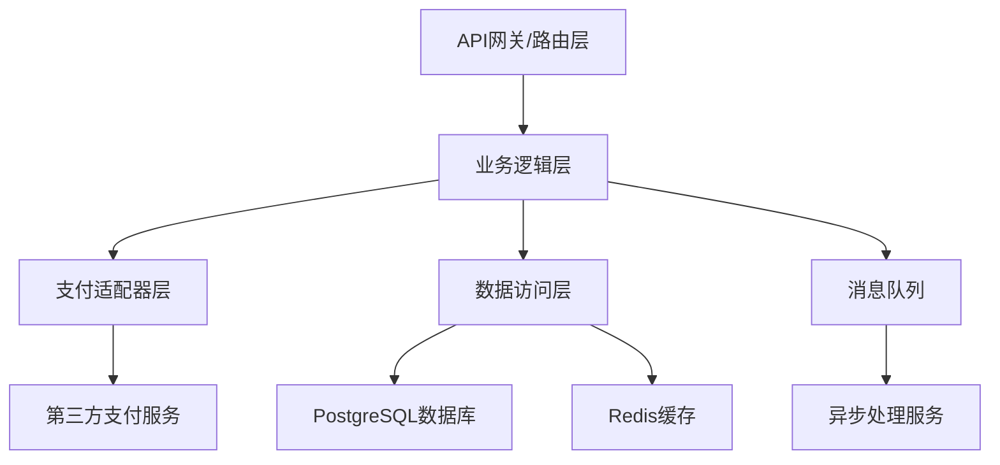
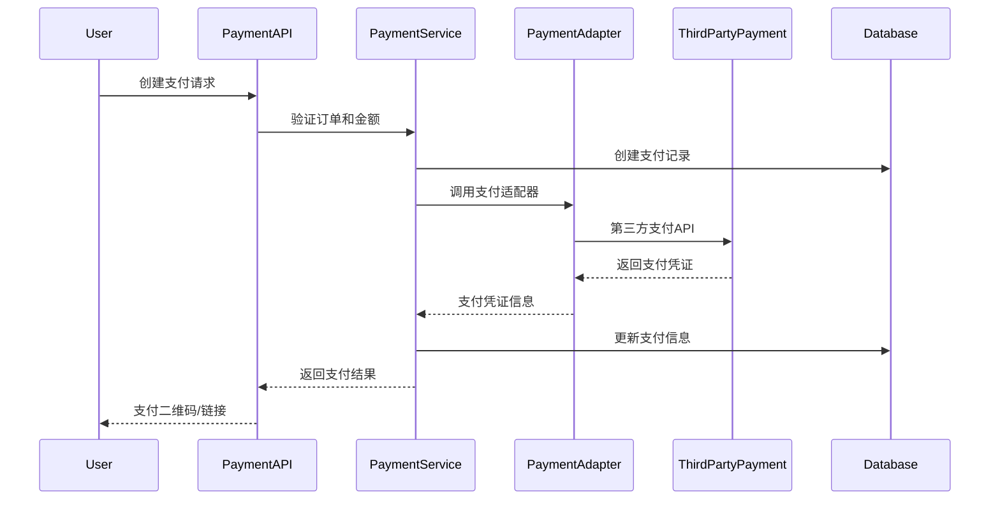
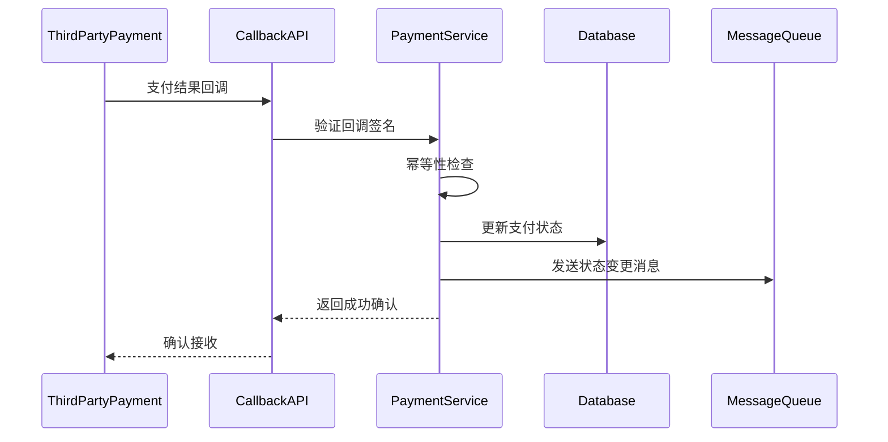
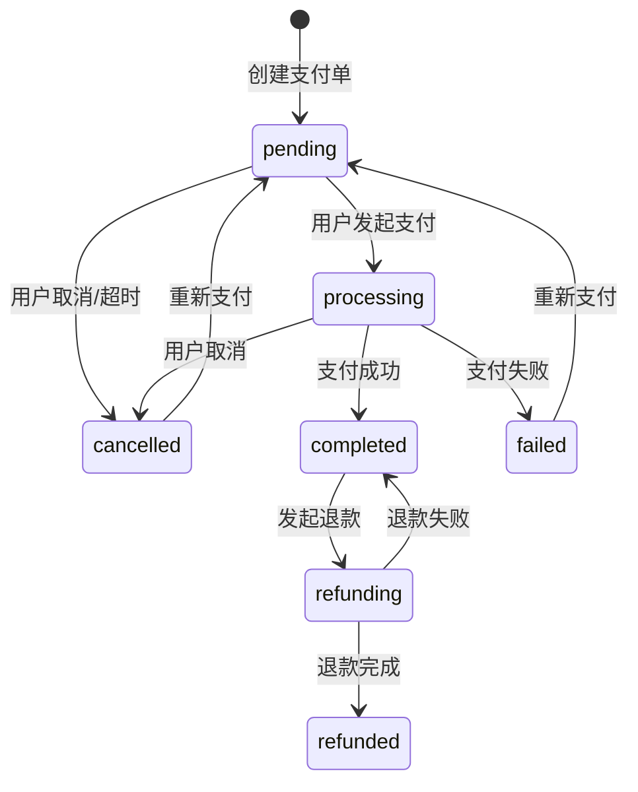

<!--
文档说明：
- 内容：模块技术设计文档模板
- 作用：记录技术设计决策、架构选择、实现方案
- 使用方法：基于需求文档进行技术设计，记录设计理由
-->

# payment-service模块 - 技术设计文档

📅 **创建日期**: 2025-09-16  
👤 **设计者**: 技术架构师  
✅ **评审状态**: 设计中  
🔄 **最后更新**: 2025-09-16  

## 设计概述

### 设计目标
- **高可用性**: 确保支付服务99.9%可用性，支持故障快速恢复
- **安全可靠**: 建立多层安全防护，确保支付数据和资金安全
- **可扩展性**: 支持多种支付方式接入，易于扩展新的支付渠道
- **高性能**: 支持高并发支付请求，响应时间满足业务要求

### 设计原则
- **单一职责**: 每个组件只负责一项职责，支付创建、状态管理、回调处理分离
- **开放封闭**: 通过适配器模式支持新支付方式扩展，无需修改核心逻辑
- **依赖倒置**: 业务逻辑依赖抽象接口，不依赖具体的支付渠道实现

### 关键设计决策
| 决策点 | 选择方案 | 理由 | 替代方案 |
|--------|----------|------|----------|
| 支付渠道集成 | 适配器模式 | 解耦支付逻辑，易于扩展 | 直接集成SDK |
| 状态管理 | 状态机模式 | 确保状态流转规范性 | 简单枚举 |
| 数据存储 | PostgreSQL主库+Redis缓存 | 事务一致性+高性能查询 | NoSQL方案 |
| 安全策略 | JWT认证+API签名验证 | 双重安全保障 | 单一认证方式 |

## 系统架构设计

### 整体架构


### 模块内部架构
```
payment-service/
├── router.py           # API路由层 - FastAPI路由定义
├── service.py          # 业务逻辑层 - 支付核心业务逻辑
├── models.py           # 数据模型层 - SQLAlchemy ORM模型
├── schemas.py          # 数据传输对象 - Pydantic验证模型
├── dependencies.py     # 依赖注入 - 认证授权依赖
├── auth_helpers.py     # 安全辅助 - 权限验证和安全检查
├── utils.py           # 工具函数 - 通用工具和辅助函数
└── adapters/          # 支付适配器目录
    ├── base.py        # 适配器基类
    ├── wechat.py      # 微信支付适配器
    ├── alipay.py      # 支付宝适配器
    └── bank.py        # 银行卡支付适配器
```
├── dependencies.py     # 依赖注入
└── utils.py            # 工具函数
```

### 层次职责
- **API层**: 接收HTTP请求，参数验证，响应格式化，错误处理
- **业务层**: 支付业务逻辑，状态管理，风控检查，业务规则验证
- **适配器层**: 第三方支付接口封装，统一支付协议，异常处理
- **数据层**: 数据持久化，事务管理，缓存策略，查询优化

## 数据库设计

### 表结构设计
```sql
-- 支付单表
CREATE TABLE payments (
    id BIGSERIAL PRIMARY KEY,
    order_id BIGINT NOT NULL REFERENCES orders(id),
    user_id BIGINT NOT NULL REFERENCES users(id),
    payment_no VARCHAR(100) UNIQUE NOT NULL,
    payment_method VARCHAR(50) NOT NULL,
    amount DECIMAL(10,2) NOT NULL,
    currency VARCHAR(3) DEFAULT 'CNY',
    status VARCHAR(20) DEFAULT 'pending',
    external_payment_id VARCHAR(200),
    external_transaction_id VARCHAR(200),
    pay_url VARCHAR(1000),
    qr_code TEXT,
    expires_at TIMESTAMP,
    callback_received_at TIMESTAMP,
    callback_data TEXT,
    payment_data TEXT,
    description VARCHAR(1000),
    paid_at TIMESTAMP,
    failed_at TIMESTAMP,
    created_at TIMESTAMP DEFAULT CURRENT_TIMESTAMP,
    updated_at TIMESTAMP DEFAULT CURRENT_TIMESTAMP
);

-- 退款单表  
CREATE TABLE refunds (
    id BIGSERIAL PRIMARY KEY,
    payment_id BIGINT NOT NULL REFERENCES payments(id),
    refund_no VARCHAR(100) UNIQUE NOT NULL,
    amount DECIMAL(10,2) NOT NULL,
    reason VARCHAR(500) NOT NULL,
    status VARCHAR(20) DEFAULT 'pending',
    external_refund_id VARCHAR(200),
    gateway_response TEXT,
    operator_id BIGINT REFERENCES users(id),
    operator_note TEXT,
    processed_at TIMESTAMP,
    created_at TIMESTAMP DEFAULT CURRENT_TIMESTAMP,
    updated_at TIMESTAMP DEFAULT CURRENT_TIMESTAMP
);
```

### 索引设计
| 表名 | 索引名 | 索引字段 | 索引类型 | 用途 |
|------|--------|----------|----------|------|
| payments | idx_payment_no | payment_no | UNIQUE | 支付单号查询 |
| payments | idx_order_user | order_id, user_id | BTREE | 订单支付查询 |
| payments | idx_status_created | status, created_at | BTREE | 状态统计查询 |
| payments | idx_external_payment | external_payment_id | BTREE | 第三方单号查询 |
| refunds | idx_payment_status | payment_id, status | BTREE | 退款状态查询 |
| refunds | idx_external_refund | external_refund_id | BTREE | 第三方退款查询 |

### 数据关系
- **Payment ↔ Order**: 多对一关系，一个订单可有多个支付记录（支付失败重试）
- **Payment ↔ User**: 多对一关系，一个用户可有多个支付记录  
- **Refund ↔ Payment**: 多对一关系，一个支付可有多个退款记录（部分退款）
- **Refund ↔ User**: 多对一关系，操作员字段关联用户表
## API设计

### API架构
- **基础路径**: `/payment-service/`
- **认证方式**: JWT Bearer Token  
- **数据格式**: JSON
- **错误处理**: 统一错误响应格式
- **版本控制**: URL路径版本控制

### 端点设计
| 方法 | 路径 | 功能 | 权限要求 | 响应格式 |
|------|------|------|----------|----------|
| POST | /payment-service/payments | 创建支付单 | 登录用户 | PaymentRead |
| GET | /payment-service/payments/{id} | 查询支付详情 | 所有者/管理员 | PaymentDetail |
| GET | /payment-service/payments | 支付列表查询 | 登录用户 | List[PaymentRead] |
| PUT | /payment-service/payments/{id}/cancel | 取消支付 | 所有者/管理员 | PaymentRead |
| POST | /payment-service/refunds | 申请退款 | 支付所有者 | RefundRead |
| GET | /payment-service/refunds | 退款列表 | 登录用户 | List[RefundRead] |
| PUT | /payment-service/refunds/{id}/approve | 审批退款 | 管理员 | RefundRead |
| POST | /payment-service/callbacks/{method} | 支付回调 | 无需认证 | 成功状态 |

### 错误处理设计
```json
{
    "error": {
        "code": "PAYMENT_ERROR_001", 
        "message": "支付金额不匹配",
        "details": {
            "order_amount": "100.00",
            "payment_amount": "99.99"
        }
    }
}
```

### 响应数据格式
```json
{
    "id": 123,
    "payment_no": "PAY202509161234567890",
    "order_id": 456,
    "amount": "100.00",
    "currency": "CNY", 
    "payment_method": "wechat",
    "status": "completed",
    "qr_code": "data:image/png;base64,iVBORw0KGgoAAAA...",
    "created_at": "2025-09-16T10:30:00Z"
}
```

## 业务逻辑设计

### 支付创建流程


### 支付回调处理流程


### 支付状态机设计


## 安全设计

### 认证授权策略
- **身份认证**: JWT Token验证，包含用户ID和权限信息
- **权限控制**: RBAC模型，支付操作需验证数据所有权
- **API签名**: 第三方回调使用数字签名验证来源合法性
- **数据隔离**: 用户只能查看自己的支付数据

### 数据安全措施  
```python
# 敏感数据加密存储
class PaymentSecurityMixin:
    def encrypt_sensitive_data(self, data):
        """加密敏感支付数据"""
        return AES.encrypt(data, settings.PAYMENT_ENCRYPT_KEY)
    
    def decrypt_sensitive_data(self, encrypted_data):
        """解密敏感支付数据"""  
        return AES.decrypt(encrypted_data, settings.PAYMENT_ENCRYPT_KEY)
```

### 风控策略设计
| 风控维度 | 检查规则 | 触发阈值 | 处理措施 |
|----------|----------|----------|----------|
| 金额异常 | 单笔支付金额 | >5万元 | 人工审核 |
| 频次异常 | 同用户支付频率 | 1分钟>10笔 | 暂时锁定 |
| 设备异常 | 异地登录支付 | 地理位置跨度>1000km | 短信验证 |
| 行为异常 | 支付失败率 | 24小时>50% | 风控标记 |

## 性能设计

### 缓存策略
```python
# Redis缓存设计
CACHE_KEYS = {
    'payment_detail': 'payment:{payment_id}',     # 支付详情缓存，TTL=1小时
    'user_payments': 'user_payments:{user_id}',   # 用户支付列表，TTL=30分钟  
    'payment_stats': 'payment_stats:{date}',      # 支付统计数据，TTL=24小时
}
```

### 数据库优化
- **读写分离**: 查询操作使用只读从库，写操作使用主库
- **分库分表**: 按时间维度分表，payment_2025_09, payment_2025_10
- **索引优化**: 基于查询模式建立复合索引
- **连接池**: 使用连接池避免频繁建立数据库连接

### 并发处理
```python  
# 异步处理设计
@asyncio.coroutine
async def process_payment_callback(callback_data):
    """异步处理支付回调"""
    # 1. 快速响应第三方
    # 2. 异步处理业务逻辑
    # 3. 消息队列解耦
    pass
```

## 集成设计

### 模块依赖
- **用户认证模块**: 提供用户身份验证和权限检查
- **订单管理模块**: 获取订单信息，验证订单状态和金额
- **库存管理模块**: 支付成功后触发库存扣减
- **通知服务模块**: 发送支付成功/失败通知

### 第三方服务集成
| 服务名 | 集成方式 | 用途 | 容错机制 |
|--------|----------|------|----------|
| 微信支付 | REST API | 主要支付渠道 | 自动重试+降级到支付宝 |
| 支付宝 | REST API | 备用支付渠道 | 自动重试+人工处理 |
| 银联支付 | REST API | 企业客户支付 | 自动重试+邮件告警 |

### 事件设计
- **发布事件**: 
  - PaymentCreated: 支付单创建事件
  - PaymentCompleted: 支付成功事件  
  - PaymentFailed: 支付失败事件
  - RefundCompleted: 退款完成事件
- **订阅事件**: 
  - OrderStatusChanged: 订单状态变更事件
  - UserRegistered: 用户注册事件

## 监控设计

### 系统监控
- **性能指标**: 支付成功率、响应时间、并发数、错误率
- **业务指标**: 日支付金额、支付方式分布、退款率
- **告警规则**: 支付成功率<99%、响应时间>5秒、错误率>1%

### 日志设计
```python
# 支付操作审计日志
{
    "timestamp": "2025-09-16T10:30:00Z",
    "operation": "create_payment", 
    "user_id": 12345,
    "order_id": 67890,
    "payment_id": 111,
    "amount": "100.00",
    "payment_method": "wechat",
    "ip_address": "192.168.1.100",
    "user_agent": "Mozilla/5.0...",
    "result": "success"
}
```

## 测试设计

### 单元测试
- **服务层测试**: 业务逻辑正确性验证
- **数据层测试**: 数据持久化和查询测试
- **工具函数测试**: 支付号生成、金额计算等

### 集成测试  
- **API接口测试**: 端到端接口功能测试
- **第三方集成测试**: 支付渠道集成测试(沙箱环境)
- **数据库集成测试**: 事务一致性和并发测试

### 性能测试
- **负载测试**: 1000并发支付请求测试
- **压力测试**: 系统极限承载能力测试
- **稳定性测试**: 长时间运行稳定性验证

## 部署设计

### 环境配置
- **开发环境**: 本地开发，使用支付沙箱
- **测试环境**: 功能测试，模拟真实支付流程
- **生产环境**: 正式环境，使用生产支付接口

### 配置管理
```python
# 支付配置
PAYMENT_CONFIG = {
    'wechat': {
        'app_id': os.getenv('WECHAT_APP_ID'),
        'mch_id': os.getenv('WECHAT_MCH_ID'), 
        'api_key': os.getenv('WECHAT_API_KEY'),
        'notify_url': f"{BASE_URL}/payment-service/callbacks/wechat"
    },
    'timeout': 30,  # 接口超时时间
    'retry_times': 3,  # 重试次数
}
```

## 变更记录

| 日期 | 版本 | 变更内容 | 变更人 |
|------|------|----------|--------|
| 2025-09-16 | v1.0 | 支付服务模块技术设计文档初稿 | 技术架构师 |

### 垂直扩展
- **资源配置**: {配置建议}
- **性能监控**: {监控指标}

### 降级策略
- **限流**: {限流策略}
- **熔断**: {熔断条件}
- **降级**: {降级方案}

## 监控设计

### 业务监控
- **业务指标**: {监控指标}
- **告警规则**: {告警条件}

### 技术监控
- **性能指标**: 响应时间、QPS、错误率
- **资源指标**: CPU、内存、磁盘
- **日志监控**: 错误日志、访问日志

## 测试策略

### 单元测试
- **测试覆盖**: 业务逻辑层100%覆盖
- **测试框架**: pytest
- **Mock策略**: {Mock方案}

### 集成测试
- **测试范围**: API接口测试
- **测试环境**: {环境配置}
- **测试数据**: {数据准备}

### 性能测试
- **压测目标**: {性能目标}
- **测试场景**: {测试用例}

## 实施计划

### 开发阶段
1. **阶段1**: 数据模型和API设计 ({时间})
2. **阶段2**: 核心业务逻辑实现 ({时间})
3. **阶段3**: 集成测试和优化 ({时间})

### 风险控制
- **技术风险**: {风险和缓解}
- **进度风险**: {风险和缓解}
- **质量风险**: {风险和缓解}

## 变更记录

| 日期 | 版本 | 变更内容 | 变更人 |
|------|------|----------|--------|
| 2025-09-16 | v1.0 | 初始设计 | {姓名} |
