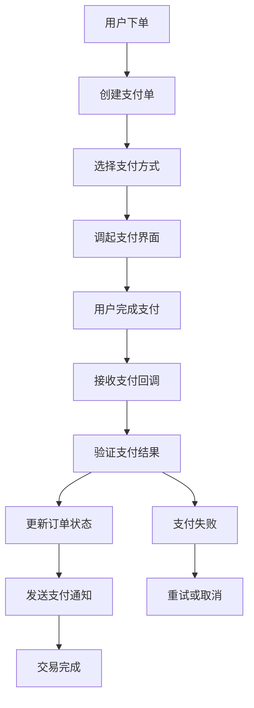
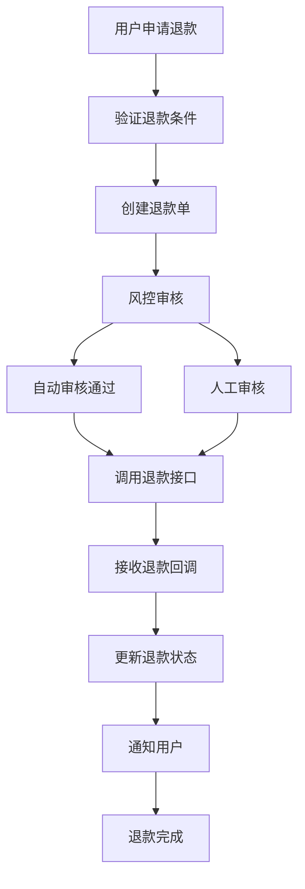

<!--
文档说明：
- 内容：模块业务需求文档模板
- 作用：记录业务需求、功能规格、验收标准
- 使用方法：详细记录业务需求，不包含技术实现
-->

# payment-service模块 - 业务需求文档

📅 **创建日期**: 2025-09-16  
👤 **需求方**: 产品经理/业务部门  
✅ **评审状态**: 待评审  
🔄 **最后更新**: 2025-09-16  

## 业务背景

### 业务目标
- **安全支付闭环**：为电商平台提供完整、安全的支付服务，支撑交易核心业务
- **多渠道支付**：集成主流支付方式(微信支付、支付宝、银行卡等)，提升用户体验
- **资金安全管控**：建立完善的支付风控体系，保障资金安全和合规性
- **运营数据支撑**：提供支付数据分析，支持业务决策和运营优化

### 业务场景
- **用户购买场景**：用户完成商品选购后需要安全便捷的支付方式完成交易
- **退款处理场景**：订单取消或售后退款时需要快速、准确的资金返还
- **商户对账场景**：平台需要与支付渠道进行资金对账，确保账务一致性
- **风控监控场景**：实时监控异常支付行为，防范欺诈和风险

### 成功指标
- **支付成功率**: ≥99.5%（排除用户主动取消）
- **支付响应时间**: 平均≤3秒
- **退款处理时效**: 用户申请退款后24小时内完成处理
- **资金安全事故**: 0起重大资金安全事故

## 功能需求

### 核心功能列表
| 功能ID | 功能名称 | 优先级 | 业务价值 | 验收标准 |
|--------|----------|--------|----------|----------|
| PS-F001 | 支付订单创建 | 高 | 支撑核心交易流程 | 支持微信、支付宝等主流支付方式 |
| PS-F002 | 支付状态管理 | 高 | 保障支付流程完整性 | 实时同步支付状态变更 |
| PS-F003 | 支付回调处理 | 高 | 确保支付结果准确性 | 安全验证第三方支付回调 |
| PS-F004 | 退款申请处理 | 高 | 保障用户资金权益 | 支持全额/部分退款 |
| PS-F005 | 支付安全风控 | 高 | 防范支付欺诈风险 | 异常支付行为识别拦截 |
| PS-F006 | 支付数据统计 | 中 | 支持运营决策分析 | 提供支付趋势和分析报表 |
| PS-F007 | 资金对账管理 | 中 | 确保账务准确性 | 自动化对账和差异处理 |

### 详细功能描述

#### PS-F001: 支付订单创建
- **业务描述**: 用户下单后创建支付单，支持多种支付方式，生成支付凭证
- **用户故事**: 作为购买用户，我希望能选择合适的支付方式快速完成支付，以便顺利完成购买
- **前置条件**: 用户已登录，订单已创建且状态为待支付
- **业务规则**: 
  - 规则1: 支付金额必须与订单金额一致
  - 规则2: 单次支付金额不能超过单日限额(个人5万，企业200万)
  - 规则3: 支付单15分钟内未完成自动过期
- **异常处理**: 支付金额不匹配时拒绝创建，超限额时提示用户选择其他方式

#### PS-F002: 支付状态管理
- **业务描述**: 管理支付单完整生命周期，包括创建、处理中、成功、失败、取消、退款等状态
- **用户故事**: 作为用户，我希望能实时了解我的支付状态，以便及时处理支付问题
- **前置条件**: 支付单已创建
- **业务规则**: 
  - 规则1: 状态变更必须符合预定义流转规则
  - 规则2: 状态变更需记录操作时间和操作人
  - 规则3: 关键状态变更需通知用户
- **异常处理**: 非法状态变更时拒绝更新并记录异常日志

#### PS-F003: 支付回调处理
- **业务描述**: 安全接收和处理第三方支付平台的回调通知，更新支付状态
- **用户故事**: 作为系统，我需要准确接收支付结果通知，以便及时更新订单状态
- **前置条件**: 第三方支付平台发起回调通知
- **业务规则**: 
  - 规则1: 必须验证回调签名的合法性
  - 规则2: 幂等性处理，避免重复处理同一回调
  - 规则3: 回调失败时支持重试机制
- **异常处理**: 签名验证失败时拒绝处理并告警，重试超限时人工介入

#### PS-F004: 退款申请处理
- **业务描述**: 处理用户退款申请，支持全额退款和部分退款，自动或人工审核
- **用户故事**: 作为用户，我希望在需要退款时能快速申请并及时收到退款，以便保障我的权益
- **前置条件**: 订单已支付且符合退款条件
- **业务规则**: 
  - 规则1: 退款金额不能超过实际支付金额
  - 规则2: 单笔订单可多次部分退款，累计不超过支付总额
  - 规则3: 退款到账时间依据支付方式而定(1-7个工作日)
- **异常处理**: 超额退款时拒绝申请，系统异常时转人工处理

## 非功能需求

### 性能要求
- **响应时间**: 支付创建≤3秒，支付查询≤1秒，回调处理≤2秒
- **并发用户**: 支持1000并发支付请求，峰值3000并发查询
- **数据量**: 日均支付单1万笔，年度数据量500万笔

### 可用性要求
- **系统可用性**: 99.9%可用性（月度停机时间<43.2分钟）
- **故障恢复**: RTO≤15分钟，RPO≤5分钟

### 安全要求
- **数据安全**: 支付敏感信息必须加密存储，PCI DSS Level 1合规
- **访问控制**: 基于JWT的身份认证，支付操作需二次验证
- **传输安全**: 全程HTTPS传输，API签名验证
- **审计日志**: 所有支付操作必须记录审计日志

### 扩展性要求
- **用户增长**: 支持用户数从1万增长到100万的扩展需求
- **功能扩展**: 支持新增支付渠道，国际化支付方式扩展

## 业务约束

### 合规要求
- **支付许可证**: 必须通过第三方支付服务商获得支付牌照合规
- **资金监管**: 遵循《非银行支付机构网络支付业务管理办法》
- **数据保护**: 符合《个人信息保护法》和《网络安全法》要求
- **反洗钱**: 建立反洗钱监控机制，异常交易上报

### 时间约束
- **交付时间**: 第一阶段Mini-MVP 2025年10月31日完成
- **里程碑**: 
  - 2025年9月30日: 基础支付功能完成
  - 2025年10月15日: 退款功能上线
  - 2025年10月31日: 风控和统计功能完成

### 资源约束
- **人力资源**: 1名后端开发，0.5名前端支持，0.3名测试资源
- **技术约束**: 基于现有FastAPI框架，PostgreSQL数据库，Redis缓存

## 用户角色和权限

### 用户角色定义
| 角色名称 | 角色描述 | 权限范围 |
|----------|----------|----------|
| 普通用户 | 平台注册用户 | 创建支付单、查询自己的支付记录、申请退款 |
| 商户用户 | 供应商/分销商 | 查询收款记录、导出对账单、查看统计数据 |
| 客服人员 | 客服和运营人员 | 查询用户支付记录、处理退款申请、查看风控告警 |
| 财务人员 | 财务管理人员 | 查看所有财务数据、执行对账操作、资金管理 |
| 系统管理员 | 技术运维人员 | 支付系统配置、风控规则管理、系统监控 |

### 权限矩阵
| 功能 | 普通用户 | 商户用户 | 客服人员 | 财务人员 | 系统管理员 |
|------|---------|---------|---------|---------|-----------|
| 创建支付单 | ✅ | ✅ | ❌ | ❌ | ❌ |
| 查询支付记录 | 🔍(仅自己) | 🔍(相关订单) | ✅ | ✅ | ✅ |
| 申请退款 | ✅ | ✅ | ❌ | ❌ | ❌ |
| 处理退款 | ❌ | ❌ | ✅ | ✅ | ✅ |
| 查看统计报表 | ❌ | 🔍(自己数据) | ✅ | ✅ | ✅ |
| 风控规则管理 | ❌ | ❌ | ❌ | ❌ | ✅ |

## 业务流程

### 主要业务流程

### 退款业务流程

### 异常流程
- **支付超时**: 支付单15分钟未完成自动关闭，库存释放，用户可重新支付
- **重复回调**: 基于幂等性设计，重复回调不会重复处理，记录日志
- **退款失败**: 退款接口调用失败时进入人工处理队列，24小时内必须处理
- **风控拦截**: 触发风控规则的支付被自动拦截，需要人工审核后释放

## 数据需求

### 核心业务实体
| 实体名称 | 业务含义 | 核心属性 |
|----------|----------|----------|
| Payment | 支付单 | payment_no(支付单号), order_id(订单ID), amount(金额), status(状态), payment_method(支付方式) |
| Refund | 退款单 | refund_no(退款单号), payment_id(支付单ID), amount(退款金额), reason(退款原因), status(状态) |
| PaymentCallback | 支付回调 | external_transaction_id(外部交易号), callback_data(回调数据), signature(签名), processed_at(处理时间) |

### 数据规则
- **唯一性**: 支付单号全局唯一，退款单号全局唯一，外部交易ID在同一支付方式下唯一
- **完整性**: 支付金额必须大于0，支付方式必须在枚举范围内，关联订单必须存在
- **一致性**: 支付单金额与订单金额一致，退款总额不超过支付金额，状态变更符合业务规则

## 验收标准

### 功能验收
- [ ] 支持微信支付、支付宝、银联等主流支付方式
- [ ] 支付成功率≥99.5%（排除用户取消）
- [ ] 支付回调处理准确率100%
- [ ] 退款申请审核流程完整
- [ ] 支付数据统计报表功能完整
- [ ] 异常支付风控拦截功能有效

### 性能验收
- [ ] 支付创建响应时间≤3秒（95%请求）
- [ ] 支付查询响应时间≤1秒（99%请求）
- [ ] 支持1000并发支付请求
- [ ] 回调处理时间≤2秒

### 安全验收
- [ ] 支付数据传输全程HTTPS加密
- [ ] 敏感信息存储加密
- [ ] 支付回调签名验证100%通过
- [ ] 异常支付行为识别和拦截
- [ ] 审计日志完整记录所有操作

## 风险和依赖

### 业务风险
- **第三方支付服务中断**: 单一支付渠道故障影响业务，缓解措施：多渠道备份，自动切换
- **支付欺诈风险**: 恶意支付行为损失，缓解措施：多层风控策略，实时监控告警
- **资金安全风险**: 支付数据泄露或篡改，缓解措施：数据加密，权限控制，审计日志
- **合规政策风险**: 监管政策变化影响业务，缓解措施：持续关注政策，提前适配调整

### 外部依赖
- **微信支付**: 微信支付服务稳定性，影响：主要支付渠道不可用
- **支付宝**: 支付宝服务稳定性，影响：备用支付渠道不可用  
- **银行网关**: 银行卡支付服务，影响：企业客户支付受限
- **网络环境**: 外网连通性，影响：第三方支付API调用失败

## 变更记录

| 日期 | 版本 | 变更内容 | 变更人 |
|------|------|----------|--------|
| 2025-09-16 | v1.0 | 完成支付服务模块需求文档初稿 | 开发团队 |
