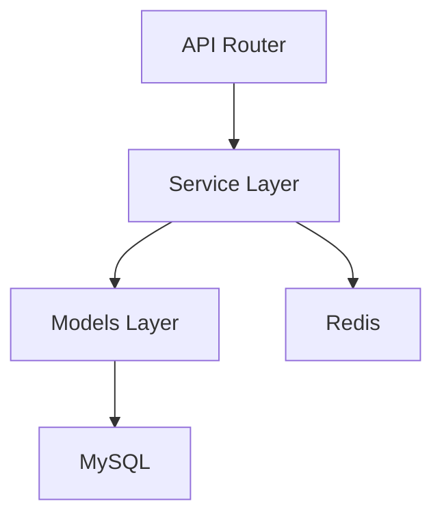
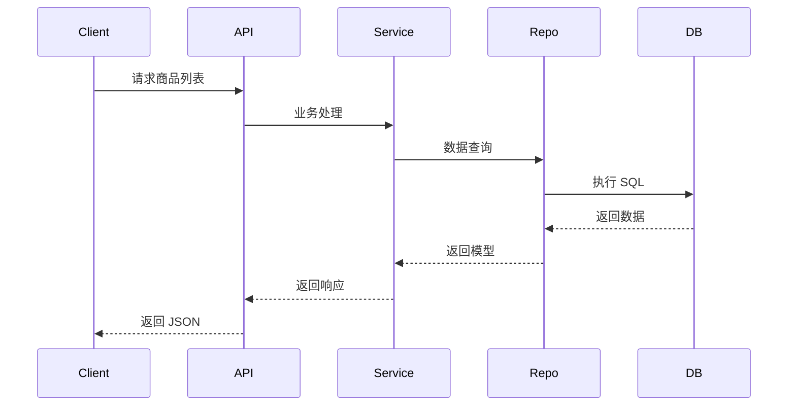

<!--
文档说明：
- 内容：模块技术设计文档模板
- 作用：记录技术设计决策、架构选择、实现方案
- 使用方法：基于需求文档进行技术设计，记录设计理由
-->

# product-catalog 模块 - 技术设计文档

## 依赖标准
- [文档管理标准](../../standards/document-management-standards.md)
- [应用架构](../../architecture/application-architecture.md)
- [数据架构](../../architecture/data-architecture.md)
- [架构标准](../../standards/architecture-standards.md)

## 概述
本文档详细描述product-catalog模块的技术设计方案，包括架构选择、数据模型、接口设计和性能考量。

## 具体标准

### 技术设计标准
- 设计决策必须记录决策点、选择方案、理由和替代方案
- 数据模型遵循第三范式，使用标准命名约定
- API设计遵循RESTful规范，统一错误处理
- 缓存策略明确TTL和失效机制
- 性能指标量化，包含响应时间和并发要求

📅 **创建日期**: 2025-10-06  
👤 **设计者**: 系统架构师  
✅ **评审状态**: 草稿  
🔄 **最后更新**: 2025-10-06  

## 1. 引言

### 设计目标
- 提供商品信息、分类、品牌和 SKU 的完整 CRUD 接口
- 满足高并发查询需求，响应时间 <200ms
- 与库存模块解耦，查询实时库存但不直接维护

### 设计原则
- **单一职责**: API层、业务层、数据层职责清晰
- **开放封闭**: 对新功能扩展开放，对已有功能接口兼容封闭
- **依赖倒置**: 高层模块不依赖底层实现，依赖抽象接口

### 关键设计决策
| 决策点 | 选择方案 | 理由 | 替代方案 |
|--------|----------|------|----------|
| 主键类型 | UUID | 避免整型自增冲突，便于跨服务唯一性 | 自增ID |
| 数据访问 | SQLAlchemy ORM | 与现有核心一致，方便模型定义 | 原生SQL |
| 缓存策略 | Redis | 高频查询数据缓存，降低DB压力 | 本地缓存 |

## 2. 设计概览

### 2.1 整体架构


### 2.2 模块内部架构
```plaintext
product_catalog/
├── router.py           # API路由层
├── service.py          # 业务逻辑层
├── repository.py       # 数据访问层
├── models.py           # 数据模型层
├── schemas.py          # DTO层
└── dependencies.py     # 依赖注入
```  

### 层次职责
- **API层**: 负责请求路由与参数校验
- **业务层**: 核心逻辑处理与边界校验
- **数据层**: CRUD 操作与事务管理

## 3. 数据模型

### 表结构设计
```sql
-- categories 表
CREATE TABLE categories (
    id CHAR(36) PRIMARY KEY,
    name VARCHAR(100) NOT NULL,
    parent_id CHAR(36),
    sort_order INT DEFAULT 0,
    is_active BOOLEAN DEFAULT TRUE
);

-- brands 表
CREATE TABLE brands (
    id CHAR(36) PRIMARY KEY,
    name VARCHAR(100) UNIQUE NOT NULL,
    slug VARCHAR(100) UNIQUE,
    is_active BOOLEAN DEFAULT TRUE
);

-- products 表
CREATE TABLE products (
    id CHAR(36) PRIMARY KEY,
    name VARCHAR(200) NOT NULL,
    description TEXT,
    category_id CHAR(36) NOT NULL,
    brand_id CHAR(36) NOT NULL,
    status VARCHAR(20) DEFAULT 'draft',
    is_active BOOLEAN DEFAULT TRUE,
    created_at DATETIME,
    updated_at DATETIME
);

-- skus 表
CREATE TABLE product_skus (
    id CHAR(36) PRIMARY KEY,
    product_id CHAR(36) NOT NULL,
    sku_code VARCHAR(50) UNIQUE NOT NULL,
    price DECIMAL(10,2) NOT NULL,
    is_active BOOLEAN DEFAULT TRUE
);
```

### 数据关系
- **Category→Product**: 一对多
- **Brand→Product**: 一对多
- **Product→SKU**: 一对多

## 4. 业务流程


## 5. 接口设计

### 基础路径
- `/api/v1/product-catalog/`

### 端点示例
| 方法 | 路径                                | 功能                     |
|------|-------------------------------------|--------------------------|
| GET  | `/products`                         | 查询商品列表             |
| GET  | `/products/{id}`                    | 查询商品详情             |
| POST | `/products`                         | 创建商品                 |
| PUT  | `/products/{id}`                    | 更新商品                 |
| DELETE | `/products/{id}`                  | 删除商品(软删除)         |
| GET  | `/categories`                       | 查询分类列表             |
| POST | `/categories`                       | 创建分类                 |
| GET  | `/brands`                           | 查询品牌列表             |
| POST | `/brands`                           | 创建品牌                 |
| GET  | `/skus`                             | 查询SKU列表              |
| POST | `/skus`                             | 创建SKU                  |

## 6. 安全考虑
- 认证：JWT Bearer Token，管理员权限控制写接口
- 授权：RBAC 细粒度权限
- 数据保护：敏感字段加密

## 7. 性能考量
- 列表查询响应 <200ms，支持 500QPS
- Redis 缓存热门数据，TTL 30 分钟
- 分页使用索引优化查询

## 8. 变更影响
- 向后兼容：新增字段需兼容老版本客户端
- 数据库迁移：使用 Alembic 脚本安全升级
- 影响：与 inventory-management 接口版本需同步调整

## 工具校验
```bash
tools/validate_standards.ps1 -Action full -DocPath docs/design/modules/product-catalog/design.md
``` 
```bash
tools/check_naming_compliance.ps1 -ModuleName product-catalog
```
