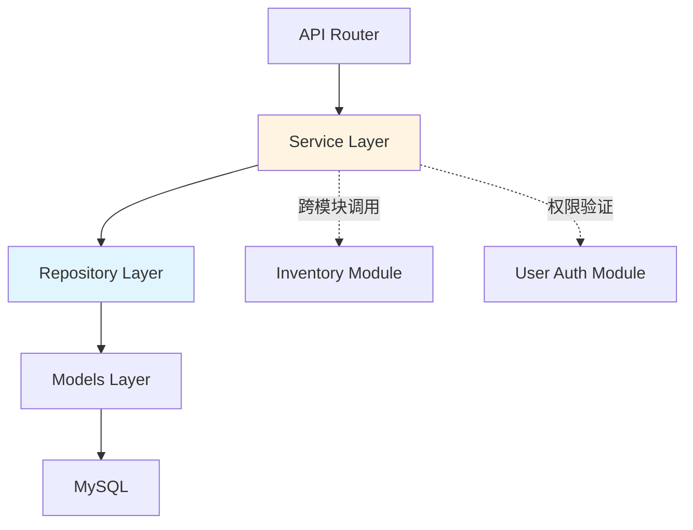
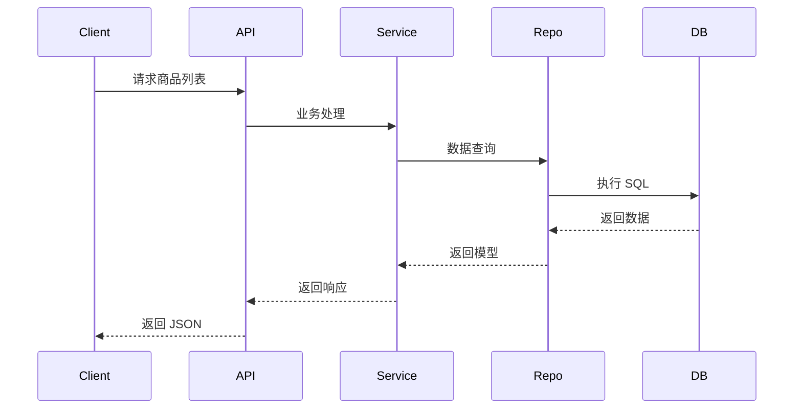

<!--
文档说明：
- 内容：模块技术设计文档模板
- 作用：记录技术设计决策、架构选择、实现方案
- 使用方法：基于需求文档进行技术设计，记录设计理由
-->

# product-catalog 模块 - 技术设计文档

## 依赖标准
- [文档管理标准](../../standards/document-management-standards.md)
- [应用架构](../../architecture/application-architecture.md)
- [数据架构](../../architecture/data-architecture.md)
- [架构标准](../../standards/architecture-standards.md)

## 概述
本文档详细描述product-catalog模块的技术设计方案，包括架构选择、数据模型、接口设计和性能考量。

## 具体标准

### 技术设计标准
- 设计决策必须记录决策点、选择方案、理由和替代方案
- 数据模型遵循第三范式，使用标准命名约定
- API设计遵循RESTful规范，统一错误处理
- 缓存策略明确TTL和失效机制
- 性能指标量化，包含响应时间和并发要求

📅 **创建日期**: 2025-10-06  
👤 **设计者**: 系统架构师  
✅ **评审状态**: 草稿  
🔄 **最后更新**: 2025-10-06  

## 1. 引言

### 设计目标
- 提供商品信息、分类、品牌和 SKU 的完整 CRUD 接口
- 满足高并发查询需求，响应时间 <200ms
- 与库存模块解耦，查询实时库存但不直接维护

### 设计原则
- **单一职责**: API层、业务层、数据层职责清晰
- **开放封闭**: 对新功能扩展开放，对已有功能接口兼容封闭
- **依赖倒置**: 高层模块不依赖底层实现，依赖抽象接口

### 关键设计决策
| 决策点 | 选择方案 | 理由 | 替代方案 | 决策状态 |
|--------|----------|------|----------|----------|
| 主键类型 | Integer (自增) | 索引更小、性能更优，符合 database-standards.md 标准 | UUID (CHAR(36)) | ✅ 已实施 |
| 数据访问 | Repository模式 + SQLAlchemy ORM | 职责分离清晰，Service管理事务，Repository封装数据访问 | 直接在Service中使用ORM | ✅ 已实施 |
| 缓存策略 | 暂不实施 | MVP阶段优先功能完整性，已完成数据库索引优化 | Redis缓存 | ✅ 已决策 |
| 库存管理 | inventory_management模块 | 模块职责清晰分离，避免耦合 | 在product表中存储库存 | ✅ 已实施 |
| 软删除 | SoftDeleteMixin | 保护历史数据，支持数据恢复 | 物理删除 | ✅ 已实施 |

## 2. 设计概览

### 2.1 整体架构


**架构说明**：
- Router → Service → Repository → Models 四层架构
- Service层负责事务管理（commit/rollback）
- Repository层负责数据访问（add/flush/refresh/query）
- 缓存层（Redis）暂未实现

### 2.2 模块内部架构
```plaintext
product_catalog/
├── router.py             # 第1层: API路由层 - HTTP请求处理
├── service.py            # 第2层: 业务逻辑层 - 事务管理、业务编排
├── repository.py         # 第3层: 数据访问层 - Repository模式CRUD封装
├── category_service.py   # 第2层: 分类业务逻辑 - 树结构管理
├── models.py             # 第4层: 数据模型层 - SQLAlchemy ORM定义
├── schemas.py            # DTO层: Pydantic V2请求响应模型
├── dependencies.py       # 依赖注入 & 权限校验
└── README.md             # 模块使用说明 & 代码示例
```

### 层次职责（Repository模式）

| 层级 | 文件 | 职责 | 禁止行为 |
|------|------|------|----------|
| **Router层** | `router.py` | HTTP请求处理、参数验证、调用Service | ❌ 禁止直接操作数据库 |
| **Service层** | `service.py`<br>`category_service.py` | 业务逻辑实现、事务边界管理（commit/rollback）、编排Repository调用 | ❌ 禁止直接使用 `db.query()` |
| **Repository层** | `repository.py` | 数据访问封装、CRUD操作、复杂查询构建，使用 `db.add()`/`db.flush()` | ❌ 禁止 `db.commit()`，保持无状态 |
| **Models层** | `models.py` | 数据库表结构定义、关系映射、字段约束 | ❌ 禁止包含业务逻辑 |

**关键原则**：
- ✅ Service调用Repository，Repository操作Models
- ✅ 事务由Service控制，Repository保持可复用
- ✅ 所有数据库查询必须通过Repository封装

## 3. 数据模型

### 表结构设计

**说明**: 所有表主键和外键统一使用 `INTEGER AUTO_INCREMENT`，遵循 `database-standards.md` 标准

```sql
-- categories 表
CREATE TABLE categories (
    id INTEGER PRIMARY KEY AUTO_INCREMENT COMMENT '分类ID',
    name VARCHAR(100) NOT NULL COMMENT '分类名称',
    parent_id INTEGER COMMENT '父分类ID',
    sort_order INTEGER DEFAULT 0 COMMENT '排序序号',
    is_active BOOLEAN DEFAULT TRUE COMMENT '是否激活',
    is_deleted BOOLEAN DEFAULT FALSE COMMENT '软删除标记',
    deleted_at DATETIME COMMENT '删除时间',
    created_at DATETIME NOT NULL DEFAULT CURRENT_TIMESTAMP COMMENT '创建时间',
    updated_at DATETIME NOT NULL DEFAULT CURRENT_TIMESTAMP ON UPDATE CURRENT_TIMESTAMP COMMENT '更新时间',
    FOREIGN KEY (parent_id) REFERENCES categories(id),
    INDEX idx_categories_parent_id (parent_id),
    INDEX idx_categories_sort_order (sort_order)
) ENGINE=InnoDB DEFAULT CHARSET=utf8mb4 COMMENT='商品分类表';

-- brands 表
CREATE TABLE brands (
    id INTEGER PRIMARY KEY AUTO_INCREMENT COMMENT '品牌ID',
    name VARCHAR(100) UNIQUE NOT NULL COMMENT '品牌名称',
    slug VARCHAR(100) UNIQUE NOT NULL COMMENT 'SEO友好标识',
    description TEXT COMMENT '品牌描述',
    logo_url VARCHAR(500) COMMENT '品牌Logo URL',
    website_url VARCHAR(500) COMMENT '品牌官网',
    is_active BOOLEAN DEFAULT TRUE COMMENT '是否激活',
    is_deleted BOOLEAN DEFAULT FALSE COMMENT '软删除标记',
    deleted_at DATETIME COMMENT '删除时间',
    created_at DATETIME NOT NULL DEFAULT CURRENT_TIMESTAMP COMMENT '创建时间',
    updated_at DATETIME NOT NULL DEFAULT CURRENT_TIMESTAMP ON UPDATE CURRENT_TIMESTAMP COMMENT '更新时间',
    UNIQUE INDEX idx_brands_name (name),
    UNIQUE INDEX idx_brands_slug (slug)
) ENGINE=InnoDB DEFAULT CHARSET=utf8mb4 COMMENT='品牌表';

-- products 表
CREATE TABLE products (
    id INTEGER PRIMARY KEY AUTO_INCREMENT COMMENT '商品ID',
    name VARCHAR(200) NOT NULL COMMENT '商品名称',
    description TEXT COMMENT '商品描述',
    category_id INTEGER COMMENT '分类ID',
    brand_id INTEGER COMMENT '品牌ID',
    status VARCHAR(20) DEFAULT 'draft' COMMENT '商品状态: draft/published/archived',
    seo_title VARCHAR(200) COMMENT 'SEO标题',
    seo_description TEXT COMMENT 'SEO描述',
    seo_keywords VARCHAR(500) COMMENT 'SEO关键词',
    sort_order INTEGER DEFAULT 0 COMMENT '排序序号',
    view_count INTEGER DEFAULT 0 COMMENT '浏览次数',
    sale_count INTEGER DEFAULT 0 COMMENT '销售次数',
    published_at DATETIME COMMENT '发布时间',
    is_deleted BOOLEAN DEFAULT FALSE COMMENT '软删除标记',
    deleted_at DATETIME COMMENT '删除时间',
    created_at DATETIME NOT NULL DEFAULT CURRENT_TIMESTAMP COMMENT '创建时间',
    updated_at DATETIME NOT NULL DEFAULT CURRENT_TIMESTAMP ON UPDATE CURRENT_TIMESTAMP COMMENT '更新时间',
    FOREIGN KEY (category_id) REFERENCES categories(id),
    FOREIGN KEY (brand_id) REFERENCES brands(id),
    INDEX idx_products_brand_category (brand_id, category_id),
    INDEX idx_products_status_published (status, published_at),
    INDEX idx_products_view_count (view_count),
    INDEX idx_products_sale_count (sale_count)
) ENGINE=InnoDB DEFAULT CHARSET=utf8mb4 COMMENT='商品表（SPU）';

-- product_skus 表 (SKU规格表)
CREATE TABLE product_skus (
    id INTEGER PRIMARY KEY AUTO_INCREMENT COMMENT 'SKU ID',
    product_id INTEGER NOT NULL COMMENT '商品ID',
    sku_code VARCHAR(100) UNIQUE NOT NULL COMMENT 'SKU编码',
    name VARCHAR(200) COMMENT 'SKU名称',
    price DECIMAL(10,2) NOT NULL COMMENT 'SKU价格',
    cost_price DECIMAL(10,2) COMMENT '成本价',
    market_price DECIMAL(10,2) COMMENT '市场价',
    is_active BOOLEAN DEFAULT TRUE COMMENT '是否激活',
    created_at DATETIME NOT NULL DEFAULT CURRENT_TIMESTAMP COMMENT '创建时间',
    updated_at DATETIME NOT NULL DEFAULT CURRENT_TIMESTAMP ON UPDATE CURRENT_TIMESTAMP COMMENT '更新时间',
    FOREIGN KEY (product_id) REFERENCES products(id),
    UNIQUE INDEX idx_skus_sku_code (sku_code),
    INDEX idx_skus_product_id (product_id)
) ENGINE=InnoDB DEFAULT CHARSET=utf8mb4 COMMENT='商品SKU表';

-- 注意: 库存数量由 inventory_management 模块管理，不在此表中
-- product_attributes 表
CREATE TABLE product_attributes (
    id INT PRIMARY KEY AUTO_INCREMENT,
    product_id INT NOT NULL,
    attribute_name VARCHAR(100) NOT NULL,
    attribute_value VARCHAR(255) NOT NULL
);

-- sku_attributes 表
CREATE TABLE sku_attributes (
    id INT PRIMARY KEY AUTO_INCREMENT,
    sku_id INT NOT NULL,
    attribute_name VARCHAR(100) NOT NULL,
    attribute_value VARCHAR(255) NOT NULL
);

-- product_images 表
CREATE TABLE product_images (
    id INT PRIMARY KEY AUTO_INCREMENT,
    product_id INT NOT NULL,
    image_url VARCHAR(500) NOT NULL,
    sort_order INT DEFAULT 0
);

-- product_tags 表
CREATE TABLE product_tags (
    id INT PRIMARY KEY AUTO_INCREMENT,
    product_id INT NOT NULL,
    tag VARCHAR(50) NOT NULL
);
```

### 数据关系
- **Category→Product**: 一对多
- **Brand→Product**: 一对多
- **Product→SKU**: 一对多

## 4. 业务流程


## 5. 接口设计

### 基础路径
- 全局前缀由 `main.py` 挂载: `/api/v1`
- 模块相对路径：`/product-catalog/`

### 端点示例
| 方法 | 路径                                | 功能                     |
|------|-------------------------------------|--------------------------|
| GET  | `/products`                         | 查询商品列表             |
| GET  | `/products/{id}`                    | 查询商品详情             |
| POST | `/products`                         | 创建商品                 |
| PUT  | `/products/{id}`                    | 更新商品                 |
| DELETE | `/products/{id}`                  | 删除商品(软删除)         |
| GET  | `/categories`                       | 查询分类列表             |
| POST | `/categories`                       | 创建分类                 |
| GET  | `/brands`                           | 查询品牌列表             |
| POST | `/brands`                           | 创建品牌                 |
| GET  | `/skus`                             | 查询SKU列表              |
| POST | `/skus`                             | 创建SKU                  |
| DELETE | `/skus/{id}`                      | 删除SKU(软删除)          |

## 6. 安全考虑
- 认证：JWT Bearer Token，管理员权限控制写接口
- 授权：RBAC 细粒度权限
- 数据保护：敏感字段加密

## 7. 性能考量
- 列表查询响应 <200ms，支持 500QPS
- Redis 缓存热门数据，TTL 30 分钟
- 分页使用索引优化查询

## 8. 变更影响
- 向后兼容：新增字段需兼容老版本客户端
- 数据库迁移：使用 Alembic 脚本安全升级
- 影响：与 inventory-management 接口版本需同步调整

## 工具校验
```bash
tools/validate_standards.ps1 -Action full -DocPath docs/design/modules/product-catalog/design.md
``` 
```bash
tools/check_naming_compliance.ps1 -ModuleName product-catalog
```
<!-- FRONTEND_RULES -->
```yaml
module:
  name: product-catalog
  path: /api/v1/product-catalog
  level: L2

entities:
  Product:
    exclude_fields: [is_deleted, deleted_at, view_count, sale_count]
  SKU:
    exclude_fields: [is_deleted, deleted_at, cost_price]  # 成本价为内部字段，库存由 inventory 模块管理
  Category:
    exclude_fields: [is_deleted, deleted_at]
  Brand:
    exclude_fields: [is_deleted, deleted_at]

ui_overrides:
  Product.status:
    component: status-tag
    options:
      draft: 草稿
      published: 已上架
      archived: 已归档
  Product.brand_id:
    component: select
    api: /api/v1/product-catalog/brands
    label_field: name
    value_field: id
  Product.category_id:
    component: tree-select
    api: /api/v1/product-catalog/categories
    label_field: name
    value_field: id
    children_field: children  # 假设后端返回树形结构
  SKU.is_active:
    component: switch
    true_label: 启用
    false_label: 禁用

cross_module_calls:
  - description: "SKU 实时库存由 inventory-management 模块提供"
    source_entity: SKU
    source_field: sku_code
    target_module: inventory-management
    target_api: /api/v1/inventory/stock?sku={value}
    method: GET 
```