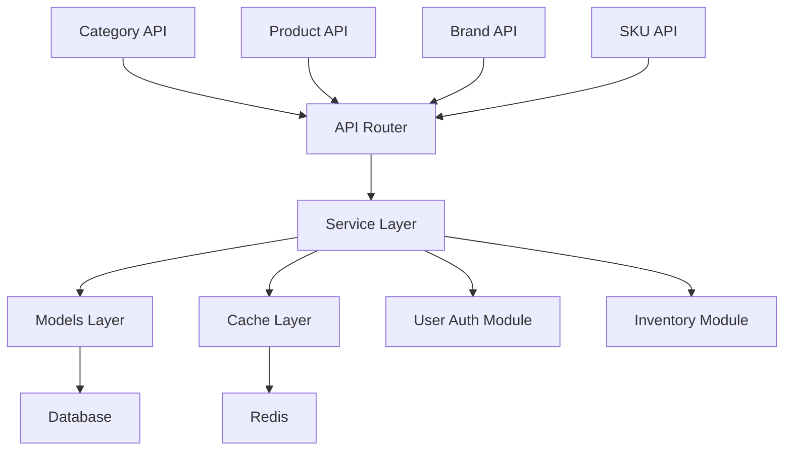
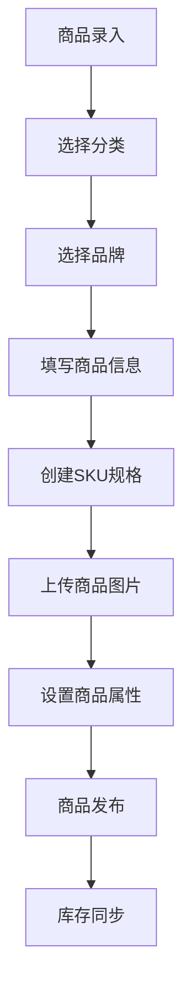
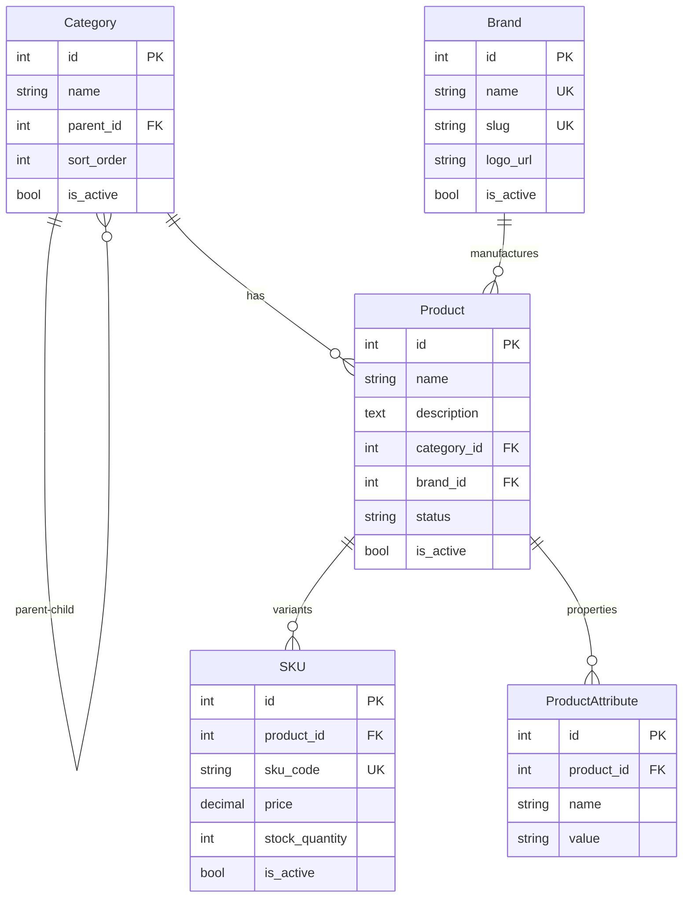

<!--
文档说明：
- 内容：模块文档标准模板，用于创建新的模块文档  
- 使用方法：复制此模板，替换模板变量，填入具体内容
- 更新方法：模板规范变更时由架构师更新
- 引用关系：被所有模块文档使用
- 更新频率：模板标准变化时

⚠️ 强制文档要求：
每个模块必须包含以下7个文档（无可选项）：
1. README.md - 模块导航（简洁版入口）
2. overview.md - 模块概述（本模板，详细版）
3. requirements.md - 业务需求文档（强制）
4. design.md - 设计决策文档（强制）
5. api-spec.md - API规范文档（强制）
6. api-implementation.md - API实施记录（强制）
7. implementation.md - 实现细节文档（强制）
-->

# 商品目录模块 (product-catalog)

📝 **状态**: 🔄 更新中  
📅 **创建日期**: 2024-12-19  
👤 **负责人**: 系统架构师  
🔄 **最后更新**: 2024-12-19  
📋 **版本**: v1.0.0  

## 模块概述

### 主要职责
电商平台的商品目录管理核心模块，负责商品全生命周期管理：
- **商品信息管理** - 商品CRUD操作、规格管理、属性维护
- **分类体系管理** - 多级分类层次结构、分类关系维护
- **品牌管理** - 品牌信息维护、品牌商品关联
- **库存集成** - 与库存管理模块协同，提供实时库存信息
- **价格管理** - 商品定价、促销价格、动态定价支持

### 业务价值
- **核心价值**: 为电商平台提供完整的商品目录基础设施，支撑商品展示、搜索、购买流程
- **用户收益**: 用户可以通过结构化分类快速找到商品，获得详细商品信息和规格参数
- **系统收益**: 为购物车、订单管理、推荐系统等提供标准化的商品数据接口

### 模块边界
- **包含功能**: 商品CRUD、分类管理、品牌管理、SKU管理、商品属性、商品图片、商品标签
- **排除功能**: 库存数量管理(库存模块)、价格计算逻辑(订单模块)、商品推荐算法(推荐模块)
- **依赖模块**: user-auth(权限验证)、core/database(数据持久化)、core/redis_client(缓存)
- **被依赖**: shopping-cart、order-management、inventory-management、recommendation-system

## 技术架构

### 架构图


### 核心组件
```
product_catalog/
├── router.py           # API路由定义 (399行，21个API端点)
├── service.py          # 业务逻辑处理
├── models.py           # 数据模型定义 (337行，7个核心模型)
├── schemas.py          # 请求/响应模型 (366行，完整API模式)
├── dependencies.py     # 模块依赖注入
└── utils.py            # 工具函数
```

### 模块化单体架构
- **架构模式**: 模块化单体架构 (Modular Monolith)
- **垂直切片**: 每个模块包含完整的业务功能
- **依赖原则**: 依赖注入和接口抽象

### 核心基础设施
```
app/core/               # 核心基础设施
├── database.py         # 数据库连接管理
├── redis_client.py     # Redis缓存客户端  
├── auth.py             # 认证中间件
└── __init__.py         # 核心组件导出
```

### 适配器集成
```
app/adapters/           # 第三方服务适配器
├── {service_type}/     # 服务类型目录
│   ├── {provider}_adapter.py
│   └── config.py
```

### 技术栈
- **编程语言**: Python 3.11+
- **Web框架**: FastAPI
- **数据库**: SQLAlchemy ORM + MySQL 8.0
- **缓存**: Redis (通过core/redis_client.py)
- **数据验证**: Pydantic v2
- **主要依赖**: TimestampMixin, SoftDeleteMixin, ModelRegistry

### 设计模式
- **领域模型模式**: Category, Product, Brand, SKU等核心业务实体
- **仓储模式**: 通过SQLAlchemy Session实现数据访问抽象
- **依赖注入**: 通过FastAPI的Depends机制注入数据库会话和认证用户
- **模式验证**: Pydantic模式确保API输入输出的类型安全
- **代码组织**: 分层架构，Models(数据层) -> Service(业务层) -> Router(API层)

## 核心功能

### 功能列表
| 功能名称 | 优先级 | 状态 | 描述 |
|---------|--------|------|------|
| 分类管理 | 高 | ✅ 已完成 | 多级分类创建、查询、更新，支持层次结构 |
| 品牌管理 | 高 | ✅ 已完成 | 品牌信息CRUD，支持SEO友好的slug |
| 商品管理 | 高 | ✅ 已完成 | 商品信息CRUD，支持分类品牌关联 |
| SKU管理 | 高 | ✅ 已完成 | 商品规格变体管理，库存关联 |
| 商品属性 | 中 | ✅ 已完成 | 可配置的商品属性系统 |
| 商品图片 | 中 | ✅ 已完成 | 商品多媒体资源管理 |
| 商品标签 | 低 | ✅ 已完成 | 商品标签分类和管理 |

### 核心业务流程


### 业务规则
1. **分类层次**: 分类支持无限级嵌套，但建议不超过3级以保证用户体验
2. **SKU唯一性**: 每个SKU必须有唯一的sku_code，同一商品不同规格对应不同SKU
3. **软删除**: 商品和分类支持软删除，保持数据完整性和历史记录
4. **权限控制**: 商品管理操作需要管理员权限，普通用户只有查询权限
5. **数据完整性**: 删除分类前必须先处理其子分类和关联商品

## 数据模型

### 核心实体
```python
# 商品分类模型
class Category(Base, TimestampMixin, SoftDeleteMixin):
    __tablename__ = 'categories'
    id = Column(Integer, primary_key=True, autoincrement=True)
    name = Column(String(100), nullable=False)
    parent_id = Column(Integer, ForeignKey('categories.id'))
    sort_order = Column(Integer, default=0)
    is_active = Column(Boolean, default=True)

# 品牌模型  
class Brand(Base, TimestampMixin):
    __tablename__ = 'brands'
    id = Column(Integer, primary_key=True, autoincrement=True)
    name = Column(String(100), unique=True, nullable=False)
    slug = Column(String(100), unique=True, nullable=False)
    logo_url = Column(String(500))
    is_active = Column(Boolean, default=True)

# 商品主模型
class Product(Base, TimestampMixin, SoftDeleteMixin):
    __tablename__ = 'products'  
    id = Column(Integer, primary_key=True, autoincrement=True)
    name = Column(String(200), nullable=False)
    description = Column(Text)
    category_id = Column(Integer, ForeignKey('categories.id'))
    brand_id = Column(Integer, ForeignKey('brands.id'))
    status = Column(String(20), default='draft')
    is_active = Column(Boolean, default=True)

# SKU规格模型
class SKU(Base, TimestampMixin):
    __tablename__ = 'product_skus'
    id = Column(Integer, primary_key=True, autoincrement=True) 
    product_id = Column(Integer, ForeignKey('products.id'))
    sku_code = Column(String(50), unique=True, nullable=False)
    price = Column(DECIMAL(10, 2), nullable=False)
    stock_quantity = Column(Integer, default=0)
    is_active = Column(Boolean, default=True)
```

### 数据关系图


### 数据约束
- **唯一性约束**: Brand.name, Brand.slug, SKU.sku_code必须唯一
- **外键约束**: Product必须关联有效的Category和Brand
- **软删除**: Category和Product支持软删除，保持引用完整性
- **层次约束**: Category的parent_id不能形成循环引用
- **状态约束**: Product.status限制为draft/published/archived
- **外键约束**: 与其他表的关系约束
- **业务约束**: 业务级别的数据约束

## API接口

### 接口列表
| 接口 | 方法 | 路径 | 描述 | 状态 |
|------|------|------|------|------|
| 创建分类 | POST | /api/v1/product-catalog/categories | 创建新分类 | ✅ |
| 分类列表 | GET | /api/v1/product-catalog/categories | 获取分类列表，支持分页筛选 | ✅ |
| 创建品牌 | POST | /api/v1/product-catalog/brands | 创建新品牌 | ✅ |
| 品牌列表 | GET | /api/v1/product-catalog/brands | 获取品牌列表，支持分页筛选 | ✅ |
| 创建商品 | POST | /api/v1/product-catalog/products | 创建新商品 | ✅ |
| 商品列表 | GET | /api/v1/product-catalog/products | 获取商品列表，支持多维度筛选 | ✅ |
| 商品详情 | GET | /api/v1/product-catalog/products/{id} | 获取指定商品详细信息 | ✅ |
| 更新商品 | PUT | /api/v1/product-catalog/products/{id} | 更新商品信息 | ✅ |
| 商品搜索 | GET | /api/v1/product-catalog/products/search | 商品关键词搜索 | ✅ |
| 创建SKU | POST | /api/v1/product-catalog/skus | 为商品创建规格SKU | ✅ |
| SKU列表 | GET | /api/v1/product-catalog/skus | 获取SKU列表 | ✅ |

### 接口详情示例
```yaml
/api/v1/product-catalog/products:
  post:
    summary: 创建商品
    security:
      - bearerAuth: []
    requestBody:
      required: true
      content:
        application/json:
          schema:
            type: object
            properties:
              name:
                type: string
                maxLength: 200
              description:
                type: string
              category_id:
                type: integer
              brand_id:
                type: integer
              status:
                type: string
                enum: [draft, published, archived]
    responses:
      201:
        description: 商品创建成功
        content:
          application/json:
            schema:
              $ref: '#/components/schemas/ProductRead'
      400:
        description: 请求参数错误
      401:
        description: 未授权访问
      403:
        description: 权限不足
```

### 错误码
| 错误码 | 状态码 | 描述 | 解决方案 |
|--------|--------|------|----------|
| PRODUCT_001 | 400 | 商品名称不能为空 | 检查name字段 |
| PRODUCT_002 | 400 | 分类ID无效 | 确认category_id存在 |
| PRODUCT_003 | 400 | 品牌ID无效 | 确认brand_id存在 |
| PRODUCT_004 | 404 | 商品不存在 | 确认商品ID |
| PRODUCT_005 | 409 | SKU代码已存在 | 使用不同的sku_code |

## 测试策略

### 测试覆盖率目标
- **单元测试**: ≥ 85%
- **集成测试**: ≥ 70%
- **端到端测试**: 核心业务流程100%

### 测试类型
```python
# 单元测试示例
class Test{Entity}Service:
    def test_create_{entity}_success(self):
        # 测试成功创建{实体}
        pass
    
    def test_create_{entity}_validation_error(self):
        # 测试验证错误
        pass

# 集成测试示例  
class Test{Entity}API:
    def test_{entity}_crud_workflow(self):
        # 测试完整CRUD流程
        pass
```

### 性能测试
- **响应时间**: API响应时间 < 500ms
- **并发处理**: 支持100并发请求
- **数据量**: 支持100万条记录

### 测试数据
- **测试数据生成**: Factory Boy或自定义工厂
- **数据清理**: 每个测试后清理测试数据
- **Mock策略**: 外部依赖的Mock策略

## 部署和运维

### 环境要求
- **开发环境**: 本地开发环境配置
- **测试环境**: 测试环境配置要求
- **生产环境**: 生产环境配置要求

### 配置管理
```python
# 环境变量配置
{MODULE}_DATABASE_URL=mysql://...
{MODULE}_REDIS_URL=redis://...
{MODULE}_LOG_LEVEL=INFO
```

### 监控指标
- **业务指标**: 关键业务指标监控
- **技术指标**: 响应时间、错误率等
- **资源指标**: CPU、内存、数据库连接等

### 告警规则
- **错误率**: > 1% 触发告警
- **响应时间**: > 1s 触发告警
- **资源使用**: > 80% 触发告警

## 安全考虑

### 认证授权
- **身份认证**: JWT Token验证
- **权限控制**: 基于角色的访问控制
- **API安全**: Rate Limiting、CORS等

### 数据安全
- **数据加密**: 敏感数据加密存储
- **传输安全**: HTTPS传输
- **输入验证**: 严格的输入验证

### 审计日志
- **操作日志**: 记录关键操作
- **访问日志**: 记录API访问
- **安全日志**: 记录安全相关事件

## 性能优化

### 缓存策略
- **应用缓存**: Redis缓存热点数据
- **数据库缓存**: 查询结果缓存
- **CDN缓存**: 静态资源缓存

### 数据库优化
- **索引优化**: 关键字段索引
- **查询优化**: SQL查询优化
- **连接池**: 数据库连接池配置

### 扩展性设计
- **水平扩展**: 支持多实例部署
- **垂直扩展**: 资源配置优化
- **降级策略**: 服务降级机制

## 问题和风险

### 已知问题
| 问题ID | 描述 | 优先级 | 状态 | 解决方案 |
|--------|------|--------|------|----------|
| {MODULE}-001 | 问题描述 | 高 | 🔄 处理中 | 解决方案 |

### 技术风险
- **风险1**: 风险描述和缓解措施
- **风险2**: 风险描述和缓解措施

### 技术债务
- **债务1**: 技术债务描述和还债计划
- **债务2**: 技术债务描述和还债计划

## 开发计划

### 里程碑
- **M1**: 基础功能开发 (预计: {日期})
- **M2**: 完整功能实现 (预计: {日期})
- **M3**: 性能优化 (预计: {日期})

### 任务分解
- [ ] 任务1 (负责人: {姓名}, 预计: {日期})
- [ ] 任务2 (负责人: {姓名}, 预计: {日期})
- [ ] 任务3 (负责人: {姓名}, 预计: {日期})

## 相关文档

### 架构文档
- [系统架构总览](../architecture/overview.md)
- [API设计规范](../architecture/api-standards.md)
- [数据模型规范](../architecture/data-models.md)

### 开发文档
- [开发规范](../development/development-standards.md)
- [测试指南](../development/testing.md)
- [部署指南](../operations/deployment.md)

### 需求文档
- [业务需求](../requirements/business.md)
- [功能需求](../requirements/functional.md)

### 其他模块
- [依赖模块1](../modules/{module1}/overview.md)
- [依赖模块2](../modules/{module2}/overview.md)

---

📝 **模板使用说明**:
1. 复制此模板创建新的模块文档
2. 替换所有 `{变量}` 为实际值
3. 删除不适用的章节
4. 根据模块特点调整章节内容
5. 保持文档及时更新

