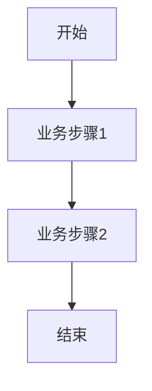

<!--
文档说明：
- 内容：模块业务需求文档模板
- 作用：记录业务需求、功能规格、验收标准
- 使用方法：详细记录业务需求，不包含技术实现
-->

# product-catalog 模块 - 业务需求文档

## 依赖标准
- [文档管理标准](../../standards/document-management-standards.md)
- [业务架构](../../architecture/business-architecture.md)
- [需求文档标准](../../standards/requirements-standards.md)

## 概述
本文档定义product-catalog模块的业务需求、功能规格和验收标准，为技术设计和实现提供业务指导。

## 具体标准

### 需求定义标准
- 每个功能需求必须包含：功能ID、功能名称、优先级、验收标准
- 业务规则必须明确前置条件、处理逻辑、异常处理
- 非功能需求包含性能、可用性、安全性、扩展性要求
- 用户角色和权限矩阵必须完整定义

📅 **创建日期**: 2025-10-06  
👤 **需求方**: 产品经理  
✅ **评审状态**: 待评审  
🔄 **最后更新**: 2025-10-06  

## 业务背景

### 业务目标
为电商平台提供标准化的商品目录管理能力，支撑商品展示、搜索与下单流程。  

### 业务场景
- 商家录入或更新商品信息，用于前端展示。  
- 用户浏览商品分类、品牌和SKU详情。  
- 订单创建前查询商品元数据。  

### 成功指标
- 系统商品查询响应时间 < 200ms  
- 支持并发500请求/s  

## 功能需求

### 核心功能列表
| 功能ID | 功能名称     | 优先级 | 验收标准                                     |
|--------|--------------|--------|---------------------------------------------|
| REQ-product_catalog-001 | 商品信息 CRUD | 高     | `POST/PUT/DELETE/GET` 接口返回200且数据正确     |
| REQ-product_catalog-002 | 分类树管理   | 中     | 返回完整分类层级结构，包含 parent/child 关系   |
| REQ-product_catalog-003 | SKU 管理     | 高     | 新增/更新/查询 SKU 属性与定价正确持久化        |

### 详细功能描述

#### REQ-product_catalog-001: 商品信息 CRUD
- **业务描述**: 支持商品的创建、查询、更新和删除操作。  
- **用户故事**: 作为商品管理员，我希望能够管理商品信息，以便维护商品数据。  
- **前置条件**: 用户已通过认证并拥有相应权限。  
- **业务规则**: 
  - 新增商品时必须填写名称、分类和品牌。  
  - 删除商品时应进行软删除，保留历史记录。  
- **异常处理**: 
  - 操作不存在的商品ID返回404。  
  - 参数校验失败返回400。  

#### REQ-product_catalog-002: 分类树管理
- **业务描述**: 支持多级分类的增删改查，并提供树状结构查询接口。  
- **用户故事**: 作为商品管理员，我希望管理商品分类层级，以便组织商品。  
- **前置条件**: 分类不存在循环引用。  
- **业务规则**: 
  - 分类层级不超过5级。  
  - 禁止删除存在子分类的父分类。  
- **异常处理**: 
  - 循环引用返回400。  
  - 未找到分类ID返回404。  

#### REQ-product_catalog-003: SKU 管理
- **业务描述**: 支持SKU的创建、更新、查询操作，并与库存模块集成。  
- **用户故事**: 作为商品管理员，我希望配置不同规格的SKU，以便满足多样化销售需求。  
- **前置条件**: SKU code 唯一。  
- **业务规则**: 
  - SKU code 在全平台唯一。  
  - 价格必须为非负数。  
- **异常处理**: 
  - 重复 SKU code 返回409。  

## 非功能需求

### 性能要求
- **响应时间**: {具体要求}
- **并发用户**: {具体数量}
- **数据量**: {预期数据量}

### 可用性要求
- **系统可用性**: {可用性指标}
- **故障恢复**: {恢复时间要求}

### 安全要求
- **数据安全**: {安全要求}
- **访问控制**: {权限要求}

### 扩展性要求
- **用户增长**: {用户增长预期}
- **功能扩展**: {扩展方向}

## 业务约束

### 合规要求
- {合规要求1}
- {合规要求2}

### 时间约束
- **交付时间**: {具体时间}
- **里程碑**: {关键时间节点}

### 资源约束
- **人力资源**: {资源限制}
- **技术约束**: {技术限制}

## 用户角色和权限

### 用户角色定义
| 角色名称 | 角色描述 | 权限范围 |
|----------|----------|----------|
| {角色1} | {角色描述} | {权限列表} |
| {角色2} | {角色描述} | {权限列表} |

### 权限矩阵
| 功能 | {角色1} | {角色2} | {角色3} |
|------|---------|---------|---------|
| {功能1} | ✅ | ❌ | 🔍 |
| {功能2} | ✅ | ✅ | ❌ |

## 业务流程

### 主要业务流程

### 异常流程
- **异常1**: {异常描述和处理流程}
- **异常2**: {异常描述和处理流程}

## 数据需求

### 核心业务实体
| 实体名称 | 业务含义 | 核心属性 |
|----------|----------|----------|
| {实体1} | {业务含义} | {属性列表} |
| {实体2} | {业务含义} | {属性列表} |

### 数据规则
- **唯一性**: {唯一性要求}
- **完整性**: {完整性要求}
- **一致性**: {一致性要求}

## 验收标准

### 功能验收
- [ ] {验收项1}
- [ ] {验收项2}
- [ ] {验收项3}

### 性能验收
- [ ] {性能指标1}
- [ ] {性能指标2}

### 安全验收
- [ ] {安全要求1}
- [ ] {安全要求2}

## 风险和依赖

### 业务风险
- **风险1**: {风险描述和缓解措施}
- **风险2**: {风险描述和缓解措施}

### 外部依赖
- **依赖1**: {依赖描述和影响}
- **依赖2**: {依赖描述和影响}

## 变更记录

| 日期 | 版本 | 变更内容 | 变更人 |
|------|------|----------|--------|
| 2025-09-16 | v1.0 | 初始版本 | {姓名} |
