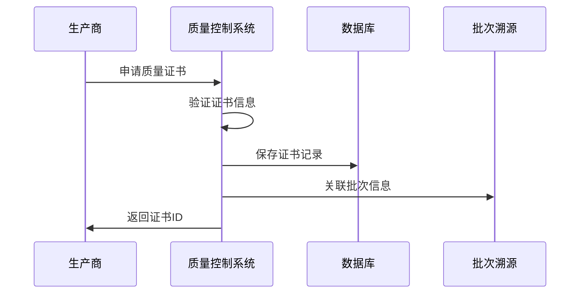
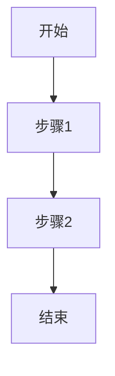

<!--
文档说明：
- 内容：质量控制模块概述文档，定义模块职责、架构和业务价值
- 使用方法：了解质量控制模块的完整功能和技术架构
- 更新方法：模块功能变更或架构调整时更新
- 引用关系：引用functional.md需求，被其他模块文档和架构文档引用
- 更新频率：功能迭代或架构变更时更新
-->

# 质量控制模块 (Quality Control)

📝 **状态**: ✅ 已发布  
📅 **创建日期**: 2025-09-17  
👤 **负责人**: 系统架构师  
🔄 **最后更新**: 2025-09-17  
📋 **版本**: v1.0.0  

## 模块概述

### 主要职责
农产品电商平台的质量保证核心模块，确保产品质量可信度和合规性：
- **质量认证证书管理** - 有机认证、绿色食品、质检报告等证书的全生命周期管理
- **合规性文档管理** - 食品安全法规合规性检查和相关文档存储管理
- **溯源质量关联** - 质量证书与批次溯源信息的关联，建立完整质量档案
- **消费者信任展示** - 在商品页面展示相关质量认证，提升消费者信任度
- **证书真伪验证** - 提供证书查询和验证功能，防范虚假认证

### 业务价值
- **核心价值**: 建立农产品质量信任体系，通过权威认证和透明展示提升产品竞争力
- **用户收益**: 消费者可查验产品质量认证，购买决策更有信心，享受高品质农产品
- **系统收益**: 差异化竞争优势，提升平台品牌价值，符合食品安全监管要求，降低质量风险

### 模块边界
- **包含功能**: 质量认证证书CRUD、证书有效期管理、溯源关联、消费者展示、真伪验证
- **排除功能**: 实际质量检测、认证机构对接、区块链存证（由批次溯源模块负责）
- **依赖模块**: 数据库核心、应用核心、批次溯源（关联功能）
- **被依赖**: 商品管理（质量信息展示）、批次溯源（质量档案关联）

## 技术架构

### 架构图
```
{模块架构图，使用Mermaid或ASCII}
```

### 核心组件
```
{模块名}/
├── router.py           # API路由定义
├── service.py          # 业务逻辑处理
├── models.py           # 数据模型定义
├── schemas.py          # 请求/响应模型
├── dependencies.py     # 模块依赖注入
└── utils.py            # 工具函数
```

### 模块化单体架构
- **架构模式**: 模块化单体架构 (Modular Monolith)
- **垂直切片**: 每个模块包含完整的业务功能
- **依赖原则**: 依赖注入和接口抽象

### 核心基础设施
```
app/core/               # 核心基础设施
├── database.py         # 数据库连接管理
├── redis_client.py     # Redis缓存客户端  
├── auth.py             # 认证中间件
└── __init__.py         # 核心组件导出
```

### 适配器集成
```
app/adapters/           # 第三方服务适配器
├── {service_type}/     # 服务类型目录
│   ├── {provider}_adapter.py
│   └── config.py
```

### 技术栈
- **编程语言**: Python 3.11+
- **Web框架**: FastAPI
- **数据库**: MySQL 8.0 (遵循INTEGER主键标准)
- **ORM**: SQLAlchemy
- **数据验证**: Pydantic
- **缓存**: Redis
- **测试框架**: pytest

### 设计模式
- **架构模式**: 模块化单体架构 (Modular Monolith)
- **API设计**: RESTful API
- **数据访问**: Active Record模式（SQLAlchemy ORM）
- **依赖注入**: FastAPI依赖系统
- **代码组织**: 分层架构（Router → Service → Model）

## 核心功能

### 功能列表
| 功能名称 | 优先级 | 状态 | 描述 |
|---------|--------|------|------|
| 证书管理 | P0 | ✅ 已完成 | 农产品质量证书的创建、查询、删除管理 |
| 合规检查 | P1 | ⏳ 待开始 | 产品质量合规性验证和检查 |
| 溯源集成 | P1 | ⏳ 待开始 | 与批次溯源模块的数据集成 |
| 消费者展示 | P2 | ⏳ 待开始 | 面向消费者的质量信息展示 |
| 证书验证 | P2 | ⏳ 待开始 | 二维码扫描和证书真伪验证 |

### 核心业务流程



## API概览

### 证书管理API
| 端点 | 方法 | 描述 | 状态 |
|------|------|------|------|
| `/quality-control/certificates` | POST | 创建新证书 | ✅ 已实现 |
| `/quality-control/certificates` | GET | 获取证书列表 | ✅ 已实现 |
| `/quality-control/certificates/{cert_id}` | GET | 获取指定证书 | ✅ 已实现 |
| `/quality-control/certificates/{cert_id}` | DELETE | 删除证书 | ✅ 已实现 |

### 数据模型
```python
class Certificate:
    id: int              # 主键（INTEGER）
    serial: str          # 证书序列号（唯一索引）
    name: str           # 证书名称
    issuer: str         # 颁发机构
    description: str    # 证书描述（可选）
    issued_at: datetime # 颁发时间
    expires_at: datetime # 过期时间
    is_active: bool     # 是否有效
    created_at: datetime # 创建时间（TimestampMixin）
    updated_at: datetime # 更新时间（TimestampMixin）
```

## 模块依赖

### 内部依赖
- **app/core/database.py**: 数据库连接和会话管理
- **app/shared/base_models.py**: TimestampMixin基础模型
- **app/core/auth.py**: 认证中间件（待集成）

### 外部依赖
- **SQLAlchemy**: ORM数据访问
- **Pydantic**: 数据验证和序列化
- **FastAPI**: Web框架和依赖注入

### 集成模块
- **batch_traceability**: 批次溯源集成（P1优先级）
- **product_catalog**: 产品目录关联（P2优先级）

## 使用场景

### 1. 证书注册流程
```python
# 创建新的质量证书
certificate_data = {
    "serial": "QC2024001",
    "name": "有机农产品认证",
    "issuer": "国家农业部",
    "description": "符合有机农产品标准",
    "issued_at": "2024-01-01T00:00:00",
    "expires_at": "2025-01-01T00:00:00"
}
response = requests.post("/quality-control/certificates", json=certificate_data)
```

### 2. 证书查询验证
```python
# 查询证书信息
cert_id = 1
response = requests.get(f"/quality-control/certificates/{cert_id}")
certificate = response.json()
```

### 3. 批量证书管理
```python
# 获取证书列表（分页）
response = requests.get("/quality-control/certificates?skip=0&limit=50")
certificates = response.json()
```


### 业务规则
1. **规则1**: 详细描述业务规则
2. **规则2**: 详细描述业务规则
3. **规则3**: 详细描述业务规则

## 数据模型

### 核心实体
```python
# 主要数据模型示例
class {EntityName}(Base):
    __tablename__ = "{table_name}"
    
    id = Column(Integer, primary_key=True)
    name = Column(String(100), nullable=False)
    created_at = Column(DateTime, default=datetime.utcnow)
    updated_at = Column(DateTime, default=datetime.utcnow, onupdate=datetime.utcnow)
```

### 数据关系图
```
{实体关系图，可以使用Mermaid ER图}
```

### 数据约束
- **唯一性约束**: 字段级别的唯一性要求
- **外键约束**: 与其他表的关系约束
- **业务约束**: 业务级别的数据约束

## API接口

### 接口列表
| 接口 | 方法 | 路径 | 描述 | 状态 |
|------|------|------|------|------|
| 创建{实体} | POST | /api/v1/{entities} | 创建新的{实体} | ✅ |
| 获取{实体} | GET | /api/v1/{entities}/{id} | 获取指定{实体} | ✅ |
| 更新{实体} | PUT | /api/v1/{entities}/{id} | 更新{实体}信息 | 🔄 |
| 删除{实体} | DELETE | /api/v1/{entities}/{id} | 删除{实体} | ⏳ |

### 接口详情示例
```yaml
/api/v1/{entities}:
  post:
    summary: 创建{实体}
    requestBody:
      required: true
      content:
        application/json:
          schema:
            $ref: '#/components/schemas/{Entity}Create'
    responses:
      201:
        description: 创建成功
        content:
          application/json:
            schema:
              $ref: '#/components/schemas/{Entity}'
      400:
        description: 请求参数错误
```

### 错误码
| 错误码 | 状态码 | 描述 | 解决方案 |
|--------|--------|------|----------|
| {MODULE}_001 | 400 | 参数验证失败 | 检查请求参数 |
| {MODULE}_002 | 404 | 资源不存在 | 确认资源ID |
| {MODULE}_003 | 409 | 资源冲突 | 检查资源状态 |

## 测试策略

### 测试覆盖率目标
- **单元测试**: ≥ 85%
- **集成测试**: ≥ 70%
- **端到端测试**: 核心业务流程100%

### 测试类型
```python
# 单元测试示例
class Test{Entity}Service:
    def test_create_{entity}_success(self):
        # 测试成功创建{实体}
        pass
    
    def test_create_{entity}_validation_error(self):
        # 测试验证错误
        pass

# 集成测试示例  
class Test{Entity}API:
    def test_{entity}_crud_workflow(self):
        # 测试完整CRUD流程
        pass
```

### 性能测试
- **响应时间**: API响应时间 < 500ms
- **并发处理**: 支持100并发请求
- **数据量**: 支持100万条记录

### 测试数据
- **测试数据生成**: Factory Boy或自定义工厂
- **数据清理**: 每个测试后清理测试数据
- **Mock策略**: 外部依赖的Mock策略

## 部署和运维

### 环境要求
- **开发环境**: 本地开发环境配置
- **测试环境**: 测试环境配置要求
- **生产环境**: 生产环境配置要求

### 配置管理
```python
# 环境变量配置
{MODULE}_DATABASE_URL=mysql://...
{MODULE}_REDIS_URL=redis://...
{MODULE}_LOG_LEVEL=INFO
```

### 监控指标
- **业务指标**: 关键业务指标监控
- **技术指标**: 响应时间、错误率等
- **资源指标**: CPU、内存、数据库连接等

### 告警规则
- **错误率**: > 1% 触发告警
- **响应时间**: > 1s 触发告警
- **资源使用**: > 80% 触发告警

## 安全考虑

### 认证授权
- **身份认证**: JWT Token验证
- **权限控制**: 基于角色的访问控制
- **API安全**: Rate Limiting、CORS等

### 数据安全
- **数据加密**: 敏感数据加密存储
- **传输安全**: HTTPS传输
- **输入验证**: 严格的输入验证

### 审计日志
- **操作日志**: 记录关键操作
- **访问日志**: 记录API访问
- **安全日志**: 记录安全相关事件

## 性能优化

### 缓存策略
- **应用缓存**: Redis缓存热点数据
- **数据库缓存**: 查询结果缓存
- **CDN缓存**: 静态资源缓存

### 数据库优化
- **索引优化**: 关键字段索引
- **查询优化**: SQL查询优化
- **连接池**: 数据库连接池配置

### 扩展性设计
- **水平扩展**: 支持多实例部署
- **垂直扩展**: 资源配置优化
- **降级策略**: 服务降级机制

## 问题和风险

### 已知问题
| 问题ID | 描述 | 优先级 | 状态 | 解决方案 |
|--------|------|--------|------|----------|
| {MODULE}-001 | 问题描述 | 高 | 🔄 处理中 | 解决方案 |

### 技术风险
- **风险1**: 风险描述和缓解措施
- **风险2**: 风险描述和缓解措施

### 技术债务
- **债务1**: 技术债务描述和还债计划
- **债务2**: 技术债务描述和还债计划

## 开发计划

### 里程碑
- **M1**: 基础功能开发 (预计: {日期})
- **M2**: 完整功能实现 (预计: {日期})
- **M3**: 性能优化 (预计: {日期})

### 任务分解
- [ ] 任务1 (负责人: {姓名}, 预计: {日期})
- [ ] 任务2 (负责人: {姓名}, 预计: {日期})
- [ ] 任务3 (负责人: {姓名}, 预计: {日期})

## 相关文档

### 架构文档
- [系统架构总览](../architecture/overview.md)
- [API设计规范](../architecture/api-standards.md)
- [数据模型规范](../architecture/data-models.md)

### 开发文档
- [开发规范](../development/development-standards.md)
- [测试指南](../development/testing.md)
- [部署指南](../operations/deployment.md)

### 需求文档
- [业务需求](../requirements/business.md)
- [功能需求](../requirements/functional.md)

### 其他模块
- [依赖模块1](../modules/{module1}/overview.md)
- [依赖模块2](../modules/{module2}/overview.md)

---

📝 **模板使用说明**:
1. 复制此模板创建新的模块文档
2. 替换所有 `{变量}` 为实际值
3. 删除不适用的章节
4. 根据模块特点调整章节内容
5. 保持文档及时更新

