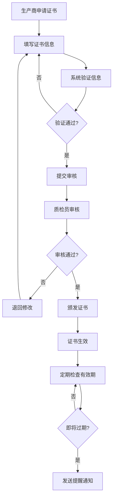
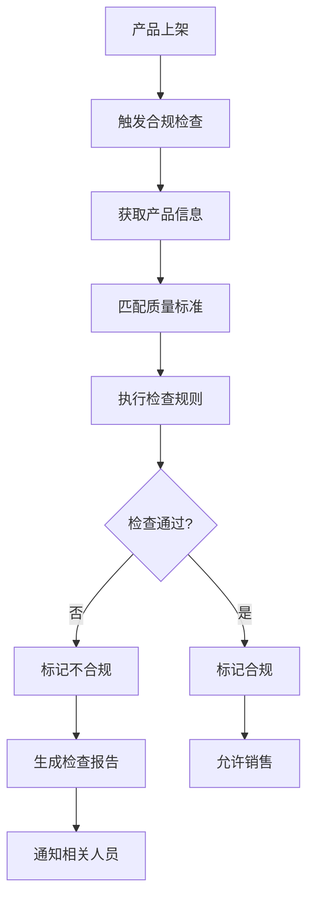

# 质量控制模块需求文档

## 文档信息
- **模块名称**: 质量控制模块 (Quality Control Module)
- **版本**: v1.0.0
- **创建时间**: 2024-01-20
- **负责人**: 系统架构师
- **审核状态**: 已完成  
👤 **需求方**: {业务方/产品经理}  

## 业务背景

### 业务目标
质量控制模块旨在建立完善的农产品质量认证和管理体系，通过系统化的质量控制流程，提升消费者对平台农产品的信任度，确保产品质量合规性，降低质量风险。

### 业务场景
1. **生产商质量认证**: 农产品生产商需要为其产品申请和管理各种质量认证证书
2. **消费者质量查询**: 消费者购买前需要查看产品的质量认证信息和检验报告
3. **平台合规监管**: 平台需要确保销售的农产品符合相关质量标准和法规要求
4. **供应链质量溯源**: 建立从原料到成品的完整质量溯源链条

### 成功指标
- **证书管理效率**: 证书处理时间从人工7天缩短到系统化1天
- **消费者信任度**: 通过质量展示功能提升消费者购买转化率20%
- **合规风险降低**: 质量相关投诉和退货率降低50%
- **运营成本节约**: 质量管理人工成本降低30%

## 功能需求

### 核心功能列表
| 功能ID | 功能名称 | 优先级 | 业务价值 | 验收标准 |
|--------|----------|--------|----------|----------|
| QC-F001 | 证书管理 | P0 | 核心业务支撑 | 支持完整的证书CRUD操作 |
| QC-F002 | 合规检查 | P1 | 风险控制 | 自动化合规检查准确率≥95% |
| QC-F003 | 溯源集成 | P1 | 质量追溯 | 与批次模块无缝集成 |
| QC-F004 | 消费者展示 | P2 | 用户体验提升 | 质量信息清晰展示 |
| QC-F005 | 证书验证 | P2 | 防伪保障 | 验证准确率100% |

### 详细功能描述

#### QC-F001: 证书管理
- **业务描述**: 为农产品生产商提供完整的质量证书管理功能，包括证书的申请、审核、颁发、更新和失效管理
- **用户故事**: 
  - 作为生产商，我希望能够在线申请质量证书，以便证明我的产品符合质量标准
  - 作为质检员，我希望能够审核和管理证书申请，以便确保证书的真实性和有效性
- **前置条件**: 
  - 生产商已完成平台注册和企业认证
  - 产品信息已录入产品目录系统
- **业务规则**: 
  - 规则1: 每个证书必须有唯一的序列号
  - 规则2: 证书必须设置有效期，过期自动失效
  - 规则3: 证书序列号格式必须符合规范（如：QC2024001）
  - 规则4: 同一产品可以拥有多个不同类型的质量证书
- **异常处理**: 
  - 证书序列号重复时提示错误并要求重新输入
  - 证书过期后自动标记为失效状态
  - 删除证书时进行关联检查，存在关联时禁止删除

#### QC-F002: 合规检查
- **业务描述**: 提供自动化的产品质量合规性检查功能，确保农产品符合国家、行业和企业质量标准
- **用户故事**: 
  - 作为质检人员，我希望系统能够自动检查产品是否符合相关标准，以便提高检查效率
  - 作为平台管理员，我希望能够配置不同的质量标准规则，以便适应不同产品类型
- **前置条件**: 
  - 质量标准库已建立和维护
  - 产品质量参数已录入系统
- **业务规则**: 
  - 规则1: 每个产品类别必须配置相应的质量标准
  - 规则2: 合规检查必须生成详细的检查报告
  - 规则3: 不合规产品自动标记并通知相关人员
- **异常处理**: 标准库更新时自动重新检查受影响的产品

#### QC-F003: 溯源集成
- **业务描述**: 与批次溯源模块深度集成，建立从原料到成品的完整质量溯源链条
- **用户故事**: 
  - 作为消费者，我希望能够查看产品的完整质量溯源信息，以便了解产品的质量保障
  - 作为监管人员，我希望在发现质量问题时能够快速追溯到源头，以便进行问题处理
- **业务规则**: 
  - 规则1: 质量证书必须与生产批次关联
  - 规则2: 溯源链条中的质量信息必须完整
  - 规则3: 质量问题发生时必须能够快速定位影响范围

## 非功能需求

### 性能要求
- **响应时间**: API接口响应时间<500ms (P95)，证书查询<200ms
- **并发用户**: 支持1000个并发用户同时访问
- **数据量**: 支持100万条证书记录，1000万次查询/天

### 可用性要求
- **系统可用性**: 99.9%（年停机时间不超过8.76小时）
- **故障恢复**: 系统故障后15分钟内恢复服务

### 安全要求
- **数据安全**: 证书数据AES-256加密存储，传输使用HTTPS
- **访问控制**: 基于角色的权限控制，操作日志完整记录

### 扩展性要求
- **用户增长**: 支持平台用户规模增长10倍
- **功能扩展**: 预留接口支持国际质量标准对接

## 业务约束

### 合规要求
- 必须符合《中华人民共和国食品安全法》相关条款
- 必须遵守《农产品质量安全法》的质量标准要求
- 必须符合《个人信息保护法》的数据保护规定
- 必须满足相关行业质量认证标准（如绿色食品、有机产品认证）

### 时间约束
- **交付时间**: 2024年Q1季度末（3月31日前）
- **里程碑**: 
  - 2024年1月31日: 证书管理功能完成
  - 2024年2月29日: 合规检查功能完成
  - 2024年3月15日: 集成测试完成
  - 2024年3月31日: 系统上线

### 资源约束
- **人力资源**: 开发团队3人，测试团队2人，产品经理1人
- **技术约束**: 必须基于现有技术栈（Python/FastAPI/MySQL/Redis）

## 用户角色和权限

### 用户角色定义
| 角色名称 | 角色描述 | 权限范围 |
|----------|----------|----------|
| 系统管理员 | 系统的最高权限管理者 | 所有功能的完全访问权限 |
| 质检管理员 | 负责质量标准和合规管理 | 证书审核、标准配置、合规检查 |
| 生产商 | 农产品生产企业用户 | 证书申请、查看自有证书 |
| 消费者 | 普通购买用户 | 查看公开的质量信息 |
| 平台客服 | 客户服务人员 | 协助用户处理证书相关问题 |

### 权限矩阵
| 功能 | 系统管理员 | 质检管理员 | 生产商 | 消费者 | 平台客服 |
|------|------------|------------|--------|--------|----------|
| 证书创建 | ✅ | ✅ | ✅ | ❌ | 🔍 |
| 证书审核 | ✅ | ✅ | ❌ | ❌ | 🔍 |
| 证书查看 | ✅ | ✅ | 🔍 | 🔍 | ✅ |
| 证书删除 | ✅ | ✅ | 🔍 | ❌ | ❌ |
| 标准配置 | ✅ | ✅ | ❌ | ❌ | ❌ |
| 合规检查 | ✅ | ✅ | 🔍 | ❌ | 🔍 |

*说明: ✅=完全权限, 🔍=仅自己相关数据, ❌=无权限*

## 业务流程

### 证书管理流程

### 合规检查流程

### 异常流程
- **证书过期处理**: 系统自动检测过期证书，发送邮件/短信提醒，标记证书状态为过期
- **合规检查失败**: 产品自动下架，生成详细报告，通知生产商和平台管理员
- **证书争议处理**: 建立申诉机制，由质检管理员重新审核，必要时联系第三方认证机构

## 数据需求

### 核心业务实体
| 实体名称 | 业务含义 | 核心属性 |
|----------|----------|----------|
| Certificate | 质量证书 | 序列号、名称、颁发机构、有效期、状态 |
| QualityStandard | 质量标准 | 标准编号、标准名称、适用范围、检查规则 |
| ComplianceCheck | 合规检查记录 | 产品ID、检查时间、检查结果、检查报告 |
| CertificateAudit | 证书审核记录 | 证书ID、审核人、审核时间、审核意见 |

### 数据规则
- **唯一性**: 证书序列号全局唯一，质量标准编号唯一
- **完整性**: 证书必须包含完整的基本信息和有效期
- **一致性**: 证书状态变更必须记录完整的审计日志

## 验收标准

### 功能验收
- [x] 证书CRUD操作功能完整且正常工作
- [x] 证书序列号唯一性验证正常
- [x] 分页查询功能正常，性能符合要求
- [ ] 证书到期提醒功能正常
- [ ] 合规检查引擎正确执行检查规则
- [ ] 与批次溯源模块集成接口正常
- [ ] 权限控制机制正确生效

### 性能验收
- [x] 单个API接口响应时间<500ms
- [ ] 1000并发用户负载测试通过
- [ ] 100万条证书记录查询性能正常
- [ ] 数据库查询优化效果验证

### 安全验收
- [ ] 数据加密存储验证通过
- [ ] 权限控制测试通过
- [ ] 操作审计日志完整记录
- [ ] 安全漏洞扫描通过

### 业务验收
- [ ] 业务流程端到端测试通过
- [ ] 用户角色权限验证正确
- [ ] 异常处理机制正常工作
- [ ] 业务规则正确执行

## 风险和依赖

### 业务风险
- **合规标准变更风险**: 国家质量标准可能发生变化
  - *缓解措施*: 设计可配置的规则引擎，支持标准的动态更新
- **用户接受度风险**: 生产商可能不愿意录入详细的质量信息
  - *缓解措施*: 提供激励机制，简化操作流程，加强用户培训
- **数据质量风险**: 证书信息可能存在虚假或错误
  - *缓解措施*: 建立严格的审核机制和定期核查制度

### 技术风险
- **性能风险**: 大量证书数据查询可能影响系统性能
  - *缓解措施*: 数据库索引优化，引入缓存机制
- **集成风险**: 与第三方认证机构API集成可能不稳定
  - *缓解措施*: 设计降级方案，建立重试机制

### 外部依赖
- **批次溯源模块**: 质量溯源功能依赖批次模块的数据接口
  - *影响*: 批次模块延期将影响溯源功能上线
- **产品目录模块**: 产品质量信息展示依赖产品基础数据
  - *影响*: 产品数据不完整将影响质量信息的准确展示
- **第三方认证机构**: 证书验证依赖认证机构的API接口
  - *影响*: 接口不可用将影响证书验证功能

## 变更记录

| 日期 | 版本 | 变更内容 | 变更人 |
|------|------|----------|--------|
| 2024-01-20 | v1.0 | 初始版本，完成核心需求定义 | 系统架构师 |
| 2024-01-25 | v1.1 | 补充用户角色和权限定义 | 产品经理 |
| 2024-02-01 | v1.2 | 完善业务流程和验收标准 | 系统架构师 |
