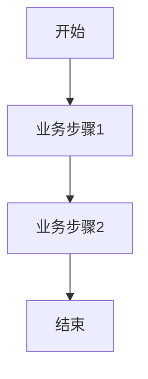

<!--
文档说明：
- 内容：模块业务需求文档模板
- 作用：记录业务需求、功能规格、验收标准
- 使用方法：详细记录业务需求，不包含技术实现
-->

# recommendation-system模块 - 业务需求文档

📅 **创建日期**: 2025-09-16  
👤 **需求方**: {业务方/产品经理}  
✅ **评审状态**: {待评审|已评审|已确认}  
🔄 **最后更新**: 2025-09-16  

## 业务背景

### 业务目标
{描述业务目标和预期价值}

### 业务场景
{描述核心业务场景和用户故事}

### 成功指标
- {指标1}: {具体数值目标}
- {指标2}: {具体数值目标}

## 功能需求

### 核心功能列表
| 功能ID | 功能名称 | 优先级 | 业务价值 | 验收标准 |
|--------|----------|--------|----------|----------|
| {MODULE}-F001 | {功能名称} | 高 | {业务价值} | {验收标准} |
| {MODULE}-F002 | {功能名称} | 中 | {业务价值} | {验收标准} |

### 详细功能描述

#### {MODULE}-F001: {功能名称}
- **业务描述**: {详细的业务描述}
- **用户故事**: 作为{角色}，我希望{功能}，以便{价值}
- **前置条件**: {前置条件}
- **业务规则**: 
  - 规则1: {具体规则}
  - 规则2: {具体规则}
- **异常处理**: {异常情况和处理方式}

## 非功能需求

### 性能要求
- **响应时间**: {具体要求}
- **并发用户**: {具体数量}
- **数据量**: {预期数据量}

### 可用性要求
- **系统可用性**: {可用性指标}
- **故障恢复**: {恢复时间要求}

### 安全要求
- **数据安全**: {安全要求}
- **访问控制**: {权限要求}

### 扩展性要求
- **用户增长**: {用户增长预期}
- **功能扩展**: {扩展方向}

## 业务约束

### 合规要求
- {合规要求1}
- {合规要求2}

### 时间约束
- **交付时间**: {具体时间}
- **里程碑**: {关键时间节点}

### 资源约束
- **人力资源**: {资源限制}
- **技术约束**: {技术限制}

## 用户角色和权限

### 用户角色定义
| 角色名称 | 角色描述 | 权限范围 |
|----------|----------|----------|
| {角色1} | {角色描述} | {权限列表} |
| {角色2} | {角色描述} | {权限列表} |

### 权限矩阵
| 功能 | {角色1} | {角色2} | {角色3} |
|------|---------|---------|---------|
| {功能1} | ✅ | ❌ | 🔍 |
| {功能2} | ✅ | ✅ | ❌ |

## 业务流程

### 主要业务流程

### 异常流程
- **异常1**: {异常描述和处理流程}
- **异常2**: {异常描述和处理流程}

## 数据需求

### 核心业务实体
| 实体名称 | 业务含义 | 核心属性 |
|----------|----------|----------|
| {实体1} | {业务含义} | {属性列表} |
| {实体2} | {业务含义} | {属性列表} |

### 数据规则
- **唯一性**: {唯一性要求}
- **完整性**: {完整性要求}
- **一致性**: {一致性要求}

## 验收标准

### 功能验收
- [ ] {验收项1}
- [ ] {验收项2}
- [ ] {验收项3}

### 性能验收
- [ ] {性能指标1}
- [ ] {性能指标2}

### 安全验收
- [ ] {安全要求1}
- [ ] {安全要求2}

## 风险和依赖

### 业务风险
- **风险1**: {风险描述和缓解措施}
- **风险2**: {风险描述和缓解措施}

### 外部依赖
- **依赖1**: {依赖描述和影响}
- **依赖2**: {依赖描述和影响}

## 变更记录

| 日期 | 版本 | 变更内容 | 变更人 |
|------|------|----------|--------|
| 2025-09-16 | v1.0 | 初始版本 | {姓名} |
