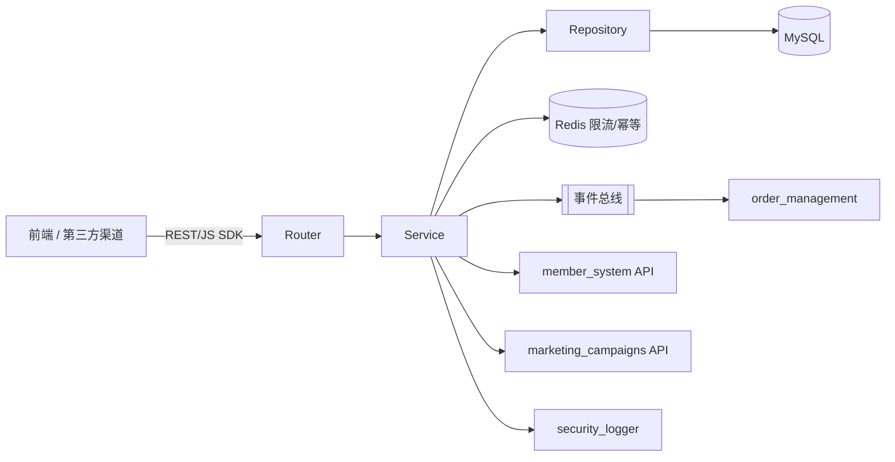
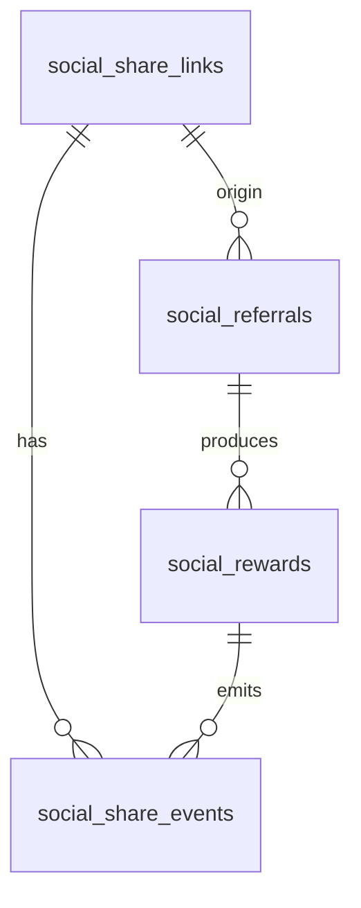
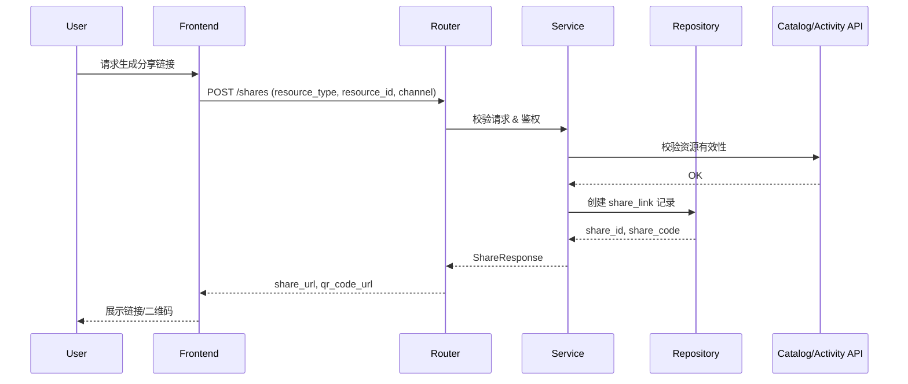
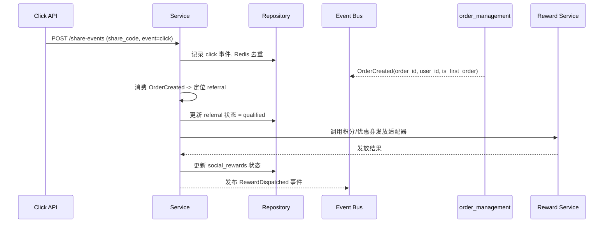
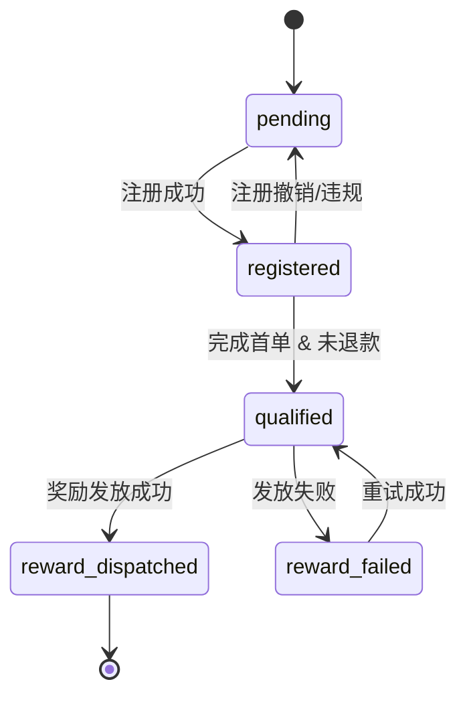

# social-features 模块 - 技术设计文档

📅 **创建日期**: 2025-10-25  
👤 **设计者**: GitHub Copilot  
✅ **评审状态**: 待评审  
🔄 **最后更新**: 2025-10-25

---

## 1. 引言

### 1.1 设计目标

1. **闭环驱动**：实现“分享 → 事件采集 → 奖励判定 → 奖励履约”完整链路，满足 `requirements.md` 中 `REQ-social-features-001~004`。
2. **边界清晰**：严格遵循营销域职责，通过 API / 事件与外部模块交互，杜绝跨表访问。
3. **扩展友好**：采用模块化单体分层结构，未来可平滑拆分为独立微服务。
4. **可靠可观测**：内置幂等、重试、审计日志、指标采集，满足合规和运维需求。

### 1.2 设计范围

- **范围内**：分享链接管理、事件采集、邀请关系、奖励协调、运营指标、风控限流
- **范围外**：优惠券/积分实际发放、通知推送、复杂风控模型（通过外部模块完成）

### 1.3 参考文档

- `docs/requirements/functional.md §13` – 社交购物功能需求
- `docs/standards/api-standards.md`、`docs/standards/database-standards.md`
- `docs/architecture/application-architecture.md` – 模块依赖与分层要求
- `docs/standards/performance-standards.md` – 性能指标基线

---

## 2. 设计概览

### 2.1 架构概述



- **Router 层**：定义 `/api/v1/social-features` 路由，完成鉴权、请求体验证、统一响应包装。
- **Service 层**：处理业务编排（分享生命周期、邀请判定、奖励协调、风控限流、事件发布）。
- **Repository 层**：封装 SQLAlchemy CRUD，保障事务一致性，提供批量写入、分页查询等能力。
- **Model 层**：继承统一 Base，定义 ORM 模型与索引；使用 Alembic 管理迁移。
- **缓存/限流**：Redis 用于分享点击去重、限流计数、奖励幂等锁。
- **事件驱动**：通过事件总线消费注册/订单事件，发布奖励完成事件供通知模块订阅。

### 2.2 模块边界分析

```markdown
## social-features 模块边界自检

### 数据模型检查
- [x] 所有模型字段仅描述分享、邀请、奖励业务
- [x] 未包含商品、订单、会员等其他模块的私有字段
- [x] 外键仅引用本模块主键，跨模块关系通过 ID + 事件维护

### 业务逻辑检查
- [x] 分享、邀请、奖励判定均在模块职责内
- [x] 不直接实现优惠券发放、积分结算等他域业务
- [x] 跨模块交互统一使用 API/事件

### API接口检查
- [x] 所有端点前缀 `/api/v1/social-features`
- [x] 未暴露他域职责的接口
- [x] 响应仅包含模块内管理的数据

### 依赖关系检查
- [x] 依赖方向与 application-architecture.md 一致
- [x] 无反向依赖或循环依赖
- [x] 仅依赖必要核心组件（database、redis、auth）
```

### 2.3 设计原则

- **单一职责**：Router 与 Service 分离，Repository 只负责数据访问。
- **开放封闭**：奖励类型通过策略/映射扩展，新活动在不改核心代码的情况下配置。
- **依赖倒置**：Service 依赖抽象接口（Repository、发放适配器、事件发送器）。
- **文档驱动**：所有命名、接口、模型均在文档中先定义再开发。
- **可观测性**：关键流程打点（Prometheus 指标）、审计日志、可追踪 request_id。

### 2.4 关键设计决策

| 决策点 | 方案 | 理由 | 替代方案 |
|--------|------|------|----------|
| 奖励发放方式 | 适配器调用外部 API + 幂等锁 | 与现有模块解耦，易于扩展积分/优惠券/余额 | 通过数据库触发器调用（耦合严重） |
| 分享事件采集 | REST 接口 + Redis 去重 | 兼容 Web/App/H5，多渠道接入简单 | 仅依赖埋点服务（需额外组件） |
| 指标统计 | 日快照表 + 实时查询 | 平衡实时性与性能，可离线生成报表 | 仅实时聚合（高负载） |
| 风控限流 | Redis 计数 + 配置中心阈值 | 快速调节阈值，支持分渠道 | 数据库计数（锁冲突严重） |

---

## 3. 数据模型设计

### 3.1 数据字典

| 表名 | 说明 | 关键字段 | 备注 |
|------|------|----------|------|
| `social_share_links` | 分享链接主表 | `share_code (unique)`、`user_id`、`resource_type`、`resource_id`、`channel`、`status`、`expires_at` | 记录分享来源及有效期 |
| `social_share_events` | 分享及转化事件表 | `share_id`、`event_type`、`actor_user_id`、`session_id`、`order_id`、`metadata` | 存储 click/register/first_order 等事件 |
| `social_referrals` | 邀请关系表 | `inviter_user_id`、`invitee_user_id`、`share_id`、`status`、`first_order_id`、`reward_id` | 维护邀请状态机 |
| `social_rewards` | 奖励履约记录 | `reward_code`、`reward_type`、`value`、`status`、`external_reference` | 与积分/优惠券模块对账 |
| `social_share_daily_stats` | 日统计快照表 | `stat_date`、`channel`、`resource_type`、`resource_id`、`share_count`、`click_count`、`register_count`、`first_order_count`、`reward_cost` | 供运营报表使用 |

### 3.2 字段定义与约束

**social_share_links**

- 主键：`id` INTEGER 自增
- 索引：
    - `uq_share_code` 唯一索引
    - `idx_share_links_user_resource` (`user_id`, `resource_type`, `resource_id`)
    - `idx_share_links_status_expires` (`status`, `expires_at`)
- 关键字段：
    - `share_code` VARCHAR(32) – 生成的唯一短码（base62）
    - `share_url` VARCHAR(512)
    - `channel` ENUM('wechat','moments','copy_link','qrcode','mini_program')
    - `status` ENUM('active','disabled','expired')

**social_share_events**

- 主键：`id` BIGINT 自增
- 索引：
    - `idx_events_share_event_type` (`share_id`, `event_type`, `occurred_at`)
    - `idx_events_session_type` (`session_id`, `event_type`)
    - `idx_events_order` (`order_id`)
- 事件类型：`event_type` ENUM('click','register','first_order','reward_granted','reward_failed')
- `metadata` JSON – 存储 UA、IP、设备指纹等

**social_referrals**

- 主键：`id`
- 索引：
    - `uq_invitee` (`invitee_user_id`) 保证单一邀请归属
    - `idx_inviter_status` (`inviter_user_id`, `status`)
- 状态枚举：`status` ENUM('pending','registered','qualified','reward_dispatched','reward_failed')
- 软删除：`deleted_at`（默认为 NULL）

**social_rewards**

- 主键：`id`
- 索引：`uq_reward_code`、`idx_reward_status`
- `reward_type` ENUM('points','coupon','balance','gift')
- `status` ENUM('pending','processing','succeeded','failed','cancelled')
- `retry_count` INT – 默认 0，失败后递增

**social_share_daily_stats**

- 主键：`id`
- 唯一约束：`uq_stats_date_channel_resource` (`stat_date`,`channel`,`resource_type`,`resource_id`)
- 核心字段：`share_count`、`click_count`、`register_count`、`first_order_count`、`reward_cost_cents`

### 3.3 实体关系



- `social_share_events.share_id` 外键引用 `social_share_links.id`
- `social_referrals.share_id` 可为 NULL（例如通过邀请码注册）
- `social_rewards.referral_id`（待添加）绑定奖励来源
- 统计表通过 ETL 任务从事件表聚合生成

### 3.4 迁移计划

- 新建上述 5 张表，使用 Alembic 生成迁移脚本 `V20251025_social_features_init`
- 添加必要的检查约束与默认值
- 建立初始配置表（可选）存储限流阈值、奖励策略映射

---

## 4. 业务流程设计

### 4.1 分享链接创建流程



### 4.2 分享事件与奖励流程



### 4.3 邀请关系状态机



状态机实现位于 `ReferralService`，通过显式方法控制状态流转并写入审计日志，非法流转抛出 `ReferralStateException`。

---

## 5. 接口设计

### 5.1 REST API 概览

| 方法 | 路径 | 描述 | 认证 | 参考 REQ |
|------|------|------|------|----------|
| POST | `/api/v1/social-features/shares` | 创建分享链接 | Bearer | REQ-001 |
| GET | `/api/v1/social-features/shares` | 查询我的分享链接列表 | Bearer | REQ-001 |
| GET | `/api/v1/social-features/shares/{share_id}` | 获取分享详情与统计 | Bearer | REQ-002 |
| POST | `/api/v1/social-features/share-events` | 记录分享事件（匿名可用） | Optional | REQ-002 |
| POST | `/api/v1/social-features/referrals` | 记录邀请注册事件（后台调用） | Bearer(服务) | REQ-003 |
| PATCH | `/api/v1/social-features/referrals/{referral_id}/status` | 人工纠偏邀请状态 | Bearer(管理员) | REQ-003 |
| GET | `/api/v1/social-features/rewards/pending` | 查询待领取奖励 | Bearer | REQ-004 |
| POST | `/api/v1/social-features/rewards/{reward_id}/claim` | 用户主动领取奖励 | Bearer | REQ-004 |
| GET | `/api/v1/social-features/admin/metrics/daily` | 运营指标查询 | Bearer(管理员) | REQ-006 |
| GET | `/api/v1/social-features/admin/violations` | 违规分享列表 | Bearer(管理员) | REQ-005 |

详细请求/响应体见 `api-spec.md`。

### 5.2 Pydantic 模型

- `ShareCreateRequest`, `ShareResponse`, `ShareListResponse`
- `ShareEventCreateRequest`（支持匿名，上报 share_code + event_type + client 元信息）
- `ReferralUpsertRequest`, `ReferralResponse`
- `RewardClaimRequest`, `RewardResponse`
- `DailyMetricsResponse`, `ViolationRecord`

所有模型使用 Pydantic v2 TypedDict/FieldValidationInfo 实现字段验证与派生字段（如 share_url 拼接）。

### 5.3 事件契约

- **订阅**
    - `UserRegistered`：字段 `user_id`, `source_share_code`
    - `OrderCompleted`：字段 `order_id`, `user_id`, `is_first_order`, `total_amount`, `share_code`
- **发布**
    - `RewardDispatched`：字段 `reward_id`, `referral_id`, `reward_type`, `status`
    - `ShareLinkDisabled`：字段 `share_id`, `reason`

事件格式遵循 `docs/architecture/integration.md`，通过统一事件发布器封装。消费端需实现幂等处理。

---

## 6. 安全与合规设计

1. **认证与权限**
     - 默认使用 JWT Bearer；管理员接口需额外角色校验 (`role=admin`)
     - 匿名事件接口仅允许 `event_type=click`，并对请求频率限流
2. **输入校验**
     - 所有请求通过 Pydantic 模型校验资源类型、渠道、日期范围等
     - 自定义验证器防止 share_code 注入、XSS
3. **风控与限流**
     - Redis 计数器 + Lua 脚本实现滑动窗口限流
     - 黑名单名单缓存到 Redis，命中后直接拒绝请求
4. **数据安全**
     - IP、UA 信息存储在 JSON 字段，敏感字段（如手机号摘要）使用 SHA256
     - 审计日志通过 `security_logger` 记录操作类型、操作者、结果
5. **合规**
     - 分享文案与素材审批由运营侧负责，系统保留操作记录
     - 提供数据导出接口满足用户数据访问请求（GDPR-like）

---

## 7. 性能与扩展考量

- **响应性能**：核心接口目标 P95 < 300ms；长耗时操作（统计导出）通过后台任务（Celery）执行。
- **数据库优化**：
    - 高频查询使用覆盖索引（如 `idx_events_share_event_type`）
    - 使用分页游标（基于 `id`）而非 offset，提高滚动查询效率
- **缓存策略**：
    - 热门 share 链接缓存 5 分钟；ip/session 去重缓存 5 分钟
    - 指标查询优先读取日快照；实时指标通过 Redis Pipeline
- **异步任务**：
    - 奖励发放、导出任务、失败重试使用 Celery 队列 `social_features.reward`
    - 事件消费采用 FastAPI BackgroundTask + Celery 结合
- **可扩展性**：
    - Service 层逻辑可拆分为 `ShareService`, `ReferralService`, `RewardService`
    - 奖励策略使用策略模式，未来新增奖励类型无需修改主流程
- **监控指标**：
    - `social_features_share_created_total`
    - `social_features_reward_latency_seconds`
    - `social_features_referral_state_transitions_total`
    - 通过 Prometheus 导出并在 Grafana 建立仪表板

---

## 8. 变更影响与实施计划

### 8.1 对现有系统的影响

- **数据库**：新增 5 张表，需更新 Alembic 迁移并在测试/预发/生产执行
- **配置**：新增限流、奖励策略配置项，需在配置中心登记
- **依赖模块**：
    - 与 `order_management`、`member_system`、`marketing_campaigns` 对齐事件/接口参数
    - 通知服务需订阅 `RewardDispatched`

### 8.2 测试计划

- 单元测试：覆盖 Service/Repository 关键分支，目标覆盖率 ≥ 85%
- 集成测试：使用 pytest + TestClient 验证主要 API、事件流程
- 性能测试：`tests/performance/test_social_features_performance.py` （待新增）模拟高并发分享点击
- 安全测试：注入/越权/限流等场景验证

### 8.3 上线步骤

1. 合并数据库迁移脚本并执行
2. 部署新代码，开启特性开关 `SOCIAL_FEATURES_ENABLED`
3. 初始化限流阈值、奖励策略配置
4. 回放测试数据（灰度环境）验证指标
5. 正式开启功能，并监控 24 小时

### 8.4 未决事项

- 风控黑名单服务接口待 `risk_control_system` 提供（临时采用配置文件）
- 数据导出超过 100MB 时的处理方案待与数据团队确认

---

## 9. 变更记录

| 日期 | 版本 | 变更内容 | 变更人 |
|------|------|----------|--------|
| 2025-10-25 | v1.0 | 初稿：完成 A8 设计、数据模型、流程与安全性能分析 | GitHub Copilot |
