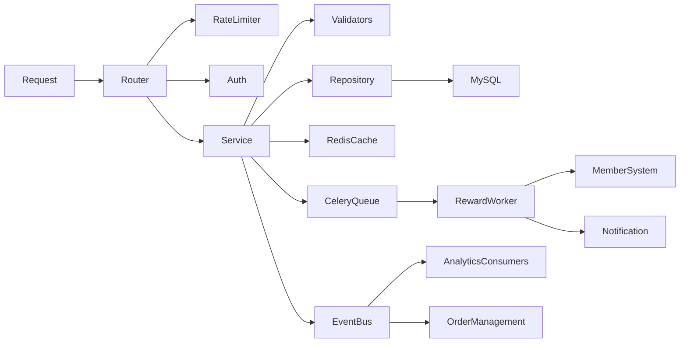
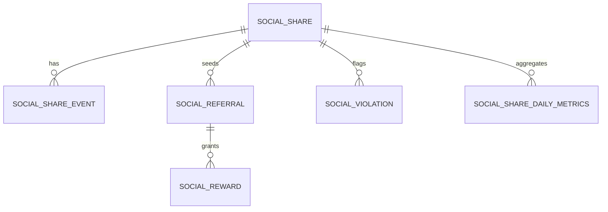
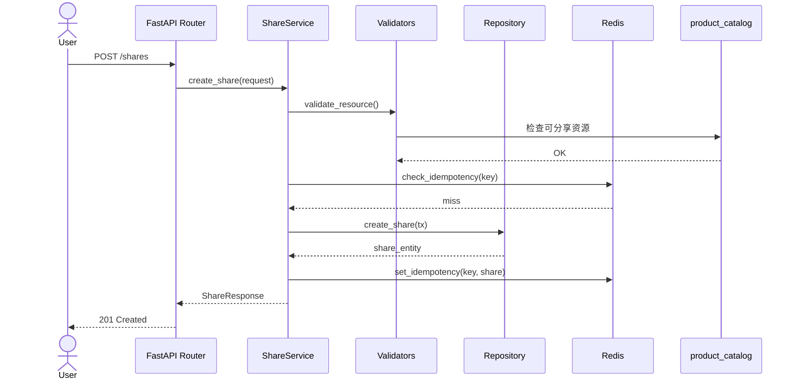
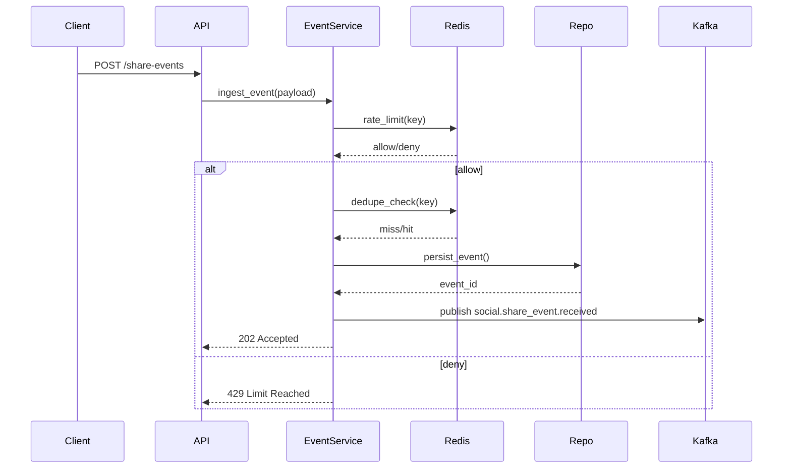
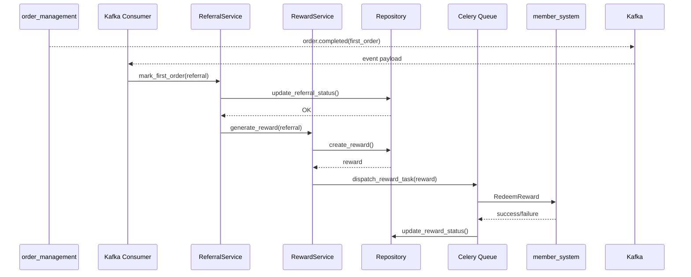

# social-features 模块 - 技术设计

📅 **创建日期**: 2025-10-18  
👤 **设计负责人**: Chen Hao  
✅ **评审状态**: 2025-10-24 设计评审通过（会议记录 #DESIGN-2025-10-24）  
🔄 **最后更新**: 2025-10-25  

## 1. 设计概述

- **设计目标**:
    1. 满足 [requirements.md](./requirements.md) 中 `REQ-SOCIAL-001`~`REQ-SOCIAL-006` 的功能诉求。
    2. 确保分享事件高并发写入场景下的数据一致性与反作弊能力。
    3. 打通奖励发放全链路并落实可观测性与可回滚方案。
- **约束条件**: 复用现有 FastAPI 模块化架构；数据库使用 MySQL 8.0；事件总线统一走 Kafka；异步执行框架采用现有 Celery 集群。
- **设计原则**: 领域职责清晰、接口幂等、可观测、易扩展、优先异步化写入。

## 2. 架构概览

### 2.1 模块分层

| 层级 | 主要构件 | 说明 |
|------|----------|------|
| API 层 (`router.py`) | FastAPI 路由、依赖、权限 | 解析请求、鉴权、注入服务与限流器 |
| 服务层 (`service.py`) | `ShareService`, `EventService`, `ReferralService`, `RewardService`, `MetricsService` | 实现业务流程、规则校验、幂等控制 |
| 领域校验层 (`validators.py`) | 资源白名单、反作弊、活动策略 | 对外部依赖结果进行组合校验 |
| 仓储层 (`repository.py`) | SQLAlchemy async session | 提供原子事务、查询优化、批量写入 |
| 异步层 (`tasks.py`) | Celery 任务 | 奖励补偿、指标刷新、违规回查 |
| 事件层 (`events.py`) | Kafka producer/consumer | 分享事件、奖励结果事件发布与订阅 |

### 2.2 组件关系图

### 2.3 关键设计决策

| 决策点 | 选定方案 | 理由 | 替代方案 |
|--------|----------|------|----------|
| 分享事件去重 | Redis Set + TTL（Key=share_code:session:event_type） | 写性能高、天然过期、满足去重窗口 ≤ 24h | MySQL 唯一索引 (写放大大) |
| 邀请绑定策略 | 最早有效点击优先 + 冲突记录 | 与业务规则一致，便于审计 | 随机分配或最后点击 |
| 奖励发放 | 同步写记录 + 异步调用 member_system | 降低 API 响应时间，易做补偿 | API 同步调用（影响延迟） |
| 指标产出 | MySQL 物化视图 + Celery 定时刷新 | 减少复杂 SQL，满足运维查询性能 | 实时 BI 聚合（开发周期长） |
| 风控规则 | 配置化规则引擎 + Redis 计数 + 黑名单 | 快速调整、高并发友好 | 仅依赖第三方风控（耗费较大） |

## 3. 数据模型

### 3.1 实体关系图

### 3.2 数据字典（节选）

| 表 | 字段 | 类型 | 约束 | 说明 |
|----|------|------|------|------|
| `social_share` | `id` | BIGINT | PK | 自增主键 |
|  | `share_code` | CHAR(8) | UNIQUE | 雪花算法生成，用户可见 |
|  | `user_id` | BIGINT | NOT NULL, INDEX | 分享发起人 |
|  | `resource_type` | VARCHAR(32) | NOT NULL | `product`/`campaign`/`landing_page` |
|  | `resource_id` | VARCHAR(64) | NOT NULL, INDEX | 外部资源标识 |
|  | `channel` | VARCHAR(32) | NOT NULL | 分享渠道 |
|  | `status` | VARCHAR(16) | NOT NULL | `active`/`expired`/`revoked` |
|  | `expires_at` | DATETIME | NOT NULL | 过期时间 |
|  | `metadata` | JSON | NULL | 自定义字段 |
| `social_share_event` | `id` | BIGINT | PK | |
|  | `share_id` | BIGINT | FK -> social_share.id | |
|  | `event_type` | VARCHAR(16) | NOT NULL | `click`/`register`/`first_order` |
|  | `session_id` | VARCHAR(64) | NOT NULL | 去重标识 |
|  | `actor_user_id` | BIGINT | NULL | 参与用户 |
|  | `order_id` | BIGINT | NULL | 首购订单 |
|  | `client_ip` | VARBINARY(16) | NOT NULL | IP (IPv4/6) |
|  | `user_agent_hash` | CHAR(40) | NOT NULL | HASH(UA) |
|  | `deduplicated` | TINYINT | 默认 0 | 是否命中去重 |
|  | `occurred_at` | DATETIME | NOT NULL | 事件时间 |
| `social_referral` | `id` | BIGINT | PK | |
|  | `inviter_user_id` | BIGINT | NOT NULL | 邀请人 |
|  | `invitee_user_id` | BIGINT | UNIQUE | 被邀请人（唯一约束） |
|  | `share_id` | BIGINT | FK -> social_share.id | |
|  | `activity_id` | VARCHAR(32) | NOT NULL | 活动配置引用 |
|  | `status` | VARCHAR(16) | NOT NULL | `pending`/`registered`/`first_order`/`blocked`/`closed` |
|  | `first_order_id` | BIGINT | NULL | 首购订单 |
|  | `blocked_reason` | VARCHAR(128) | NULL | 违规原因码 |
| `social_reward` | `id` | BIGINT | PK | |
|  | `referral_id` | BIGINT | FK -> social_referral.id | |
|  | `reward_type` | VARCHAR(16) | NOT NULL | `points`/`coupon`/`cashback` |
|  | `value` | DECIMAL(12,2) | NOT NULL | 奖励值 |
|  | `currency` | VARCHAR(8) | 默认 `CNY` | |
|  | `status` | VARCHAR(16) | NOT NULL | `pending`/`available`/`claimed`/`blocked`/`failed` |
|  | `external_ref` | VARCHAR(64) | NULL | member_system 回执 |
|  | `available_at` | DATETIME | NULL | 可领取时间 |
|  | `claimed_at` | DATETIME | NULL | 领取时间 |
| `social_violation` | `id` | BIGINT | PK | |
|  | `share_id` | BIGINT | FK -> social_share.id | |
|  | `rule_code` | VARCHAR(32) | NOT NULL | 命中规则 |
|  | `severity` | VARCHAR(16) | NOT NULL | `high`/`medium`/`low` |
|  | `status` | VARCHAR(16) | NOT NULL | `open`/`resolved` |
|  | `memo` | TEXT | NULL | 备注 |

### 3.3 索引策略

- `social_share`：组合索引 `(user_id, status, expires_at)` 支撑列表查询；`share_code` 唯一索引。
- `social_share_event`：组合索引 `(share_id, event_type, occurred_at)`；`session_id` 单列索引支撑去重查询。
- `social_referral`：唯一索引 `invitee_user_id`；组合索引 `(inviter_user_id, status)`。
- `social_reward`：组合索引 `(status, available_at)`，支持查询待领取/待补偿。
- 建议 MySQL 表使用 InnoDB，字符集 `utf8mb4`。

## 4. 核心流程设计

### 4.1 分享创建流程（REQ-SOCIAL-001）

### 4.2 分享事件采集流程（REQ-SOCIAL-002）

### 4.3 邀请绑定与奖励发放（REQ-SOCIAL-003/004）

### 4.4 运营指标生成（REQ-SOCIAL-005）

1. 每 5 分钟通过 Celery Beat 触发增量聚合任务 `aggregate_share_metrics`。
2. 任务读取 `social_share_event`、`social_referral`、`social_reward`，更新物化视图 `social_share_daily_metrics`。
3. 生成数据推送至 Kafka topic `social.feature.metrics`，供 BI 消费。
4. 管理员 API `/admin/metrics/daily` 查询视图，支持分页与过滤。

### 4.5 违规检测（REQ-SOCIAL-006）

- 在事件写入后执行 `validators.detect_anomalies`：包括 IP 频率、设备黑名单、分享黑名单。
- 命中时写入 `social_violation`，若严重则自动将关联奖励标记为 `blocked`。
- 提供 Celery 异步任务每日扫描并重新评估存在争议的记录。

## 5. 接口设计概述

- REST API 定义详见 [api-spec.md](./api-spec.md)。
- 核心端点：`POST /shares`, `GET /shares`, `POST /share-events`, `POST /referrals`, `POST /rewards/{id}/claim`, `GET /admin/metrics/daily`, `GET /admin/violations`。
- 幂等策略：
    - `POST /shares` 要求客户端提供 `Idempotency-Key`；服务器在 Redis 记录 24 小时。
    - `POST /share-events` 采用 session + event_type 去重，重复请求返回 `deduplicated=true`。
- 错误码：`SOCIAL_100`~`SOCIAL_500`，分类参见 API 规范与 Exception 类定义。

## 6. 集成与依赖

### 6.1 外部模块交互

| 模块 | 接入方式 | 用途 | 超时/重试 |
|------|----------|------|-----------|
| `user_auth` | FastAPI 依赖 `get_current_user` | JWT 鉴权，返回 `UserContext` | 同步，超时 1s |
| `product_catalog` | 内部 gRPC 客户端 | 校验资源状态、渠道限制 | 3 次重试，指数退避 |
| `marketing_campaigns` | REST | 获取奖励策略、活动配置 | 缓存 60s，失败 fallback 最近成功配置 |
| `order_management` | Kafka topic `order.completed` | 首购事件 | 消费者自动提交 offset |
| `member_system` | gRPC `RedeemReward` | 奖励发放 | 5 次重试 + Celery 补偿 |
| `notification_service` | REST | 奖励到账推送 | 失败走补偿任务 |

### 6.2 事件契约

- **发布**:
    - `social.share_event.received`: 事件 ID、share_code、event_type、occurred_at、deduplicated。
    - `social.reward.status_changed`: reward_id、status、reason、external_ref。
- **订阅**:
    - `order.completed` (来自 order_management)。
    - `member.reward.failed` (来自 member_system，触发补偿流程)。

事件格式使用 Avro Schema，版本管理存放于 `docs/standards/event-contracts.md`。

## 7. 安全与访问控制

- **认证**: 统一使用 JWT；匿名事件接口仅限 `POST /share-events`，仍需记录 client fingerprint。
- **授权**: 使用 `app.shared.security.permissions.require_role` 检查运营与管理员权限。
- **速率限制**: 
    - 用户 API：`RateLimiter(user_id, 60 req/min)`。
    - 匿名事件：`RateLimiter(client_fingerprint, 150 req/5min)`。
- **审计日志**: 邀请人工调整、奖励人工处理写入 `audit_log` 表。
- **数据保护**: `client_ip` 使用 VARBINARY 以支持 IPv6；在日志中脱敏展示。

## 8. 性能与扩展性

- 事件写入采用批量提交：`EventService` 将多条事件组合事务写入（批大小 50）。
- 缓存策略：
    - 分享资源白名单缓存至 Redis，TTL 5 分钟。
    - 奖励策略缓存至 Redis，TTL 同活动结束时间。
- 数据库连接池：AsyncEngine pool size=20，max overflow=40；提供连接重试。
- 横向扩展：API 与 Celery worker 均可多实例部署；Redis cluster 模式支持。
- 降级策略：
    - 当 `member_system` 不可用时，奖励状态标记为 `pending_retry` 并发送告警。
    - 指标聚合失败则标记上一批次数据，并在后台提示“数据生成中”。

## 9. 可观测性

- **日志**: 采用结构化日志，字段包含 `request_id`, `user_id`, `share_code`, `event_type`, `reward_id`。
- **指标**:
    - `social_features_share_created_total`
    - `social_features_share_rate_limit_rejections_total`
    - `social_features_reward_latency_seconds`
    - `social_features_reward_retry_total`
- **追踪**: 接入 OpenTelemetry，关键链路：分享创建、事件处理、奖励发放。
- **告警**:
    - 奖励发放 5 分钟内失败率 > 2%。
    - Redis 去重命中率 < 60%（可能异常）。
    - Kafka 消费滞后 > 120s。

## 10. 迁移与上线策略

- **迁移脚本**: 见 `alembic/versions/20251105_social_features_init.py`（建表）与 `20251108_social_features_metrics.py`（视图/索引）。
- **数据回填**: 上线前执行脚本 `tools/backfill_social_features.py` 将现有分享数据迁移至新表。
- **灰度发布**: 第一阶段仅开放 10% 用户的分享入口，监控指标稳定后扩容。
- **回滚策略**: 保留旧分享服务，若发现重大问题，切换 feature flag 返回旧流程，同时保留数据库写入，以便复盘。

## 11. 风险与缓解

| 风险 | 描述 | 缓解措施 |
|------|------|----------|
| 共享 Redis 限流误伤 | 高峰期导致正常用户被限流 | 动态阈值调节 + 白名单；命中阈值触发告警 |
| Kafka 消费滞后 | 影响指标准时性 | 实现 lag 监控 + 自动扩容消费者 |
| member_system 接口变更 | 协议不兼容导致奖励失败 | 订阅接口版本变更通知，预留适配层 |
| Celery 任务堆积 | 奖励补偿延迟 | 配置队列优先级，任务超时后报警并可手动触发 |

## 12. 开放问题

- 奖励策略中“阶梯奖励”与“团队奖励”尚未纳入范围，需要在下一阶段设计；对应需求将在 `REQ-SOCIAL-007` 立项。
- 数据分析团队希望实时指标（< 5 分钟延迟），当前方案为 5 分钟批次，需要后续评估。

## 13. 变更记录

| 日期 | 版本 | 变更内容 | 责任人 |
|------|------|----------|--------|
| 2025-10-18 | v0.2 | 初始设计草案 | Chen Hao |
| 2025-10-21 | v0.3 | 增加数据模型、流程图 | Chen Hao |
| 2025-10-24 | v0.3.5 | 设计评审反馈：调整奖励异步流程 | Growth Tech Review |
| 2025-10-25 | v0.4.0 | 对齐标准 v3，补充性能、安全、迁移策略 | Chen Hao |
