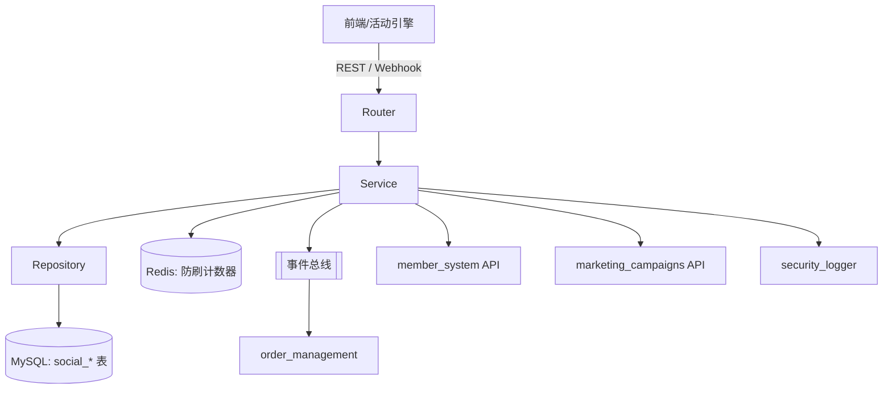

<!--
文档说明：
- 内容：模块文档标准模板，用于创建新的模块文档  
- 使用方法：复制此模板，替换模板变量，填入具体内容
- 更新方法：模板规范变更时由架构师更新
- 引用关系：被所有模块文档使用
- 更新频率：模板标准变化时

⚠️ 强制文档要求：
每个模块必须包含以下7个文档（无可选项）：
1. README.md - 模块导航（简洁版入口）
2. overview.md - 模块概述（本模板，详细版）
3. requirements.md - 业务需求文档（强制）
4. design.md - 设计决策文档（强制）
5. api-spec.md - API规范文档（强制）
6. api-implementation.md - API实施记录（强制）
7. implementation.md - 实现细节文档（强制）
-->

# social-features 模块概览

📝 **状态**: 设计完成（等待实现）  
📅 **创建日期**: 2025-10-25  
👤 **负责人**: Growth Experience 团队  
🔄 **最后更新**: 2025-10-25  
📋 **版本**: v1.0.0

## 1. 模块概述

social-features 模块是营销域的社交增长引擎，负责统一管理“分享 → 邀请 → 转化 → 奖励”闭环。模块通过标准化的数据模型和 REST API，支撑商品、活动、落地页等不同入口的分享需求，并将行为事件沉淀为可追踪的指标。设计遵循模块化单体架构要求，提供 Router → Service → Repository → Model 四层实现，支持后续向独立服务演进。

## 2. 主要职责

- 生成、维护带追踪参数的分享链接及二维码元数据
- 采集分享点击、注册、首次下单等事件，构建分享/邀请关系链
- 依据业务规则判定奖励达成条件，并协调积分、优惠券等奖励发放
- 输出日常监控、运营看板所需的统计指标和导出数据
- 提供异常检测与封禁能力，防止刷量、恶意推广

## 3. 业务价值

- **核心价值**: 为营销团队提供可配置、可追溯的社交裂变工具，加速用户拉新与转化
- **用户收益**: 清晰透明的邀请奖励流程，让邀请人与被邀请人都能及时获知奖励状态
- **系统收益**: 将社交玩法从页面逻辑剥离为独立模块，减少重复实现并确保跨渠道数据一致
- **量化目标（MVP）**: 分享链接生成平均 < 300ms，奖励发放延迟 < 5 分钟，分享转化链路完整度 ≥ 99%

## 4. 模块边界

**包含功能**

- 分享链接与短码管理、渠道元数据维护
- 分享事件与转化事件采集、存储、审计
- 邀请关系、奖励触发条件、奖励履约状态管理
- 日常指标统计、运营看板查询、导出接口

**排除功能**

- 优惠券和积分的具体发放逻辑（由 `marketing_campaigns`、`member_system` 实施）
- 商品、活动等被分享内容的创建与内容管理（由各业务模块负责）
- 推送通知、消息发送（由 `notification_service` 实施）
- 复杂风控策略与黑名单治理（后续由 `risk_control_system` 承担）

**依赖模块**

- `user_auth`: 验证操作者身份与角色，获取 JWT claims
- `product_catalog`、`marketing_campaigns`: 校验被分享资源是否存在、是否允许分享
- `member_system`: 调用积分发放接口，实现积分奖励履约
- `marketing_campaigns`: 触发优惠券、券包发放
- `order_management`: 消费首单完成、退款等事件（事件总线）

**被依赖模块 / 使用方**

- 运营前台、H5、小程序等前端应用：调用分享生成接口
- 数据分析平台：消费统计接口形成报表
- 通知服务：订阅奖励结果事件发送通知

**模块边界自检**

- [x] 数据模型仅包含分享、邀请、奖励相关字段，无跨域数据
- [x] 业务逻辑仅处理社交传播职责，通过接口/事件依赖外部能力
- [x] 所有跨模块交互通过 API 或事件总线实现，未直接访问其他模块数据表
- [x] 依赖方向符合 application-architecture.md 定义，无反向/循环依赖

## 5. 技术架构

- **Router** (`router.py`): 定义 `/api/v1/social-features` 下的路由，完成鉴权、请求体验证和统一响应格式
- **Service** (`service.py`): 实现分享生命周期、奖励判断、事件发布等核心业务逻辑
- **Repository** (`repository.py` 计划新增): 使用 SQLAlchemy 进行数据持久化，统一事务边界
- **Models** (`models.py`): 定义 `social_share_links`、`social_referrals` 等 ORM 模型及索引
- **Schemas** (`schemas.py`): 提供 Pydantic v2 请求/响应模型、校验器、枚举类型
- **Dependencies** (`dependencies.py`): 汇总依赖注入工厂（DB Session、Service、缓存客户端）
- **缓存与并发控制**: 引入 Redis 记录分享点击频次、奖励发放幂等键，避免数据库热点
- **事件驱动**: 关键状态变化通过事件总线发布，供订单、通知、BI 等系统订阅
- **性能基线**: 依据性能标准，普通接口响应 < 500ms，分享统计聚合接口走异步任务 + 视图缓存

数据库初期建表包含：`social_share_links`, `social_share_events`, `social_referrals`, `social_rewards`, `social_share_daily_stats`。所有表继承统一时间戳与软删除 mixin，关键字段建立联合索引保证统计效率。

## 6. 相关文档

- [requirements.md](./requirements.md) — REQ 列表、验收标准、非功能约束
- [design.md](./design.md) — 详细设计、数据模型、流程与安全性能分析
- [api-spec.md](./api-spec.md) — A10 标准接口定义、示例与错误码
- [api-implementation.md](./api-implementation.md) — 规范与实现映射、落地计划
- [implementation.md](./implementation.md) — 研发计划、测试策略、风险与技术债务
- 参考标准：
  - [docs/standards/api-standards.md](../../../standards/api-standards.md)
  - [docs/standards/database-standards.md](../../../standards/database-standards.md)
  - [docs/standards/performance-standards.md](../../../standards/performance-standards.md)
  - [docs/standards/document-management-standards.md](../../../standards/document-management-standards.md)

> 本文档描述的是设计基线，实际实现进度与迭代安排以 `implementation.md` 为准。

