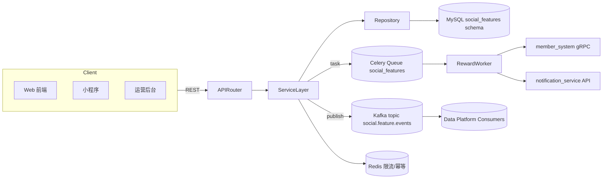

# social-features 模块概览

---
title: "social-features 模块概览"
version: "v0.3.0"
status: "Design Frozen"
created: "2025-10-18"
updated: "2025-10-25"
owner: "Growth Experience 团队"
dependencies:
  - "../../architecture/system-architecture.md"
  - "./requirements.md"
labels:
  - "module"
  - "overview"
---

## 1. 模块综述

- **使命**: 支撑平台的分享裂变与好友邀请场景，形成“分享 → 互动 → 转化 → 奖励”的闭环体验。
- **覆盖范围**: 商品/活动分享、分享事件采集、邀请关系维护、奖励发放、违规监测、指标报表。
- **业务动因**: 解决增长活动中渠道归因缺失、奖励发放慢、反作弊弱的问题，对应 [requirements.md](./requirements.md) 中 `REQ-SOCIAL-001`~`REQ-SOCIAL-006`。
- **生命周期**: 2025 Q4 完成设计与开发，2026 Q1 参与全渠道增长大促。

### 1.1 成功指标

| 指标 | 目标值 (T+90d) | 说明 | 来源 |
|------|----------------|------|------|
| 分享链接生成成功率 | ≥ 99.5% | 含二维码生成与回调 | API 监控
| 邀请注册→首购转化率 | ≥ 18% | 统计首购完成的邀请链 | 数据仓库
| 奖励发放 SLA | ≤ 2 分钟 P95 | 含外部会员系统调用 | Celery 任务指标
| 风控拦截率 | ≥ 92% | 拦截重复/异常事件 | Redis 限流 + 规则命中
| 运营指标准确率 | ≥ 98% | 与 BI 审计对比偏差 | 指标对账脚本

## 2. 模块职责与边界

### 2.1 职责矩阵

| 范畴 | 负责/不负责 | 说明 |
|------|-------------|------|
| 分享资源管理 | ✅ 负责 | 资源白名单、渠道配置、有效期策略 |
| 分享事件采集 | ✅ 负责 | 点击、注册、首购等事件接入与反作弊 |
| 邀请关系 | ✅ 负责 | 绑定、更新、冲突处理、状态同步 |
| 奖励策略执行 | ✅ 协同 | 根据营销活动策略执行奖励，库存由 `member_system` 管理 |
| 营销活动策划 | ❌ 不负责 | 由 `marketing_campaigns` 模块提供配置 |
| 个性化推荐算法 | ❌ 不负责 | 由推荐团队负责 |
| 全渠道数据分析 | ✅ 输出数据 | 提供实时事件与日汇总，最终分析由数据平台完成 |

### 2.2 边界自检清单

- 分享资源白名单变更需同步 `product_catalog`；超出白名单则返回 `SOCIAL_103`。
- 邀请关系冲突交由本模块处理，最终状态写入 `social_referral` 并广播事件。
- 奖励实际发放调用 `member_system`，若超时则进入补偿任务，不在本模块手动发奖。
- 运营 KPI 分发至 Kafka 与数据仓库，本模块不负责前端展示。

## 3. 架构视图

### 3.1 内部组件

| 组件 | 职责 | 说明 |
|------|------|------|
| `router.py` | 路由声明与依赖注入 | 拆分 `shares`, `events`, `referrals`, `rewards`, `admin` 子路由 |
| `service.py` | 核心业务服务 | 包含 `ShareService`, `ReferralService`, `RewardService`, `MetricsService` |
| `repository.py` | 数据访问 | 基于 SQLAlchemy 2.x async，内置读写事务与查询优化 |
| `schemas.py` | DTO 校验 | 对应 API 请求/响应与内部事件载荷 |
| `tasks.py` | Celery 异步任务 | 奖励补偿、违规复核、指标刷新 |
| `events.py` | 事件发布/订阅 | 与平台事件总线对接，封装 payload 与 headers |
| `validators.py` | 领域校验 | 分享资源验证、风控规则、去重策略 |

## 4. 依赖与接口

| 方向 | 模块/服务 | 接口方式 | 用途 | 契约文档 |
|------|-----------|----------|------|-----------|
| 上游 | `user_auth` | FastAPI 依赖 | JWT 解码、用户角色 | `app/modules/user_auth` README |
| 上游 | `product_catalog` | RPC (internal client) | 校验商品/活动可分享属性 | `docs/design/modules/product-catalog/api-spec.md` |
| 上游 | `marketing_campaigns` | REST | 获取活动奖励策略、预算 | `docs/design/modules/marketing-campaigns/api-spec.md` |
| 上游 | `order_management` | 事件订阅 | 首购事件回调 | `docs/design/modules/order-management/events.md` |
| 下游 | `notification_service` | REST | 推送奖励到账通知 | `docs/design/modules/notification/api-spec.md` |
| 下游 | `member_system` | gRPC | 发放积分/优惠券 | `docs/design/modules/member_system/api-spec.md` |
| 下游 | 数据平台 | Kafka | 分享事件与日指标 | BI 数据消费规范 |

## 5. 数据视图

### 5.1 核心实体摘要

| 表名 | 描述 | 关键字段 | 取值说明 |
|------|------|----------|----------|
| `social_share` | 分享记录 | `share_code`, `resource_type`, `status`, `expires_at` | status: `active`, `expired`, `revoked` |
| `social_share_event` | 分享事件流水 | `share_id`, `event_type`, `session_id`, `actor_user_id`, `deduplicated` | event_type: `click`, `register`, `first_order` |
| `social_referral` | 邀请关系 | `inviter_user_id`, `invitee_user_id`, `activity_id`, `status` | status: `pending`, `registered`, `first_order`, `closed` |
| `social_reward` | 奖励发放记录 | `reward_type`, `value`, `currency`, `status`, `external_ref` | reward_type: `points`, `coupon`, `cashback` |
| `social_share_daily_metrics` | 日汇总指标 | `stat_date`, `channel`, `resource_type`, `resource_id`, `share_count` 等 | ETL 由 `metrics_worker` 生成 |

详细字段参见 [design.md](./design.md#3-数据模型)。

## 6. 运行指标与健康检查

- **API 健康**: `/api/v1/social-features/admin/health`（开发阶段 stub，正式版返回限流、队列状态、事件滞留指标）。
- **Prometheus 指标**:
  - `social_features_share_created_total`
  - `social_features_event_ingested_total{event_type="click"}`
  - `social_features_reward_latency_seconds_bucket`
  - `social_features_share_rate_limit_rejections_total`
- **日志**: `social_features` 结构化日志流水，包含 `request_id`, `share_code`, `reward_id`。
- **告警阈值**: Reward 发放失败 5 分钟内 > 20 次触发 PagerDuty；限流拒绝超过 5% 触发 Slack 告警。

## 7. 维护节奏

- **文档审查**: 设计阶段每周一次，进入开发后改为每次合并主干前核对。
- **依赖同步**: 与 `member_system`、`marketing_campaigns` 每两周对齐策略字段变更。
- **数据对账**: 日终由脚本 `tools/social_features_metrics_audit.py` 对账并出具报告。

## 8. 变更历史

| 日期 | 版本 | 变更内容 | 责任人 |
|------|------|----------|--------|
| 2025-10-18 | v0.2 | 初版草稿，明确业务范围与依赖 | Zhang Wei |
| 2025-10-23 | v0.2.5 | 补充成功指标、接入架构图 | Chen Hao |
| 2025-10-25 | v0.3.0 | 对齐标准 v3，细化边界、数据视图、维护节奏 | Zhang Wei |

