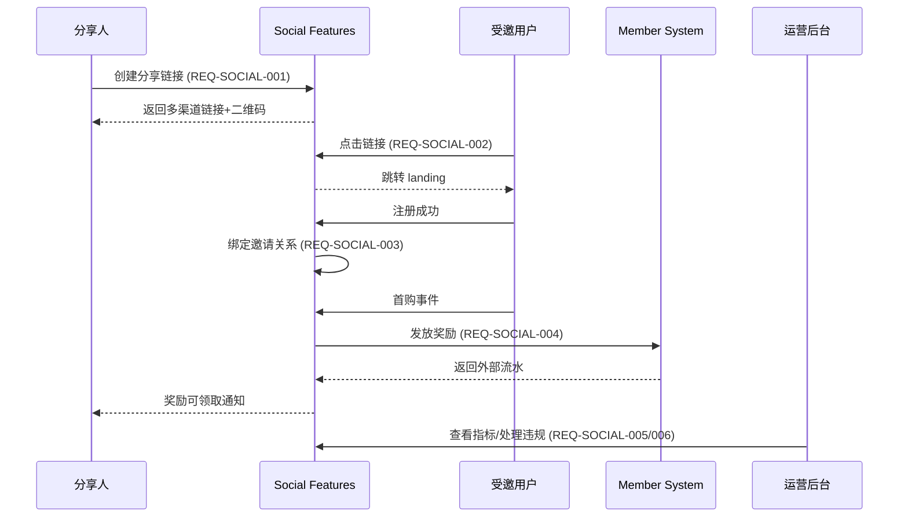

# social-features 模块 - 业务需求

📅 **创建日期**: 2025-10-12  
👤 **需求方**: Growth Experience 产品组 / Liu Jing  
✅ **评审状态**: 已确认 (2025-10-24 评审会议)  
🔄 **最后更新**: 2025-10-25  

## 1. 业务背景

- 渠道裂变与好友邀请成为 2025 Q4 大促的核心策略，现有流程缺少分享归因与奖励闭环。
- 运营活动需要支持微信、小程序、复制链接等多渠道分享，同时确保奖励预算可控与防作弊。
- 数据团队要求统一的数据出口，以便沉淀增长指标和 ROI 分析。

### 1.1 业务目标

1. 用户可以在商品/活动页一键生成分享链接，覆盖微信/朋友圈/复制链接/二维码等渠道。
2. 平台能够准确追踪分享路径（点击→注册→首购），识别有效邀请链并发放奖励。
3. 运营可在后台查看按渠道/活动拆分的每日指标，快速定位问题并调整策略。

### 1.2 关键场景

- **S1 - 用户分享商品**: 用户 A 在商品详情页生成分享链接，发送至微信好友；好友点击后跳转活动页。
- **S2 - 邀请注册转化**: 好友 B 点击分享链接后注册并在 7 日内完成首单，系统需要自动识别邀请关系并触发奖励。
- **S3 - 奖励领取与通知**: 邀请成功后，用户 A 可以在“我的奖励”中查看待领取奖励，领取后推送通知。
- **S4 - 运营监控**: 运营查看按渠道分组的分享、点击、注册、首购和奖励成本；对异常指标进行告警。
- **S5 - 风控处理**: 系统识别同一设备重复点击或异常注册，标记违规并阻断奖励发放。

### 1.3 成功指标

| 指标 | 目标值 | 计算方式 | 负责团队 |
|------|--------|----------|----------|
| 分享链接创建成功率 | ≥ 99.5% | 成功创建数 / 请求数 | 社交模块 |
| 邀请链完整率 | ≥ 95% | 完整记录(点击→注册→首购) / 有效首购数 | 数据团队 |
| 奖励发放及时率 | ≥ 98% | P95 发放 < 2 分钟 | Growth Ops |
| 风控拦截准确率 | ≥ 92% | 正确拦截数 / 总拦截数 | 风控组 |
| 运营指标对账偏差 | ≤ 2% | 与 BI 数据对比 | 数据团队 |

## 2. 角色与权限

| 角色 | 描述 | 权限 |
|------|------|------|
| 注册用户 | 平台普通登录用户 | 创建分享、查看分享数据、领取奖励 |
| 邀请客 | 通过分享链接访问且注册的用户 | 归属邀请关系，无额外权限 |
| 运营人员 | Growth 运营 | 查看管理后台指标、调整黑名单、手动更新邀请状态 |
| 管理员 | 平台管理员 | 执行违规处理、导出数据、配置限流策略 |

权限矩阵详见 [design.md](./design.md#62-安全与访问控制)。

## 3. 功能需求

### 3.1 需求总览

| 编号 | 名称 | 优先级 | 验收场景 | 状态 |
|------|------|--------|----------|------|
| REQ-SOCIAL-001 | 多渠道分享链接生成 | P0 | 用户在商品详情页生成不同渠道分享链接 | ✅ 确认 |
| REQ-SOCIAL-002 | 分享事件采集与反作弊 | P0 | 系统对点击/注册事件去重并限流 | ✅ 确认 |
| REQ-SOCIAL-003 | 邀请关系绑定与冲突处理 | P0 | 新注册用户被首次点击的有效分享归因 | ✅ 确认 |
| REQ-SOCIAL-004 | 奖励发放与领取流程 | P0 | 邀请完成后奖励可在 2 分钟内可领取 | ✅ 确认 |
| REQ-SOCIAL-005 | 运营指标与报表输出 | P1 | 运营后台按日查看渠道/活动指标 | ✅ 确认 |
| REQ-SOCIAL-006 | 违规检测与人工处理通道 | P1 | 系统识别异常并支持人工干预 | ✅ 确认 |

### 3.2 需求详情

#### REQ-SOCIAL-001 多渠道分享链接生成

- **用户故事**: 作为注册用户，我希望一键创建可在微信/朋友圈/复制链接/二维码使用的分享链接，以便快速推广商品或活动。
- **业务规则**:
  - 支持资源类型 `product`, `campaign`, `landing_page`。
  - 每份分享链接有唯一 `share_code`，默认有效期 30 天，可由活动配置覆盖。
  - 创建请求需校验用户状态、资源是否可分享（来源 `product_catalog`）。
- **验收标准**:
  1. 在商品详情页点击“去分享”可生成不同渠道链接和二维码。
  2. 若资源禁用分享，返回错误码 `SOCIAL_103`。
  3. 重复提交同一 `Idempotency-Key` 返回相同结果。

#### REQ-SOCIAL-002 分享事件采集与反作弊

- **用户故事**: 作为运营，我希望实时捕获分享点击、注册、首购等事件，并自动过滤机器流量和重复点击，保证数据可靠。
- **业务规则**:
  - 事件类型包含 `click`, `register`, `first_order`，需按分享码和 session 去重。
  - 匿名点击允许不带 token，需记录来源 IP、User-Agent、Device ID。
  - 单 IP + session 5 分钟内最多 5 次点击，超限返回 `SOCIAL_301`。
- **验收标准**:
  1. 分享事件接口可接受匿名点击并返回 `202 Accepted`。
  2. 同一 session 重复请求在 1 分钟内返回 `deduplicated=true`。
  3. 超限请求被拒绝并记录日志、Prometheus 指标。

#### REQ-SOCIAL-003 邀请关系绑定与冲突处理

- **用户故事**: 作为新用户，我希望首次打开分享链接并注册时被正确归属到分享人，避免奖励归因错误。
- **业务规则**:
  - 邀请关系由分享事件触发，首次注册优先绑定最早有效分享。
  - 同一被邀请人只能存在一个激活中的邀请关系；冲突时按照点击时间排序取最早。
  - 运营可人工调整邀请状态，需记录审计日志。
- **验收标准**:
  1. 注册成功后在后台可看到邀请关系记录。
  2. 冲突场景返回错误码 `SOCIAL_201` 并写入违规表。
  3. 人工调整需记录操作人、理由、时间。

#### REQ-SOCIAL-004 奖励发放与领取流程

- **用户故事**: 作为邀请人，我希望在被邀请人完成首购后，能够及时领取奖励，且奖励能同步到账至会员系统。
- **业务规则**:
  - 奖励类型支持积分、优惠券、现金券，配置来自 `marketing_campaigns`。
  - 发放前需校验奖励库存、活动状态、风控结果。
  - 奖励领取后推送通知信息，失败需支持补偿重试。
- **验收标准**:
  1. 首购完成后 2 分钟内奖励状态更新为可领。
  2. 领取成功后异步调用 `member_system` 并写入外部流水号。
  3. 调用失败进入重试队列并触发告警。

#### REQ-SOCIAL-005 运营指标与报表输出

- **用户故事**: 作为运营，我希望能按渠道、活动查看每日分享数、点击数、注册数、首购数、奖励成本等指标，用于调整策略。
- **业务规则**:
  - 指标数据每日 02:00 前产出，支持时间范围、渠道、资源过滤。
  - 支持导出 CSV，并同步至数据平台 Kafka topic。
  - 后台需展示近 7 日趋势和异常标记。
- **验收标准**:
  1. 后台接口 `/admin/metrics/daily` 可返回分页数据。
  2. 指标数据需通过对账脚本与 BI 数据差异 ≤ 2%。
  3. 支持 CSV 导出并含全部字段。

#### REQ-SOCIAL-006 违规检测与人工处理

- **用户故事**: 作为风控人员，我需要识别异常的分享、注册或首购行为，防止奖励滥用，并支持人工审核和屏蔽。
- **业务规则**:
  - 违规信号包括：同设备高频点击、短时间大量注册、黑名单用户。
  - 系统需写入 `social_violation` 表，并支持后台查询与备注。
  - 对违规邀请自动阻断奖励，并通知运营处理。
- **验收标准**:
  1. 违规事件在后台列表中可见，含原因、命中规则。
  2. 阻断后奖励状态更新为 `blocked`，相关用户收到通知。
  3. 运营可解除或维持阻断，所有操作需审计。

## 4. 非功能需求

| 类型 | 编号 | 描述 | 验收 |
|------|------|------|------|
| 性能 | NFR-SOCIAL-001 | `POST /share-events` P95 响应 < 80ms（缓存命中场景），QPS 峰值 4k | 压测脚本 `perf_social_events.jmx` |
| 性能 | NFR-SOCIAL-002 | `POST /shares` P95 响应 < 150ms，二维码生成耗时 < 400ms | API 压测 + 监控 |
| 可用性 | NFR-SOCIAL-003 | 核心 API 99.9% 可用（30 天滚动），异步任务失败率 <0.5% | SLO 仪表板 |
| 安全 | NFR-SOCIAL-004 | 所有接口遵循 JWT 鉴权，管理员接口要求 2FA | 安全测试报告 |
| 合规 | NFR-SOCIAL-005 | 保留操作日志 ≥ 180 天，满足审计要求 | 日志存储策略 |
| 数据 | NFR-SOCIAL-006 | Kafka 事件投递失败重试 3 次；MySQL 数据与缓存一致性延迟 < 5 秒 | 监控 + 自动对账 |

## 5. 业务约束与依赖

- **合规要求**: 符合《用户隐私保护规范》，对个人数据（手机号、IP）需要脱敏存储；奖励流程遵守《营销活动奖励发放管理办法》。
- **时间约束**: 2025-11-05 开发启动，11-26 完成预发布验证，12-05 前进入灰度。
- **资源约束**: 后端 4 人、前端 3 人、QA 2 人，需共享 Celery 集群与 Redis 资源；Kafka 分区容量由数据团队统一规划。
- **外部依赖**: `member_system` 必须在 2025-11-12 前提供新版奖励接口；`marketing_campaigns` 需提供活动配置 API。

## 6. 用户流程概览

## 7. 验收清单

### 功能验收
- [ ] 分享渠道覆盖微信、朋友圈、复制链接、二维码。
- [ ] 限流/去重命中场景日志与指标可见。
- [ ] 邀请关系后台可查询并支持人工调整。
- [ ] 奖励发放失败触发补偿任务并记录告警。
- [ ] 指标接口支持渠道、活动、时间过滤，返回分页与 CSV 导出。
- [ ] 违规记录支持查询、备注、状态更新。

### 性能与安全验收
- [ ] 压测结果达到 `NFR-SOCIAL-001/002` 目标并记录报告。
- [ ] 核心接口通过渗透测试，未发现高风险漏洞。
- [ ] Prometheus 与 Grafana 仪表板上线，阈值告警验证通过。

### 数据对账
- [ ] 与 BI 平台对账偏差 ≤ 2%。
- [ ] Kafka 事件延迟 P95 ≤ 3 秒。
- [ ] 日终审计脚本通过并归档报告。

## 8. 风险与应对

| 风险 | 描述 | 影响 | 缓解措施 |
|------|------|------|----------|
| R1 | member_system 接口延迟上线 | 奖励发放无法打通 | 预留模拟器与补偿任务，必要时启用内部积分方案 |
| R2 | 社交渠道风控策略突变 | 分享链接被限制 | 预置短链接 fallback，及时更新渠道适配策略 |
| R3 | 高并发造成 Redis 限流误伤 | 正常用户受影响 | 配置白名单 + 动态阈值，监控限流命中率 |
| R4 | 风控规则误判 | 运营成本高，用户体验差 | 引入人工复核面板并提供恢复通道 |

## 9. 变更记录

| 日期 | 版本 | 变更内容 | 负责人 |
|------|------|----------|--------|
| 2025-10-12 | v0.1 | 初始需求草案 | Liu Jing |
| 2025-10-18 | v0.2 | 增补非功能需求、风控场景 | Liu Jing |
| 2025-10-24 | v0.2.5 | 评审确认，调整奖励 SLA | Growth Squad |
| 2025-10-25 | v0.3.0 | 对齐文档标准，细化验收清单与风险矩阵 | Zhang Wei |
