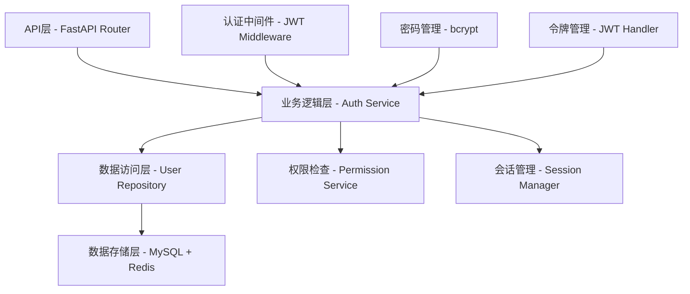
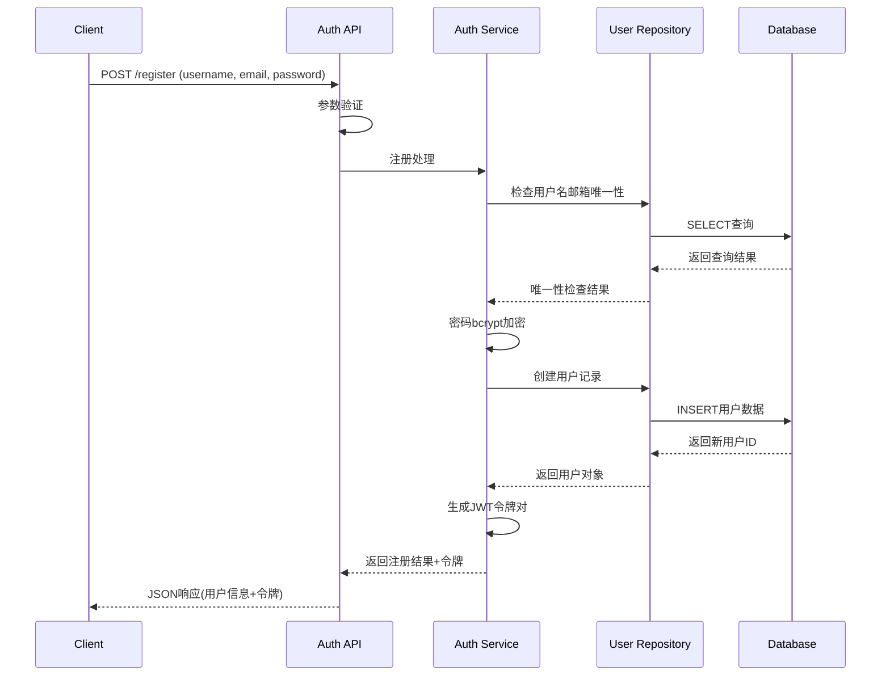
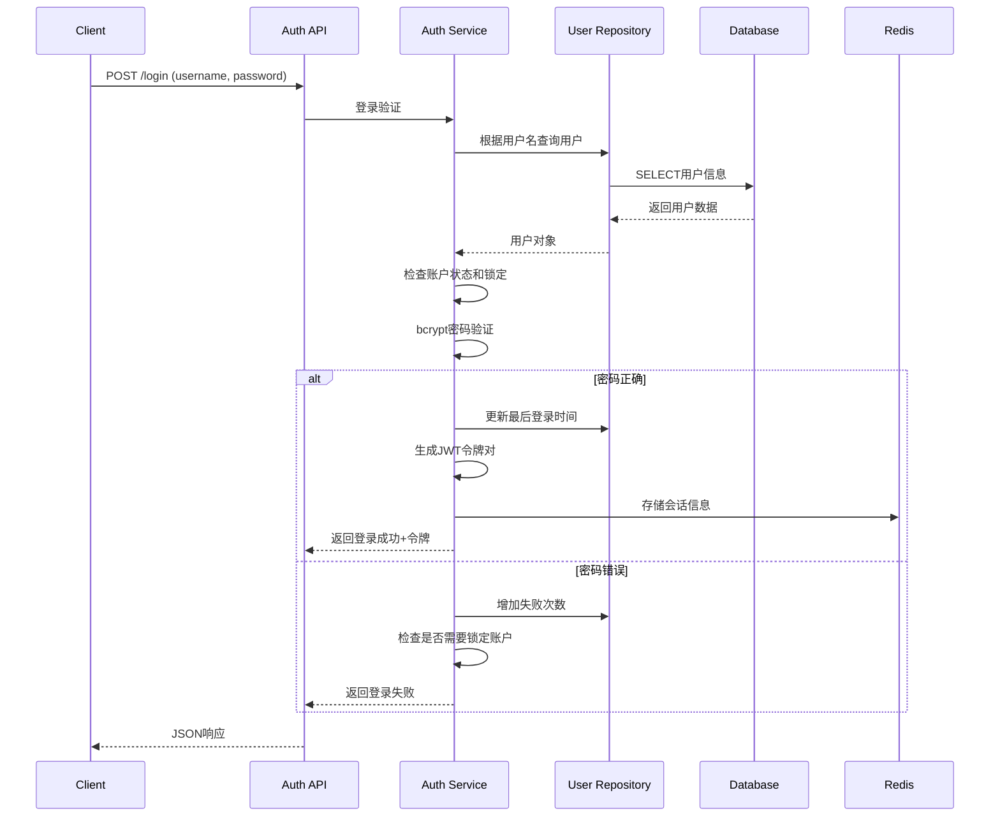
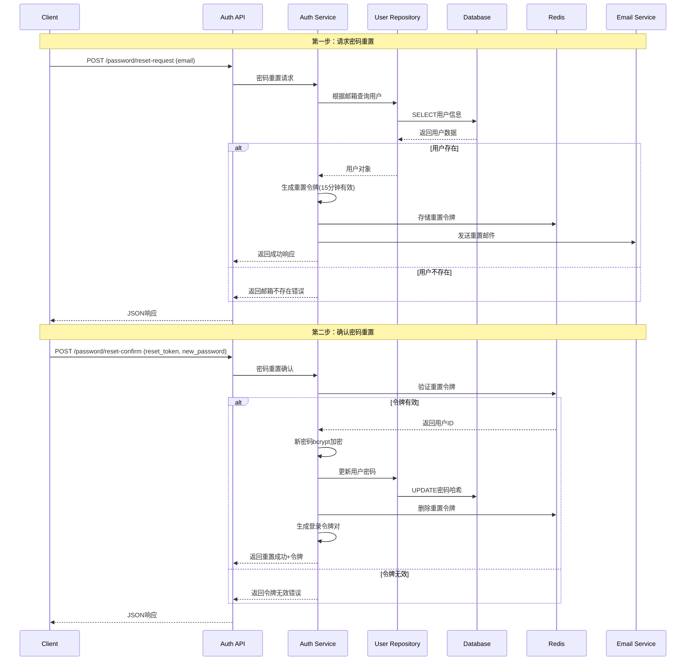
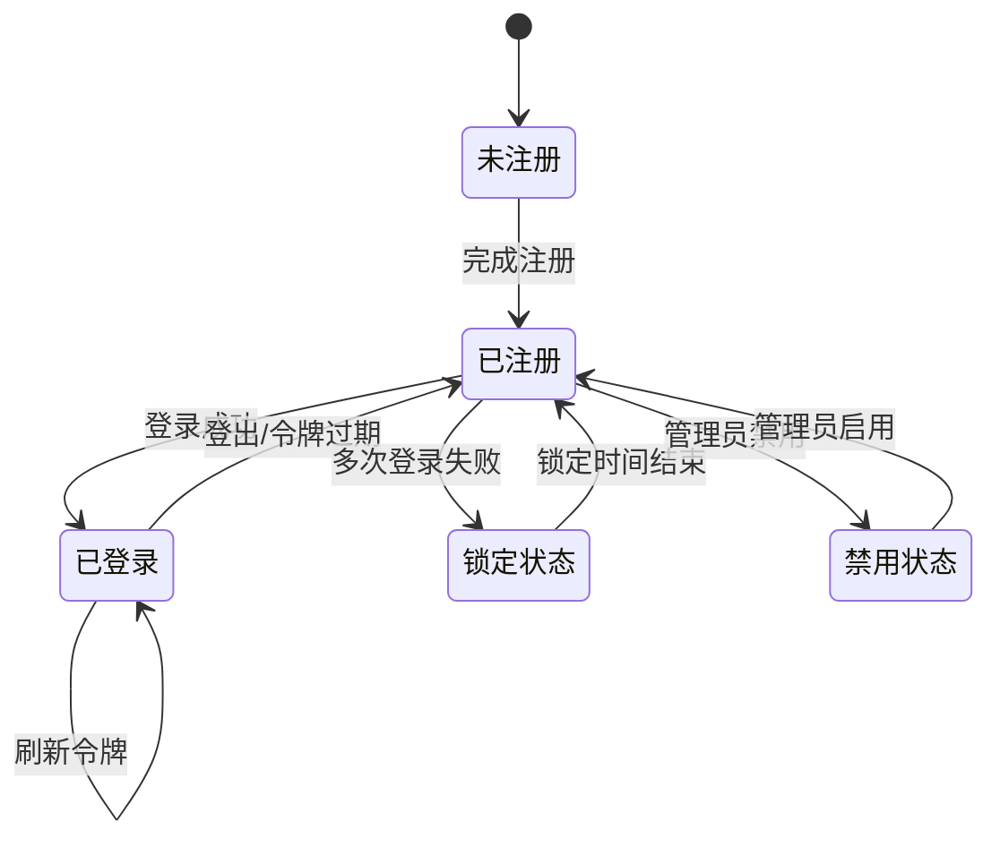

<!--
文档说明：
- 内容：模块技术设计文档模板
- 作用：记录技术设计决策、架构选择、实现方案
- 使用方法：基于需求文档进行技术设计，记录设计理由
-->

# user-auth模块 - 技术设计文档

📅 **创建日期**: 2025-09-16  
👤 **设计者**: 开发团队技术负责人  
✅ **评审状态**: 文档驱动开发验证中  
🔄 **最后更新**: 2025-09-25  

## 设计概述

### 设计目标
- **安全可靠**: 建立企业级用户认证体系，保护用户数据和系统资源
- **高性能**: 支持高并发认证请求，响应时间 < 200ms，吞吐量 > 2000 req/s
- **易集成**: 提供统一的认证接口，支持其他模块便捷集成
- **可扩展**: 支持多种认证方式扩展，为微服务演进做好架构准备

### 设计原则
- **单一职责**: 专注用户认证和权限管理，与业务逻辑解耦
- **开放封闭**: 基于依赖注入的扩展机制，支持新增认证方式而无需修改核心代码
- **依赖倒置**: 基于抽象接口设计，降低与具体实现的耦合度

### 关键设计决策
| 决策点 | 选择方案 | 理由 | 替代方案 |
|--------|----------|------|----------|
| 认证机制 | JWT双令牌 | 无状态、可扩展、安全性高 | Session存储、单令牌 |
| 密码加密 | bcrypt | 自适应、防暴力破解、成熟稳定 | PBKDF2、scrypt |
| 权限模型 | 基于角色的访问控制(RBAC) | 简单易理解、满足电商需求 | 基于属性的访问控制(ABAC) |
| 数据库方案 | 用户表扩展role字段 | 简化设计、高性能查询 | 独立角色权限表 |

## 系统架构设计

### 整体架构


### 模块内部架构
```
user_auth/
├── router.py           # API路由层 - 请求接收和响应
├── service.py          # 业务逻辑层 - 认证核心逻辑
├── repository.py       # 数据访问层 - 用户数据CRUD
├── models.py           # 数据模型层 - User实体定义
├── schemas.py          # 数据传输对象 - API请求响应结构
├── dependencies.py     # 依赖注入 - 权限检查装饰器
├── exceptions.py       # 异常处理 - 认证相关异常
└── utils.py            # 工具函数 - JWT和密码工具
```

### 层次职责
- **API层**: 处理HTTP请求、参数验证、响应格式化、错误处理
- **业务层**: 认证逻辑实现、权限验证、业务规则执行、状态管理
- **数据层**: 用户数据持久化、查询优化、事务管理、数据一致性

## 数据库设计

### 表结构设计
```sql
-- 用户表 (扩展现有表结构)
CREATE TABLE users (
    id INT PRIMARY KEY AUTO_INCREMENT COMMENT '用户唯一标识',
    username VARCHAR(50) NOT NULL UNIQUE COMMENT '用户名，唯一约束',
    email VARCHAR(200) NOT NULL UNIQUE COMMENT '邮箱地址，唯一约束',
    password_hash VARCHAR(255) NOT NULL COMMENT 'bcrypt加密密码',
    role VARCHAR(20) NOT NULL DEFAULT 'user' COMMENT '用户角色：user/admin/super_admin',
    is_active BOOLEAN DEFAULT TRUE COMMENT '账户状态：激活/禁用',
    last_login DATETIME NULL COMMENT '最后登录时间',
    login_attempts INT DEFAULT 0 COMMENT '连续登录失败次数',
    locked_until DATETIME NULL COMMENT '账户锁定截止时间',
    created_at DATETIME DEFAULT CURRENT_TIMESTAMP COMMENT '创建时间',
    updated_at DATETIME DEFAULT CURRENT_TIMESTAMP ON UPDATE CURRENT_TIMESTAMP COMMENT '更新时间'
);

-- 用户会话表 (Redis存储，此处为结构参考)
-- Key: session:{user_id}:{device_id}
-- Value: JSON格式会话信息
```

### 索引设计
| 表名 | 索引名 | 索引字段 | 索引类型 | 用途 |
|------|--------|----------|----------|------|
| users | idx_username | username | UNIQUE | 用户名登录查询 |
| users | idx_email | email | UNIQUE | 邮箱登录查询 |
| users | idx_role_active | role, is_active | BTREE | 权限检查和用户管理 |
| users | idx_last_login | last_login | BTREE | 用户活跃度分析 |

### 数据关系
- **自包含设计**: 用户表包含角色信息，避免复杂关联查询
- **扩展预留**: 预留字段支持未来功能扩展（手机号、微信openid等）
- **缓存集成**: 会话数据存储在Redis，减少数据库压力
- **历史兼容**: 保持与现有用户数据的兼容性，支持平滑迁移

## API设计

### API架构
- **基础路径**: `/api/v1/user-auth/`
- **认证方式**: JWT Bearer Token (Authorization: Bearer <token>)
- **数据格式**: JSON请求和响应
- **错误处理**: 统一错误码和消息格式

### 端点设计
| 方法 | 路径 | 功能 | 认证要求 | 权限要求 |
|------|------|------|----------|----------|
| POST | `/api/v1/user-auth/register` | 用户注册 | 无 | 公开 |
| POST | `/api/v1/user-auth/login` | 用户登录 | 无 | 公开 |
| POST | `/api/v1/user-auth/logout` | 用户登出 | Bearer Token | 已登录用户 |
| POST | `/api/v1/user-auth/refresh` | 刷新令牌 | Refresh Token | 已登录用户 |
| POST | `/api/v1/user-auth/password/reset-request` | 请求密码重置 | 无 | 公开 |
| POST | `/api/v1/user-auth/password/reset-confirm` | 确认密码重置 | Reset Token | 公开 |
| PUT | `/api/v1/user-auth/password` | 修改密码 | Bearer Token | 已登录用户 |
| GET | `/api/v1/user-auth/profile` | 获取用户信息 | Bearer Token | 已登录用户 |
| PUT | `/api/v1/user-auth/profile` | 更新用户信息 | Bearer Token | 已登录用户 |
| GET | `/api/v1/user-auth/users` | 用户列表管理 | Bearer Token | 管理员权限 |
| PUT | `/api/v1/user-auth/users/{id}/role` | 修改用户角色 | Bearer Token | 管理员权限 |

### 错误处理设计
```json
{
    "error": {
        "code": "AUTH_ERROR_001",
        "message": "用户名或密码错误",
        "details": {
            "field": "credentials",
            "reason": "invalid_credentials"
        }
    }
}
```

**错误码设计**:
- AUTH_ERROR_001: 登录凭据错误
- AUTH_ERROR_002: 令牌无效或过期
- AUTH_ERROR_003: 权限不足
- AUTH_ERROR_004: 账户被锁定
- AUTH_ERROR_005: 用户名或邮箱已存在

## 业务逻辑设计

### 核心业务流程

#### 用户注册流程


#### 用户登录流程


#### 密码重置流程


### 业务规则实现
- **密码强度验证**: 正则表达式检查，至少8位包含大小写字母数字
- **登录失败锁定**: 3次失败后锁定15分钟，防暴力破解
- **令牌双重机制**: 访问令牌15分钟，刷新令牌7天，遵循零信任安全架构原则
- **权限继承规则**: admin包含user权限，super_admin包含所有权限
- **密码重置安全**: 重置令牌15分钟有效，一次性使用，通过邮箱验证身份
- **重置频率限制**: 同一邮箱10分钟内最多申请3次密码重置，防止邮箱轰炸

### 状态机设计


## 集成设计

### 模块依赖
- **app/core/database.py**: 数据库连接和会话管理，提供get_db依赖注入
- **app/core/config.py**: 配置管理，JWT密钥、令牌过期时间等配置项
- **app/shared/base_models.py**: 基础数据模型，提供BaseModel和TimestampMixin
- **app/core/redis_client.py**: Redis缓存服务，存储会话状态和令牌黑名单

### 对外提供的服务
- **认证依赖函数**: get_current_user、get_current_admin_user等依赖注入
- **密码管理工具**: get_password_hash、verify_password密码加密验证
- **令牌管理服务**: create_access_token、decode_token令牌生成解码
- **权限检查装饰器**: require_permission权限验证装饰器

### 与其他模块的集成
| 集成模块 | 集成方式 | 集成内容 |
|---------|---------|---------|
| **购物车模块** | 依赖注入 | 使用get_current_user获取当前用户信息 |
| **订单管理模块** | 依赖注入 | 使用权限检查保护订单操作，区分用户和管理员 |
| **商品管理模块** | 权限控制 | 使用get_current_admin_user保护商品管理接口 |
| **用户管理模块** | 数据共享 | 共享User模型，提供用户认证状态 |

### 安全集成策略
- **中间件集成**: 在FastAPI中间件层面进行全局认证检查
- **异常统一**: 认证异常统一处理，返回标准错误格式
- **日志审计**: 记录所有认证相关操作，支持安全审计
- **监控集成**: 提供认证指标，集成到系统监控体系

### 扩展预留
- **多因素认证**: 预留短信验证、邮箱验证等扩展接口
- **第三方登录**: 预留微信、支付宝等第三方登录集成点
- **企业集成**: 预留LDAP、SSO等企业级认证集成能力
- **微服务演进**: 基于无状态设计，支持拆分为独立认证服务

### 外部服务集成
| 服务名 | 集成方式 | 用途 | 容错机制 |
|--------|----------|------|----------|
| {服务1} | {REST/MQ} | {用途} | {容错方案} |
| {服务2} | {REST/MQ} | {用途} | {容错方案} |

### 事件设计
- **发布事件**: {事件列表和格式}
- **订阅事件**: {事件列表和处理}

## 性能设计

### 缓存策略
- **应用缓存**: Redis缓存{缓存内容}
- **查询缓存**: 缓存{查询结果}
- **缓存失效**: {失效策略}

### 数据库优化
- **查询优化**: {优化策略}
- **连接池**: {配置方案}
- **读写分离**: {是否需要}

### 异步处理
- **异步任务**: {任务类型}
- **队列设计**: {队列方案}

## 安全设计

### 认证授权
- **认证方式**: JWT Token
- **权限控制**: RBAC模型
- **API安全**: 接口防护措施

### 数据安全
- **敏感数据**: {加密方案}
- **数据脱敏**: {脱敏规则}
- **审计日志**: {日志内容}

### 输入验证
- **参数校验**: Pydantic模型验证
- **SQL注入**: 参数化查询
- **XSS防护**: 输出编码

## 可扩展性设计

### 水平扩展
- **无状态设计**: {如何实现}
- **负载均衡**: {方案选择}
- **数据分片**: {是否需要}

### 垂直扩展
- **资源配置**: {配置建议}
- **性能监控**: {监控指标}

### 降级策略
- **限流**: {限流策略}
- **熔断**: {熔断条件}
- **降级**: {降级方案}

## 监控设计

### 业务监控
- **业务指标**: {监控指标}
- **告警规则**: {告警条件}

### 技术监控
- **性能指标**: 响应时间、QPS、错误率
- **资源指标**: CPU、内存、磁盘
- **日志监控**: 错误日志、访问日志

## 测试策略

### 单元测试
- **测试覆盖**: 业务逻辑层100%覆盖
- **测试框架**: pytest
- **Mock策略**: {Mock方案}

### 集成测试
- **测试范围**: API接口测试
- **测试环境**: {环境配置}
- **测试数据**: {数据准备}

### 性能测试
- **压测目标**: {性能目标}
- **测试场景**: {测试用例}

## 实施计划

### 开发阶段
1. **阶段1**: 数据模型和API设计 ({时间})
2. **阶段2**: 核心业务逻辑实现 ({时间})
3. **阶段3**: 集成测试和优化 ({时间})

### 风险控制
- **技术风险**: {风险和缓解}
- **进度风险**: {风险和缓解}
- **质量风险**: {风险和缓解}

## 变更记录

| 日期 | 版本 | 变更内容 | 变更人 |
|------|------|----------|--------|
| 2025-09-16 | v1.0 | 初始设计 | {姓名} |
