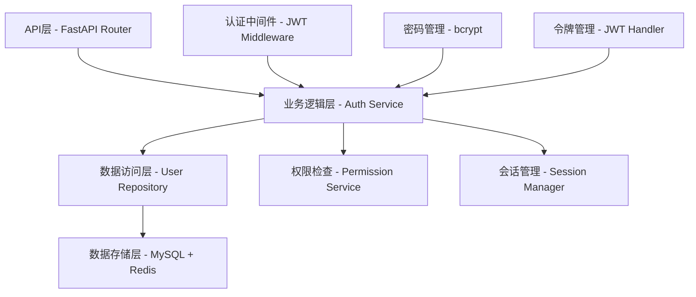
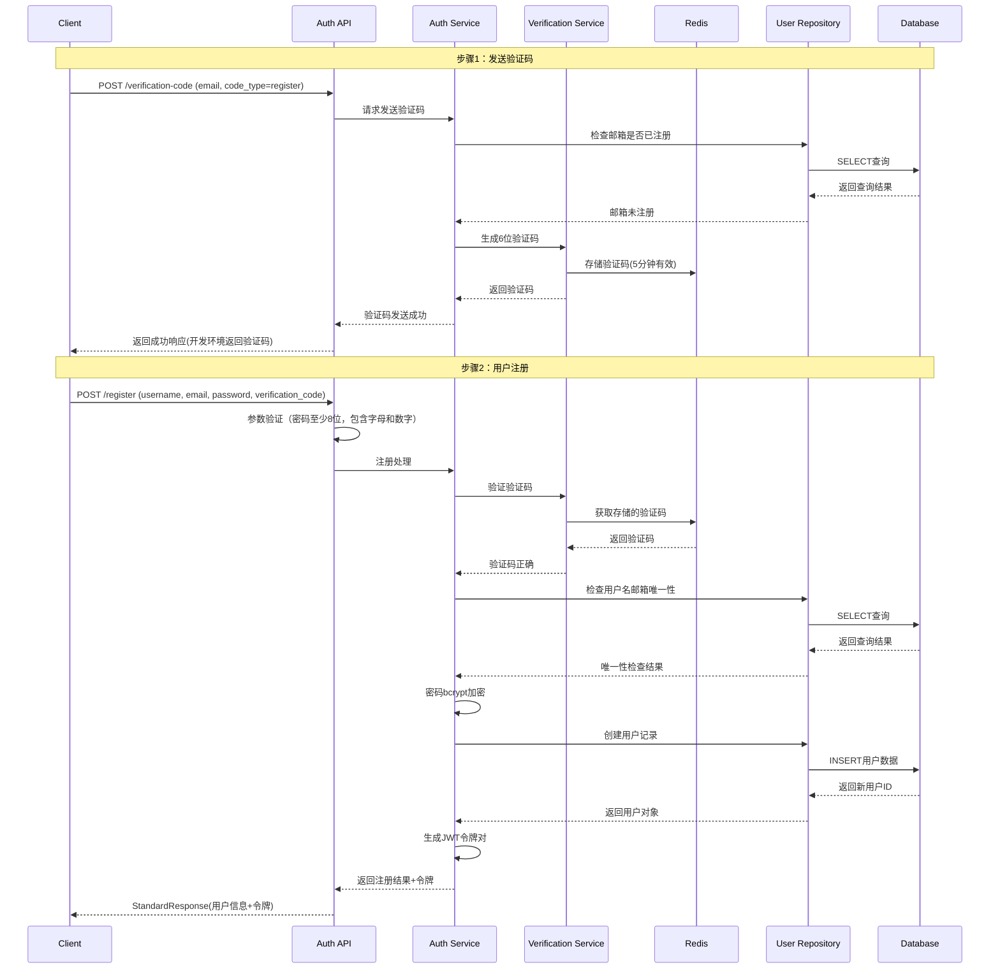
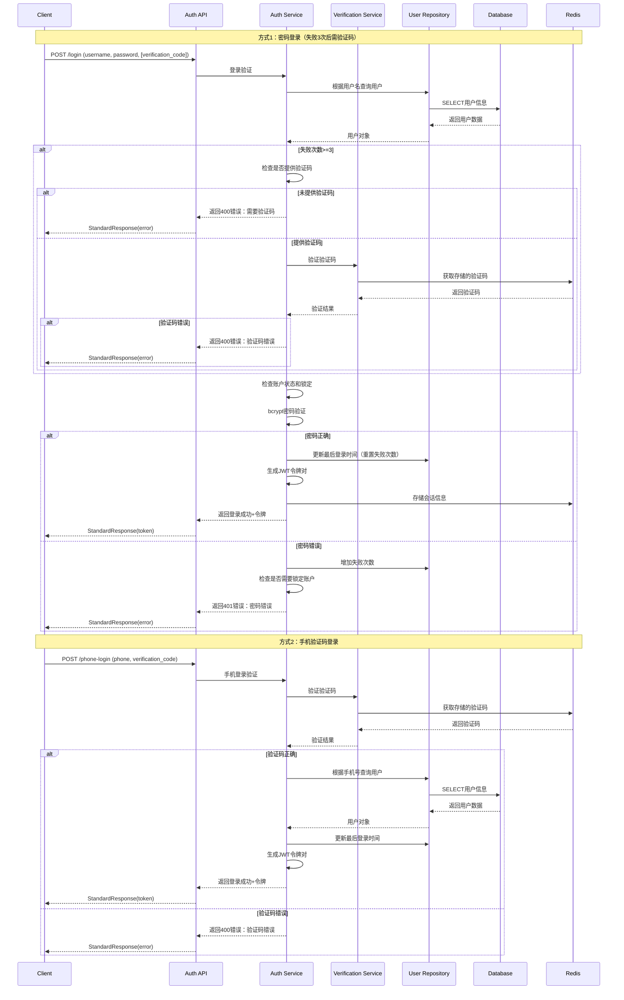
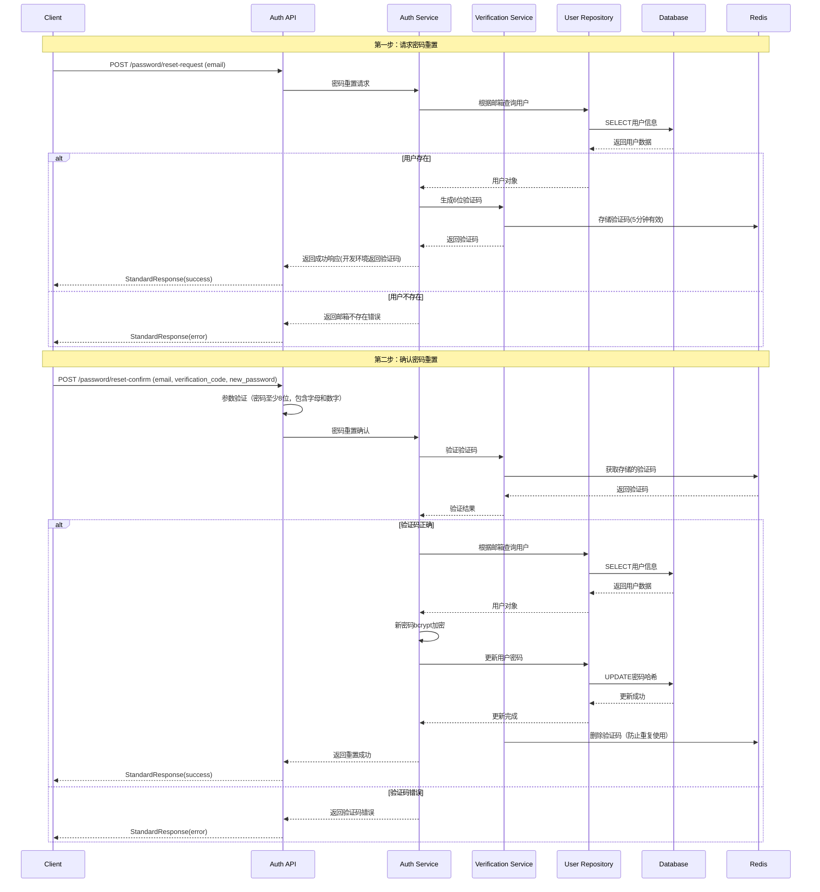
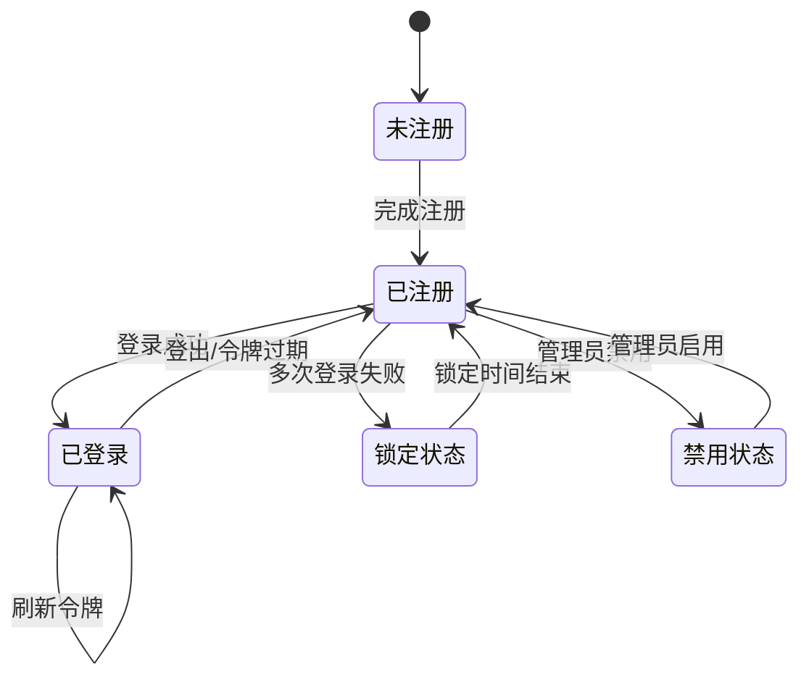

<!--
文档说明：
- 内容：模块技术设计文档模板
- 作用：记录技术设计决策、架构选择、实现方案
- 使用方法：基于需求文档进行技术设计，记录设计理由
-->

# user-auth模块 - 技术设计文档

📅 **创建日期**: 2025-09-16  
👤 **设计者**: 开发团队技术负责人  
✅ **评审状态**: 文档驱动开发验证中  
🔄 **最后更新**: 2025-09-25  

## 设计概述

### 设计目标
- **安全可靠**: 建立企业级用户认证体系，保护用户数据和系统资源
- **高性能**: 支持高并发认证请求，响应时间 < 200ms，吞吐量 > 2000 req/s
- **易集成**: 提供统一的认证接口，支持其他模块便捷集成
- **可扩展**: 支持多种认证方式扩展，为微服务演进做好架构准备

### 设计原则
- **单一职责**: 专注用户认证和权限管理，与业务逻辑解耦
- **开放封闭**: 基于依赖注入的扩展机制，支持新增认证方式而无需修改核心代码
- **依赖倒置**: 基于抽象接口设计，降低与具体实现的耦合度

### 关键设计决策
| 决策点 | 选择方案 | 理由 | 替代方案 |
|--------|----------|------|----------|
| 认证机制 | JWT双令牌 | 无状态、可扩展、安全性高 | Session存储、单令牌 |
| 密码加密 | bcrypt | 自适应、防暴力破解、成熟稳定 | PBKDF2、scrypt |
| 权限模型 | 基于角色的访问控制(RBAC) | 灵活权限管理、企业级需求 | 简单角色字段 |
| 数据库方案 | 完整RBAC权限表设计 | 支持复杂权限控制、可扩展 | 用户表扩展role字段 |

## 系统架构设计

### 整体架构


### 模块内部架构
```
user_auth/
├── router.py           # 第1层: API路由层 - HTTP请求处理
├── service.py          # 第2层: 业务逻辑层 - 认证核心逻辑
├── repository.py       # 第3层: 数据访问层 - 数据库操作封装
├── models.py           # 第4层: 数据模型层 - RBAC权限模型实体定义
├── schemas.py          # 数据传输对象 - API请求响应结构
├── dependencies.py     # 依赖注入 - 权限检查装饰器
├── README.md           # 模块说明文档
└── __init__.py         # 模块初始化文件
```

**架构说明**: 
- **四层架构**: Router → Service → Repository → Model，遵循单向依赖原则
- **Repository层**: 封装所有数据库操作，提供标准CRUD接口，支持Mock测试
- **异常处理**: 使用`app/core/auth.py`的`AuthenticationError`和`app/core/exceptions.py`的`ServiceException`
- **工具函数**: 密码加密、JWT令牌等核心工具统一使用`app/core/auth.py`中的函数
- **无需exceptions.py/utils.py**: 所有异常和工具函数都是跨模块共享的，已在core层统一管理

### 层次职责
- **Router层**: 处理HTTP请求、参数验证、响应格式化、调用Service层
- **Service层**: 认证逻辑实现、业务规则验证、事务边界管理、调用Repository层
- **Repository层**: 数据库操作封装、查询构建、CRUD方法提供、隔离ORM实现
- **Model层**: ORM实体定义、数据库表映射、实体关系定义、无业务逻辑

### 异步架构设计

#### 架构问题与解决方案

**问题背景**：
FastAPI支持async/await异步编程，可以充分利用异步IO提升并发性能。然而，当前项目使用SQLAlchemy同步ORM + pymysql同步驱动，在async endpoint中直接调用同步数据库操作会导致**事件循环阻塞**，失去async的并发优势。

**技术本质**：
```python
# ❌ 错误示例：在async context中调用同步DB操作会阻塞事件循环
async def login(db: Session):
    user = UserRepository.get_by_username(db, username)  # 同步调用，阻塞整个事件循环
    # 其他异步请求被阻塞，无法并发执行
```

**当前实现策略：分层异步 + 线程池（方案2）**

采用`asyncio.run_in_executor`将同步数据库操作放到线程池执行，避免阻塞事件循环：

```python
# ✅ 正确示例：使用run_in_thread避免阻塞
from app.core.async_utils import run_in_thread

async def login_user(db: Session, username: str):
    # 同步Repository调用通过线程池执行，不阻塞事件循环
    user = await run_in_thread(UserRepository.get_by_username, db, username)
    
    # Redis操作仍是真正的async
    await VerificationCodeService.verify_code(...)
    
    return user
```

**架构层次**：
- **Router层**: 全部`async def`，FastAPI推荐模式
- **Service层**: 需要数据库操作的方法使用`async def`，内部用`run_in_thread`包装Repository调用
- **Repository层**: 保持同步方法（`def`），使用SQLAlchemy同步Session
- **核心服务层**: Redis、验证码等真正的异步服务使用`async def`

**性能考虑**：
- **优点**：
  - 避免事件循环阻塞，保持并发能力
  - 改造成本低，无需替换ORM和数据库驱动
  - 适合中等并发场景（<1000 req/s）
  - 线程池由Python自动管理，默认大小：min(32, cpu_count + 4)

- **缺点**：
  - 线程切换有小开销（但远好于阻塞事件循环）
  - 不是真正的异步IO（仍然是同步操作在线程池执行）
  - 高并发场景（>1000 req/s）性能受限

**未来升级路径**：
当并发需求进一步增长时，可以升级为全async架构：
- 使用`AsyncSession` + `aiomysql`（或`asyncpg`）
- Repository层改为async方法
- 全链路真正的异步IO
- 改造成本较高，但性能更好

**实现工具**：
```python
# app/core/async_utils.py 提供的工具函数
from app.core.async_utils import run_in_thread, sync_to_async

# 方式1：直接调用run_in_thread
user = await run_in_thread(UserRepository.get_by_id, db, user_id)

# 方式2：使用装饰器包装Repository方法（可选）
class UserRepository:
    @staticmethod
    @sync_to_async
    def get_by_id(db: Session, user_id: int):
        return db.query(User).filter(User.id == user_id).first()
```

**关键原则**：
1. **Router层必须async**：FastAPI推荐模式，支持异步中间件
2. **Service层按需async**：需要数据库操作的方法用async，内部用run_in_thread包装
3. **Repository层保持同步**：便于测试和维护，通过线程池桥接
4. **真正的async服务直接await**：Redis、HTTP请求等无需run_in_thread

**注意事项**：
- 线程池执行的同步代码无法被asyncio.cancel()取消
- 避免在线程池中执行CPU密集型操作
- 数据库连接池大小需考虑线程池大小
- Session对象不能跨线程共享，使用FastAPI的Depends注入确保每个请求独立Session

## 数据库设计

### 表结构设计

**实际实现：完整RBAC权限模型**

```sql
-- 用户表
CREATE TABLE users (
    id INT PRIMARY KEY AUTO_INCREMENT COMMENT '用户唯一标识',
    username VARCHAR(50) NOT NULL UNIQUE COMMENT '用户名，唯一约束',
    email VARCHAR(255) NOT NULL UNIQUE COMMENT '邮箱地址，唯一约束',  -- 调整长度为255
    password_hash VARCHAR(255) NOT NULL COMMENT 'bcrypt加密密码',
    phone VARCHAR(20) NULL COMMENT '手机号',
    real_name VARCHAR(100) NULL COMMENT '真实姓名',
    role VARCHAR(50) NOT NULL DEFAULT 'user' COMMENT '主要角色标识',
    status VARCHAR(20) NOT NULL DEFAULT 'active' COMMENT '用户状态：active/inactive/suspended',
    is_active BOOLEAN DEFAULT TRUE COMMENT '账户状态：激活/禁用',
    email_verified BOOLEAN DEFAULT FALSE COMMENT '邮箱验证状态',
    phone_verified BOOLEAN DEFAULT FALSE COMMENT '手机验证状态',
    two_factor_enabled BOOLEAN DEFAULT FALSE COMMENT 'MFA启用状态',
    wx_openid VARCHAR(100) NULL COMMENT '微信OpenID',
    wx_unionid VARCHAR(100) NULL COMMENT '微信UnionID',
    last_login_at DATETIME NULL COMMENT '最后登录时间',  -- 字段名调整
    failed_login_attempts INT DEFAULT 0 COMMENT '连续登录失败次数',  -- 字段名调整
    locked_until DATETIME NULL COMMENT '账户锁定截止时间',
    created_at DATETIME DEFAULT CURRENT_TIMESTAMP COMMENT '创建时间',
    updated_at DATETIME DEFAULT CURRENT_TIMESTAMP ON UPDATE CURRENT_TIMESTAMP COMMENT '更新时间',
    is_deleted BOOLEAN DEFAULT FALSE COMMENT '软删除标记',
    deleted_at DATETIME NULL COMMENT '删除时间'
);

-- 角色表
CREATE TABLE roles (
    id INT PRIMARY KEY AUTO_INCREMENT COMMENT '角色ID',
    name VARCHAR(50) NOT NULL UNIQUE COMMENT '角色名称',
    description TEXT NULL COMMENT '角色描述',
    is_active BOOLEAN DEFAULT TRUE COMMENT '角色状态',
    created_at DATETIME DEFAULT CURRENT_TIMESTAMP,
    updated_at DATETIME DEFAULT CURRENT_TIMESTAMP ON UPDATE CURRENT_TIMESTAMP,
    is_deleted BOOLEAN DEFAULT FALSE,
    deleted_at DATETIME NULL
);

-- 权限表
CREATE TABLE permissions (
    id INT PRIMARY KEY AUTO_INCREMENT COMMENT '权限ID',
    name VARCHAR(100) NOT NULL UNIQUE COMMENT '权限名称',
    resource VARCHAR(50) NOT NULL COMMENT '资源标识',
    action VARCHAR(50) NOT NULL COMMENT '操作类型',
    description TEXT NULL COMMENT '权限描述',
    created_at DATETIME DEFAULT CURRENT_TIMESTAMP,
    updated_at DATETIME DEFAULT CURRENT_TIMESTAMP ON UPDATE CURRENT_TIMESTAMP,
    is_deleted BOOLEAN DEFAULT FALSE,
    deleted_at DATETIME NULL
);

-- 用户角色关联表
-- 注意：关联表使用联合主键，遵循database-standards.md关于多对多中间表的设计规范
CREATE TABLE user_roles (
    user_id INT NOT NULL COMMENT '用户ID',
    role_id INT NOT NULL COMMENT '角色ID',
    assigned_by INT NULL COMMENT '分配人ID',
    assigned_at DATETIME DEFAULT CURRENT_TIMESTAMP COMMENT '分配时间',
    created_at DATETIME DEFAULT CURRENT_TIMESTAMP,
    updated_at DATETIME DEFAULT CURRENT_TIMESTAMP ON UPDATE CURRENT_TIMESTAMP,
    PRIMARY KEY (user_id, role_id),  -- 联合主键，天然保证唯一性
    FOREIGN KEY (user_id) REFERENCES users(id) ON DELETE CASCADE,
    FOREIGN KEY (role_id) REFERENCES roles(id) ON DELETE CASCADE,
    FOREIGN KEY (assigned_by) REFERENCES users(id) ON DELETE SET NULL
);

-- 角色权限关联表
-- 注意：关联表使用联合主键，遵循database-standards.md关于多对多中间表的设计规范
CREATE TABLE role_permissions (
    role_id INT NOT NULL COMMENT '角色ID',
    permission_id INT NOT NULL COMMENT '权限ID',
    granted_by INT NULL COMMENT '授权人ID',
    granted_at DATETIME DEFAULT CURRENT_TIMESTAMP COMMENT '授权时间',
    created_at DATETIME DEFAULT CURRENT_TIMESTAMP,
    updated_at DATETIME DEFAULT CURRENT_TIMESTAMP ON UPDATE CURRENT_TIMESTAMP,
    PRIMARY KEY (role_id, permission_id),  -- 联合主键，天然保证唯一性
    FOREIGN KEY (role_id) REFERENCES roles(id) ON DELETE CASCADE,
    FOREIGN KEY (permission_id) REFERENCES permissions(id) ON DELETE CASCADE,
    FOREIGN KEY (granted_by) REFERENCES users(id) ON DELETE SET NULL
);

-- 用户会话表
CREATE TABLE sessions (
    id INT PRIMARY KEY AUTO_INCREMENT,
    user_id INT NOT NULL COMMENT '用户ID',
    token_hash VARCHAR(255) NOT NULL UNIQUE COMMENT 'Token哈希',
    expires_at DATETIME NOT NULL COMMENT '过期时间',
    last_accessed_at DATETIME DEFAULT CURRENT_TIMESTAMP COMMENT '最后访问时间',
    is_active BOOLEAN DEFAULT TRUE,
    ip_address VARCHAR(45) NULL COMMENT 'IP地址',
    user_agent TEXT NULL COMMENT '用户代理',
    created_at DATETIME DEFAULT CURRENT_TIMESTAMP,
    updated_at DATETIME DEFAULT CURRENT_TIMESTAMP ON UPDATE CURRENT_TIMESTAMP,
    FOREIGN KEY (user_id) REFERENCES users(id) ON DELETE CASCADE,
    INDEX idx_sessions_user (user_id),
    INDEX idx_sessions_expires (expires_at),
    INDEX idx_sessions_active (is_active, last_accessed_at)
);
```

### 索引设计
| 表名 | 索引名 | 索引字段 | 索引类型 | 用途 |
|------|--------|----------|----------|------|
| users | idx_username | username | UNIQUE | 用户名登录查询 |
| users | idx_email | email | UNIQUE | 邮箱登录查询 |
| users | idx_role_active | role, is_active | BTREE | 权限检查和用户管理 |
| users | idx_last_login | last_login_at | BTREE | 用户活跃度分析 |
| users | idx_phone | phone | INDEX | 手机号查询 |
| users | idx_wx_openid | wx_openid | INDEX | 微信登录查询 |
| user_roles | uk_user_role | user_id, role_id | UNIQUE | 防止重复授权 |
| user_roles | idx_user_roles_user | user_id | INDEX | 用户权限查询 |
| user_roles | idx_user_roles_role | role_id | INDEX | 角色用户查询 |
| role_permissions | uk_role_permission | role_id, permission_id | UNIQUE | 防止重复授权 |
| role_permissions | idx_role_permissions_role | role_id | INDEX | 角色权限查询 |
| permissions | idx_permissions_resource | resource, action | INDEX | 权限验证查询 |

### 数据关系
- **完整RBAC设计**: 实现用户-角色-权限的多对多关系模型
- **灵活权限控制**: 支持细粒度权限管理和动态权限分配
- **扩展功能支持**: 包含邮箱验证、双因子认证、微信登录等现代认证特性
- **缓存集成**: 会话数据可选择存储在MySQL或Redis
- **审计追踪**: 权限授权记录包含授权人和授权时间
- **软删除支持**: 所有核心表支持软删除，保证数据完整性

## API设计

### API架构
- **基础路径**: `/api/v1/user-auth/`
- **认证方式**: JWT Bearer Token (Authorization: Bearer <token>)
- **数据格式**: JSON请求和响应

#### 统一响应格式规范（StandardResponse）

**模块独立定义原则**：
根据 api-standards.md 的模块化设计原则，每个模块必须在自己的 schemas.py 中独立定义 StandardResponse 和 ErrorResponse，**禁止跨模块共享**。这确保了模块的独立性和可维护性。

**成功响应格式**（StandardResponse）：
```python
# app/modules/user_auth/schemas.py
from pydantic import BaseModel
from typing import Optional, Any, Dict, Generic, TypeVar

T = TypeVar("T")

class StandardResponse(BaseModel, Generic[T]):
    """统一成功响应格式（模块内独立定义）"""
    success: bool = True              # 业务执行状态
    code: int = 200                   # HTTP状态码
    message: str = "操作成功"          # 用户友好消息
    data: Optional[T] = None          # 业务数据载荷（泛型）
    metadata: Optional[Dict[str, Any]] = None  # 响应元数据
```

**响应示例**：
```json
{
  "success": true,
  "code": 200,
  "message": "操作成功",
  "data": {
    "id": 123,
    "username": "testuser",
    "email": "test@example.com"
  },
  "metadata": {
    "request_id": "req_123456",
    "timestamp": "2025-10-08T10:00:00Z"
  }
}
```

**metadata字段使用规范**：
- **分页信息**：列表接口返回 `{"total": 100, "skip": 0, "limit": 20}`
- **统计数据**：聚合接口返回 `{"total_users": 1000, "active_users": 800}`
- **请求追踪**：可包含 `request_id`、`timestamp`、`execution_time` 等
- **可选字段**：metadata 为可选，简单查询可以不返回

**错误响应格式**（ErrorResponse）：
```python
# app/modules/user_auth/schemas.py
class ErrorResponse(BaseModel):
    """统一错误响应格式（模块内独立定义）"""
    success: bool = False             # 固定为 False
    code: int                         # HTTP错误状态码
    message: str                      # 错误消息
    data: Optional[Dict[str, Any]] = None      # 错误详情
    metadata: Optional[Dict[str, Any]] = None  # 错误元数据
```

**错误响应示例**：
```json
{
  "success": false,
  "code": 400,
  "message": "验证码错误或已过期",
  "data": {
    "error_type": "VALIDATION_ERROR",
    "field": "verification_code"
  },
  "metadata": {
    "request_id": "req_123456",
    "timestamp": "2025-10-08T10:00:00Z"
  }
}
```

### 端点设计
| 方法 | 路径 | 功能 | 认证要求 | 权限要求 | 实现状态 |
|------|------|------|----------|----------|----------|
| POST | `/user-auth/verification-code` | 发送验证码 | 无 | 公开 | ✅ 已实现 |
| POST | `/user-auth/register` | 用户注册（需验证码） | 无 | 公开 | ✅ 已实现 |
| POST | `/user-auth/login` | 密码登录（失败3次需验证码） | 无 | 公开 | ✅ 已实现 |
| POST | `/user-auth/phone-login` | 手机验证码登录 | 无 | 公开 | ✅ 已实现 |
| POST | `/user-auth/logout` | 用户登出 | Bearer Token | 已登录用户 | ✅ 已实现 |
| POST | `/user-auth/refresh` | 刷新令牌 | Refresh Token | 已登录用户 | ✅ 已实现 |
| POST | `/user-auth/password/reset-request` | 请求密码重置 | 无 | 公开 | ✅ 已实现 |
| POST | `/user-auth/password/reset-confirm` | 确认密码重置（需验证码） | 无 | 公开 | ✅ 已实现 |
| PUT | `/user-auth/password` | 修改密码 | Bearer Token | 已登录用户 | ✅ 已实现 |
| GET | `/user-auth/me` | 获取用户信息 | Bearer Token | 已登录用户 | ✅ 已实现 |
| PUT | `/user-auth/me` | 更新用户信息 | Bearer Token | 已登录用户 | ✅ 已实现 |
| GET | `/user-auth/users` | 用户列表管理 | Bearer Token | 管理员权限 | ✅ 已实现 |
| GET | `/user-auth/users/{user_id}` | 获取指定用户信息 | Bearer Token | 管理员权限 | ✅ 已实现 |
| PUT | `/user-auth/users/{id}/role` | 修改用户角色 | Bearer Token | 管理员权限 | ❌ 待实现 |
| GET | `/user-auth/health` | 健康检查 | 无 | 公开 | ❌ 待实现 |

**注意**: 
- 实际路径会在main.py中自动添加全局前缀`/api/v1`
- 最终访问路径为: `/api/v1/user-auth/register`等

### API文档规范

所有API端点必须添加以下文档元数据（符合 OpenAPI/Swagger 规范）：

```python
@router.post(
    "/user-auth/login",
    response_model=StandardResponse[Token],
    summary="用户登录",                    # 简短功能描述（必填）
    description="用户登录，使用用户名/邮箱和密码。登录失败3次后需要提供验证码",  # 详细说明（必填）
    tags=["用户认证"],                    # 功能分组（可选）
    status_code=200,                      # 成功状态码（可选）
    responses={                           # 错误响应文档（推荐）
        400: {"description": "参数错误或验证码错误"},
        401: {"description": "用户名或密码错误"},
    }
)
async def login_user(...):
    """用户登录（密码登录）"""
    pass
```

**文档要求**：
- ✅ **summary**：必填，简短描述（≤50字），显示在API列表
- ✅ **description**：必填，详细说明（可多行），包含参数要求、业务规则、注意事项
- ✅ **response_model**：必填，使用 StandardResponse[T] 包装返回类型
- ✅ **tags**：推荐，用于API文档分组
- ✅ **status_code**：推荐，明确成功状态码（200/201/204）
- ✅ **responses**：推荐，文档化可能的错误响应

### Token响应格式规范

**Token Schema定义**：
```python
# app/modules/user_auth/schemas.py
class Token(BaseModel):
    """认证令牌响应格式"""
    access_token: str                 # 访问令牌（JWT格式）
    refresh_token: Optional[str] = None  # 刷新令牌（可选）
    token_type: str = "bearer"        # 令牌类型（固定为bearer，符合OAuth2标准）
    expires_in: int                   # 过期时间（单位：秒）
```

**Token响应示例**：
```json
{
  "success": true,
  "code": 200,
  "message": "登录成功",
  "data": {
    "access_token": "eyJhbGciOiJIUzI1NiIsInR5cCI6IkpXVCJ9...",
    "refresh_token": "eyJhbGciOiJIUzI1NiIsInR5cCI6IkpXVCJ9...",
    "token_type": "bearer",
    "expires_in": 1800
  }
}
```

**Token字段说明**：
- **access_token**: 访问令牌，用于API认证，有效期30分钟
- **refresh_token**: 刷新令牌，用于获取新的access_token，有效期30天
- **token_type**: 固定为"bearer"，符合OAuth2标准（RFC 6750）
- **expires_in**: 访问令牌过期时间（秒），便于客户端计算过期时刻

**注册响应扩展**：
```python
# app/modules/user_auth/schemas.py
class UserRegisterResponse(BaseModel):
    """用户注册响应格式（包含用户信息和令牌）"""
    user: UserRead                    # 用户信息
    access_token: str                 # 访问令牌
    refresh_token: Optional[str] = None  # 刷新令牌
    token_type: str = "bearer"        # 令牌类型
```

### 错误处理设计
```json
{
    "error": {
        "code": "AUTH_ERROR_001",
        "message": "用户名或密码错误",
        "details": {
            "field": "credentials",
            "reason": "invalid_credentials"
        }
    }
}
```

**错误码设计**:
- AUTH_ERROR_001: 登录凭据错误
- AUTH_ERROR_002: 令牌无效或过期
- AUTH_ERROR_003: 权限不足
- AUTH_ERROR_004: 账户被锁定
- AUTH_ERROR_005: 用户名或邮箱已存在

## 业务逻辑设计

### 核心业务流程

#### 用户注册流程（含验证码）


#### 用户登录流程（支持验证码和多种登录方式）


#### 密码重置流程（使用验证码）


### 业务规则实现

#### 密码安全规范

**密码强度要求**：
- **最小长度**：8位
- **字符要求**：必须包含字母和数字
- **大小写**：不强制，允许全小写或全大写（用户友好）
- **特殊字符**：可选，不强制（简化用户体验）
- **正则表达式**：`^(?=.*[A-Za-z])(?=.*\d)[A-Za-z\d]{8,}$`
  - `(?=.*[A-Za-z])`：至少包含一个字母（大小写均可）
  - `(?=.*\d)`：至少包含一个数字
  - `[A-Za-z\d]{8,}`：只允许字母和数字，至少8位

**验证实现方式**：

方式1：使用Pydantic的pattern验证（推荐）
```python
class UserRegister(BaseSchema):
    password: str = Field(
        ..., 
        min_length=8, 
        max_length=128,
        pattern=r"^(?=.*[A-Za-z])(?=.*\d)[A-Za-z\d]{8,}$",
        description="密码（至少8位，包含字母和数字）"
    )
```

方式2：使用field_validator自定义验证
```python
@field_validator("password")
@classmethod
def validate_password(cls, v):
    if len(v) < 8:
        raise ValueError("密码长度至少为8位")
    if not any(c.isalpha() for c in v):
        raise ValueError("密码必须包含字母")
    if not any(c.isdigit() for c in v):
        raise ValueError("密码必须包含数字")
    # 可选：检查是否包含非法字符
    if not all(c.isalnum() for c in v):
        raise ValueError("密码只能包含字母和数字")
    return v
  ```
- **密码加密**: 使用 bcrypt 算法加密存储
- **密码策略**: 不强制要求大小写组合、特殊字符等（简化用户体验）

#### 扩展字段业务用途
- **phone字段**：
  - 用途1：手机号验证码登录（独立登录方式）
  - 用途2：短信验证码发送（用于重要操作二次验证）
  - 用途3：找回密码备用途径
  - 字段规则：可选字段，格式验证为11位中国大陆手机号 `^1[3-9]\d{9}$`
  - 数据库索引：建立索引支持快速查询
  
- **real_name字段**：
  - 用途1：实名认证（电商平台合规要求）
  - 用途2：订单配送信息（与收货地址关联）
  - 用途3：发票开具（企业用户）
  - 字段规则：可选字段，最长100字符
  - 隐私保护：敏感信息，API返回时部分脱敏处理

#### 验证码安全机制
- **验证码格式**: 6位随机数字（000000-999999）
- **有效期**: 5分钟（300秒）
- **存储方式**: Redis，key格式 `verification_code:{type}:{email/phone}`
- **防重复使用**: 验证成功后自动删除，确保一次性使用
- **支持类型**:
  - `register`: 用户注册验证
  - `login`: 登录失败后二次验证
  - `reset_password`: 重置密码验证
  - `phone_login`: 手机号登录验证
- **环境差异**:
  - 开发环境：API直接返回验证码（便于测试）
  - 生产环境：仅返回发送成功消息，验证码通过邮件/短信发送
- **安全措施**: TODO - 后续添加发送频率限制（同一邮箱/手机号10分钟内最多3次）

#### 登录安全机制
- **失败次数控制**:
  - 失败1-2次：正常密码登录
  - 失败3次及以上：强制要求提供验证码
  - 失败5次：账户锁定30分钟
  - 成功登录：自动重置失败次数为0
- **账户锁定机制**: 
  - 锁定时长：30分钟
  - 实现方式：Repository层设置 `locked_until` 时间戳
  - 解锁方式：自动解锁（时间到期）或管理员手动解锁
- **多种登录方式**:
  - **方式1**: 用户名/邮箱 + 密码（主要方式，失败3次后需验证码）
  - **方式2**: 手机号 + 短信验证码（独立验证流程，无需密码）

#### JWT令牌机制
- **双令牌设计**:
  - **Access Token**: 有效期30分钟，用于API认证
  - **Refresh Token**: 有效期30天，用于刷新Access Token
- **令牌配置**: 在 `app/core/auth.py` 中定义过期时间常量
- **安全存储**: 客户端应安全存储token（推荐HttpOnly Cookie或加密LocalStorage）
- **注销处理**: JWT无状态设计，客户端删除token即可（服务端可选实现token黑名单）

#### 权限控制规范
- **当前实现**: V1.0 使用简单的 role 字段（user/admin）
- **未来扩展**: V2.0 计划实现完整RBAC模型（Role-Permission多对多）
- **依赖注入**: 使用 `get_current_user`、`get_current_active_user` 等依赖函数
- **权限检查**: 在Router层或Service层进行角色/权限验证

#### 密码重置流程
- **触发方式**: 用户忘记密码时使用
- **验证方式**: 邮箱验证码（5分钟有效）
- **流程**:
  1. 用户提供邮箱 → 系统发送验证码
  2. 用户提供邮箱+验证码+新密码 → 系统验证并更新密码
- **安全措施**: 
  - 验证码一次性使用
  - 新密码必须符合强度要求
  - 重置成功后原有token失效（JWT特性）

### 状态机设计


## 集成设计

### 模块依赖
- **app/core/database.py**: 数据库连接和会话管理，提供get_db依赖注入
- **app/core/config.py**: 配置管理，JWT密钥、令牌过期时间等配置项
- **app/shared/base_models.py**: 基础数据模型，提供BaseModel和TimestampMixin
- **app/core/redis_client.py**: Redis缓存服务，存储会话状态和令牌黑名单

### 对外提供的服务
- **认证依赖函数**: `get_current_user`、`get_current_active_user`等（来自core/auth.py）
- **密码管理工具**: `get_password_hash`、`verify_password`（来自core/auth.py）
- **令牌管理服务**: `create_access_token`、`create_refresh_token`、`decode_token`（来自core/auth.py）
- **Repository接口**: UserRepository、RoleRepository等提供数据访问接口
- **权限检查装饰器**: V1.0暂未实现，依赖get_current_user进行基础认证

### 与其他模块的集成
| 集成模块 | 集成方式 | 集成内容 |
|---------|---------|---------|
| **购物车模块** | 依赖注入 | 使用get_current_user获取当前用户信息 |
| **订单管理模块** | 依赖注入 | 使用权限检查保护订单操作，区分用户和管理员 |
| **商品管理模块** | 权限控制 | 使用get_current_admin_user保护商品管理接口 |
| **用户管理模块** | 数据共享 | 共享User模型，提供用户认证状态 |

### 安全集成策略
- **中间件集成**: 在FastAPI中间件层面进行全局认证检查
- **异常统一**: 认证异常统一处理，返回标准错误格式
- **日志审计**: 记录所有认证相关操作，支持安全审计
- **监控集成**: 提供认证指标，集成到系统监控体系

### 扩展预留
- **多因素认证**: 预留短信验证、邮箱验证等扩展接口
- **第三方登录**: 预留微信、支付宝等第三方登录集成点
- **企业集成**: 预留LDAP、SSO等企业级认证集成能力
- **微服务演进**: 基于无状态设计，支持拆分为独立认证服务

### 外部服务集成
| 服务名 | 集成方式 | 用途 | 容错机制 |
|--------|----------|------|----------|
| {服务1} | {REST/MQ} | {用途} | {容错方案} |
| {服务2} | {REST/MQ} | {用途} | {容错方案} |

### 事件设计
- **发布事件**: {事件列表和格式}
- **订阅事件**: {事件列表和处理}

## 性能设计

### 缓存策略
- **应用缓存**: Redis缓存{缓存内容}
- **查询缓存**: 缓存{查询结果}
- **缓存失效**: {失效策略}

### 数据库优化
- **查询优化**: {优化策略}
- **连接池**: {配置方案}
- **读写分离**: {是否需要}

### 异步处理
- **异步任务**: {任务类型}
- **队列设计**: {队列方案}

## 安全设计

### 认证授权
- **认证方式**: JWT Token
- **权限控制**: RBAC模型
- **API安全**: 接口防护措施

### 数据安全
- **敏感数据**: {加密方案}
- **数据脱敏**: {脱敏规则}
- **审计日志**: {日志内容}

### 输入验证
- **参数校验**: Pydantic模型验证
- **SQL注入**: 参数化查询
- **XSS防护**: 输出编码

## 可扩展性设计

### 水平扩展
- **无状态设计**: {如何实现}
- **负载均衡**: {方案选择}
- **数据分片**: {是否需要}

### 垂直扩展
- **资源配置**: {配置建议}
- **性能监控**: {监控指标}

### 降级策略
- **限流**: {限流策略}
- **熔断**: {熔断条件}
- **降级**: {降级方案}

## 监控设计

### 业务监控
- **业务指标**: {监控指标}
- **告警规则**: {告警条件}

### 技术监控
- **性能指标**: 响应时间、QPS、错误率
- **资源指标**: CPU、内存、磁盘
- **日志监控**: 错误日志、访问日志

## 测试策略

### 单元测试
- **测试覆盖**: 业务逻辑层100%覆盖
- **测试框架**: pytest
- **Mock策略**: {Mock方案}

### 集成测试
- **测试范围**: API接口测试
- **测试环境**: {环境配置}
- **测试数据**: {数据准备}

### 性能测试
- **压测目标**: {性能目标}
- **测试场景**: {测试用例}

## 实施计划

### 开发阶段
1. **阶段1**: 数据模型和API设计 ({时间})
2. **阶段2**: 核心业务逻辑实现 ({时间})
3. **阶段3**: 集成测试和优化 ({时间})

### 风险控制
- **技术风险**: {风险和缓解}
- **进度风险**: {风险和缓解}
- **质量风险**: {风险和缓解}

## 变更记录

| 日期 | 版本 | 变更内容 | 变更人 |
|------|------|----------|--------|
| 2025-09-16 | v1.0 | 初始设计 | {姓名} |

<!-- FRONTEND_RULES -->

```yaml
# user-auth 模块前端集成规则
# 该规则用于指导前端团队如何正确调用 user-auth 模块的 API 接口
# 遵循本规则可确保认证流程安全、一致、高效

module: user-auth
base_path: /api/v1/user-auth
auth_scheme: Bearer

# 全局响应格式说明
response_format:
  success:
    structure:
      success: true
      code: 200
      message: "操作成功"
      data: null # 泛型，根据接口不同而变化
      metadata: null # 可选，包含分页、追踪等信息
  error:
    structure:
      success: false
      code: 400 # HTTP 状态码
      message: "错误描述"
      data: null # 可选，包含错误字段、类型等
      metadata: null # 可选

# 认证令牌格式
token_schema:
  access_token: string   # JWT 格式，有效期 30 分钟
  refresh_token: string? # JWT 格式，有效期 30 天（可选）
  token_type: "bearer"   # 固定值
  expires_in: integer    # 单位：秒

# 前端存储建议
token_storage:
  access_token:
    recommended: HttpOnly Cookie
    alternative: Encrypted LocalStorage (需自行实现加密)
  refresh_token:
    recommended: Secure HttpOnly Cookie
    alternative: Encrypted LocalStorage with short auto-refresh

# 接口定义
endpoints:
  - name: send_verification_code
    method: POST
    path: /verification-code
    auth_required: false
    request:
      email: string
      phone: string?
      code_type: enum[register, login, reset_password, phone_login]
    response:
      type: StandardResponse[null]
    notes: |
      - 开发环境会直接返回验证码（便于调试）
      - 生产环境仅返回成功消息，验证码通过邮件/短信发送
      - 同一邮箱/手机号 10 分钟内最多发送 3 次（后端限制）

  - name: register
    method: POST
    path: /register
    auth_required: false
    request:
      username: string (unique, 3-50 chars)
      email: string (valid format, unique)
      password: string (min 8 chars, letters + digits)
      verification_code: string (6-digit)
      phone: string? (optional, 11-digit CN mobile)
    response:
      type: StandardResponse[UserRegisterResponse]
    notes: |
      - 必须先调用 /verification-code?type=register
      - 密码必须包含字母和数字，至少 8 位
      - 成功后自动登录，返回 access_token + refresh_token

  - name: login
    method: POST
    path: /login
    auth_required: false
    request:
      username: string (can be username or email)
      password: string
      verification_code: string? (required if failed >=3 times)
    response:
      type: StandardResponse[Token]
    notes: |
      - 登录失败 3 次后，必须提供 verification_code
      - 登录失败 5 次，账户锁定 30 分钟
      - 成功登录后重置失败计数

  - name: phone_login
    method: POST
    path: /phone-login
    auth_required: false
    request:
      phone: string (11-digit CN mobile)
      verification_code: string (6-digit)
    response:
      type: StandardResponse[Token]
    notes: |
      - 独立于密码登录的流程
      - 必须先调用 /verification-code?type=phone_login

  - name: logout
    method: POST
    path: /logout
    auth_required: true
    request: {}
    response:
      type: StandardResponse[null]
    notes: |
      - 前端应清除本地存储的 token
      - 后端无状态，不强制使 token 失效（可选黑名单）

  - name: refresh_token
    method: POST
    path: /refresh
    auth_required: true
    token_type: refresh_token
    request: {}
    response:
      type: StandardResponse[Token]
    notes: |
      - 使用 refresh_token 调用（放在 Authorization Header）
      - 返回新的 access_token（refresh_token 不变）
      - 若 refresh_token 过期，需重新登录

  - name: request_password_reset
    method: POST
    path: /password/reset-request
    auth_required: false
    request:
      email: string
    response:
      type: StandardResponse[null]
    notes: |
      - 用户存在时发送验证码
      - 用户不存在时也返回成功（防探测）

  - name: confirm_password_reset
    method: POST
    path: /password/reset-confirm
    auth_required: false
    request:
      email: string
      verification_code: string
      new_password: string (same rules as register)
    response:
      type: StandardResponse[null]

  - name: change_password
    method: PUT
    path: /password
    auth_required: true
    request:
      old_password: string
      new_password: string
    response:
      type: StandardResponse[null]

  - name: get_current_user
    method: GET
    path: /me
    auth_required: true
    response:
      type: StandardResponse[UserRead]

  - name: update_current_user
    method: PUT
    path: /me
    auth_required: true
    request:
      email: string?
      phone: string?
      real_name: string?
    response:
      type: StandardResponse[UserRead]

  - name: list_users
    method: GET
    path: /users
    auth_required: true
    admin_only: true
    query_params:
      skip: integer (default 0)
      limit: integer (default 20)
    response:
      type: StandardResponse[UserRead[]]
      metadata: { total: integer, skip: integer, limit: integer }

  - name: get_user_by_id
    method: GET
    path: /users/{user_id}
    auth_required: true
    admin_only: true
    response:
      type: StandardResponse[UserRead]

# 错误码映射（前端可据此做 UI 反馈）
error_codes:
  AUTH_ERROR_001:
    http_code: 401
    message: "用户名或密码错误"
    ui_hint: "请检查用户名和密码是否正确"
  AUTH_ERROR_002:
    http_code: 401
    message: "令牌无效或已过期"
    ui_hint: "登录已过期，请重新登录"
    action: redirect_to_login
  AUTH_ERROR_003:
    http_code: 403
    message: "权限不足"
    ui_hint: "您没有权限执行此操作"
  AUTH_ERROR_004:
    http_code: 403
    message: "账户已被锁定"
    ui_hint: "账户因多次登录失败被锁定，请 30 分钟后重试"
  AUTH_ERROR_005:
    http_code: 400
    message: "用户名或邮箱已存在"
    ui_hint: "该用户名或邮箱已被注册"

# 前端集成建议
frontend_integration:
  auth_flow:
    - 登录成功后，将 access_token 存入内存（或安全存储）
    - "每次 API 请求在 Header 中添加: Authorization: Bearer <access_token>"
    - 拦截 401 响应，尝试用 refresh_token 刷新
    - refresh_token 也过期时，跳转到登录页
  password_rules:
    - 最少 8 位
    - 必须包含字母和数字
    - 不允许特殊字符（简化 UX）
    - 前端应实时校验并提示
  phone_format:
    - 仅支持中国大陆手机号：1[3-9]\d{9}
    - 前端应自动格式化（如添加 +86 前缀，但提交时不带）
  real_name_handling:
    - 敏感字段，展示时建议脱敏（如 张*三）
    - 仅在必要场景（如实名认证、发票）要求填写

# 安全注意事项
security_notes:
  - 禁止在 URL、LocalStorage（未加密）、Console 中打印 token
  - 所有认证接口必须使用 HTTPS（生产环境强制）
  - 验证码输入框应限制尝试次数（前端可做防爆破）
  - 登出后应清除所有本地认证状态

```