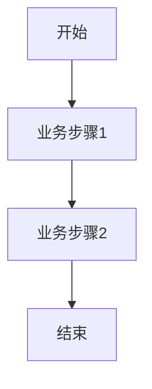

<!--
文档说明：
- 内容：模块业务需求文档模板
- 作用：记录业务需求、功能规格、验收标准
- 使用方法：详细记录业务需求，不包含技术实现
-->

# user-auth模块 - 业务需求文档

📅 **创建日期**: 2025-09-16  
👤 **需求方**: 电商平台产品团队  
✅ **评审状态**: 文档驱动开发验证中  
🔄 **最后更新**: 2025-09-25  

## 业务背景

### 业务目标
建立安全可靠的用户认证体系，支撑电商平台的用户管理、权限控制和数据安全，确保平台业务的正常运营和用户数据保护。

### 业务场景
- **用户访问场景**: 新用户注册、老用户登录、密码找回、个人信息管理
- **权限控制场景**: 普通用户购物操作、管理员商品管理、系统管理员用户管理
- **安全防护场景**: 防止未授权访问、保护用户隐私数据、防范恶意攻击
- **会话管理场景**: 用户状态保持、自动登出、跨设备登录管理

### 成功指标
- **安全性指标**: 零用户数据泄露事件，密码暴力破解成功率 < 0.1%
- **用户体验指标**: 登录响应时间 < 200ms，注册转化率 > 85%
- **系统稳定性**: 认证服务可用性 > 99.9%，并发认证处理 > 1000 req/s

## 功能需求

### 核心功能列表
| 功能ID | 功能名称 | 优先级 | 业务价值 | 验收标准 |
|--------|----------|--------|----------|----------|
| AUTH-F001 | 用户注册 | 高 | 扩大用户基数，建立用户档案 | 新用户可成功创建账户，收到确认信息 |
| AUTH-F002 | 用户登录 | 高 | 用户身份验证，访问个人功能 | 已注册用户可凭正确凭据登录 |
| AUTH-F003 | 密码管理 | 高 | 账户安全保护，用户自主管理 | 用户可安全修改密码，重置遗忘密码 |
| AUTH-F004 | 用户信息管理 | 中 | 完善用户档案，提升体验 | 用户可查看和更新个人资料 |
| AUTH-F005 | 权限控制 | 高 | 保护系统资源，区分用户权限 | 不同角色用户只能访问授权功能 |
| AUTH-F006 | 会话管理 | 中 | 保持用户状态，安全登出 | 会话自动过期，支持手动登出 |
| AUTH-F007 | 管理员功能 | 中 | 用户管理，系统维护 | 管理员可管理用户账户和权限 |

### 详细功能描述

#### AUTH-F001: 用户注册
- **业务描述**: 新用户通过提供基本信息创建平台账户，获得平台访问权限
- **用户故事**: 作为潜在客户，我希望能够注册账户，以便开始使用电商平台的购物功能
- **前置条件**: 用户提供有效的用户名、邮箱和符合规则的密码
- **业务规则**: 
  - 规则1: 用户名和邮箱必须唯一，不得重复注册
  - 规则2: 密码必须满足安全强度要求（长度、复杂度）
  - 规则3: 注册信息必须真实有效，防止虚假注册
- **异常处理**: 用户名或邮箱已存在时提示选择其他；密码不符合要求时显示具体规则

#### AUTH-F002: 用户登录
- **业务描述**: 已注册用户通过用户名/邮箱和密码验证身份，获得系统访问权限
- **用户故事**: 作为注册用户，我希望能够登录系统，以便访问个人账户和使用平台功能
- **前置条件**: 用户已完成注册，提供正确的登录凭据
- **业务规则**: 
  - 规则1: 支持用户名或邮箱登录，灵活便民
  - 规则2: 密码错误3次后账户临时锁定，防范暴力破解
  - 规则3: 登录成功后建立安全会话，保持用户状态
- **异常处理**: 凭据错误时提示重新输入；账户锁定时显示解锁时间

#### AUTH-F003: 密码管理
- **业务描述**: 用户可以主动修改密码或在遗忘时重置密码，保障账户安全
- **用户故事**: 作为用户，我希望能够更改密码，以便在密码泄露风险时保护账户安全
- **前置条件**: 用户已登录（修改）或提供有效邮箱（重置）
- **业务规则**: 
  - 规则1: 修改密码需要验证当前密码，确认用户身份
  - 规则2: 新密码必须与当前密码不同，提升安全性
  - 规则3: 密码重置通过邮箱验证，防止恶意重置
- **异常处理**: 当前密码错误时阻止修改；邮箱验证失败时重新发送

#### AUTH-F005: 权限控制
- **业务描述**: 根据用户角色分配不同权限，保护系统资源和敏感数据
- **用户故事**: 作为平台管理者，我希望不同用户只能访问对应权限的功能，以便保护系统安全
- **前置条件**: 用户已登录，系统识别用户角色
- **业务规则**: 
  - 规则1: 普通用户只能访问购物和个人管理功能
  - 规则2: 管理员可以管理商品、订单和用户信息
  - 规则3: 未登录用户只能访问公开内容和注册/登录功能
- **异常处理**: 权限不足时显示友好提示，引导用户正确操作

## 非功能需求

### 性能要求
- **响应时间**: 登录认证 < 200ms，注册处理 < 500ms，密码加密 < 100ms
- **并发用户**: 支持1000个并发用户同时进行认证操作
- **吞吐量**: 处理能力 > 2000次认证请求/秒
- **资源消耗**: CPU使用率 < 70%，内存占用 < 512MB

### 安全要求  
- **数据保护**: 密码采用bcrypt加密存储，永不明文保存
- **传输安全**: 所有认证数据通过HTTPS传输，防止中间人攻击
- **访问控制**: JWT令牌机制，支持令牌过期和刷新
- **防护机制**: 防暴力破解（登录限制）、防CSRF攻击、SQL注入防护

### 可靠性要求
- **系统可用性**: 99.9%服务可用性，年停机时间 < 8.76小时
- **数据一致性**: 用户认证状态在分布式环境下保持一致
- **容错能力**: 单点故障不影响整体认证服务，支持优雅降级
- **恢复能力**: 系统故障后5分钟内自动恢复服务

### 可维护性要求
- **代码质量**: 代码覆盖率 > 80%，遵循项目编码规范
- **日志记录**: 完整的认证日志，支持安全审计和问题排查  
- **监控指标**: 实时监控认证成功率、响应时间、错误率
- **扩展能力**: 支持新增认证方式（微信登录等），模块化设计

## 业务规则

### 用户账户规则
- **用户名规则**: 3-20个字符，支持字母、数字、下划线，不得包含特殊符号
- **邮箱规则**: 符合RFC 5322标准，必须验证邮箱有效性
- **密码规则**: 8-128位，必须包含大小写字母、数字，建议包含特殊符号
- **账户状态**: 支持激活、锁定、禁用状态，影响登录权限

### 会话管理规则  
- **令牌有效期**: 访问令牌30分钟，刷新令牌30天（实际配置）
- **并发登录**: V1.0未实现限制，V2.0计划：最多3个设备
- **自动登出**: 令牌过期自动失效，前端需清除本地token
- **异地登录**: V1.0未实现，V2.0计划：检测异常登录并提醒

### 权限管理规则
- **角色定义**: 普通用户(user)、管理员(admin)、超级管理员(super_admin)
- **权限继承**: 高级角色自动包含低级角色的所有权限
- **权限检查**: 每个API请求都进行权限验证，拒绝未授权访问
- **角色变更**: 仅超级管理员可修改用户角色，记录变更日志

## 验收标准

### 功能验收标准
- ✅ 所有核心功能(AUTH-F001至AUTH-F007)100%实现并通过测试
- ✅ 用户注册流程完整，支持用户名和邮箱唯一性验证
- ✅ 登录认证准确，支持多种登录方式和错误处理
- ✅ 密码管理安全可靠，支持修改和重置功能
- ✅ 权限控制有效，不同角色访问正确的功能范围

### 性能验收标准
- ✅ 登录响应时间95%情况下 < 200ms
- ✅ 1000并发用户压力测试通过，系统稳定运行
- ✅ 内存使用在高峰期 < 512MB
- ✅ 系统可用性达到99.9%标准

### 安全验收标准  
- ✅ 密码加密存储，通过安全审计
- ✅ JWT令牌机制运行正常，无安全漏洞
- ✅ 通过OWASP安全测试，无高危漏洞
- ✅ 防暴力破解机制有效，恶意登录被成功阻止

## 约束条件

### 技术约束
- 必须基于现有的FastAPI框架和SQLAlchemy ORM
- 遵循项目的模块化架构和代码规范
- 兼容现有的数据库结构和API契约
- 支持未来向微服务架构的演进

### 业务约束  
- 不得影响现有用户的正常使用
- 必须符合数据保护法律法规要求
- 保持与其他业务模块的集成兼容性
- 支持运营团队的用户管理需求

### 资源约束
- 开发时间限制在当前版本迭代周期内
- 服务器资源消耗不得超出预算范围
- 第三方服务依赖最小化，降低成本和风险
- 维护成本控制在合理范围内
- **数据量**: {预期数据量}

### 可用性要求
- **系统可用性**: {可用性指标}
- **故障恢复**: {恢复时间要求}

### 安全要求
- **数据安全**: {安全要求}
- **访问控制**: {权限要求}

### 扩展性要求
- **用户增长**: {用户增长预期}
- **功能扩展**: {扩展方向}

## 业务约束

### 合规要求
- {合规要求1}
- {合规要求2}

### 时间约束
- **交付时间**: {具体时间}
- **里程碑**: {关键时间节点}

### 资源约束
- **人力资源**: {资源限制}
- **技术约束**: {技术限制}

## 用户角色和权限

### 用户角色定义
| 角色名称 | 角色描述 | 权限范围 |
|----------|----------|----------|
| {角色1} | {角色描述} | {权限列表} |
| {角色2} | {角色描述} | {权限列表} |

### 权限矩阵
| 功能 | {角色1} | {角色2} | {角色3} |
|------|---------|---------|---------|
| {功能1} | ✅ | ❌ | 🔍 |
| {功能2} | ✅ | ✅ | ❌ |

## 业务流程

### 主要业务流程

### 异常流程
- **异常1**: {异常描述和处理流程}
- **异常2**: {异常描述和处理流程}

## 数据需求

### 核心业务实体
| 实体名称 | 业务含义 | 核心属性 |
|----------|----------|----------|
| {实体1} | {业务含义} | {属性列表} |
| {实体2} | {业务含义} | {属性列表} |

### 数据规则
- **唯一性**: {唯一性要求}
- **完整性**: {完整性要求}
- **一致性**: {一致性要求}

## 验收标准

### 功能验收
- [ ] {验收项1}
- [ ] {验收项2}
- [ ] {验收项3}

### 性能验收
- [ ] {性能指标1}
- [ ] {性能指标2}

### 安全验收
- [ ] {安全要求1}
- [ ] {安全要求2}

## 风险和依赖

### 业务风险
- **风险1**: {风险描述和缓解措施}
- **风险2**: {风险描述和缓解措施}

### 外部依赖
- **依赖1**: {依赖描述和影响}
- **依赖2**: {依赖描述和影响}

## 变更记录

| 日期 | 版本 | 变更内容 | 变更人 |
|------|------|----------|--------|
| 2025-09-16 | v1.0 | 初始版本 | {姓名} |
