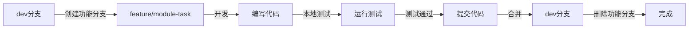

# Git分支管理指南

**文档版本**: v1.0  
**更新日期**: 2025-10-15  
**适用范围**: E-commerce Platform项目

---

## 📋 目录

1. [分支结构](#分支结构)
2. [分支命名规范](#分支命名规范)
3. [工作流程](#工作流程)
4. [操作指南](#操作指南)
5. [常见问题](#常见问题)

---

## 分支结构

### 核心分支

```
ecommerce_platform/
├── main                    # 生产环境（稳定版本）
├── dev                     # 主开发分支（日常开发集成）
└── testgen-baseline        # 里程碑分支（测试生成工具v1.0）
```

#### 分支说明

| 分支 | 用途 | 保护级别 | 推送规则 |
|------|------|----------|----------|
| `main` | 生产环境代码 | 🔒 高 | 仅从dev合并 |
| `dev` | 主开发分支 | 🔐 中 | 从功能分支合并 |
| `testgen-baseline` | 重要里程碑 | 📌 里程碑 | 不修改（保留历史） |

### 临时分支

#### 功能开发分支
```
feature/[module-name]-[description]
```

**示例**：
- `feature/order-management-refactor` - 订单模块重构
- `feature/payment-integration` - 支付集成
- `feature/inventory-management` - 库存管理

**生命周期**: 创建 → 开发 → 测试 → 合并到dev → 删除

#### 修复分支
```
fix/[issue-description]
```

**示例**：
- `fix/test-generator-check-constraints` - 修复测试生成器CHECK约束bug
- `fix/cart-foreign-key-error` - 修复购物车外键错误

**生命周期**: 创建 → 修复 → 测试 → 合并到dev → 删除

#### 重构分支
```
refactor/[component-name]
```

**示例**：
- `refactor/four-layer-architecture` - 四层架构重构
- `refactor/dependency-injection` - 依赖注入重构

**生命周期**: 创建 → 重构 → 测试 → 合并到dev → 删除

#### 文档分支
```
docs/[topic]
```

**示例**：
- `docs/api-standards-update` - API标准文档更新
- `docs/architecture-diagrams` - 架构图更新

**生命周期**: 创建 → 编写 → 审查 → 合并到dev → 删除

---

## 分支命名规范

### 命名规则

1. **全部小写**
2. **单词用连字符分隔** (`-`)
3. **不使用下划线** (`_`)
4. **简洁明了**（不超过50个字符）

### 命名模板

```
[type]/[scope]-[short-description]
```

**Type**:
- `feature` - 新功能
- `fix` - Bug修复
- `refactor` - 代码重构
- `docs` - 文档更新
- `test` - 测试专项
- `perf` - 性能优化
- `chore` - 构建/工具相关

**Scope**:
- 模块名（如 `order-management`, `user-auth`）
- 组件名（如 `database`, `redis-client`）
- 系统名（如 `ci-cd`, `monitoring`）

### 命名示例

✅ **好的命名**:
```bash
feature/order-management-repository-layer
fix/shopping-cart-quantity-validation
refactor/service-layer-dependency-injection
docs/database-standards-update
test/order-management-integration
```

❌ **不好的命名**:
```bash
feature/order_management_fix        # 使用了下划线
fix/bug123                          # 不够描述性
OrderManagement                     # 大小写混乱
feature/this-is-a-very-long-branch-name-that-describes-everything  # 太长
```

---

## 工作流程

### 标准功能开发流程



#### 详细步骤

**1. 创建功能分支**
```powershell
# 确保dev分支是最新的
git checkout dev
git pull origin dev

# 创建并切换到功能分支
git checkout -b feature/order-management-testing
```

**2. 开发和提交**
```powershell
# 编写代码...

# 运行本地测试
pytest tests/unit/order_management/ -v

# 提交更改
git add .
git commit -m "feat(order-management): 完成订单测试代码生成"
```

**3. 保持与dev同步**（长期开发分支）
```powershell
# 定期从dev合并最新更改
git checkout feature/order-management-testing
git merge dev

# 解决冲突（如果有）
# ... 手动解决冲突 ...
git add .
git commit -m "merge: 合并dev最新更改"
```

**4. 合并回dev**
```powershell
# 切换到dev分支
git checkout dev

# 合并功能分支（保留合并历史）
git merge feature/order-management-testing --no-ff -m "feat: 完成订单管理模块测试"

# 推送到远程
git push origin dev
```

**5. 清理功能分支**
```powershell
# 删除本地分支
git branch -d feature/order-management-testing

# 删除远程分支（如果推送过）
git push origin --delete feature/order-management-testing
```

### 紧急修复流程

```powershell
# 1. 从dev创建修复分支
git checkout dev
git checkout -b fix/critical-bug

# 2. 修复问题
# ... 编写修复代码 ...

# 3. 测试验证
pytest tests/ -v

# 4. 快速合并回dev
git checkout dev
git merge fix/critical-bug --no-ff -m "fix: 修复关键bug"
git push origin dev

# 5. 删除修复分支
git branch -d fix/critical-bug
```

---

## 操作指南

### 使用自动化脚本

#### 1. 整合订单模块升级

```powershell
# 演练模式（查看将要执行的操作）
.\tools\integrate_order_module.ps1 -DryRun

# 实际执行
.\tools\integrate_order_module.ps1

# 跳过备份（如果已有备份）
.\tools\integrate_order_module.ps1 -SkipBackup
```

**脚本功能**：
- ✅ 从dev分支提取订单模块代码和文档
- ✅ 保持测试工具稳定版本
- ✅ 自动创建备份分支
- ✅ 生成详细的提交信息

#### 2. 清理无用分支

```powershell
# 演练模式
.\tools\cleanup_branches.ps1 -DryRun

# 仅删除本地分支
.\tools\cleanup_branches.ps1

# 同时删除远程分支
.\tools\cleanup_branches.ps1 -DeleteRemote

# 强制删除（不需要确认）
.\tools\cleanup_branches.ps1 -Force
```

**脚本功能**：
- ✅ 自动识别已完成的功能分支
- ✅ 保护核心分支不被删除
- ✅ 支持演练模式
- ✅ 可选删除远程分支

### 手动操作命令

#### 查看分支状态

```powershell
# 查看所有本地分支
git branch -vv

# 查看所有远程分支
git branch -r

# 查看所有分支（本地+远程）
git branch -a

# 查看分支关系图
git log --graph --oneline --all -20
```

#### 分支切换和创建

```powershell
# 切换到已有分支
git checkout dev

# 创建并切换到新分支
git checkout -b feature/new-module

# 基于指定提交创建分支
git checkout -b feature/hotfix 73f8aa4
```

#### 分支合并

```powershell
# 普通合并（快进模式）
git merge feature/new-module

# 非快进合并（保留分支历史）
git merge feature/new-module --no-ff

# 压缩合并（所有提交合并为一个）
git merge feature/new-module --squash
```

#### 分支删除

```powershell
# 删除本地分支（安全删除，未合并会失败）
git branch -d feature/completed

# 强制删除本地分支
git branch -D feature/abandoned

# 删除远程分支
git push origin --delete feature/completed
```

#### 清理远程追踪分支

```powershell
# 清理已删除的远程分支引用
git remote prune origin

# 查看将要清理的内容
git remote prune origin --dry-run
```

---

## 常见问题

### Q1: 什么时候创建新分支？

**A**: 以下情况需要创建新分支：
- ✅ 开始新功能开发
- ✅ 修复独立的bug
- ✅ 进行代码重构
- ✅ 更新重要文档
- ✅ 实验性的技术尝试

**不需要**创建新分支：
- ❌ 修改README中的错别字（直接在dev提交）
- ❌ 调整代码格式（直接在dev提交）
- ❌ 更新注释（直接在dev提交）

### Q2: 功能分支应该保留多久？

**A**: 
- **短期分支**（1-3天）: 小功能或bug修复，完成后立即合并删除
- **中期分支**（1-2周）: 中等规模功能开发，定期从dev合并更新
- **长期分支**（>2周）: 大型功能或模块开发，每天从dev合并更新

**原则**: 分支存在时间越短越好，避免长期分歧。

### Q3: 如何处理合并冲突？

**A**: 
```powershell
# 1. 合并时遇到冲突
git merge feature/module
# Auto-merging file.py
# CONFLICT (content): Merge conflict in file.py

# 2. 查看冲突文件
git status

# 3. 手动解决冲突（编辑文件）
# 删除冲突标记: <<<<<<<, =======, >>>>>>>
# 保留需要的代码

# 4. 标记为已解决
git add file.py

# 5. 完成合并
git commit -m "merge: 解决与feature/module的冲突"
```

### Q4: 如何撤销错误的合并？

**A**:
```powershell
# 方法1: 如果还未推送到远程
git reset --hard HEAD~1

# 方法2: 如果已推送到远程（创建反向提交）
git revert -m 1 HEAD

# 方法3: 使用reflog恢复
git reflog
git reset --hard HEAD@{n}  # n是reflog中的序号
```

### Q5: 里程碑分支（testgen-baseline）可以删除吗？

**A**: **不建议删除**。里程碑分支用于标记重要的开发节点，应该永久保留。

**保留理由**：
- 📌 标记重要的开发里程碑
- 🔄 提供稳定的回退点
- 📊 方便对比不同版本的差异
- 📚 作为历史参考和学习资料

如果担心分支过多，可以使用Git标签（tags）：
```powershell
# 基于里程碑分支创建标签
git tag -a v1.0-testgen-stable -m "测试生成工具稳定版本" testgen-baseline

# 推送标签到远程
git push origin v1.0-testgen-stable

# 之后可以删除分支，保留标签
git branch -d testgen-baseline
```

### Q6: 如何在多个远程仓库间同步分支？

**A**: 项目配置了3个远程仓库（origin, github, gitee）：

```powershell
# 推送到所有远程仓库
git push origin dev
git push github dev
git push gitee dev

# 或使用别名一次性推送
git remote | ForEach-Object { git push $_ dev }

# 拉取最新更改（通常只从主远程）
git pull origin dev
```

---

## 最佳实践

### ✅ 推荐做法

1. **经常提交**: 小步提交，描述清晰
2. **保持同步**: 长期分支每天从dev合并更新
3. **测试先行**: 合并前确保所有测试通过
4. **及时清理**: 合并后立即删除功能分支
5. **描述详细**: 分支名和提交信息要有意义
6. **代码审查**: 重要功能合并前自我审查

### ❌ 避免做法

1. **长期不合并**: 分支存在超过2周不合并
2. **直接修改dev**: 所有开发都应在功能分支进行
3. **忽略冲突**: 合并冲突要认真解决，不能随意删除代码
4. **强制推送dev**: `git push -f origin dev` 极其危险
5. **不测试就合并**: 未经测试的代码不应合并到dev
6. **含糊的命名**: 分支名如 `test`, `tmp`, `fix` 过于简单

---

## 附录

### 完整的分支生命周期示例

```powershell
# ========== 第1天: 开始开发 ==========
# 创建功能分支
git checkout dev
git pull origin dev
git checkout -b feature/order-management-testing

# 开发和提交
# ... 编写代码 ...
git add tests/unit/order_management/
git commit -m "test(order-management): 添加订单模型测试"

# ========== 第2天: 继续开发 ==========
# 同步dev的最新更改
git merge dev

# 继续开发
# ... 编写更多测试 ...
git add tests/integration/order_management/
git commit -m "test(order-management): 添加订单集成测试"

# ========== 第3天: 完成开发 ==========
# 最后一次同步
git merge dev

# 运行完整测试
pytest tests/unit/order_management/ -v
pytest tests/integration/order_management/ -v

# 合并回dev
git checkout dev
git merge feature/order-management-testing --no-ff -m "test: 完成订单管理模块完整测试套件

- 添加订单模型测试（30个测试用例）
- 添加订单仓储测试（20个测试用例）
- 添加订单服务测试（15个测试用例）
- 添加订单集成测试（10个测试用例）
- 测试覆盖率达到95%
"

# 推送到远程
git push origin dev

# 清理分支
git branch -d feature/order-management-testing

# ========== 完成 ==========
```

### 快速参考

```powershell
# 查看当前分支
git branch --show-current

# 查看未合并的分支
git branch --no-merged dev

# 查看已合并的分支
git branch --merged dev

# 重命名分支
git branch -m old-name new-name

# 比较分支差异
git diff dev..feature/module

# 查看分支提交历史
git log dev..feature/module --oneline

# 恢复已删除的分支
git reflog
git checkout -b recovered-branch <commit-hash>
```

---

**文档维护**: 本文档应随项目发展持续更新  
**反馈渠道**: 如有改进建议，请更新此文档  
**版本历史**: 记录在Git提交历史中
