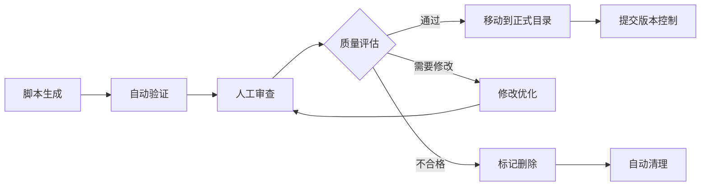

# 测试环境配置指南

📝 **文档说明**：
- **内容**：详细的测试环境配置、工具使用、故障排除指南
- **使用者**：开发人员、测试人员、AI助手
- **更新频率**：测试工具或环境配置变更时更新
- **关联文档**：[测试标准](../standards/testing-standards.md)、[工作流程](../standards/workflow.md)

## 🎯 快速测试执行

> **测试类型和执行策略**: 详见 [测试标准文档](../standards/testing-standards.md)  
> **测试执行命令**: 详见 [脚本使用手册](scripts-usage-manual.md)

## 测试环境配置

> **测试架构、策略和标准**: 详见 [测试标准文档](../standards/testing-standards.md)  
> **本文档职责**: 环境配置步骤、工具安装、故障排除

## 📋 标准测试执行流程模板

### 🚀 完整测试执行检查清单

**测试执行标准流程**：详见 [测试标准文档](../standards/testing-standards.md)

**脚本使用步骤**：详见 [脚本使用手册](scripts-usage-manual.md)

## 🛠️ 测试工具使用指南

### 🤖 Generated目录管理策略

**目录用途**: `tests/generated/` 用于存放自动生成的测试模板文件，具有临时性质。

#### 文件生命周期管理


#### 管理规则
- **版本控制**: generated目录内容不提交到Git（已配置.gitignore）
- **自动清理**: 超过7天的未处理文件自动清理
- **质量控制**: 生成的文件必须经过验证和审查
- **迁移流程**: 审查通过后迁移到正式测试目录

#### 使用工作流
```powershell
# 1. 生成测试模板
python scripts/generate_test_template.py shopping_cart --type all

# 2. 验证生成质量  
python scripts/validate_generated_tests.py

# 3. 人工审查和优化
# (编辑tests/generated/中的文件)

# 4. 迁移到正式目录
python scripts/migrate_generated_test.py tests/generated/test_cart_complete.py unit

# 5. 清理和维护
.\scripts\manage_generated_tests.ps1 -Action clean -Days 7
```

#### 相关文档
- **详细管理策略**: `docs/development/generated-tests-management.md`
- **生成工具使用**: `docs/development/scripts-usage-manual.md`

---

### `check_test_env.ps1` - 智能测试环境检查工具

**功能描述**: 电商平台专用的智能化测试环境验证工具，支持分层检查和模式分离。

#### 核心特性
- **分层验证**: 虚拟环境 → 基础依赖 → 项目结构 → 模式特定检查
- **快速失败**: 关键步骤失败立即停止，提供明确修复建议
- **双模式支持**: lite模式（单元测试）和full模式（集成测试）
- **智能检测**: 自动识别Docker状态和服务运行情况

#### 使用方法
```powershell
# 轻量模式检查（默认）- 适用于单元测试
.\scripts\check_test_env.ps1
.\scripts\check_test_env.ps1 -TestMode lite

# 完整模式检查 - 适用于集成测试  
.\scripts\check_test_env.ps1 -TestMode full
```

#### 检查流程

**第1步: 虚拟环境激活与验证**
- 自动激活.venv虚拟环境
- 验证Python版本（3.8+）
- 确认虚拟环境路径正确

**第2步: 基础依赖验证**
- pytest (测试框架)
- sqlalchemy (数据库ORM)
- fastapi (Web框架)
- httpx (HTTP客户端)
- pydantic (数据验证)

**第3步: 项目结构验证**
- 测试目录结构 (tests/, tests/unit/, tests/factories/)
- 配置文件 (pyproject.toml, tests/conftest.py)
- pytest配置验证

**第4步: 模式特定检查**
- **lite模式**: pytest-mock, factory_boy, SQLite内存数据库
- **full模式**: Docker环境, docker-compose服务, MySQL/Redis连接

#### 输出示例
```powershell
# 基本使用
.\scripts\check_test_env.ps1

# 输出示例 (成功)
🔍 快速测试环境检查
========================================
✅ Python虚拟环境
✅ Python包: pytest
✅ Python包: sqlalchemy
✅ Python包: fastapi
✅ Python包: httpx
✅ 测试目录: tests
✅ 测试目录: tests/unit
✅ 测试目录: tests/integration
✅ 测试目录: tests/e2e
✅ pytest配置文件
✅ SQLite数据库
✅ Docker (集成测试可选)

```powershell
# lite模式成功输出
ℹ️  🔍 测试环境检查 - lite 模式
==================================================

📋 第1步：虚拟环境激活与验证
==================================================
✅ 虚拟环境激活
   Python路径: E:\ecommerce_platform\.venv\Scripts\python.exe
✅ Python版本
   Python 3.11.9

📋 第2步：基础依赖验证
==================================================
✅ 数据验证 - Python包: pydantic
✅ 测试框架 - Python包: pytest
✅ 数据库ORM - Python包: sqlalchemy
✅ HTTP客户端 - Python包: httpx
✅ Web框架 - Python包: fastapi

📋 第3步：项目结构验证
==================================================
✅ 测试根目录 - tests
✅ 单元测试目录 - tests/unit
✅ 测试工厂目录 - tests/factories
✅ 项目配置文件 - pyproject.toml
✅ pytest配置 - pyproject.toml中的[tool.pytest.ini_options]

📋 第4步：轻量模式特定检查
==================================================
✅ Mock功能 - Python包: pytest-mock
✅ 测试数据工厂 - Python包: factory_boy
✅ SQLite内存数据库 - 轻量模式数据库
✅ 🎉 轻量模式环境检查通过！

ℹ️  可以运行以下测试命令:
  pytest tests/unit/ -v           # 单元测试
  pytest tests/unit/ --cov=app    # 单元测试 + 覆盖率
```

---

### `setup_test_env.ps1` - 统一测试环境管理工具

**功能描述**: 电商平台测试环境的统一管理入口，支持环境检查和设置的完整工作流程。

#### 核心特性
- **统一入口**: 所有测试环境操作的单一入口点
- **职责分离**: 委托专业脚本进行环境检查
- **双工作模式**: CheckOnly（仅检查）和Setup（检查+设置）
- **参数标准化**: 使用TestMode参数替代旧版TestType

#### 参数说明
```powershell
-TestMode <模式>    # lite|full (默认: lite)
-CheckOnly         # 仅检查环境，不进行设置
-AutoFix          # 自动修复发现的问题
-Verbose          # 显示详细信息
```

#### 使用方法

**基础使用**
```powershell
# 默认lite模式，进行环境设置
.\scripts\setup_test_env.ps1

# 仅检查lite环境状态
.\scripts\setup_test_env.ps1 -CheckOnly

# 仅检查full环境状态（包括Docker）
.\scripts\setup_test_env.ps1 -TestMode full -CheckOnly
```

**高级使用**
```powershell
# 设置完整测试环境
.\scripts\setup_test_env.ps1 -TestMode full

# 自动修复环境问题
.\scripts\setup_test_env.ps1 -TestMode full -AutoFix

# 详细模式显示更多信息
.\scripts\setup_test_env.ps1 -TestMode full -Verbose
```

#### 工作流程

**CheckOnly模式（仅检查）**:
1. 调用check_test_env.ps1进行专业检查
2. 返回详细的环境状态报告
3. 不进行任何修改或设置操作

**Setup模式（检查+设置）**:
1. 首先执行完整环境检查
2. 根据TestMode启动相应服务
3. 进行必要的环境配置
4. 验证设置结果

#### 环境模式对比

| 特性 | lite模式 | full模式 |
|------|---------|----------|
| **用途** | 单元测试 | 集成测试 |
| **数据库** | SQLite内存 | MySQL (Docker) |
| **Mock** | pytest-mock | 真实服务 |
| **Docker** | 不需要 | 必需 |
| **启动时间** | < 5秒 | 30-60秒 |
| **资源占用** | 低 | 中等 |

#### 使用场景

**场景1：快速单元测试** 
```powershell
.\scripts\setup_test_env.ps1 -TestMode lite

```bash
.\scripts\setup_test_env.ps1 -TestMode lite           # 轻量测试（单元测试）
.\scripts\setup_test_env.ps1 -TestMode full          # 完整测试（集成测试）
.\scripts\setup_test_env.ps1 -TestMode full           # 全部测试（推荐full模式）
.\scripts\setup_test_env.ps1 -TestMode lite -CheckOnly      # 仅检查环境，不进行设置
```

### validate_test_config.py 诊断工具

> **基本用法**: 详见 [测试标准文档](../standards/testing-standards.md)

#### 详细验证内容
```powershell
.\scripts\setup_test_env.ps1 -TestMode full

# 执行流程：
# 1-5. 同上环境准备
# 6. 执行集成测试 (pytest tests/integration/ -v)
# 7. 清理Docker容器
# 8. 生成测试报告
```

**场景4：完整测试套件**
```powershell
.\scripts\setup_test_env.ps1 -TestMode full

# 执行流程：
# 1. 准备所有测试环境
# 2. 依次执行：单元测试 → 集成测试 → E2E测试
# 3. 清理所有环境
# 4. 生成综合测试报告
```

### 3. validate_test_config.py - 深度配置验证

#### 功能说明
7步详细验证，深度诊断测试配置问题，用于故障排查。

#### 验证步骤
```python
1. Python环境验证       # Python版本、虚拟环境状态
2. 测试依赖包验证       # 所有必需包的安装状态
3. 应用模块导入验证     # 核心模块导入能力测试
4. 单元测试配置验证     # SQLite内存数据库功能测试
5. 烟雾测试配置验证     # SQLite文件数据库功能测试
6. 集成测试配置验证     # MySQL连接测试 (可选)
7. pytest配置验证      # pytest配置文件和目录结构
```

#### 使用示例
```powershell
python scripts/validate_test_config.py

# 输出示例 (部分)
🔍 测试环境配置验证开始
==================================================
=== Python环境验证 ===
✅ Python版本: 3.11.9
✅ 虚拟环境已激活: E:\ecommerce_platform\.venv
✅ 项目根目录: E:\ecommerce_platform

=== 测试依赖包验证 ===
✅ pytest - 已安装
✅ sqlalchemy - 已安装
✅ fastapi - 已安装

=== 单元测试配置验证 ===
✅ SQLite内存数据库连接成功
✅ 数据库会话创建成功

📊 验证结果: 7个通过, 0个失败
🎉 所有测试环境配置验证通过！可以开始运行测试。
```

## 🚨 故障排除指南

### 常见问题与解决方案

#### 问题1：虚拟环境未激活
```
❌ Python虚拟环境
   当前Python: C:\Python39\python.exe
```
**解决方案**：
```powershell
# 激活虚拟环境
.venv\Scripts\Activate.ps1

# 验证激活
python -c "import sys; print(sys.prefix)"
```

#### 问题2：依赖包缺失
```
❌ Python包: pytest - 未安装
```
**解决方案**：
```powershell
# 安装测试依赖
pip install pytest pytest-asyncio pytest-cov

# 或安装完整依赖
pip install -r requirements.txt
```

#### 问题3：测试目录结构问题
```
❌ 测试目录: tests/unit
```
**解决方案**：
```powershell
# 检查目录结构
ls tests/

# 创建缺失目录
mkdir tests/unit, tests/integration, tests/e2e
```

#### 问题4：Docker环境问题
```
⚠️ MySQL测试数据库不可用: Can't connect to MySQL
```
**解决方案**：
```powershell
# 检查Docker状态
docker --version

# 启动Docker Desktop
# 然后重新运行测试
.\scripts\setup_test_env.ps1 -TestMode full
```

#### 问题5：SQLAlchemy模型关系错误
```
❌ One or more mappers failed to initialize - can't proceed
```
**解决方案**：
```powershell
# 运行详细验证
python scripts/validate_test_config.py

# 检查模型导入
python -c "from app.modules.user_auth.models import User; print('OK')"

# 重新生成数据库
rm tests/smoke_test.db
.\scripts\setup_test_env.ps1 -TestMode lite  # smoke测试建议使用轻量模式
```

### 环境重置步骤

**完全重置测试环境**：
```powershell
# 第一步：清理测试数据库文件
Remove-Item tests/smoke_test.db -Force -ErrorAction SilentlyContinue

# 第二步：停止并清理Docker容器（如果使用docker-compose）
docker-compose down
docker-compose up -d

# 或者重启特定的测试容器
docker restart ecommerce_platform-mysql-test

# 第三步：重新验证环境
.\scripts\check_test_env.ps1

# 第四步：重新运行测试
.\scripts\setup_test_env.ps1 -TestMode lite
```

## 🏭 双工厂架构使用指南

### 📋 工厂选择决策表

| 测试类型 | 推荐工厂 | 主要用途 | 示例场景 |
|---------|---------|---------|---------|
| **单元测试** | `user_auth_factories.py`<br/>(Factory Boy) | 纯逻辑测试<br/>Mock配合测试<br/>复杂关系测试 | 权限验证<br/>密码加密<br/>业务规则 |
| **集成测试** | `data_factory.py`<br/>(统一工厂) | 跨模块测试<br/>数据库集成<br/>API接口测试 | 用户注册流程<br/>订单创建<br/>库存扣减 |
| **E2E测试** | `data_factory.py`<br/>(统一工厂) | 完整业务流程<br/>真实数据链 | 完整购物流程<br/>支付流程 |
| **烟雾测试** | `data_factory.py`<br/>(统一工厂) | 基础功能验证<br/>环境健康检查 | 系统启动<br/>基础API |

### 🔧 Factory Boy工厂使用 (单元测试)

```python
# tests/unit/user_auth/test_user_permissions.py
from tests.factories.user_auth_factories import UserFactory, RoleFactory, PermissionFactory
import pytest
from unittest.mock import Mock

class TestUserPermissions:
    
    def test_user_has_admin_permission(self, mocker):
        """测试用户权限检查逻辑"""
        # Factory Boy + Mock的完美组合
        user = UserFactory(is_active=True)
        admin_role = RoleFactory(name='admin')
        admin_permission = PermissionFactory(resource='user', action='manage')
        
        # Mock外部依赖
        mock_auth_service = mocker.patch('app.services.AuthService')
        mock_auth_service.get_user_permissions.return_value = [admin_permission]
        
        # 测试业务逻辑
        result = user.has_permission('user.manage')
        assert result is True
        
    def test_password_encryption(self):
        """测试密码加密逻辑"""
        user = UserFactory(password='plain_password')
        # Factory Boy自动处理复杂的密码加密逻辑
        assert user.password_hash != 'plain_password'
        assert user.verify_password('plain_password')
```

### 🌐 统一工厂使用 (集成测试)

```python
# tests/integration/test_order_workflow.py
from tests.factories.data_factory import StandardTestDataFactory
import pytest

class TestOrderWorkflow:
    
    def test_complete_order_creation(self, integration_test_db):
        """测试完整订单创建流程"""
        # 创建完整业务数据链
        user, category, brand, product, sku = StandardTestDataFactory.create_complete_chain(
            integration_test_db
        )
        
        # 测试真实的订单服务
        order_service = OrderService(integration_test_db)
        result = order_service.create_order(
            user_id=user.id,
            sku_id=sku.id,
            quantity=2
        )
        
        assert result.success is True
        assert result.order.user_id == user.id
        assert result.order.total_amount > 0
        
    def test_inventory_deduction(self, integration_test_db):
        """测试库存扣减集成"""
        user, _, _, _, sku = StandardTestDataFactory.create_complete_chain(
            integration_test_db
        )
        
        initial_stock = sku.current_stock
        order_service = OrderService(integration_test_db)
        
        # 测试库存扣减
        order_service.create_order(user.id, sku.id, quantity=1)
        
        # 验证库存变化
        integration_test_db.refresh(sku)
        assert sku.current_stock == initial_stock - 1
```

### ⚠️ 工厂使用注意事项

#### ✅ **正确做法**
- 单元测试使用Factory Boy工厂 + pytest-mock
- 集成测试使用统一工厂 + 真实数据库
- 根据测试类型选择合适的数据库fixture
- 遵循测试架构的数据库策略

#### ❌ **避免的错误**
```python
# 错误1: 在单元测试中使用统一工厂 (创建真实数据库记录)
def test_user_logic():
    user, _, _, _, _ = StandardTestDataFactory.create_complete_chain(db)  # ❌ 太重

# 错误2: 在集成测试中过度使用Factory Boy (Mock不适用)
def test_order_integration():
    user = UserFactory()  # ❌ Mock数据不适用于真实数据库集成

# 错误3: 混用不同工厂类型
def test_mixed():
    user = UserFactory()  # Factory Boy
    order_data = StandardTestDataFactory.create_order_data(db, user.id)  # ❌ 不匹配
```

### 🎯 最佳实践建议

1. **测试前先确定类型**: 单元测试 → Factory Boy，集成测试 → 统一工厂
2. **保持一致性**: 一个测试文件内使用同一种工厂类型
3. **利用工厂优势**: Factory Boy处理复杂关系，统一工厂保证数据完整性
4. **合理使用Mock**: 单元测试中Mock外部依赖，集成测试中测试真实交互

## 📊 测试执行最佳实践

### 开发阶段测试策略
```powershell
# 开发过程中：频繁运行单元测试
.\scripts\setup_test_env.ps1 -TestMode lite

# 功能完成后：运行集成测试
.\scripts\setup_test_env.ps1 -TestMode full

# 提交前：运行完整测试套件
.\scripts\setup_test_env.ps1 -TestMode full
```

### 持续集成环境配置
```yaml
# CI/CD管道中的测试步骤
steps:
  - name: Setup Test Environment
    run: .\scripts\check_test_env.ps1
    
  - name: Run Unit Tests
    run: .\scripts\setup_test_env.ps1 -TestMode lite
    
  - name: Run Integration Tests
    run: .\scripts\setup_test_env.ps1 -TestMode full
```

## 🧪 测试脚本编写强制标准

### 📋 测试脚本编写检查清单

**每个测试文件必须包含的强制元素**：

```python
# ✅ 强制检查清单 - 每个测试文件必须具备

# 1. 标准导入 (必须)
import pytest
from unittest.mock import Mock, patch
import sqlalchemy
from sqlalchemy.orm import Session

# 2. 工厂导入 (数据测试必须) - 根据测试类型选择
# 单元测试 - 使用专用Factory Boy工厂
from tests.factories.user_auth_factories import UserFactory, RoleFactory
# 集成测试 - 使用统一数据工厂
from tests.factories.data_factory import StandardTestDataFactory

# 3. 配置导入 (必须)
from tests.conftest import test_db_session

# 4. 被测模块导入 (必须)
from app.modules.[模块名] import [被测类/函数]

# 5. 测试类结构 (推荐)
class Test[功能名]:
    """
    测试类必须包含：
    - 类文档字符串说明测试范围
    - 至少3个测试方法 (正常、异常、边界)
    - setup/teardown方法(如需要)
    """
    
    def setup_method(self):
        """每个测试方法执行前的准备工作"""
        pass
    
    def test_[功能]_success(self):
        """正常场景测试 - 必须有"""
        pass
    
    def test_[功能]_with_invalid_data(self):
        """异常场景测试 - 必须有"""
        pass
    
    def test_[功能]_edge_cases(self):
        """边界条件测试 - 必须有"""
        pass
```

### 🚨 强制执行标准

**测试脚本命名规范** (违反将导致CI失败):
```bash
# ✅ 正确命名
test_user_models.py          # 模型测试
test_user_services.py        # 服务层测试  
test_user_api.py            # API测试
test_user_integration.py     # 集成测试

# ❌ 错误命名 (CI会拒绝)
user_test.py                # 错误：应以test_开头
test_users.py              # 模糊：应具体到功能域
tests.py                   # 错误：过于宽泛
```

**测试函数命名标准** (强制检查):
```python
# ✅ 标准格式
def test_[功能]_[场景]_[预期结果]():
    pass

# ✅ 实际示例
def test_create_user_with_valid_data_returns_user_object():
    pass

def test_create_user_with_duplicate_email_raises_validation_error():
    pass

def test_authenticate_user_with_wrong_password_returns_false():
    pass

# ❌ 禁止的命名 (CI会警告)
def test_user():                    # 过于简单
def test_something():              # 不明确
def create_user_test():           # 格式错误
```

### 🔧 自动化验证机制

**代码质量强制检查**：

```python
# 1. 测试覆盖率检查 (自动)
# 每个模块必须 ≥ 80% 测试覆盖率
# 关键业务逻辑必须 ≥ 95% 覆盖率

# 2. Mock使用标准检查 (自动)
# ✅ 强制使用 pytest-mock
@pytest.fixture
def mock_user_service(mocker):
    return mocker.patch('app.services.UserService')

# ❌ 禁止使用 unittest.mock 直接导入
# from unittest.mock import Mock  # CI会报错

# 3. 数据工厂标准检查 (自动)  
# ✅ 必须使用双工厂架构模式
def test_create_user_unit():  # 单元测试
    user = UserFactory.create()  # 使用Factory Boy工厂
    
def test_order_workflow_integration():  # 集成测试  
    user, category, brand, product, sku = StandardTestDataFactory.create_complete_chain(db)
    
# ❌ 禁止硬编码测试数据
# user = User(name="test", email="test@example.com")  # CI会警告
```

**测试结构验证脚本**：

创建 `scripts/validate_test_structure.py`:
```python
#!/usr/bin/env python3
"""
测试结构自动验证脚本
运行: python scripts/validate_test_structure.py
"""

import os
import ast
import sys
from pathlib import Path

class TestStructureValidator:
    def __init__(self):
        self.errors = []
        self.warnings = []
    
    def validate_file_naming(self, file_path):
        """验证文件命名规范"""
        filename = Path(file_path).name
        if not filename.startswith('test_'):
            self.errors.append(f"❌ {file_path}: 文件名必须以'test_'开头")
        
        if filename == 'test.py' or filename == 'tests.py':
            self.errors.append(f"❌ {file_path}: 文件名过于宽泛")
    
    def validate_test_functions(self, file_path):
        """验证测试函数命名和结构"""
        with open(file_path, 'r', encoding='utf-8') as f:
            try:
                tree = ast.parse(f.read())
            except SyntaxError as e:
                self.errors.append(f"❌ {file_path}: 语法错误 {e}")
                return
        
        for node in ast.walk(tree):
            if isinstance(node, ast.FunctionDef):
                if node.name.startswith('test_'):
                    self._validate_test_function_name(node.name, file_path)
    
    def _validate_test_function_name(self, func_name, file_path):
        """验证测试函数命名规范"""
        parts = func_name.split('_')
        if len(parts) < 3:  # test_功能_场景
            self.warnings.append(
                f"⚠️ {file_path}:{func_name} - 建议使用格式: test_功能_场景_预期结果"
            )
    
    def validate_required_imports(self, file_path):
        """验证必需的导入"""
        required_imports = ['pytest']
        
        with open(file_path, 'r', encoding='utf-8') as f:
            content = f.read()
            
        for required in required_imports:
            if f"import {required}" not in content and f"from {required}" not in content:
                self.errors.append(f"❌ {file_path}: 缺少必需导入 '{required}'")
    
    def run_validation(self, test_dir="tests/"):
        """运行完整验证"""
        print("🔍 开始验证测试结构...")
        
        for root, dirs, files in os.walk(test_dir):
            for file in files:
                if file.endswith('.py') and file.startswith('test_'):
                    file_path = os.path.join(root, file)
                    self.validate_file_naming(file_path)
                    self.validate_test_functions(file_path)
                    self.validate_required_imports(file_path)
        
        # 输出结果
        if self.errors:
            print(f"\n❌ 发现 {len(self.errors)} 个错误:")
            for error in self.errors:
                print(f"  {error}")
        
        if self.warnings:
            print(f"\n⚠️ 发现 {len(self.warnings)} 个警告:")
            for warning in self.warnings:
                print(f"  {warning}")
        
        if not self.errors and not self.warnings:
            print("✅ 所有测试文件结构验证通过!")
        
        return len(self.errors) == 0

if __name__ == "__main__":
    validator = TestStructureValidator()
    success = validator.run_validation()
    sys.exit(0 if success else 1)
```

### 🎯 测试脚本自动生成模板

**使用脚本自动生成标准测试文件**：

创建 `scripts/generate_test_template.py`:
```python
#!/usr/bin/env python3
"""
标准测试文件生成器
使用: python scripts/generate_test_template.py module_name function_name
示例: python scripts/generate_test_template.py user_auth authenticate_user
"""

import sys
import os
from pathlib import Path

def generate_test_template(module_name, function_name):
    """生成标准测试文件模板"""
    
    template = f'''import pytest
from unittest.mock import Mock
import sqlalchemy
from sqlalchemy.orm import Session

# 测试工厂导入 - 选择合适的工厂类型
# 单元测试使用Factory Boy
from tests.factories.user_auth_factories import UserFactory, RoleFactory
# 集成测试使用统一工厂
from tests.factories.data_factory import StandardTestDataFactory

# 配置导入
from tests.conftest import test_db_session

# 被测模块导入
from app.modules.{module_name} import {function_name}


class Test{function_name.title().replace('_', '')}:
    """
    {function_name} 功能测试套件
    
    测试范围:
    - 正常场景验证
    - 异常情况处理  
    - 边界条件测试
    - 性能要求验证
    """
    
    def setup_method(self):
        """每个测试方法执行前的准备工作"""
        # 使用工厂创建测试数据 (根据测试类型选择工厂)
        self.test_data = UserFactory.build()  # Factory Boy (单元测试)
        # 或者: 
        # user, _, _, _, _ = StandardTestDataFactory.create_complete_chain(db)  # 统一工厂 (集成测试)
    
    def test_{function_name}_with_valid_data_returns_expected_result(self):
        """
        测试正常场景: 使用有效数据调用{function_name}
        
        预期结果: 返回正确的结果对象
        """
        # Arrange (准备)
        expected_result = "expected_value"
        
        # Act (执行)
        result = {function_name}(self.test_data)
        
        # Assert (验证)
        assert result == expected_result
        assert result is not None
    
    def test_{function_name}_with_invalid_data_raises_validation_error(self):
        """
        测试异常场景: 使用无效数据调用{function_name}
        
        预期结果: 抛出ValidationError异常
        """
        # Arrange
        invalid_data = None
        
        # Act & Assert
        with pytest.raises(ValueError) as exc_info:
            {function_name}(invalid_data)
        
        assert "validation error" in str(exc_info.value).lower()
    
    def test_{function_name}_with_edge_cases_handles_correctly(self):
        """
        测试边界条件: 测试各种边界情况
        
        预期结果: 正确处理边界条件而不崩溃
        """
        # 测试空字符串
        result_empty = {function_name}("")
        assert result_empty is not None
        
        # 测试极大值
        result_large = {function_name}("x" * 1000)
        assert result_large is not None
    
    @pytest.mark.performance
    def test_{function_name}_performance_within_limits(self):
        """
        测试性能要求: 确保函数执行时间在可接受范围内
        
        预期结果: 执行时间 < 100ms
        """
        import time
        
        start_time = time.time()
        {function_name}(self.test_data)
        execution_time = time.time() - start_time
        
        assert execution_time < 0.1  # 100ms限制


@pytest.mark.integration
class Test{function_name.title().replace('_', '')}Integration:
    """
    {function_name} 集成测试套件
    
    测试与外部系统的集成:
    - 数据库交互
    - 外部API调用
    - 文件系统操作
    """
    
    def test_{function_name}_database_integration(self, test_db_session):
        """测试数据库集成"""
        # 使用真实数据库会话进行测试
        # 使用工厂创建测试用户 (Factory Boy方式，适用于单元测试)
        user = UserFactory.create()
        test_db_session.add(user)
        test_db_session.commit()
        
        result = {function_name}(user.id)
        assert result is not None
'''
    
    # 确定输出路径
    test_file_path = f"tests/test_{module_name}.py"
    
    # 检查文件是否已存在
    if os.path.exists(test_file_path):
        print(f"⚠️  文件 {test_file_path} 已存在")
        response = input("是否覆盖? (y/N): ")
        if response.lower() != 'y':
            print("❌ 操作已取消")
            return False
    
    # 创建目录(如果不存在)
    os.makedirs(os.path.dirname(test_file_path), exist_ok=True)
    
    # 写入文件
    with open(test_file_path, 'w', encoding='utf-8') as f:
        f.write(template)
    
    print(f"✅ 成功生成测试文件: {test_file_path}")
    print(f"📝 下一步: 根据实际需求修改测试用例")
    
    return True

if __name__ == "__main__":
    if len(sys.argv) != 3:
        print("使用方法: python scripts/generate_test_template.py <module_name> <function_name>")
        print("示例: python scripts/generate_test_template.py user_auth authenticate_user")
        sys.exit(1)
    
    module_name = sys.argv[1]
    function_name = sys.argv[2]
    
    generate_test_template(module_name, function_name)
```

### 💡 实施建议

**集成到开发流程**:

1. **IDE集成**: 在VS Code中配置快捷键生成测试模板
2. **Git钩子**: 提交前自动运行验证脚本
3. **CI/CD集成**: 构建管道中强制执行测试标准检查
4. **代码审查**: 将测试标准作为PR检查项

**使用工作流**:
```powershell
# 1. 生成标准测试文件
python scripts/generate_test_template.py user_service authenticate

# 2. 编写具体测试逻辑
# (编辑生成的测试文件)

# 3. 验证测试结构
python scripts/validate_test_structure.py

# 4. 运行测试验证
.\scripts\setup_test_env.ps1 -TestMode lite
```

## 相关文档

- **主文档**: [测试标准文档](../standards/testing-standards.md) - 测试规范和标准流程
- [工作流程文档](../standards/workflow.md) - 开发流程中的测试环节
- [MASTER文档](../../MASTER.md) - 强制检查点
