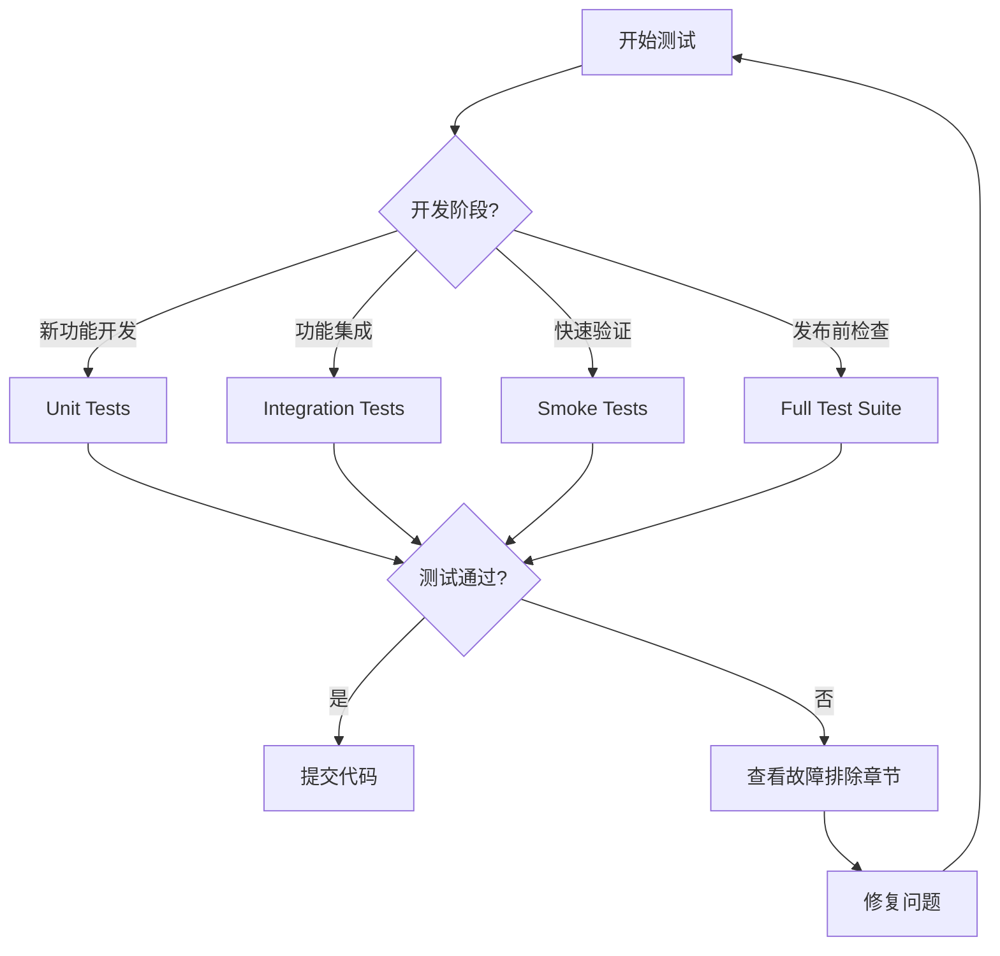

# 测试环境配置指南

📝 **文档说明**：
- **内容**：详细的测试环境配置、工具使用、故障排除指南
- **使用者**：开发人员、测试人员、AI助手
- **更新频率**：测试工具或环境配置变更时更新
- **关联文档**：[测试标准](../standards/testing-standards.md)、[工作流程](../standards/workflow.md)

## 🎯 测试类型选择决策流程

### 快速决策指南



### 测试类型选择标准

| 场景 | 推荐测试类型 | 执行命令 | 预期时间 | 覆盖范围 |
|------|------------|----------|----------|----------|
| **日常开发** | Unit Tests | `.\scripts\setup_test_env.ps1 -TestType unit` | 2-5分钟 | 单个模块 |
| **功能完成** | Integration Tests | `.\scripts\setup_test_env.ps1 -TestType integration` | 5-15分钟 | 模块间交互 |
| **快速验证** | Smoke Tests | `.\scripts\setup_test_env.ps1 -TestType smoke` | 30秒-2分钟 | 核心功能 |
| **提交前检查** | Full Suite | `.\scripts\setup_test_env.ps1 -TestType all` | 15-30分钟 | 所有功能 |
| **CI/CD管道** | All + Coverage | `.\scripts\setup_test_env.ps1 -TestType all -Coverage` | 20-40分钟 | 完整覆盖 |

### ⚡ 智能测试策略

**基于文件变更的测试选择**：
```powershell
# 仅修改模型文件 → 运行相关单元测试
# 修改API接口 → 运行集成测试
# 修改配置文件 → 运行完整测试套件
# 修改多个模块 → 运行全量测试
```

**基于开发阶段的测试频率**：
- 🔄 **开发中**: 每次保存后运行unit tests
- 📋 **功能完成**: 运行integration tests
- 🚀 **准备提交**: 运行full test suite
- 🎯 **发布准备**: 运行所有测试 + 性能测试

## 测试环境架构

> **测试架构和策略**: 详见 [测试标准文档](../standards/testing-standards.md)
> 
> 本文档专注于：环境配置、工具使用、故障排除

## 测试工具使用说明

> **工具概览**: 详见 [测试标准文档 - 测试工具](../standards/testing-standards.md#测试工具)

## 📋 标准测试执行流程模板

### 🚀 完整测试执行检查清单

**每次测试前必须执行的标准流程**：

```powershell
# ✅ 步骤1: 环境检查 (必须通过)
.\scripts\check_test_env.ps1

# ✅ 步骤2: 选择测试类型 (参考决策流程图)
# 根据开发阶段选择:
# - 日常开发: unit
# - 功能完成: integration  
# - 快速验证: smoke
# - 提交前: all

# ✅ 步骤3: 执行测试
.\scripts\setup_test_env.ps1 -TestType [选择的类型]

# ✅ 步骤4: 验证结果
# 检查测试通过率 > 95%
# 检查代码覆盖率 > 80% (集成测试)

# ✅ 步骤5: 问题处理 (如有失败)
# 参考故障排除章节
```

### 🎯 AI执行测试的标准程序

**AI助手执行测试时必须遵循的完整流程**：

```markdown
1. **环境预检** 
   - 执行: `.\scripts\check_test_env.ps1`
   - 确认: 所有检查项为 ✅ 状态
   - 失败处理: 参考本文档 [第7章 - 故障排除](#-故障排除)

2. **测试类型决策**
   - 分析: 当前开发阶段和文件变更
   - 决策: 使用《测试类型选择标准》表格
   - 确定: 具体的测试类型和预期时间

3. **测试执行**
   - 命令: `.\scripts\setup_test_env.ps1 -TestType [类型]`
   - 监控: 测试进度和输出信息
   - 记录: 测试结果和覆盖率数据

4. **结果验证**
   - 通过率: 检查是否 ≥ 95%
   - 覆盖率: 检查是否符合标准 (参考 [测试标准文档 - 测试层级](../standards/testing-standards.md#测试层级-70-2-20-6-2))
   - 性能: 检查执行时间是否在预期范围内

5. **失败处理** 
   - 分析: 失败测试的错误信息
   - 定位: 使用本文档 [第7.1节 - 常见问题解决方案](#常见问题解决方案)
   - 修复: 按照标准解决步骤执行
   - 重试: 确认修复后重新执行测试

6. **完成确认**
   - 验证: 所有测试通过
   - 记录: 测试执行摘要
   - 继续: 进入下一个开发环节
```

### ⚠️ 强制检查点

**测试执行过程中的强制验证点**：

| 检查点 | 验证内容 | 失败操作 |
|--------|----------|----------|
| **PRE-01** | 环境检查通过 | 停止测试，修复环境 |
| **PRE-02** | 测试类型选择合理 | 重新决策，参考标准表 |
| **EXE-01** | 测试启动成功 | 检查脚本参数和权限 |
| **EXE-02** | 进度正常 | 检查数据库连接和配置 |
| **POST-01** | 通过率 ≥ 95% | 分析失败用例，参考故障排除 |
| **POST-02** | 覆盖率达标 | 参考 [测试标准文档 - 单元测试覆盖率要求](../standards/testing-standards.md#单元测试-70) |

## 🛠️ 测试工具使用指南

### `check_test_env.ps1` - 环境检查工具

#### 使用示例
```powershell
# 基本使用
.\scripts\check_test_env.ps1

# 输出示例 (成功)
🔍 快速测试环境检查
========================================
✅ Python虚拟环境
✅ Python包: pytest
✅ Python包: sqlalchemy
✅ Python包: fastapi
✅ Python包: httpx
✅ 测试目录: tests
✅ 测试目录: tests/unit
✅ 测试目录: tests/integration
✅ 测试目录: tests/e2e
✅ pytest配置文件
✅ SQLite数据库
✅ Docker (集成测试可选)

🎉 所有检查通过！测试环境就绪。
您可以运行以下命令开始测试:
  pytest tests/unit/ -v           # 单元测试
  pytest tests/integration/ -v    # 集成测试
  pytest tests/ -v                # 全部测试
```

### 2. setup_test_env.ps1 - 标准测试流程

#### 功能说明
完整的测试环境设置、验证、执行、清理流程。

#### 参数详解
```powershell
-TestType <类型>    # unit|smoke|integration|all
-SetupOnly         # 仅设置环境，不运行测试
-SkipValidation    # 跳过环境验证 (不推荐)
```

#### 使用场景

**场景1：标准单元测试** 
```powershell
.\scripts\setup_test_env.ps1 -TestType unit

```bash
.\scripts\setup_test_env.ps1 -TestType unit           # 单元测试
.\scripts\setup_test_env.ps1 -TestType integration    # 集成测试  
.\scripts\setup_test_env.ps1 -TestType all            # 全部测试
.\scripts\setup_test_env.ps1 -SetupOnly               # 仅环境准备
```

### validate_test_config.py 诊断工具

> **基本用法**: 详见 [测试标准文档](../standards/testing-standards.md)

#### 详细验证内容
```powershell
.\scripts\setup_test_env.ps1 -TestType integration

# 执行流程：
# 1-5. 同上环境准备
# 6. 执行集成测试 (pytest tests/integration/ -v)
# 7. 清理Docker容器
# 8. 生成测试报告
```

**场景4：完整测试套件**
```powershell
.\scripts\setup_test_env.ps1 -TestType all

# 执行流程：
# 1. 准备所有测试环境
# 2. 依次执行：单元测试 → 集成测试 → E2E测试
# 3. 清理所有环境
# 4. 生成综合测试报告
```

### 3. validate_test_config.py - 深度配置验证

#### 功能说明
7步详细验证，深度诊断测试配置问题，用于故障排查。

#### 验证步骤
```python
1. Python环境验证       # Python版本、虚拟环境状态
2. 测试依赖包验证       # 所有必需包的安装状态
3. 应用模块导入验证     # 核心模块导入能力测试
4. 单元测试配置验证     # SQLite内存数据库功能测试
5. 烟雾测试配置验证     # SQLite文件数据库功能测试
6. 集成测试配置验证     # MySQL连接测试 (可选)
7. pytest配置验证      # pytest配置文件和目录结构
```

#### 使用示例
```powershell
python scripts/validate_test_config.py

# 输出示例 (部分)
🔍 测试环境配置验证开始
==================================================
=== Python环境验证 ===
✅ Python版本: 3.11.9
✅ 虚拟环境已激活: E:\ecommerce_platform\.venv
✅ 项目根目录: E:\ecommerce_platform

=== 测试依赖包验证 ===
✅ pytest - 已安装
✅ sqlalchemy - 已安装
✅ fastapi - 已安装

=== 单元测试配置验证 ===
✅ SQLite内存数据库连接成功
✅ 数据库会话创建成功

📊 验证结果: 7个通过, 0个失败
🎉 所有测试环境配置验证通过！可以开始运行测试。
```

## 🚨 故障排除指南

### 常见问题与解决方案

#### 问题1：虚拟环境未激活
```
❌ Python虚拟环境
   当前Python: C:\Python39\python.exe
```
**解决方案**：
```powershell
# 激活虚拟环境
.venv\Scripts\Activate.ps1

# 验证激活
python -c "import sys; print(sys.prefix)"
```

#### 问题2：依赖包缺失
```
❌ Python包: pytest - 未安装
```
**解决方案**：
```powershell
# 安装测试依赖
pip install pytest pytest-asyncio pytest-cov

# 或安装完整依赖
pip install -r requirements.txt
```

#### 问题3：测试目录结构问题
```
❌ 测试目录: tests/unit
```
**解决方案**：
```powershell
# 检查目录结构
ls tests/

# 创建缺失目录
mkdir tests/unit, tests/integration, tests/e2e
```

#### 问题4：Docker环境问题
```
⚠️ MySQL测试数据库不可用: Can't connect to MySQL
```
**解决方案**：
```powershell
# 检查Docker状态
docker --version

# 启动Docker Desktop
# 然后重新运行测试
.\scripts\setup_test_env.ps1 -TestType integration
```

#### 问题5：SQLAlchemy模型关系错误
```
❌ One or more mappers failed to initialize - can't proceed
```
**解决方案**：
```powershell
# 运行详细验证
python scripts/validate_test_config.py

# 检查模型导入
python -c "from app.modules.user_auth.models import User; print('OK')"

# 重新生成数据库
rm tests/smoke_test.db
.\scripts\setup_test_env.ps1 -TestType smoke
```

### 环境重置步骤

**完全重置测试环境**：
```powershell
# 第一步：清理测试数据库文件
Remove-Item tests/smoke_test.db -Force -ErrorAction SilentlyContinue

# 第二步：停止并清理Docker容器
docker stop mysql_test 2>$null
docker rm mysql_test 2>$null

# 第三步：重新验证环境
.\scripts\check_test_env.ps1

# 第四步：重新运行测试
.\scripts\setup_test_env.ps1 -TestType unit
```

## 📊 测试执行最佳实践

### 开发阶段测试策略
```powershell
# 开发过程中：频繁运行单元测试
.\scripts\setup_test_env.ps1 -TestType unit

# 功能完成后：运行集成测试
.\scripts\setup_test_env.ps1 -TestType integration

# 提交前：运行完整测试套件
.\scripts\setup_test_env.ps1 -TestType all
```

### 持续集成环境配置
```yaml
# CI/CD管道中的测试步骤
steps:
  - name: Setup Test Environment
    run: .\scripts\check_test_env.ps1
    
  - name: Run Unit Tests
    run: .\scripts\setup_test_env.ps1 -TestType unit
    
  - name: Run Integration Tests
    run: .\scripts\setup_test_env.ps1 -TestType integration
```

## 🧪 测试脚本编写强制标准

### 📋 测试脚本编写检查清单

**每个测试文件必须包含的强制元素**：

```python
# ✅ 强制检查清单 - 每个测试文件必须具备

# 1. 标准导入 (必须)
import pytest
from unittest.mock import Mock, patch
import sqlalchemy
from sqlalchemy.orm import Session

# 2. 工厂导入 (数据测试必须)
from tests.factories import UserFactory, ProductFactory

# 3. 配置导入 (必须)
from tests.conftest import test_db_session

# 4. 被测模块导入 (必须)
from app.modules.[模块名] import [被测类/函数]

# 5. 测试类结构 (推荐)
class Test[功能名]:
    """
    测试类必须包含：
    - 类文档字符串说明测试范围
    - 至少3个测试方法 (正常、异常、边界)
    - setup/teardown方法(如需要)
    """
    
    def setup_method(self):
        """每个测试方法执行前的准备工作"""
        pass
    
    def test_[功能]_success(self):
        """正常场景测试 - 必须有"""
        pass
    
    def test_[功能]_with_invalid_data(self):
        """异常场景测试 - 必须有"""
        pass
    
    def test_[功能]_edge_cases(self):
        """边界条件测试 - 必须有"""
        pass
```

### 🚨 强制执行标准

**测试脚本命名规范** (违反将导致CI失败):
```bash
# ✅ 正确命名
test_user_models.py          # 模型测试
test_user_services.py        # 服务层测试  
test_user_api.py            # API测试
test_user_integration.py     # 集成测试

# ❌ 错误命名 (CI会拒绝)
user_test.py                # 错误：应以test_开头
test_users.py              # 模糊：应具体到功能域
tests.py                   # 错误：过于宽泛
```

**测试函数命名标准** (强制检查):
```python
# ✅ 标准格式
def test_[功能]_[场景]_[预期结果]():
    pass

# ✅ 实际示例
def test_create_user_with_valid_data_returns_user_object():
    pass

def test_create_user_with_duplicate_email_raises_validation_error():
    pass

def test_authenticate_user_with_wrong_password_returns_false():
    pass

# ❌ 禁止的命名 (CI会警告)
def test_user():                    # 过于简单
def test_something():              # 不明确
def create_user_test():           # 格式错误
```

### 🔧 自动化验证机制

**代码质量强制检查**：

```python
# 1. 测试覆盖率检查 (自动)
# 每个模块必须 ≥ 80% 测试覆盖率
# 关键业务逻辑必须 ≥ 95% 覆盖率

# 2. Mock使用标准检查 (自动)
# ✅ 强制使用 pytest-mock
@pytest.fixture
def mock_user_service(mocker):
    return mocker.patch('app.services.UserService')

# ❌ 禁止使用 unittest.mock 直接导入
# from unittest.mock import Mock  # CI会报错

# 3. 数据工厂标准检查 (自动)  
# ✅ 必须使用统一的Factory模式
def test_create_user():
    user = UserFactory.create()  # 标准做法
    
# ❌ 禁止硬编码测试数据
# user = User(name="test", email="test@example.com")  # CI会警告
```

**测试结构验证脚本**：

创建 `scripts/validate_test_structure.py`:
```python
#!/usr/bin/env python3
"""
测试结构自动验证脚本
运行: python scripts/validate_test_structure.py
"""

import os
import ast
import sys
from pathlib import Path

class TestStructureValidator:
    def __init__(self):
        self.errors = []
        self.warnings = []
    
    def validate_file_naming(self, file_path):
        """验证文件命名规范"""
        filename = Path(file_path).name
        if not filename.startswith('test_'):
            self.errors.append(f"❌ {file_path}: 文件名必须以'test_'开头")
        
        if filename == 'test.py' or filename == 'tests.py':
            self.errors.append(f"❌ {file_path}: 文件名过于宽泛")
    
    def validate_test_functions(self, file_path):
        """验证测试函数命名和结构"""
        with open(file_path, 'r', encoding='utf-8') as f:
            try:
                tree = ast.parse(f.read())
            except SyntaxError as e:
                self.errors.append(f"❌ {file_path}: 语法错误 {e}")
                return
        
        for node in ast.walk(tree):
            if isinstance(node, ast.FunctionDef):
                if node.name.startswith('test_'):
                    self._validate_test_function_name(node.name, file_path)
    
    def _validate_test_function_name(self, func_name, file_path):
        """验证测试函数命名规范"""
        parts = func_name.split('_')
        if len(parts) < 3:  # test_功能_场景
            self.warnings.append(
                f"⚠️ {file_path}:{func_name} - 建议使用格式: test_功能_场景_预期结果"
            )
    
    def validate_required_imports(self, file_path):
        """验证必需的导入"""
        required_imports = ['pytest']
        
        with open(file_path, 'r', encoding='utf-8') as f:
            content = f.read()
            
        for required in required_imports:
            if f"import {required}" not in content and f"from {required}" not in content:
                self.errors.append(f"❌ {file_path}: 缺少必需导入 '{required}'")
    
    def run_validation(self, test_dir="tests/"):
        """运行完整验证"""
        print("🔍 开始验证测试结构...")
        
        for root, dirs, files in os.walk(test_dir):
            for file in files:
                if file.endswith('.py') and file.startswith('test_'):
                    file_path = os.path.join(root, file)
                    self.validate_file_naming(file_path)
                    self.validate_test_functions(file_path)
                    self.validate_required_imports(file_path)
        
        # 输出结果
        if self.errors:
            print(f"\n❌ 发现 {len(self.errors)} 个错误:")
            for error in self.errors:
                print(f"  {error}")
        
        if self.warnings:
            print(f"\n⚠️ 发现 {len(self.warnings)} 个警告:")
            for warning in self.warnings:
                print(f"  {warning}")
        
        if not self.errors and not self.warnings:
            print("✅ 所有测试文件结构验证通过!")
        
        return len(self.errors) == 0

if __name__ == "__main__":
    validator = TestStructureValidator()
    success = validator.run_validation()
    sys.exit(0 if success else 1)
```

### 🎯 测试脚本自动生成模板

**使用脚本自动生成标准测试文件**：

创建 `scripts/generate_test_template.py`:
```python
#!/usr/bin/env python3
"""
标准测试文件生成器
使用: python scripts/generate_test_template.py module_name function_name
示例: python scripts/generate_test_template.py user_auth authenticate_user
"""

import sys
import os
from pathlib import Path

def generate_test_template(module_name, function_name):
    """生成标准测试文件模板"""
    
    template = f'''import pytest
from unittest.mock import Mock
import sqlalchemy
from sqlalchemy.orm import Session

# 测试工厂导入
from tests.factories import UserFactory, ProductFactory

# 配置导入
from tests.conftest import test_db_session

# 被测模块导入
from app.modules.{module_name} import {function_name}


class Test{function_name.title().replace('_', '')}:
    """
    {function_name} 功能测试套件
    
    测试范围:
    - 正常场景验证
    - 异常情况处理  
    - 边界条件测试
    - 性能要求验证
    """
    
    def setup_method(self):
        """每个测试方法执行前的准备工作"""
        self.test_data = UserFactory.build()
    
    def test_{function_name}_with_valid_data_returns_expected_result(self):
        """
        测试正常场景: 使用有效数据调用{function_name}
        
        预期结果: 返回正确的结果对象
        """
        # Arrange (准备)
        expected_result = "expected_value"
        
        # Act (执行)
        result = {function_name}(self.test_data)
        
        # Assert (验证)
        assert result == expected_result
        assert result is not None
    
    def test_{function_name}_with_invalid_data_raises_validation_error(self):
        """
        测试异常场景: 使用无效数据调用{function_name}
        
        预期结果: 抛出ValidationError异常
        """
        # Arrange
        invalid_data = None
        
        # Act & Assert
        with pytest.raises(ValueError) as exc_info:
            {function_name}(invalid_data)
        
        assert "validation error" in str(exc_info.value).lower()
    
    def test_{function_name}_with_edge_cases_handles_correctly(self):
        """
        测试边界条件: 测试各种边界情况
        
        预期结果: 正确处理边界条件而不崩溃
        """
        # 测试空字符串
        result_empty = {function_name}("")
        assert result_empty is not None
        
        # 测试极大值
        result_large = {function_name}("x" * 1000)
        assert result_large is not None
    
    @pytest.mark.performance
    def test_{function_name}_performance_within_limits(self):
        """
        测试性能要求: 确保函数执行时间在可接受范围内
        
        预期结果: 执行时间 < 100ms
        """
        import time
        
        start_time = time.time()
        {function_name}(self.test_data)
        execution_time = time.time() - start_time
        
        assert execution_time < 0.1  # 100ms限制


@pytest.mark.integration
class Test{function_name.title().replace('_', '')}Integration:
    """
    {function_name} 集成测试套件
    
    测试与外部系统的集成:
    - 数据库交互
    - 外部API调用
    - 文件系统操作
    """
    
    def test_{function_name}_database_integration(self, test_db_session):
        """测试数据库集成"""
        # 使用真实数据库会话进行测试
        user = UserFactory.create()
        test_db_session.add(user)
        test_db_session.commit()
        
        result = {function_name}(user.id)
        assert result is not None
'''
    
    # 确定输出路径
    test_file_path = f"tests/test_{module_name}.py"
    
    # 检查文件是否已存在
    if os.path.exists(test_file_path):
        print(f"⚠️  文件 {test_file_path} 已存在")
        response = input("是否覆盖? (y/N): ")
        if response.lower() != 'y':
            print("❌ 操作已取消")
            return False
    
    # 创建目录(如果不存在)
    os.makedirs(os.path.dirname(test_file_path), exist_ok=True)
    
    # 写入文件
    with open(test_file_path, 'w', encoding='utf-8') as f:
        f.write(template)
    
    print(f"✅ 成功生成测试文件: {test_file_path}")
    print(f"📝 下一步: 根据实际需求修改测试用例")
    
    return True

if __name__ == "__main__":
    if len(sys.argv) != 3:
        print("使用方法: python scripts/generate_test_template.py <module_name> <function_name>")
        print("示例: python scripts/generate_test_template.py user_auth authenticate_user")
        sys.exit(1)
    
    module_name = sys.argv[1]
    function_name = sys.argv[2]
    
    generate_test_template(module_name, function_name)
```

### 💡 实施建议

**集成到开发流程**:

1. **IDE集成**: 在VS Code中配置快捷键生成测试模板
2. **Git钩子**: 提交前自动运行验证脚本
3. **CI/CD集成**: 构建管道中强制执行测试标准检查
4. **代码审查**: 将测试标准作为PR检查项

**使用工作流**:
```powershell
# 1. 生成标准测试文件
python scripts/generate_test_template.py user_service authenticate

# 2. 编写具体测试逻辑
# (编辑生成的测试文件)

# 3. 验证测试结构
python scripts/validate_test_structure.py

# 4. 运行测试验证
.\scripts\setup_test_env.ps1 -TestType unit
```

## 相关文档

- **主文档**: [测试标准文档](../standards/testing-standards.md) - 测试规范和标准流程
- [工作流程文档](../standards/workflow.md) - 开发流程中的测试环节
- [MASTER文档](../../MASTER.md) - 强制检查点