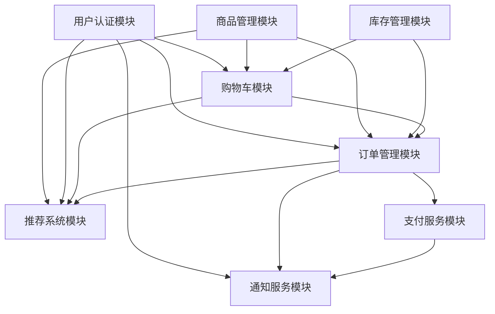

# 模块总览 (Modules Overview)

本文档提供了电商平台所有核心模块的索引和概览。每个模块都有详细的设计文档，包括技术架构、API接口、数据库设计和部署配置。

## 📋 模块索引

### 核心业务模块

| 模块 | 状态 | 文档链接 | 主要功能 |
|------|------|----------|----------|
| 用户认证模块 | ✅ 已完成 | [user-auth/overview.md](./user-auth/overview.md) | 用户注册登录、权限管理、会话控制、多因素认证 |
| 购物车模块 | ✅ 已完成 | [shopping-cart/overview.md](./shopping-cart/overview.md) | 购物车管理、价格计算、库存检查、多设备同步 |
| 订单管理模块 | ✅ 已完成 | [order-management/overview.md](./order-management/overview.md) | 订单创建、状态流转、支付集成、履约跟踪 |
| 商品管理模块 | ✅ 已完成 | [product-catalog/overview.md](./product-catalog/overview.md) | 商品信息管理、分类体系、价格管理、搜索发现 |
| 库存管理模块 | ✅ 已完成 | [inventory-management/overview.md](./inventory-management/overview.md) | 库存跟踪、预占机制、补货管理、多仓库支持 |
| 支付服务模块 | ✅ 已完成 | [payment-service/overview.md](./payment-service/overview.md) | 多支付渠道、支付流程、风控安全、财务管理 |
| 通知服务模块 | ✅ 已完成 | [notification-service/overview.md](./notification-service/overview.md) | 多渠道通知、模板管理、智能发送、效果跟踪 |
| 推荐系统模块 | ✅ 已完成 | [recommendation-system/overview.md](./recommendation-system/overview.md) | 个性化推荐、实时推荐、智能搜索、推荐优化 |
| 批次溯源模块 | 📝 新增 | [batch-traceability/overview.md](./batch-traceability/overview.md) | 农产品溯源、批次管理、质量追溯、区块链存证 |
| 分销商管理模块 | 📝 新增 | [distributor-management/overview.md](./distributor-management/overview.md) | 多级分销、佣金管理、推广工具、团队管理 |

### 核心技术模块 (P0优先级 - ✅ 已完成)

| 模块 | 状态 | 文档链接 | 主要功能 |
|------|------|----------|----------|
| 应用入口模块 | ✅ 已完成 | [application-core/overview.md](./application-core/overview.md) | FastAPI应用入口、路由注册、生命周期管理 |
| 数据库连接模块 | ✅ 已完成 | [database-core/overview.md](./database-core/overview.md) | SQLAlchemy引擎、连接池、会话管理 |
| 数据模型模块 | ✅ 已完成 | [data-models/overview.md](./data-models/overview.md) | ORM模型定义、关系映射、索引优化 |
| Redis客户端模块 | ✅ 已完成 | [redis-cache/overview.md](./redis-cache/overview.md) | Redis连接、购物车存储、缓存管理 |
| 数据库工具模块 | ✅ 已完成 | [database-utils/overview.md](./database-utils/overview.md) | 数据库工具函数、脚本支持、测试辅助 |

### 支撑服务模块

| 模块 | 状态 | 描述 |
|------|------|------|
| 文件存储服务 | 📝 规划中 | 图片、视频等静态文件存储管理 |
| 搜索服务 | 📝 规划中 | Elasticsearch全文搜索引擎 |
| 数据分析服务 | 📝 规划中 | 用户行为分析、业务数据统计 |
| 风控服务 | 📝 规划中 | 反欺诈、风险评估、安全防护 |
| 营销服务 | 📝 规划中 | 优惠券、促销活动、会员营销 |

## 🏗️ 架构设计

### 模块间依赖关系



### 技术栈分布

| 技术组件 | 使用模块 | 说明 |
|----------|----------|------|
| **PostgreSQL** | 用户认证、订单管理、商品管理、库存管理、支付服务 | 主要事务性数据存储 |
| **Redis** | 购物车、库存管理、通知服务、推荐系统 | 缓存和会话存储 |
| **Elasticsearch** | 商品管理、推荐系统 | 全文搜索和商品发现 |
| **Message Queue** | 所有模块 | 事件驱动架构支撑 |
| **FastAPI** | 所有模块 | 统一API框架 |

## 📊 模块成熟度

### 开发状态

- ✅ **已完成** (8个模块): 核心业务功能完整，包含详细设计文档
- 📝 **规划中** (5个模块): 已规划功能范围，待详细设计
- 🚧 **开发中** (0个模块): 正在开发实现中
- ⚠️ **需优化** (0个模块): 需要重构或性能优化

### 文档完整度

| 文档类型 | 完成度 | 说明 |
|----------|--------|------|
| **技术架构** | 100% | 所有已完成模块包含完整架构设计 |
| **API接口** | 100% | 详细的OpenAPI规范和示例 |
| **数据库设计** | 100% | 完整的表结构和索引设计 |
| **业务逻辑** | 100% | 核心业务流程和算法实现 |
| **部署配置** | 100% | 环境变量和依赖服务配置 |
| **监控指标** | 100% | 业务和技术监控指标定义 |

## 🔄 模块集成

### 事件驱动架构

所有模块通过统一的事件总线进行解耦通信：

```python
# 事件发布示例
await event_publisher.publish('order.created', {
    'order_id': order.id,
    'user_id': order.user_id,
    'total_amount': order.total_amount
})

# 事件订阅示例
@event_handler('order.created')
async def handle_order_created(event_data):
    # 库存扣减
    await inventory_service.reduce_inventory(event_data)
    # 发送通知
    await notification_service.send_order_confirmation(event_data)
    # 更新推荐
    await recommendation_service.update_user_behavior(event_data)
```

### API网关集成

```yaml
# API路由配置
/api/v1/auth/*     -> 用户认证模块
/api/v1/products/* -> 商品管理模块
/api/v1/cart/*     -> 购物车模块
/api/v1/orders/*   -> 订单管理模块
/api/v1/payments/* -> 支付服务模块
/api/v1/notifications/* -> 通知服务模块
/api/v1/recommendations/* -> 推荐系统模块
```

## 📈 性能指标

### 核心性能要求

| 模块 | 响应时间要求 | 并发要求 | 可用性要求 |
|------|-------------|----------|------------|
| 用户认证 | < 200ms | 1000 QPS | 99.9% |
| 购物车 | < 100ms | 2000 QPS | 99.9% |
| 商品搜索 | < 300ms | 1500 QPS | 99.5% |
| 订单处理 | < 500ms | 500 QPS | 99.99% |
| 支付处理 | < 1000ms | 200 QPS | 99.99% |
| 推荐系统 | < 200ms | 1000 QPS | 99.0% |

### 扩展性设计

- **水平扩展**: 所有模块支持多实例部署
- **数据分片**: 大数据量表支持分库分表
- **缓存策略**: 多级缓存提升性能
- **异步处理**: 耗时操作异步化

## 🛠️ 开发指南

### 新增模块

1. **创建模块目录**: `docs/modules/{module-name}/`
2. **编写概览文档**: 参考现有模块的 `overview.md` 结构
3. **定义API接口**: 使用OpenAPI规范
4. **设计数据模型**: 包含完整的SQL DDL
5. **实现业务逻辑**: 核心服务类和算法
6. **配置监控**: 定义关键指标
7. **更新本文档**: 添加到模块索引

### 文档规范

- **统一结构**: 遵循现有模块的文档结构
- **代码示例**: 提供完整可运行的代码示例
- **架构图**: 使用Mermaid绘制架构图
- **API文档**: 使用OpenAPI YAML格式
- **中英文**: 重要概念提供中英文对照

### 版本管理

- **向后兼容**: API变更保持向后兼容
- **版本标记**: 使用语义化版本号
- **变更记录**: 维护详细的变更日志
- **迁移指南**: 提供升级迁移文档

## 📚 相关文档

- [架构设计总览](../architecture/overview.md)
- [事件驱动架构](../architecture/event-driven.md)
- [API设计规范](../architecture/api-standards.md)
- [数据库设计规范](../architecture/data-models.md)
- [部署运维指南](../operations/deployment.md)
