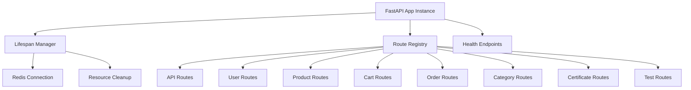
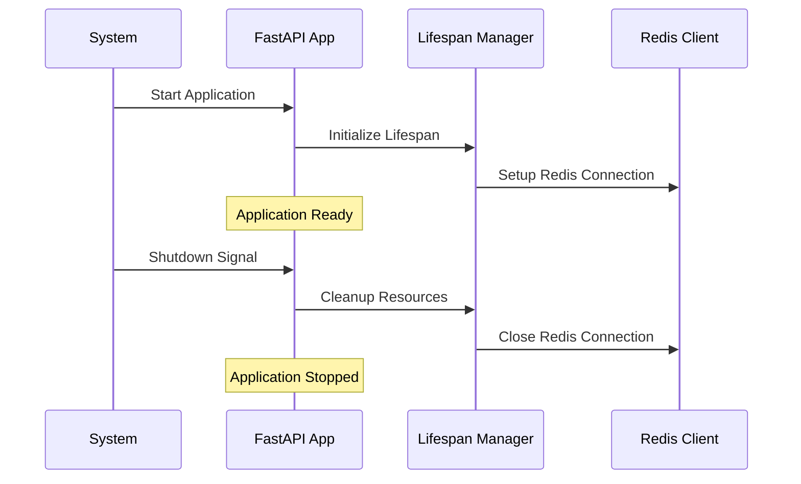
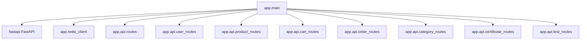

# 应用入口模块 (Application Entry Module)

## 模块概述

应用入口模块 (`app/main.py`) 是整个电商平台的FastAPI应用程序入口点，负责应用初始化、生命周期管理、路由注册和全局配置。

### 主要功能

1. **应用初始化**
   - FastAPI应用实例创建
   - 应用元数据配置 (title, version)
   - 生命周期管理器设置

2. **路由管理**
   - 所有API路由模块的注册
   - 路由前缀和标签配置
   - 容错路由加载机制

3. **资源管理**
   - Redis连接的生命周期管理
   - 数据库表自动创建(开发环境)
   - 应用关闭时的资源清理

4. **环境配置**
   - 开发/生产环境检测
   - CI环境自动识别
   - 环境变量驱动的功能开关

## 技术架构

### 核心组件



### 应用生命周期



## 代码结构

### 文件组织

```
app/main.py
├── 导入依赖
├── 生命周期管理器
├── 环境配置检测
├── FastAPI应用创建
├── 基础端点定义
└── 路由模块注册
```

### 关键组件说明

#### 1. 生命周期管理器 (Lifespan Manager)

```python
@asynccontextmanager
async def lifespan(app: FastAPI):
    """应用生命周期管理
    
    负责应用启动时的初始化和关闭时的清理工作
    - 启动时：可进行数据库连接、缓存初始化等
    - 关闭时：清理Redis连接等资源
    """
```

**功能特性:**
- 异步上下文管理
- 资源自动清理
- 优雅关闭支持

#### 2. 环境配置检测

```python
_auto_create_flag = os.environ.get("AUTO_CREATE_TABLES", "0") == "1"
_is_ci = os.environ.get("CI", "").lower() in ("1", "true", "yes") or \
         os.environ.get("GITHUB_ACTIONS", "").lower() == "true"
AUTO_CREATE = _auto_create_flag and not _is_ci
```

**功能特性:**
- 开发环境表自动创建
- CI环境自动检测
- 生产环境保护机制

#### 3. 容错路由注册

```python
try:
    from app.api import user_routes
    app.include_router(user_routes.router, prefix="/api", tags=["users"])
except Exception:
    # 路由模块缺失时不影响应用启动
    pass
```

**功能特性:**
- 模块缺失容错
- 渐进式功能部署
- 开发阶段灵活性

## API端点

### 基础端点

| 端点 | 方法 | 描述 | 响应格式 |
|------|------|------|----------|
| `/` | GET | 应用根端点 | `{"message": "定制化电商平台 Sprint0 - FastAPI"}` |
| `/api/health` | GET | 健康检查端点 | `{"status": "ok", "message": "服务运行正常"}` |

### 注册的路由模块

| 路由前缀 | 模块 | 标签 | 功能描述 |
|----------|------|------|----------|
| `/api` | `api_routes` | api | 通用API路由 |
| `/api` | `product_routes` | products | 商品管理 |
| `/api` | `category_routes` | categories | 分类管理 |
| `/api` | `certificate_routes` | certificates | 证书管理 |
| `/api` | `user_routes` | users | 用户认证 |
| `/api/orders` | `order_routes` | orders | 订单管理 |
| `/api` | `cart_routes` | shopping-cart | 购物车 |
| `/api/test` | `test_routes` | test | 测试接口 |

## 配置说明

### 环境变量

| 变量名 | 默认值 | 描述 | 示例 |
|--------|--------|------|------|
| `AUTO_CREATE_TABLES` | `"0"` | 是否自动创建数据库表 | `"1"` (开启) |
| `CI` | - | CI环境标识 | `"true"`, `"1"`, `"yes"` |
| `GITHUB_ACTIONS` | - | GitHub Actions环境标识 | `"true"` |

### 应用配置

| 配置项 | 值 | 描述 |
|--------|----|----- |
| `title` | "定制化电商平台 - Sprint0" | 应用标题 |
| `version` | "0.1.0" | 应用版本 |
| `lifespan` | `lifespan` | 生命周期管理器 |

## 依赖关系

### 直接依赖

- `fastapi`: Web框架核心
- `contextlib.asynccontextmanager`: 异步上下文管理
- `os`: 环境变量访问

### 内部依赖

- `app.redis_client`: Redis连接管理
- `app.api.*`: 各功能模块路由

### 依赖图



## 部署考虑

### 开发环境

1. **数据库表自动创建**
   ```bash
   export AUTO_CREATE_TABLES=1
   uvicorn app.main:app --reload
   ```

2. **调试模式启动**
   ```bash
   uvicorn app.main:app --reload --log-level debug
   ```

### 生产环境

1. **标准部署**
   ```bash
   # 确保 AUTO_CREATE_TABLES 未设置或为 0
   uvicorn app.main:app --host 0.0.0.0 --port 8000
   ```

2. **容器部署**
   ```dockerfile
   CMD ["uvicorn", "app.main:app", "--host", "0.0.0.0", "--port", "8000"]
   ```

### CI/CD环境

- 自动检测CI环境变量
- 禁用表自动创建功能
- 支持GitHub Actions等CI平台

## 监控和日志

### 健康检查

应用提供标准健康检查端点：
```
GET /api/health
```

可用于：
- 容器健康检查
- 负载均衡器健康探测
- 监控系统状态检查

### 应用指标

推荐监控指标：
- 应用启动时间
- 活跃连接数
- 请求响应时间
- 错误率统计

## 扩展指南

### 添加新路由模块

1. **创建路由模块**
   ```python
   # app/api/new_routes.py
   from fastapi import APIRouter
   router = APIRouter()
   ```

2. **在main.py中注册**
   ```python
   try:
       from app.api import new_routes
       app.include_router(new_routes.router, prefix="/api", tags=["new"])
   except Exception:
       pass
   ```

### 自定义中间件

1. **添加中间件**
   ```python
   from fastapi.middleware.cors import CORSMiddleware
   
   app.add_middleware(
       CORSMiddleware,
       allow_origins=["*"],
       allow_methods=["*"],
       allow_headers=["*"],
   )
   ```

2. **放置位置**
   - 在路由注册之前
   - 在应用创建之后

## 故障排除

### 常见问题

1. **路由模块导入失败**
   - 检查模块路径是否正确
   - 确认模块文件存在
   - 查看容错机制是否生效

2. **Redis连接失败**
   - 检查Redis服务状态
   - 验证连接配置
   - 查看网络连通性

3. **环境变量未生效**
   - 确认变量名拼写正确
   - 检查变量值格式
   - 验证环境变量加载时机

### 调试方法

1. **启用详细日志**
   ```bash
   uvicorn app.main:app --log-level debug
   ```

2. **检查应用状态**
   ```bash
   curl http://localhost:8000/api/health
   ```

3. **查看路由列表**
   ```bash
   curl http://localhost:8000/openapi.json
   ```

## 版本历史

| 版本 | 日期 | 变更说明 |
|------|------|----------|
| 0.1.0 | 2025-09-11 | 初始版本，基础应用入口实现 |

## 相关文档

- [数据库连接模块文档](../database/overview.md)
- [Redis客户端模块文档](../redis/overview.md)
- [API路由规范](../../api/api-design-standards.md)
- [部署运维指南](../../operations/deployment.md)
