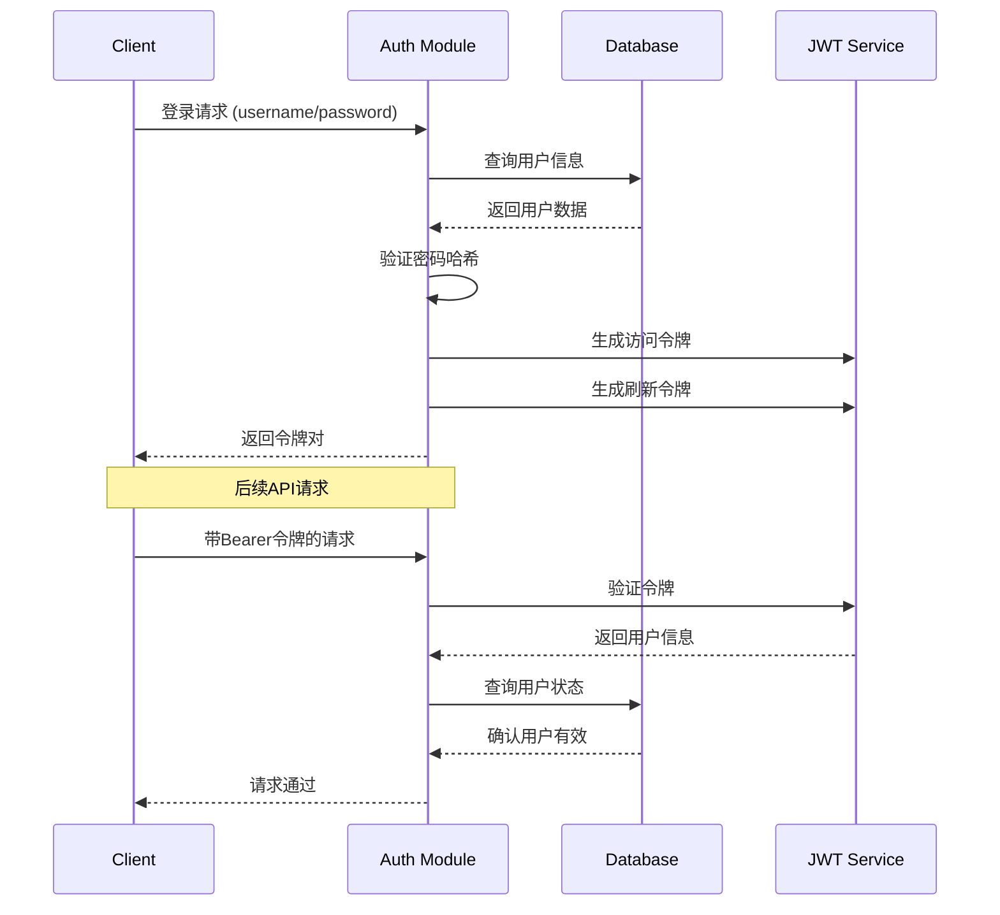
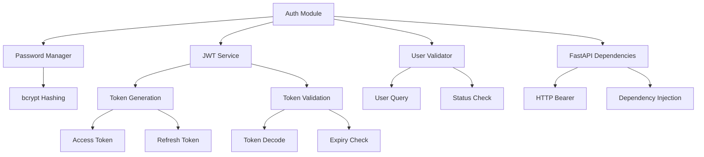

# 用户认证模块 (User Authentication Module)

## 模块概述

用户认证模块 (`app/auth.py`) 是电商平台的安全核心组件，负责用户身份验证、JWT令牌管理、密码加密存储和API访问控制，确保系统安全性和用户数据保护。

### 主要功能

1. **密码管理**
   - 密码哈希加密存储
   - 密码验证和比较
   - 安全加密算法支持
   - 密码强度保障

2. **JWT令牌系统**
   - 访问令牌生成和验证
   - 刷新令牌机制
   - 令牌过期控制
   - 安全载荷管理

3. **用户认证**
   - 用户凭据验证
   - 多种登录方式支持
   - 用户状态检查
   - 会话管理

4. **API保护**
   - FastAPI依赖注入集成
   - HTTP Bearer认证
   - 可选认证支持
   - 权限控制基础

## 技术架构

### 认证流程图



### 组件架构



## 代码结构

### 文件组织

```
app/auth.py
├── 配置常量
├── 密码管理函数
├── JWT令牌函数
├── 用户认证函数
├── FastAPI依赖函数
└── 异常处理类
```

### 关键组件说明

#### 1. 配置管理

```python
# JWT配置
SECRET_KEY = os.getenv("JWT_SECRET_KEY", "your-secret-key-here-change-in-production")
ALGORITHM = "HS256"
ACCESS_TOKEN_EXPIRE_MINUTES = 30
REFRESH_TOKEN_EXPIRE_DAYS = 30

# 密码加密
pwd_context = CryptContext(schemes=["bcrypt"], deprecated="auto")
```

**配置特点:**
- 环境变量驱动，支持不同环境配置
- 使用HS256算法，平衡安全性和性能
- 合理的令牌过期时间设置
- bcrypt算法确保密码安全

#### 2. 密码管理

```python
def verify_password(plain_password: str, hashed_password: str) -> bool:
    """验证密码"""
    return pwd_context.verify(plain_password, hashed_password)

def get_password_hash(password: str) -> str:
    """生成密码哈希"""
    return pwd_context.hash(password)
```

**安全特性:**
- bcrypt算法，具有自适应性
- 自动盐值生成，防止彩虹表攻击
- 慢哈希算法，抵御暴力破解
- 向后兼容性支持

#### 3. JWT令牌管理

```python
def create_access_token(data: dict, expires_delta: Optional[timedelta] = None) -> str:
    """创建访问令牌 - 短期有效，用于API访问"""

def create_refresh_token(data: dict) -> str:
    """创建刷新令牌 - 长期有效，用于获取新的访问令牌"""

def decode_token(token: str) -> dict:
    """解码令牌 - 验证签名和有效期"""
```

**令牌特性:**
- 双令牌机制，增强安全性
- 自定义过期时间支持
- 令牌类型标识，防止混用
- 完整的异常处理

## API接口

### 核心函数

#### 密码函数

| 函数名 | 参数 | 返回值 | 描述 |
|--------|------|--------|------|
| `verify_password` | `plain_password: str`<br>`hashed_password: str` | `bool` | 验证明文密码与哈希值是否匹配 |
| `get_password_hash` | `password: str` | `str` | 生成密码的bcrypt哈希值 |

#### 令牌函数

| 函数名 | 参数 | 返回值 | 描述 |
|--------|------|--------|------|
| `create_access_token` | `data: dict`<br>`expires_delta: Optional[timedelta]` | `str` | 创建JWT访问令牌 |
| `create_refresh_token` | `data: dict` | `str` | 创建JWT刷新令牌 |
| `decode_token` | `token: str` | `dict` | 解码并验证JWT令牌 |

#### 认证函数

| 函数名 | 参数 | 返回值 | 描述 |
|--------|------|--------|------|
| `authenticate_user` | `db: Session`<br>`username: str`<br>`password: str` | `Optional[User]` | 验证用户凭据 |

#### FastAPI依赖

| 函数名 | 依赖 | 返回值 | 描述 |
|--------|------|--------|------|
| `get_current_user` | `HTTPAuthorizationCredentials`<br>`Session` | `User` | 获取当前认证用户 |
| `get_current_active_user` | `User` | `User` | 获取当前活跃用户 |
| `get_optional_current_user` | `Optional[HTTPAuthorizationCredentials]`<br>`Session` | `Optional[User]` | 获取可选当前用户 |

## 使用示例

### 1. 用户注册

```python
from app.auth import get_password_hash
from app.models import User
from app.database import SessionLocal

def register_user(username: str, email: str, password: str) -> User:
    """用户注册"""
    session = SessionLocal()
    
    # 检查用户名和邮箱是否已存在
    existing_user = session.query(User).filter(
        (User.username == username) | (User.email == email)
    ).first()
    
    if existing_user:
        raise HTTPException(
            status_code=400,
            detail="用户名或邮箱已存在"
        )
    
    # 创建新用户
    hashed_password = get_password_hash(password)
    new_user = User(
        username=username,
        email=email,
        password_hash=hashed_password
    )
    
    session.add(new_user)
    session.commit()
    session.refresh(new_user)
    
    return new_user
```

### 2. 用户登录

```python
from app.auth import authenticate_user, create_access_token, create_refresh_token

@app.post("/auth/login")
async def login(login_data: UserLogin, db: Session = Depends(get_db)):
    """用户登录"""
    # 验证用户凭据
    user = authenticate_user(db, login_data.username, login_data.password)
    if not user:
        raise HTTPException(
            status_code=400,
            detail="用户名或密码错误"
        )
    
    # 生成令牌
    access_token = create_access_token(data={"sub": str(user.id)})
    refresh_token = create_refresh_token(data={"sub": str(user.id)})
    
    return {
        "access_token": access_token,
        "refresh_token": refresh_token,
        "token_type": "bearer",
        "expires_in": ACCESS_TOKEN_EXPIRE_MINUTES * 60
    }
```

### 3. 保护API端点

```python
from app.auth import get_current_user

@app.get("/users/profile")
async def get_user_profile(current_user: User = Depends(get_current_user)):
    """获取用户资料 - 需要认证"""
    return {
        "id": current_user.id,
        "username": current_user.username,
        "email": current_user.email,
        "is_active": current_user.is_active
    }

@app.get("/products")
async def list_products(
    current_user: Optional[User] = Depends(get_optional_current_user),
    db: Session = Depends(get_db)
):
    """商品列表 - 可选认证"""
    products = db.query(Product).filter(Product.status == 'active').all()
    
    # 根据认证状态返回不同信息
    if current_user:
        # 已认证用户可以看到更多信息
        return [
            {
                "id": p.id,
                "name": p.name,
                "price": p.price,
                "stock_quantity": p.stock_quantity,  # 显示库存
            }
            for p in products
        ]
    else:
        # 未认证用户只能看到基本信息
        return [
            {
                "id": p.id,
                "name": p.name,
                "price": p.price,
            }
            for p in products
        ]
```

### 4. 刷新令牌

```python
@app.post("/auth/refresh")
async def refresh_token(refresh_data: RefreshToken, db: Session = Depends(get_db)):
    """刷新访问令牌"""
    try:
        # 解码刷新令牌
        payload = decode_token(refresh_data.refresh_token)
        
        # 检查令牌类型
        if payload.get("type") != "refresh":
            raise HTTPException(status_code=400, detail="无效的令牌类型")
        
        # 获取用户ID
        user_id = int(payload.get("sub"))
        user = db.query(User).filter(User.id == user_id).first()
        
        if not user or not user.is_active:
            raise HTTPException(status_code=400, detail="用户不存在或已禁用")
        
        # 生成新的访问令牌
        new_access_token = create_access_token(data={"sub": str(user.id)})
        
        return {
            "access_token": new_access_token,
            "token_type": "bearer",
            "expires_in": ACCESS_TOKEN_EXPIRE_MINUTES * 60
        }
        
    except Exception as e:
        raise HTTPException(status_code=400, detail="刷新令牌无效")
```

### 5. 修改密码

```python
from app.auth import verify_password, get_password_hash

@app.post("/auth/change-password")
async def change_password(
    password_data: ChangePassword,
    current_user: User = Depends(get_current_user),
    db: Session = Depends(get_db)
):
    """修改密码"""
    # 验证旧密码
    if not verify_password(password_data.old_password, current_user.password_hash):
        raise HTTPException(status_code=400, detail="旧密码错误")
    
    # 更新密码
    new_password_hash = get_password_hash(password_data.new_password)
    current_user.password_hash = new_password_hash
    
    db.commit()
    
    return {"message": "密码修改成功"}
```

## 配置说明

### 环境变量

| 变量名 | 默认值 | 描述 | 示例 |
|--------|--------|------|------|
| `JWT_SECRET_KEY` | `"your-secret-key-here-change-in-production"` | JWT签名密钥 | `"your-super-secret-key-here"` |

### 令牌配置

| 配置项 | 默认值 | 描述 | 推荐值 |
|--------|--------|------|-------|
| `ACCESS_TOKEN_EXPIRE_MINUTES` | `30` | 访问令牌过期时间(分钟) | `15-60` |
| `REFRESH_TOKEN_EXPIRE_DAYS` | `30` | 刷新令牌过期时间(天) | `7-30` |
| `ALGORITHM` | `"HS256"` | JWT签名算法 | `"HS256"` |

### 环境配置示例

#### 开发环境
```bash
export JWT_SECRET_KEY="dev-secret-key-not-for-production"
```

#### 生产环境
```bash
export JWT_SECRET_KEY="$(openssl rand -hex 32)"
```

## 安全考虑

### 1. 密钥管理

```bash
# 生成安全的密钥
openssl rand -hex 32

# 使用环境变量
export JWT_SECRET_KEY="your-generated-secure-key"
```

**最佳实践:**
- 使用至少32字节的随机密钥
- 定期轮换密钥
- 不要在代码中硬编码密钥
- 使用密钥管理服务

### 2. 令牌安全

```python
# 令牌载荷设计
{
    "sub": "1001",           # 用户ID
    "exp": 1693834800,       # 过期时间
    "type": "access",        # 令牌类型
    "iat": 1693831200        # 签发时间
}
```

**安全特性:**
- 不在令牌中存储敏感信息
- 设置合理的过期时间
- 区分令牌类型防止混用
- 包含必要的标准声明

### 3. 密码安全

```python
# bcrypt配置优化
pwd_context = CryptContext(
    schemes=["bcrypt"],
    deprecated="auto",
    bcrypt__rounds=12  # 可调整工作因子
)
```

**安全特性:**
- 自适应哈希算法
- 自动盐值生成
- 可配置工作因子
- 抵御时序攻击

### 4. 认证安全

```python
def rate_limit_login_attempts(username: str) -> bool:
    """登录频率限制"""
    # 实现登录尝试限制逻辑
    pass

def log_authentication_event(user: User, success: bool, ip: str):
    """记录认证事件"""
    # 实现安全审计日志
    pass
```

**推荐实践:**
- 实现登录频率限制
- 记录认证事件日志
- 检测异常登录行为
- 实现账户锁定机制

## 性能优化

### 1. 令牌缓存

```python
import redis
from functools import lru_cache

# Redis缓存用户信息
async def get_user_from_cache(user_id: int) -> Optional[User]:
    redis_client = await get_redis_connection()
    cached_user = await redis_client.get(f"user:{user_id}")
    
    if cached_user:
        return User(**json.loads(cached_user))
    
    return None

async def cache_user(user: User):
    redis_client = await get_redis_connection()
    user_data = {
        "id": user.id,
        "username": user.username,
        "email": user.email,
        "is_active": user.is_active
    }
    await redis_client.setex(f"user:{user.id}", 300, json.dumps(user_data))
```

### 2. 数据库查询优化

```python
def authenticate_user_optimized(db: Session, username: str, password: str) -> Optional[User]:
    """优化的用户认证"""
    # 使用索引字段查询
    user = db.query(User).filter(
        (User.username == username) | (User.email == username)
    ).first()
    
    if not user:
        # 执行假密码验证，防止时序攻击
        pwd_context.verify("dummy", "$2b$12$dummy_hash")
        return None
    
    if not verify_password(password, user.password_hash):
        return None
    
    return user if user.is_active else None
```

### 3. 内存缓存

```python
from functools import lru_cache

@lru_cache(maxsize=1000)
def get_cached_user_by_id(user_id: int, cache_key: str) -> Optional[dict]:
    """LRU缓存用户信息"""
    # cache_key用于缓存失效
    session = SessionLocal()
    user = session.query(User).filter(User.id == user_id).first()
    return user.dict() if user else None
```

## 监控和日志

### 1. 认证事件日志

```python
import logging

auth_logger = logging.getLogger("auth")

def log_authentication_attempt(username: str, success: bool, ip: str = None):
    """记录认证尝试"""
    if success:
        auth_logger.info(f"认证成功: {username} from {ip}")
    else:
        auth_logger.warning(f"认证失败: {username} from {ip}")

def log_token_usage(user_id: int, action: str, token_type: str):
    """记录令牌使用"""
    auth_logger.info(f"令牌操作: user={user_id}, action={action}, type={token_type}")
```

### 2. 性能监控

```python
import time
from functools import wraps

def monitor_auth_performance(func):
    """认证性能监控装饰器"""
    @wraps(func)
    async def wrapper(*args, **kwargs):
        start_time = time.time()
        try:
            result = await func(*args, **kwargs)
            duration = time.time() - start_time
            
            if duration > 0.1:  # 慢认证警告
                auth_logger.warning(f"慢认证操作: {func.__name__} 耗时 {duration:.2f}s")
            
            return result
        except Exception as e:
            duration = time.time() - start_time
            auth_logger.error(f"认证错误: {func.__name__} 耗时 {duration:.2f}s, 错误: {e}")
            raise
    
    return wrapper
```

### 3. 安全指标

推荐监控指标:
- 认证成功/失败率
- 令牌生成/验证频率
- 密码修改频率
- 异常登录检测
- 令牌过期统计

## 故障排除

### 常见问题

1. **令牌无效错误**
   ```
   AuthenticationError: Invalid token
   ```
   **排查步骤:**
   - 检查JWT_SECRET_KEY是否正确
   - 验证令牌格式是否正确
   - 确认令牌未过期
   - 检查算法是否匹配

2. **密码验证失败**
   ```
   验证失败: 密码错误
   ```
   **排查步骤:**
   - 确认密码哈希算法一致
   - 检查密码是否正确输入
   - 验证数据库中的哈希值
   - 确认bcrypt版本兼容性

3. **用户认证失败**
   ```
   AuthenticationError: User not found
   ```
   **排查步骤:**
   - 检查用户是否存在
   - 确认用户状态为活跃
   - 验证数据库连接
   - 检查查询条件

### 调试方法

1. **启用认证日志**
   ```python
   import logging
   logging.getLogger("app.auth").setLevel(logging.DEBUG)
   ```

2. **令牌调试**
   ```python
   def debug_token(token: str):
       """调试JWT令牌"""
       try:
           # 不验证签名的解码（仅用于调试）
           payload = jwt.decode(token, options={"verify_signature": False})
           print(f"令牌载荷: {payload}")
       except Exception as e:
           print(f"令牌解码失败: {e}")
   ```

3. **认证流程测试**
   ```python
   def test_authentication_flow():
       """测试完整认证流程"""
       session = SessionLocal()
       
       # 1. 创建测试用户
       test_user = User(
           username="testuser",
           email="test@example.com",
           password_hash=get_password_hash("testpass123")
       )
       session.add(test_user)
       session.commit()
       
       # 2. 测试认证
       authenticated_user = authenticate_user(session, "testuser", "testpass123")
       assert authenticated_user is not None
       
       # 3. 测试令牌生成
       access_token = create_access_token(data={"sub": str(authenticated_user.id)})
       assert access_token is not None
       
       # 4. 测试令牌验证
       payload = decode_token(access_token)
       assert payload.get("sub") == str(authenticated_user.id)
       
       print("认证流程测试通过")
   ```

## 版本历史

| 版本 | 日期 | 变更说明 |
|------|------|----------|
| 0.1.0 | 2025-09-11 | 初始版本，实现基础JWT认证系统 |

## 相关文档

- [用户管理模块](../user-auth/overview.md)
- [API安全规范](../../api/standards.md#安全认证)
- [FastAPI认证文档](https://fastapi.tiangolo.com/tutorial/security/)
- [JWT标准规范](https://tools.ietf.org/html/rfc7519)
