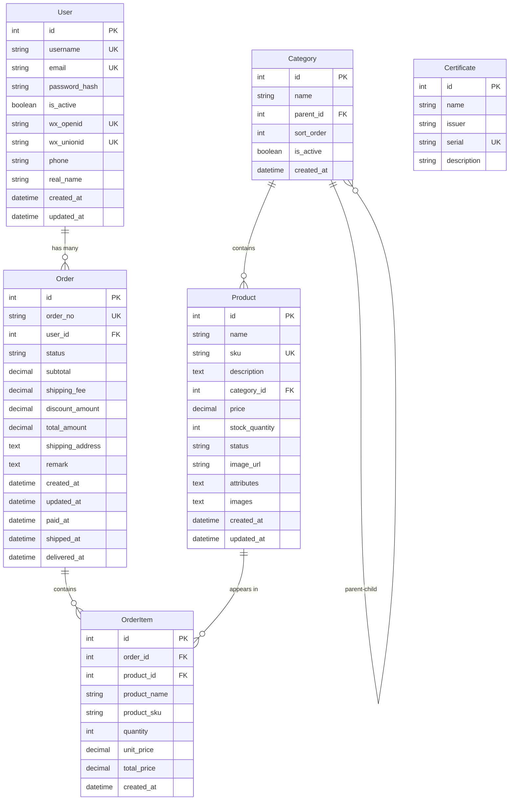
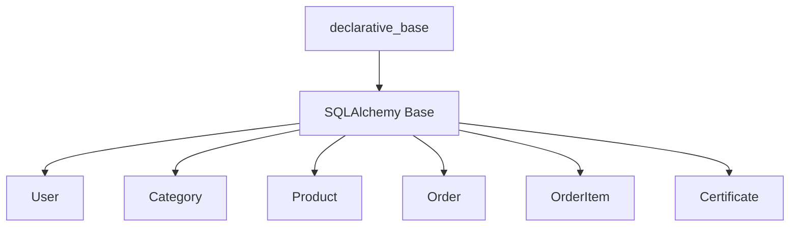
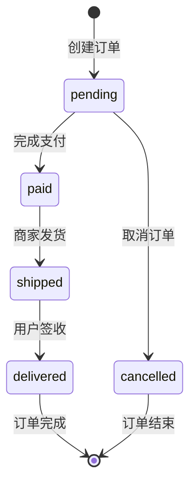

# 数据模型模块 (Data Models Module)

## 模块概述

数据模型模块 (`app/models.py`) 定义了电商平台的核心数据结构，使用SQLAlchemy ORM实现数据库表映射、字段约束、索引优化和关系管理，是整个应用的数据层基础。

### 主要功能

1. **用户管理模型**
   - 用户基础信息存储
   - 微信小程序对接支持
   - 用户认证字段管理
   - 用户状态控制

2. **商品管理模型**
   - 商品信息存储
   - 分类层次结构
   - 库存数量管理
   - 商品状态控制

3. **订单管理模型**
   - 订单生命周期管理
   - 订单项详细记录
   - 价格计算结构
   - 时间节点追踪

4. **系统扩展模型**
   - 证书管理模型
   - 为未来功能预留结构
   - 灵活的扩展机制

## 技术架构

### 数据模型关系图



### 继承层次结构



## 数据模型详解

### 1. User (用户模型)

**表名**: `users`  
**功能**: 管理平台用户信息和认证

#### 字段说明

| 字段名 | 类型 | 约束 | 描述 | 示例 |
|--------|------|------|------|------|
| `id` | Integer | PK, Index | 用户唯一标识 | `1001` |
| `username` | String(50) | UK, Not Null | 用户名 | `"john_doe"` |
| `email` | String(200) | UK, Not Null | 邮箱地址 | `"john@example.com"` |
| `password_hash` | String(255) | Not Null | 密码哈希值 | `"$2b$12$..."` |
| `is_active` | Boolean | Default True | 用户激活状态 | `true` |
| `wx_openid` | String(100) | UK, Nullable | 微信OpenID | `"o1234567890"` |
| `wx_unionid` | String(100) | UK, Nullable | 微信UnionID | `"u9876543210"` |
| `phone` | String(20) | Nullable | 手机号码 | `"13800138000"` |
| `real_name` | String(100) | Nullable | 真实姓名 | `"张三"` |
| `created_at` | DateTime | Server Default | 创建时间 | `2025-09-11 10:00:00` |
| `updated_at` | DateTime | Auto Update | 更新时间 | `2025-09-11 10:30:00` |

#### 关系定义

```python
# 一对多：用户可以有多个订单
orders = relationship("Order", back_populates="user")
```

#### 设计特点

- **唯一性约束**: username, email, wx_openid, wx_unionid
- **微信集成**: 预留微信小程序对接字段
- **软删除支持**: 通过is_active字段实现
- **时间戳**: 自动维护创建和更新时间

### 2. Category (分类模型)

**表名**: `categories`  
**功能**: 管理商品分类层次结构

#### 字段说明

| 字段名 | 类型 | 约束 | 描述 | 示例 |
|--------|------|------|------|------|
| `id` | Integer | PK, Index | 分类唯一标识 | `101` |
| `name` | String(100) | Not Null | 分类名称 | `"电子产品"` |
| `parent_id` | Integer | FK, Nullable | 父分类ID | `100` |
| `sort_order` | Integer | Default 0 | 排序权重 | `10` |
| `is_active` | Boolean | Default True | 分类激活状态 | `true` |
| `created_at` | DateTime | Server Default | 创建时间 | `2025-09-11 10:00:00` |

#### 关系定义

```python
# 一对多：分类可以包含多个商品
products = relationship("Product", back_populates="category")
```

#### 设计特点

- **层次结构**: 支持无限级分类嵌套
- **排序支持**: sort_order字段控制显示顺序
- **状态控制**: is_active实现分类启用/禁用
- **自引用外键**: parent_id指向同表实现树形结构

### 3. Product (商品模型)

**表名**: `products`  
**功能**: 管理商品信息、库存和状态

#### 字段说明

| 字段名 | 类型 | 约束 | 描述 | 示例 |
|--------|------|------|------|------|
| `id` | Integer | PK, Index | 商品唯一标识 | `2001` |
| `name` | String(200) | Not Null | 商品名称 | `"iPhone 15 Pro"` |
| `sku` | String(100) | UK, Not Null | 商品编码 | `"IPH15P-128G-TIT"` |
| `description` | Text | Nullable | 商品描述 | `"最新款苹果手机..."` |
| `category_id` | Integer | FK, Nullable | 分类ID | `101` |
| `price` | DECIMAL(10,2) | Not Null, Default 0.00 | 商品价格 | `9999.00` |
| `stock_quantity` | Integer | Not Null, Default 0 | 库存数量 | `50` |
| `status` | String(20) | Not Null, Default 'active' | 商品状态 | `"active"` |
| `image_url` | String(500) | Nullable | 主图URL | `"https://..."` |
| `attributes` | Text | Nullable | 商品属性(JSON) | `'{"color":"钛原色","storage":"128GB"}'` |
| `images` | Text | Nullable | 商品图片列表(JSON) | `'["url1","url2","url3"]'` |
| `created_at` | DateTime | Server Default | 创建时间 | `2025-09-11 10:00:00` |
| `updated_at` | DateTime | Auto Update | 更新时间 | `2025-09-11 10:30:00` |

#### 状态枚举

| 状态值 | 描述 | 前端显示 |
|--------|------|----------|
| `active` | 正常销售 | "在售" |
| `inactive` | 暂停销售 | "下架" |
| `out_of_stock` | 库存不足 | "缺货" |

#### 关系定义

```python
# 多对一：商品属于一个分类
category = relationship("Category", back_populates="products")
# 一对多：商品可以出现在多个订单项中
order_items = relationship("OrderItem", back_populates="product")
```

#### 索引优化

```python
__table_args__ = (
    Index('idx_category_status', 'category_id', 'status'),  # 分类状态复合索引
    Index('idx_status_created', 'status', 'created_at'),    # 状态时间复合索引
)
```

#### 设计特点

- **SKU唯一性**: 支持商品规格管理
- **灵活属性**: JSON字段存储可变属性
- **多图支持**: JSON数组存储多张商品图片
- **状态管理**: 支持商品生命周期状态控制
- **性能优化**: 关键查询字段建立复合索引

### 4. Order (订单模型)

**表名**: `orders`  
**功能**: 管理订单生命周期和状态变更

#### 字段说明

| 字段名 | 类型 | 约束 | 描述 | 示例 |
|--------|------|------|------|------|
| `id` | Integer | PK, Index | 订单唯一标识 | `3001` |
| `order_no` | String(32) | UK, Not Null | 订单编号 | `"ORD20250911100001"` |
| `user_id` | Integer | FK, Not Null | 用户ID | `1001` |
| `status` | String(20) | Not Null, Default 'pending' | 订单状态 | `"paid"` |
| `subtotal` | DECIMAL(10,2) | Not Null, Default 0.00 | 商品小计 | `9999.00` |
| `shipping_fee` | DECIMAL(10,2) | Not Null, Default 0.00 | 运费 | `15.00` |
| `discount_amount` | DECIMAL(10,2) | Not Null, Default 0.00 | 优惠金额 | `100.00` |
| `total_amount` | DECIMAL(10,2) | Not Null, Default 0.00 | 订单总额 | `9914.00` |
| `shipping_address` | Text | Nullable | 收货地址(JSON) | `'{"name":"张三","phone":"138..."}'` |
| `remark` | Text | Nullable | 订单备注 | `"请在工作日送达"` |
| `created_at` | DateTime | Server Default | 创建时间 | `2025-09-11 10:00:00` |
| `updated_at` | DateTime | Auto Update | 更新时间 | `2025-09-11 10:30:00` |
| `paid_at` | DateTime | Nullable | 支付时间 | `2025-09-11 10:05:00` |
| `shipped_at` | DateTime | Nullable | 发货时间 | `2025-09-11 14:00:00` |
| `delivered_at` | DateTime | Nullable | 签收时间 | `2025-09-12 09:00:00` |

#### 状态流转



#### 状态枚举

| 状态值 | 描述 | 可执行操作 |
|--------|------|-----------|
| `pending` | 待支付 | 支付、取消 |
| `paid` | 已支付 | 发货、退款 |
| `shipped` | 已发货 | 确认收货 |
| `delivered` | 已送达 | 评价、售后 |
| `cancelled` | 已取消 | 查看详情 |

#### 关系定义

```python
# 多对一：订单属于一个用户
user = relationship("User", back_populates="orders")
# 一对多：订单包含多个订单项
order_items = relationship("OrderItem", back_populates="order")
```

#### 索引优化

```python
__table_args__ = (
    Index('idx_user_status', 'user_id', 'status'),      # 用户状态复合索引
    Index('idx_status_created', 'status', 'created_at'), # 状态时间复合索引
    Index('idx_order_no', 'order_no'),                  # 订单号索引
)
```

### 5. OrderItem (订单项模型)

**表名**: `order_items`  
**功能**: 记录订单中的具体商品项和价格快照

#### 字段说明

| 字段名 | 类型 | 约束 | 描述 | 示例 |
|--------|------|------|------|------|
| `id` | Integer | PK, Index | 订单项唯一标识 | `4001` |
| `order_id` | Integer | FK, Not Null | 订单ID | `3001` |
| `product_id` | Integer | FK, Not Null | 商品ID | `2001` |
| `product_name` | String(200) | Not Null | 商品名称快照 | `"iPhone 15 Pro"` |
| `product_sku` | String(100) | Not Null | 商品SKU快照 | `"IPH15P-128G-TIT"` |
| `quantity` | Integer | Not Null | 购买数量 | `1` |
| `unit_price` | DECIMAL(10,2) | Not Null | 单价快照 | `9999.00` |
| `total_price` | DECIMAL(10,2) | Not Null | 小计金额 | `9999.00` |
| `created_at` | DateTime | Server Default | 创建时间 | `2025-09-11 10:00:00` |

#### 关系定义

```python
# 多对一：订单项属于一个订单
order = relationship("Order", back_populates="order_items")
# 多对一：订单项关联一个商品
product = relationship("Product", back_populates="order_items")
```

#### 索引优化

```python
__table_args__ = (
    Index('idx_order_product', 'order_id', 'product_id'),  # 订单商品复合索引
)
```

#### 设计特点

- **快照机制**: 保存下单时的商品信息，避免后续变更影响
- **价格一致性**: unit_price * quantity = total_price
- **关联查询优化**: 复合索引支持高效查询

### 6. Certificate (证书模型)

**表名**: `certificates`  
**功能**: 管理系统证书信息 (预留模型)

#### 字段说明

| 字段名 | 类型 | 约束 | 描述 | 示例 |
|--------|------|------|------|------|
| `id` | Integer | PK, Index | 证书唯一标识 | `5001` |
| `name` | String(200) | Not Null | 证书名称 | `"ISO 9001质量管理体系认证"` |
| `issuer` | String(200) | Nullable | 颁发机构 | `"中国质量认证中心"` |
| `serial` | String(200) | UK, Not Null | 证书编号 | `"CQC20250911001"` |
| `description` | String(1000) | Nullable | 证书描述 | `"质量管理体系符合标准要求"` |

#### 设计特点

- **扩展预留**: 为质量认证系统预留的数据结构
- **唯一性**: 证书编号唯一约束
- **灵活描述**: 支持长文本描述

## 数据库设计原则

### 1. 命名规范

- **表名**: 使用复数形式，小写+下划线 (`users`, `order_items`)
- **字段名**: 小写+下划线 (`created_at`, `user_id`)
- **外键**: `{表名}_id` 格式 (`user_id`, `category_id`)
- **索引**: `idx_{字段名}` 格式 (`idx_user_status`)

### 2. 数据类型选择

- **主键**: Integer，自增
- **字符串**: String(length)，根据实际需求设置长度
- **文本**: Text，大文本内容
- **价格**: DECIMAL(10,2)，确保精度
- **时间**: DateTime，支持时区
- **布尔**: Boolean，明确状态

### 3. 约束设计

- **主键约束**: 每个表必须有主键
- **唯一约束**: 业务唯一字段添加唯一约束
- **外键约束**: 维护数据完整性
- **非空约束**: 必填字段设置NOT NULL
- **默认值**: 合理设置字段默认值

### 4. 索引策略

- **主键索引**: 自动创建
- **唯一索引**: 唯一约束字段自动创建
- **复合索引**: 常用查询字段组合
- **查询优化**: 根据实际查询模式优化

## 使用示例

### 1. 创建用户

```python
from app.models import User
from app.database import SessionLocal

session = SessionLocal()

# 创建新用户
new_user = User(
    username="john_doe",
    email="john@example.com",
    password_hash="$2b$12$hashed_password",
    phone="13800138000",
    real_name="约翰·多伊"
)

session.add(new_user)
session.commit()
session.refresh(new_user)
print(f"用户创建成功，ID: {new_user.id}")
```

### 2. 查询商品

```python
from app.models import Product, Category

# 查询指定分类的活跃商品
active_products = session.query(Product)\
    .filter(Product.status == 'active')\
    .filter(Product.category_id == 101)\
    .order_by(Product.created_at.desc())\
    .limit(10)\
    .all()

# 联表查询商品及分类信息
products_with_category = session.query(Product, Category)\
    .join(Category, Product.category_id == Category.id)\
    .filter(Product.status == 'active')\
    .all()
```

### 3. 创建订单

```python
from app.models import Order, OrderItem
import uuid
from datetime import datetime

# 创建订单
order = Order(
    order_no=f"ORD{datetime.now().strftime('%Y%m%d%H%M%S')}",
    user_id=1001,
    status='pending',
    shipping_address='{"name":"张三","phone":"13800138000","address":"北京市朝阳区..."}',
    remark="请在工作日送达"
)

session.add(order)
session.flush()  # 获取订单ID

# 创建订单项
order_item = OrderItem(
    order_id=order.id,
    product_id=2001,
    product_name="iPhone 15 Pro",
    product_sku="IPH15P-128G-TIT",
    quantity=1,
    unit_price=9999.00,
    total_price=9999.00
)

session.add(order_item)

# 计算订单总额
order.subtotal = 9999.00
order.shipping_fee = 15.00
order.total_amount = order.subtotal + order.shipping_fee

session.commit()
```

### 4. 更新库存

```python
from sqlalchemy import and_

# 减少库存（原子操作）
result = session.query(Product)\
    .filter(and_(
        Product.id == 2001,
        Product.stock_quantity >= 1
    ))\
    .update({
        Product.stock_quantity: Product.stock_quantity - 1,
        Product.updated_at: datetime.now()
    })

if result == 0:
    raise Exception("库存不足或商品不存在")

session.commit()
```

## 数据迁移

### 使用Alembic进行表结构迁移

```bash
# 生成迁移文件
alembic revision --autogenerate -m "Add user authentication fields"

# 执行迁移
alembic upgrade head

# 回滚迁移
alembic downgrade -1
```

### 初始化数据

```python
from app.database import create_tables
from app.models import Category, Product

# 创建表结构
create_tables()

# 插入初始数据
session = SessionLocal()

# 创建根分类
root_categories = [
    Category(name="电子产品", sort_order=1),
    Category(name="服装鞋帽", sort_order=2),
    Category(name="图书音像", sort_order=3),
]

session.add_all(root_categories)
session.commit()
```

## 性能优化

### 1. 查询优化

```python
# 使用索引字段查询
products = session.query(Product)\
    .filter(Product.status == 'active')\
    .filter(Product.category_id == 101)\
    .all()

# 预加载关联数据
from sqlalchemy.orm import joinedload

orders = session.query(Order)\
    .options(joinedload(Order.order_items))\
    .filter(Order.user_id == 1001)\
    .all()
```

### 2. 批量操作

```python
# 批量插入
products_data = [
    {"name": "商品1", "sku": "SKU001", "price": 100.00},
    {"name": "商品2", "sku": "SKU002", "price": 200.00},
]

session.bulk_insert_mappings(Product, products_data)
session.commit()

# 批量更新
session.query(Product)\
    .filter(Product.category_id == 101)\
    .update({"status": "inactive"})
session.commit()
```

### 3. 缓存策略

```python
# 使用Redis缓存热点数据
import json
from app.redis_client import get_redis_connection

async def get_product_with_cache(product_id: int):
    redis = await get_redis_connection()
    cache_key = f"product:{product_id}"
    
    # 尝试从缓存获取
    cached = await redis.get(cache_key)
    if cached:
        return json.loads(cached)
    
    # 从数据库获取
    session = SessionLocal()
    product = session.query(Product).filter(Product.id == product_id).first()
    
    if product:
        product_data = {
            "id": product.id,
            "name": product.name,
            "price": float(product.price),
            "stock_quantity": product.stock_quantity
        }
        # 缓存1小时
        await redis.setex(cache_key, 3600, json.dumps(product_data))
        return product_data
    
    return None
```

## 安全考虑

### 1. SQL注入防护

```python
# 使用参数化查询（SQLAlchemy自动处理）
user_id = request.user_id
orders = session.query(Order).filter(Order.user_id == user_id).all()

# 避免字符串拼接
# 错误示例: f"SELECT * FROM orders WHERE user_id = {user_id}"
```

### 2. 数据验证

```python
from pydantic import BaseModel, validator

class ProductCreate(BaseModel):
    name: str
    sku: str
    price: float
    
    @validator('price')
    def price_must_be_positive(cls, v):
        if v <= 0:
            raise ValueError('价格必须大于0')
        return v
    
    @validator('sku')
    def sku_must_be_unique(cls, v):
        # 在业务层验证SKU唯一性
        return v
```

### 3. 权限控制

```python
def check_order_permission(user_id: int, order_id: int) -> bool:
    """检查用户是否有权限访问订单"""
    session = SessionLocal()
    order = session.query(Order)\
        .filter(Order.id == order_id)\
        .filter(Order.user_id == user_id)\
        .first()
    return order is not None
```

## 监控和调试

### 1. SQL日志

```python
# 在database.py中启用SQL日志
engine = create_engine(
    DATABASE_URL,
    echo=True,  # 输出SQL语句
)
```

### 2. 性能监控

```python
import time
from sqlalchemy import event
from sqlalchemy.engine import Engine

@event.listens_for(Engine, "before_cursor_execute")
def receive_before_cursor_execute(conn, cursor, statement, parameters, context, executemany):
    context._query_start_time = time.time()

@event.listens_for(Engine, "after_cursor_execute")
def receive_after_cursor_execute(conn, cursor, statement, parameters, context, executemany):
    total = time.time() - context._query_start_time
    if total > 0.1:  # 慢查询阈值100ms
        print(f"慢查询警告: {total:.2f}s - {statement[:100]}...")
```

## 版本历史

| 版本 | 日期 | 变更说明 |
|------|------|----------|
| 0.1.0 | 2025-09-11 | 初始版本，定义核心数据模型 |

## 相关文档

- [数据库连接模块](../database/overview.md)
- [API数据模型Schema](../../api/modules/schemas/overview.md)
- [数据库迁移指南](../../operations/deployment.md#数据库迁移)
- [SQLAlchemy官方文档](https://docs.sqlalchemy.org/)
