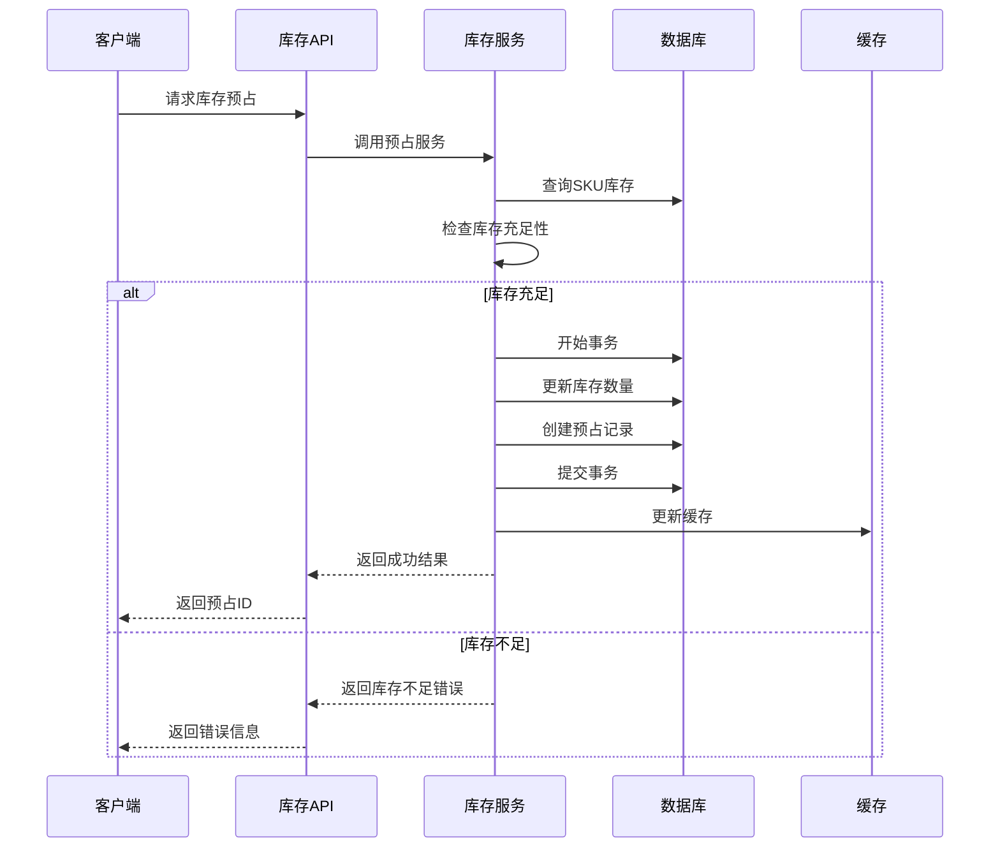
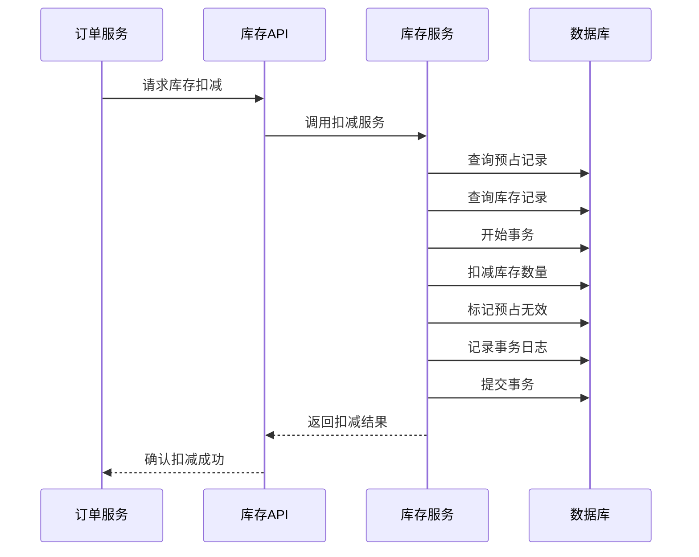
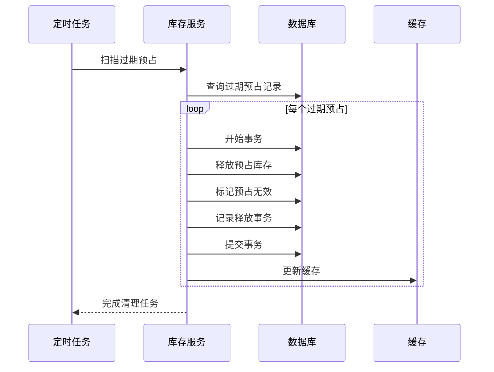

# 库存管理模块设计文档

<!--
文件名：design.md
文件路径：docs/modules/inventory-management/design.md
文档类型：系统设计文档
模块名称：库存管理模块 (Inventory Management Module)
文档版本：v1.0.0
创建时间：2025-09-15
最后修改：2025-09-15
维护人员：系统架构师
文档状态：正式版本

文档用途：
- 定义库存管理模块的系统架构设计
- 描述数据模型和业务流程设计
- 提供技术选型和性能优化方案

相关文档：
- 需求规格说明书：requirements.md
- 实现指南：implementation.md
- API规范：api-spec.md
-->

## 1. 架构设计

### 1.1 整体架构

```
┌─────────────────┐    ┌─────────────────┐    ┌─────────────────┐
│   API Layer     │    │  Business Layer │    │   Data Layer    │
├─────────────────┤    ├─────────────────┤    ├─────────────────┤
│ - FastAPI       │    │ - Service       │    │ - SQLAlchemy    │
│ - Router        │    │ - Business      │    │ - Models        │
│ - Schemas       │    │   Logic         │    │ - Database      │
│ - Validation    │    │ - Transactions  │    │ - Redis Cache   │
└─────────────────┘    └─────────────────┘    └─────────────────┘
         │                        │                        │
         └────────────────────────┼────────────────────────┘
                                  │
                    ┌─────────────────┐
                    │ Infrastructure  │
                    ├─────────────────┤
                    │ - Database      │
                    │ - Redis         │
                    │ - Logging       │
                    │ - Monitoring    │
                    └─────────────────┘
```

### 1.2 分层架构说明

#### 1.2.1 API层（Presentation Layer）
- **职责**: 处理HTTP请求响应、数据验证、错误处理
- **组件**: 
  - `router.py`: API路由定义和请求处理
  - `schemas.py`: 请求/响应数据模型
  - `dependencies.py`: 依赖注入组件

#### 1.2.2 业务逻辑层（Business Layer）
- **职责**: 实现核心业务逻辑、事务管理、业务规则验证
- **组件**:
  - `service.py`: 业务服务类，封装核心业务逻辑
  - 事务管理: 确保数据一致性
  - 业务规则引擎: 执行库存相关业务规则

#### 1.2.3 数据访问层（Data Layer）
- **职责**: 数据持久化、缓存管理、数据访问优化
- **组件**:
  - `models.py`: SQLAlchemy数据模型
  - 数据库连接管理
  - Redis缓存策略

### 1.3 模块交互设计

```
┌──────────────┐     ┌──────────────┐     ┌──────────────┐
│ Order Module │────▶│ Inventory    │────▶│ Product      │
│              │     │ Management   │     │ Catalog      │
│              │     │              │     │              │
└──────────────┘     └──────────────┘     └──────────────┘
       │                       │                   │
       ▼                       ▼                   ▼
┌──────────────┐     ┌──────────────┐     ┌──────────────┐
│ Shopping     │     │ Notification │     │ User Auth    │
│ Cart         │     │ Service      │     │ Module       │
└──────────────┘     └──────────────┘     └──────────────┘
```

## 2. 数据模型设计

### 2.1 核心实体关系图

```
┌─────────────────────┐       ┌─────────────────────┐
│   InventoryStock    │       │ InventoryReservation│
├─────────────────────┤       ├─────────────────────┤
│ id (PK)             │   ┌───│ id (PK)             │
│ sku_id (UK)         │◄──┤   │ sku_id (FK)         │
│ total_quantity      │   │   │ reservation_type    │
│ available_quantity  │   │   │ reference_id        │
│ reserved_quantity   │   │   │ quantity            │
│ warning_threshold   │   │   │ expires_at          │
│ critical_threshold  │   │   │ is_active           │
│ is_active          │   │   │ created_at          │
│ created_at         │   │   │ updated_at          │
│ updated_at         │   │   └─────────────────────┘
└─────────────────────┘   │   
           │               │   ┌─────────────────────┐
           └───────────────┴───│InventoryTransaction │
                               ├─────────────────────┤
                               │ id (PK)             │
                               │ sku_id (FK)         │
                               │ transaction_type    │
                               │ quantity_change     │
                               │ quantity_before     │
                               │ quantity_after      │
                               │ reference_type      │
                               │ reference_id        │
                               │ reason              │
                               │ operator_id         │
                               │ created_at          │
                               └─────────────────────┘
```

### 2.2 数据模型详细设计

#### 2.2.1 库存主表 (InventoryStock)

| 字段名 | 类型 | 约束 | 描述 |
|--------|------|------|------|
| id | Integer | PK, AUTO_INCREMENT | 主键ID |
| sku_id | Integer | FK, NOT NULL, UK | 关联的SKU ID (引用 skus.id) |
| total_quantity | Integer | NOT NULL, ≥0 | 总库存数量 |
| available_quantity | Integer | Computed | 可用库存 = 总库存 - 预占库存 |
| reserved_quantity | Integer | NOT NULL, ≥0 | 预占库存数量 |
| warning_threshold | Integer | NOT NULL, ≥0 | 低库存预警阈值 |
| critical_threshold | Integer | NOT NULL, ≥0 | 紧急库存阈值 |
| is_active | Boolean | NOT NULL, DEFAULT TRUE | 是否启用库存管理 |
| created_at | DateTime | NOT NULL | 创建时间 |
| updated_at | DateTime | NOT NULL | 更新时间 |

**约束条件**:
- `available_quantity = total_quantity - reserved_quantity`
- `critical_threshold <= warning_threshold`
- `reserved_quantity <= total_quantity`

#### 2.2.2 库存预占表 (InventoryReservation)

| 字段名 | 类型 | 约束 | 描述 |
|--------|------|------|------|
| id | Integer | PK, AUTO_INCREMENT | 主键ID |
| sku_id | Integer | FK, NOT NULL | 关联的SKU ID (引用 skus.id) |
| reservation_type | Enum | NOT NULL | 预占类型 (cart/order) |
| reference_id | String(100) | NOT NULL | 关联业务ID |
| quantity | Integer | NOT NULL, >0 | 预占数量 |
| expires_at | DateTime | NOT NULL | 过期时间 |
| is_active | Boolean | NOT NULL, DEFAULT TRUE | 是否有效 |
| created_at | DateTime | NOT NULL | 创建时间 |
| updated_at | DateTime | NOT NULL | 更新时间 |

**索引设计**:
- `idx_reservation_sku_id`: (sku_id)
- `idx_reservation_reference`: (reference_id)
- `idx_reservation_expires`: (expires_at)
- `idx_reservation_active`: (is_active)

#### 2.2.3 库存事务表 (InventoryTransaction)

| 字段名 | 类型 | 约束 | 描述 |
|--------|------|------|------|
| id | Integer | PK, AUTO_INCREMENT | 主键ID |
| sku_id | Integer | FK, NOT NULL | 关联的SKU ID (引用 skus.id) |
| transaction_type | Enum | NOT NULL | 事务类型 |
| quantity_change | Integer | NOT NULL | 数量变化 |
| quantity_before | Integer | NOT NULL | 变更前数量 |
| quantity_after | Integer | NOT NULL | 变更后数量 |
| reference_type | String(50) | | 关联业务类型 |
| reference_id | String(100) | | 关联业务ID |
| reason | String(500) | | 变更原因 |
| operator_id | Integer | | 操作人ID |
| created_at | DateTime | NOT NULL | 创建时间 |

**索引设计**:
- `idx_transaction_sku_id`: (sku_id)
- `idx_transaction_type`: (transaction_type)
- `idx_transaction_created`: (created_at)
- `idx_transaction_reference`: (reference_type, reference_id)

### 2.3 枚举类型定义

#### 2.3.1 事务类型 (TransactionType)
```python
class TransactionType(enum.Enum):
    RESERVE = "reserve"      # 预占
    RELEASE = "release"      # 释放预占
    DEDUCT = "deduct"        # 扣减（实际出库）  
    ADJUST = "adjust"        # 手动调整
    RESTOCK = "restock"      # 入库
```

#### 2.3.2 预占类型 (ReservationType)
```python
class ReservationType(enum.Enum):
    CART = "cart"            # 购物车预占
    ORDER = "order"          # 订单预占
```

## 3. 业务流程设计

### 3.1 库存预占流程



### 3.2 库存扣减流程



### 3.3 预占自动释放流程



## 4. 核心算法设计

### 4.1 库存并发控制算法

```python
# 悲观锁实现
async def reserve_inventory_with_lock(sku_id: str, quantity: int):
    async with database.transaction():
        # 使用 SELECT FOR UPDATE 加行锁
        inventory = await db.query(InventoryStock).filter(
            InventoryStock.sku_id == sku_id
        ).with_for_update().first()
        
        if inventory.available_quantity >= quantity:
            inventory.reserved_quantity += quantity
            # 创建预占记录
            reservation = InventoryReservation(...)
            db.add(reservation)
            return True
        else:
            raise InsufficientInventoryError()
```

### 4.2 批量操作优化算法

```python
async def batch_reserve_inventory(items: List[Dict]):
    # 按 SKU 分组，避免重复查询
    sku_quantities = defaultdict(int)
    for item in items:
        sku_quantities[item['sku_id']] += item['quantity']
    
    # 批量查询库存
    inventories = await db.query(InventoryStock).filter(
        InventoryStock.sku_id.in_(sku_quantities.keys())
    ).with_for_update().all()
    
    # 验证库存充足性
    inventory_map = {inv.sku_id: inv for inv in inventories}
    for sku_id, total_quantity in sku_quantities.items():
        if inventory_map[sku_id].available_quantity < total_quantity:
            raise InsufficientInventoryError(sku_id)
    
    # 批量更新库存
    for sku_id, quantity in sku_quantities.items():
        inventory_map[sku_id].reserved_quantity += quantity
```

### 4.3 缓存一致性算法

```python
class InventoryCacheManager:
    def __init__(self, redis_client):
        self.redis = redis_client
        self.cache_ttl = 300  # 5分钟
    
    async def get_inventory(self, sku_id: str):
        # 尝试从缓存获取
        cache_key = f"inventory:{sku_id}"
        cached_data = await self.redis.get(cache_key)
        
        if cached_data:
            return json.loads(cached_data)
        
        # 缓存未命中，查询数据库
        inventory = await self._query_from_db(sku_id)
        if inventory:
            await self.redis.setex(
                cache_key, 
                self.cache_ttl, 
                json.dumps(inventory)
            )
        return inventory
    
    async def invalidate_cache(self, sku_id: str):
        """库存更新后清除缓存"""
        cache_key = f"inventory:{sku_id}"
        await self.redis.delete(cache_key)
```

## 5. 性能优化设计

### 5.1 数据库优化

#### 5.1.1 索引策略
```sql
-- 库存主表核心索引
CREATE INDEX idx_inventory_sku_id ON inventory_stock(sku_id);
CREATE INDEX idx_inventory_active ON inventory_stock(is_active);
CREATE INDEX idx_inventory_low_stock ON inventory_stock(available_quantity) 
  WHERE available_quantity <= warning_threshold;

-- 预占表查询优化索引  
CREATE INDEX idx_reservation_sku_active ON inventory_reservation(sku_id, is_active);
CREATE INDEX idx_reservation_expires ON inventory_reservation(expires_at) 
  WHERE is_active = true;

-- 事务表历史查询索引
CREATE INDEX idx_transaction_sku_created ON inventory_transaction(sku_id, created_at);
CREATE INDEX idx_transaction_type_created ON inventory_transaction(transaction_type, created_at);
```

#### 5.1.2 分区策略
```sql
-- 事务表按月分区
CREATE TABLE inventory_transaction (
    ...
) PARTITION BY RANGE (created_at);

-- 创建月度分区
CREATE TABLE inventory_transaction_2025_09 PARTITION OF inventory_transaction
  FOR VALUES FROM ('2025-09-01') TO ('2025-10-01');
```

### 5.2 缓存策略

#### 5.2.1 多层缓存架构
```
┌─────────────────┐
│ Application     │ ← 应用层缓存 (内存)
│ Level Cache     │
├─────────────────┤
│ Redis Cache     │ ← 分布式缓存 (Redis)
│ Distributed     │
├─────────────────┤
│ Database        │ ← 数据持久层 (PostgreSQL)
│ Persistent      │
└─────────────────┘
```

#### 5.2.2 缓存更新策略
- **Write-Through**: 写入时同时更新缓存和数据库
- **Cache-Aside**: 读取时检查缓存，未命中时查询数据库
- **TTL策略**: 设置合理的过期时间，避免数据过期
- **主动失效**: 数据变更时主动清除相关缓存

### 5.3 并发控制优化

#### 5.3.1 锁粒度优化
```python
# 行级锁：只锁定相关SKU记录
SELECT * FROM inventory_stock 
WHERE sku_id = ? FOR UPDATE;

# 避免表级锁：使用批量操作时按SKU排序，避免死锁
ORDER BY sku_id ASC FOR UPDATE;
```

#### 5.3.2 事务隔离级别
- **读已提交**: 普通查询操作使用READ COMMITTED
- **可重复读**: 涉及库存变更的事务使用REPEATABLE READ
- **串行化**: 关键业务场景使用SERIALIZABLE

## 6. 错误处理设计

### 6.1 异常类型定义

```python
class InventoryException(BaseException):
    """库存管理基础异常"""
    pass

class InsufficientInventoryError(InventoryException):
    """库存不足异常"""
    def __init__(self, sku_id: str, requested: int, available: int):
        self.sku_id = sku_id
        self.requested = requested
        self.available = available
        super().__init__(f"SKU {sku_id} 库存不足，需要: {requested}, 可用: {available}")

class InventoryNotFoundError(InventoryException):
    """库存记录不存在异常"""
    pass

class ReservationExpiredError(InventoryException):
    """预占已过期异常"""
    pass

class InvalidOperationError(InventoryException):
    """无效操作异常"""
    pass
```

### 6.2 错误码规范

| 错误码 | HTTP状态码 | 描述 | 解决方案 |
|--------|------------|------|----------|
| INV_001 | 404 | SKU库存记录不存在 | 检查SKU ID有效性 |
| INV_002 | 400 | 库存数量不足 | 减少请求数量或等待补货 |
| INV_003 | 400 | 预占已过期 | 重新发起预占请求 |
| INV_004 | 409 | 并发冲突 | 重试操作 |
| INV_005 | 422 | 参数验证失败 | 检查请求参数格式 |
| INV_006 | 500 | 数据库操作失败 | 联系系统管理员 |

### 6.3 重试机制设计

```python
import asyncio
from tenacity import retry, stop_after_attempt, wait_exponential

@retry(
    stop=stop_after_attempt(3),
    wait=wait_exponential(multiplier=1, min=4, max=10),
    retry=retry_if_exception_type((ConnectionError, TimeoutError))
)
async def reserve_inventory_with_retry(sku_id: str, quantity: int):
    """带重试的库存预占"""
    try:
        return await reserve_inventory(sku_id, quantity)
    except ConcurrencyError:
        # 并发冲突时等待随机时间后重试
        await asyncio.sleep(random.uniform(0.1, 0.5))
        raise
```

## 7. 监控和观测设计

### 7.1 关键指标监控

#### 7.1.1 业务指标
- **库存准确率**: 库存记录与实际库存的一致性
- **预占成功率**: 预占请求的成功率
- **库存周转率**: 库存变化频率
- **缺货率**: 缺货SKU占比

#### 7.1.2 技术指标  
- **API响应时间**: 各接口的平均响应时间和P99
- **数据库性能**: 查询耗时、连接池使用率
- **缓存命中率**: Redis缓存的命中率
- **事务成功率**: 数据库事务的成功率

### 7.2 告警规则

```yaml
# Prometheus告警规则示例
groups:
  - name: inventory.rules
    rules:
      - alert: HighInventoryAPILatency
        expr: histogram_quantile(0.99, inventory_api_duration_seconds) > 0.5
        for: 5m
        annotations:
          summary: "库存API延迟过高"
          
      - alert: LowInventoryLevels
        expr: inventory_low_stock_count > 100
        for: 10m
        annotations:
          summary: "低库存商品数量过多"
          
      - alert: InventoryDatabaseErrors
        expr: rate(inventory_db_errors_total[5m]) > 0.1
        for: 2m
        annotations:
          summary: "库存数据库错误率过高"
```

### 7.3 链路追踪

```python
from opentelemetry import trace

tracer = trace.get_tracer(__name__)

async def reserve_inventory(sku_id: str, quantity: int):
    with tracer.start_as_current_span("reserve_inventory") as span:
        span.set_attribute("sku_id", sku_id)
        span.set_attribute("quantity", quantity)
        
        try:
            # 库存预占逻辑
            result = await _do_reserve(sku_id, quantity)
            span.set_attribute("success", True)
            return result
        except Exception as e:
            span.set_attribute("error", str(e))
            span.set_status(trace.Status(trace.StatusCode.ERROR))
            raise
```

## 8. 安全设计

### 8.1 权限控制

#### 8.1.1 RBAC权限模型
```python
class Permission(enum.Enum):
    INVENTORY_READ = "inventory:read"
    INVENTORY_CREATE = "inventory:create"  
    INVENTORY_UPDATE = "inventory:update"
    INVENTORY_DELETE = "inventory:delete"
    INVENTORY_ADMIN = "inventory:admin"

class Role(enum.Enum):
    GUEST = "guest"           # 游客
    USER = "user"            # 普通用户  
    BUSINESS = "business"     # 业务系统
    ADMIN = "admin"          # 管理员

# 角色权限映射
ROLE_PERMISSIONS = {
    Role.GUEST: [Permission.INVENTORY_READ],
    Role.USER: [Permission.INVENTORY_READ],
    Role.BUSINESS: [Permission.INVENTORY_READ, Permission.INVENTORY_UPDATE],
    Role.ADMIN: list(Permission)
}
```

#### 8.1.2 API权限验证
```python
from functools import wraps
from fastapi import Depends, HTTPException, status

def require_permission(permission: Permission):
    def decorator(func):
        @wraps(func)
        async def wrapper(*args, current_user = Depends(get_current_user), **kwargs):
            if not has_permission(current_user, permission):
                raise HTTPException(
                    status_code=status.HTTP_403_FORBIDDEN,
                    detail="权限不足"
                )
            return await func(*args, **kwargs)
        return wrapper
    return decorator

@router.post("/inventory/adjust")
@require_permission(Permission.INVENTORY_ADMIN)
async def adjust_inventory(...):
    """只有管理员可以手动调整库存"""
    pass
```

### 8.2 数据保护

#### 8.2.1 敏感数据加密
```python
from cryptography.fernet import Fernet

class DataEncryption:
    def __init__(self, encryption_key: str):
        self.cipher = Fernet(encryption_key.encode())
    
    def encrypt_sensitive_data(self, data: str) -> str:
        """加密敏感数据"""
        return self.cipher.encrypt(data.encode()).decode()
    
    def decrypt_sensitive_data(self, encrypted_data: str) -> str:
        """解密敏感数据"""
        return self.cipher.decrypt(encrypted_data.encode()).decode()
```

#### 8.2.2 审计日志
```python
class AuditLogger:
    async def log_inventory_operation(
        self,
        operation: str,
        sku_id: str,
        user_id: int,
        old_value: dict,
        new_value: dict,
        ip_address: str
    ):
        audit_log = {
            "timestamp": datetime.now(timezone.utc),
            "operation": operation,
            "sku_id": sku_id,
            "user_id": user_id,
            "changes": {
                "old": old_value,
                "new": new_value
            },
            "ip_address": ip_address,
            "user_agent": request.headers.get("User-Agent")
        }
        
        await self.security_logger.log(audit_log)
```

---

**文档版本**: v1.0  
**创建日期**: 2025-09-15  
**最后更新**: 2025-09-15  
**责任人**: 系统架构师  
**审核人**: 技术总监