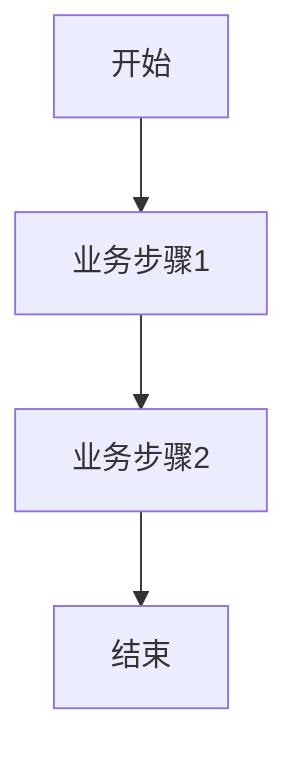

<!--
文档说明：
- 内容：模块业务需求文档模板
- 作用：记录业务需求、功能规格、验收标准
- 使用方法：详细记录业务需求，不包含技术实现
-->

# logistics-management模块 - 业务需求文档

📅 **创建日期**: 2025-09-16  
👤 **需求方**: 电商平台业务团队  
✅ **评审状态**: 已确认 (简化版，去除冷链功能)  
🔄 **最后更新**: 2025-09-16  

## 业务背景

### 业务目标
构建基础物流配送体系，支持标准商品的配送管理，确保配送效率和用户体验。暂不实现冷链配送功能，专注于标准配送服务。

### 业务场景
1. **订单配送**: 用户下单后需要安排配送到指定地址
2. **物流跟踪**: 用户和管理员需要实时了解配送状态  
3. **配送区域管理**: 根据配送范围和成本进行区域化管理
4. **自提服务**: 支持用户到指定点自提商品

### 成功指标
- **配送及时率**: ≥95% (标准配送3天内到达)
- **物流跟踪准确率**: ≥98% (状态更新准确性)
- **用户满意度**: ≥4.5分 (配送服务评分)
- **配送成本控制**: 单件配送成本≤8元

## 功能需求

### 核心功能列表
| 功能ID | 功能名称 | 优先级 | 业务价值 | 验收标准 |
|--------|----------|--------|----------|----------|
| LM-F001 | 配送方式管理 | 高 | 满足不同用户配送需求 | 支持标准配送、加急配送、定时配送 |
| LM-F002 | 物流跟踪 | 高 | 提升用户体验和透明度 | 实时显示配送状态，准确率≥98% |
| LM-F003 | 配送区域管理 | 中 | 控制配送成本和范围 | 支持区域配送费用设置 |
| LM-F004 | 自提服务 | 中 | 降低配送成本，便民服务 | 支持门店和社区自提点管理 |
| LM-F005 | 运费计算 | 高 | 成本控制和定价透明 | 自动计算配送费用 |
| LM-F006 | 标准包装服务 | 低 | 商品保护和品牌形象 | 支持标准包装和防损包装 |

### 详细功能描述

#### LM-F001: 配送方式管理
- **业务描述**: 提供多种配送方式以满足不同用户的时效需求
- **用户故事**: 作为用户，我希望能选择不同的配送方式，以便根据我的需求平衡时间和成本
- **前置条件**: 用户已完成订单创建
- **业务规则**: 
  - 标准配送: 3-5个工作日，费用最低
  - 加急配送: 1-2个工作日，费用较高
  - 定时配送: 指定时间段配送，需提前预约
- **异常处理**: 配送方式不可用时自动降级到标准配送

#### LM-F002: 物流跟踪  
- **业务描述**: 提供订单从发货到签收的全程跟踪服务
- **用户故事**: 作为用户，我希望随时了解我的包裹位置，以便合理安排收货时间
- **前置条件**: 订单已发货
- **业务规则**: 
  - 支持多个状态节点: 已发货、运输中、派送中、已签收
  - 状态更新实时推送给用户
  - 提供配送员联系方式
- **异常处理**: 配送异常时及时通知用户和客服

#### LM-F003: 配送区域管理
- **业务描述**: 管理可配送区域和对应的配送费用
- **用户故事**: 作为管理员，我希望能灵活设置配送区域和费用，以便控制运营成本
- **前置条件**: 管理员权限
- **业务规则**: 
  - 支持按省市区三级设置配送区域
  - 不同区域可设置不同配送费用
  - 支持特殊区域的配送限制
- **异常处理**: 不可配送区域提示用户选择其他地址

#### LM-F004: 自提服务
- **业务描述**: 提供门店自提和社区自提点服务
- **用户故事**: 作为用户，我希望能就近自提商品，以便节省配送费用和更灵活的取货时间
- **前置条件**: 用户选择自提方式
- **业务规则**: 
  - 支持门店自提和社区自提点
  - 自提免配送费
  - 商品到达后通知用户取货
  - 超时未取货的处理机制
- **异常处理**: 自提点暂停服务时自动分配到最近可用点

#### LM-F005: 运费计算
- **业务描述**: 根据商品重量、体积、配送区域自动计算运费
- **用户故事**: 作为用户，我希望在下单前就知道确切的配送费用，以便做购买决策
- **前置条件**: 用户选择配送地址和配送方式
- **业务规则**: 
  - 按重量和体积计费，取较大值
  - 同区域内支持包邮门槛设置
  - VIP用户享受配送优惠
- **异常处理**: 计算错误时使用预设标准费用

## 非功能需求

### 性能要求
- **响应时间**: 物流查询响应时间≤2秒
- **并发用户**: 支持1000个用户同时查询物流信息
- **数据量**: 支持10万订单/月的物流数据处理

### 可用性要求
- **系统可用性**: 99.5% (允许月停机时间3.6小时)
- **故障恢复**: 系统故障后15分钟内恢复服务

### 安全要求
- **数据安全**: 物流信息加密存储和传输
- **访问控制**: 用户只能查看自己的物流信息

### 扩展性要求
- **用户增长**: 支持从1万用户扩展到10万用户
- **功能扩展**: 预留接口支持未来冷链配送功能扩展

## 业务约束

### 合规要求
- {合规要求1}
- {合规要求2}

### 时间约束
- **交付时间**: {具体时间}
- **里程碑**: {关键时间节点}

### 资源约束
- **人力资源**: {资源限制}
- **技术约束**: {技术限制}

## 用户角色和权限

### 用户角色定义
| 角色名称 | 角色描述 | 权限范围 |
|----------|----------|----------|
| {角色1} | {角色描述} | {权限列表} |
| {角色2} | {角色描述} | {权限列表} |

### 权限矩阵
| 功能 | {角色1} | {角色2} | {角色3} |
|------|---------|---------|---------|
| {功能1} | ✅ | ❌ | 🔍 |
| {功能2} | ✅ | ✅ | ❌ |

## 业务流程

### 主要业务流程

### 异常流程
- **异常1**: {异常描述和处理流程}
- **异常2**: {异常描述和处理流程}

## 数据需求

### 核心业务实体
| 实体名称 | 业务含义 | 核心属性 |
|----------|----------|----------|
| {实体1} | {业务含义} | {属性列表} |
| {实体2} | {业务含义} | {属性列表} |

### 数据规则
- **唯一性**: {唯一性要求}
- **完整性**: {完整性要求}
- **一致性**: {一致性要求}

## 验收标准

### 功能验收
- [ ] {验收项1}
- [ ] {验收项2}
- [ ] {验收项3}

### 性能验收
- [ ] {性能指标1}
- [ ] {性能指标2}

### 安全验收
- [ ] {安全要求1}
- [ ] {安全要求2}

## 风险和依赖

### 业务风险
- **风险1**: {风险描述和缓解措施}
- **风险2**: {风险描述和缓解措施}

### 外部依赖
- **依赖1**: {依赖描述和影响}
- **依赖2**: {依赖描述和影响}

## 变更记录

| 日期 | 版本 | 变更内容 | 变更人 |
|------|------|----------|--------|
| 2025-09-16 | v1.0 | 初始版本 | {姓名} |
