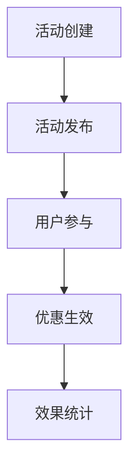

# 营销活动模块

📝 **状态**: 草稿  
📅 **创建日期**: 2025-09-13  
👤 **负责人**: 系统架构师  
🔄 **最后更新**: 2025-09-13  
📋 **版本**: v1.0.0  

## 模块概述

### 主要职责
- **优惠券系统** - 优惠券创建、发放、使用、核销
- **促销活动管理** - 限时抢购、满减优惠、买赠活动
- **营销工具运营** - 拼团、砍价、分享有礼
- **活动分析统计** - 效果统计、ROI分析、用户行为分析

### 业务价值
- **核心价值**: 通过多样化营销活动提升转化率和销售额
- **用户收益**: 享受优惠价格、参与趣味活动、获得实惠
- **系统收益**: 提升销售转化率、增强用户活跃度

### 模块边界
- **包含功能**: 优惠券、促销活动、营销工具、活动分析
- **排除功能**: 会员权益、商品定价、支付处理
- **依赖模块**: 会员系统模块、商品管理模块、订单管理模块
- **被依赖**: 社交功能模块、数据分析模块

## 技术架构

### 核心组件
```
marketing_campaigns/
├── router.py           # API路由定义
├── service.py          # 营销业务逻辑
├── models.py           # 营销数据模型(Campaign, Coupon, Promotion)
├── schemas.py          # 请求/响应数据模型
├── dependencies.py     # 模块依赖注入
└── utils.py            # 营销工具函数(优惠计算、活动规则、统计分析)
│   ├── coupon_controller.py
│   ├── promotion_controller.py
│   └── campaign_controller.py
├── services/          # 业务逻辑层
│   ├── coupon_service.py
│   ├── promotion_service.py
│   └── campaign_service.py
├── models/           # 数据模型层
│   ├── coupon.py
│   ├── promotion.py
│   └── campaign.py
├── repositories/     # 数据访问层
│   ├── coupon_repository.py
│   └── promotion_repository.py
├── schemas/         # 数据验证层
│   ├── coupon_schema.py
│   └── promotion_schema.py
└── utils/          # 工具函数
    └── discount_calculator.py
```

### 技术栈
- **编程语言**: Python 3.11+
- **Web框架**: FastAPI
- **数据库**: MySQL 8.0
- **缓存**: Redis
- **其他依赖**: SQLAlchemy, Celery

## 核心功能

### 功能列表
| 功能名称 | 优先级 | 状态 | 描述 |
|---------|--------|------|------|
| 优惠券系统 | 高 | ⏳ 待开始 | 创建、发放、使用、核销 |
| 促销活动 | 高 | ⏳ 待开始 | 限时抢购、满减等活动 |
| 营销工具 | 中 | ⏳ 待开始 | 拼团、砍价等互动工具 |
| 活动分析 | 中 | ⏳ 待开始 | 效果统计和ROI分析 |

### 核心业务流程


### 业务规则
1. **优惠规则**: 优惠券使用条件、叠加规则、有效期限制
2. **活动规则**: 活动参与条件、库存限制、时间限制
3. **统计规则**: 实时数据统计、效果分析、ROI计算

## 相关文档
- [API接口规范](./api-spec.md)
- [API实施细节](./api-implementation.md)
- [数据模型设计](../../architecture/data-models.md)