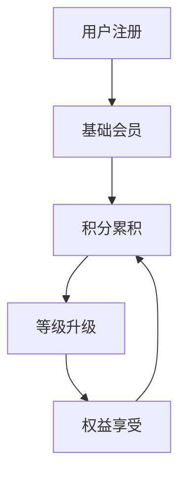

# 会员系统模块

📝 **状态**: 草稿  
📅 **创建日期**: 2025-09-13  
👤 **负责人**: 系统架构师  
🔄 **最后更新**: 2025-09-13  
📋 **版本**: v1.0.0  

## 模块概述

### 主要职责
- **会员等级管理** - 等级体系、升级规则、权益管理
- **积分系统运营** - 积分获得、消费、兑换、有效期管理
- **会员权益提供** - 专享价格、优先发货、专属客服
- **会员营销执行** - 个性化推荐、定向营销、生日特权

### 业务价值
- **核心价值**: 构建会员忠诚度体系，提升用户粘性和复购率
- **用户收益**: 享受专属权益、积分兑换、个性化服务
- **系统收益**: 提升用户生命周期价值和平台竞争力

### 模块边界
- **包含功能**: 会员等级、积分系统、权益管理、会员营销
- **排除功能**: 用户基础认证、支付处理、商品管理
- **依赖模块**: 用户认证模块、订单管理模块、营销活动模块
- **被依赖**: 商品管理模块、订单管理模块、数据分析模块

## 技术架构

### 核心组件
```
member/
├── controllers/        # 控制层
│   ├── member_level_controller.py
│   ├── points_controller.py
│   └── member_benefits_controller.py
├── services/          # 业务逻辑层
│   ├── member_service.py
│   ├── points_service.py
│   └── benefits_service.py
├── models/           # 数据模型层
│   ├── member_level.py
│   ├── points_record.py
│   └── member_benefit.py
├── repositories/     # 数据访问层
│   ├── member_repository.py
│   └── points_repository.py
├── schemas/         # 数据验证层
│   ├── member_schema.py
│   └── points_schema.py
└── utils/          # 工具函数
    └── level_calculator.py
```

### 技术栈
- **编程语言**: Python 3.11+
- **Web框架**: FastAPI
- **数据库**: MySQL 8.0
- **缓存**: Redis
- **其他依赖**: SQLAlchemy, Pydantic

## 核心功能

### 功能列表
| 功能名称 | 优先级 | 状态 | 描述 |
|---------|--------|------|------|
| 会员等级管理 | 高 | ⏳ 待开始 | 等级体系设计和升级规则 |
| 积分系统 | 高 | ⏳ 待开始 | 积分获得、消费、兑换机制 |
| 会员权益 | 中 | ⏳ 待开始 | 专享价格、优先服务等 |
| 会员营销 | 中 | ⏳ 待开始 | 个性化推荐、定向营销 |

### 核心业务流程


### 业务规则
1. **等级规则**: 基于消费金额和积分累积的会员等级体系
2. **积分规则**: 消费获得积分、积分兑换商品、积分有效期管理
3. **权益规则**: 不同等级享受不同权益，权益实时生效

## 相关文档
- [API接口规范](./api-spec.md)
- [API实施细节](./api-implementation.md)
- [数据模型设计](../../architecture/data-models.md)