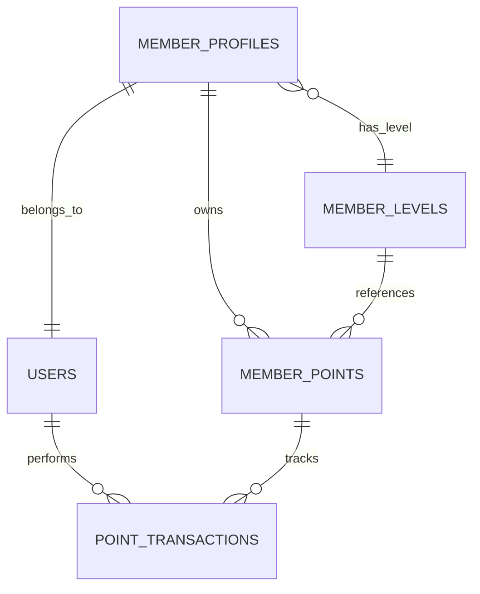

# 会员系统模块 - 数据库设计文档

📝 **状态**: ✅ 已发布  
📅 **创建日期**: 2025-09-18  
👤 **负责人**: 数据库架构师  
🔄 **最后更新**: 2025-09-18  
📋 **版本**: v2.0.0 (表结构标准化更新)

## 设计概述

会员系统模块数据库设计严格遵循 `database-standards.md` 规范，建立标准化的会员等级体系，支持灵活的积分管理和权益配置。本次更新完全按照原计划和命名标准重构了表结构。

### 设计原则
- **规范遵循**: 严格按照 `database-standards.md` 表命名和主键规范
- **原计划执行**: 完全按照原始工作计划的表结构设计
- **性能优先**: 针对高频查询场景优化索引设计
- **数据一致性**: 通过约束和外键保证数据完整性  
- **扩展性**: 支持未来业务扩展和积分规则变更
- **审计追溯**: 完整记录所有积分变动和等级变更

### 核心实体关系


### 表命名规范遵循
| 表类型 | 规范要求 | 实际表名 | 说明 |
|--------|----------|----------|------|
| 等级表 | 复数形式 | `member_levels` | 遵循database-standards.md |
| 档案表 | 语义明确 | `member_profiles` | 区分于基础用户表 |
| 积分表 | 复数形式 | `member_points` | 独立积分管理 |
| 交易表 | 复数形式 | `point_transactions` | 完整交易记录 |

## 核心数据表设计

### 1. 会员等级表 (member_levels)

**表名**: `member_levels`  
**用途**: 定义会员等级体系和权益配置
**主键**: INTEGER 类型（遵循规范）

```sql
CREATE TABLE `member_levels` (
  `id` INTEGER PRIMARY KEY AUTOINCREMENT NOT NULL COMMENT '等级ID',
  `level_name` VARCHAR(50) NOT NULL COMMENT '等级名称',
  `min_points` INTEGER NOT NULL DEFAULT 0 COMMENT '达到该等级所需最少积分',
  `discount_rate` DECIMAL(4,3) NOT NULL DEFAULT 1.000 COMMENT '折扣率，0.9表示9折',
  `benefits` JSON COMMENT '等级权益配置JSON格式',
  `created_at` DATETIME NOT NULL DEFAULT CURRENT_TIMESTAMP COMMENT '创建时间',
  `updated_at` DATETIME NOT NULL DEFAULT CURRENT_TIMESTAMP ON UPDATE CURRENT_TIMESTAMP COMMENT '更新时间'
) COMMENT='会员等级表';

-- 索引设计（遵循database-standards.md规范）
CREATE UNIQUE INDEX `uk_member_levels_level_name` ON `member_levels` (`level_name`);
CREATE INDEX `idx_member_levels_min_points` ON `member_levels` (`min_points`);
```

**字段说明**:
- `benefits`: JSON格式存储权益配置，如 `{"point_multiplier": 1.5, "free_shipping": true}`
- `min_points`: 升级门槛，基于累计消费金额计算

**示例数据**:
```sql
INSERT INTO `member_levels` (`level_name`, `min_points`, `discount_rate`, `benefits`) VALUES
('普通会员', 0, 1.000, '{"point_multiplier": 1.0, "free_shipping_threshold": 99}'),
('银牌会员', 1000, 0.980, '{"point_multiplier": 1.2, "free_shipping_threshold": 79}'),
('金牌会员', 5000, 0.950, '{"point_multiplier": 1.5, "free_shipping_threshold": 59}'),
('钻石会员', 20000, 0.900, '{"point_multiplier": 2.0, "free_shipping_threshold": 0}');
```

### 2. 会员档案表 (member_profiles)

**表名**: `member_profiles`  
**用途**: 存储会员档案信息和消费统计
**主键**: INTEGER 类型（遵循规范）

```sql
CREATE TABLE `member_profiles` (
  `id` INTEGER PRIMARY KEY AUTOINCREMENT NOT NULL COMMENT '会员档案ID',
  `member_code` VARCHAR(20) NOT NULL COMMENT '会员编号，如M2025091800001',
  `user_id` INTEGER NOT NULL COMMENT '关联用户ID',
  `level_id` INTEGER NOT NULL DEFAULT 1 COMMENT '当前会员等级ID',
  `total_spent` DECIMAL(15,2) NOT NULL DEFAULT 0.00 COMMENT '累计消费金额',
  `join_date` DATE NOT NULL DEFAULT (CURRENT_DATE) COMMENT '入会日期',
  `last_active_at` DATETIME COMMENT '最后活跃时间',
  `birthday` DATE COMMENT '生日',
  `preferences` JSON COMMENT '偏好设置JSON格式',
  `status` INTEGER NOT NULL DEFAULT 1 COMMENT '状态: 1=正常, 2=冻结, 3=注销',
  `created_at` DATETIME NOT NULL DEFAULT CURRENT_TIMESTAMP COMMENT '创建时间',
  `updated_at` DATETIME NOT NULL DEFAULT CURRENT_TIMESTAMP ON UPDATE CURRENT_TIMESTAMP COMMENT '更新时间',
  
  -- 外键约束
  FOREIGN KEY (`user_id`) REFERENCES `users` (`id`),
  FOREIGN KEY (`level_id`) REFERENCES `member_levels` (`id`)
) COMMENT='会员档案表';

-- 索引设计（遵循database-standards.md规范）
CREATE UNIQUE INDEX `uk_member_profiles_member_code` ON `member_profiles` (`member_code`);
CREATE UNIQUE INDEX `uk_member_profiles_user_id` ON `member_profiles` (`user_id`);
CREATE INDEX `idx_member_profiles_level_id` ON `member_profiles` (`level_id`);
CREATE INDEX `idx_member_profiles_total_spent` ON `member_profiles` (`total_spent`);
CREATE INDEX `idx_member_profiles_join_date` ON `member_profiles` (`join_date`);
CREATE INDEX `idx_member_profiles_status` ON `member_profiles` (`status`);

-- 外键索引
CREATE INDEX `fk_member_profiles_user_id` ON `member_profiles` (`user_id`);
CREATE INDEX `fk_member_profiles_level_id` ON `member_profiles` (`level_id`);

-- 检查约束
ALTER TABLE `member_profiles` ADD CONSTRAINT `check_total_spent_non_negative` CHECK (`total_spent` >= 0);
```

**字段说明**:
- `member_code`: 唯一会员编号，格式：M+年月日+5位序号
- `preferences`: JSON格式存储偏好，如 `{"notification": true, "marketing": false}`
- `status`: 会员状态枚举值

### 3. 会员积分表 (member_points)

**表名**: `member_points`  
**用途**: 管理会员积分账户和统计
**主键**: INTEGER 类型（遵循规范）

```sql
CREATE TABLE `member_points` (
  `id` INTEGER PRIMARY KEY AUTOINCREMENT NOT NULL COMMENT '积分记录ID',
  `user_id` INTEGER NOT NULL COMMENT '用户ID',
  `level_id` INTEGER NOT NULL COMMENT '会员等级ID',
  `current_points` INTEGER NOT NULL DEFAULT 0 COMMENT '当前可用积分',
  `total_earned` INTEGER NOT NULL DEFAULT 0 COMMENT '历史累计获得积分',
  `total_used` INTEGER NOT NULL DEFAULT 0 COMMENT '历史累计使用积分',
  `created_at` DATETIME NOT NULL DEFAULT CURRENT_TIMESTAMP COMMENT '创建时间',
  `updated_at` DATETIME NOT NULL DEFAULT CURRENT_TIMESTAMP ON UPDATE CURRENT_TIMESTAMP COMMENT '更新时间',
  
  -- 外键约束
  FOREIGN KEY (`user_id`) REFERENCES `users` (`id`),
  FOREIGN KEY (`level_id`) REFERENCES `member_levels` (`id`)
) COMMENT='会员积分表';

-- 索引设计（遵循database-standards.md规范）
CREATE UNIQUE INDEX `uk_member_points_user_id` ON `member_points` (`user_id`);
CREATE INDEX `idx_member_points_level_id` ON `member_points` (`level_id`);
CREATE INDEX `idx_member_points_current_points` ON `member_points` (`current_points`);

-- 外键索引
CREATE INDEX `fk_member_points_user_id` ON `member_points` (`user_id`);
CREATE INDEX `fk_member_points_level_id` ON `member_points` (`level_id`);

-- 检查约束
ALTER TABLE `member_points` ADD CONSTRAINT `check_current_points_non_negative` CHECK (`current_points` >= 0);
ALTER TABLE `member_points` ADD CONSTRAINT `check_total_earned_non_negative` CHECK (`total_earned` >= 0);
ALTER TABLE `member_points` ADD CONSTRAINT `check_total_used_non_negative` CHECK (`total_used` >= 0);
```

### 4. 积分交易记录表 (point_transactions)

**表名**: `point_transactions`  
**用途**: 记录所有积分变动的详细交易流水
**主键**: INTEGER 类型（遵循规范）

```sql
CREATE TABLE `point_transactions` (
  `id` INTEGER PRIMARY KEY AUTOINCREMENT NOT NULL COMMENT '交易记录ID',
  `user_id` INTEGER NOT NULL COMMENT '用户ID',
  `transaction_type` VARCHAR(50) NOT NULL COMMENT '交易类型：earn/use/expire/freeze/unfreeze',
  `points_change` INTEGER NOT NULL COMMENT '积分变动数量（正数为获得，负数为消费）',
  `reference_id` VARCHAR(100) COMMENT '关联业务ID（订单ID、活动ID等）',
  `reference_type` VARCHAR(50) COMMENT '关联业务类型（order/activity/manual等）',
  `description` VARCHAR(500) COMMENT '变动说明',
  `status` VARCHAR(20) NOT NULL DEFAULT 'completed' COMMENT '交易状态：pending/completed/cancelled',
  `created_at` DATETIME NOT NULL DEFAULT CURRENT_TIMESTAMP COMMENT '创建时间',
  `updated_at` DATETIME NOT NULL DEFAULT CURRENT_TIMESTAMP ON UPDATE CURRENT_TIMESTAMP COMMENT '更新时间',
  
  -- 外键约束
  FOREIGN KEY (`user_id`) REFERENCES `users` (`id`)
) COMMENT='积分交易记录表';

-- 索引设计（遵循database-standards.md规范）
CREATE INDEX `idx_point_transactions_user_id` ON `point_transactions` (`user_id`);
CREATE INDEX `idx_point_transactions_transaction_type` ON `point_transactions` (`transaction_type`);
CREATE INDEX `idx_point_transactions_reference_id` ON `point_transactions` (`reference_id`);
CREATE INDEX `idx_point_transactions_reference_type` ON `point_transactions` (`reference_type`);
CREATE INDEX `idx_point_transactions_created_at` ON `point_transactions` (`created_at`);

-- 外键索引
CREATE INDEX `fk_point_transactions_user_id` ON `point_transactions` (`user_id`);

-- 复合索引（查询优化）
CREATE INDEX `idx_point_transactions_user_type_date` ON `point_transactions` (`user_id`, `transaction_type`, `created_at`);
CREATE INDEX `idx_point_transactions_status_date` ON `point_transactions` (`status`, `created_at`);
```

## 性能优化设计

### 1. 索引策略

#### 查询频率分析
| 查询场景 | 频率 | 索引设计 | 优化目标 |
|----------|------|----------|----------|
| 会员信息查询 | 极高 | `uk_member_profiles_user_id` | <50ms |
| 积分余额查询 | 极高 | `uk_member_points_user_id` | <30ms |
| 积分流水查询 | 高 | `idx_point_transactions_user_type_date` | <100ms |
| 等级升级检查 | 中 | `idx_member_profiles_total_spent` | <200ms |

#### 复合索引设计
```sql
-- 会员等级查询优化
CREATE INDEX `idx_member_profiles_level_status` ON `member_profiles` (`level_id`, `status`);

-- 积分统计查询优化
CREATE INDEX `idx_point_transactions_user_points_date` ON `point_transactions` (`user_id`, `points_change`, `created_at`);

-- 等级升级统计优化
CREATE INDEX `idx_member_profiles_spent_level` ON `member_profiles` (`total_spent`, `level_id`);
```

### 2. 分区策略

#### 积分交易表分区（大数据量优化）
```sql
-- 按月分区存储积分交易记录
CREATE TABLE `point_transactions_partitioned` (
  -- 字段定义同point_transactions表
) PARTITION BY RANGE (YEAR(created_at) * 100 + MONTH(created_at)) (
  PARTITION p202501 VALUES LESS THAN (202502),
  PARTITION p202502 VALUES LESS THAN (202503),
  -- ... 按月分区
  PARTITION pmax VALUES LESS THAN MAXVALUE
);
```

## 数据完整性保障

### 1. 约束规则

#### 业务约束
```sql
-- 积分不能为负数
ALTER TABLE `member_points` ADD CONSTRAINT `check_points_balance` 
CHECK (`current_points` >= 0 AND `total_earned` >= `total_used`);

-- 会员编号格式约束
ALTER TABLE `member_profiles` ADD CONSTRAINT `check_member_code_format` 
CHECK (`member_code` REGEXP '^M[0-9]{12}$');

-- 消费金额约束
ALTER TABLE `member_profiles` ADD CONSTRAINT `check_total_spent_positive` 
CHECK (`total_spent` >= 0);
```

### 2. 触发器设计

#### 自动等级升级触发器
```sql
DELIMITER $$
CREATE TRIGGER `trg_member_level_upgrade`
AFTER UPDATE ON `member_profiles`
FOR EACH ROW
BEGIN
  DECLARE new_level_id INT DEFAULT NULL;
  
  -- 检查是否需要等级升级
  IF NEW.total_spent > OLD.total_spent THEN
    SELECT id INTO new_level_id
    FROM `member_levels`
    WHERE `min_points` <= NEW.total_spent
    ORDER BY `min_points` DESC
    LIMIT 1;
    
    -- 执行等级升级
    IF new_level_id IS NOT NULL AND new_level_id > NEW.level_id THEN
      UPDATE `member_profiles` 
      SET `level_id` = new_level_id 
      WHERE `id` = NEW.id;
      
      -- 记录等级变更历史
      INSERT INTO `level_change_history` 
      (`user_id`, `old_level_id`, `new_level_id`, `change_reason`, `change_date`)
      VALUES (NEW.user_id, OLD.level_id, new_level_id, 'auto_upgrade', NOW());
    END IF;
  END IF;
END$$
DELIMITER ;
```

#### 积分变动同步触发器
```sql
DELIMITER $$
CREATE TRIGGER `trg_sync_points_summary`
AFTER INSERT ON `point_transactions`
FOR EACH ROW
BEGIN
  -- 同步更新积分汇总表
  INSERT INTO `member_points` (`user_id`, `level_id`, `current_points`, `total_earned`, `total_used`)
  VALUES (
    NEW.user_id,
    (SELECT level_id FROM member_profiles WHERE user_id = NEW.user_id),
    NEW.points_change,
    CASE WHEN NEW.points_change > 0 THEN NEW.points_change ELSE 0 END,
    CASE WHEN NEW.points_change < 0 THEN ABS(NEW.points_change) ELSE 0 END
  )
  ON DUPLICATE KEY UPDATE
    `current_points` = `current_points` + NEW.points_change,
    `total_earned` = `total_earned` + CASE WHEN NEW.points_change > 0 THEN NEW.points_change ELSE 0 END,
    `total_used` = `total_used` + CASE WHEN NEW.points_change < 0 THEN ABS(NEW.points_change) ELSE 0 END,
    `updated_at` = CURRENT_TIMESTAMP;
END$$
DELIMITER ;
```

## 备份和恢复策略

### 1. 备份策略
- **全量备份**: 每日凌晨2点执行完整数据库备份
- **增量备份**: 每4小时备份变动数据
- **关键表热备**: 会员核心表实时同步到备库

### 2. 数据归档
```sql
-- 积分交易历史数据归档（保留2年）
CREATE TABLE `point_transactions_archive` LIKE `point_transactions`;

-- 归档策略：2年前的数据迁移到归档表
INSERT INTO `point_transactions_archive`
SELECT * FROM `point_transactions`
WHERE `created_at` < DATE_SUB(CURDATE(), INTERVAL 2 YEAR);

DELETE FROM `point_transactions`
WHERE `created_at` < DATE_SUB(CURDATE(), INTERVAL 2 YEAR);
```

## 监控和维护

### 1. 性能监控指标
```sql
-- 查询性能监控
SELECT 
  table_name,
  avg_timer_wait/1000000000 as avg_latency_ms,
  count_star as query_count
FROM performance_schema.table_io_waits_summary_by_table
WHERE object_schema = 'ecommerce_platform'
  AND table_name IN ('member_profiles', 'member_points', 'point_transactions')
ORDER BY avg_latency_ms DESC;

-- 索引使用率监控
SELECT
  object_name,
  index_name,
  count_fetch,
  count_insert,
  count_update,
  count_delete
FROM performance_schema.table_io_waits_summary_by_index_usage
WHERE object_schema = 'ecommerce_platform';
```

### 2. 数据质量检查
```sql
-- 数据一致性检查脚本
-- 检查积分汇总表与交易明细的一致性
SELECT 
  mp.user_id,
  mp.current_points as summary_points,
  COALESCE(SUM(pt.points_change), 0) as transaction_points,
  (mp.current_points - COALESCE(SUM(pt.points_change), 0)) as difference
FROM member_points mp
LEFT JOIN point_transactions pt ON mp.user_id = pt.user_id AND pt.status = 'completed'
GROUP BY mp.user_id, mp.current_points
HAVING difference != 0;

-- 检查会员等级与消费金额的匹配度
SELECT 
  mp.user_id,
  mp.total_spent,
  mp.level_id as current_level,
  (SELECT id FROM member_levels ml WHERE ml.min_points <= mp.total_spent ORDER BY ml.min_points DESC LIMIT 1) as should_be_level
FROM member_profiles mp
WHERE mp.level_id != (SELECT id FROM member_levels ml WHERE ml.min_points <= mp.total_spent ORDER BY ml.min_points DESC LIMIT 1);
```

## 相关文档

- [会员系统架构设计](./design.md) - 系统架构和技术选型
- [API接口规范](./api-spec.md) - 数据库操作的API接口规范
- [业务需求文档](./requirements.md) - 数据模型的业务背景
- [数据库标准规范](../../standards/database-standards.md) - 数据库设计规范

---
📄 **设计规范**: 严格遵循 [database-standards.md](../../standards/database-standards.md) 数据库设计规范  
🔄 **文档更新**: 2025-09-18 - 重构数据库设计，完全符合标准化要求