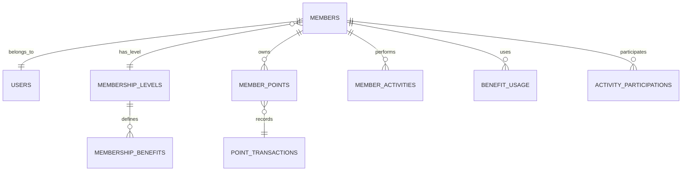

# 会员系统模块 - 数据库设计文档

📅 **创建日期**: 2024-09-17  
👤 **设计者**: 数据库架构师  
✅ **评审状态**: 设计中  
🔄 **最后更新**: 2024-09-17  

## 设计概述

### 架构规范遵循
**严格遵循** `docs/standards/database-standards.md` 技术规范：
- **主键统一标准**: 所有表主键使用 `int` (INTEGER AUTO_INCREMENT)
- **外键命名规范**: 格式为 `{表名}_id`，类型与对应主键保持一致
- **索引命名规范**: 遵循 `idx_{表名}_{字段名}` 命名模式
- **时间戳字段**: 使用 `created_at`、`updated_at` 标准字段

### 设计原则
- **数据一致性**: 确保会员信息、积分、等级数据的强一致性
- **性能优化**: 合理建立索引，支持高并发查询
- **扩展性**: 支持未来业务扩展，如新增权益类型、活动类型
- **数据完整性**: 建立完整的约束和外键关系
- **审计追溯**: 记录关键操作的完整日志

### 核心实体关系


## 数据表设计

### 1. 会员基础信息表 (members)

**表名**: `members`  
**描述**: 存储会员的基础信息和当前状态

```sql
CREATE TABLE `members` (
  `id` int NOT NULL AUTO_INCREMENT COMMENT '会员ID',
  `member_code` varchar(20) NOT NULL COMMENT '会员编号，如M202409170001',
  `user_id` int NOT NULL COMMENT '关联用户ID',
  `level_id` int NOT NULL DEFAULT 1 COMMENT '当前会员等级ID',
  `total_spent` decimal(15,2) NOT NULL DEFAULT 0.00 COMMENT '累计消费金额',
  `total_points` int NOT NULL DEFAULT 0 COMMENT '历史累计获得积分',
  `available_points` int NOT NULL DEFAULT 0 COMMENT '当前可用积分',
  `frozen_points` int NOT NULL DEFAULT 0 COMMENT '冻结积分',
  `join_date` date NOT NULL COMMENT '入会日期',
  `last_active_at` datetime DEFAULT NULL COMMENT '最后活跃时间',
  `birthday` date DEFAULT NULL COMMENT '生日',
  `preferences` json DEFAULT NULL COMMENT '偏好设置(通知、营销等)',
  `status` tinyint NOT NULL DEFAULT 1 COMMENT '状态: 1=正常, 2=冻结, 3=注销',
  `created_at` datetime NOT NULL DEFAULT CURRENT_TIMESTAMP COMMENT '创建时间',
  `updated_at` datetime NOT NULL DEFAULT CURRENT_TIMESTAMP ON UPDATE CURRENT_TIMESTAMP COMMENT '更新时间',
  PRIMARY KEY (`id`),
  UNIQUE KEY `uk_member_code` (`member_code`),
  UNIQUE KEY `uk_user_id` (`user_id`),
  KEY `idx_level_id` (`level_id`),
  KEY `idx_total_spent` (`total_spent`),
  KEY `idx_join_date` (`join_date`),
  KEY `idx_status` (`status`),
  CONSTRAINT `fk_members_level_id` FOREIGN KEY (`level_id`) REFERENCES `membership_levels` (`id`)
) ENGINE=InnoDB DEFAULT CHARSET=utf8mb4 COLLATE=utf8mb4_unicode_ci COMMENT='会员基础信息表';
```

**字段说明**:
- `member_code`: 唯一会员编号，格式为M+年月日+序号
- `preferences`: JSON格式存储用户偏好，如 `{"notification_email": true, "marketing_consent": false}`
- `status`: 会员状态，支持正常、冻结、注销三种状态

### 2. 会员等级表 (membership_levels)

**表名**: `membership_levels`  
**描述**: 定义会员等级体系和基础权益

```sql
CREATE TABLE `membership_levels` (
  `id` int NOT NULL AUTO_INCREMENT COMMENT '等级ID',
  `level_name` varchar(50) NOT NULL COMMENT '等级名称',
  `level_code` varchar(20) NOT NULL COMMENT '等级代码',
  `required_spent` decimal(15,2) NOT NULL DEFAULT 0.00 COMMENT '达到该等级所需累计消费',
  `discount_rate` decimal(4,3) NOT NULL DEFAULT 1.000 COMMENT '折扣率，0.9表示9折',
  `point_multiplier` decimal(4,2) NOT NULL DEFAULT 1.00 COMMENT '积分倍率',
  `level_order` int NOT NULL COMMENT '等级排序，数字越大等级越高',
  `description` text DEFAULT NULL COMMENT '等级描述',
  `benefits` json DEFAULT NULL COMMENT '等级基础权益配置',
  `is_active` tinyint NOT NULL DEFAULT 1 COMMENT '是否激活: 1=是, 0=否',
  `created_at` datetime NOT NULL DEFAULT CURRENT_TIMESTAMP COMMENT '创建时间',
  `updated_at` datetime NOT NULL DEFAULT CURRENT_TIMESTAMP ON UPDATE CURRENT_TIMESTAMP COMMENT '更新时间',
  PRIMARY KEY (`id`),
  UNIQUE KEY `uk_level_code` (`level_code`),
  KEY `idx_level_order` (`level_order`),
  KEY `idx_required_spent` (`required_spent`)
) ENGINE=InnoDB DEFAULT CHARSET=utf8mb4 COLLATE=utf8mb4_unicode_ci COMMENT='会员等级表';
```

**初始数据**:
```sql
INSERT INTO `membership_levels` VALUES 
(1, '注册会员', 'BASIC', 0.00, 1.000, 1.00, 1, '注册即可享受的基础会员权益', '{"free_shipping": false, "birthday_gift": false, "priority_service": false}', 1, NOW(), NOW()),
(2, '铜牌会员', 'BRONZE', 500.00, 0.950, 1.00, 2, '消费满500元自动升级', '{"free_shipping": false, "birthday_gift": true, "priority_service": false}', 1, NOW(), NOW()),
(3, '银牌会员', 'SILVER', 2000.00, 0.900, 1.00, 3, '消费满2000元自动升级', '{"free_shipping": true, "birthday_gift": true, "priority_service": false}', 1, NOW(), NOW()),
(4, '金牌会员', 'GOLD', 5000.00, 0.850, 1.00, 4, '消费满5000元自动升级', '{"free_shipping": true, "birthday_gift": true, "priority_service": true}', 1, NOW(), NOW()),
(5, '钻石会员', 'DIAMOND', 10000.00, 0.800, 2.00, 5, '消费满10000元自动升级', '{"free_shipping": true, "birthday_gift": true, "priority_service": true, "exclusive_events": true}', 1, NOW(), NOW());
```

### 3. 会员权益表 (membership_benefits)

**表名**: `membership_benefits`  
**描述**: 定义详细的会员权益配置

```sql
CREATE TABLE `membership_benefits` (
  `id` int NOT NULL AUTO_INCREMENT COMMENT '权益ID',
  `benefit_code` varchar(50) NOT NULL COMMENT '权益代码',
  `benefit_name` varchar(100) NOT NULL COMMENT '权益名称',
  `benefit_type` varchar(30) NOT NULL COMMENT '权益类型',
  `level_id` int NOT NULL COMMENT '适用等级ID',
  `benefit_value` decimal(10,4) DEFAULT NULL COMMENT '权益数值',
  `usage_limit` int DEFAULT NULL COMMENT '使用次数限制，NULL为无限制',
  `valid_period` int DEFAULT NULL COMMENT '有效期(天)，NULL为永久有效',
  `description` text DEFAULT NULL COMMENT '权益描述',
  `config` json DEFAULT NULL COMMENT '权益配置参数',
  `is_active` tinyint NOT NULL DEFAULT 1 COMMENT '是否激活',
  `created_at` datetime NOT NULL DEFAULT CURRENT_TIMESTAMP COMMENT '创建时间',
  `updated_at` datetime NOT NULL DEFAULT CURRENT_TIMESTAMP ON UPDATE CURRENT_TIMESTAMP COMMENT '更新时间',
  PRIMARY KEY (`id`),
  UNIQUE KEY `uk_benefit_level` (`benefit_code`, `level_id`),
  KEY `idx_level_id` (`level_id`),
  KEY `idx_benefit_type` (`benefit_type`),
  CONSTRAINT `fk_benefits_level_id` FOREIGN KEY (`level_id`) REFERENCES `membership_levels` (`id`)
) ENGINE=InnoDB DEFAULT CHARSET=utf8mb4 COLLATE=utf8mb4_unicode_ci COMMENT='会员权益表';
```

**权益类型枚举**:
- `DISCOUNT`: 折扣权益
- `FREE_SHIPPING`: 免邮权益  
- `POINTS_MULTIPLIER`: 积分倍率
- `BIRTHDAY_GIFT`: 生日礼品
- `PRIORITY_SERVICE`: 优先客服
- `EXCLUSIVE_EVENT`: 专属活动

### 4. 积分交易记录表 (point_transactions)

**表名**: `point_transactions`  
**描述**: 记录所有积分的收入和支出明细

```sql
CREATE TABLE `point_transactions` (
  `id` int NOT NULL AUTO_INCREMENT COMMENT '交易ID',
  `transaction_code` varchar(30) NOT NULL COMMENT '交易编号',
  `member_id` int NOT NULL COMMENT '会员ID',
  `transaction_type` varchar(20) NOT NULL COMMENT '交易类型: EARN=获得, USE=使用, EXPIRE=过期, FREEZE=冻结, UNFREEZE=解冻',
  `event_type` varchar(30) NOT NULL COMMENT '事件类型: PURCHASE, REVIEW, CHECKIN, BIRTHDAY, REDEMPTION, REFUND等',
  `points` int NOT NULL COMMENT '积分数量，正数为获得，负数为支出',
  `balance_after` int NOT NULL COMMENT '交易后余额',
  `description` varchar(200) NOT NULL COMMENT '交易描述',
  `related_order_id` varchar(50) DEFAULT NULL COMMENT '关联订单号',
  `related_data` json DEFAULT NULL COMMENT '相关数据',
  `expiry_date` date DEFAULT NULL COMMENT '积分过期日期',
  `operator_id` int DEFAULT NULL COMMENT '操作人ID(系统操作为NULL)',
  `operator_type` varchar(20) DEFAULT 'SYSTEM' COMMENT '操作类型: SYSTEM=系统, USER=用户, ADMIN=管理员',
  `created_at` datetime NOT NULL DEFAULT CURRENT_TIMESTAMP COMMENT '创建时间',
  PRIMARY KEY (`id`),
  UNIQUE KEY `uk_transaction_code` (`transaction_code`),
  KEY `idx_member_id` (`member_id`),
  KEY `idx_transaction_type` (`transaction_type`),
  KEY `idx_event_type` (`event_type`),
  KEY `idx_created_at` (`created_at`),
  KEY `idx_expiry_date` (`expiry_date`),
  KEY `idx_related_order` (`related_order_id`),
  CONSTRAINT `fk_point_transactions_member_id` FOREIGN KEY (`member_id`) REFERENCES `members` (`id`)
) ENGINE=InnoDB DEFAULT CHARSET=utf8mb4 COLLATE=utf8mb4_unicode_ci COMMENT='积分交易记录表';
```

**分表策略**: 按月分表 `point_transactions_YYYYMM`，提高查询性能

### 5. 会员行为记录表 (member_activities)

**表名**: `member_activities`  
**描述**: 记录会员的各种行为轨迹

```sql
CREATE TABLE `member_activities` (
  `id` int NOT NULL AUTO_INCREMENT COMMENT '活动ID',
  `member_id` int NOT NULL COMMENT '会员ID',
  `activity_type` varchar(50) NOT NULL COMMENT '活动类型',
  `activity_data` json NOT NULL COMMENT '活动数据',
  `ip_address` varchar(45) DEFAULT NULL COMMENT 'IP地址',
  `user_agent` text DEFAULT NULL COMMENT '用户代理',
  `session_id` varchar(128) DEFAULT NULL COMMENT '会话ID',
  `created_at` datetime NOT NULL DEFAULT CURRENT_TIMESTAMP COMMENT '创建时间',
  PRIMARY KEY (`id`),
  KEY `idx_member_id` (`member_id`),
  KEY `idx_activity_type` (`activity_type`),
  KEY `idx_created_at` (`created_at`),
  CONSTRAINT `fk_member_activities_member_id` FOREIGN KEY (`member_id`) REFERENCES `members` (`id`)
) ENGINE=InnoDB DEFAULT CHARSET=utf8mb4 COLLATE=utf8mb4_unicode_ci COMMENT='会员行为记录表';
```

**活动类型示例**:
- `LOGIN`: 登录
- `VIEW_PRODUCT`: 浏览商品
- `ADD_TO_CART`: 加入购物车
- `PLACE_ORDER`: 下单
- `MAKE_PAYMENT`: 支付
- `WRITE_REVIEW`: 写评价
- `CHECKIN`: 签到
- `REDEEM_POINTS`: 积分兑换

### 6. 权益使用记录表 (benefit_usage)

**表名**: `benefit_usage`  
**描述**: 记录会员权益的使用情况

```sql
CREATE TABLE `benefit_usage` (
  `id` int NOT NULL AUTO_INCREMENT COMMENT '使用记录ID',
  `usage_code` varchar(30) NOT NULL COMMENT '使用编号',
  `member_id` int NOT NULL COMMENT '会员ID',
  `benefit_id` int NOT NULL COMMENT '权益ID',
  `order_id` varchar(50) DEFAULT NULL COMMENT '关联订单号',
  `usage_value` decimal(10,4) DEFAULT NULL COMMENT '使用价值',
  `discount_amount` decimal(10,2) DEFAULT NULL COMMENT '优惠金额',
  `usage_context` json DEFAULT NULL COMMENT '使用上下文数据',
  `status` varchar(20) NOT NULL DEFAULT 'USED' COMMENT '状态: USED=已使用, CANCELLED=已取消',
  `created_at` datetime NOT NULL DEFAULT CURRENT_TIMESTAMP COMMENT '使用时间',
  `cancelled_at` datetime DEFAULT NULL COMMENT '取消时间',
  PRIMARY KEY (`id`),
  UNIQUE KEY `uk_usage_code` (`usage_code`),
  KEY `idx_member_id` (`member_id`),
  KEY `idx_benefit_id` (`benefit_id`),
  KEY `idx_order_id` (`order_id`),
  KEY `idx_created_at` (`created_at`),
  CONSTRAINT `fk_benefit_usage_member_id` FOREIGN KEY (`member_id`) REFERENCES `members` (`id`),
  CONSTRAINT `fk_benefit_usage_benefit_id` FOREIGN KEY (`benefit_id`) REFERENCES `membership_benefits` (`id`)
) ENGINE=InnoDB DEFAULT CHARSET=utf8mb4 COLLATE=utf8mb4_unicode_ci COMMENT='权益使用记录表';
```

### 7. 会员活动表 (member_events)

**表名**: `member_events`  
**描述**: 定义面向会员的专属活动

```sql
CREATE TABLE `member_events` (
  `id` int NOT NULL AUTO_INCREMENT COMMENT '活动ID',
  `event_code` varchar(30) NOT NULL COMMENT '活动代码',
  `event_title` varchar(200) NOT NULL COMMENT '活动标题',
  `event_description` text DEFAULT NULL COMMENT '活动描述',
  `event_type` varchar(30) NOT NULL COMMENT '活动类型',
  `min_level_id` int NOT NULL DEFAULT 1 COMMENT '最低参与等级',
  `max_participants` int DEFAULT NULL COMMENT '最大参与人数',
  `current_participants` int NOT NULL DEFAULT 0 COMMENT '当前参与人数',
  `start_time` datetime NOT NULL COMMENT '活动开始时间',
  `end_time` datetime NOT NULL COMMENT '活动结束时间',
  `rules` json DEFAULT NULL COMMENT '活动规则配置',
  `rewards` json DEFAULT NULL COMMENT '活动奖励配置',
  `status` varchar(20) NOT NULL DEFAULT 'DRAFT' COMMENT '状态: DRAFT=草稿, ACTIVE=进行中, ENDED=已结束, CANCELLED=已取消',
  `created_by` int NOT NULL COMMENT '创建人ID',
  `created_at` datetime NOT NULL DEFAULT CURRENT_TIMESTAMP COMMENT '创建时间',
  `updated_at` datetime NOT NULL DEFAULT CURRENT_TIMESTAMP ON UPDATE CURRENT_TIMESTAMP COMMENT '更新时间',
  PRIMARY KEY (`id`),
  UNIQUE KEY `uk_event_code` (`event_code`),
  KEY `idx_min_level_id` (`min_level_id`),
  KEY `idx_start_end_time` (`start_time`, `end_time`),
  KEY `idx_status` (`status`),
  CONSTRAINT `fk_member_events_min_level_id` FOREIGN KEY (`min_level_id`) REFERENCES `membership_levels` (`id`)
) ENGINE=InnoDB DEFAULT CHARSET=utf8mb4 COLLATE=utf8mb4_unicode_ci COMMENT='会员活动表';
```

### 8. 活动参与记录表 (event_participations)

**表名**: `event_participations`  
**描述**: 记录会员参与活动的情况

```sql
CREATE TABLE `event_participations` (
  `id` int NOT NULL AUTO_INCREMENT COMMENT '参与记录ID',
  `participation_code` varchar(30) NOT NULL COMMENT '参与编号',
  `member_id` int NOT NULL COMMENT '会员ID',
  `event_id` int NOT NULL COMMENT '活动ID',
  `participation_data` json DEFAULT NULL COMMENT '参与数据',
  `rewards_received` json DEFAULT NULL COMMENT '已获得奖励',
  `participation_time` datetime NOT NULL DEFAULT CURRENT_TIMESTAMP COMMENT '参与时间',
  `completion_time` datetime DEFAULT NULL COMMENT '完成时间',
  `status` varchar(20) NOT NULL DEFAULT 'ACTIVE' COMMENT '状态: ACTIVE=进行中, COMPLETED=已完成, CANCELLED=已取消',
  PRIMARY KEY (`id`),
  UNIQUE KEY `uk_participation_code` (`participation_code`),
  UNIQUE KEY `uk_member_event` (`member_id`, `event_id`),
  KEY `idx_event_id` (`event_id`),
  KEY `idx_participation_time` (`participation_time`),
  KEY `idx_status` (`status`),
  CONSTRAINT `fk_event_participations_member_id` FOREIGN KEY (`member_id`) REFERENCES `members` (`id`),
  CONSTRAINT `fk_event_participations_event_id` FOREIGN KEY (`event_id`) REFERENCES `member_events` (`id`)
) ENGINE=InnoDB DEFAULT CHARSET=utf8mb4 COLLATE=utf8mb4_unicode_ci COMMENT='活动参与记录表';
```

### 9. 等级变更记录表 (level_changes)

**表名**: `level_changes`  
**描述**: 记录会员等级变更历史

```sql
CREATE TABLE `level_changes` (
  `id` int NOT NULL AUTO_INCREMENT COMMENT '变更记录ID',
  `member_id` int NOT NULL COMMENT '会员ID',
  `old_level_id` int NOT NULL COMMENT '原等级ID',
  `new_level_id` int NOT NULL COMMENT '新等级ID',
  `change_reason` varchar(100) NOT NULL COMMENT '变更原因',
  `change_type` varchar(20) NOT NULL COMMENT '变更类型: AUTO=自动, MANUAL=手动',
  `related_spent` decimal(15,2) DEFAULT NULL COMMENT '相关消费金额',
  `operator_id` int DEFAULT NULL COMMENT '操作人ID',
  `created_at` datetime NOT NULL DEFAULT CURRENT_TIMESTAMP COMMENT '变更时间',
  PRIMARY KEY (`id`),
  KEY `idx_member_id` (`member_id`),
  KEY `idx_change_type` (`change_type`),
  KEY `idx_created_at` (`created_at`),
  CONSTRAINT `fk_level_changes_member_id` FOREIGN KEY (`member_id`) REFERENCES `members` (`id`),
  CONSTRAINT `fk_level_changes_old_level` FOREIGN KEY (`old_level_id`) REFERENCES `membership_levels` (`id`),
  CONSTRAINT `fk_level_changes_new_level` FOREIGN KEY (`new_level_id`) REFERENCES `membership_levels` (`id`)
) ENGINE=InnoDB DEFAULT CHARSET=utf8mb4 COLLATE=utf8mb4_unicode_ci COMMENT='等级变更记录表';
```

## 索引优化策略

### 主要查询场景分析

1. **会员信息查询**: 根据user_id查询会员信息（高频）
2. **积分明细查询**: 根据member_id和时间范围查询（高频）
3. **等级统计**: 按等级统计会员数量和消费（中频）
4. **权益使用统计**: 按权益类型统计使用情况（低频）

### 复合索引设计

```sql
-- 会员表优化索引
ALTER TABLE `members` ADD INDEX `idx_level_status` (`level_id`, `status`);
ALTER TABLE `members` ADD INDEX `idx_spent_level` (`total_spent`, `level_id`);

-- 积分交易表优化索引
ALTER TABLE `point_transactions` ADD INDEX `idx_member_type_time` (`member_id`, `transaction_type`, `created_at`);
ALTER TABLE `point_transactions` ADD INDEX `idx_event_time` (`event_type`, `created_at`);

-- 权益使用表优化索引
ALTER TABLE `benefit_usage` ADD INDEX `idx_benefit_member_time` (`benefit_id`, `member_id`, `created_at`);

-- 会员活动表优化索引
ALTER TABLE `member_activities` ADD INDEX `idx_member_type_time` (`member_id`, `activity_type`, `created_at`);
```

## 数据完整性约束

### 触发器设计

#### 1. 积分余额更新触发器
```sql
DELIMITER $$
CREATE TRIGGER `tr_point_transactions_after_insert`
AFTER INSERT ON `point_transactions`
FOR EACH ROW
BEGIN
    UPDATE `members` 
    SET 
        `available_points` = NEW.balance_after,
        `total_points` = CASE 
            WHEN NEW.points > 0 THEN `total_points` + NEW.points 
            ELSE `total_points` 
        END,
        `updated_at` = NOW()
    WHERE `id` = NEW.member_id;
END$$
DELIMITER ;
```

#### 2. 等级自动升级触发器
```sql
DELIMITER $$
CREATE TRIGGER `tr_members_level_upgrade`
BEFORE UPDATE ON `members`
FOR EACH ROW
BEGIN
    DECLARE new_level_id INT DEFAULT OLD.level_id;
    
    -- 根据消费金额计算应该的等级
    SELECT `id` INTO new_level_id
    FROM `membership_levels`
    WHERE `required_spent` <= NEW.total_spent
        AND `is_active` = 1
    ORDER BY `required_spent` DESC
    LIMIT 1;
    
    -- 如果等级发生变化，更新等级并记录变更
    IF new_level_id != OLD.level_id THEN
        SET NEW.level_id = new_level_id;
        
        INSERT INTO `level_changes` (
            `member_id`, `old_level_id`, `new_level_id`, 
            `change_reason`, `change_type`, `related_spent`
        ) VALUES (
            NEW.id, OLD.level_id, new_level_id,
            '消费金额达到升级条件', 'AUTO', NEW.total_spent
        );
    END IF;
END$$
DELIMITER ;
```

### 检查约束
```sql
-- 积分相关约束
ALTER TABLE `members` ADD CONSTRAINT `chk_points_non_negative` 
CHECK (`available_points` >= 0 AND `frozen_points` >= 0);

-- 等级相关约束
ALTER TABLE `membership_levels` ADD CONSTRAINT `chk_discount_rate_valid` 
CHECK (`discount_rate` > 0 AND `discount_rate` <= 1);

-- 消费金额约束
ALTER TABLE `members` ADD CONSTRAINT `chk_total_spent_non_negative` 
CHECK (`total_spent` >= 0);
```

## 数据分区策略

### 时间分区
对于大数据量的历史表，采用时间分区策略：

```sql
-- 积分交易表按月分区
ALTER TABLE `point_transactions` 
PARTITION BY RANGE (YEAR(created_at) * 100 + MONTH(created_at)) (
    PARTITION p202409 VALUES LESS THAN (202410),
    PARTITION p202410 VALUES LESS THAN (202411),
    PARTITION p202411 VALUES LESS THAN (202412),
    PARTITION p202412 VALUES LESS THAN (202501),
    PARTITION p_future VALUES LESS THAN MAXVALUE
);

-- 会员行为表按月分区  
ALTER TABLE `member_activities`
PARTITION BY RANGE (YEAR(created_at) * 100 + MONTH(created_at)) (
    PARTITION p202409 VALUES LESS THAN (202410),
    PARTITION p202410 VALUES LESS THAN (202411),
    PARTITION p202411 VALUES LESS THAN (202412),
    PARTITION p202412 VALUES LESS THAN (202501),
    PARTITION p_future VALUES LESS THAN MAXVALUE
);
```

## 性能优化建议

### 查询优化
1. **避免SELECT \***: 明确指定需要的字段
2. **合理使用LIMIT**: 分页查询避免大结果集
3. **善用覆盖索引**: 减少回表操作
4. **批量操作**: 积分批量发放使用事务批处理

### 缓存策略
1. **会员基础信息**: Redis缓存，key格式`member:info:{member_id}`，TTL 1小时
2. **积分余额**: Redis缓存，key格式`member:points:{member_id}`，TTL 5分钟
3. **等级信息**: Redis缓存，key格式`member:levels:all`，TTL 1天
4. **权益列表**: Redis缓存，key格式`member:benefits:{level_id}`，TTL 30分钟

### 归档策略
1. **积分交易记录**: 保留2年活跃数据，超过2年的数据归档到历史表
2. **会员行为记录**: 保留1年活跃数据，超过1年的数据归档
3. **权益使用记录**: 保留3年完整数据用于审计

## 数据迁移脚本

### Alembic迁移文件示例
```python
# migrations/versions/001_create_member_system_tables.py
"""Create member system tables

Revision ID: 001_member_system
Revises: 
Create Date: 2024-09-17 10:00:00.000000

"""
from alembic import op
import sqlalchemy as sa
from sqlalchemy.dialects import mysql

# revision identifiers
revision = '001_member_system'
down_revision = None
branch_labels = None
depends_on = None

def upgrade():
    # 创建会员等级表
    op.create_table('membership_levels',
        sa.Column('id', sa.Integer(), nullable=False),
        sa.Column('level_name', sa.String(50), nullable=False),
        sa.Column('level_code', sa.String(20), nullable=False),
        sa.Column('required_spent', sa.Decimal(15,2), nullable=False, default=0.00),
        sa.Column('discount_rate', sa.Decimal(4,3), nullable=False, default=1.000),
        sa.Column('point_multiplier', sa.Decimal(4,2), nullable=False, default=1.00),
        sa.Column('level_order', sa.Integer(), nullable=False),
        sa.Column('description', sa.Text(), nullable=True),
        sa.Column('benefits', sa.JSON(), nullable=True),
        sa.Column('is_active', sa.Boolean(), nullable=False, default=True),
        sa.Column('created_at', sa.DateTime(), nullable=False, server_default=sa.text('CURRENT_TIMESTAMP')),
        sa.Column('updated_at', sa.DateTime(), nullable=False, server_default=sa.text('CURRENT_TIMESTAMP ON UPDATE CURRENT_TIMESTAMP')),
        sa.PrimaryKeyConstraint('id'),
        sa.UniqueConstraint('level_code'),
        mysql_engine='InnoDB',
        mysql_charset='utf8mb4',
        mysql_collate='utf8mb4_unicode_ci',
        comment='会员等级表'
    )
    
    # 创建会员基础信息表
    op.create_table('members',
        sa.Column('id', sa.Integer(), nullable=False),
        sa.Column('member_code', sa.String(20), nullable=False),
        sa.Column('user_id', sa.Integer(), nullable=False),
        sa.Column('level_id', sa.Integer(), nullable=False, default=1),
        sa.Column('total_spent', sa.Decimal(15,2), nullable=False, default=0.00),
        sa.Column('total_points', sa.Integer(), nullable=False, default=0),
        sa.Column('available_points', sa.Integer(), nullable=False, default=0),
        sa.Column('frozen_points', sa.Integer(), nullable=False, default=0),
        sa.Column('join_date', sa.Date(), nullable=False),
        sa.Column('last_active_at', sa.DateTime(), nullable=True),
        sa.Column('birthday', sa.Date(), nullable=True),
        sa.Column('preferences', sa.JSON(), nullable=True),
        sa.Column('status', sa.Integer(), nullable=False, default=1),
        sa.Column('created_at', sa.DateTime(), nullable=False, server_default=sa.text('CURRENT_TIMESTAMP')),
        sa.Column('updated_at', sa.DateTime(), nullable=False, server_default=sa.text('CURRENT_TIMESTAMP ON UPDATE CURRENT_TIMESTAMP')),
        sa.PrimaryKeyConstraint('id'),
        sa.UniqueConstraint('member_code'),
        sa.UniqueConstraint('user_id'),
        sa.ForeignKeyConstraint(['level_id'], ['membership_levels.id'], name='fk_members_level_id'),
        mysql_engine='InnoDB',
        mysql_charset='utf8mb4',
        mysql_collate='utf8mb4_unicode_ci',
        comment='会员基础信息表'
    )
    
    # 其他表的创建... (省略具体实现)

def downgrade():
    op.drop_table('members')
    op.drop_table('membership_levels')
    # 其他表的删除...
```

## 数据字典总结

| 表名 | 用途 | 记录数预估 | 增长速度 | 查询频率 |
|------|------|-----------|----------|----------|
| members | 会员基础信息 | 10万+ | 中等 | 很高 |
| membership_levels | 会员等级定义 | <10 | 很低 | 高 |
| membership_benefits | 权益配置 | <100 | 低 | 中等 |
| point_transactions | 积分交易记录 | 100万+ | 很高 | 高 |
| member_activities | 行为记录 | 1000万+ | 极高 | 中等 |
| benefit_usage | 权益使用记录 | 50万+ | 高 | 中等 |
| member_events | 会员活动 | <1000 | 低 | 低 |
| event_participations | 活动参与记录 | 10万+ | 中等 | 中等 |
| level_changes | 等级变更记录 | 5万+ | 中等 | 低 |
