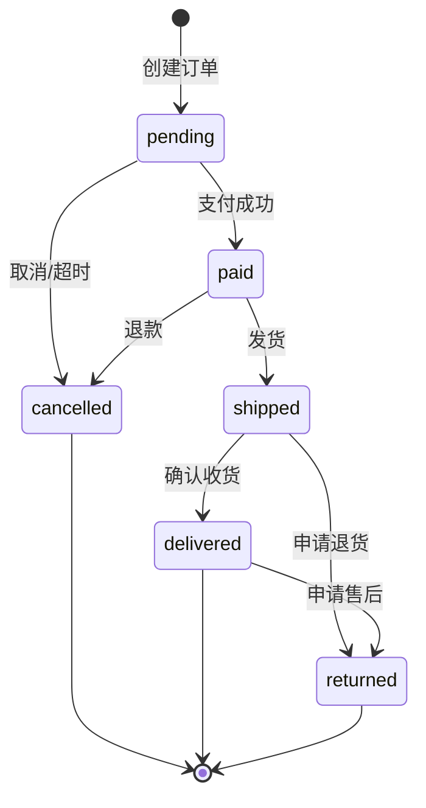

<!--
文档说明：
- 内容：订单管理模块的API接口规范，遵循OpenAPI 3.0标准
- 使用方法：API开发时的技术规范指导，确保接口一致性
- 更新方法：API设计变更时更新，需要架构师确认
- 引用关系：被api-implementation.md引用，遵循standards/openapi.yaml
- 更新频率：API设计变更时
-->

# 订单管理API规范

📝 **状态**: ✅ 规范完成  
📅 **创建日期**: 2025-01-27  
👤 **负责人**: 技术架构师  
🔄 **最后更新**: 2025-01-27  
📋 **版本**: v1.0.0  

## 规范概述

### API基础信息
- **基础路径**: `/api/v1/orders` (完整路径 = 全局前缀 + 模块前缀)
- **模块前缀**: `/orders` (在router.py中定义)
- **认证方式**: JWT Bearer Token
- **响应格式**: JSON
- **字符编码**: UTF-8

### 遵循标准
- [API设计标准](../../standards/api-standards.md) - 统一API设计规范
- [OpenAPI规范](../../standards/openapi.yaml) - 全局API契约
- [数据库标准](../../standards/database-standards.md) - 数据结构标准

## 数据模型定义

### 订单状态枚举
```yaml
OrderStatus:
  type: string
  enum:
    - pending      # 待支付
    - paid         # 已支付
    - shipped      # 已发货
    - delivered    # 已送达
    - cancelled    # 已取消
    - returned     # 已退货
```

### 核心数据模型
```yaml
# 订单基础信息
Order:
  type: object
  properties:
    id:
      type: integer
      format: int64
      description: 订单ID
    order_number:
      type: string
      maxLength: 32
      description: 订单号
    user_id:
      type: integer
      format: int64
      description: 用户ID
    status:
      $ref: '#/components/schemas/OrderStatus'
    subtotal:
      type: number
      format: decimal
      description: 小计金额
    shipping_fee:
      type: number
      format: decimal
      description: 运费
    discount_amount:
      type: number
      format: decimal  
      description: 折扣金额
    total_amount:
      type: number
      format: decimal
      description: 总金额
    shipping_address:
      type: string
      description: 收货地址
    shipping_method:
      type: string
      maxLength: 50
      description: 配送方式
    notes:
      type: string
      description: 订单备注
    created_at:
      type: string
      format: date-time
      description: 创建时间
    updated_at:
      type: string
      format: date-time
      description: 更新时间

# 订单商品项
OrderItem:
  type: object
  properties:
    id:
      type: integer
      format: int64
    order_id:
      type: integer
      format: int64
    product_id:
      type: integer
      format: int64
    sku_id:
      type: integer
      format: int64
    sku_code:
      type: string
      maxLength: 100
    product_name:
      type: string
      maxLength: 200
    sku_name:
      type: string
      maxLength: 200
    quantity:
      type: integer
      minimum: 1
    unit_price:
      type: number
      format: decimal
    total_price:
      type: number
      format: decimal
    created_at:
      type: string
      format: date-time
```

## API端点规范

### 1. 创建订单

```yaml
POST /orders:
  summary: 创建新订单
  description: 用户创建订单，扣减库存
  tags: [订单管理]
  security:
    - BearerAuth: []
  requestBody:
    required: true
    content:
      application/json:
        schema:
          type: object
          required: [items, shipping_address]
          properties:
            items:
              type: array
              minItems: 1
              maxItems: 50
              items:
                type: object
                required: [product_id, sku_id, quantity]
                properties:
                  product_id:
                    type: integer
                    format: int64
                  sku_id:
                    type: integer
                    format: int64
                  quantity:
                    type: integer
                    minimum: 1
                    maximum: 999
            shipping_address:
              type: object
              required: [recipient, phone, address]
              properties:
                recipient:
                  type: string
                  maxLength: 100
                phone:
                  type: string
                  maxLength: 20
                address:
                  type: string
                  maxLength: 500
            notes:
              type: string
              maxLength: 500
        example:
          items:
            - product_id: 123
              sku_id: 456
              quantity: 2
            - product_id: 124
              sku_id: 457
              quantity: 1
          shipping_address:
            recipient: "张三"
            phone: "13800138000"
            address: "北京市朝阳区xxx路xxx号"
          notes: "请小心轻放"
  responses:
    '201':
      description: 订单创建成功
      content:
        application/json:
          schema:
            type: object
            properties:
              success:
                type: boolean
                example: true
              code:
                type: integer
                example: 201
              message:
                type: string
                example: "订单创建成功"
              data:
                $ref: '#/components/schemas/OrderDetail'
              metadata:
                type: object
                properties:
                  request_id:
                    type: string
                  timestamp:
                    type: string
                    format: date-time
    '400':
      $ref: '#/components/responses/BadRequest'
    '401':
      $ref: '#/components/responses/Unauthorized'
    '422':
      $ref: '#/components/responses/ValidationError'
```

### 2. 获取订单列表

```yaml
GET /orders:
  summary: 获取订单列表
  description: 获取当前用户的订单列表，支持分页和状态筛选
  tags: [订单管理]
  security:
    - BearerAuth: []
  parameters:
    - name: status
      in: query
      schema:
        $ref: '#/components/schemas/OrderStatus'
      description: 订单状态筛选
    - name: page
      in: query
      schema:
        type: integer
        minimum: 1
        default: 1
      description: 页码
    - name: size
      in: query
      schema:
        type: integer
        minimum: 1
        maximum: 100
        default: 20
      description: 每页数量
    - name: start_date
      in: query
      schema:
        type: string
        format: date
      description: 开始日期筛选
    - name: end_date
      in: query
      schema:
        type: string
        format: date
      description: 结束日期筛选
  responses:
    '200':
      description: 订单列表获取成功
      content:
        application/json:
          schema:
            type: object
            properties:
              success:
                type: boolean
                example: true
              code:
                type: integer
                example: 200
              message:
                type: string
                example: "查询成功"
              data:
                type: object
                properties:
                  items:
                    type: array
                    items:
                      $ref: '#/components/schemas/Order'
                  pagination:
                    type: object
                    properties:
                      page:
                        type: integer
                      page_size:
                        type: integer
                      total_pages:
                        type: integer
                      total_items:
                        type: integer
                      has_next:
                        type: boolean
                      has_prev:
                        type: boolean
              metadata:
                type: object
                properties:
                  request_id:
                    type: string
                  timestamp:
                    type: string
                    format: date-time
    '401':
      $ref: '#/components/responses/Unauthorized'
```

### 3. 获取订单详情

```yaml
GET /orders/{order_id}:
  summary: 获取订单详情
  description: 获取指定订单的详细信息，包括订单项
  tags: [订单管理]
  security:
    - BearerAuth: []
  parameters:
    - name: order_id
      in: path
      required: true
      schema:
        type: integer
        format: int64
      description: 订单ID
  responses:
    '200':
      description: 订单详情获取成功
      content:
        application/json:
          schema:
            type: object
            properties:
              success:
                type: boolean
                example: true
              code:
                type: integer
                example: 200
              message:
                type: string
                example: "查询成功"
              data:
                $ref: '#/components/schemas/OrderDetail'
              metadata:
                type: object
    '401':
      $ref: '#/components/responses/Unauthorized'
    '403':
      $ref: '#/components/responses/Forbidden'
    '404':
      $ref: '#/components/responses/NotFound'
```

### 4. 更新订单状态

```yaml
PATCH /orders/{order_id}/status:
  summary: 更新订单状态
  description: 管理员更新订单状态，记录状态变更历史
  tags: [订单管理]
  security:
    - BearerAuth: []
  parameters:
    - name: order_id
      in: path
      required: true
      schema:
        type: integer
        format: int64
  requestBody:
    required: true
    content:
      application/json:
        schema:
          type: object
          required: [status]
          properties:
            status:
              $ref: '#/components/schemas/OrderStatus'
            remark:
              type: string
              maxLength: 500
              description: 状态变更备注
        example:
          status: "shipped"
          remark: "已通过顺丰快递发货，单号：SF123456789"
  responses:
    '200':
      description: 状态更新成功
      content:
        application/json:
          schema:
            type: object
            properties:
              success:
                type: boolean
                example: true
              code:
                type: integer
                example: 200
              message:
                type: string
                example: "状态更新成功"
              data:
                $ref: '#/components/schemas/Order'
    '400':
      $ref: '#/components/responses/BadRequest'
    '401':
      $ref: '#/components/responses/Unauthorized'
    '403':
      $ref: '#/components/responses/Forbidden'
    '404':
      $ref: '#/components/responses/NotFound'
```

### 5. 取消订单

```yaml
DELETE /orders/{order_id}:
  summary: 取消订单
  description: 用户取消自己的订单，恢复库存
  tags: [订单管理]
  security:
    - BearerAuth: []
  parameters:
    - name: order_id
      in: path
      required: true
      schema:
        type: integer
        format: int64
  requestBody:
    content:
      application/json:
        schema:
          type: object
          properties:
            reason:
              type: string
              maxLength: 500
              description: 取消原因
        example:
          reason: "不需要了"
  responses:
    '200':
      description: 订单取消成功
      content:
        application/json:
          schema:
            type: object
            properties:
              success:
                type: boolean
                example: true
              code:
                type: integer
                example: 200
              message:
                type: string
                example: "订单取消成功"
              data:
                $ref: '#/components/schemas/Order'
    '400':
      $ref: '#/components/responses/BadRequest'
    '401':
      $ref: '#/components/responses/Unauthorized'
    '403':
      $ref: '#/components/responses/Forbidden'
    '404':
      $ref: '#/components/responses/NotFound'
```

## 公共组件

### 认证安全
```yaml
components:
  securitySchemes:
    BearerAuth:
      type: http
      scheme: bearer
      bearerFormat: JWT
      description: JWT Token认证
```

### 通用响应
```yaml
components:
  responses:
    BadRequest:
      description: 请求参数错误
      content:
        application/json:
          schema:
            type: object
            properties:
              success:
                type: boolean
                example: false
              code:
                type: integer
                example: 400
              message:
                type: string
                example: "请求参数错误"
              error:
                type: object
                properties:
                  type:
                    type: string
                  details:
                    type: array
                    items:
                      type: object
    
    Unauthorized:
      description: 未授权访问
      content:
        application/json:
          schema:
            type: object
            properties:
              success:
                type: boolean
                example: false
              code:
                type: integer
                example: 401
              message:
                type: string
                example: "未授权访问"
    
    Forbidden:
      description: 权限不足
      content:
        application/json:
          schema:
            type: object
            properties:
              success:
                type: boolean
                example: false
              code:
                type: integer
                example: 403
              message:
                type: string
                example: "权限不足"
    
    NotFound:
      description: 资源不存在
      content:
        application/json:
          schema:
            type: object
            properties:
              success:
                type: boolean
                example: false
              code:
                type: integer
                example: 404
              message:
                type: string
                example: "订单不存在"
    
    ValidationError:
      description: 数据验证错误
      content:
        application/json:
          schema:
            type: object
            properties:
              success:
                type: boolean
                example: false
              code:
                type: integer
                example: 422
              message:
                type: string
                example: "数据验证失败"
              error:
                type: object
                properties:
                  type:
                    type: string
                    example: "VALIDATION_ERROR"
                  details:
                    type: array
                    items:
                      type: object
                      properties:
                        field:
                          type: string
                        message:
                          type: string
```

### 扩展数据模型
```yaml
# 订单详情（包含订单项）
OrderDetail:
  allOf:
    - $ref: '#/components/schemas/Order'
    - type: object
      properties:
        items:
          type: array
          items:
            $ref: '#/components/schemas/OrderItem'
        status_history:
          type: array
          items:
            type: object
            properties:
              id:
                type: integer
              old_status:
                type: string
              new_status:
                type: string
              remark:
                type: string
              operator_id:
                type: integer
              created_at:
                type: string
                format: date-time
```

## 状态码说明

| 状态码 | 说明 | 使用场景 |
|--------|------|----------|
| 200 | 成功 | 获取数据、更新成功 |
| 201 | 创建成功 | 订单创建 |
| 400 | 请求错误 | 参数错误、业务规则违反 |
| 401 | 未授权 | 未登录、Token无效 |
| 403 | 禁止访问 | 权限不足、资源所有权验证失败 |
| 404 | 资源不存在 | 订单不存在 |
| 422 | 数据验证失败 | 请求体格式错误、字段验证失败 |
| 500 | 服务器错误 | 系统异常 |

## 业务规则

### 订单创建规则
- 订单项数量：1-50个商品项
- 商品数量：每个SKU数量1-999个
- 库存检查：创建前必须验证库存充足
- 重复商品：同一订单不能包含重复SKU

### 订单状态流转规则


### 权限控制规则
- 普通用户只能操作自己的订单
- 管理员可以操作所有订单
- 状态更新仅限管理员权限
- 数据查询自动应用用户隔离

---

## 版本历史

| 版本 | 日期 | 变更说明 | 影响范围 |
|------|------|----------|----------|
| v1.0.0 | 2025-01-27 | 初版API规范，定义核心接口和数据模型 | 全模块API设计基础 |

## 相关文档

- [API实现文档](api-implementation.md) - 具体实现细节
- [技术设计文档](design.md) - 整体技术架构设计
- [API设计标准](../../standards/api-standards.md) - 通用API规范
- [OpenAPI全局契约](../../standards/openapi.yaml) - 系统级API标准

**注**: 本规范遵循OpenAPI 3.0标准，与全局API契约保持一致。